# Knowledge Graph Engine Specification V1

**File Path:** `assets/knowledge/graph/Knowledge_Graph_Engine_V1.md`  
**System ID:** `knowledge_graph_engine:v1`  
**System Class:** Knowledge Graph Engine  
**Status:** Production Ready  
**Version:** 1.0.0  
**Release Date:** 2026-06-28  
**Owner:** KarirGPS Chief Knowledge Graph Architect  
**Compatibility:** AI Constitution, Career Knowledge Ontology, KOS, UEGF, UKPP, UKVF, UKR, UKL, UKQF, UKEF, UKCF, Generator Development Standard V1, and all completed Batch 1-5 Entity Generators

---

## 0. Document Control

| Field | Value |
|---|---|
| Document name | Knowledge Graph Engine Specification V1 |
| Canonical file | `assets/knowledge/graph/Knowledge_Graph_Engine_V1.md` |
| System class | Knowledge Graph Engine |
| Release state | Production-ready implementation specification |
| Design boundary | Transforms finalized Knowledge Objects into a connected, validated, queryable, versioned graph. |
| Non-goal | Does not create, modify, redesign, fork, or extend generators, ontology, KOS, or core frameworks. |
| Upstream authorities | AI Constitution, Career Knowledge Ontology, KOS, UEGF, UKPP, UKVF, UKR, UKL, UKQF, UKEF, UKCF, Generator Development Standard V1 |
| Entity coverage | All completed Batch 1-5 Knowledge Object types registered in UKR. |
| Runtime posture | Deterministic, auditable, technology-neutral, graph-database compatible, AI-native, scalable to billions of nodes. |
| Change policy | Any change must preserve locked architecture authority and pass graph conformance tests. |

### 0.1 Mandatory Requirement Map

| Required Capability | Implemented Section |
|---|---|
| Purpose | Section 1 |
| Scope | Section 2 |
| Architecture | Section 3 |
| Graph Model Design | Section 4 |
| Node Schema | Section 5 |
| Edge Schema | Section 6 |
| Relationship Types System | Section 7 |
| Graph Construction Pipeline | Section 8 |
| Graph Ingestion Flow from UKPP → UKR → Graph | Section 9 |
| Deduplication Strategy | Section 10 |
| Entity Resolution Strategy | Section 11 |
| Cross-Generator Linking Rules | Section 12 |
| Ontology Alignment Rules | Section 13 |
| Graph Validation Rules with UKVF | Section 14 |
| Registry Integration with UKR | Section 15 |
| Evolution Synchronization with UKEF | Section 16 |
| Query Readiness Layer with UKQF | Section 17 |
| Graph Versioning System | Section 18 |
| Graph Partitioning Strategy | Section 19 |
| Scalability Model | Section 20 |
| Consistency Model | Section 21 |
| Event-Driven Graph Updates | Section 22 |
| Incremental Graph Updates | Section 23 |
| Batch Graph Builds | Section 24 |
| Graph Repair Mechanism | Section 25 |
| Graph Rebuild Strategy | Section 26 |
| Graph Observability | Section 27 |
| Graph Metrics | Section 28 |
| Graph Debugging Tools | Section 29 |
| Graph Explainability Layer | Section 30 |
| Required Diagrams | Section 31 |
| Required Examples | Section 32 |
| Conformance Tests | Section 33 |
| Production Readiness Checklist | Section 34 |
| Release Contract | Section 35 |

---

## 1. Purpose

The Knowledge Graph Engine V1 transforms isolated, valid, registry-managed KarirGPS Knowledge Objects into a living semantic graph that supports relationship traversal, reasoning, search, explainability, versioning, and evolution. It is the graph assembly and synchronization layer between the completed generator ecosystem and downstream query, recommendation, analytics, and AI reasoning systems.

The engine exists to make every generated object meaningful in context. A `skill` object is not only a standalone definition; it is linked to competencies, domains, tasks, careers, learning resources, certifications, licenses, regulations, technologies, tools, industries, organizations, education programs, majors, salary signals, and transition pathways. A `career` object is not only a profile; it becomes a graph neighborhood that explains what the career requires, how people can prepare for it, how it changes, what regulates it, what credentials influence it, and how it relates to other careers.

The Knowledge Graph Engine V1 provides the deterministic system that:

- converts KOS-compliant Knowledge Objects into canonical graph nodes;
- creates declared, inferred, compiled, and validated graph edges;
- aligns relationships with the locked Career Knowledge Ontology;
- resolves duplicate or equivalent entities without losing lineage;
- synchronizes all graph state with UKR registry identity and version rules;
- propagates object evolution and successor changes through affected subgraphs;
- prepares graph data for UKQF traversal, semantic search, recommendations, and AI-native reasoning;
- preserves full provenance, validation evidence, and auditability for every node and edge.

The engine is not an entity generator and does not produce new Knowledge Object types. It materializes and validates the graph representation of already generated objects.

---

## 2. Scope

### 2.1 In Scope

- Node projection from all UKR-registered Batch 1-5 Knowledge Object types.
- Edge projection from explicit object relationships, registry links, generator outputs, and UKCF graph triples.
- Relationship inference where inference is authorized by the locked ontology and supported by evidence, field semantics, and validation rules.
- Cross-generator linking across careers, skills, competencies, knowledge domains, work tasks, work activities, technologies, tools, industries, organizations, education programs, majors, certifications, licenses, learning resources, regulations, and all other completed Batch 1-5 registered entity families.
- Deduplication, entity resolution, canonical identity alignment, alias normalization, language normalization, and jurisdiction normalization.
- Graph validation through UKVF integration.
- Registry synchronization through UKR integration.
- Evolution synchronization through UKEF integration.
- Query readiness and indexing through UKQF integration.
- Graph versioning, partitioning, batch builds, incremental updates, event-driven updates, rebuilds, repairs, observability, metrics, debugging, and explainability.
- Technology-neutral compatibility with property graph databases, RDF/triple stores, document stores with graph overlays, vector indexes, columnar analytics stores, and hybrid graph-query engines.

### 2.2 Out of Scope

- Creating, revising, repairing, or modifying Knowledge Objects; this remains the responsibility of the completed entity generators and UKPP.
- Changing any ontology root, object specification, generator schema, validation framework, registry rules, query framework, evolution framework, compilation framework, or engineering standard.
- Inventing relationships that are not permitted by existing ontology and generator relationship contracts.
- Acting as an authoritative external data source.
- Replacing UKR as the source of identity truth.
- Replacing UKVF as the validation authority.
- Replacing UKQF as the query contract authority.
- Replacing UKEF as the lifecycle and evolution authority.

### 2.3 Authority Boundary

The graph engine is a materialization and synchronization system. It may compute graph projections, candidate links, inference edges, derived metrics, graph indexes, and query views. It may not alter the canonical object itself unless a repair recommendation is routed back to the appropriate generator and UKPP operation.

| Authority | Graph Engine Obligation |
|---|---|
| AI Constitution | Preserve truthfulness, explainability, safety, fairness, privacy, and non-deceptive reasoning in graph outputs. |
| Career Knowledge Ontology | Use only allowed entity types, relationship semantics, hierarchy rules, and graph constraints. |
| KOS | Preserve canonical identity, lifecycle, evidence, provenance, validation, registry, version, and compilation fields. |
| UEGF | Treat generator outputs as generator-owned objects; never act as a generator. |
| UKPP | Accept only pipeline-completed or pipeline-staged objects according to ingestion policy. |
| UKVF | Defer to validation results and invoke graph-specific validation suites. |
| UKR | Use registry identity as the canonical node identity source. |
| UKL | Preserve language normalization, localization equivalence, and terminology control. |
| UKQF | Prepare graph indexes and traversal views according to query framework contracts. |
| UKEF | Apply evolution, drift, deprecation, successor, and compatibility propagation rules. |
| UKCF | Consume compiled graph triples and produce graph-compatible releases without lossy transformation. |

---

## 3. Architecture

### 3.1 Architectural Principle

The Knowledge Graph Engine V1 is a deterministic, registry-synchronized graph materialization engine. Its canonical input is the validated Knowledge Object state held by UKR and produced by UKPP. Its canonical output is a versioned graph release composed of nodes, edges, indexes, graph validation reports, lineage logs, and query-ready views.

The engine has four architectural planes:

1. **Control Plane**: validates ingestion permissions, orchestrates build modes, enforces lifecycle state, manages graph versions, and records audit logs.
2. **Data Plane**: projects KOS objects into nodes, projects relationships into edges, materializes adjacency, creates partitions, and updates indexes.
3. **Reasoning Plane**: resolves identity, deduplicates candidates, infers approved relationships, computes graph metrics, and explains path derivations.
4. **Integration Plane**: synchronizes with UKPP, UKVF, UKR, UKL, UKQF, UKEF, and UKCF.

### 3.2 Component Architecture

| Component | Responsibility | Deterministic Output |
|---|---|---|
| Graph Build Orchestrator | Selects batch, incremental, event-driven, repair, or rebuild mode. | Build plan and build identifier. |
| UKR Snapshot Reader | Reads registry-approved object state and registry deltas. | Object stream with registry metadata. |
| KOS Projection Mapper | Converts Knowledge Objects into graph node payloads. | Canonical node candidates. |
| Relationship Projection Mapper | Converts explicit relationships and UKCF triples into edge candidates. | Canonical edge candidates. |
| Identity Resolver | Maps aliases, versions, localized labels, external IDs, and registry IDs to canonical node IDs. | Entity resolution decision. |
| Deduplication Engine | Detects duplicate node and edge candidates before graph release. | Merge, reject, or quarantine action. |
| Cross-Generator Linker | Creates authorized inter-entity edges across generator families. | Link delta with evidence and rule path. |
| Ontology Alignment Validator | Checks type, direction, cardinality, relation semantics, inverse semantics, and constraints. | Ontology validation report. |
| UKVF Graph Adapter | Runs graph-specific validation suites and receives validation verdicts. | Graph validation verdict. |
| UKR Sync Adapter | Writes graph materialization state, edge registry references, graph IDs, lineage, and version links. | Registry sync report. |
| UKEF Sync Adapter | Applies evolution propagation from changed objects into graph neighborhoods. | Evolution propagation report. |
| UKQF Readiness Builder | Creates traversal views, query facets, path templates, indexes, and retrieval payloads. | Query-ready graph bundle. |
| Partition Manager | Assigns nodes and edges to graph partitions and manages cross-partition references. | Partition manifest. |
| Version Manager | Creates immutable graph snapshots, deltas, and release channels. | Version manifest. |
| Observability Collector | Emits metrics, traces, logs, audit events, and debugging artifacts. | Observability stream. |
| Explainability Builder | Builds edge explanations, path explanations, inference proof chains, and confidence rationales. | Explanation package. |

### 3.3 Architecture Diagram

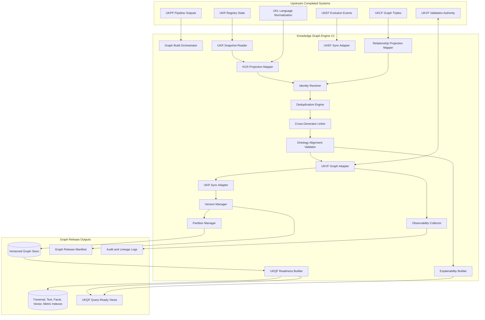

### 3.4 Runtime Modes

| Mode | Trigger | Input Scope | Output |
|---|---|---|---|
| `batch_build` | Scheduled or release build. | Full UKR-approved snapshot. | Full graph release. |
| `incremental_update` | Object delta, relationship delta, evidence refresh, or registry state change. | Affected object and neighborhood. | Delta release. |
| `event_update` | UKR, UKPP, UKEF, or validation event. | Event payload and impacted graph IDs. | Idempotent graph mutation. |
| `repair_build` | Validation failure or observed graph defect. | Defective subgraph and repair rules. | Repair delta or quarantine. |
| `rebuild` | Recovery, schema migration, or major release. | Complete registry and event log. | Recreated graph snapshot. |
| `query_index_refresh` | UKQF index freshness threshold or changed query facets. | Query-relevant delta. | Refreshed query layer. |

---

## 4. Graph Model Design

### 4.1 Canonical Graph Model

The engine uses a **canonical property graph model with RDF/triple compatibility**. Every Knowledge Object becomes a typed node. Every relationship becomes a typed edge. Every node and edge carries registry identity, version identity, lifecycle state, evidence metadata, validation status, provenance, language metadata, query facets, and audit metadata.

The model is technology-neutral. It can be implemented in a native graph database, relational tables with adjacency indexes, RDF triple stores, document stores with edge collections, object stores with graph manifests, distributed graph engines, vector-enabled retrieval systems, or hybrid architectures.

### 4.2 Model Requirements

| Requirement | Rule |
|---|---|
| Determinism | Given the same UKR snapshot, graph build configuration, ontology version, and engine version, the graph output must be byte-stable except for non-semantic runtime metadata. |
| Registry truth | Canonical node identity derives from UKR object identity. |
| Edge auditability | Every edge must state whether it is declared, compiled, inferred, repaired, migrated, or deprecated. |
| Evidence traceability | Every factual edge must link to evidence or state its derivation from validated object fields. |
| Temporal validity | Nodes and edges support effective dates, deprecation dates, successor links, and version ranges. |
| Query readiness | Nodes and edges must expose query facets, path metadata, and index hints required by UKQF. |
| Evolution safety | Superseded nodes and edges remain traceable and must not be silently overwritten. |
| Scalability | The model must support partitioned storage, streaming ingestion, and distributed indexing. |

### 4.3 Graph Spaces

| Graph Space | Purpose | Mutability | Query Exposure |
|---|---|---|---|
| `staging_graph` | Receives projected nodes and edges before full validation. | Mutable during build. | Internal only. |
| `candidate_graph` | Holds validated but unreleased graph candidates. | Mutable by build process. | Internal and QA. |
| `release_graph` | Serves accepted graph version for production queries. | Immutable per version. | Production. |
| `history_graph` | Preserves previous graph versions and evolution lineages. | Append-only. | Audit and time-travel queries. |
| `quarantine_graph` | Holds rejected, conflicting, ambiguous, or unsafe graph candidates. | Append-only with repair transitions. | Restricted diagnostics. |
| `derived_graph` | Stores materialized views, metrics, embeddings, and query accelerators. | Rebuildable. | Production if freshness-valid. |

### 4.4 Graph Identity Levels

| Identity Level | Description | Example |
|---|---|---|
| `object_identity` | UKR canonical identity for a Knowledge Object. | `skill:data_analysis:v1` |
| `node_identity` | Graph node identity derived from object identity and graph namespace. | `node:skill:data_analysis` |
| `version_identity` | Version-specific node instance. | `nodever:skill:data_analysis:1.3.0` |
| `edge_identity` | Deterministic hash of source, relation, target, qualifier, version, and derivation. | `edge:sha256:...` |
| `path_identity` | Deterministic hash of ordered node-edge sequence and query context. | `path:sha256:...` |
| `snapshot_identity` | Deterministic build ID for graph release snapshot. | `graph_snapshot:2026-06-28:release:sha256...` |

### 4.5 Node and Edge Model Diagram

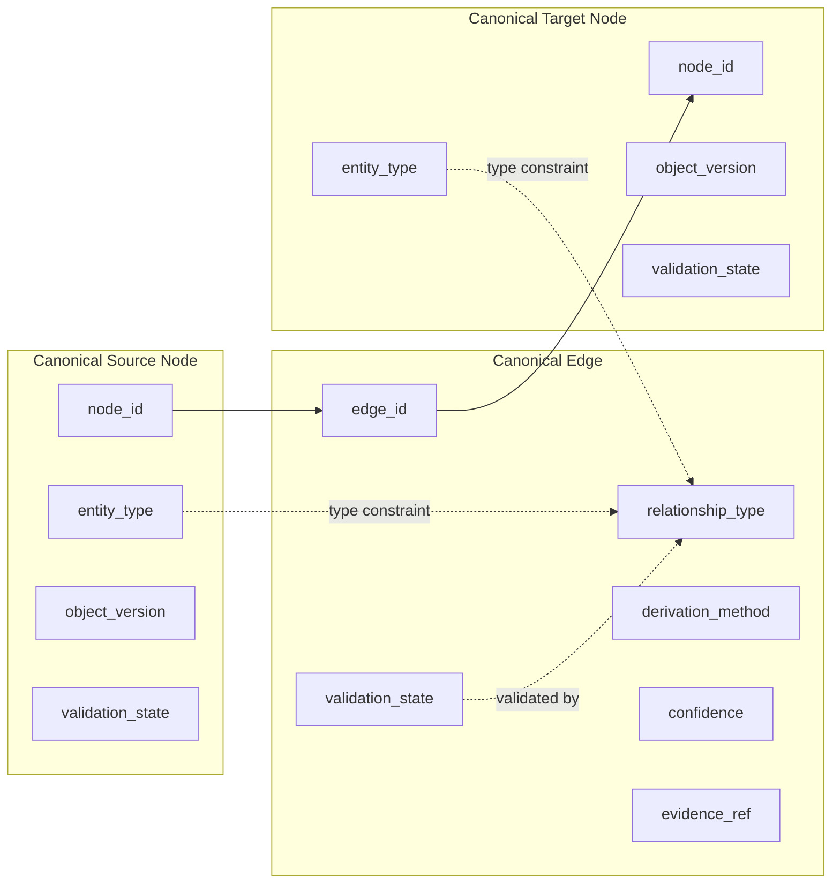

---

## 5. Node Schema

### 5.1 Canonical Node Schema

Every released graph node must conform to this schema. Field names are technology-neutral and can be compiled to JSON, graph properties, relational columns, triples, or index documents.

```yaml
node:
  node_id: string
  object_id: string
  object_type: string
  generator_id: string
  object_version: string
  graph_version: string
  canonical_label: string
  canonical_slug: string
  aliases: string[]
  language:
    canonical_language: string
    localized_labels: map<string,string>
    normalized_terms: string[]
  lifecycle:
    object_state: string
    graph_state: active | inactive | superseded | deprecated | retired | quarantined
    effective_from: date | null
    effective_until: date | null
    successor_node_ids: string[]
    predecessor_node_ids: string[]
  registry:
    ukr_registry_id: string
    registry_state: string
    registry_version: string
    registry_lineage_id: string
    dedup_cluster_id: string | null
  validation:
    ukvf_status: pass | fail | warning | not_required
    graph_validation_status: pass | fail | warning | quarantined
    last_validated_at: datetime
    validation_report_id: string
  evidence:
    evidence_refs: string[]
    evidence_quality_score: number
    evidence_freshness_state: current | aging | stale | unknown
  provenance:
    source_object_hash: string
    projection_rule_id: string
    created_by_system: string
    created_at: datetime
    updated_at: datetime
  quality:
    completeness_score: number
    trust_score: number
    conflict_score: number
    connectivity_score: number
  query:
    facets: map<string,string[]>
    searchable_text_ref: string
    embedding_ref: string | null
    traversal_hints: string[]
  audit:
    build_id: string
    event_ids: string[]
    release_channel: draft | candidate | production | archive
```

### 5.2 Required Node Invariants

| Invariant | Rule | Failure Code |
|---|---|---|
| Unique node identity | `node_id` must be globally unique inside a graph snapshot. | `node_identity_collision` |
| Registry identity present | `object_id` and `ukr_registry_id` must exist for every canonical node. | `missing_registry_identity` |
| Valid entity type | `object_type` must match an entity type registered in UKR. | `unknown_entity_type` |
| Generator traceability | `generator_id` must reference a completed generator or system source registered upstream. | `untraceable_generator` |
| Validation traceability | `validation_report_id` must exist for released nodes. | `missing_validation_report` |
| Lifecycle compatibility | `graph_state` must be compatible with KOS lifecycle and UKEF state. | `invalid_lifecycle_projection` |
| Language normalization | Canonical and localized labels must obey UKL normalization. | `language_normalization_failure` |
| Evidence constraint | Claims surfaced by node query text must be evidence-backed, evidence-limited, or object-derived. | `unsupported_node_claim` |
| No silent merge | Merged nodes must retain `dedup_cluster_id`, predecessor identities, and merge audit. | `silent_node_merge` |

### 5.3 Entity-Specific Node Facets

| Entity Family | Required Query Facets |
|---|---|
| Career | career family, industry, seniority, required skills, tasks, activities, transition targets, credential signals, regulatory exposure. |
| Skill | skill category, proficiency level, related competencies, prerequisite skills, tools, technologies, tasks, learning resources, validation credentials. |
| Competency | competency domain, observable behaviors, skills, tasks, assessment signals, career relevance. |
| Knowledge Domain | domain hierarchy, related competencies, skills, technologies, education alignment. |
| Work Task | task family, required skills, activities, tools, technologies, regulated status, career relevance. |
| Work Activity | activity cluster, task relationships, tools, technologies, environment, safety/compliance exposure. |
| Technology | technology family, supported skills, tools, industries, adoption maturity, career relevance. |
| Tool | tool category, technology dependencies, skills enabled, task usage, industry usage. |
| Industry | industry sector, careers, technologies, regulations, organizations, credentials, market signals. |
| Organization | organization type, issuer status, education provider status, regulator status, industry affiliation. |
| Education Program | learning outcomes, majors, careers, skills, credentials, accreditation and curriculum alignment. |
| Major | domains, programs, careers, skills, education pathways. |
| Certification | issuing authority, assessed skills, competencies, renewal, recognition scope, compliance relevance. |
| License | jurisdiction, legal authority, renewal, authorized careers/tasks, prerequisites, enforcement. |
| Learning Resource | resource type, difficulty, skills covered, domain alignment, sequencing, credibility, adaptive potential. |
| Regulation | jurisdiction, legal framework, compliance rules, affected industries, careers, skills, enforcement, temporal validity. |
| Market or Salary Signal | compensation range, geography, career, skill correlation, industry, evidence period, confidence. |

---

## 6. Edge Schema

### 6.1 Canonical Edge Schema

```yaml
edge:
  edge_id: string
  source_node_id: string
  target_node_id: string
  relationship_type: string
  relationship_family: string
  direction: directed | bidirectional_projected
  inverse_relationship_type: string | null
  qualifier:
    scope: string | null
    jurisdiction: string | null
    industry: string | null
    proficiency_level: string | null
    difficulty_level: string | null
    temporal_context: string | null
    population_scope: string | null
  derivation:
    derivation_method: declared | compiled | inferred | migrated | repaired | deprecated_projection
    source_field_paths: string[]
    inference_rule_id: string | null
    projection_rule_id: string
    confidence_score: number
    confidence_band: high | medium | low | untrusted
  evidence:
    evidence_refs: string[]
    evidence_quality_score: number
    evidence_freshness_state: current | aging | stale | unknown
  validation:
    ontology_validation_status: pass | fail | warning
    ukvf_validation_status: pass | fail | warning | not_required
    graph_validation_status: pass | fail | warning | quarantined
    validation_report_id: string
  lifecycle:
    edge_state: active | inactive | superseded | deprecated | retired | quarantined
    effective_from: date | null
    effective_until: date | null
    successor_edge_ids: string[]
    predecessor_edge_ids: string[]
  registry:
    ukr_source_object_id: string
    ukr_target_object_id: string
    ukr_relationship_ref: string | null
    registry_sync_state: synced | pending | rejected | quarantined
  versioning:
    graph_version: string
    source_object_version: string
    target_object_version: string
    edge_version: string
  audit:
    build_id: string
    event_ids: string[]
    created_at: datetime
    updated_at: datetime
    explanation_ref: string
```

### 6.2 Required Edge Invariants

| Invariant | Rule | Failure Code |
|---|---|---|
| Valid endpoints | Source and target nodes must exist in the same release or valid cross-snapshot reference space. | `missing_edge_endpoint` |
| Valid relationship type | `relationship_type` must be recognized by the ontology alignment registry. | `unknown_relationship_type` |
| Valid source-target pair | Relationship type must permit the source and target entity types. | `invalid_relationship_domain_range` |
| Direction is canonical | Direction must match the canonical ontology direction. | `invalid_edge_direction` |
| Inverse traceability | Bidirectional projections must identify canonical edge and projected inverse. | `missing_inverse_trace` |
| Evidence or derivation | Edge must be evidence-backed or field-derived from a validated object. | `unsupported_edge_claim` |
| Confidence bounded | `confidence_score` must be in `[0,1]` and confidence band must match configured thresholds. | `invalid_edge_confidence` |
| Lifecycle compatible | Active edges cannot connect only retired endpoints unless the relation is historical. | `invalid_edge_lifecycle` |
| No duplicate edge | Same source, relation, target, qualifier, and version must not duplicate in release graph. | `duplicate_edge` |
| Explainability required | Released edge must have an explanation reference. | `missing_edge_explanation` |

### 6.3 Edge Identity Formula

The engine must calculate edge IDs deterministically.

```text
edge_id = "edge:" + sha256(
  canonical_graph_namespace + "|" +
  source_node_id + "|" +
  relationship_type + "|" +
  target_node_id + "|" +
  normalized_qualifier_hash + "|" +
  derivation_method + "|" +
  source_object_version + "|" +
  target_object_version + "|" +
  ontology_version
)
```

The edge ID must not depend on runtime order, database-specific internal identifiers, ingestion timestamp, or non-deterministic model output.

---

## 7. Relationship Types System

### 7.1 Relationship Type Philosophy

The relationship type system is a controlled materialization of the locked Career Knowledge Ontology and entity generator relationship contracts. It is not a new ontology. It defines how already-authorized relationship semantics are represented, validated, indexed, versioned, explained, and queried in the graph.

Every relationship type must have:

- canonical name;
- relationship family;
- allowed source entity types;
- allowed target entity types;
- canonical direction;
- inverse projection behavior;
- cardinality policy;
- evidence policy;
- inference policy;
- lifecycle compatibility rule;
- query facet exposure;
- explanation template.

### 7.2 Relationship Families

| Family | Purpose | Example Relationship Types |
|---|---|---|
| Identity and equivalence | Links aliases, localized objects, external IDs, superseded versions, and merged clusters. | `SAME_AS`, `ALIAS_OF`, `LOCALIZED_AS`, `SUPERSEDED_BY`, `MERGED_INTO` |
| Taxonomy and hierarchy | Represents type, category, part-whole, and domain hierarchy. | `IS_A`, `PART_OF`, `HAS_SUBDOMAIN`, `BELONGS_TO_FAMILY` |
| Career capability | Connects careers to required or beneficial capabilities. | `REQUIRES_SKILL`, `REQUIRES_COMPETENCY`, `USES_KNOWLEDGE_DOMAIN`, `PERFORMS_TASK`, `INVOLVES_ACTIVITY` |
| Skill and competency structure | Represents skill dependency, competency composition, and domain grounding. | `DEPENDS_ON_SKILL`, `VALIDATES_COMPETENCY`, `COMPOSED_OF_SKILL`, `GROUNDED_IN_DOMAIN` |
| Work execution | Links tasks, activities, technologies, tools, environments, and roles. | `USES_TOOL`, `USES_TECHNOLOGY`, `ENABLES_TASK`, `SUPPORTS_ACTIVITY` |
| Industry and organization | Connects careers, tools, technologies, credentials, and regulations to industries and organizations. | `IN_INDUSTRY`, `USED_IN_INDUSTRY`, `ISSUED_BY`, `OFFERED_BY`, `GOVERNED_BY_ORGANIZATION` |
| Education and learning | Links education programs, majors, learning resources, domains, skills, careers, and credentials. | `PREPARES_FOR_CAREER`, `TEACHES_SKILL`, `COVERS_DOMAIN`, `ALIGNS_TO_CURRICULUM`, `SEQUENCED_BEFORE` |
| Credential and legal authorization | Connects certifications, licenses, skills, careers, education, regulations, and compliance. | `VALIDATES_SKILL`, `REQUIRES_CERTIFICATION`, `AUTHORIZES_CAREER`, `AUTHORIZES_TASK`, `DEPENDS_ON_EDUCATION` |
| Regulation and compliance | Represents legal, regulatory, safety, and compliance impacts. | `REGULATES_INDUSTRY`, `REGULATES_CAREER`, `REGULATES_TASK`, `IMPOSES_REQUIREMENT`, `ENFORCED_BY` |
| Market and outcome signals | Connects careers, skills, industries, salary signals, demand signals, and transitions. | `CORRELATES_WITH_SALARY`, `HAS_MARKET_DEMAND_SIGNAL`, `IMPROVES_TRANSITION_PROBABILITY` |
| Transition and pathway | Represents career movement, prerequisites, learning path order, and bridge requirements. | `TRANSITIONS_TO`, `BRIDGED_BY_SKILL`, `REQUIRES_UPSKILLING`, `NEXT_LEARNING_STEP` |
| Evidence and provenance | Links graph claims to evidence packages and source objects. | `SUPPORTED_BY_EVIDENCE`, `DERIVED_FROM_OBJECT`, `VALIDATED_BY_REPORT` |

### 7.3 Canonical Relationship Contract

```yaml
relationship_type_contract:
  relationship_type: string
  relationship_family: string
  source_entity_types: string[]
  target_entity_types: string[]
  canonical_direction: source_to_target | target_to_source
  inverse_projection:
    inverse_relationship_type: string | null
    query_visible: boolean
    stored_as_physical_edge: boolean
  cardinality:
    source_min: integer
    source_max: integer | unbounded
    target_min: integer
    target_max: integer | unbounded
  evidence_policy:
    required: boolean
    acceptable_sources: object_field | registry_link | compiled_triple | validated_inference | external_evidence_ref
    freshness_sensitive: boolean
  inference_policy:
    inference_allowed: boolean
    required_rule_id: string | null
    minimum_confidence: number
  lifecycle_policy:
    active_endpoint_requirement: both_active | source_active | target_active | historical_allowed
    deprecated_behavior: retain_historical | suppress_from_default_query | quarantine
  query_policy:
    exposed_to_ukqf: boolean
    traversal_cost_class: low | medium | high
    default_rank_weight: number
  explanation_policy:
    explanation_template_id: string
    required_fields: string[]
```

### 7.4 Core Relationship Type Matrix

| Relationship Type | Source | Target | Direction | Inference | Evidence Rule |
|---|---|---|---|---|---|
| `REQUIRES_SKILL` | Career | Skill | Career → Skill | Allowed from tasks, competencies, and generator-declared requirements. | Object field or validated inference. |
| `REQUIRES_COMPETENCY` | Career | Competency | Career → Competency | Allowed from task/skill clusters. | Object field or competency mapping. |
| `GROUNDED_IN_DOMAIN` | Skill, Competency | Knowledge Domain | Source → Domain | Allowed through domain mapping. | Object field or domain alignment rule. |
| `PERFORMS_TASK` | Career | Work Task | Career → Task | Declared or inferred through activity profile. | Object field. |
| `INVOLVES_ACTIVITY` | Work Task, Career | Work Activity | Source → Activity | Allowed if task/activity mapping exists. | Object field or validated task relation. |
| `USES_TECHNOLOGY` | Career, Skill, Task, Industry | Technology | Source → Technology | Allowed if technology supports or is used in source context. | Object field or evidence-backed relationship. |
| `USES_TOOL` | Career, Skill, Task, Activity | Tool | Source → Tool | Allowed through tool usage mapping. | Object field or evidence-backed relationship. |
| `USED_IN_INDUSTRY` | Technology, Tool, Skill | Industry | Source → Industry | Allowed through industry alignment. | Object field or validated industry signal. |
| `IMPLEMENTS_TECHNOLOGY` | Tool | Technology | Tool → Technology | Allowed when a tool embodies, implements, or depends on a technology. | Tool technology dependency field. |
| `ISSUED_BY` | Certification, License | Organization | Credential → Organization | Not inferred unless issuer field is normalized to organization. | Issuer field and authority evidence. |
| `VALIDATES_SKILL` | Certification | Skill | Certification → Skill | Allowed from assessment blueprint. | Assessment/competency mapping. |
| `VALIDATES_COMPETENCY` | Certification | Competency | Certification → Competency | Allowed from competency coverage. | Assessment/competency mapping. |
| `AUTHORIZES_CAREER` | License | Career | License → Career | Not inferred without legal validity rule. | License legal scope. |
| `AUTHORIZES_TASK` | License | Work Task | License → Task | Not inferred without legal validity rule. | License legal scope. |
| `REQUIRES_CERTIFICATION` | License, Career, Regulation | Certification | Source → Certification | Allowed if compliance rule requires certification. | Regulation/license/career object field. |
| `DEPENDS_ON_EDUCATION` | License, Certification, Career | Education Program, Major | Source → Education | Allowed from prerequisite fields. | Prerequisite evidence. |
| `TEACHES_SKILL` | Learning Resource, Education Program, Major | Skill | Source → Skill | Allowed through curriculum/resource outcomes. | Curriculum or resource mapping. |
| `COVERS_DOMAIN` | Learning Resource, Education Program, Major | Knowledge Domain | Source → Domain | Allowed through curriculum/domain coverage. | Curriculum or resource mapping. |
| `PREPARES_FOR_CAREER` | Education Program, Major, Learning Resource | Career | Source → Career | Allowed if learning outcomes align with career requirements. | Curriculum plus skill mapping. |
| `NEXT_LEARNING_STEP` | Learning Resource | Learning Resource | Resource → Resource | Allowed when prerequisite, difficulty, or sequence rule validates ordering. | Learning path sequencing rule. |
| `HAS_MARKET_DEMAND_SIGNAL` | Career, Skill, Industry, Technology | Market/Salary Signal | Source → Signal | Allowed only for scoped observed market signals. | Evidence period and confidence. |
| `REGULATES_INDUSTRY` | Regulation | Industry | Regulation → Industry | Not inferred unless jurisdiction and industry scope match. | Legal/regulatory scope. |
| `REGULATES_CAREER` | Regulation | Career | Regulation → Career | Allowed through license/task/industry impact. | Regulation scope or validated impact inference. |
| `REGULATES_TASK` | Regulation | Work Task | Regulation → Task | Allowed when rule governs task execution. | Compliance rule. |
| `IMPACTS_SKILL` | Regulation, Technology, Industry | Skill | Source → Skill | Allowed when impact is explicit or strongly derived. | Evidence-backed impact mapping. |
| `TRANSITIONS_TO` | Career | Career | Career → Career | Allowed through skill overlap and transition model. | Derived metrics plus transition rule. |
| `DEPENDS_ON_SKILL` | Skill | Skill | Skill → Skill | Allowed through prerequisite hierarchy. | Skill generator dependency field or validated inference. |
| `CORRELATES_WITH_SALARY` | Skill, Career, Industry | Market/Salary Signal | Source → Signal | Allowed only as statistical/correlation edge, not causal claim. | Evidence period and confidence. |

### 7.5 Relationship Confidence Bands

| Band | Score Range | Default Query Behavior |
|---|---:|---|
| High | `0.85 <= score <= 1.00` | Eligible for default recommendations and explanations. |
| Medium | `0.65 <= score < 0.85` | Eligible for exploratory traversal with confidence label. |
| Low | `0.40 <= score < 0.65` | Suppressed from default query; visible in diagnostics or broad exploration. |
| Untrusted | `0.00 <= score < 0.40` | Quarantined or retained only as rejected candidate. |

### 7.6 Relationship Derivation Classes

| Derivation Method | Meaning | Release Eligibility |
|---|---|---|
| `declared` | Relationship is explicitly present in a validated Knowledge Object. | Eligible after validation. |
| `compiled` | Relationship is produced by UKCF from validated object fields. | Eligible after validation. |
| `inferred` | Relationship is created from approved inference rules and evidence. | Eligible if confidence and validation pass. |
| `migrated` | Relationship is carried from previous graph version or successor mapping. | Eligible if still ontology-valid. |
| `repaired` | Relationship was corrected by deterministic repair mechanism. | Eligible only with repair report. |
| `deprecated_projection` | Relationship preserved for history or backward compatibility. | Not default-query visible unless requested. |

---

## 8. Graph Construction Pipeline

### 8.1 Pipeline Overview

The graph construction pipeline is deterministic and stage-gated. Each stage emits structured artifacts and cannot proceed if blocking validation fails.

| Stage | Name | Input | Output | Blocking Failures |
|---:|---|---|---|---|
| 0 | Build Plan Initialization | Build trigger, UKR snapshot pointer, engine configuration. | Build plan and build ID. | Invalid build mode, missing ontology version. |
| 1 | Registry Snapshot Acquisition | UKR object state and relationship refs. | Immutable input snapshot manifest. | Snapshot read failure, inconsistent registry state. |
| 2 | KOS Object Eligibility Filter | Registry snapshot. | Eligible object stream. | Invalid lifecycle state for release channel. |
| 3 | Node Projection | Eligible objects. | Node candidates. | Missing required node fields. |
| 4 | Relationship Projection | Object relationships and UKCF triples. | Edge candidates. | Malformed relationship payload. |
| 5 | Language and Normalization Pass | Node and edge candidates. | Normalized candidates. | UKL normalization failure. |
| 6 | Identity Resolution | Normalized candidates and UKR identity maps. | Canonical node mapping and resolution report. | Identity collision, unresolved canonical ID. |
| 7 | Deduplication | Canonical candidate sets. | Merge/reject/quarantine decisions. | Unsafe duplicate conflict. |
| 8 | Cross-Generator Linking | Candidate graph and linking rules. | Additional edge candidates and link explanations. | Invalid link domain/range. |
| 9 | Relationship Inference | Candidate graph and approved inference rules. | Inferred edge candidates. | Unsupported inference, low confidence. |
| 10 | Ontology Alignment | All candidate nodes and edges. | Ontology validation report. | Relationship type violation. |
| 11 | Graph Validation | Candidate graph. | UKVF graph validation verdict. | Blocking UKVF failure. |
| 12 | Partition Assignment | Validated candidate graph. | Partition manifest. | Partition key collision. |
| 13 | Version Assembly | Validated partitions and previous graph state. | Graph snapshot or delta. | Version conflict. |
| 14 | Registry Sync | Graph release artifacts. | UKR graph materialization references. | UKR write/sync rejection. |
| 15 | Query Readiness Build | Released graph. | UKQF traversal, text, facet, vector, metric indexes. | Query contract failure. |
| 16 | Observability and Audit Finalization | All stage reports. | Build audit package. | Missing audit artifact. |
| 17 | Release Promotion | Candidate graph release. | Production release pointer. | Failed release gate. |

### 8.2 Pipeline Diagram

```mermaid
flowchart LR
    A[Build Trigger] --> B[Build Plan Initialization]
    B --> C[UKR Snapshot Acquisition]
    C --> D[KOS Eligibility Filter]
    D --> E[Node Projection]
    D --> F[Relationship Projection]
    E --> G[UKL Normalization]
    F --> G
    G --> H[Identity Resolution]
    H --> I[Deduplication]
    I --> J[Cross-Generator Linking]
    J --> K[Relationship Inference]
    K --> L[Ontology Alignment]
    L --> M[UKVF Graph Validation]
    M --> N{Blocking Failure?}
    N -- Yes --> Q[Quarantine or Repair]
    Q --> R[Repair Report]
    N -- No --> O[Partition Assignment]
    O --> P[Version Assembly]
    P --> S[UKR Sync]
    S --> T[UKQF Index Build]
    T --> U[Audit Finalization]
    U --> V[Release Promotion]
```

### 8.3 Stage Gate Contract

Each stage emits:

```yaml
stage_gate_result:
  build_id: string
  stage_id: string
  stage_name: string
  input_hash: string
  output_hash: string
  status: pass | fail | warning | skipped
  blocking_failures: string[]
  non_blocking_warnings: string[]
  records_in: integer
  records_out: integer
  deterministic_seed: string | null
  validation_report_refs: string[]
  audit_event_id: string
```

The engine may use deterministic AI-assisted classification only when an upstream framework permits it, all inputs are fixed, the prompt/template version is fixed, and the result is validated before release. Non-deterministic outputs are not release-eligible.

---

## 9. Graph Ingestion Flow from UKPP → UKR → Graph

### 9.1 Ingestion Principle

UKPP produces or updates Knowledge Objects through completed generators. UKVF validates them. UKR registers identity, versions, lifecycle, deduplication state, and registry status. The graph engine ingests only UKR-authorized states or controlled staging states explicitly permitted by build mode.

### 9.2 Accepted Ingestion Sources

| Source | Accepted Content | Use |
|---|---|---|
| UKR registered object state | Canonical KOS object and registry metadata. | Primary node source. |
| UKR relationship registry refs | Registry-level declared relationships and merge lineage. | Primary edge identity source. |
| UKCF graph triples | Compiled relationship triples from objects. | Edge projection source. |
| UKPP completion event | Pipeline completion event for newly validated objects. | Event-driven update trigger. |
| UKVF validation report | Validation verdict and rule details. | Release gating and audit. |
| UKEF evolution event | Deprecation, successor, drift, compatibility, migration. | Evolution propagation trigger. |
| UKL language maps | Canonical, localized, and normalized terminology. | Label normalization and multilingual query facets. |

### 9.3 Ingestion Sequence Diagram

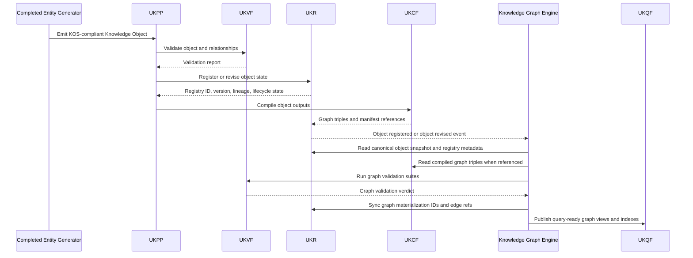

### 9.4 Ingestion Eligibility Rules

| Rule | Description | Failure Code |
|---|---|---|
| Registry status eligibility | Production graph may ingest only `registered`, `active`, or explicitly release-eligible states. | `registry_state_not_releasable` |
| Validation eligibility | Node and declared relationship inputs must have UKVF pass or permitted warning status. | `validation_not_release_eligible` |
| Lifecycle eligibility | Deprecated or retired objects are ingested only for history or compatibility views unless explicitly query-visible. | `lifecycle_not_query_visible` |
| Triple compatibility | UKCF triples must match object version and registry snapshot. | `compiled_triple_version_mismatch` |
| Source hash stability | Source object hash must match UKR snapshot hash. | `source_hash_mismatch` |
| Event idempotency | Replaying the same event must produce the same graph state. | `event_not_idempotent` |

---

## 10. Deduplication Strategy

### 10.1 Deduplication Principle

Deduplication prevents duplicate nodes and duplicate edges while preserving identity lineage. It never destroys evidence, provenance, version history, or localized variants. A deduplication decision is deterministic, scored, auditable, and reversible through graph history.

Deduplication is applied at five levels:

1. **Object-level duplicate**: two UKR objects represent the same real-world concept.
2. **Node-level duplicate**: two graph nodes point to the same canonical object or dedup cluster.
3. **Edge-level duplicate**: two edges express the same source, relationship, target, qualifier, derivation, and version.
4. **Alias-level duplicate**: multiple labels or localized terms resolve to the same node.
5. **Projection-level duplicate**: the same relationship is produced by multiple sources, such as declared object fields and UKCF triples.

### 10.2 Deduplication Signals

| Signal | Weight | Description |
|---|---:|---|
| Exact UKR object ID match | 1.00 | Same registry identity. |
| Exact external authoritative ID match | 0.95 | Same authoritative issuer/regulator/provider ID where available. |
| Normalized canonical label match | 0.70 | Same normalized canonical label under UKL rules. |
| Alias overlap | 0.50 | Shared aliases or localized names. |
| Entity type match | Required | Entity type must match unless UKR has cross-type merge authority. |
| Jurisdiction match | 0.70 | Required for licenses and regulations; important for certifications and salary signals. |
| Issuer/provider/regulator match | 0.60 | Strong for credentials, resources, regulations, and education. |
| Relationship neighborhood similarity | 0.45 | Similar connections to skills, domains, careers, tools, industries, or organizations. |
| Evidence source overlap | 0.40 | Same evidence packages or source documents. |
| Version lineage match | 0.90 | Predecessor/successor lineage indicates same entity across versions. |
| Semantic fingerprint match | 0.55 | Deterministic normalized description and field fingerprint similarity. |

### 10.3 Deduplication Decision Bands

| Score Band | Decision | Rule |
|---|---|---|
| `>= 0.97` | `auto_same_identity` | Allowed only if entity type and critical qualifiers are compatible. |
| `0.90 - 0.969` | `auto_merge_cluster` | Allowed if no blocking field conflict exists and UKR merge policy permits. |
| `0.80 - 0.899` | `candidate_duplicate_quarantine` | Not released as merged; requires repair or registry decision. |
| `0.65 - 0.799` | `possible_related_not_duplicate` | May create relatedness diagnostics but no merge. |
| `< 0.65` | `distinct_entities` | No merge action. |

For legal and regulatory objects, jurisdiction, authority, effective date, and legal scope are blocking constraints. A license in one jurisdiction must not be merged with a similar license in another jurisdiction unless UKR explicitly models cross-border recognition as a relationship rather than identity equivalence.

### 10.4 Deduplication Flow

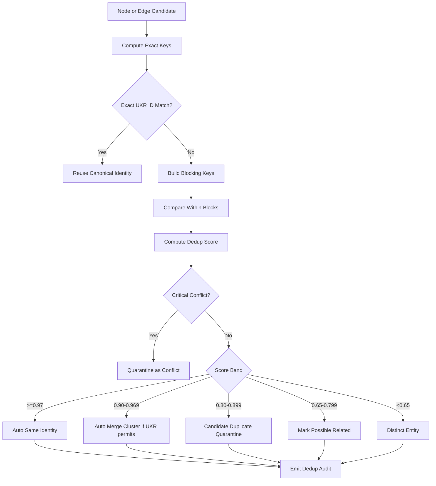

### 10.5 Edge Deduplication

Edges are duplicates when all of the following match after normalization:

- source node;
- relationship type;
- target node;
- qualifier hash;
- canonical direction;
- effective date range or overlapping lifecycle range;
- derivation method compatibility;
- source and target object versions, unless the edge is explicitly version-agnostic.

If two edges match but have different evidence packages, the engine must merge evidence references and preserve all source derivation paths. If confidence differs, the released edge confidence is computed by deterministic evidence aggregation rules and the prior values remain in the audit log.

---

## 11. Entity Resolution Strategy

### 11.1 Entity Resolution Principle

Entity resolution maps all object labels, aliases, localized terms, external references, registry IDs, predecessor IDs, successor IDs, and relationship endpoints into canonical graph node IDs. It is registry-first, ontology-constrained, language-normalized, jurisdiction-aware, and audit-preserving.

### 11.2 Resolution Order

The resolver must process identity signals in this order:

1. UKR canonical object ID.
2. UKR merge cluster and dedup lineage.
3. KOS predecessor/successor identity.
4. External authoritative IDs, where provided by the object and validated.
5. Entity-specific critical qualifiers.
6. UKL-normalized canonical label and aliases.
7. Relationship neighborhood and semantic fingerprints.
8. Controlled inference candidates.
9. Quarantine when identity remains ambiguous.

### 11.3 Blocking Keys by Entity Family

| Entity Family | Blocking Keys |
|---|---|
| Career | canonical career slug, occupation family, industry scope if specialized, seniority scope. |
| Skill | canonical skill slug, skill taxonomy branch, proficiency-independent core meaning. |
| Competency | competency slug, behavior domain, assessment context. |
| Knowledge Domain | domain path, parent domain, canonical taxonomy. |
| Work Task | task slug, work context, career family, activity cluster. |
| Work Activity | activity slug, task family, work context. |
| Technology | technology slug, vendor-neutral or vendor-specific scope, technology family. |
| Tool | tool slug, vendor/product identity, technology dependency. |
| Industry | industry code or canonical sector path. |
| Organization | legal name, organization type, jurisdiction, authoritative IDs. |
| Education Program | program title, provider, level, accreditation/jurisdiction where relevant. |
| Major | major name, domain family, education level/jurisdiction where relevant. |
| Certification | certification name, issuing authority, version, recognition scope. |
| License | license name, issuing authority, jurisdiction, legal scope, effective dates. |
| Learning Resource | resource title, provider/author, content type, edition/version, language. |
| Regulation | regulation title/code, jurisdiction, authority, effective date, legal framework. |
| Market or Salary Signal | source period, geography, career/skill scope, industry, compensation metric. |

### 11.4 Resolution Output Contract

```yaml
entity_resolution_decision:
  candidate_id: string
  canonical_node_id: string | null
  decision: resolved | new_node | merge_candidate | conflict | quarantined
  confidence_score: number
  blocking_keys_used: string[]
  matched_identity_signals: string[]
  conflicting_identity_signals: string[]
  registry_action_required: boolean
  ukr_merge_cluster_id: string | null
  explanation_ref: string
  audit_event_id: string
```

### 11.5 Resolution Safety Rules

- A license, regulation, or government-issued authorization cannot be resolved across jurisdictions by label similarity alone.
- A certification and a license cannot be merged even when they share issuer, name, or prerequisites; they may be linked through dependency relationships.
- A learning resource and an education program cannot be merged; a course object may be represented as learning resource or education program only according to upstream generator boundary decisions.
- Vendor tools and underlying technologies must not be merged; they can be linked by `IMPLEMENTS_TECHNOLOGY`, `USES_TECHNOLOGY`, or authorized equivalent relation.
- A skill and competency must not be merged; competencies can compose or validate skills.
- Salary/market signals must not be merged with careers or skills; they are evidence-scoped signal nodes linked by correlation relationships.

---

## 12. Cross-Generator Linking Rules

### 12.1 Linking Principle

Cross-generator linking turns isolated object neighborhoods into an integrated career intelligence graph. A link is eligible only when the source and target entity types, relationship type, evidence policy, lifecycle state, and ontology alignment rule all pass validation.

The graph engine may add cross-generator links from:

- explicit relationships declared in Knowledge Objects;
- UKCF graph triples compiled from validated object fields;
- UKR registry relationship references;
- approved inference rules that derive links from existing validated paths;
- evolution mappings from UKEF.

### 12.2 Core Cross-Generator Link Rules

| Rule ID | Source → Target | Relationship | Required Condition |
|---|---|---|---|
| `xlink.career.skill.required` | Career → Skill | `REQUIRES_SKILL` | Career object declares skill or inferred from required tasks/competencies with confidence ≥ 0.85. |
| `xlink.career.competency.required` | Career → Competency | `REQUIRES_COMPETENCY` | Career requirement maps to competency or competency cluster. |
| `xlink.skill.competency.composition` | Competency → Skill | `COMPOSED_OF_SKILL` | Competency object lists skill components. |
| `xlink.skill.domain.grounding` | Skill → Knowledge Domain | `GROUNDED_IN_DOMAIN` | Skill domain mapping exists and passes ontology alignment. |
| `xlink.career.task.performance` | Career → Work Task | `PERFORMS_TASK` | Career task profile includes task. |
| `xlink.task.activity.decomposition` | Work Task → Work Activity | `INVOLVES_ACTIVITY` | Task decomposes into activity or activity supports task. |
| `xlink.task.tool.usage` | Work Task → Tool | `USES_TOOL` | Task has validated tool usage. |
| `xlink.task.tech.usage` | Work Task → Technology | `USES_TECHNOLOGY` | Task requires or commonly uses technology. |
| `xlink.tool.tech.implementation` | Tool → Technology | `IMPLEMENTS_TECHNOLOGY` | Tool object indicates technology dependency. |
| `xlink.industry.tech.adoption` | Industry → Technology | `USES_TECHNOLOGY` | Industry object declares technology adoption or validated market evidence exists. |
| `xlink.industry.career.membership` | Career → Industry | `IN_INDUSTRY` | Career has industry scope or industry-specific specialization. |
| `xlink.organization.industry.affiliation` | Organization → Industry | `OPERATES_IN_INDUSTRY` | Organization object declares industry affiliation. |
| `xlink.cert.skill.validation` | Certification → Skill | `VALIDATES_SKILL` | Certification assessment blueprint maps to skill. |
| `xlink.cert.competency.validation` | Certification → Competency | `VALIDATES_COMPETENCY` | Certification validates competency outcomes. |
| `xlink.cert.org.issuer` | Certification → Organization | `ISSUED_BY` | Issuer authority resolves to organization node. |
| `xlink.license.career.authorization` | License → Career | `AUTHORIZES_CAREER` | License legal scope authorizes practice or occupation. |
| `xlink.license.task.authorization` | License → Work Task | `AUTHORIZES_TASK` | License legal scope authorizes task execution. |
| `xlink.license.cert.dependency` | License → Certification | `REQUIRES_CERTIFICATION` | License prerequisite includes certification. |
| `xlink.license.education.dependency` | License → Education Program | `DEPENDS_ON_EDUCATION` | License prerequisite includes education program. |
| `xlink.resource.skill.teaching` | Learning Resource → Skill | `TEACHES_SKILL` | Learning outcome maps to skill. |
| `xlink.resource.domain.coverage` | Learning Resource → Knowledge Domain | `COVERS_DOMAIN` | Resource content maps to domain. |
| `xlink.resource.sequence` | Learning Resource → Learning Resource | `SEQUENCED_BEFORE` | Difficulty/prerequisite sequence is validated. |
| `xlink.education.career.preparation` | Education Program/Major → Career | `PREPARES_FOR_CAREER` | Curriculum outcomes align to career requirements. |
| `xlink.reg.industry.scope` | Regulation → Industry | `REGULATES_INDUSTRY` | Regulation scope includes industry. |
| `xlink.reg.career.impact` | Regulation → Career | `REGULATES_CAREER` | Regulation affects career requirements or legal practice. |
| `xlink.reg.skill.impact` | Regulation → Skill | `IMPACTS_SKILL` | Regulation changes required compliance skill or competency. |
| `xlink.salary.skill.correlation` | Skill → Market/Salary Signal | `CORRELATES_WITH_SALARY` | Signal is statistical, scoped, evidence-backed, and not presented as causation. |
| `xlink.career.transition` | Career → Career | `TRANSITIONS_TO` | Transition model passes skill-overlap, gap, and evidence threshold. |

### 12.3 Link Creation Algorithm

```yaml
cross_generator_link_algorithm:
  input:
    source_node: canonical_node
    target_candidates: canonical_node[]
    relationship_contracts: relationship_type_contract[]
  steps:
    - select candidate pairs by entity-type compatibility
    - normalize labels, aliases, jurisdictions, and lifecycle states
    - retrieve explicit relationships and compiled triples
    - apply approved inference rules only when relationship contract permits inference
    - compute confidence score from evidence, field match, registry link, and path support
    - reject links below minimum confidence
    - validate domain/range, direction, cardinality, lifecycle, and evidence
    - emit edge candidate with derivation, explanation, and audit event
  output:
    link_delta:
      added_edges: edge[]
      rejected_edges: rejected_edge[]
      quarantined_edges: edge[]
```

### 12.4 Prohibited Cross-Generator Links

| Prohibition | Reason |
|---|---|
| Certification `AUTHORIZES_CAREER` unless the certification is legally equivalent to license in registry scope. | Prevents confusing credential with legal permission. |
| Regulation `VALIDATES_SKILL`. | Regulations impose or affect requirements; they do not validate skill mastery. |
| Learning Resource `AUTHORIZES_TASK`. | Learning resources teach; they do not grant legal authorization. |
| Salary Signal `REQUIRES_SKILL`. | Salary signals are observations, not requirements. |
| Skill `IS_A` Competency. | Skills and competencies are distinct ontology classes. |
| Tool `SAME_AS` Technology. | Product/tool and underlying technology are distinct. |
| Cross-jurisdiction license equivalence as `SAME_AS`. | Recognition is a relationship, not identity equivalence. |

---

## 13. Ontology Alignment Rules

### 13.1 Alignment Principle

Ontology alignment ensures graph structure remains consistent with the locked Career Knowledge Ontology and all completed generator contracts. The graph engine cannot introduce new entity roots, hidden relationship semantics, unapproved hierarchy rules, or uncontrolled shortcuts.

### 13.2 Core Ontology Constraints

| Constraint | Rule |
|---|---|
| Entity type closure | All node `object_type` values must exist in UKR entity type registry. |
| Relationship closure | All edge `relationship_type` values must exist in the relationship type contract set derived from ontology and generator specs. |
| Domain/range validity | Relationship source and target entity types must match the contract. |
| Directionality | Canonical direction must be preserved; inverse views must be marked as query projections. |
| Cardinality | Relationship counts must not violate contract cardinality. |
| Lifecycle compatibility | Active query graph must not promote retired/superseded objects as current unless explicitly historical. |
| Semantic separation | Neighboring entity types must not be merged or substituted. |
| Jurisdiction integrity | Legal and regulatory relationships must preserve jurisdiction and effective date. |
| Evidence integrity | Evidence-sensitive relationships must carry source evidence or validated derivation. |
| Query integrity | Query-ready paths must not bypass mandatory intermediate concepts when ontology requires them. |

### 13.3 Canonical Graph Backbone

The graph engine preserves the canonical career intelligence backbone:

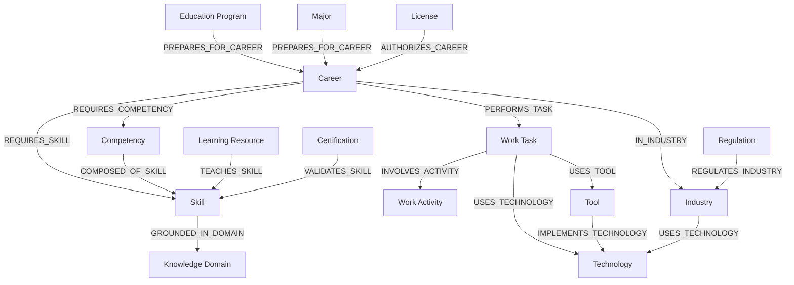

### 13.4 Alignment Failure Classes

| Failure Code | Meaning | Required Action |
|---|---|---|
| `unknown_node_type` | Node type is not registered. | Reject or quarantine. |
| `unknown_relationship_type` | Relationship type is not recognized. | Reject edge. |
| `invalid_domain_range` | Source-target pair violates contract. | Reject or repair direction/type if deterministic. |
| `invalid_cardinality` | Relationship exceeds allowed count. | Apply priority rule or quarantine. |
| `semantic_boundary_violation` | Edge collapses distinct ontology classes. | Reject edge and report source. |
| `jurisdiction_scope_violation` | Legal/regulatory relationship crosses jurisdiction incorrectly. | Quarantine and require corrected scope. |
| `temporal_scope_violation` | Relationship claims active validity outside effective dates. | Convert to historical edge or reject. |
| `unsupported_inference` | Inference not allowed by contract. | Reject inferred edge. |

---

## 14. Graph Validation Rules with UKVF

### 14.1 Validation Principle

The graph engine delegates validation authority to UKVF and adds graph-specific validation suites. A graph release is valid only when both object-level validation and graph-level validation pass for the target release channel.

### 14.2 Graph Validation Suites

| Suite | Validates | Blocking for Production |
|---|---|---|
| `graph.schema` | Required node and edge fields, data types, ID formats, version fields. | Yes |
| `graph.identity` | Unique IDs, registry references, dedup clusters, alias mappings. | Yes |
| `graph.ontology` | Relationship domain/range, direction, cardinality, hierarchy rules. | Yes |
| `graph.evidence` | Evidence refs, derivation support, freshness, unsupported claims. | Yes for evidence-sensitive edges |
| `graph.lifecycle` | Active/deprecated/retired/superseded compatibility. | Yes |
| `graph.temporal` | Effective dates, version windows, successor timelines, regulation validity. | Yes |
| `graph.jurisdiction` | License/regulation jurisdiction, cross-border recognition, local/global scope. | Yes for legal/regulatory nodes |
| `graph.connectivity` | Orphans, unreachable nodes, expected backbone links, isolated clusters. | Warning or blocking by entity criticality |
| `graph.query_readiness` | UKQF facets, traversal hints, searchable text, index manifests. | Yes |
| `graph.explainability` | Explanation refs for edges, inferred paths, confidence rationale. | Yes for release-visible inferred edges |
| `graph.performance_profile` | Partition sizes, index load, build scalability constraints. | Warning unless deployment threshold exceeded |
| `graph.audit` | Build logs, stage gates, event refs, lineage completeness. | Yes |

### 14.3 Validation Result Contract

```yaml
graph_validation_report:
  report_id: string
  graph_build_id: string
  graph_version: string
  validation_mode: strict | exploratory | repair | historical
  ukvf_version: string
  ontology_version: string
  suites:
    - suite_id: string
      status: pass | fail | warning
      checked_records: integer
      failures: validation_failure[]
      warnings: validation_warning[]
  release_verdict: releasable | releasable_with_warnings | not_releasable | quarantined
  required_repairs: repair_instruction[]
  audit_event_id: string
```

### 14.4 Release Gates

| Gate | Rule |
|---|---|
| Object validation gate | All release-visible nodes must originate from UKVF-validated Knowledge Objects. |
| Relationship validation gate | All release-visible edges must pass graph ontology validation. |
| Evidence gate | Evidence-sensitive edges must meet evidence quality and freshness policy. |
| Dedup gate | No unresolved high-confidence duplicate may exist in release graph. |
| Query gate | Required UKQF index manifests must be complete. |
| Evolution gate | Deprecated and superseded nodes must have correct successor/predecessor behavior. |
| Audit gate | Build must have complete stage reports and deterministic hashes. |

---

## 15. Registry Integration with UKR

### 15.1 Registry Sync Principle

UKR remains the identity and lifecycle source of truth. The graph engine synchronizes graph materialization state back to UKR without changing object meaning. UKR records which graph versions contain which object versions and which edge identities were materialized.

### 15.2 UKR Sync Responsibilities

| Sync Item | Direction | Description |
|---|---|---|
| Object identity | UKR → Graph | Node IDs derive from UKR object IDs and dedup clusters. |
| Object lifecycle | UKR → Graph | Graph state follows object lifecycle with graph-specific query visibility. |
| Registry version | UKR → Graph | Node version metadata uses UKR version. |
| Merge lineage | UKR → Graph | Dedup clusters and predecessor identities become graph lineage properties. |
| Graph materialization refs | Graph → UKR | UKR records graph snapshot and node materialization ID. |
| Edge materialization refs | Graph → UKR | UKR records deterministic edge IDs and relationship registry refs where applicable. |
| Validation reports | Graph → UKR | UKR receives graph validation report references. |
| Quarantine reports | Graph → UKR | UKR receives rejected/ambiguous graph candidates linked to source objects. |

### 15.3 Registry Sync Contract

```yaml
ukr_graph_sync_record:
  sync_id: string
  graph_build_id: string
  graph_version: string
  object_id: string
  object_version: string
  node_id: string
  node_version_id: string
  materialization_state: materialized | skipped | quarantined | deprecated_projection
  edge_ids:
    declared: string[]
    compiled: string[]
    inferred: string[]
    migrated: string[]
  validation_report_id: string
  partition_id: string
  query_index_refs: string[]
  lineage_refs: string[]
  synced_at: datetime
```

### 15.4 UKR Conflict Handling

If UKR and graph state conflict, UKR identity and lifecycle win. The graph engine must not override UKR. It must create a conflict report and trigger repair or rebuild for affected partitions.

| Conflict | Resolution |
|---|---|
| Node references unregistered object | Quarantine node and edges. |
| Graph has active node for UKR-retired object | Convert to historical/deprecated projection and remove from default query view. |
| UKR merge cluster conflicts with graph dedup cluster | Re-resolve nodes using UKR cluster as source of truth. |
| UKR object version changed after snapshot | Reject build or re-run affected incremental update. |
| UKR relationship deleted | Deprecate corresponding graph edge with lineage. |

---

## 16. Evolution Synchronization with UKEF

### 16.1 Evolution Principle

The graph must evolve when objects evolve. UKEF governs drift detection, lifecycle transitions, successor creation, compatibility, migration, deprecation, and retirement. The graph engine propagates these changes through affected neighborhoods while preserving historical traceability.

### 16.2 Evolution Event Types

| Event Type | Graph Action |
|---|---|
| `object.updated` | Reproject node and affected edges. |
| `object.evidence_refreshed` | Update evidence state, confidence, freshness, and query ranking. |
| `object.deprecated` | Mark node deprecated, suppress from default query if required, retain historical paths. |
| `object.superseded` | Create `SUPERSEDED_BY` edge, migrate compatible relationships to successor if permitted. |
| `object.retired` | Move node to historical view unless required for lineage. |
| `relationship.changed` | Revalidate edge, update version, recalculate path indexes. |
| `ontology.compatibility_rule.changed` | Revalidate affected relationship families. |
| `jurisdiction.rule.changed` | Revalidate license/regulation/certification legal relationships. |
| `market_signal.expired` | Deprecate stale salary/demand correlation edges or reduce confidence. |

### 16.3 Evolution Propagation Flow

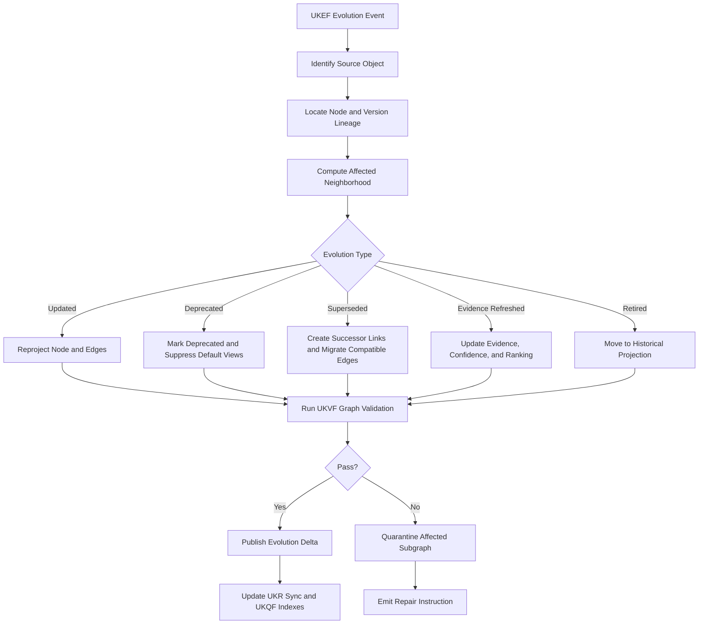

### 16.4 Relationship Migration Rules

| Source Node Evolution | Relationship Behavior |
|---|---|
| Minor version update | Preserve edges if source/target semantics and validation pass. |
| Major version update | Revalidate all declared, compiled, and inferred edges. |
| Deprecation | Keep historical edges; remove from default production traversal unless policy says otherwise. |
| Supersession | Create successor edge; migrate compatible relationships; mark non-compatible relationships retired. |
| Retirement | Keep only audit, lineage, historical query, and migration edges. |
| Jurisdiction invalidation | Revalidate legal/regulatory edges; suppress invalid active authorizations. |
| Evidence decay | Lower confidence or mark edge stale; retain with freshness warning if still query-visible. |

---

## 17. Query Readiness Layer with UKQF

### 17.1 Query Readiness Principle

The graph engine prepares data for UKQF but does not replace UKQF. Query readiness means every release graph provides traversal views, indexes, facets, ranking hints, explainability references, and retrieval payloads needed for deterministic and AI-native query execution.

### 17.2 Query Readiness Artifacts

| Artifact | Purpose |
|---|---|
| Adjacency index | Fast traversal by node, relationship type, direction, and qualifier. |
| Facet index | Filtering by entity type, industry, geography, jurisdiction, lifecycle, difficulty, credential type, regulation type, and other query facets. |
| Text index | Keyword and normalized label search over canonical labels, aliases, descriptions, and query text. |
| Vector index | Semantic retrieval over UKCF-generated embedding text and graph neighborhoods. |
| Path template index | Precompiled traversal patterns for common questions. |
| Neighborhood summary | AI-readable compressed representation of node context. |
| Explanation index | Edge and path explanation lookup. |
| Temporal index | Time-travel and effective-date queries. |
| Confidence index | Filtering and ranking by trust, evidence quality, and confidence. |
| Compliance index | Legal, licensing, certification, regulation, and jurisdiction queries. |
| Learning path index | Ordered skill/resource/career path traversal. |
| Transition index | Career-to-career movement, gaps, bridge resources, and credential requirements. |
| Market signal index | Salary and demand signals by career, skill, industry, geography, and evidence period. |

### 17.3 UKQF Query View Contract

```yaml
ukqf_graph_view:
  graph_version: string
  view_id: string
  view_type: traversal | semantic_retrieval | faceted_search | temporal | compliance | learning_path | transition | market_signal
  entity_scope: string[]
  relationship_scope: string[]
  index_refs: string[]
  freshness_state: current | aging | stale
  default_filters:
    lifecycle: active
    confidence_minimum: number
    evidence_state: current_or_aging
  explanation_required: boolean
  audit_ref: string
```

### 17.4 Common Query Path Templates

| Query Intent | Path Template |
|---|---|
| What skills are required for a career? | `Career -REQUIRES_SKILL-> Skill` |
| What competencies support a skill? | `Skill <-COMPOSED_OF_SKILL- Competency` |
| What knowledge domains ground a career? | `Career -REQUIRES_SKILL-> Skill -GROUNDED_IN_DOMAIN-> KnowledgeDomain` |
| How can I transition from career A to career B? | `CareerA -TRANSITIONS_TO-> CareerB` plus gap path through skills and learning resources. |
| What resources teach missing skills? | `Career -REQUIRES_SKILL-> Skill <-TEACHES_SKILL- LearningResource` |
| What certifications validate this skill? | `Skill <-VALIDATES_SKILL- Certification -ISSUED_BY-> Organization` |
| What license authorizes this career? | `Career <-AUTHORIZES_CAREER- License -ISSUED_BY-> Organization` |
| What regulations affect this industry? | `Industry <-REGULATES_INDUSTRY- Regulation` |
| What technologies are important in an industry? | `Industry -USES_TECHNOLOGY-> Technology` and `Career -IN_INDUSTRY-> Industry -USES_TECHNOLOGY-> Technology` |
| What skills correlate with salary signals? | `Skill -CORRELATES_WITH_SALARY-> MarketSalarySignal` |

### 17.5 Indexing Strategy Diagram

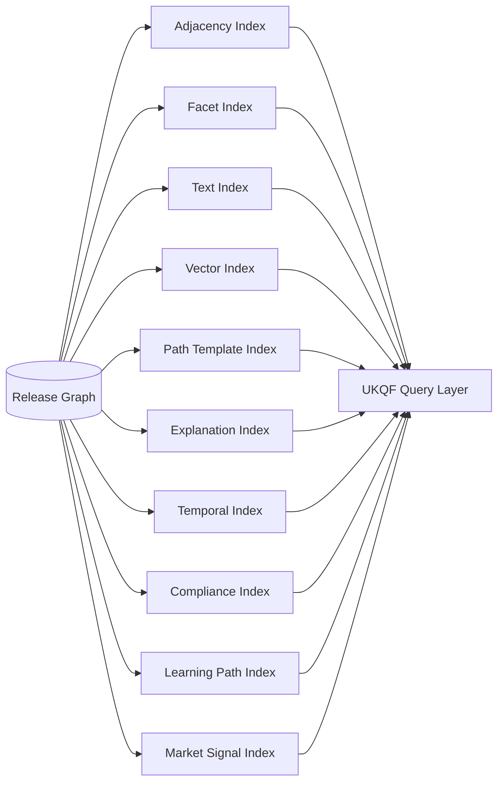

---

## 18. Graph Versioning System

### 18.1 Versioning Principle

Graph versions are immutable release snapshots or deterministic deltas. A graph version states exactly which object versions, edge versions, ontology version, validation version, engine version, and index versions were used. Queries must be able to reference current state or a historical graph version.

### 18.2 Version Types

| Version Type | Description |
|---|---|
| `snapshot_version` | Full graph build from a UKR snapshot. |
| `delta_version` | Incremental change set applied to a previous snapshot. |
| `index_version` | Query index build tied to graph version. |
| `partition_version` | Partition-level state for distributed graph storage. |
| `view_version` | UKQF query-ready view state. |
| `history_version` | Archived version used for audit and time-travel. |

### 18.3 Graph Version Manifest

```yaml
graph_version_manifest:
  graph_version: string
  graph_build_id: string
  parent_graph_version: string | null
  version_type: snapshot | delta | repair_delta | rebuild
  release_channel: draft | candidate | production | archive
  engine_version: string
  ontology_version: string
  kos_version: string
  ukvf_version: string
  ukr_snapshot_id: string
  ukef_event_range: string | null
  object_counts_by_type: map<string,integer>
  edge_counts_by_type: map<string,integer>
  partition_manifest_ref: string
  index_manifest_refs: string[]
  validation_report_id: string
  audit_log_ref: string
  deterministic_hash: string
  created_at: datetime
```

### 18.4 Version Rules

- Production graph versions are immutable.
- Delta versions must reference exactly one parent version.
- Repair deltas must include defect IDs, repair rules, and validation reports.
- Rebuild versions must prove equivalence to source snapshot or state intentional differences.
- Deprecated nodes and edges remain addressable by historical version queries.
- Query indexes must never claim freshness beyond their corresponding graph version.

### 18.5 Time-Travel Query Support

The versioning system must support queries such as:

- “What skills were required for this career in graph version X?”
- “Which regulation change caused this license edge to be removed?”
- “What learning resources were recommended before a certification was superseded?”
- “How did a career transition path change after a technology object evolved?”

---

## 19. Graph Partitioning Strategy

### 19.1 Partitioning Principle

The graph must scale from thousands to billions of nodes by partitioning without breaking semantic traversal or auditability. Partitioning must be deterministic, reproducible, and query-aware.

### 19.2 Partition Dimensions

| Dimension | Use | Examples |
|---|---|---|
| Entity family | Keeps high-volume entity types manageable. | skill, career, learning_resource, regulation. |
| Ontology domain | Groups related knowledge areas. | health, finance, manufacturing, software. |
| Industry | Optimizes industry-specific traversal. | healthcare, logistics, mining, education. |
| Geography/jurisdiction | Critical for licenses, regulations, salary, and local credentials. | country, province, legal jurisdiction. |
| Language/locale | Supports multilingual labels and localized views. | en, id, regional variants. |
| Lifecycle state | Separates active query graph from historical graph. | active, deprecated, retired. |
| Hash shard | Distributes high-volume nodes evenly. | shard_0001 to shard_N. |
| Temporal bucket | Supports time-series market signals and regulation changes. | monthly, quarterly, yearly. |

### 19.3 Partition Assignment Formula

```text
partition_id = partition_strategy_version + ":" +
               primary_entity_family + ":" +
               normalized_domain_or_industry + ":" +
               normalized_jurisdiction_or_global + ":" +
               lifecycle_query_class + ":" +
               hash(node_id) mod shard_count
```

For edges, the primary partition is the source node partition. Cross-partition edges are indexed in both source and target adjacency views while retaining one canonical edge identity.

### 19.4 Cross-Partition Edge Policy

| Edge Type | Storage Policy | Query Policy |
|---|---|---|
| High-frequency local edge | Store in source partition and mirror lightweight target pointer. | Traverse locally first. |
| Cross-domain backbone edge | Store canonical edge once and index in both partitions. | Use path planner. |
| Legal/regulatory edge | Store by regulation/license jurisdiction and mirror affected target. | Enforce jurisdiction filter. |
| Market/salary signal edge | Store by signal geography and time bucket; index target career/skill. | Require evidence period filter. |
| Historical edge | Store in history partition; expose only to time-travel or audit views. | Suppressed from default query. |

---

## 20. Scalability Model

### 20.1 Scalability Goal

The graph engine must support growth to billions of nodes and tens or hundreds of billions of edges without changing the logical graph contract.

### 20.2 Scalability Principles

- Stateless build workers with deterministic partition ownership.
- Immutable snapshots and append-only deltas for safe parallel builds.
- Streaming ingestion for event updates.
- Bulk loaders for batch graph builds.
- Sharded adjacency indexes for high-degree nodes.
- Materialized query views for common UKQF paths.
- Separation of canonical graph storage from derived indexes.
- Compaction of historical deltas into periodic snapshots.
- Backpressure and quarantine for problematic partitions.
- Deterministic replay from UKR snapshot plus event log.

### 20.3 Scale Tiers

| Tier | Node Count | Edge Count | Required Capabilities |
|---|---:|---:|---|
| Tier 1 | up to 10 million | up to 200 million | Single-region partitioning, batch builds, incremental updates. |
| Tier 2 | 10 million - 1 billion | 200 million - 20 billion | Distributed partitions, streaming updates, sharded indexes, query views. |
| Tier 3 | 1 billion+ | 20 billion+ | Multi-region partitioning, async index builds, graph summaries, high-degree node controls, tiered storage. |

### 20.4 High-Degree Node Strategy

Some nodes, such as broad skills, large industries, common technologies, and global regulations, may have extremely high degree. The engine must manage them through:

- degree-aware partitioning;
- adjacency pagination;
- relationship-type-specific adjacency lists;
- top-k materialized summaries;
- query intent filtering;
- temporal and jurisdiction filters;
- cached neighborhood summaries;
- path cost limits;
- high-degree warning metrics.

### 20.5 AI-Native Scalability

For AI-native use, the engine must not send large raw neighborhoods directly to models. It must produce bounded, explainable, query-specific graph context packets containing:

- selected paths;
- node summaries;
- relationship explanations;
- confidence and evidence metadata;
- omitted-neighborhood counts;
- version and freshness details.

---

## 21. Consistency Model

### 21.1 Consistency Principle

The graph engine uses strong consistency for canonical identity and release snapshots, and controlled eventual consistency for derived query indexes. Queries must disclose the graph and index versions used.

### 21.2 Consistency Classes

| Consistency Area | Model | Rule |
|---|---|---|
| UKR identity | Strong | Node identity must match UKR snapshot. |
| Graph release snapshot | Strong and immutable | Production release pointer changes atomically. |
| Incremental deltas | Ordered per object and partition | Events must be idempotent and sequence-aware. |
| Derived indexes | Eventual with freshness manifest | Query layer must know index freshness state. |
| Observability metrics | Eventually consistent | Metrics can lag but must not affect graph correctness. |
| Historical graph | Append-only consistent | Historical records must not be mutated except through corrective audit events. |

### 21.3 Atomicity Rules

- A production graph version is published atomically only after validation and index readiness gates pass.
- Partial partition builds cannot become production-visible.
- If index build fails, graph release may remain candidate or production graph may publish with previous compatible index only if UKQF allows it and freshness is disclosed.
- Edge updates affecting legal, license, regulation, or compliance views require stricter gating before default query visibility.

### 21.4 Idempotency Rules

Every event-driven update must be idempotent. Replaying the same event must produce the same node, edge, index, validation, and audit state.

```text
idempotency_key = sha256(event_id + event_type + object_id + object_version + graph_parent_version)
```

---

## 22. Event-Driven Graph Updates

### 22.1 Event Principle

The graph engine reacts to upstream events while preserving deterministic graph state. Event-driven updates are used for low-latency synchronization; batch builds remain the authority for full release regeneration.

### 22.2 Event Types

| Event Type | Producer | Graph Action |
|---|---|---|
| `ukpp.object.completed` | UKPP | Ingest new or revised object after registry registration. |
| `ukr.object.registered` | UKR | Create node and declared/compiled edges. |
| `ukr.object.revised` | UKR | Reproject node and affected edges. |
| `ukr.object.merged` | UKR | Update dedup cluster and merge lineage. |
| `ukr.object.deprecated` | UKR/UKEF | Change graph state and query visibility. |
| `ukr.relationship.changed` | UKR | Add, update, deprecate, or remove edge. |
| `ukvf.validation.changed` | UKVF | Revalidate affected graph elements. |
| `ukef.evolution.detected` | UKEF | Apply evolution propagation. |
| `ukcf.compilation.changed` | UKCF | Re-ingest compiled triples or query text. |
| `ukl.language_map.changed` | UKL | Refresh labels, aliases, text indexes, and localization views. |
| `ukqf.query_contract.changed` | UKQF | Rebuild query readiness layer. |

### 22.3 Event Payload Contract

```yaml
graph_update_event:
  event_id: string
  event_type: string
  event_time: datetime
  producer_system: UKPP | UKR | UKVF | UKEF | UKCF | UKL | UKQF
  object_id: string | null
  object_version: string | null
  relationship_ref: string | null
  affected_entity_types: string[]
  affected_jurisdictions: string[]
  parent_graph_version: string
  payload_hash: string
  priority: critical | high | normal | low
  replay_policy: idempotent
  audit_ref: string
```

### 22.4 Event Processing Flow

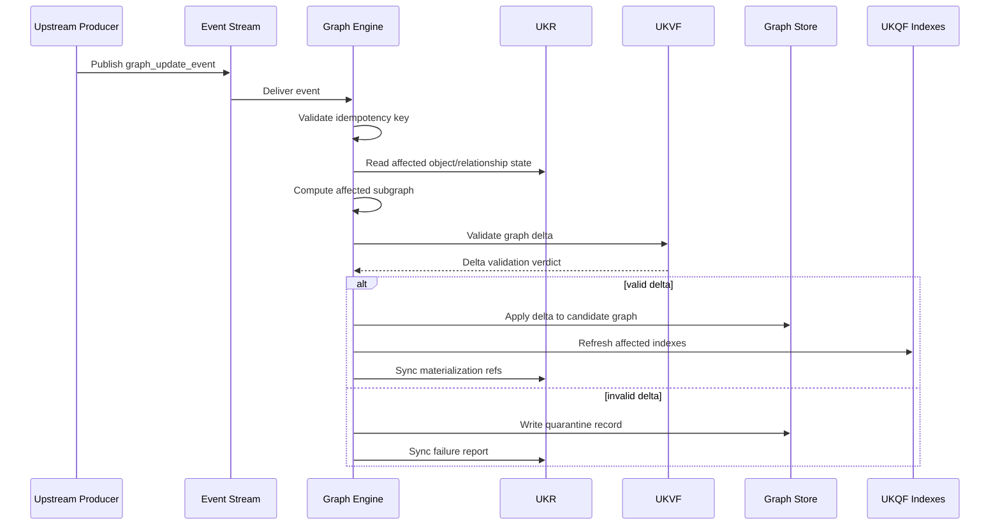

---

## 23. Incremental Graph Updates

### 23.1 Incremental Update Principle

Incremental updates modify only the affected subgraph while preserving snapshot consistency and release safety. The update scope is computed from changed objects, relationship types, partitions, query views, and evolution dependencies.

### 23.2 Affected Subgraph Calculation

For an object update, the affected subgraph includes:

- the object node;
- declared edges from the object;
- incoming edges to the object;
- inferred edges whose rule inputs include the object;
- dedup cluster members;
- successor/predecessor lineage;
- query materialized paths containing the node;
- indexes where node facets, text, embeddings, temporal state, or compliance state appear;
- high-priority legal/regulatory neighborhoods where changes affect default query safety.

### 23.3 Incremental Update Steps

1. Receive validated update event.
2. Read parent graph version and affected UKR object state.
3. Lock or isolate affected partition range in candidate graph context.
4. Reproject node and relationship candidates.
5. Re-run entity resolution and dedup only for affected blocks.
6. Re-run cross-generator linking for affected relationship families.
7. Re-run inference rules whose inputs changed.
8. Validate delta with UKVF graph suites.
9. Apply delta to candidate graph.
10. Refresh affected UKQF indexes and materialized path views.
11. Record delta version and audit log.
12. Promote delta if release gates pass.

### 23.4 Incremental Delta Contract

```yaml
graph_delta:
  delta_id: string
  parent_graph_version: string
  resulting_graph_version: string
  delta_type: object_update | relationship_update | evolution | repair | index_refresh
  added_nodes: string[]
  updated_nodes: string[]
  deprecated_nodes: string[]
  added_edges: string[]
  updated_edges: string[]
  deprecated_edges: string[]
  affected_partitions: string[]
  affected_indexes: string[]
  validation_report_id: string
  audit_event_ids: string[]
```

---

## 24. Batch Graph Builds

### 24.1 Batch Build Principle

Batch builds construct a complete graph snapshot from an immutable UKR state. They are used for initial graph creation, scheduled releases, major quality upgrades, partition changes, ontology compatibility validation, and disaster recovery.

### 24.2 Batch Build Phases

| Phase | Description |
|---|---|
| Snapshot freeze | Capture immutable UKR snapshot and framework version set. |
| Object scan | Read all release-eligible objects by entity family. |
| Parallel node projection | Project nodes by partition-compatible entity groups. |
| Parallel edge projection | Project declared and compiled edges. |
| Global identity resolution | Build identity maps, merge clusters, and alias maps. |
| Dedup pass | Deduplicate nodes and edges globally or by blocking key. |
| Cross-generator linking | Build authorized relationships across entity families. |
| Inference pass | Generate approved inferred edges. |
| Full graph validation | Run UKVF graph suites across entire candidate graph. |
| Partition materialization | Write canonical partitions and cross-partition indexes. |
| Query index build | Build UKQF indexes and materialized views. |
| Release manifest | Create graph version manifest and deterministic hash. |
| Release promotion | Atomically publish production pointer. |

### 24.3 Batch Build State Machine

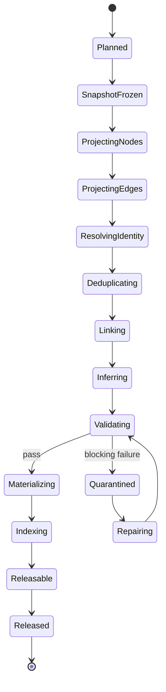

### 24.4 Batch Build Determinism Controls

- Sort all input objects by canonical UKR object ID.
- Sort relationships by source ID, relationship type, target ID, qualifier hash, and derivation method.
- Use fixed normalization rules from UKL.
- Use fixed relationship contracts from ontology alignment registry.
- Use deterministic hash-based partition assignment.
- Use stable tie-breakers for dedup decisions.
- Emit deterministic manifests and hashes.

---

## 25. Graph Repair Mechanism

### 25.1 Repair Principle

Graph repair corrects graph materialization defects without altering canonical Knowledge Objects directly. When object data is defective, repair recommendations are routed to UKPP and the appropriate generator. Graph-level repair is limited to deterministic, auditable actions that preserve lineage.

### 25.2 Repair Categories

| Category | Examples | Repair Location |
|---|---|---|
| Projection repair | Missing query facet, wrong derived field, stale index reference. | Graph engine. |
| Edge direction repair | Inverse relationship projected as canonical direction incorrectly. | Graph engine if deterministic. |
| Duplicate edge repair | Same edge emitted by declared and compiled source. | Graph engine. |
| Partition repair | Node assigned to wrong partition due to stale partition rule version. | Graph engine. |
| Index repair | Query index missing released edge. | Graph engine/UKQF readiness layer. |
| Object content repair | Missing certification issuer, invalid license jurisdiction, unsupported regulation claim. | Route to generator through UKPP. |
| Registry repair | Incorrect merge cluster, stale lifecycle state. | UKR. |
| Validation repair | Rule mismatch or outdated validation report. | UKVF and graph engine. |
| Evolution repair | Successor edge missing or stale migration. | UKEF and graph engine. |

### 25.3 Repair Action Contract

```yaml
graph_repair_action:
  repair_id: string
  defect_id: string
  repair_class: projection | edge | partition | index | lineage | registry_route | generator_route | evolution_route
  scope:
    graph_version: string
    node_ids: string[]
    edge_ids: string[]
    partition_ids: string[]
  preconditions: string[]
  deterministic_action: string
  expected_delta: graph_delta
  validation_required: boolean
  rollback_plan: string
  audit_event_id: string
```

### 25.4 Conflict Resolution Flow

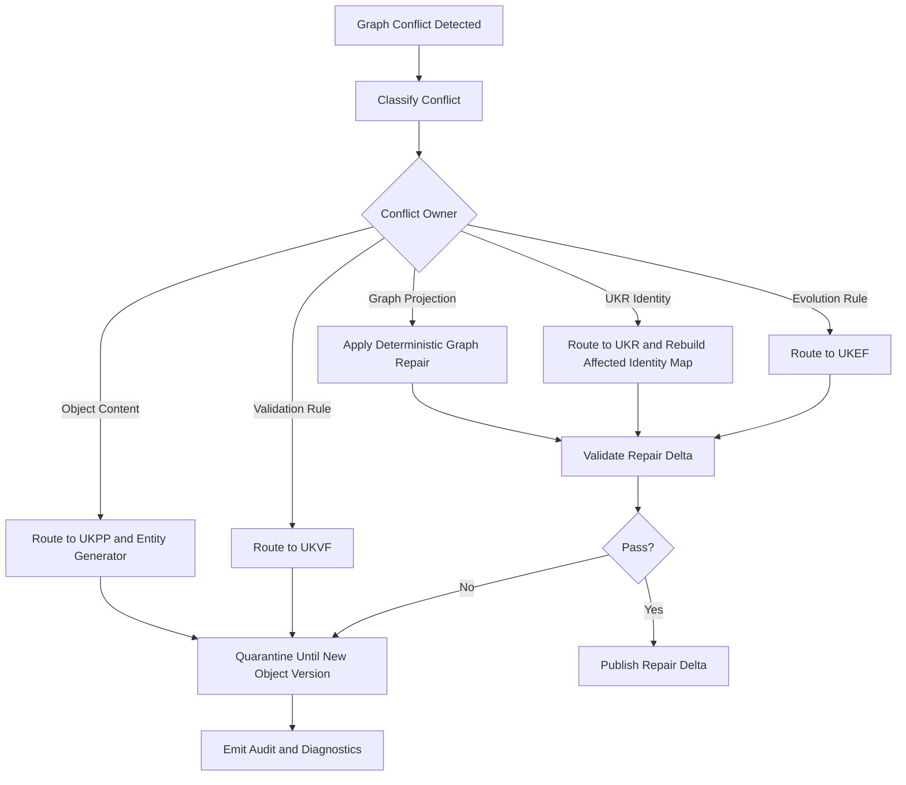

### 25.5 Repair Safety Rules

- Never repair by fabricating missing evidence.
- Never infer legal authorization from certification unless license/regulation contract permits it.
- Never merge distinct entity types during graph repair.
- Never hide a validation failure by suppressing the affected element without quarantine/audit.
- Never overwrite a previous graph version; publish a repair delta.

---

## 26. Graph Rebuild Strategy

### 26.1 Rebuild Principle

A graph rebuild recreates a graph snapshot from UKR, UKCF, UKVF, UKEF event logs, and deterministic engine configuration. Rebuilds are used when full consistency must be restored, partition strategies change, index compatibility changes, or disaster recovery is required.

### 26.2 Rebuild Modes

| Mode | Purpose |
|---|---|
| `clean_rebuild` | Build graph from a fresh UKR snapshot without using previous graph artifacts. |
| `equivalence_rebuild` | Rebuild same graph version to prove deterministic reproducibility. |
| `migration_rebuild` | Rebuild using new graph engine version or partition strategy while preserving object meaning. |
| `repair_rebuild` | Rebuild after systemic defect or validation rule correction. |
| `disaster_recovery_rebuild` | Recreate graph from registry snapshots and event logs after data loss. |

### 26.3 Rebuild Inputs

- UKR immutable snapshot.
- UKCF compiled outputs and graph triples referenced by snapshot.
- UKVF validation reports for object and graph validation.
- UKEF evolution events up to rebuild cutoff.
- UKL normalization maps.
- UKQF query contract version.
- Ontology relationship contract set.
- Graph engine version and deterministic configuration.
- Previous graph manifest if equivalence or migration rebuild.

### 26.4 Rebuild Equivalence Checks

| Check | Rule |
|---|---|
| Node set equivalence | Node IDs and object versions match expected set. |
| Edge set equivalence | Edge IDs and relationship contracts match expected set. |
| Partition equivalence | Partition assignment matches strategy version. |
| Validation equivalence | Validation verdicts match or intentional differences are documented. |
| Index equivalence | Query index documents match graph version. |
| Audit equivalence | Build stage hashes are reproducible. |

---

## 27. Graph Observability

### 27.1 Observability Principle

The graph must be observable at build time, update time, query preparation time, and validation time. Observability exists to prove correctness, detect drift, identify graph defects, explain quality, and support safe operations.

### 27.2 Observability Streams

| Stream | Captures |
|---|---|
| Build logs | Stage progress, counts, hashes, gate decisions, timing. |
| Validation logs | UKVF suite results, failures, warnings, release verdicts. |
| Dedup logs | Candidate clusters, scores, merge decisions, conflicts. |
| Entity resolution logs | Identity signals, canonical decisions, ambiguous cases. |
| Link creation logs | Cross-generator link rules, confidence, evidence, rejected edges. |
| Evolution logs | UKEF events, affected neighborhoods, migration outcomes. |
| Index logs | UKQF index build status, document counts, freshness, failures. |
| Query readiness logs | View creation, path template coverage, high-degree warnings. |
| Performance traces | Partition throughput, memory pressure, edge fan-out, index latency. |
| Audit events | Immutable records for every release-visible mutation. |

### 27.3 Observability Event Schema

```yaml
graph_observability_event:
  event_id: string
  graph_build_id: string
  graph_version: string
  event_category: build | validation | dedup | resolution | linking | evolution | index | query_readiness | repair | release
  severity: debug | info | warning | error | critical
  entity_type: string | null
  node_id: string | null
  edge_id: string | null
  partition_id: string | null
  message: string
  metrics: map<string,number>
  related_report_refs: string[]
  timestamp: datetime
```

### 27.4 Operational Health States

| State | Meaning |
|---|---|
| `healthy` | Latest production graph and query indexes pass all required gates. |
| `degraded_index` | Graph is valid but some derived indexes are stale or rebuilding. |
| `degraded_partition` | One or more partitions have warnings but production safety is preserved. |
| `blocked_release` | Candidate graph cannot be promoted due to blocking validation failure. |
| `quarantine_growth` | Conflicts or invalid candidates exceed configured threshold. |
| `rebuild_required` | Consistency or systemic defect requires full rebuild. |

---

## 28. Graph Metrics

### 28.1 Metric Categories

| Category | Metrics |
|---|---|
| Volume | Node count, edge count, node count by type, edge count by type, partition size, index document count. |
| Quality | Validation pass rate, warning rate, conflict rate, orphan rate, evidence freshness, confidence distribution. |
| Connectivity | Average degree, median degree, high-degree node list, connected component count, backbone coverage. |
| Deduplication | Duplicate candidate count, auto-merge count, quarantine count, false-positive review rate if review metadata exists. |
| Entity resolution | Resolution pass rate, ambiguous resolution rate, external ID coverage, alias coverage. |
| Cross-linking | Edges created by generator family, rejected link count, inferred edge confidence, relationship coverage. |
| Evolution | Evolution event count, propagation latency, successor migration success, stale edge count. |
| Query readiness | Index freshness, path template coverage, query view completeness, index build time. |
| Performance | Build throughput, incremental update latency, partition processing time, index refresh time. |
| Audit | Missing audit artifact count, lineage completeness, reproducibility hash mismatch count. |

### 28.2 Core Metrics Definitions

```yaml
graph_metrics:
  graph_version: string
  node_total: integer
  edge_total: integer
  node_count_by_type: map<string,integer>
  edge_count_by_type: map<string,integer>
  validation_pass_rate: number
  orphan_node_ratio: number
  unresolved_duplicate_ratio: number
  quarantined_candidate_count: integer
  average_degree: number
  p95_degree: number
  high_degree_node_count: integer
  evidence_current_ratio: number
  inferred_edge_ratio: number
  low_confidence_edge_ratio: number
  evolution_propagation_p95_seconds: number
  index_freshness_seconds: number
  query_view_completeness_ratio: number
  deterministic_rebuild_match: boolean
```

### 28.3 Metric Thresholds

| Metric | Production Target | Action if Violated |
|---|---:|---|
| Validation pass rate | `100%` for blocking suites | Block release. |
| Missing registry identity | `0` | Block release. |
| Missing edge explanation | `0` for release-visible edges | Block release. |
| Orphan ratio | Entity-dependent; default `< 2%` | Warn or block for backbone entities. |
| Unresolved high-confidence duplicates | `0` | Block release or quarantine. |
| Stale legal/regulatory edge ratio | `0` in default compliance view | Block compliance index release. |
| Query view completeness | `>= 99.5%` for required views | Degrade or block release. |
| Deterministic rebuild mismatch | `false` expected | Investigate and block equivalence certification. |

---

## 29. Graph Debugging Tools

### 29.1 Debugging Principle

Debugging tools must make graph construction explainable and auditable without requiring engineers to inspect raw storage internals. Every debugging tool operates against graph manifests, validation reports, lineage logs, and query-ready views.

### 29.2 Required Debugging Tools

| Tool | Purpose | Input | Output |
|---|---|---|---|
| Node Inspector | Shows projected node, source object, validation, registry, evidence, lifecycle, and query facets. | `node_id` | Node diagnostic report. |
| Edge Inspector | Shows relationship contract, endpoints, derivation, evidence, confidence, lifecycle, and explanation. | `edge_id` | Edge diagnostic report. |
| Path Explainer | Explains why a traversal path exists and whether it is default-query eligible. | path or query result | Path explanation report. |
| Graph Diff | Compares two graph versions by nodes, edges, indexes, validation, and partitions. | two graph versions | Diff manifest. |
| Partition Inspector | Shows partition membership, cross-partition edges, load, and validation state. | `partition_id` | Partition report. |
| Dedup Cluster Inspector | Shows identity signals, merge decisions, conflicts, and lineage. | `dedup_cluster_id` | Dedup report. |
| Entity Resolution Trace | Explains how a candidate resolved to a canonical node. | candidate ID or object ID | Resolution trace. |
| Orphan Explorer | Finds nodes missing expected backbone links. | entity type or graph version | Orphan report. |
| Conflict Inspector | Shows unresolved conflicts by owner: graph, UKR, UKVF, UKPP, UKEF. | conflict ID | Conflict report. |
| Query Replay | Replays a UKQF query against a fixed graph and index version. | query ID and graph version | Replay report. |
| Evolution Impact Simulator | Shows affected neighborhoods before applying evolution delta. | evolution event | Impact report. |
| Index Coverage Inspector | Verifies UKQF index documents against graph nodes and edges. | graph version | Coverage report. |

### 29.3 Debug Report Contract

```yaml
graph_debug_report:
  report_id: string
  tool_name: string
  graph_version: string
  input_ref: string
  findings:
    - severity: info | warning | error | critical
      finding_code: string
      description: string
      affected_nodes: string[]
      affected_edges: string[]
      related_reports: string[]
      recommended_action: string
  reproducibility:
    build_id: string
    snapshot_id: string
    index_versions: string[]
  generated_at: datetime
```

---

## 30. Graph Explainability Layer

### 30.1 Explainability Principle

The graph must explain why every release-visible relationship and query path exists. Explainability is mandatory for AI-native reasoning, user trust, compliance, debugging, and auditability.

### 30.2 Explanation Levels

| Level | Explains |
|---|---|
| Node explanation | Why a node exists, what object generated it, and whether it is current. |
| Edge explanation | Why a relationship exists, how it was derived, and what evidence supports it. |
| Path explanation | Why a multi-hop path is valid, what each hop means, and what confidence applies. |
| Query explanation | Why a result was returned, ranked, filtered, or suppressed. |
| Evolution explanation | Why a node/edge changed, was superseded, deprecated, or migrated. |
| Conflict explanation | Why a candidate was rejected, quarantined, or marked ambiguous. |

### 30.3 Edge Explanation Schema

```yaml
edge_explanation:
  explanation_id: string
  edge_id: string
  summary: string
  relationship_type: string
  source_label: string
  target_label: string
  derivation_method: declared | compiled | inferred | migrated | repaired | deprecated_projection
  rule_path: string
  source_field_paths: string[]
  evidence_refs: string[]
  confidence_score: number
  confidence_rationale:
    evidence_quality: number
    source_specificity: number
    ontology_alignment: number
    relationship_support: number
    freshness: number
  limitations: string[]
  graph_version: string
  audit_event_id: string
```

### 30.4 Path Explanation Schema

```yaml
path_explanation:
  explanation_id: string
  path_id: string
  query_intent: string
  graph_version: string
  nodes:
    - node_id: string
      label: string
      object_type: string
      lifecycle_state: string
  edges:
    - edge_id: string
      relationship_type: string
      explanation_ref: string
      confidence_score: number
  aggregate_confidence: number
  path_validity:
    ontology_valid: boolean
    evidence_valid: boolean
    temporal_valid: boolean
    jurisdiction_valid: boolean
  user_safe_summary: string
  audit_ref: string
```

### 30.5 Explainability Rules

- Inferred edges must show rule ID and source paths.
- Legal, license, and regulation paths must show jurisdiction and effective date.
- Salary correlation paths must state correlation scope and must not present correlation as causation.
- Deprecated or superseded paths must disclose historical status.
- Low-confidence paths must not be shown as definitive recommendations.
- AI-facing graph context must include evidence, limitations, and version metadata.

---

## 31. Required Diagrams

This section consolidates required diagrams for implementation review. Additional diagrams appear in relevant sections above.

### 31.1 Full Architecture Diagram

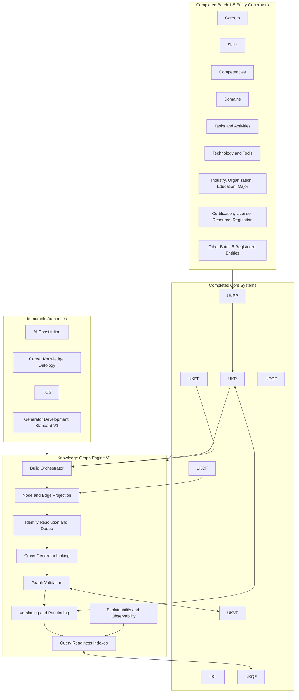

### 31.2 Graph Construction Pipeline Diagram

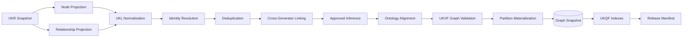

### 31.3 Node-Edge Model Diagram

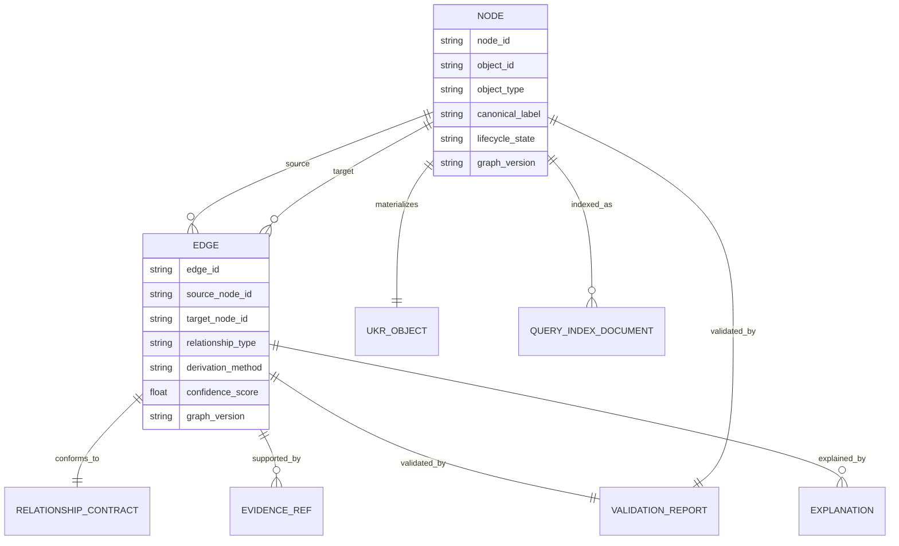

### 31.4 Ingestion Sequence Diagram

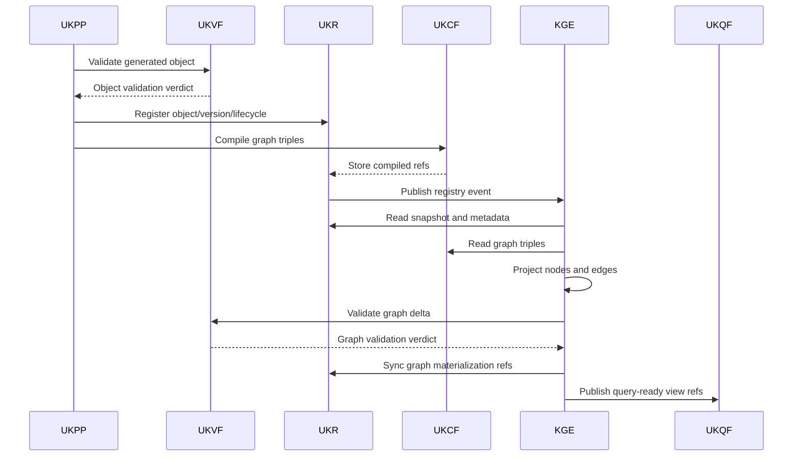

### 31.5 Deduplication Flow

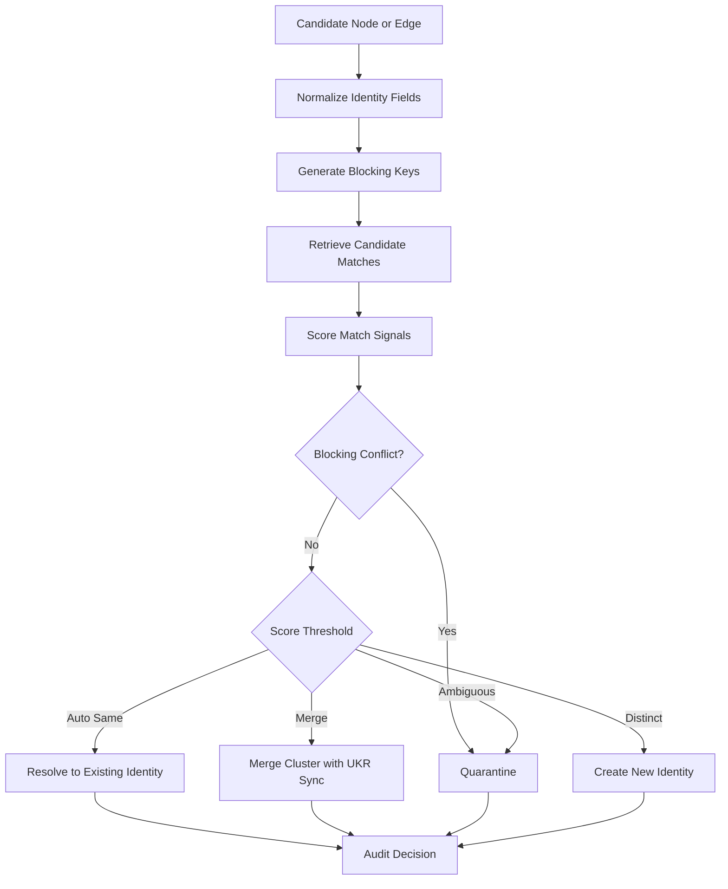

### 31.6 Conflict Resolution Flow

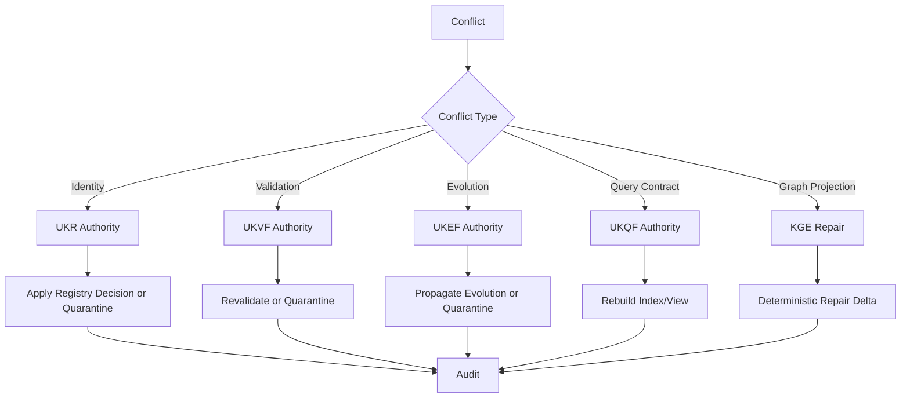

### 31.7 Evolution Propagation Flow

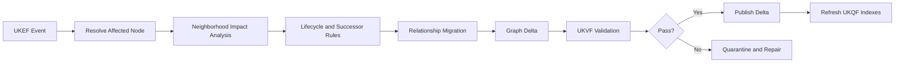

### 31.8 Indexing Strategy Diagram

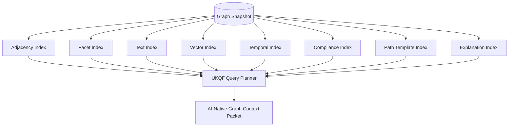

---

## 32. Required Examples

### 32.1 Example: Career → Skill → Competency → Knowledge Domain Graph

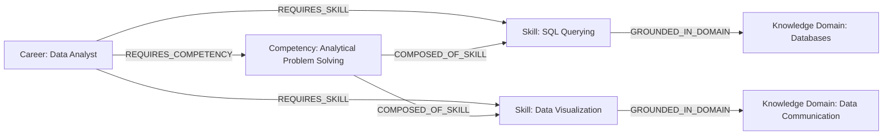

Example edge object:

```yaml
edge:
  source_node_id: node:career:data_analyst
  relationship_type: REQUIRES_SKILL
  target_node_id: node:skill:sql_querying
  derivation:
    derivation_method: declared
    source_field_paths: [career.required_skills]
    confidence_score: 0.94
  validation:
    ontology_validation_status: pass
    graph_validation_status: pass
```

### 32.2 Example: Career Transition Graph

```mermaid
graph TD
    A[Career: Accounting Staff] -->|TRANSITIONS_TO| B[Career: Financial Analyst]
    A -->|REQUIRES_SKILL| S1[Skill: Financial Reporting]
    B -->|REQUIRES_SKILL| S2[Skill: Financial Modeling]
    B -->|REQUIRES_SKILL| S3[Skill: Data Analysis]
    S2 -->|DEPENDS_ON_SKILL| S1
    R1[Learning Resource: Financial Modeling Course] -->|TEACHES_SKILL| S2
    R2[Learning Resource: Spreadsheet Analytics Simulation] -->|TEACHES_SKILL| S3
    R1 -->|NEXT_LEARNING_STEP| R2
```

Transition explanation:

```yaml
path_explanation:
  query_intent: career_transition
  source: node:career:accounting_staff
  target: node:career:financial_analyst
  aggregate_confidence: 0.82
  rationale:
    - shared finance domain foundation
    - existing financial reporting skill bridges to financial modeling
    - missing data analysis skill has available learning resources
  limitations:
    - salary and market outcomes are geography-dependent
    - transition probability is not guaranteed
```

### 32.3 Example: Skill Dependency Graph

```mermaid
graph LR
    S0[Skill: Basic Statistics] -->|DEPENDS_ON_SKILL| S1[Skill: Arithmetic]
    S2[Skill: Regression Analysis] -->|DEPENDS_ON_SKILL| S0
    S3[Skill: Machine Learning Model Evaluation] -->|DEPENDS_ON_SKILL| S2
    R[Learning Resource: Intro Statistics] -->|TEACHES_SKILL| S0
    C[Certification: Data Science Associate] -->|VALIDATES_SKILL| S2
```

Rule behavior:

- `DEPENDS_ON_SKILL` edges are directional from dependent skill to prerequisite skill.
- Query views may project inverse `IS_PREREQUISITE_FOR` without storing it as canonical unless configured.
- Learning path sequencing uses difficulty, dependency depth, and resource coverage.

### 32.4 Example: Industry → Technology Graph

```mermaid
graph TD
    I[Industry: Healthcare] -->|USES_TECHNOLOGY| T1[Technology: Electronic Health Records]
    I -->|USES_TECHNOLOGY| T2[Technology: Clinical Decision Support]
    C[Career: Health Informatics Specialist] -->|IN_INDUSTRY| I
    C -->|USES_TECHNOLOGY| T1
    Tool[Tool: Hospital Information System] -->|IMPLEMENTS_TECHNOLOGY| T1
    Reg[Regulation: Health Data Privacy Rule] -->|REGULATES_INDUSTRY| I
    Reg -->|IMPACTS_SKILL| S[Skill: Health Data Compliance]
```

Graph query example:

```yaml
query_intent: industry_technology_requirements
start_node: node:industry:healthcare
path_template:
  - Industry -USES_TECHNOLOGY-> Technology
  - Technology <-IMPLEMENTS_TECHNOLOGY- Tool
  - Industry <-REGULATES_INDUSTRY- Regulation -IMPACTS_SKILL-> Skill
required_filters:
  lifecycle: active
  jurisdiction: query_scope
```

### 32.5 Example: Education → Career Mapping Graph

```mermaid
graph LR
    EP[Education Program: Bachelor of Computer Science] -->|PREPARES_FOR_CAREER| C1[Career: Software Engineer]
    EP -->|TEACHES_SKILL| S1[Skill: Programming]
    EP -->|COVERS_DOMAIN| D1[Knowledge Domain: Algorithms]
    M[Major: Information Systems] -->|PREPARES_FOR_CAREER| C2[Career: Business Analyst]
    M -->|COVERS_DOMAIN| D2[Knowledge Domain: Enterprise Systems]
    LR[Learning Resource: Systems Analysis Case Simulation] -->|TEACHES_SKILL| S2[Skill: Requirements Analysis]
    C2 -->|REQUIRES_SKILL| S2
```

Mapping rule:

- Education-to-career edges are high confidence when curriculum outcomes cover the majority of required skill/domain backbone for a career.
- The edge must not claim guaranteed employability.
- Query explanations must expose skill coverage and remaining gaps.

### 32.6 Example: Salary → Skill Correlation Graph

```mermaid
graph TD
    Skill[Skill: Cloud Architecture] -->|CORRELATES_WITH_SALARY| Signal[Market/Salary Signal: Cloud Skill Premium]
    Career[Career: Cloud Solutions Architect] -->|CORRELATES_WITH_SALARY| Signal
    Industry[Industry: Software and IT Services] -->|HAS_MARKET_DEMAND_SIGNAL| Signal
    Cert[Certification: Cloud Professional Architect] -->|VALIDATES_SKILL| Skill
```

Safety and explanation rule:

```yaml
salary_correlation_edge_policy:
  relationship_type: CORRELATES_WITH_SALARY
  allowed_claim_type: correlation_or_observed_association
  prohibited_claim_type: guaranteed_salary_increase
  required_qualifiers:
    - geography
    - evidence_period
    - compensation_metric
    - data_source_confidence
  default_query_disclosure:
    - Salary signals are contextual and not guaranteed outcomes.
    - Correlation does not prove causation.
```

---

## 33. Conformance Tests

### 33.1 Test Categories

| Test ID | Category | Assertion |
|---|---|---|
| `kge.contract.001` | Non-redesign | Engine does not create new generator, ontology root, or framework. |
| `kge.node.001` | Node schema | Every release node has required KOS, UKR, validation, lifecycle, evidence, query, and audit fields. |
| `kge.edge.001` | Edge schema | Every release edge has valid endpoints, relationship type, derivation, validation, lifecycle, and explanation. |
| `kge.identity.001` | Registry identity | Node identity derives from UKR object identity. |
| `kge.identity.002` | Dedup safety | High-confidence duplicates are merged only when critical qualifiers are compatible and lineage is preserved. |
| `kge.relationship.001` | Domain/range | Every edge relationship type permits the source and target entity types. |
| `kge.relationship.002` | Direction | Canonical edge direction matches relationship contract. |
| `kge.relationship.003` | Prohibited links | Certification is not treated as license; salary signal is not treated as requirement. |
| `kge.ontology.001` | Backbone | Career-skill-competency-domain-task-activity-tool-technology backbone remains valid. |
| `kge.validation.001` | UKVF | Graph release fails if blocking UKVF graph suite fails. |
| `kge.registry.001` | UKR sync | Graph materialization refs are written to UKR after release. |
| `kge.evolution.001` | UKEF | Superseded objects create successor links and migrate compatible edges only. |
| `kge.query.001` | UKQF | Required query views and index manifests exist for production graph. |
| `kge.version.001` | Immutability | Production graph versions are immutable. |
| `kge.version.002` | Determinism | Same snapshot and config produce same deterministic hash. |
| `kge.partition.001` | Partitioning | Partition assignment is deterministic and cross-partition edges are indexed. |
| `kge.event.001` | Idempotency | Replaying same event does not duplicate nodes or edges. |
| `kge.incremental.001` | Delta scope | Incremental update validates affected subgraph and indexes. |
| `kge.batch.001` | Batch build | Full build passes all stage gates before release. |
| `kge.repair.001` | Repair safety | Graph repair does not fabricate evidence or modify object semantics. |
| `kge.rebuild.001` | Rebuild | Equivalence rebuild matches expected node/edge/version hash. |
| `kge.observability.001` | Audit | Every release-visible mutation has audit event. |
| `kge.explainability.001` | Explanation | Every release-visible inferred edge has explanation and confidence rationale. |

### 33.2 Sample Conformance Test Fixture

```yaml
test_fixture:
  name: career_skill_certification_license_regulation_graph
  input_objects:
    - object_type: career
      label: Data Analyst
    - object_type: skill
      label: SQL Querying
    - object_type: certification
      label: Data Analytics Professional Certificate
    - object_type: license
      label: Regulated Data Protection Officer License
    - object_type: regulation
      label: Data Protection Regulation
  expected_edges:
    - Career:Data Analyst -REQUIRES_SKILL-> Skill:SQL Querying
    - Certification:Data Analytics Professional Certificate -VALIDATES_SKILL-> Skill:SQL Querying
    - License:Regulated Data Protection Officer License -AUTHORIZES_CAREER-> Career:Data Analyst
    - Regulation:Data Protection Regulation -REGULATES_CAREER-> Career:Data Analyst
  prohibited_edges:
    - Certification:Data Analytics Professional Certificate -AUTHORIZES_CAREER-> Career:Data Analyst
    - Regulation:Data Protection Regulation -VALIDATES_SKILL-> Skill:SQL Querying
  expected_verdict: pass
```

### 33.3 Determinism Test

```yaml
determinism_test:
  input:
    ukr_snapshot_id: snapshot:test:001
    engine_version: 1.0.0
    ontology_version: locked
    ukvf_version: locked
    build_mode: batch_build
  assertion:
    first_build_hash: equals_second_build_hash
    node_count: stable
    edge_count: stable
    partition_manifest_hash: stable
    index_manifest_hash: stable_when_index_config_same
```

---

## 34. Production Readiness Checklist

| Area | Requirement | Status Requirement |
|---|---|---|
| Architecture | Engine operates as graph materialization system, not generator. | Must pass. |
| Authority | AI Constitution, ontology, KOS, and core framework boundaries are preserved. | Must pass. |
| Node schema | All nodes carry identity, lifecycle, validation, evidence, registry, query, and audit fields. | Must pass. |
| Edge schema | All edges carry endpoints, relationship contract, derivation, evidence, lifecycle, version, and explanation fields. | Must pass. |
| Relationship system | Relationship types are controlled and ontology-aligned. | Must pass. |
| Ingestion | UKPP → UKVF → UKR → UKCF → Graph flow is enforced. | Must pass. |
| Deduplication | Deterministic scoring, blocking keys, merge lineage, and quarantine behavior are defined. | Must pass. |
| Entity resolution | Registry-first and jurisdiction-aware resolution is defined. | Must pass. |
| Cross-generator linking | Rules cover all major completed generator families. | Must pass. |
| Validation | UKVF graph suites and release gates are defined. | Must pass. |
| Registry sync | UKR materialization sync contract is defined. | Must pass. |
| Evolution | UKEF events propagate to graph neighborhoods safely. | Must pass. |
| Query readiness | UKQF indexes, views, path templates, and graph context packets are defined. | Must pass. |
| Versioning | Immutable snapshots, deltas, manifests, and time-travel support are defined. | Must pass. |
| Partitioning | Deterministic, scalable, query-aware partitioning is defined. | Must pass. |
| Scalability | Billion-node strategy, high-degree strategy, and AI-native context limits are defined. | Must pass. |
| Consistency | Strong snapshot and controlled eventual index consistency are defined. | Must pass. |
| Events | Event payloads and idempotency rules are defined. | Must pass. |
| Incremental updates | Affected subgraph and delta contracts are defined. | Must pass. |
| Batch builds | Full build process and determinism controls are defined. | Must pass. |
| Repair | Deterministic repair boundaries and routing are defined. | Must pass. |
| Rebuild | Clean, equivalence, migration, repair, and recovery rebuild modes are defined. | Must pass. |
| Observability | Logs, traces, metrics, health states, and audit streams are defined. | Must pass. |
| Metrics | Graph quality, connectivity, validation, evolution, and performance metrics are defined. | Must pass. |
| Debugging | Required debugging tools and report contracts are defined. | Must pass. |
| Explainability | Node, edge, path, query, evolution, and conflict explanations are defined. | Must pass. |
| Examples | Required graph examples are included. | Must pass. |
| Conformance | Required conformance tests are defined. | Must pass. |

---

## 35. Release Contract

Knowledge Graph Engine Specification V1 is production-ready when the following contract is satisfied:

```yaml
release_contract:
  system_id: knowledge_graph_engine:v1
  version: 1.0.0
  status: production_ready
  non_redesign_compliance: true
  technology_neutral: true
  graph_database_compatible: true
  ai_native: true
  deterministic: true
  auditable: true
  scalable_to_billions_of_nodes: true
  required_integrations:
    AI_Constitution: enforced
    Career_Knowledge_Ontology: aligned
    KOS: compliant
    UEGF: generator_boundary_preserved
    UKPP: ingestion_compatible
    UKVF: validation_integrated
    UKR: registry_synchronized
    UKL: language_normalized
    UKQF: query_ready
    UKEF: evolution_synchronized
    UKCF: compilation_compatible
  release_artifacts:
    - node_schema
    - edge_schema
    - relationship_type_system
    - construction_pipeline
    - ingestion_flow
    - dedup_strategy
    - entity_resolution_strategy
    - cross_generator_linking_rules
    - ontology_alignment_rules
    - validation_rules
    - registry_sync_contract
    - evolution_sync_contract
    - query_readiness_layer
    - graph_versioning_system
    - partitioning_strategy
    - scalability_model
    - consistency_model
    - update_models
    - repair_and_rebuild_strategy
    - observability_metrics_debugging
    - explainability_layer
    - diagrams
    - examples
    - conformance_tests
```

This specification defines the canonical KarirGPS Knowledge Graph Engine V1. It transforms completed, validated, registry-managed Knowledge Objects into a living, connected, queryable, versioned, evolvable, auditable, and explainable semantic knowledge graph without modifying the immutable generator ecosystem or core architecture.
