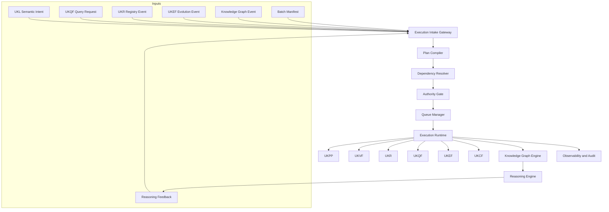
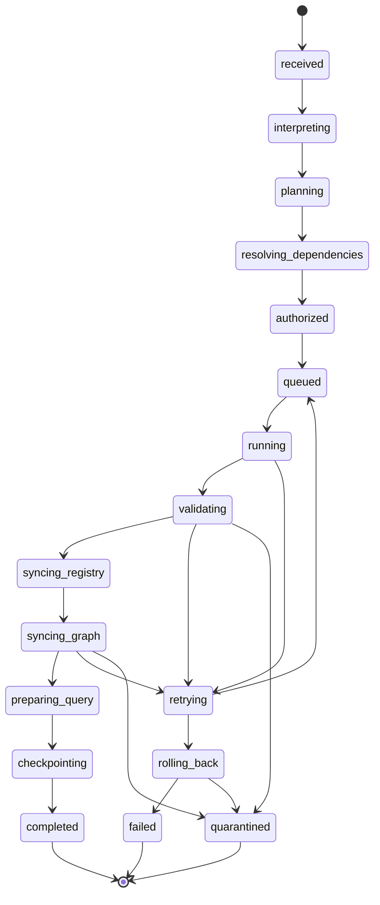
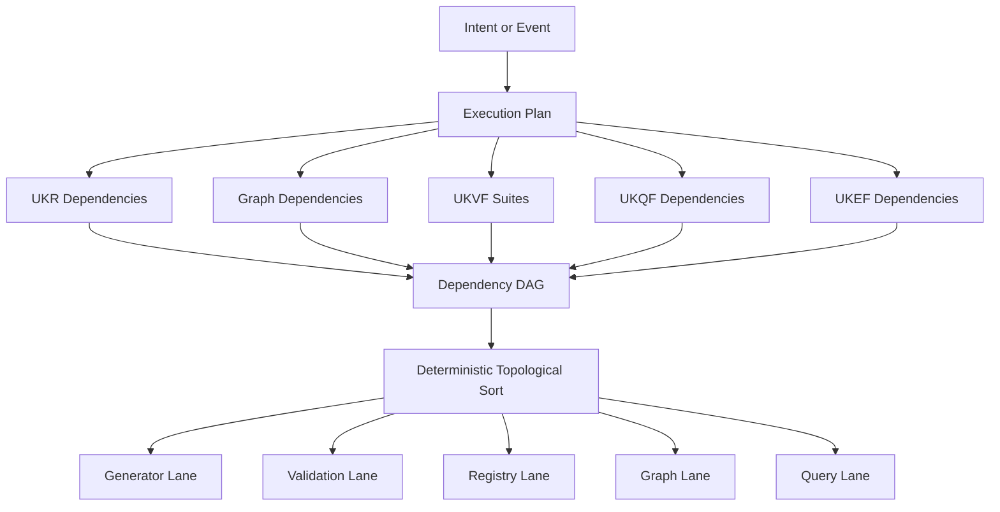
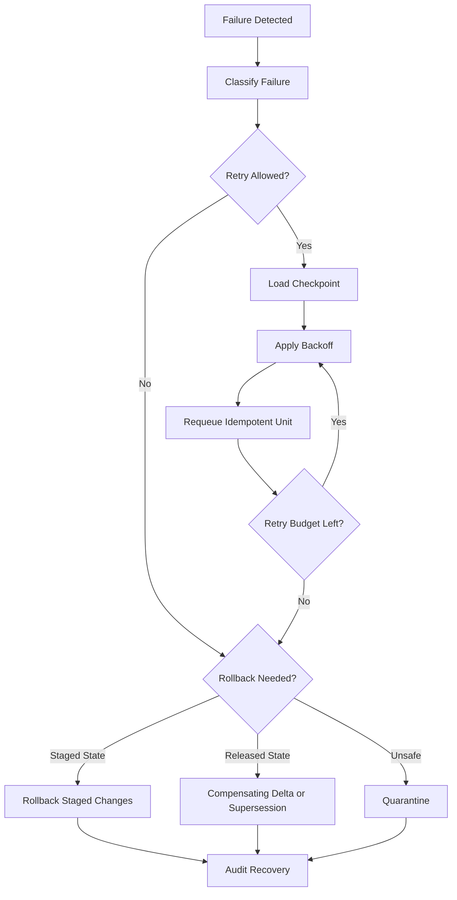
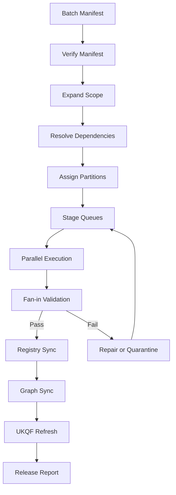
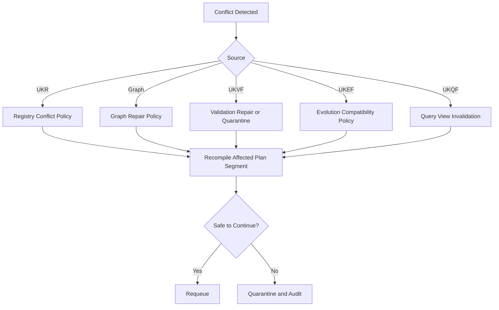

# Orchestration Engine V1

**File Path:** `assets/knowledge/engine/Orchestration_Engine_V1.md`  
**System ID:** `orchestration_engine:v1`  
**System Class:** Final Intelligence Layer Control Engine  
**Status:** Production Ready  
**Version:** 1.0.0  
**Release Date:** 2026-06-28  
**Owner:** KarirGPS Chief Intelligence Systems Architect  
**Compatibility:** AI Constitution, Career Knowledge Ontology, KOS, UEGF, UKPP, UKVF, UKR, UKL, UKQF, UKEF, UKCF, Generator Development Standard V1, all completed Batch 1–5 Entity Generators, Knowledge Graph Engine V1, Orchestration Engine V1, and Reasoning Engine V1 where applicable.

## 0. Document Control

    | Field | Value |
    |---|---|
    | Release state | Production-ready implementation specification |
    | Design rule | No new generators, no framework redesign, no ontology modification |
    | Closed loop | `ORCHESTRATION → EXECUTION → GRAPH → REASONING → FEEDBACK → ORCHESTRATION` |
    | Audit posture | Deterministic, versioned, explainable, replayable |

    ### 0.1 Mandatory Requirement Map

    | Required capability | Implemented section |
    |---|---|
    | Purpose | Section 1 |
| Scope | Section 2 |
| Architecture | Section 3 |
| Execution Model | Section 4 |
| Multi-Generator Coordination | Section 5 |
| Dependency Resolution | Section 6 |
| Task Planning System from UKL input to execution plan | Section 7 |
| Pipeline Orchestration with UKPP | Section 8 |
| Validation Orchestration with UKVF | Section 9 |
| Registry Sync with UKR | Section 10 |
| Evolution Awareness with UKEF | Section 11 |
| Query Dependency Integration with UKQF | Section 12 |
| Graph Dependency Integration | Section 13 |
| Batch Execution System | Section 14 |
| Parallel Execution Model | Section 15 |
| Execution Queue System | Section 16 |
| Failure Recovery System | Section 17 |
| Retry and Rollback Strategy | Section 18 |
| Deterministic Execution Guarantee | Section 19 |
| Context Management System | Section 20 |
| Execution State Machine | Section 21 |
| Observability Layer | Section 22 |
| Logging and Audit Trail | Section 23 |
| Performance Optimization Layer | Section 24 |
| Required Diagrams | Section 25 |
| Closed Loop Contract | Section 26 |
| Implementation Contracts | Section 27 |
| Conformance Tests | Section 28 |
| Production Readiness Checklist | Section 29 |
| Release Contract | Section 30 |

## 1. Purpose

The Orchestration Engine V1 is the final control system that executes the completed KarirGPS Knowledge OS. It transforms UKL semantic intent, UKQF query needs, UKR registry events, UKEF evolution events, Knowledge Graph Engine events, Reasoning Engine feedback, scheduled jobs, and batch manifests into deterministic execution plans.

It coordinates completed components only. It invokes existing generators through UEGF and UKPP contracts, schedules UKVF validation, synchronizes with UKR, requests graph actions from the Knowledge Graph Engine, refreshes UKQF query readiness, applies UKEF evolution rules, invokes UKCF compilation, and closes the loop with the Reasoning Engine.

The purpose is operational coherence: every action has an input manifest, plan hash, dependency graph, validation gate, state transition, output fingerprint, recovery policy, and audit record. No hidden mutable state is allowed to influence released knowledge or advice.

## 2. Scope

### 2.1 In Scope

- Execution planning for interactive, system, batch, registry, graph, query, evolution, validation, and reasoning-feedback runs.
- Multi-generator coordination for all completed Batch 1–5 entity generators through existing operation contracts.
- UKPP pipeline orchestration for create, revise, repair, localize, enrich, evidence refresh, evolution successor, compilation, and release flows.
- UKVF gate scheduling and enforcement across object, registry, graph, query, evolution, and release stages.
- UKR identity, lifecycle, version, merge, successor, deprecation, lineage, release, and graph-reference synchronization.
- Knowledge Graph Engine node, edge, partition, repair, rebuild, and query-index synchronization.
- UKEF drift, evidence aging, successor propagation, deprecation, temporal validity, and compatibility migration handling.
- UKQF dependency hydration, path view materialization, ranking-input readiness, and stale-view refresh.
- Queueing, batching, safe parallelism, deterministic ordering, retry, rollback, supersession, quarantine, observability, logging, and audit.

### 2.2 Out of Scope

- Creating new generator systems.
- Redesigning or modifying AI Constitution, ontology, KOS, UEGF, UKPP, UKVF, UKR, UKL, UKQF, UKEF, UKCF, generator specs, or Knowledge Graph Engine.
- Acting as identity authority, validation authority, graph materialization authority, or reasoning authority.
- Bypassing lifecycle, evidence, validation, registry, graph, query, or evolution constraints.

## 3. Architecture

The architecture is plan-first, validation-gated, event-aware, and replayable.

| Plane | Responsibility |
|---|---|
| Intent Plane | Receives UKL intents, UKQF requests, UKR events, UKEF events, graph events, batch manifests, and reasoning feedback. |
| Planning Plane | Builds execution DAGs, dependency maps, validation schedules, retry policies, and rollback plans. |
| Execution Plane | Runs existing component operations under authority contracts. |
| Validation Plane | Coordinates UKVF gates before state mutation and release. |
| State Plane | Manages queues, locks, checkpoints, idempotency, and run state. |
| Integration Plane | Synchronizes UKL, UKPP, UKVF, UKR, UKQF, UKEF, UKCF, Graph Engine, and Reasoning Engine. |
| Observability Plane | Emits logs, metrics, traces, audit records, debugging artifacts, and recovery reports. |

Core components: Execution Intake Gateway, Plan Compiler, Dependency Resolver, Authority Gate, Queue Manager, Execution Runtime, Validation Coordinator, Registry Coordinator, Graph Coordinator, Evolution Coordinator, Query Coordinator, Checkpoint Manager, Recovery Manager, Observability Collector, and Feedback Router.

## 4. Execution Model

An execution unit is the smallest schedulable and auditable work item.

```yaml
execution_unit:
  execution_unit_id: "eu:sha256:8d6fc2a9"
  run_id: "run:20260628T140000Z:1f22"
  plan_id: "plan:sha256:aa31c904"
  unit_type: "generator_operation"
  component_authority: "EntityGenerator"
  operation: "evidence_refresh"
  target_entity_type: "certification"
  input_manifest_ref: "input_manifest:sha256:4410af19"
  output_manifest_ref: "output_manifest:sha256:27cb92a1"
  dependency_refs: ["eu:sha256:1c443f09", "eu:sha256:7ae09fa2"]
  idempotency_key: "idmp:sha256:53da0ef7"
  state: "planned"
  validation_gates: ["ukvf:pre_execution:v1", "ukvf:object_semantic:v1", "ukvf:release:v1"]
  checkpoint_policy: "after_each_stage"
  rollback_policy: "component_specific_compensation"
  audit_level: "standard"
```

Run types include interactive, query hydration, knowledge production, registry event, evolution event, graph sync, batch build, and recovery. Execution phases are accept, interpret, plan, resolve, authorize, queue, execute, validate, sync UKR, sync graph, prepare UKQF, apply UKEF compatibility, compile UKCF outputs, checkpoint, release, observe, and route feedback.

## 5. Multi-Generator Coordination

The engine may invoke only completed generators through their published UEGF/UKPP contracts. Coordination never creates a generator and never infers a new schema.

| Pattern | Use | Rule |
|---|---|---|
| Single-generator | Repair one license object. | Invoke one generator pipeline and validate. |
| Fan-out | Refresh a career neighborhood. | Run independent entity families in parallel only when locks do not conflict. |
| Fan-in | Link careers, skills, learning resources, credentials, and regulations. | Wait for required outputs before cross-link validation. |
| Cascade | Career requires skills, skills require domains. | Execute dependency-first order. |
| Repair cascade | Invalid object affects graph neighborhood. | Quarantine affected edges and repair impacted units. |
| Evolution cascade | UKEF successor changes active path. | Propagate successor links through graph and query views. |

```yaml
generator_invocation:
  invocation_id: "genrun:sha256:91e2f843"
  generator_id: "generator:learning_resource:v1"
  entity_type: "learning_resource"
  operation: "enrich"
  kos_contract_version: "kos:v1"
  input_manifest_ref: "input_manifest:sha256:7cc9b341"
  upstream_context_refs:
    - "ukr:skill:sql_fundamentals:v1"
    - "graph_snapshot:20260628:released"
    - "ukqf:path:career_skill_learning_resource:v1"
  validation_suite_refs:
    - "ukvf:learning_resource:semantic:v1"
    - "ukvf:graph_linkage:v1"
  output_policy: "register_after_validation"
```

## 6. Dependency Resolution

Dependencies are resolved before queueing.

| Dependency class | Authority |
|---|---|
| Generator capability | UEGF and generator specs |
| Registry identity/version/lifecycle | UKR |
| Graph topology/partition/snapshot | Knowledge Graph Engine |
| Validation suites | UKVF |
| Language/locale/terminology | UKL |
| Query path/facet/index/ranking input | UKQF |
| Drift/successor/deprecation/temporal validity | UKEF |
| Compilation output targets | UKCF |

Algorithm: normalize event, expand required entities and relationships, read UKR, read graph snapshot, select UKVF suites, apply UKL constraints, apply UKEF constraints, construct dependency DAG, reject unauthorized cycles, topologically sort deterministically, assign lanes, locks, checkpoints, retries, rollback plans, and audit level.

Ordering key: priority class, compliance risk, lifecycle severity, registry write requirement, ontology root order, dependency depth, entity type order, jurisdiction, language, graph partition, stable content hash.

## 7. Task Planning System: UKL Input to Execution Plan

UKL provides semantic intent; orchestration compiles it into a plan.

```yaml
semantic_intent:
  intent_id: "intent:sha256:60b4b2b0"
  intent_type: "skill_gap"
  language: "id"
  target_entities:
    - entity_type: "career"
      label: "Data Analyst"
      registry_ref: "ukr:career:data_analyst:v1"
  source_context_ref: "user_context:career_profile:current"
  constraints:
    jurisdiction: "ID"
    max_graph_hops: 4
    evidence_required: true
    lifecycle_allowed: ["validated", "released"]
    explanation_level: "detailed"
```

```yaml
execution_plan:
  plan_id: "plan:sha256:9ac1ed72"
  source_intent_id: "intent:sha256:60b4b2b0"
  registry_snapshot_ref: "ukr_snapshot:20260628:released"
  graph_snapshot_ref: "graph_snapshot:20260628:released"
  component_version_manifest: "component_versions:20260628:v1"
  stages:
    - stage_id: "stage:interpretation_verified"
      units: ["eu:sha256:101ab331"]
    - stage_id: "stage:dependency_resolution"
      units: ["eu:sha256:739ce621"]
    - stage_id: "stage:reasoning_execution"
      units: ["eu:sha256:81c62f19"]
    - stage_id: "stage:feedback_handling"
      units: ["eu:sha256:447bcfa3"]
  release_policy: "release_after_required_gates_pass"
```

A plan must bind registry and graph snapshots, component versions, validation suites, idempotency keys, retry policy, and rollback policy before execution.

## 8. Pipeline Orchestration: UKPP Integration

UKPP remains the pipeline authority. Orchestration supplies context, dependencies, validation schedules, and downstream sync.

| UKPP stage | Orchestration control |
|---|---|
| Intake | Provides scoped input manifest and authority context. |
| Normalization | Requires UKL terminology, jurisdiction, and taxonomy normalization. |
| Generation | Invokes existing generator under contract. |
| Validation | Calls UKVF suites before registry sync. |
| Repair | Starts bounded repair only for repairable failures. |
| Registration | Coordinates UKR identity and lifecycle transition. |
| Compilation | Calls UKCF targets required by graph/query/release. |
| Release | Confirms gates, syncs, and audit trail. |

UKPP cannot register invalid candidates; graph sync waits for UKR identity confirmation; query publication waits for graph release.

## 9. Validation Orchestration: UKVF Integration

| Gate | Timing | Blocks on |
|---|---|---|
| Pre-execution | Before component call | Invalid input, unauthorized action, missing dependency. |
| Candidate object | After generator output | KOS, ontology, evidence, semantic, or safety failure. |
| Registry | Before UKR transition | Duplicate, version, merge, successor, lifecycle conflict. |
| Graph | Before graph release | Invalid edge, partition inconsistency, ontology violation. |
| Query | Before UKQF publication | Missing path, stale index, invalid rank input. |
| Evolution | Before UKEF propagation | Temporal, successor, drift, or migration conflict. |
| Final release | Before external output | Any required gate not passed. |

Verdicts: `pass`, `pass_with_warning`, `repairable_fail`, `evidence_insufficient`, `registry_conflict`, `graph_conflict`, `evolution_conflict`, `authority_conflict`, and `nonrepairable_fail`. Each verdict maps to continue, warning audit, bounded repair, evidence refresh, conflict handling, denial, quarantine, or closed failure.

## 10. Registry Sync: UKR Integration

UKR is the canonical identity, lifecycle, version, lineage, merge, deprecation, successor, and release authority.

| Sync mode | Use |
|---|---|
| Identity read | Resolve existing objects and versions. |
| Identity reservation | Reserve candidate identity when required. |
| Registration | Register validated candidate. |
| Lifecycle transition | Move object through allowed state transitions. |
| Version sync | Ensure base and updated versions align. |
| Merge sync | Apply canonical survivor and aliases. |
| Successor sync | Link predecessor and successor. |
| Graph reference sync | Store graph materialization references. |

If UKR changes after planning, affected plan segments are recompiled. Merged references rewrite to canonical survivors. Deprecated objects resolve through successors unless historical mode is active.

## 11. Evolution Awareness: UKEF Integration

| UKEF event | Orchestration response |
|---|---|
| Evidence aging | Evidence refresh plan and query confidence update. |
| Skill drift | Skill/competency validation and graph propagation. |
| Entity successor | Successor link sync and relationship migration. |
| Deprecation | Active recommendation exclusion and historical retention. |
| Regulation change | Revalidate affected careers, licenses, industries, and graph paths. |
| Compatibility migration | Migrate affected objects, edges, and query views. |

UKEF validity windows apply before graph, query, and recommendation publication. Compliance-critical evolution triggers elevated validation and audit.

## 12. Query Dependency Integration: UKQF Integration

The engine prepares dependencies required by UKQF and Reasoning Engine.

| Query dependency | Orchestration action |
|---|---|
| Traversal path | Ensure graph path exists, is valid, and indexed. |
| Facet | Ensure normalized facet values exist. |
| Rank input | Validate and refresh score inputs. |
| Explanation payload | Materialize path provenance and evidence refs. |
| Temporal query | Bind registry and graph snapshots. |
| Compliance filter | Refresh license/regulation graph edges. |

UKQF may trigger orchestration when required views are missing, indexes are stale, deprecated paths are active, ranking evidence is stale, or explanation provenance cannot be assembled.

## 13. Graph Dependency Integration

The Knowledge Graph Engine owns graph materialization. Orchestration controls graph action timing.

| Graph operation | Required prior condition |
|---|---|
| Node sync | UKR identity confirmed and object validation passed. |
| Edge sync | Ontology alignment and relationship validation passed. |
| Incremental update | Registry delta validated and graph partition resolved. |
| Partition update | Partition consistency gate passed. |
| Index refresh | Graph delta released and UKQF view identified. |
| Graph repair | Graph conflict confirmed and repair authorized. |
| Graph rebuild | Full conformance suite and snapshot fence. |

No graph write may use unregistered released objects. Every graph delta references source registry snapshot and target graph snapshot. Graph validation failure blocks query publication.

## 14. Batch Execution System

Batch execution is manifest-driven.

```yaml
batch_manifest:
  batch_id: "batch:sha256:72bc8910"
  batch_type: "graph_batch"
  source_snapshots:
    registry: "ukr_snapshot:20260628:released"
    graph: "graph_snapshot:20260628:released"
  scope:
    entity_types: ["career", "skill", "learning_resource", "certification", "license", "regulation"]
    jurisdictions: ["global", "ID"]
    lifecycle_states: ["validated", "released"]
  execution_policy:
    parallelism: "partition_safe"
    max_retries: 3
    checkpoint_interval: "after_each_stage"
    release_mode: "partition_release"
  validation_policy:
    preflight_required: true
    graph_validation_required: true
    final_release_required: true
```

Phases: manifest verification, scope expansion, dependency resolution, partition assignment, queue staging, parallel execution, fan-in validation, registry sync, graph sync, query refresh, release, and reporting.

## 15. Parallel Execution Model

Parallelism is allowed only when units do not conflict on registry identity, graph partition locks, lifecycle transitions, validation artifacts, or release channels.

| Lane | Work type | Lock key |
|---|---|---|
| Read | Registry, graph, query reads | Snapshot reference |
| Generator | Existing generator operations | Entity type + candidate key |
| Validation | UKVF suites | Object ID + suite ID |
| Registry | UKR writes | Canonical object ID |
| Graph | Graph node/edge writes | Graph partition ID |
| Query | UKQF view updates | Query view ID |
| Evolution | UKEF propagation | Evolution event + affected neighborhood |
| Recovery | Retry, rollback, repair | Execution unit ID |

Writes to the same UKR object serialize. Query views publish only after source graph partitions are stable.

## 16. Execution Queue System

| Queue | Purpose |
|---|---|
| `critical_validation` | Safety, compliance, registry, graph integrity. |
| `interactive` | User-facing runs. |
| `reasoning_feedback` | Feedback events from Reasoning Engine. |
| `registry_events` | UKR lifecycle changes. |
| `evolution_events` | UKEF drift and successor events. |
| `graph_sync` | Node, edge, partition, and index updates. |
| `batch` | Large manifest-driven jobs. |
| `repair` | Bounded repair plans. |
| `retry` | Retryable failed units. |
| `dead_letter` | Exhausted or unsafe failures. |

A ready unit enters one active queue. Blocked units wait on dependencies. Retryable units use bounded backoff. Nonrepairable or unsafe units route to quarantine or dead letter.

## 17. Failure Recovery System

| Failure class | Recovery |
|---|---|
| Input failure | Stop or request clarification through product layer. |
| Dependency failure | Re-resolve or fail. |
| Generator failure | Repair if allowed; otherwise quarantine. |
| Validation failure | Repair, quarantine, or fail. |
| Registry failure | UKR conflict path. |
| Graph failure | Graph repair or delta reversal. |
| Query failure | Refresh dependency or block view. |
| Evolution failure | UKEF compatibility path. |
| Runtime failure | Retry from checkpoint. |
| Determinism failure | Quarantine and audit. |
| Authority failure | Deny and audit. |

## 18. Retry and Rollback Strategy

Retries are bounded, idempotent, checkpoint-based, and failure-class-specific.

| Failure | Retry behavior |
|---|---|
| Timeout | Retry from last safe checkpoint with exponential backoff. |
| Temporary dependency outage | Retry after health check. |
| Repairable validation failure | Run repair subplan and retry validation. |
| Registry version conflict | Re-read UKR and recompile affected segment. |
| Graph partition conflict | Rebase or serialize graph delta. |
| Query index lock conflict | Retry after graph release. |
| Determinism mismatch | No retry; quarantine. |
| Authority violation | No retry; deny. |

Rollback distinguishes staged from released state. Staged outputs can be dropped. UKR reservations are cancelled or expired under UKR rules. Released graph errors require compensating deltas or superseding graph versions. External releases are superseded, never silently edited.

## 19. Deterministic Execution Guarantee

The engine guarantees deterministic planning, dependency ordering, queue placement, gate selection, retry decisions, rollback decisions, release decisions, and audit outputs for identical inputs, snapshots, component versions, policy versions, and validation suite versions.

Controls: stable content hashes, registry snapshot fencing, graph snapshot fencing, explicit component version binding, validation suite binding, deterministic topological sorting, deterministic queue ordering, idempotency keys, immutable checkpoints, output fingerprint verification, and audit replay manifests.

Generative components may use probabilistic models, but production acceptance remains deterministic through captured inputs, captured configuration, output fingerprinting, validation gates, and immutable accepted artifacts.

## 20. Context Management System

| Context | Purpose |
|---|---|
| Execution | Run IDs, plan IDs, snapshots, components, policy, risk. |
| User | Authorized profile, goals, constraints, preferences. |
| Knowledge | Object refs, graph neighborhoods, evidence refs. |
| Validation | UKVF suites, prior verdicts, risk flags. |
| Graph | Snapshot, partition, deltas, path dependencies. |
| Reasoning | Mode, explanation requirements, feedback events. |
| Recovery | Checkpoints, retry counts, rollback state. |

Context is explicit, typed, scoped, immutable by reference, and never silently inherited. User context cannot become canonical knowledge without authorized pipeline operations.

## 21. Execution State Machine

States: `received`, `interpreting`, `planning`, `resolving_dependencies`, `authorized`, `queued`, `running`, `validating`, `syncing_registry`, `syncing_graph`, `preparing_query`, `checkpointing`, `completed`, `retrying`, `rolling_back`, `quarantined`, `failed`, `cancelled`.

State transitions are append-only audit events. Invalid state transitions are determinism failures and must be quarantined.

## 22. Observability Layer

| Dimension | Metrics |
|---|---|
| Planning | Compile time, dependency count, rejection reasons. |
| Execution | Queue wait, runtime, throughput, timeout rate. |
| Validation | Gate pass rate, failure class, repair success. |
| Registry | Reservations, conflicts, lifecycle transitions. |
| Graph | Node/edge deltas, partition lag, validation failures. |
| Query | View freshness, invalidation count, dependency failures. |
| Evolution | Drift backlog, successor propagation, migration latency. |
| Recovery | Retry, rollback, quarantine, dead-letter counts. |
| Determinism | Replay success and fingerprint mismatch. |
| Feedback | Accepted, rejected, completed reasoning feedback. |

## 23. Logging and Audit Trail

Each audit record stores timestamp, run ID, plan ID, execution unit ID, actor type, action, component authority, input fingerprint, output fingerprint, registry snapshot, graph snapshot, validation verdict, reason codes, evidence refs, recovery refs, and release status.

The audit trail must answer: what triggered the run, what intent or event was accepted, what plan was compiled, which dependencies were resolved, which components were invoked, which gates ran, which registry and graph objects changed, what recovery occurred, what output was released, and what feedback was emitted or accepted.

## 24. Performance Optimization Layer

| Technique | Constraint |
|---|---|
| Dependency caching | Snapshot-bound only. |
| Plan memoization | Rebind current snapshots before use. |
| Incremental graph sync | Preserve graph validation. |
| Partition-safe parallelism | Respect locks and barriers. |
| Batch coalescing | Preserve per-unit audit. |
| Validation reuse | Same artifact, suite version, and policy only. |
| Query refresh minimization | Invalidate dependent stale views. |
| Checkpoint reuse | Fingerprints must match. |
| Evolution scope reduction | Include all affected graph paths. |
| Backpressure | Respect UKR, UKVF, graph, and UKQF capacity. |

## 25. Required Diagrams

### 25.1 Orchestration Architecture Diagram



### 25.2 Execution Pipeline Diagram

```mermaid
flowchart LR
    A[Accept] --> B[Interpret via UKL]
    B --> C[Compile Plan]
    C --> D[Resolve Dependencies]
    D --> E[Authorize]
    E --> F[Queue]
    F --> G[Execute]
    G --> H[Validate via UKVF]
    H --> I[Sync UKR]
    I --> J[Sync Graph]
    J --> K[Prepare UKQF]
    K --> L[Checkpoint and Release]
    L --> M[Audit]
    M --> N[Reasoning Feedback Routing]
    N -. closed loop .-> A
```



### 25.3 Execution State Machine Diagram



### 25.4 Dependency Graph Execution Model



### 25.5 Retry and Rollback Flowchart



### 25.6 Batch Execution Flow



### 25.7 Conflict Resolution Flow



## 26. Closed Loop Contract

The closed loop is mandatory:

```text
ORCHESTRATION → EXECUTION → GRAPH → REASONING → FEEDBACK → ORCHESTRATION
```

Reasoning feedback is not a write operation. It becomes an event that the Orchestration Engine accepts, rejects, or converts into a normal execution plan.

```yaml
reasoning_feedback_event:
  feedback_id: "rfb:sha256:50df9e91"
  reasoning_run_id: "reason:20260628:37aa"
  feedback_type: "evidence_refresh_needed"
  affected_objects: ["ukr:skill:sql_fundamentals:v1"]
  affected_graph_paths: ["graph_path:career_skill_learning_resource:334"]
  proposed_action: "refresh"
  confidence: 0.82
  urgency: "normal"
  explanation_ref: "explanation:sha256:f19d02c3"
```

Feedback with insufficient confidence becomes observation only. Prohibited actions are denied and audited. Compliance-critical feedback requires elevated validation.

## 27. Implementation Contracts

Every run stores request/event reference, semantic intent, plan manifest, dependency DAG, registry snapshot, graph snapshot, component versions, validation suites, execution units, checkpoints, audit sequence, and release/failure report.

Every component invocation includes component authority, operation, input manifest, execution context, idempotency key, timeout, retry policy, validation requirements, output fingerprint rule, and audit level.

Output may release only after plan completion, required validation gates, registry sync, graph sync, query readiness, evolution compatibility, complete audit trail, and no blocking quarantine.

## 28. Conformance Tests

| Test ID | Assertion |
|---|---|
| OE-PLAN-001 | Identical input and snapshots produce identical plan hash. |
| OE-PLAN-002 | Unauthorized operations are rejected before queueing. |
| OE-PLAN-003 | Missing registry dependency blocks execution. |
| OE-PLAN-004 | Deprecated objects resolve to successors unless historical mode is active. |
| OE-EXEC-001 | Every write unit has an idempotency key. |
| OE-EXEC-002 | Concurrent writes to the same UKR object are serialized. |
| OE-EXEC-003 | Graph write waits for registry sync. |
| OE-EXEC-004 | Query publication waits for graph release. |
| OE-REC-001 | Transient failures retry from checkpoint. |
| OE-REC-002 | Nonrepairable validation failure quarantines candidate output. |
| OE-REC-003 | Released graph error is corrected by compensating delta or superseding graph version. |
| OE-INT-001 | UKL intent compiles into valid execution plan. |
| OE-INT-002 | UKEF successor event triggers affected graph and query updates. |
| OE-INT-003 | Reasoning feedback becomes controlled plan or audited rejection. |

## 29. Production Readiness Checklist

| Category | Requirement |
|---|---|
| Authority | No generator creation and no framework redesign. |
| Determinism | Stable hashes, ordering, snapshots, fingerprints, and replay. |
| UKL | Semantic intent integration. |
| UKPP | Pipeline stage orchestration. |
| UKVF | Validation gate orchestration. |
| UKR | Identity, lifecycle, version, merge, successor, and sync rules. |
| Knowledge Graph | Node, edge, partition, repair, rebuild, and index integration. |
| UKQF | Query dependency and readiness integration. |
| UKEF | Evolution event and temporal propagation. |
| UKCF | Compilation and output manifest integration. |
| Parallelism | Partition-safe concurrency. |
| Recovery | Retry, rollback, supersession, quarantine, dead-letter. |
| Observability | Metrics, traces, logs, audit records. |
| Privacy | Scoped context and redaction rules. |
| Closed loop | Reasoning feedback handled by orchestration. |

## 30. Release Contract

Orchestration Engine V1 is production-ready when implementation passes all conformance tests and preserves all locked authority boundaries. It is the deterministic control layer for executing existing KarirGPS systems, synchronizing registry and graph state, enforcing validation and evolution rules, and closing the loop with the Reasoning Engine.

Canonical file:

```text
assets/knowledge/engine/Orchestration_Engine_V1.md
```

