# Reasoning Engine V1

**File Path:** `assets/knowledge/engine/Reasoning_Engine_V1.md`  
**System ID:** `reasoning_engine:v1`  
**System Class:** Final Intelligence Layer Cognitive Engine  
**Status:** Production Ready  
**Version:** 1.0.0  
**Release Date:** 2026-06-28  
**Owner:** KarirGPS Chief Intelligence Systems Architect  
**Compatibility:** AI Constitution, Career Knowledge Ontology, KOS, UEGF, UKPP, UKVF, UKR, UKL, UKQF, UKEF, UKCF, Generator Development Standard V1, all completed Batch 1–5 Entity Generators, Knowledge Graph Engine V1, Orchestration Engine V1, and Reasoning Engine V1 where applicable.

## 0. Document Control

    | Field | Value |
    |---|---|
    | Release state | Production-ready implementation specification |
    | Design rule | No new generators, no framework redesign, no ontology modification |
    | Closed loop | `ORCHESTRATION → EXECUTION → GRAPH → REASONING → FEEDBACK → ORCHESTRATION` |
    | Audit posture | Deterministic, versioned, explainable, replayable |

    ### 0.1 Mandatory Requirement Map

    | Required capability | Implemented section |
    |---|---|
    | Purpose | Section 1 |
| Scope | Section 2 |
| Cognitive Architecture | Section 3 |
| Reasoning Modes | Section 4 |
| Input Interpretation Layer from UKL to semantic intent | Section 5 |
| Graph Reasoning Layer using UKR and Knowledge Graph Engine | Section 6 |
| Multi-hop Reasoning System | Section 7 |
| Causal Reasoning Model | Section 8 |
| Temporal Reasoning Model with UKEF | Section 9 |
| Comparative Reasoning | Section 10 |
| Ranking and Scoring System | Section 11 |
| Uncertainty Handling | Section 12 |
| Confidence Scoring Model | Section 13 |
| Explanation Generation Layer | Section 14 |
| Recommendation Engine Logic | Section 15 |
| Career Path Simulation Engine | Section 16 |
| Skill Gap Analyzer | Section 17 |
| Future Projection Model | Section 18 |
| AI-driven Career Advisor Behavior Model | Section 19 |
| Feedback Loop to Orchestration Engine | Section 20 |
| Memory and Context Persistence | Section 21 |
| Required Diagrams | Section 22 |
| Integration Contracts | Section 23 |
| Conformance Tests | Section 24 |
| Production Readiness Checklist | Section 25 |
| Release Contract | Section 26 |

## 1. Purpose

The Reasoning Engine V1 is the cognitive system that makes KarirGPS think over the Knowledge OS. It interprets semantic intent, retrieves graph-grounded evidence, performs multi-hop reasoning, compares alternatives, analyzes skill gaps, simulates transitions, ranks recommendations, reasons about salary and opportunity signals, explains conclusions, estimates uncertainty, and emits feedback to the Orchestration Engine when knowledge refresh, validation, repair, graph sync, or query refresh is needed.

The engine does not create canonical Knowledge Objects and does not mutate UKR or the Knowledge Graph. It reads from UKR, stable Knowledge Graph Engine snapshots, UKQF query contracts, UKL language interpretation, UKVF validation status, and UKEF temporal rules. Action requests are emitted as typed feedback events.

## 2. Scope

### 2.1 In Scope

- Career reasoning across careers, industries, organizations, tasks, activities, skills, competencies, domains, technologies, tools, education programs, majors, certifications, licenses, learning resources, regulations, salary signals, opportunities, and all completed Batch 1–5 entity families.
- Skill gap analysis between user/source profile and target career, credential, license, learning path, education goal, or opportunity.
- Transition reasoning across careers, industries, technologies, credentials, regions, and regulations.
- Recommendation reasoning for careers, skills, learning resources, certifications, licenses, education programs, majors, tools, technologies, and next actions.
- Salary reasoning using registered compensation evidence, graph correlations, skill premium signals, industry/region/seniority normalization, and confidence limits.
- Opportunity reasoning using demand, fit, growth, feasibility, regulation, credential dependency, skill transferability, evidence freshness, and risk.
- Multi-hop, causal, temporal, comparative, ranking, confidence, uncertainty, explanation, simulation, projection, advisor, memory, and feedback logic.

### 2.2 Out of Scope

- Direct Knowledge Object creation, revision, repair, registration, or graph mutation.
- Bypassing UKVF, UKR, UKQF, UKL, UKEF, ontology, KOS, generators, or Graph Engine.
- Presenting salary, opportunity, or future projections as guaranteed outcomes.
- Making unsupported legal, regulatory, or credential claims.

## 3. Cognitive Architecture

Reasoning is graph-grounded, evidence-aware, deterministic, and explanation-first. The architecture transforms semantic intent into a reasoning task, resolves context, retrieves graph evidence, applies temporal and validation filters, chooses a reasoning mode, scores candidates, explains results, and emits feedback when substrate quality blocks confidence.

| Layer | Responsibility |
|---|---|
| Interpretation | Read UKL semantic intent and UKQF query contract. |
| Context | Resolve authorized user profile, goals, constraints, locale, time horizon, and assumptions. |
| Grounding | Resolve UKR identities, versions, lifecycle states, and validation states. |
| Retrieval | Retrieve graph neighborhoods, paths, evidence bundles, query views, and candidate sets. |
| Temporal | Apply UKEF validity, successor, deprecation, drift, credential cycle, and projection rules. |
| Reasoning | Run career, gap, transition, recommendation, salary, opportunity, comparative, causal, and simulation logic. |
| Scoring | Compute fit, gap, feasibility, salary signal, opportunity, risk, confidence, and uncertainty. |
| Explanation | Produce path, score, gap, transition, salary, compliance, projection, and feedback explanations. |
| Advisor | Convert reasoning into safe, action-oriented guidance. |
| Feedback | Emit typed events to Orchestration Engine. |

## 4. Reasoning Modes

### 4.1 Career Reasoning
Explains career requirements, fit, tasks, skill/competency/domain structure, technologies/tools, credential signals, license/regulation constraints, learning paths, salary signals, and evolution over time.

### 4.2 Skill Gap Reasoning
Compares a source profile to a target requirement set and identifies missing skills, proficiency deltas, competency gaps, domain gaps, task gaps, tool/technology gaps, credential gaps, compliance blockers, learning sequence, effort bands, and confidence.

### 4.3 Transition Reasoning
Estimates feasibility of moving from one career, industry, or skill state to another using shared skills, transferable competencies, task similarity, domain adjacency, tooling overlap, credential dependencies, license/regulation barriers, learning effort, salary signals, and opportunity signals.

### 4.4 Recommendation Reasoning
Ranks careers, skills, learning resources, credentials, education paths, tools, technologies, and next actions. Recommendations must be graph-grounded, temporally valid, evidence-scored, constraint-aware, explainable, and uncertainty-labeled.

### 4.5 Salary Reasoning
Analyzes compensation evidence and correlations with normalization by region, currency, time period, seniority, employment type, industry, evidence date, and skill relevance. It separates correlation from causation and never guarantees personal outcomes.

### 4.6 Opportunity Reasoning
Evaluates practical value of pursuing an option using demand, growth, skill fit, learning feasibility, credential feasibility, regulation burden, salary signal, industry momentum, user alignment, evidence freshness, and risk.

## 5. Input Interpretation Layer: UKL to Semantic Intent

The Reasoning Engine receives semantic intent from UKL.

```yaml
reasoning_intent:
  intent_id: "intent:sha256:7e1d4b01"
  intent_type: "transition_analysis"
  language: "id"
  source_entities:
    - entity_type: "career"
      registry_ref: "ukr:career:accountant:v1"
      label: "Accountant"
  target_entities:
    - entity_type: "career"
      registry_ref: "ukr:career:data_analyst:v1"
      label: "Data Analyst"
  constraints:
    jurisdiction: "ID"
    time_horizon_months: 12
    max_recommendations: 5
    explanation_level: "detailed"
    lifecycle_allowed: ["validated", "released"]
    graph_snapshot_ref: "graph_snapshot:20260628:released"
  ambiguity:
    status: "resolved"
    alternative_intents: []
```

If essential ambiguity remains unresolved, decisive recommendations are blocked. Minor ambiguity may be handled with explicit assumptions. Language localization changes presentation only, not graph semantics.

## 6. Graph Reasoning Layer: UKR and Knowledge Graph Engine

The engine reads from stable graph snapshots and UKR identity state.

```yaml
graph_evidence_bundle:
  bundle_id: "geb:sha256:364b2af2"
  graph_snapshot_ref: "graph_snapshot:20260628:released"
  registry_snapshot_ref: "ukr_snapshot:20260628:released"
  query_contract_ref: "ukqf:path:career_transition:v1"
  nodes:
    - node_id: "graph_node:career:data_analyst"
      registry_ref: "ukr:career:data_analyst:v1"
      entity_type: "career"
      lifecycle_state: "released"
      validation_state: "valid"
  edges:
    - edge_id: "graph_edge:data_analyst_requires_sql"
      relation_type: "REQUIRES_SKILL"
      source_node: "graph_node:career:data_analyst"
      target_node: "graph_node:skill:sql"
      weight: 0.89
      confidence: 0.91
      evidence_refs: ["evidence:skill_requirement:data_analyst_sql:2026"]
  paths:
    - path_id: "path:transition:accountant_to_data_analyst:sql"
      relation_sequence: ["HAS_SKILL_OVERLAP", "REQUIRES_SKILL", "TAUGHT_BY_RESOURCE"]
      path_score: 0.82
```

Rules: exclude invalid/quarantined objects from active advice, apply UKEF successor resolution, preserve edge provenance, traverse only ontology-approved and UKQF-approved relationships, and use historical objects only for historical or diagnostic tasks.

## 7. Multi-hop Reasoning System

| Path family | Use |
|---|---|
| Career → Skill → Competency → Domain | Requirement explanation. |
| Career → Task → Skill | Why the skill matters. |
| Career → Industry → Technology → Tool | Industry-specific tooling. |
| Career → Certification → Skill | Credential relevance. |
| Career → License → Regulation → Jurisdiction | Legal constraint reasoning. |
| Education Program → Major → Skill → Career | Education-to-career mapping. |
| Learning Resource → Skill → Career | Learning relevance. |
| Skill → Prerequisite Skill → Learning Resource | Sequencing. |
| Career A → Shared Skill → Career B | Transition similarity. |
| Skill → Salary Signal → Career/Industry | Compensation correlation where valid. |

Traversal algorithm: select UKQF path template, resolve nodes via UKR, apply filters, apply UKEF rules, traverse deterministically, score edges, compose path score, prune weak paths, deduplicate equivalents, return ranked paths with explanation traces.

```text
path_score =
  relation_fit
  * evidence_quality
  * temporal_validity
  * ontology_strength
  * validation_status
  * context_relevance
  * path_coherence_penalty
```

## 8. Causal Reasoning Model

The engine distinguishes causation, prerequisite, enabling, validation, legal requirement, correlation, and similarity.

| Meaning | Allowed language |
|---|---|
| Prerequisite | requires, should precede |
| Enabling | supports, helps enable |
| Validation | signals, validates under authority |
| Legal requirement | legally required in the specified jurisdiction |
| Correlation | associated with, correlated with |
| Causal | causes, only with explicit rule/evidence |
| Similarity | similar because, overlaps with |

Rules: no causation from salary correlation; no guaranteed employment from skill acquisition; no legal permission from certification unless license/regulation edges support it; no competency mastery from learning-resource completion without validation evidence; unsupported causal claims are downgraded or blocked.

## 9. Temporal Reasoning Model: UKEF Integration

| Dimension | Use |
|---|---|
| Object validity | Active, deprecated, superseded, historical. |
| Evidence freshness | Current enough for reasoning. |
| Relationship validity | Edge valid at requested time. |
| Skill drift | Meaning or importance changed. |
| Credential cycle | Expiration and renewal. |
| Regulation evolution | Law or compliance changed. |
| Projection horizon | Scenario time window. |

```yaml
temporal_reasoning_context:
  valid_at: "2026-06-28T00:00:00Z"
  horizon_type: "current"
  horizon_months: 12
  successor_policy: "apply_active_successors"
  deprecation_policy: "exclude_from_active_recommendations"
  evidence_freshness_policy: "standard"
```

Active recommendations use active objects or successors. Stale evidence reduces confidence and may trigger feedback. Expired credentials are not active recommendations unless renewal is part of the path.

## 10. Comparative Reasoning

Comparative reasoning evaluates equivalent dimensions across careers, skills, pathways, credentials, industries, resources, or opportunities.

| Dimension | Applies to |
|---|---|
| Skill overlap | Career and transition. |
| Skill gap severity | User/source to target. |
| Learning effort | Skill, credential, transition. |
| Credential requirement | Career, certification, license. |
| Salary signal | Career, skill, industry, region. |
| Opportunity signal | Career, industry, skill, technology. |
| Regulation burden | Career, license, jurisdiction. |
| Evidence quality | All claims. |
| Temporal stability | Career, skill, technology, regulation. |
| Personal fit | Personalized recommendations. |

The engine normalizes comparable dimensions, marks missing evidence explicitly, avoids decisive ranking under weak evidence, and explains tradeoffs.

## 11. Ranking and Scoring System

| Score | Meaning |
|---|---|
| Fit score | Source/user alignment with target. |
| Gap score | Severity of missing requirements. |
| Transition feasibility | Practical path feasibility. |
| Recommendation score | Overall action ranking. |
| Salary signal score | Strength and relevance of compensation evidence. |
| Opportunity score | Demand, growth, feasibility, and risk. |
| Evidence quality score | Provenance, validation, recency, coverage. |
| Confidence score | Reliability of conclusion. |
| Risk score | Regulatory, evidence, learning, or market risk. |

```text
recommendation_score =
    0.24 * fit_score
  + 0.18 * opportunity_score
  + 0.16 * skill_transferability
  + 0.12 * learning_feasibility
  + 0.10 * credential_feasibility
  + 0.08 * salary_signal_score
  + 0.07 * temporal_stability
  + 0.05 * user_preference_alignment
  - 0.12 * risk_penalty
```

Weights are versioned policy artifacts and are recorded in every reasoning result.

## 12. Uncertainty Handling

| Source | Handling |
|---|---|
| Missing data | Reduce confidence and explain missing dimension. |
| Stale evidence | Apply freshness penalty and emit feedback when threshold is crossed. |
| Conflicting evidence | Surface conflict and reduce confidence. |
| Ambiguous user goal | Ask through product layer or state assumptions. |
| Sparse graph | Use conservative reasoning. |
| Temporal drift | Apply UKEF rules. |
| Regulatory uncertainty | Avoid definitive compliance advice. |
| Projection uncertainty | Use scenario framing and confidence decay. |

Every ranked result includes confidence. Legal, license, regulation, salary, and future-projection outputs use stricter confidence and explanation thresholds.

## 13. Confidence Scoring Model

```text
confidence_score =
    0.22 * evidence_quality
  + 0.18 * graph_path_strength
  + 0.14 * validation_status
  + 0.12 * temporal_freshness
  + 0.10 * registry_stability
  + 0.10 * query_contract_fit
  + 0.08 * user_context_completeness
  + 0.06 * cross_source_agreement
  - 0.10 * uncertainty_penalty
```

| Band | Range | Meaning |
|---|---:|---|
| Very high | 0.90–1.00 | Strong evidence and low uncertainty. |
| High | 0.75–0.89 | Reliable recommendation with minor caveats. |
| Medium | 0.55–0.74 | Useful but caveated. |
| Low | 0.35–0.54 | Exploratory. |
| Critical uncertainty | 0.00–0.34 | Do not recommend decisively. |

Career fit without user context cannot exceed medium confidence. Legal/compliance claims require high confidence or caveats. Salary and future projections always include evidence boundaries.

## 14. Explanation Generation Layer

| Explanation type | Purpose |
|---|---|
| Path explanation | Shows graph route supporting conclusion. |
| Score explanation | Shows major score drivers. |
| Gap explanation | Shows missing skills and why they matter. |
| Transition explanation | Shows overlaps, blockers, and path. |
| Salary explanation | Shows evidence scope and uncertainty. |
| Compliance explanation | Shows license/regulation path. |
| Projection explanation | Shows scenario assumptions. |
| Feedback explanation | Explains why refresh, repair, validation, or graph action is needed. |

```yaml
explanation_package:
  explanation_id: "exp:sha256:de44a9cc"
  reasoning_run_id: "reason:20260628:37aa"
  summary: "The transition is feasible because reporting and spreadsheet analysis transfer, but SQL and dashboard design are priority gaps."
  graph_paths:
    - "path:transition:accountant_to_data_analyst:shared_reporting"
    - "path:target_requirement:data_analyst:sql"
  score_breakdown:
    fit_score: 0.74
    gap_score: 0.38
    opportunity_score: 0.69
    risk_penalty: 0.16
    confidence_score: 0.78
  assumptions:
    - "The source profile includes intermediate reporting experience."
  uncertainty:
    level: "medium"
    reason_codes: ["user_context_partial"]
  next_actions:
    - "Prioritize SQL fundamentals."
    - "Build one dashboard portfolio project."
```

## 15. Recommendation Engine Logic

Pipeline: interpret goal through UKL, resolve context, retrieve candidates through UKQF and Graph Engine, apply lifecycle/validation/jurisdiction/temporal/compliance filters, generate candidate set, exclude invalid or unsafe candidates, score with versioned ranking profile, diversify results, build explanations, emit feedback for stale or missing dependencies.

```yaml
recommendation_result:
  result_id: "rec:sha256:acfa3301"
  reasoning_run_id: "reason:20260628:37aa"
  recommendation_type: "learning_resource"
  graph_snapshot_ref: "graph_snapshot:20260628:released"
  registry_snapshot_ref: "ukr_snapshot:20260628:released"
  items:
    - rank: 1
      entity_ref: "ukr:learning_resource:sql_fundamentals_course:v1"
      recommendation_score: 0.82
      confidence_score: 0.76
      reason_codes: ["addresses_priority_gap", "valid_learning_sequence", "strong_skill_mapping"]
      explanation_ref: "exp:sha256:de44a9cc"
```

## 16. Career Path Simulation Engine

The simulation engine models plausible pathways from current state to target. It does not guarantee outcomes.

```yaml
career_simulation_state:
  state_id: "sim_state:sha256:8931adcc"
  month_index: 0
  current_profile_ref: "user_profile:current:20260628"
  target_ref: "ukr:career:data_analyst:v1"
  constraints:
    weekly_learning_hours: 8
    budget_level: "medium"
    jurisdiction: "ID"
    max_duration_months: 18
  graph_snapshot_ref: "graph_snapshot:20260628:released"
```

Actions include learning a skill, building a competency, completing a learning resource, earning certification, obtaining license, building portfolio task evidence, or changing industry context. Outputs include sequences, effort bands, blockers, prerequisite chains, credential dependencies, risk, confidence, next action, and assumptions.

## 17. Skill Gap Analyzer

| Gap | Meaning |
|---|---|
| Missing skill | Target requires a skill absent from source. |
| Proficiency gap | Skill present but below target level. |
| Competency gap | Skill cluster insufficient for target competency. |
| Domain gap | Foundational knowledge missing. |
| Task gap | Work task readiness missing. |
| Tool gap | Required tool missing. |
| Technology gap | Required technology missing. |
| Credential gap | Certification or license missing. |
| Compliance gap | Regulation creates blocker. |
| Evidence gap | Skill/profile claim lacks evidence. |

```text
gap_severity =
  required_importance
  * target_proficiency_delta
  * task_criticality
  * credential_or_compliance_multiplier
  * evidence_confidence_adjustment
```

Required legal license gaps are blockers. Optional certifications are not legal blockers. Domain gaps precede advanced skills. Learning resources must map to specific gaps.

## 18. Future Projection Model

Future projection is scenario reasoning, not certainty. It estimates plausible future relevance and risk using current graph evidence, UKEF signals, registered trend metadata, and confidence decay.

| Scenario | Meaning |
|---|---|
| Conservative | Slow change. |
| Baseline | Current evidence trend. |
| Accelerated | Faster adoption, disruption, or regulatory change. |

```text
projection_confidence =
  current_confidence
  * evidence_freshness_factor
  * temporal_horizon_decay
  * trend_agreement_factor
  * regulation_stability_factor
```

Projection outputs include horizon, scenario, confidence, jurisdiction when relevant, and caveats.

## 19. AI-driven Career Advisor Behavior Model

Advisor principles: graph-grounded, distinguishes facts/estimates/recommendations/assumptions, explains uncertainty, respects user constraints, avoids unfair advice, avoids invented salary or legal permission claims, provides sequenced next actions, and emits feedback instead of relying silently on weak data.

Behavior modes: diagnostic, exploratory, prescriptive, comparative, reflective, compliance-aware, and projection-aware.

```yaml
advisor_response:
  response_id: "advisor:sha256:13c8b9aa"
  reasoning_result_ref: "rec:sha256:acfa3301"
  summary: "A transition to Data Analyst is feasible, with SQL and dashboard design as the highest-priority gaps."
  recommended_actions:
    - priority: 1
      action: "Learn SQL fundamentals."
      mapped_gap: "gap:sql_foundation"
      confidence: 0.78
    - priority: 2
      action: "Build a dashboard portfolio project."
      mapped_gap: "gap:data_visualization"
      confidence: 0.72
  cautions:
    - "Salary evidence varies by region and seniority."
  explanation_ref: "exp:sha256:de44a9cc"
```

## 20. Feedback Loop to Orchestration Engine

Feedback events are the only pathway from reasoning to execution.

| Feedback type | Trigger | Proposed orchestration action |
|---|---|---|
| `evidence_refresh_needed` | Evidence stale or sparse. | Evidence refresh plan. |
| `graph_gap_detected` | Expected relationship path missing. | Graph inspection or link repair. |
| `conflict_detected` | Conflicting nodes, edges, evidence, or scores. | Validation and conflict resolution. |
| `stale_path_detected` | Deprecated object appears in active path. | UKEF successor propagation. |
| `recommendation_dependency_missing` | Candidate cannot be ranked. | Generate or refresh dependency through existing pipeline. |
| `query_view_stale` | Query view mismatch with graph snapshot. | UKQF refresh. |
| `user_context_insufficient` | Personalization blocked. | Ask for more context through product layer. |
| `validation_review_needed` | Suspicious pattern. | UKVF review plan. |

```yaml
reasoning_feedback_event:
  feedback_id: "rfb:sha256:50df9e91"
  reasoning_run_id: "reason:20260628:37aa"
  feedback_type: "evidence_refresh_needed"
  affected_entities:
    - "ukr:salary_signal:data_analyst_id_midlevel:v1"
  affected_paths:
    - "path:salary:data_analyst_sql_id"
  severity: "normal"
  confidence: 0.82
  proposed_orchestration_action: "refresh_evidence"
  rationale_ref: "exp:sha256:de44a9cc"
```

## 21. Memory and Context Persistence

Memory supports personalization but is never canonical graph knowledge.

| Context category | Use | Rule |
|---|---|---|
| User goal | Target career, constraints, preferences. | Store only under product policy and user controls. |
| User profile | Skills, education, experience, credentials. | Mark evidence status. |
| Session context | Current task. | Short-lived and scoped. |
| Reasoning history | Past assumptions and outputs. | Link to audit records. |
| Recommendation history | Prior recommendations. | Store result refs and versions. |
| Feedback history | Refresh/repair/validation feedback. | Store feedback event refs. |

Memory cannot override UKR or graph facts. Self-reported claims have lower confidence unless validated. Personalization changes are explainable. Expired or revoked context is not used.

## 22. Required Diagrams

### 22.1 Reasoning Architecture Diagram

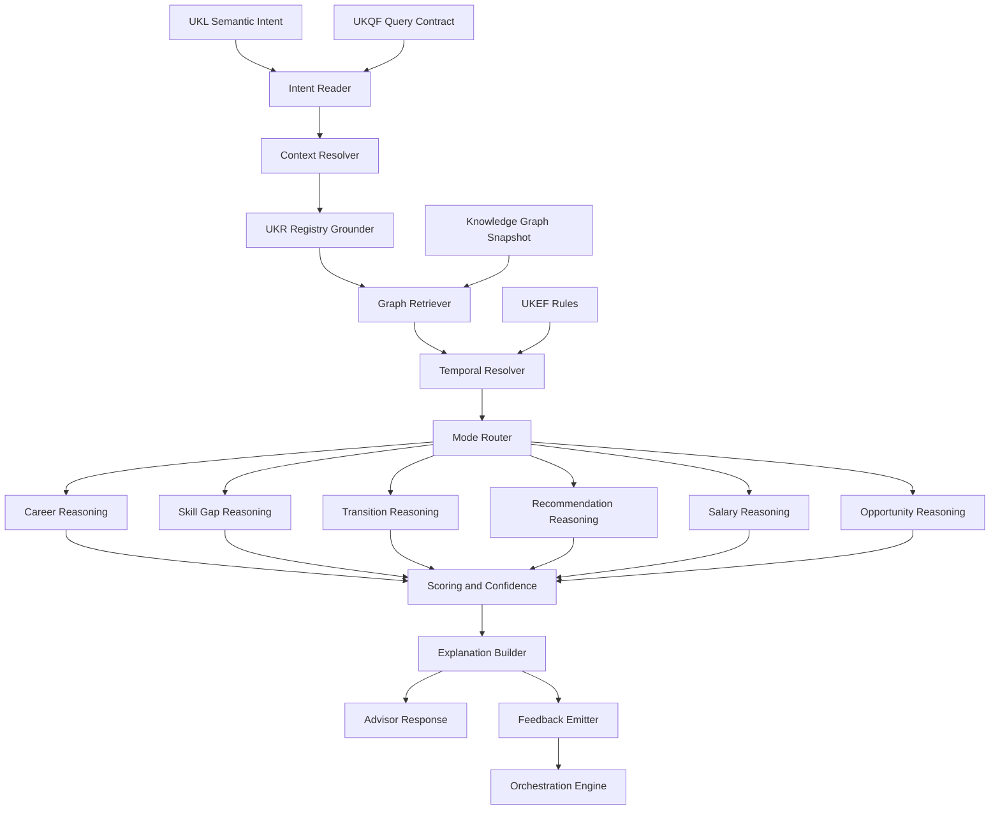

### 22.2 Multi-hop Graph Reasoning Flow

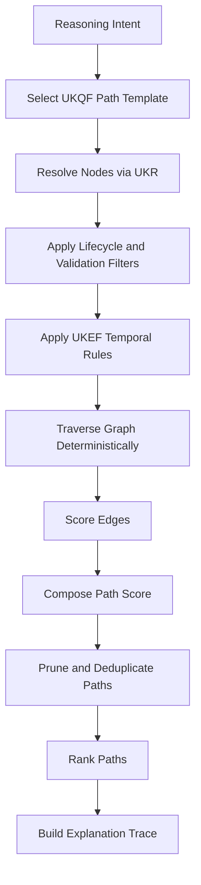

### 22.3 Decision Tree Model

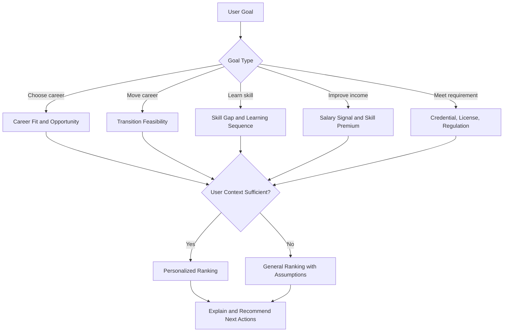

### 22.4 Scoring Model Diagram

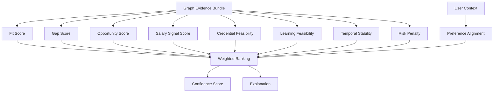

### 22.5 Feedback Loop Diagram

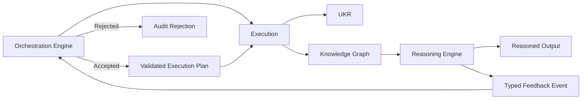

### 22.6 Explanation Generation Flow

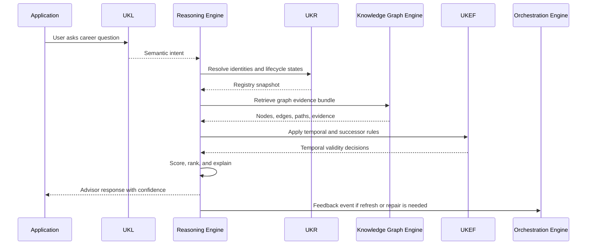

### 22.7 Career to Skill to Competency to Domain Example

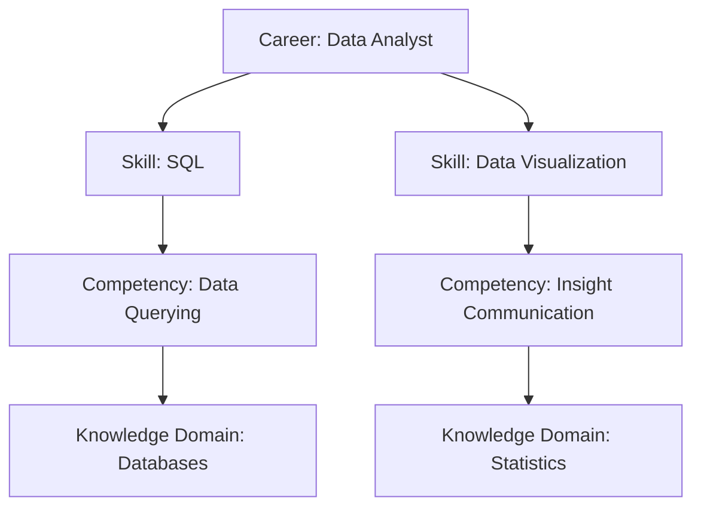

### 22.8 Career Transition Example

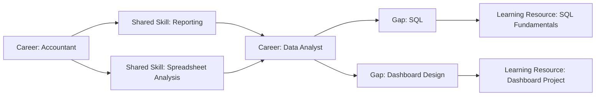

### 22.9 Industry to Technology Example

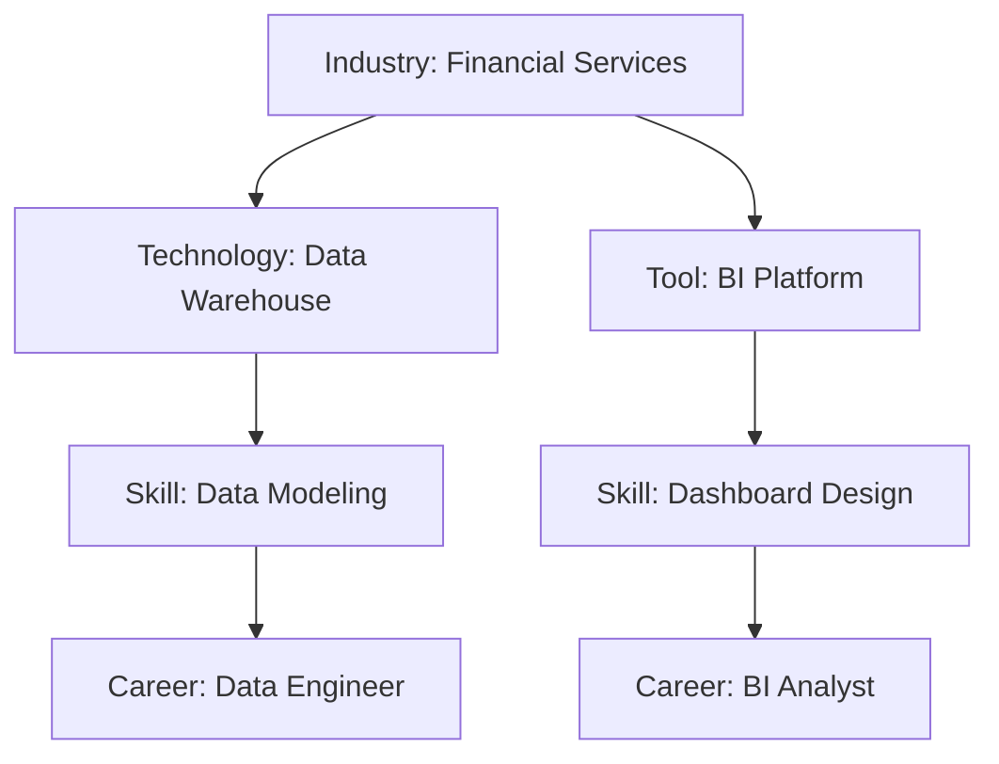

### 22.10 Education to Career Mapping Example

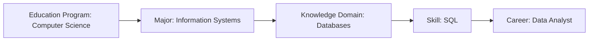

### 22.11 Salary to Skill Correlation Example

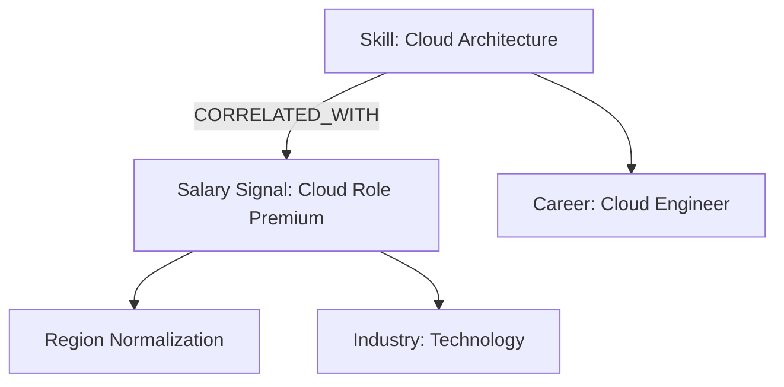

## 23. Integration Contracts

| System | Contract |
|---|---|
| UKL | Provides semantic intent, language, ambiguity, and terminology bindings. |
| UKQF | Provides path templates, filters, facets, query shapes, and ranking input requirements. |
| UKR | Provides canonical identity, lifecycle, version, merge, deprecation, and successor state. |
| Knowledge Graph Engine | Provides stable graph snapshots, path IDs, edge provenance, graph indexes, and graph evidence bundles. |
| UKVF | Provides validation status and high-stakes constraints. |
| UKEF | Provides temporal validity, evidence freshness, drift, successor, deprecation, and projection rules. |
| UKCF | Provides compiled outputs and retrieval payloads where reasoning needs them. |
| Orchestration Engine | Receives feedback events and notifies reasoning about graph/registry/query/evolution changes. |

## 24. Conformance Tests

| Test ID | Assertion |
|---|---|
| RE-GRD-001 | Reasoning output references stable graph and registry snapshots. |
| RE-GRD-002 | Invalid or quarantined objects are excluded from active recommendations. |
| RE-GRD-003 | Deprecated objects resolve to successors for active recommendations. |
| RE-GRD-004 | Historical mode preserves historical objects with warnings. |
| RE-RSN-001 | Career reasoning returns Career → Skill → Competency → Domain paths. |
| RE-RSN-002 | Skill gap reasoning distinguishes missing skill, proficiency gap, and credential gap. |
| RE-RSN-003 | Transition reasoning uses shared skills and blocker analysis. |
| RE-RSN-004 | Salary reasoning separates correlation from guarantee. |
| RE-RSN-005 | Opportunity reasoning includes risk and confidence. |
| RE-SCR-001 | Scores are normalized and tied to versioned scoring profile. |
| RE-SCR-002 | Missing evidence lowers confidence. |
| RE-SCR-003 | Regulatory uncertainty blocks definitive compliance advice. |
| RE-FBK-001 | Stale evidence can emit `evidence_refresh_needed` feedback. |
| RE-FBK-002 | Feedback never writes directly to UKR or graph. |
| RE-ADV-001 | Advisor output distinguishes fact, estimate, recommendation, and assumption. |

## 25. Production Readiness Checklist

| Category | Requirement |
|---|---|
| Authority | No generator creation, no direct registry writes, no direct graph writes. |
| UKL | Semantic intent integration. |
| UKQF | Query contracts and path templates. |
| UKR | Registry grounding and lifecycle filtering. |
| Knowledge Graph | Stable snapshot graph reasoning. |
| UKEF | Temporal, drift, successor, and projection rules. |
| UKVF | Validation status and review feedback. |
| Multi-hop | Approved path traversal. |
| Causal | Causality/correlation boundary. |
| Scoring | Ranking, fit, gap, salary, opportunity, confidence. |
| Uncertainty | Missing, stale, conflicting, sparse, and projected evidence handling. |
| Explainability | Path, score, gap, salary, compliance, projection, feedback explanations. |
| Advisor | Safe, user-aligned, actionable guidance. |
| Feedback | Closed loop to Orchestration Engine. |
| Auditability | Snapshot, path, score, confidence, and feedback records. |

## 26. Release Contract

Reasoning Engine V1 is production-ready when implementation passes all conformance tests and reasons only from UKL semantic intents, UKQF contracts, UKR-registered objects, stable Knowledge Graph snapshots, UKVF validation states, and UKEF temporal rules. It produces ranked, explainable, confidence-scored, uncertainty-aware recommendations and feedback events without mutating registry, graph, ontology, framework, or generator state.

Canonical file:

```text
assets/knowledge/engine/Reasoning_Engine_V1.md
```

