# Universal Knowledge Compilation Framework V1

**Product:** KarirGPS  
**Document Type:** Enterprise AI Compilation and Knowledge Orchestration Standard  
**Version:** 1.0  
**Status:** Normative Framework Baseline  
**Governing Constitution:** AI Constitution  
**Governing Ontology:** Career Knowledge Ontology  
**Governing Object Contract:** Knowledge Object Specification  
**Governing Generator Framework:** `assets/knowledge/frameworks/Universal_Entity_Generator_Framework_V1.md`  
**Governing Production Pipeline:** `assets/knowledge/frameworks/Universal_Knowledge_Production_Pipeline_V1.md`  
**Governing Validation Framework:** `assets/knowledge/frameworks/Universal_Knowledge_Validation_Framework_V1.md`  
**Governing Registry Framework:** `assets/knowledge/frameworks/Universal_Knowledge_Registry_Framework_V1.md`  
**Governing Language Framework:** `assets/knowledge/frameworks/Universal_Knowledge_Language_Framework_V1.md`  
**Governing Query Framework:** `assets/knowledge/frameworks/Universal_Knowledge_Query_Framework_V1.md`  
**Governing Evolution Framework:** `assets/knowledge/frameworks/Universal_Knowledge_Evolution_Framework_V1.md`  
**Target Path:** `assets/knowledge/frameworks/Universal_Knowledge_Compilation_Framework_V1.md`

---

## 0. Normative Status, Authority, and Compiler Boundary

### 0.1 Status

Universal Knowledge Compilation Framework V1, hereafter **UKCF**, is the authoritative compilation and orchestration architecture that transforms an authorized natural-language knowledge-production request into a deterministic, typed, explainable, auditable, and executable framework-invocation plan.

UKCF is the compiler control plane of the KarirGPS Knowledge Operating System.

UKCF does not author domain knowledge.

It compiles intent, resolves contracts, constructs execution graphs, invokes existing frameworks, monitors results, and packages produced artifacts.

### 0.2 Authority Precedence

When a compilation instruction conflicts with another authoritative source, apply this order:

1. applicable law, safety, privacy, and binding rights restrictions;
2. AI Constitution;
3. Career Knowledge Ontology;
4. Knowledge Object Specification;
5. Universal Entity Generator Framework or applicable object-kind framework;
6. Universal Knowledge Production Pipeline;
7. Universal Knowledge Validation Framework;
8. Universal Knowledge Registry Framework;
9. Universal Knowledge Language Framework;
10. Universal Knowledge Query Framework;
11. Universal Knowledge Evolution Framework;
12. Universal Knowledge Compilation Framework;
13. entity-specific generator specification;
14. approved production prompt;
15. compilation profile;
16. requesting application or agent instruction.

A lower-level instruction may specialize but MUST NOT weaken a higher-level requirement.

### 0.3 Compiler Boundary

UKCF defines:

- request admission and prompt parsing;
- semantic intent resolution;
- object-kind and entity planning;
- Ontology, KOS, Registry, generator, validation, and policy resolution;
- dependency discovery;
- new-object versus evolution planning;
- query and evidence-discovery planning;
- packaging and release planning;
- compilation intermediate representations;
- executable orchestration graphs;
- framework invocation order;
- recursive, incremental, parallel, batch, and multi-object compilation;
- retry, rollback, recovery, diagnostics, caching, and performance;
- security, traceability, audit, and governance.

UKCF does not:

- generate a Knowledge Object directly;
- replace UEGF or an entity-specific generator;
- execute knowledge retrieval outside UKQF;
- validate knowledge outside UKVF;
- create canonical identity outside UKR;
- evolve published knowledge outside UKEF;
- publish knowledge outside UKPP and UKR release controls;
- redefine Ontology or KOS;
- mandate an LLM, programming language, workflow engine, database, message broker, cloud, or deployment model.

### 0.4 Normative Terms

- **MUST** indicates a mandatory requirement.
- **MUST NOT** indicates a prohibited condition.
- **SHOULD** indicates a requirement that may be waived only through documented governance.
- **MAY** indicates an allowed option.
- **CONDITIONAL** indicates a requirement activated by a defined condition.

### 0.5 Compilation Invariants

Every UKCF implementation MUST preserve these invariants:

1. UKCF compiles and orchestrates; it does not generate domain knowledge.
2. Natural-language input is provisional until transformed into validated compiler intermediate representations.
3. The authoritative compilation meaning is the normalized Compilation IR, not the original prompt wording.
4. Every planned Knowledge Object resolves to a KOS object kind and, where applicable, an Ontology entity type.
5. Every entity-specific generation node resolves to a UEGF-conformant generator.
6. Every generated artifact enters UKPP and UKVF before UKR registration.
7. Every canonical identity operation occurs through UKR.
8. Every existing or published object revision request is evaluated for UKEF applicability.
9. Every knowledge lookup, duplicate check, dependency discovery, or evidence query is expressed through UKL and executed through UKQF.
10. UKCF never bypasses the authority order.
11. Compilation does not imply generation success.
12. Generation does not imply validation success.
13. Validation does not imply registration.
14. Registration does not imply publication.
15. Publication does not imply package completeness.
16. All compilation artifacts are versioned and fingerprinted.
17. Equivalent authoritative inputs produce the same Compilation IR and execution graph under the same compiler profile.
18. Probabilistic prompt interpretation cannot become authoritative without deterministic semantic resolution.
19. Ambiguous intent, identity, or object kind remains explicit.
20. A compiler cannot invent an entity generator, schema, predicate, or validator.
21. Missing generator capability produces a typed compilation failure or onboarding requirement.
22. Mandatory dependencies are planned before dependent activation.
23. Dependency cycles are detected and dispositioned before execution.
24. Recursive compilation has bounded depth and cycle protection.
25. Parallel compilation preserves shared snapshots, contract versions, and security context.
26. Incremental compilation reuses only compatible, valid, and fingerprint-matching artifacts.
27. Batch compilation provides deterministic manifests and terminal accounting.
28. Retry does not change semantic intent unless a new compilation case is created.
29. Rollback restores orchestration and release state without deleting canonical history.
30. Partial compilation is explicit and cannot masquerade as a complete package.
31. Compiler diagnostics identify source prompt spans, IR nodes, framework nodes, and remediation.
32. Compiler explainability exposes decisions, mappings, dependencies, and invocation order without private chain of thought.
33. Security context may be narrowed but never broadened during delegation.
34. Cached plans cannot cross incompatible actor, purpose, policy, context, version, or snapshot boundaries.
35. Each execution node is idempotent or declares controlled side effects.
36. Framework results are treated as typed artifacts, not unstructured conversational replies.
37. UKCF cannot silently repair failed UKVF findings.
38. UKCF cannot silently merge or split identities.
39. UKCF cannot publish from a stale or invalid compilation graph.
40. Compilation and orchestration remain technology-neutral and scalable to billions of Knowledge Objects.

### 0.6 Authoritative Compilation Products

UKCF produces the following authoritative compiler artifacts:

1. Prompt Intake Record
2. Prompt Intermediate Representation
3. Intent Intermediate Representation
4. Object Plan
5. Entity Plan
6. Dependency Graph
7. Framework Binding Plan
8. Validation Plan
9. Registry Plan
10. Evolution Plan
11. Query Plan
12. Packaging Plan
13. Release Plan
14. Execution Context
15. Compilation Execution Graph
16. Artifact Manifest
17. Compiler Diagnostic Report
18. Compilation Audit Record

Only the appropriate downstream framework produces the actual Knowledge Objects.

---

# 1. Purpose

## 1.1 Primary Purpose

UKCF defines how a natural-language request to create, revise, enrich, package, or release knowledge is compiled into an executable orchestration plan.

## 1.2 Coordination Purpose

UKCF coordinates:

- Ontology;
- KOS;
- UEGF-derived generators;
- UKPP;
- UKVF;
- UKR;
- UKL;
- UKQF;
- UKEF.

## 1.3 Determinism Purpose

UKCF converts ambiguous language into explicit, typed, version-locked plans before framework execution.

## 1.4 Scale Purpose

UKCF supports:

- one-object requests;
- dependency-rich packages;
- recursive object generation;
- billion-object batches;
- incremental rebuilds;
- distributed multi-agent compilation.

## 1.5 Assurance Purpose

UKCF guarantees that every orchestration path is:

- authoritative;
- explainable;
- auditable;
- recoverable;
- idempotent;
- security-scoped;
- compatible with downstream framework contracts.

---

# 2. Scope

## 2.1 In-Scope Requests

UKCF accepts authorized requests to:

- generate a new Knowledge Object;
- generate multiple related Knowledge Objects;
- generate an Entity Object;
- generate a Package or Collection Object;
- enrich an existing Draft;
- revise a validated or registered object;
- evolve a published object;
- localize an object;
- refresh evidence;
- rebuild relationships;
- produce a release package;
- produce a dependency-complete knowledge package;
- regenerate affected objects after framework or evidence change.

## 2.2 In-Scope Object Kinds

- Entity Object;
- Contextual Assertion Object;
- Relationship Object;
- Evidence Object;
- Source Object;
- Package Object;
- Collection Object;
- registered future KOS object kinds.

## 2.3 In-Scope Entity Types

All current and future Ontology entity types, including:

- Career;
- Skill;
- Major;
- Industry;
- University;
- Company;
- Certification;
- Scholarship;
- Technology;
- Tool;
- Learning Resource;
- Assessment;
- Occupation where registered;
- future entity types.

## 2.4 Out-of-Scope Requests

UKCF does not compile:

- prohibited knowledge uses;
- direct database administration;
- direct canonical mutation;
- unregistered framework bypasses;
- unsupported private-data inference;
- requests whose purpose cannot be authorized.

---

# 3. Design Philosophy

## 3.1 Compile Before Execute

No generator or production stage is invoked before the request is compiled into a valid execution graph.

## 3.2 Meaning Before Workflow

The compiler resolves semantic intent before selecting agents, models, queues, or workflows.

## 3.3 Contracts Before Prompts

A production prompt is selected only after:

- object kind;
- entity type;
- generator version;
- KOS;
- Ontology;
- evidence;
- validation;
- policy

are resolved.

## 3.4 Existing Knowledge Before New Generation

UKCF first determines whether the requested knowledge:

- already exists;
- requires reuse;
- requires revision;
- requires evolution;
- requires a new identity.

## 3.5 Plan Dependencies Before Content

Dependent objects, evidence, relationships, and identity prerequisites are planned before generation starts.

## 3.6 Deterministic Kernel, Probabilistic Front End

Natural-language parsing may use AI.

Authoritative planning uses typed IR, deterministic rules, registered contracts, and governed decisions.

## 3.7 Framework Specialization

UKCF invokes each existing framework only for its owned responsibility.

## 3.8 Explainability by Construction

Every decision is represented in an IR node, diagnostic, binding, or dependency edge.

## 3.9 Failure as a Typed Output

Compilation failure is a governed result, not an invitation to improvise.

## 3.10 Build Graphs, Not Chains

Complex knowledge production uses dependency-aware execution graphs rather than one monolithic prompt.

---

# 4. Compilation Principles

## 4.1 Semantic Preservation

The compiled plan must preserve the user’s authorized intent without adding unsupported objectives.

## 4.2 Minimal Assumption

Underspecified material requirements become:

- governed defaults;
- explicit unresolved parameters;
- typed diagnostic failures.

## 4.3 Idempotent Planning

The same normalized request and version fingerprint produce the same plan.

## 4.4 Version Locking

Every plan locks:

- Constitution version;
- Ontology version;
- KOS version;
- UEGF version;
- UKPP version;
- UKVF version;
- UKR version;
- UKL version;
- UKQF version;
- UKEF version;
- generator versions;
- prompt versions;
- policy versions.

## 4.5 Separation of Planning and Execution

Compilation artifacts are created before execution artifacts.

## 4.6 One Owner per Decision

Identity is owned by UKR.

Generation behavior is owned by UEGF and entity generators.

Production lifecycle is owned by UKPP.

Validation is owned by UKVF.

Evolution is owned by UKEF.

Retrieval execution is owned by UKQF.

## 4.7 Explicit Side Effects

Every side-effecting node declares:

- authority;
- idempotency;
- rollback;
- audit;
- expected state.

## 4.8 No Hidden Recursion

All recursive dependencies are visible in the Dependency Graph.

## 4.9 Safe Parallelism

Only independent or safely coordinated nodes run in parallel.

## 4.10 Terminal Accounting

Every compilation target reaches:

- produced;
- reused;
- revised;
- evolved;
- blocked;
- rejected;
- cancelled;
- failed;
- quarantined.

---

# 5. Compiler Architecture

## 5.1 Logical Components

UKCF contains:

1. Compilation Gateway
2. Prompt Parser
3. Intent Resolver
4. Object Planner
5. Entity Planner
6. Ontology Resolver
7. KOS Resolver
8. Registry Resolver
9. Dependency Analyzer
10. Generator Resolver
11. Query Planner
12. Evidence Planner
13. Validation Planner
14. Registry Planner
15. Evolution Planner
16. Packaging Planner
17. Release Planner
18. Security Compiler
19. Execution Graph Builder
20. Orchestration Runtime
21. Diagnostic Engine
22. Explanation Assembler
23. Trace and Audit Service
24. Cache and Incremental Build Service
25. Compiler Registry

## 5.2 Compiler Architecture Diagram

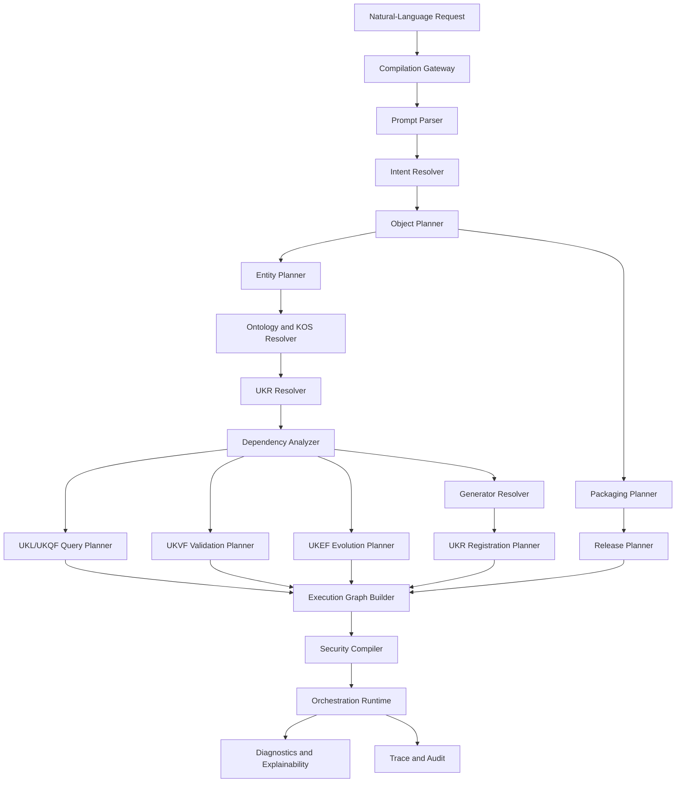

## 5.3 Compiler Control Plane

The Compiler Control Plane owns:

- compilation state;
- IR versions;
- graph construction;
- framework binding;
- checkpoints;
- retries;
- cancellation;
- diagnostics;
- completion.

## 5.4 Compiler Execution Plane

The Execution Plane invokes existing framework APIs and stores typed artifacts.

## 5.5 Compiler Registry

The Compiler Registry stores:

- compiler versions;
- IR schemas;
- compilation profiles;
- framework bindings;
- generator compatibility;
- planner rules;
- diagnostic codes;
- conformance suites.

---

# 6. Compiler Layers

## 6.1 Layer 0 — Admission

Authenticates actor, purpose, authority, request size, and allowed compilation mode.

## 6.2 Layer 1 — Linguistic Parsing

Converts natural language into structured prompt clauses.

## 6.3 Layer 2 — Semantic Intent

Resolves operation, object kinds, entity types, scope, deliverables, and constraints.

## 6.4 Layer 3 — Knowledge Planning

Creates Object Plans, Entity Plans, identity decisions, and context requirements.

## 6.5 Layer 4 — Dependency Planning

Builds evidence, source, relationship, object, query, validation, Registry, evolution, and release dependencies.

## 6.6 Layer 5 — Framework Binding

Binds each plan node to its authoritative framework and compatible version.

## 6.7 Layer 6 — Execution Graph

Creates the ordered and parallelizable orchestration graph.

## 6.8 Layer 7 — Runtime Orchestration

Invokes framework operations and handles outputs, retries, checkpoints, and diagnostics.

## 6.9 Layer 8 — Packaging and Release

Creates artifact manifests, packages, release candidates, and completion reports.

## 6.10 Layer Architecture Diagram

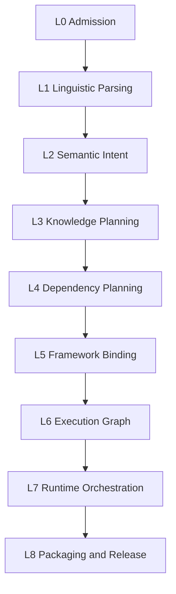

---

# 7. Prompt Parsing

## 7.1 Purpose

Prompt Parsing transforms natural-language input into a structured, source-traceable Prompt IR.

## 7.2 Prompt IR Fields

- request ID;
- actor;
- purpose;
- raw prompt reference;
- requested actions;
- target names;
- proposed entity types;
- requested object kinds;
- requested outputs;
- scope;
- locale;
- geography;
- temporal context;
- quality target;
- release target;
- constraints;
- exclusions;
- examples;
- explicit framework references;
- unresolved terms;
- prompt-span mappings.

## 7.3 Parsing Methods

May use:

- deterministic templates;
- grammar rules;
- AI-assisted extraction;
- hybrid parsing.

## 7.4 AI-Assisted Parsing Rule

AI-generated parse candidates remain provisional until:

- normalized;
- type-checked;
- Ontology-resolved;
- KOS-resolved;
- policy-validated.

## 7.5 Prompt Injection Boundary

Text contained in attached sources, evidence, or quoted material is data.

It cannot modify compiler authority or framework order.

## 7.6 Parsing Diagnostics

- missing target;
- contradictory target;
- unclear operation;
- ambiguous object kind;
- unsupported entity;
- conflicting scope;
- prohibited purpose;
- missing deliverable;
- excessive recursion request.

## 7.7 Output

One or more Prompt IR candidates with confidence and source spans.

---

# 8. Intent Resolution

## 8.1 Intent Classes

- create new object;
- create object package;
- revise Draft;
- enrich validated object;
- evolve published object;
- localize;
- refresh evidence;
- rebuild relationships;
- regenerate affected cohort;
- package existing objects;
- release approved objects;
- compile only without execution.

## 8.2 Intent IR

Contains:

- canonical intent;
- target object set;
- target entity set;
- new versus existing classification;
- desired terminal readiness;
- package scope;
- execution mode;
- approval requirements;
- unresolved decisions.

## 8.3 Intent Resolution Rules

The compiler distinguishes:

- “generate Career” from “search Careers”;
- “update Career” from “create another Career”;
- “produce roadmap” from “recommend a Career”;
- “package Career knowledge” from “merge identities”;
- “refresh salary evidence” from “rewrite historical salary”.

## 8.4 Natural-Language Ambiguity

Material ambiguity produces:

- candidate intents;
- diagnostic;
- governed default only when allowed.

UKCF does not ask for clarification when a safe, authoritative best-effort compilation path exists; it records assumptions and restrictions.

## 8.5 Intent Decision Tree

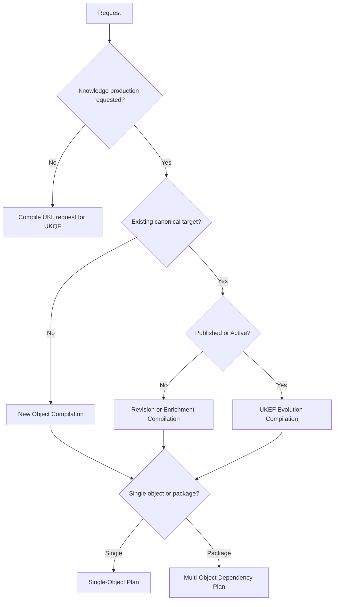

---

# 9. Object Planning

## 9.1 Purpose

Determine which KOS object kinds must be produced, reused, revised, or linked.

## 9.2 Object Plan Entry

Each entry contains:

- Compilation Target ID;
- object kind;
- proposed entity type;
- target semantic identity;
- action;
- desired KOS lifecycle state;
- required fields;
- required relationships;
- required evidence;
- required localizations;
- package role;
- dependencies;
- generator requirement;
- validation profile;
- Registry action;
- publication requirement.

## 9.3 Object Actions

- create;
- reuse;
- reference;
- revise;
- evolve;
- localize;
- enrich;
- deprecate;
- package;
- exclude;
- block.

## 9.4 Object-Kind Resolution

The compiler uses KOS to distinguish:

- Entity Object;
- Relationship Object;
- Contextual Assertion Object;
- Evidence Object;
- Source Object;
- Package Object;
- Collection Object.

## 9.5 Object Plan Completeness

A plan is complete only when every requested deliverable maps to one or more object entries or a typed unsupported result.

## 9.6 No Object-Type Collapse

The compiler must not collapse:

- University into Education Program;
- Career into Skill;
- Major into Qualification;
- Company into Industry;
- Technology into Tool;
- Certification into Assessment;
- Learning Resource into Skill;
- roadmap package into Career identity.

---

# 10. Entity Planning

## 10.1 Purpose

Determine entity types, identity operations, boundaries, and canonical references.

## 10.2 Entity Plan Entry

- proposed entity type;
- Ontology class;
- canonical label candidate;
- aliases;
- identity status;
- existing Entity ID candidates;
- concept-instance decision;
- adjacent-type exclusions;
- merge or split indicators;
- geography and locale;
- identity confidence;
- required UKR operation.

## 10.3 Identity Status

- existing exact identity;
- existing contextual identity;
- new identity required;
- provisional reservation required;
- duplicate risk;
- merge review;
- split review;
- wrong type;
- unresolved.

## 10.4 Entity Planning Rule

No new entity generation node is created before:

- duplicate search;
- type validation;
- concept-instance validation;
- active revision lookup;
- identity continuity assessment when updating.

## 10.5 Occupation Handling

If `Occupation` is registered as:

- an Ontology entity type, use its generator;
- a Career subtype, compile through the Career generator with subtype constraints;
- an external taxonomy concept only, compile a mapping or contextual object rather than inventing a type.

---

# 11. Ontology Resolution

## 11.1 Purpose

Resolve every entity type, field, relationship predicate, controlled value, and classification required by the Compilation IR.

## 11.2 Resolution Inputs

- Intent IR;
- Object Plan;
- Entity Plan;
- active Ontology version;
- KOS templates;
- registered extensions.

## 11.3 Resolution Output

- canonical Ontology IDs;
- class hierarchy;
- valid predicates;
- domain and range;
- mandatory relationships;
- deprecated terms;
- migration mappings;
- unresolved symbols.

## 11.4 Ontology Static Checks

- entity type exists;
- object kind is valid;
- predicate exists;
- domain/range valid;
- no category mixing;
- no unauthorized extension;
- inherited fields are compatible.

## 11.5 Failure

Unknown or incompatible material Ontology terms block compilation.

## 11.6 Ontology Resolution Checkpoint

No Generator Plan may be bound before Ontology resolution passes.

---

# 12. Dependency Resolution

## 12.1 Dependency Classes

- identity;
- object;
- evidence;
- source;
- relationship target;
- generator;
- validation;
- Registry;
- evolution;
- query;
- package;
- release;
- localization;
- schema;
- Ontology;
- security;
- human review.

## 12.2 Dependency Graph Entry

- Dependency Node ID;
- source target;
- dependent target;
- dependency type;
- mandatory or optional;
- availability;
- action;
- version;
- cycle policy;
- failure propagation;
- ownership.

## 12.3 Dependency Discovery

Uses UKL and UKQF to discover:

- existing entities;
- active revisions;
- related objects;
- required Skills;
- source and evidence availability;
- package members;
- affected dependents;
- duplicate candidates.

## 12.4 Dependency Graph Diagram

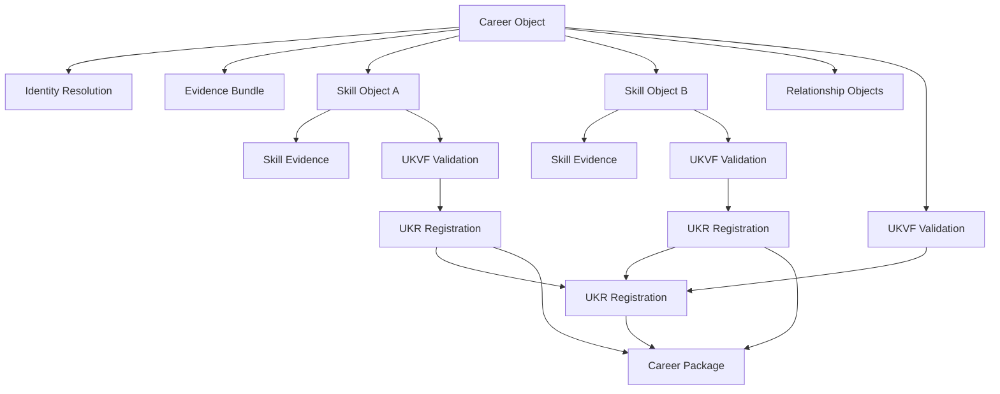

## 12.5 Cycle Handling

Cycles are classified:

- valid semantic cycle;
- recursive production cycle;
- identity cycle;
- package cycle;
- invalid dependency cycle.

Recursive production cycles must be broken through:

- existing reference reuse;
- provisional identity reservation;
- staged registration;
- strongly connected compilation cohort;
- manual governance.

## 12.6 Dependency Closure

A target cannot reach package-complete or release-ready status until mandatory dependencies have terminal dispositions.

---

# 13. Generator Resolution

## 13.1 Purpose

Select the authoritative UEGF-conformant generator and approved production prompt.

## 13.2 Generator Resolution Inputs

- object kind;
- entity type;
- Ontology version;
- KOS version;
- locale;
- generator extension profiles;
- risk;
- model qualification;
- desired readiness.

## 13.3 Generator Registry Match

The compiler resolves:

- Generator ID;
- version;
- UEGF version;
- entity extension pack;
- production prompt;
- supported models;
- validation profile;
- known limitations;
- status.

## 13.4 Generator Decision Outcomes

- exact generator;
- compatible generator with extension;
- object-kind production specification;
- generator onboarding required;
- unsupported;
- deprecated generator blocked.

## 13.5 Generator Binding Rule

UKCF creates an invocation binding.

It never embeds entity-specific generation logic into the compiler.

## 13.6 Model Resolution

Model selection is delegated to UKPP under qualified lanes.

UKCF may constrain required capability and determinism class.

## 13.7 Missing Generator

When no compliant generator exists:

- compilation fails for that target;
- dependent targets are blocked or partial;
- onboarding diagnostic is emitted;
- UKCF does not improvise with a generic prompt.

---

# 14. Validation Planning

## 14.1 Purpose

Determine which UKVF profiles, validators, human reviews, and readiness gates apply.

## 14.2 Validation Plan Entry

- target;
- UKVF profile;
- validator types;
- mandatory blockers;
- human review level;
- cross-object snapshot;
- evidence threshold;
- localization requirement;
- quantitative requirement;
- publication-readiness requirement;
- revalidation triggers.

## 14.3 Profile Composition

The compiler composes:

- Universal Core;
- Entity Object;
- Contextual Assertion;
- Volatile Knowledge;
- Regulated Knowledge;
- Localization;
- Quantitative;
- High-Impact Reasoning;
- Retrieval and RAG;
- Publication;
- entity-specific extensions.

The stricter applicable rule wins.

## 14.4 Multi-Object Validation

Package validation includes:

- item validation;
- relationship validation;
- cross-object validation;
- dependency closure;
- package completeness;
- release compatibility.

## 14.5 Validation Checkpoint Plan

The execution graph inserts:

- pre-generation contract checks;
- generator output checks;
- UKVF validation;
- human review;
- package QA;
- pre-registration validity check;
- pre-release validity check.

---

# 15. Registry Planning

## 15.1 Purpose

Plan all UKR identity, object, revision, relationship, alias, localization, evidence, source, and publication-pointer operations.

## 15.2 Registry Plan Operations

- resolve identity;
- reserve Entity ID;
- reuse Entity ID;
- create Object ID;
- create Revision ID;
- register Source;
- register Evidence;
- register Relationship;
- register alias;
- register localization;
- bind validation;
- set active candidate;
- update active pointer;
- register package lineage.

## 15.3 Registration Preconditions

Each registration node declares:

- required UKPP state;
- required UKVF outcome;
- expected UKR state;
- idempotency key;
- dependency closure;
- conflict behavior;
- rollback behavior.

## 15.4 Existing Object Strategy

Existing Draft:

- revise under same Object ID.

Existing validated but unpublished revision:

- create revision only if content changes.

Existing Active or Published revision:

- invoke UKEF planning.

## 15.5 Registry Conflict

Conflicts return to compilation as:

- duplicate identity;
- stale revision;
- active-pointer conflict;
- merge required;
- split required;
- validation expired.

---

# 16. Evolution Planning

## 16.1 Purpose

Determine whether UKEF is required and create the Evolution Plan.

## 16.2 UKEF Trigger Conditions

- target is Active or Published;
- canonical meaning changes;
- evidence withdrawal affects published claims;
- identity rename, merge, split, or replacement;
- deprecation;
- relationship evolution;
- schema or Ontology migration;
- historical restatement;
- release compatibility impact.

## 16.3 Evolution Plan Entry

- Evolution Case ID;
- change class;
- identity continuity;
- source revision;
- target semantic version;
- effective, transaction, and publication time;
- compatibility;
- dependency impact;
- migration;
- query compatibility;
- release plan;
- rollback target.

## 16.4 New Object Versus Evolution Decision

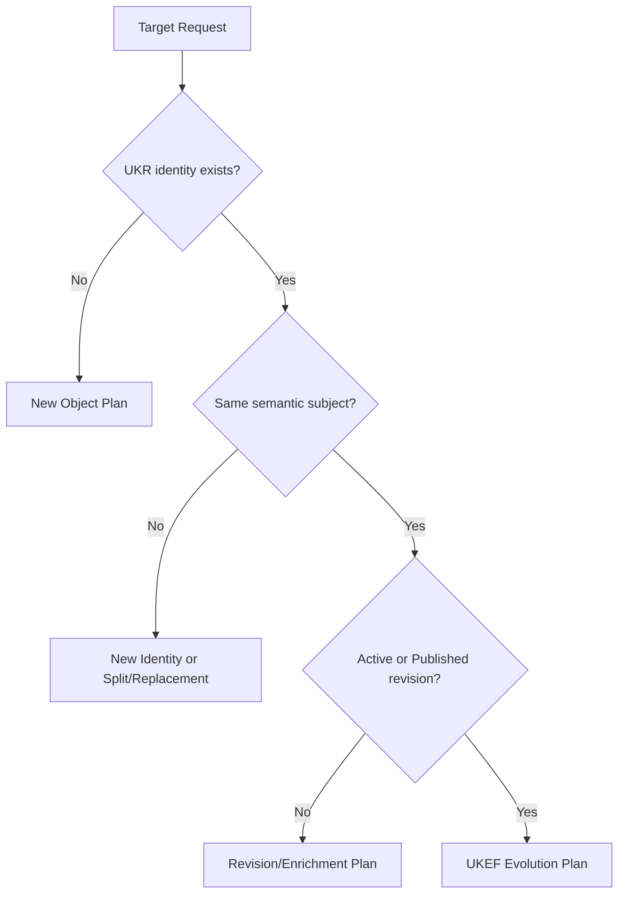

## 16.5 Compiler Constraint

UKCF does not classify an Active-object change as ordinary generation to avoid UKEF controls.

---

# 17. Query Planning

## 17.1 Purpose

Compile all required knowledge lookups into UKL expressions for UKQF execution.

## 17.2 Query Plan Uses

- duplicate search;
- identity resolution;
- active revision retrieval;
- historical revision retrieval;
- dependency discovery;
- source discovery;
- evidence lookup;
- relationship traversal;
- generator compatibility lookup;
- validation lookup;
- package completeness;
- evolution impact;
- release compatibility.

## 17.3 Query Plan Entry

- Query Plan ID;
- purpose;
- UKL AST;
- UKQF profile;
- required snapshot;
- required result fields;
- evidence and validation constraints;
- security scope;
- timeout;
- cache policy;
- consuming compiler node.

## 17.4 Query Results

UKQF results are normalized into compiler facts with:

- source Query Result ID;
- canonical references;
- snapshot;
- confidence;
- warnings;
- validity.

## 17.5 No Direct Backend Query

UKCF cannot issue SQL, graph queries, vector queries, or search DSL directly.

---

# 18. Packaging Planning

## 18.1 Purpose

Define the final set of produced, reused, revised, and referenced artifacts.

## 18.2 Package Types

- single-object delivery package;
- entity knowledge package;
- Career Package;
- learning package;
- evidence package;
- release package;
- migration package;
- audit package;
- future registered package types.

## 18.3 Package Manifest Entry

- package role;
- Entity ID;
- Object ID;
- Revision ID;
- artifact type;
- produced or reused;
- validation status;
- registration status;
- publication status;
- dependency state;
- access policy;
- checksum;
- lineage.

## 18.4 Package Completeness

A package declares:

- mandatory members;
- optional members;
- excluded members;
- blocked members;
- unresolved members;
- package validation result.

## 18.5 Package Atomicity

A package may be:

- atomically releasable;
- partially releasable;
- non-releasable until complete.

## 18.6 No Copy-Based Packaging

Packages reference canonical UKR objects rather than duplicating authoritative payloads unless an export profile requires a version-locked copy.

---

# 19. Release Planning

## 19.1 Purpose

Plan the UKPP release workflow for registered and approved objects.

## 19.2 Release Plan Entry

- Release ID candidate;
- release channel;
- package manifest;
- included revisions;
- dependency lock;
- release order;
- publication context;
- compatibility;
- effective time;
- access policy;
- projection requirements;
- canary;
- rollback target;
- monitoring.

## 19.3 Release Eligibility

Requires:

- UKVF pass;
- human review where required;
- UKR registration;
- package QA;
- dependency closure;
- graph/vector/search policy;
- UKEF compatibility when applicable;
- rollback readiness.

## 19.4 Release Ordering

Dependencies are published before or atomically with dependents according to release policy.

## 19.5 Partial Release

Allowed only when Package Plan and UKPP policy prove independence.

---

# 20. Execution Context

## 20.1 Purpose

Provide one immutable context shared across compilation and orchestration.

## 20.2 Execution Context Fields

- Compilation ID;
- Request ID;
- actor;
- purpose;
- authority;
- tenant or domain;
- locale;
- geography;
- jurisdiction;
- temporal scope;
- target readiness;
- security classification;
- framework versions;
- policy versions;
- UKR snapshot;
- UKQF consistency profile;
- model restrictions;
- resource budget;
- deadline;
- correlation ID;
- parent Compilation ID;
- recursion depth.

## 20.3 Context Inheritance

Child compilation inherits:

- authority;
- purpose;
- version locks;
- Registry snapshot;
- security;
- locale and geography unless explicitly scoped.

A child may narrow context but not broaden it.

## 20.4 Context Mutation

Material context change creates a new Compilation Revision or Compilation ID.

## 20.5 Reproducibility

The Execution Context is part of the Compilation Fingerprint.

---

# 21. Execution Graph

## 21.1 Purpose

Represent every framework invocation, dependency, checkpoint, and artifact flow.

## 21.2 Node Types

- Parse;
- ResolveIntent;
- ResolveOntology;
- QueryUKQF;
- ResolveIdentityUKR;
- ReserveIdentityUKR;
- CollectEvidenceUKPP;
- InvokeGeneratorUKPP;
- ValidateUKVF;
- HumanReviewUKPP;
- RegisterUKR;
- PlanEvolutionUKEF;
- MigrateUKEF;
- Package;
- QualityAssureUKPP;
- ReleaseUKPP;
- Monitor;
- Diagnostic;
- Barrier;
- Compensation;
- Rollback.

## 21.3 Node Contract

- Node ID;
- Compilation Target ID;
- framework owner;
- operation;
- input artifacts;
- output artifacts;
- dependencies;
- expected pre-state;
- expected post-state;
- idempotency key;
- timeout;
- retry;
- security scope;
- checkpoint;
- compensation;
- failure propagation.

## 21.4 Graph Properties

The graph must be:

- directed;
- schedulable;
- versioned;
- acyclic at orchestration level, except controlled loop nodes;
- deterministic under the same inputs;
- traceable.

## 21.5 Execution Graph Diagram

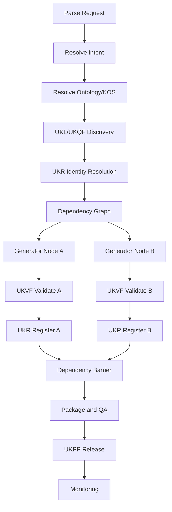

## 21.6 Graph Freeze

The graph is frozen before execution.

Allowed runtime changes create a new Physical Orchestration Revision while preserving the semantic Compilation Plan.

---

# 22. Compiler Pipeline

## 22.1 Canonical Pipeline

1. admit request;
2. parse prompt;
3. construct Prompt IR;
4. resolve Intent IR;
5. resolve Ontology and KOS;
6. query UKR through UKL/UKQF;
7. plan identities;
8. plan objects;
9. discover dependencies;
10. resolve generators;
11. plan evidence;
12. plan validation;
13. plan Registry operations;
14. plan UKEF evolution when applicable;
15. plan packages and release;
16. build Execution Graph;
17. run static analysis;
18. authorize graph;
19. execute framework nodes;
20. collect typed artifacts;
21. reconcile dependencies;
22. package;
23. release when requested and eligible;
24. assemble diagnostics, explanation, trace, and audit;
25. complete.

## 22.2 Pipeline Diagram

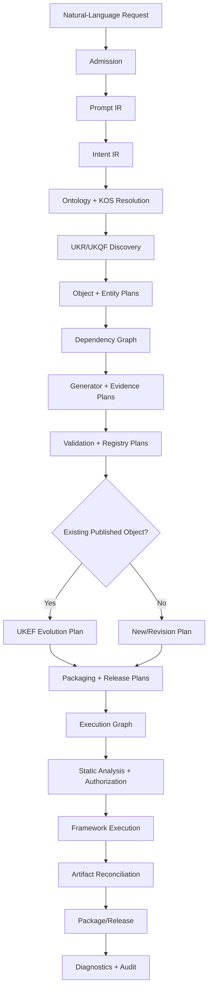

## 22.3 Static Analysis

Before execution, UKCF checks:

- unresolved symbols;
- missing generators;
- dependency cycles;
- version conflicts;
- invalid framework order;
- missing validation;
- missing Registry plan;
- stale snapshots;
- missing rollback;
- unauthorized nodes;
- package incompleteness.

---

# 23. Multi-Object Compilation

## 23.1 Purpose

Compile multiple objects as one coherent dependency-managed unit.

## 23.2 Multi-Object Plan

Contains:

- root deliverable;
- object targets;
- shared identity context;
- shared evidence;
- dependency graph;
- ordering;
- parallel groups;
- package rules;
- release atomicity;
- failure policy.

## 23.3 Shared Artifact Reuse

Multiple targets may reuse:

- Source Objects;
- Evidence Objects;
- Geography Objects;
- Industry Objects;
- Skill Objects;
- validation snapshots;
- Registry queries.

Reuse requires compatible scope and lineage.

## 23.4 Multi-Object Orchestration Diagram

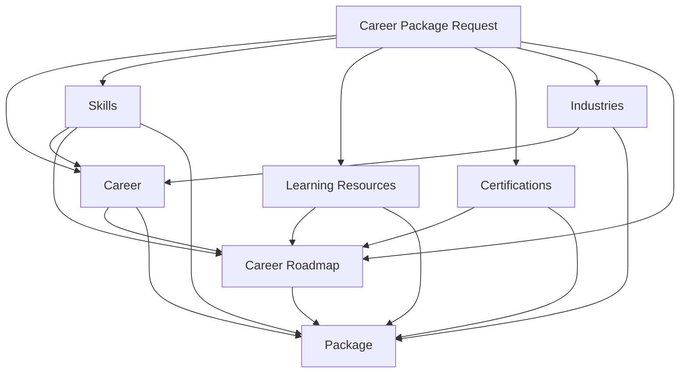

## 23.5 Failure Policy

- root-required target failure blocks package;
- optional target failure permits package with exception when policy allows;
- shared dependency failure blocks all affected targets;
- unrelated targets continue.

## 23.6 Cross-Object Validation

Runs after individual objects are validated and before package release.

---

# 24. Recursive Compilation

## 24.1 Definition

Recursive compilation occurs when producing one target requires producing or revising another target.

## 24.2 Examples

- Career requires missing Skill Objects;
- Skill requires prerequisite Skill Objects;
- University requires Education Program references;
- Career Roadmap requires Career, Skill, Learning Resource, and Certification objects.

## 24.3 Recursion Rules

- maximum depth is profile-defined;
- every child has a Compilation Target ID;
- identity search occurs before child creation;
- repeated target resolves to the existing graph node;
- cycles become strongly connected cohorts;
- recursion cannot broaden purpose or access.

## 24.4 Recursive Decision Tree

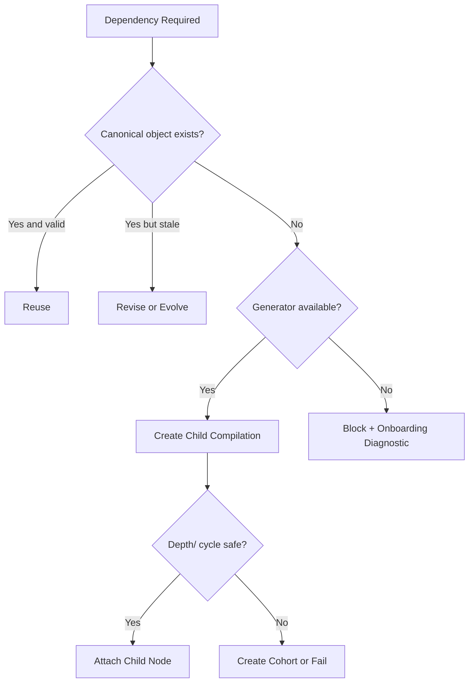

## 24.5 Recursive Completion

Parent waits only for mandatory child terminal dispositions.

---

# 25. Incremental Compilation

## 25.1 Purpose

Recompile only targets affected by changed inputs, contracts, evidence, or dependencies.

## 25.2 Fingerprints

Incremental compilation compares:

- Prompt IR fingerprint;
- Intent IR fingerprint;
- Object Plan fingerprint;
- generator fingerprint;
- evidence fingerprint;
- validation profile;
- Registry snapshot;
- dependency fingerprint;
- package fingerprint;
- release fingerprint.

## 25.3 Reuse Conditions

An artifact may be reused only when:

- exact target and context match;
- source artifact remains valid;
- validation has not expired;
- framework versions are compatible;
- access policy matches;
- dependency set is unchanged or proven compatible;
- no UKEF event invalidates it.

## 25.4 Invalidations

- source withdrawal;
- Ontology change;
- KOS change;
- generator major change;
- validation-rule change;
- identity merge or split;
- active revision change;
- security policy change;
- package requirement change.

## 25.5 Incremental Build Output

- reused nodes;
- rebuilt nodes;
- invalidated nodes;
- blocked nodes;
- reason;
- cost saved;
- compatibility.

---

# 26. Parallel Compilation

## 26.1 Safe Unit

The Compilation Target is the default parallel unit.

## 26.2 Parallel Eligibility

Targets may run in parallel when:

- no unresolved mandatory dependency exists;
- shared snapshots match;
- identity writes do not conflict;
- release order is preserved;
- review capacity is available.

## 26.3 Single-Writer Rules

Only one active writer may:

- reserve a specific identity;
- register a target revision;
- change an active pointer;
- execute a merge or split.

## 26.4 Barriers

Barriers include:

- identity complete;
- evidence complete;
- all child objects validated;
- all mandatory objects registered;
- package QA;
- release readiness.

## 26.5 Parallel Compilation Diagram

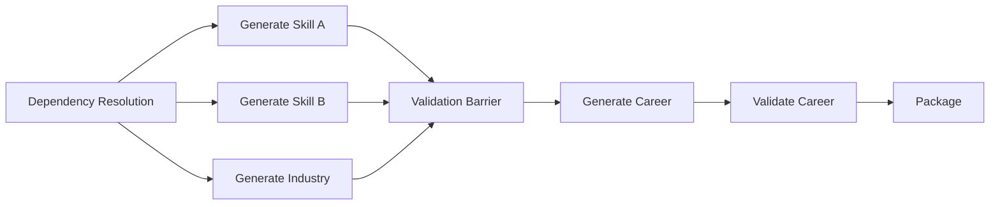

## 26.6 Arrival-Order Independence

Artifact arrival order cannot change semantic package ordering or deterministic IDs.

---

# 27. Batch Compilation

## 27.1 Batch Definition

A Compilation Batch is a version-locked manifest of compilation requests or targets.

## 27.2 Batch Manifest

- Batch ID;
- program;
- source request set;
- target set;
- framework locks;
- generator lanes;
- validation profiles;
- Registry snapshot;
- concurrency;
- retry;
- package and release policy;
- expected count.

## 27.3 Batch States

- planned;
- preflight;
- ready;
- compiling;
- executing;
- validating;
- registering;
- packaging;
- completed;
- completed with exceptions;
- failed;
- cancelled;
- quarantined.

## 27.4 Deterministic Sharding

Targets are assigned to shards using a versioned deterministic function.

## 27.5 Batch Preflight

Checks:

- duplicates;
- missing generators;
- identity conflicts;
- contract compatibility;
- review capacity;
- release capacity;
- dependency distribution;
- rollback capability.

## 27.6 Terminal Accounting

Every target is:

- produced;
- reused;
- revised;
- evolved;
- blocked;
- rejected;
- failed;
- cancelled;
- quarantined.

---

# 28. Retry Strategy

## 28.1 Retry Principle

Retry execution, not semantic intent.

## 28.2 Retry Classes

- transient framework retry;
- UKQF query retry;
- evidence acquisition retry;
- generator attempt retry;
- validation remediation retry;
- Registry conflict retry;
- human-review resubmission;
- migration retry;
- release retry;
- compiler replan.

## 28.3 Retry Preconditions

- failure is retryable;
- deadline and budget remain;
- input fingerprint remains valid;
- changed condition exists for deterministic failure;
- idempotency is preserved;
- security authorization remains active.

## 28.4 Retry Flowchart

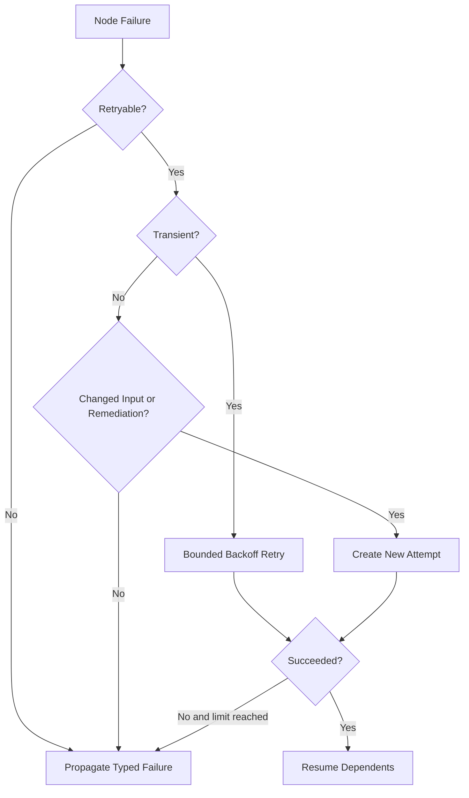

## 28.5 Retry Limits

Infinite retry is prohibited.

## 28.6 Shared Defect

A shared generator or framework defect pauses the affected lane rather than retrying every target independently.

---

# 29. Rollback Strategy

## 29.1 Compiler Rollback Scope

- orchestration state;
- package assembly;
- release activation;
- active pointer;
- migration wave;
- provisional identity reservation;
- temporary artifacts.

## 29.2 Canonical History

Rollback does not delete:

- generated attempts;
- validation findings;
- registered revisions;
- evolution records;
- audit logs.

## 29.3 Rollback Flowchart

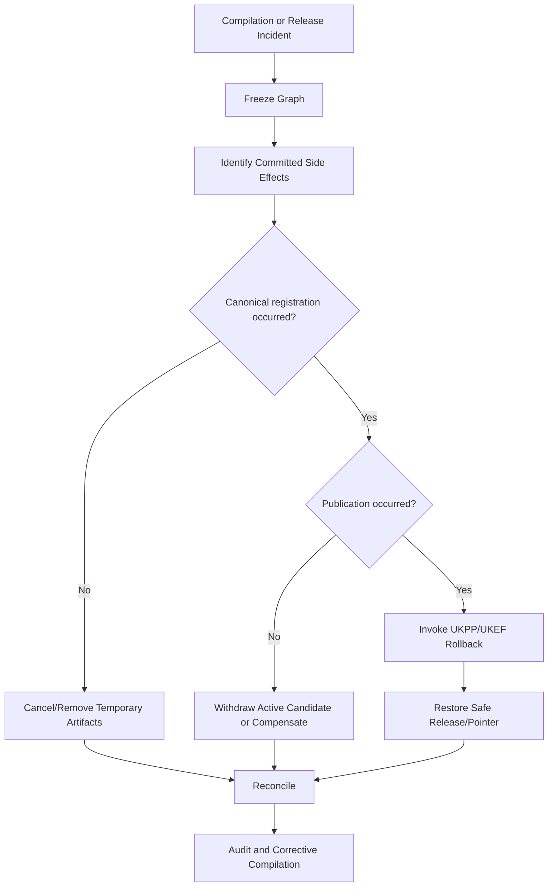

## 29.4 Compensation Nodes

Every side-effect node declares a compensation or explicit no-compensation rule.

## 29.5 Roll-Forward

When rollback is unsafe, UKCF compiles a corrective UKEF evolution.

---

# 30. Error Recovery

## 30.1 Error Categories

- admission;
- prompt parse;
- intent ambiguity;
- Ontology;
- KOS;
- identity;
- dependency;
- missing generator;
- query;
- evidence;
- generation;
- validation;
- review;
- Registry;
- evolution;
- package;
- release;
- security;
- infrastructure;
- audit.

## 30.2 Recovery Actions

- reparse;
- select alternate valid parse;
- apply governed default;
- narrow scope;
- reuse existing object;
- create child compilation;
- retry framework;
- remediate evidence;
- regenerate;
- revalidate;
- replan graph;
- partial package;
- cancel;
- quarantine;
- rollback;
- roll forward.

## 30.3 Recovery Constraints

Recovery cannot:

- invent a missing generator;
- bypass UKVF;
- bypass UKR;
- change identity without governance;
- lower mandatory quality;
- broaden authority;
- hide incomplete dependencies.

## 30.4 Checkpoint Recovery

Compiler checkpoints store:

- IRs;
- version locks;
- graph revision;
- completed node artifacts;
- framework states;
- package state;
- release state.

## 30.5 Stale Recovery

On resume, all reused artifacts are rechecked for:

- validation expiry;
- Registry changes;
- UKEF invalidation;
- policy changes;
- access changes.

---

# 31. Compiler Diagnostics

## 31.1 Diagnostic Levels

- note;
- warning;
- error;
- blocker;
- security critical;
- governance required.

## 31.2 Diagnostic Record

- Diagnostic ID;
- code;
- severity;
- stage;
- prompt span;
- IR node;
- execution node;
- target;
- framework owner;
- message;
- evidence;
- remediation;
- retryability;
- related diagnostics;
- correlation ID.

## 31.3 Diagnostic Families

- `UKCF-PARSE`;
- `UKCF-INTENT`;
- `UKCF-ONTOLOGY`;
- `UKCF-KOS`;
- `UKCF-IDENTITY`;
- `UKCF-DEPENDENCY`;
- `UKCF-GENERATOR`;
- `UKCF-VALIDATION`;
- `UKCF-REGISTRY`;
- `UKCF-EVOLUTION`;
- `UKCF-QUERY`;
- `UKCF-PACKAGE`;
- `UKCF-RELEASE`;
- `UKCF-SECURITY`;
- `UKCF-RUNTIME`.

## 31.4 Example Codes

- `UKCF-INTENT-001`: multiple incompatible production intents;
- `UKCF-ONTOLOGY-004`: unresolved entity type;
- `UKCF-GENERATOR-002`: no qualified generator;
- `UKCF-DEPENDENCY-007`: recursive production cycle;
- `UKCF-VALIDATION-013`: non-waivable blocker;
- `UKCF-REGISTRY-009`: duplicate identity conflict;
- `UKCF-EVOLUTION-006`: published change lacks UKEF plan.

## 31.5 Diagnostics Model Diagram

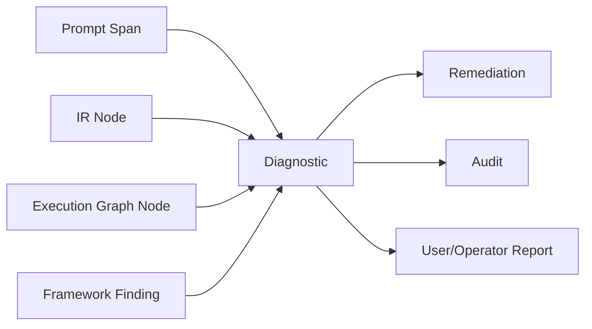

## 31.6 Diagnostic Stability

Codes and meanings are versioned.

---

# 32. Explainability

## 32.1 Compiler Explanation

The compiler can explain:

- interpreted intent;
- object kinds;
- entity types;
- existing versus new decisions;
- identity decisions;
- dependencies;
- selected generators;
- validation profiles;
- framework order;
- package composition;
- release restrictions;
- failures and partiality.

## 32.2 Explanation Levels

- brief;
- standard;
- detailed;
- audit.

## 32.3 Explanation Sources

- Prompt IR;
- Intent IR;
- Ontology mappings;
- KOS mappings;
- UKR query results;
- dependency graph;
- generator registry;
- validation plan;
- execution graph;
- diagnostics;
- framework outcomes.

## 32.4 Chain-of-Thought Boundary

UKCF explains registered decisions, rules, mappings, and artifacts.

It does not expose private model chain of thought.

## 32.5 Plan Explanation

Every Execution Graph node has:

- reason;
- authority;
- inputs;
- outputs;
- prerequisites;
- failure effect.

---

# 33. Deterministic Execution

## 33.1 Determinism Boundary

Natural-language candidate parsing may vary.

After Prompt IR approval and semantic resolution, authoritative compilation must be deterministic.

## 33.2 Compilation Fingerprint

Includes:

- normalized Prompt IR;
- Intent IR;
- all framework versions;
- generator registry snapshot;
- UKR snapshot;
- policy versions;
- context;
- security profile;
- compiler version;
- compilation profile.

## 33.3 Stable IDs

Compiler-generated internal IDs use deterministic or globally unique methods according to role.

Canonical Entity/Object/Revision IDs remain owned by UKR.

## 33.4 Stable Ordering

Plan nodes and targets use:

1. dependency order;
2. object-kind priority;
3. canonical target key;
4. deterministic tie-break.

## 33.5 Probabilistic Framework Nodes

Generator and AI-assisted parser nodes record:

- model;
- version;
- configuration;
- seed when supported;
- prompt;
- variance class.

## 33.6 Reproduction

A Reproduction Package can rebuild:

- IRs;
- graph;
- framework bindings;
- attempts;
- package manifest.

---

# 34. Performance Optimization

## 34.1 Optimization Principle

Optimize orchestration without changing semantic plans or quality gates.

## 34.2 Optimization Methods

- existing-object reuse;
- incremental compilation;
- query batching;
- evidence reuse;
- shared dependency compilation;
- parallel independent targets;
- generator lane batching;
- validation parallelism;
- Registry bulk operations;
- package streaming;
- projection batching;
- cache reuse;
- early blocker detection.

## 34.3 Performance Model


## 34.4 Backpressure

Compilation slows when:

- UKQF backlog;
- evidence backlog;
- generator capacity;
- validator backlog;
- human review backlog;
- Registry conflict rate;
- release capacity

exceeds safe thresholds.

## 34.5 Early Termination

A non-waivable blocker may stop dependent expensive nodes.

Skipped nodes remain recorded.

## 34.6 Scale

At billion-object scale, UKCF uses:

- deterministic manifests;
- sharding;
- cohort planning;
- dependency indexes;
- event-driven orchestration;
- durable checkpoints;
- idempotent nodes;
- reconciliation.

---

# 35. Caching Strategy

## 35.1 Cache Types

- Prompt IR cache;
- Intent IR cache;
- Ontology resolution cache;
- KOS resolution cache;
- UKR identity-query cache;
- UKQF result cache;
- dependency graph cache;
- generator binding cache;
- Validation Plan cache;
- Execution Graph cache;
- package manifest cache.

## 35.2 Cache Key

Includes:

- normalized input fingerprint;
- framework versions;
- Registry snapshot;
- policy;
- context;
- actor access partition;
- compiler version;
- extension versions.

## 35.3 Cache Invalidation

- Ontology or KOS change;
- UKR identity change;
- UKEF event;
- generator status change;
- validation profile change;
- policy change;
- source invalidation;
- access change.

## 35.4 Cached Artifact Reuse

Cached artifacts are references to authoritative outputs.

They are not substitutes for expired validation or changed identity state.

## 35.5 Negative Cache

Unsupported generator and unresolved identity results may be cached briefly, but governance changes invalidate them.

---

# 36. Traceability

## 36.1 Trace Chain

Natural-language Request → Prompt Span → Prompt IR → Intent IR → Object Plan → Entity Plan → Dependency Graph → Framework Binding → Execution Graph Node → Framework Artifact → Package Manifest → Release.

## 36.2 Trace IDs

- Request ID;
- Compilation ID;
- Compilation Revision ID;
- Prompt IR ID;
- Intent IR ID;
- Object Plan ID;
- Entity Plan ID;
- Dependency Graph ID;
- Framework Binding ID;
- Execution Graph ID;
- Node ID;
- Attempt ID;
- Artifact ID;
- Package ID;
- Release ID;
- Correlation ID;
- Causation ID.

## 36.3 Source-to-Object Trace

For generated knowledge:

Source → Evidence → Generator Input → Draft → UKVF → UKR Revision → Package → Release.

## 36.4 Trace Query

UKCF trace data must answer:

- why was this object generated;
- which prompt requested it;
- which generator was selected;
- which dependencies caused child objects;
- which validation profiles ran;
- why was an object reused instead of generated;
- why was UKEF invoked;
- why was package release blocked.

---

# 37. Security Boundaries

## 37.1 Security Checkpoints

### C-S0 — Admission

Authenticate actor and purpose.

### C-S1 — Prompt Parsing

Detect malicious or prohibited instructions.

### C-S2 — Semantic Planning

Remove unauthorized targets and fields.

### C-S3 — Query Planning

Apply least-privilege UKL/UKQF context.

### C-S4 — Generator Binding

Ensure model and provider authorization.

### C-S5 — Framework Delegation

Issue narrowed credentials and context.

### C-S6 — Artifact Ingress

Check provenance, classification, and contamination.

### C-S7 — Packaging

Apply field and object access policies.

### C-S8 — Release

Final publication authorization.

## 37.2 Delegation

Child agents receive:

- Plan Node ID;
- minimum inputs;
- narrowed purpose;
- limited projection;
- expiration;
- callback contract.

## 37.3 Sensitive Data

UKCF does not place secrets, raw credentials, or unnecessary personal data in prompts, IRs, logs, or packages.

## 37.4 Model Boundary

Restricted evidence may be sent only to qualified model lanes.

## 37.5 Security Failure

Critical failure:

- blocks node;
- quarantines artifacts;
- propagates to dependents;
- emits incident event;
- prevents release.

---

# 38. Governance

## 38.1 Governance Roles

- UKCF Owner;
- Compiler Architecture Board;
- Ontology Owner;
- KOS Owner;
- UEGF Owner;
- UKPP Owner;
- UKVF Owner;
- UKR Owner;
- UKL Owner;
- UKQF Owner;
- UKEF Owner;
- Generator Registry Owner;
- Security and Compliance Reviewer;
- Production Auditor.

## 38.2 Governed Assets

- compiler layers;
- IR schemas;
- planner rules;
- node catalog;
- framework binding rules;
- compilation profiles;
- diagnostic codes;
- cache rules;
- retry and rollback rules;
- conformance suite.

## 38.3 Framework Order Changes

Changing framework invocation order requires architecture review and proof that authority boundaries remain intact.

## 38.4 New Entity Onboarding

A new entity type can compile only after:

- Ontology registration;
- KOS support;
- UEGF extension;
- generator registration;
- UKVF profile;
- UKR support;
- compiler binding;
- conformance tests.

## 38.5 Exceptions

Exceptions are:

- explicit;
- scoped;
- time-bound;
- audited;
- non-conflicting with immutable authority.

---

# 39. Auditability

## 39.1 Compilation Audit Record

Contains:

- request;
- actor and purpose;
- prompt hash;
- Prompt IR;
- Intent IR;
- all plans;
- version locks;
- Registry snapshot;
- framework bindings;
- Execution Graph revisions;
- diagnostics;
- retries;
- compensations;
- artifacts;
- package;
- release;
- final disposition.

## 39.2 Decision Audit

Records:

- existing versus new decision;
- identity candidate selection;
- object-kind mapping;
- generator selection;
- UKEF trigger;
- dependency inclusion;
- package inclusion;
- partial release decision.

## 39.3 Audit Integrity

Audit is:

- append-only;
- actor-attributed;
- time-stamped;
- integrity-protected;
- access-controlled.

## 39.4 No Private Reasoning

Audit contains registered rationale and evidence, not hidden chain of thought.

---

# 40. Future Compatibility

## 40.1 New Frameworks

Future frameworks may join UKCF through registered binding contracts.

They cannot bypass current authority.

## 40.2 New Entity Types

New types require no compiler-kernel redesign when they provide registered extensions.

## 40.3 New Models

Models are qualified execution resources selected through UKPP and generator policies.

## 40.4 New Workflow Engines

Any workflow engine may implement the Execution Graph contract.

## 40.5 New Storage and Cloud Systems

UKCF remains unchanged because canonical operations occur through existing framework contracts.

## 40.6 Multimodal Compilation

Future Prompt IR may include:

- image;
- audio;
- video;
- dataset;
- diagram;
- executable artifact.

The same intent, security, evidence, validation, Registry, and trace rules apply.

## 40.7 Federated Compilation

External institutions may submit compilation requests or execute approved nodes under namespace, authority, provenance, and conformance controls.

## 40.8 Decade-Scale Stability

UKCF remains stable through:

- typed IRs;
- framework bindings;
- immutable plans;
- deterministic graphs;
- auditable artifacts;
- technology-neutral interfaces.

---

# 41. Compilation Intermediate Representations

## 41.1 IR Hierarchy

```text
CompilationUnit
├── PromptIR
├── IntentIR
├── ObjectPlanIR
├── EntityPlanIR
├── DependencyGraphIR
├── FrameworkBindingIR
├── ValidationPlanIR
├── RegistryPlanIR
├── EvolutionPlanIR
├── QueryPlanIR
├── PackagingPlanIR
├── ReleasePlanIR
├── ExecutionGraphIR
└── ArtifactManifestIR
```

## 41.2 Common IR Header

Every IR contains:

- IR ID;
- IR type;
- schema version;
- Compilation ID;
- parent IR;
- input fingerprints;
- authority versions;
- created by;
- created at;
- state;
- diagnostics;
- integrity reference.

## 41.3 IR States

- provisional;
- normalized;
- validated;
- frozen;
- superseded;
- invalid;
- archived.

## 41.4 IR Immutability

Frozen IRs are immutable.

Changes create a new IR revision.

## 41.5 IR Serialization

IRs may use any serialization preserving the logical schema.

---

# 42. Compiler State Machine

## 42.1 Compilation States

- `received`;
- `admitted`;
- `parsing`;
- `intent_resolving`;
- `semantic_resolving`;
- `object_planning`;
- `dependency_planning`;
- `binding`;
- `graph_building`;
- `static_validating`;
- `ready`;
- `executing`;
- `awaiting_dependency`;
- `awaiting_human_review`;
- `packaging`;
- `releasing`;
- `monitoring`;
- `completed`;
- `completed_partial`;
- `failed`;
- `rejected`;
- `cancelled`;
- `rolled_back`;
- `quarantined`.

## 42.2 State Machine

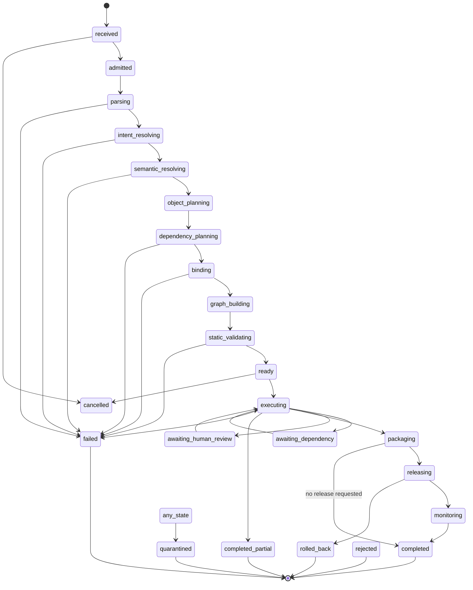

## 42.3 Terminal States

- completed;
- completed_partial;
- failed;
- rejected;
- cancelled;
- rolled_back;
- quarantined.

---

# 43. Framework Invocation Order

## 43.1 Standard New Entity Order

1. AI Constitution admission.
2. Ontology and KOS resolution.
3. UKL expression creation for discovery.
4. UKQF execution for existing identity and evidence lookup.
5. UKR identity resolution or reservation.
6. UEGF-derived generator resolution.
7. UKPP request and evidence stages.
8. Generator invocation through UKPP.
9. UKVF validation.
10. UKPP human review and QA.
11. UKR registration.
12. UKPP graph, vector, and search registration.
13. UKPP publication.
14. Monitoring.

## 43.2 Existing Published Object Order

1. discovery through UKL/UKQF;
2. UKR exact identity and revision resolution;
3. UKEF Evolution Case and impact plan;
4. UKPP revision production;
5. UKVF validation;
6. UKR registration and lineage;
7. UKEF migration and compatibility;
8. UKPP release;
9. monitoring.

## 43.3 Package Order

Dependencies are produced or reused before root package validation and release.

## 43.4 Prohibited Orders

- generator before identity plan;
- registration before validation;
- publication before registration;
- revision of Published object without UKEF;
- direct database query before UKL/UKQF;
- direct Registry write from generator.

---

# 44. Compiler Sequence Diagrams

## 44.1 New Object Compilation

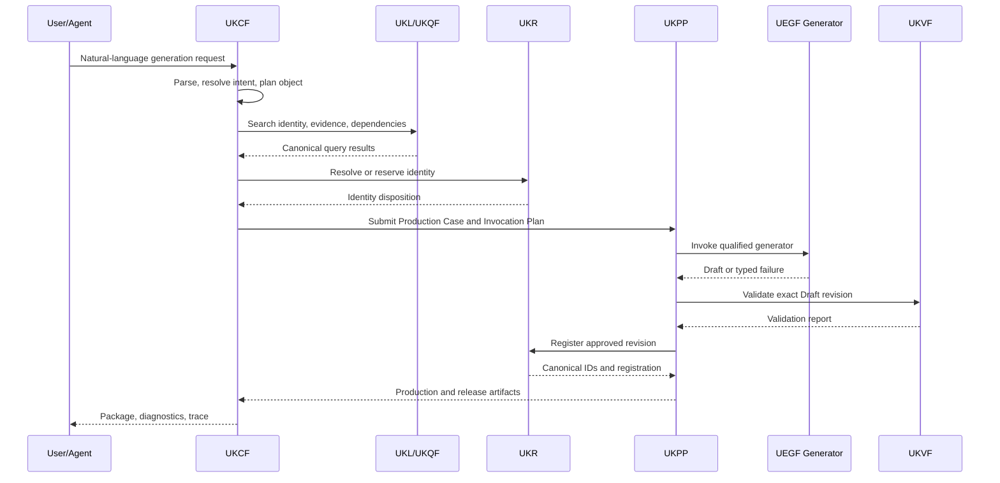

## 44.2 Published Object Evolution

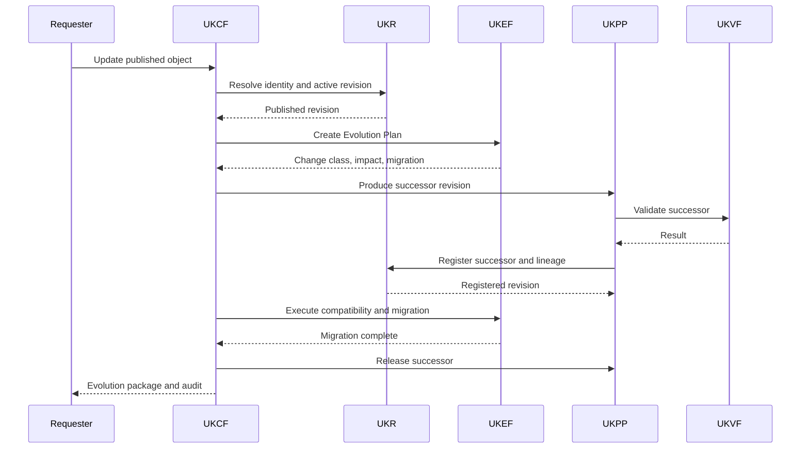

---

# 45. Error Propagation Model

## 45.1 Propagation Scope

Errors propagate by dependency edge and node criticality.

## 45.2 Error Classes

### Local Nonblocking

Produces warning.

### Target Blocking

Blocks one target.

### Dependency Blocking

Blocks all dependents.

### Package Blocking

Blocks package completion.

### Release Blocking

Allows package but blocks publication.

### Systemic

Pauses the compiler lane or batch.

### Security Critical

Quarantines artifacts and execution.

## 45.3 Error Propagation Diagram

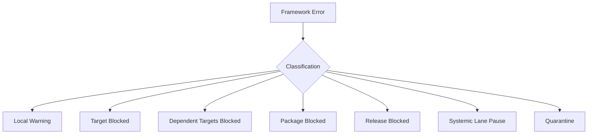

## 45.4 Typed Failure Preservation

Downstream nodes receive the original failure reference and must not rewrite it as generic failure.

---

# 46. Compiler Diagnostics Model

## 46.1 Diagnostic Bundle

A Compilation Diagnostic Bundle contains:

- summary;
- errors;
- warnings;
- assumptions;
- defaults;
- unresolved items;
- blocked targets;
- partial targets;
- remediation;
- framework findings;
- graph visualization;
- audit references.

## 46.2 Source Mapping

Diagnostics map to:

- prompt spans;
- attached-file references;
- IR nodes;
- Object Plan entries;
- Dependency Graph edges;
- framework invocations;
- package entries.

## 46.3 Human-Readable and Machine-Readable Forms

Both forms preserve the same codes and severity.

## 46.4 Diagnostic Suppression

Only eligible informational or warning diagnostics may be suppressed through policy.

Blockers remain visible.

---

# 47. Performance Optimization Model

## 47.1 Cost Dimensions

- parsing;
- UKQF queries;
- source acquisition;
- model generation;
- validation;
- human review;
- Registry writes;
- projection registration;
- packaging;
- release.

## 47.2 Optimization Decision Order

1. preserve semantics;
2. preserve security;
3. reuse canonical objects;
4. reuse valid evidence;
5. eliminate duplicate targets;
6. parallelize independent nodes;
7. batch compatible calls;
8. use qualified caches;
9. optimize model lane;
10. adjust optional depth.

## 47.3 Compiler Cost Plan

Each node may declare:

- estimated cost class;
- latency;
- capacity;
- optionality;
- cancellation threshold;
- cache probability.

## 47.4 Budget Exhaustion

Mandatory quality nodes cannot be removed.

The compiler returns partial or failed status.

---

# 48. Conceptual Compiler APIs

## 48.1 Submit Compilation

Inputs:

- natural-language request;
- actor;
- purpose;
- execution mode;
- desired readiness;
- deadline;
- security context.

Outputs:

- Compilation ID;
- admission status.

## 48.2 Validate Compilation Request

Returns Prompt IR, candidate intent, diagnostics, and required capabilities.

## 48.3 Compile Plan

Returns all frozen planning IRs and Execution Graph without execution.

## 48.4 Execute Compilation

Runs the approved graph.

## 48.5 Get Compilation Status

Returns state, targets, graph progress, diagnostics, and blockers.

## 48.6 Cancel Compilation

Cancels eligible nodes and invokes compensation.

## 48.7 Retry Compilation Target

Creates a new attempt under the same semantic plan when eligible.

## 48.8 Get Compilation Artifacts

Returns authorized IRs, artifacts, package manifest, and release references.

## 48.9 Explain Compilation

Returns decisions, framework order, dependencies, assumptions, and diagnostics.

## 48.10 Reproduce Compilation

Rebuilds plan or execution from a Reproduction Package.

---

# 49. Compiler Events

## 49.1 Event Envelope

- Event ID;
- event type;
- schema version;
- Compilation ID;
- Target ID;
- Node ID;
- timestamp;
- producer;
- actor;
- state;
- correlation;
- causation;
- payload reference;
- security class;
- integrity reference.

## 49.2 Core Events

- CompilationRequested
- CompilationAdmitted
- PromptParsed
- IntentResolved
- OntologyResolved
- ObjectPlanCreated
- EntityPlanCreated
- DependencyGraphCreated
- GeneratorResolved
- ValidationPlanCreated
- RegistryPlanCreated
- EvolutionPlanCreated
- QueryPlanCreated
- PackagingPlanCreated
- ReleasePlanCreated
- ExecutionGraphFrozen
- CompilationExecutionStarted
- CompilerNodeStarted
- CompilerNodeCompleted
- CompilerNodeFailed
- CompilationReplanned
- CompilationTargetBlocked
- PackageAssembled
- ReleaseRequested
- CompilationCompleted
- CompilationCompletedPartial
- CompilationFailed
- CompilationRolledBack
- CompilationQuarantined

---

# 50. Compiler Metadata

Every compilation records:

- Compilation ID;
- Compilation Revision;
- Request ID;
- actor and purpose;
- compiler version;
- all framework versions;
- Prompt IR;
- Intent IR;
- plan IDs;
- graph ID;
- target count;
- dependency count;
- Registry snapshot;
- security profile;
- model restrictions;
- attempts;
- diagnostics;
- artifacts;
- package;
- release;
- state;
- timings;
- resource metrics;
- correlation and causation IDs;
- audit references.

---

# 51. Conformance and Qualification

## 51.1 Parser Qualification

Must test:

- explicit prompts;
- ambiguous prompts;
- multi-object prompts;
- update versus create;
- package requests;
- prohibited requests;
- prompt injection;
- multilingual prompts.

## 51.2 Planner Qualification

Must test:

- correct object kinds;
- correct entity types;
- framework order;
- dependency closure;
- UKEF triggering;
- generator resolution;
- validation profile selection;
- Registry planning;
- package completeness.

## 51.3 Runtime Qualification

Must test:

- retries;
- partial failures;
- checkpoint resume;
- cancellation;
- rollback;
- shared defect;
- parallel graph;
- batch scale;
- security denial.

## 51.4 Determinism Qualification

Identical normalized inputs and version snapshots must yield the same frozen plans.

## 51.5 Scale Qualification

Must test:

- millions of compilation targets;
- billion-object dependency lookup;
- high fan-out;
- strongly connected cohorts;
- backpressure;
- terminal accounting.

---

# 52. Production Readiness Checklist

A UKCF implementation is production-ready only when:

- [ ] Framework authority order is enforced.
- [ ] UKCF cannot directly generate knowledge.
- [ ] Prompt, Intent, Object, Entity, Dependency, and Execution IRs exist.
- [ ] Ontology and KOS static resolution are implemented.
- [ ] All discovery uses UKL and UKQF.
- [ ] All identities use UKR.
- [ ] All generators are UEGF-conformant and registered.
- [ ] All production executes through UKPP.
- [ ] All generated revisions pass UKVF.
- [ ] All Published-object changes invoke UKEF.
- [ ] Execution Graph nodes are typed and idempotent.
- [ ] Recursive compilation is bounded.
- [ ] Dependency cycles are detected.
- [ ] Incremental fingerprints are enforced.
- [ ] Parallel and batch compilation preserve snapshots.
- [ ] Retry and rollback are bounded and audited.
- [ ] Diagnostics map to prompt, IR, graph, and framework findings.
- [ ] Security checkpoints are active.
- [ ] Package completeness is validated.
- [ ] Release planning includes rollback.
- [ ] Compiler audit is append-only.
- [ ] Deterministic plan reproduction passes.
- [ ] Billion-object scale tests pass.
- [ ] Multi-agent delegation narrows authority.
- [ ] Missing generator produces typed failure, not improvisation.

---

# 53. Execution Example — Generate Career

## 53.1 Request

“Generate a canonical Career Object for Data Privacy Engineer in Indonesia, including Skills, evidence, relationships, and publication-ready validation.”

## 53.2 Compilation

1. Prompt IR extracts Career, label, geography, evidence, relationships, publication readiness.
2. Intent IR classifies new Entity Object generation.
3. UKQF searches Career identities and aliases.
4. UKR determines existing or new identity.
5. Ontology resolves Career and predicates.
6. KOS resolves Career mandatory fields.
7. Dependency Graph identifies Skill, Industry, Technology, Evidence, Source, and relationship dependencies.
8. Career Generator is resolved.
9. Child Skills are reused or compiled recursively.
10. UKPP produces Draft.
11. UKVF validates Career and cross-object relationships.
12. UKR registers revision.
13. Package contains Career, referenced Skills, Evidence, Sources, Relationships, validation, and lineage.
14. UKPP releases when approved.

## 53.3 Failure Cases

- duplicate Career identity;
- missing Career generator;
- unsupported Career label boundary;
- insufficient Indonesia-specific evidence;
- relationship target unresolved.

---

# 54. Execution Example — Generate Skill

## 54.1 Request

“Generate the Skill Object for differential privacy.”

## 54.2 Compilation

- resolve Skill type;
- search exact and alias identity;
- distinguish Skill from Knowledge Domain, Technology, and method;
- identify prerequisite Skills and related Knowledge Domains;
- resolve Skill Generator;
- compile missing prerequisites only when mandatory;
- validate evidence, scope, and relationship direction;
- register and package.

## 54.3 Edge Case

If “differential privacy” is classified by the Ontology as a Knowledge Domain or Technology rather than Skill, UKCF changes the Object Plan instead of forcing the Skill generator.

---

# 55. Execution Example — Generate Company

## 55.1 Request

“Generate a Company Object for an organization using its official and historical names.”

## 55.2 Compilation

- resolve Company or Organization type;
- query UKR for official name, former names, and external IDs;
- distinguish legal entity, brand, product, and parent group;
- reserve identity only after duplicate and legal continuity checks;
- compile Source and Evidence dependencies;
- select Company Generator;
- plan Localization and Alias Registry operations;
- validate identity, geography, legal-name claims, and relationships;
- register and publish according to access policy.

---

# 56. Execution Example — Generate University

## 56.1 Request

“Generate a University Object and link its current academic programs.”

## 56.2 Compilation

- resolve University as institution;
- keep Education Programs and Majors separate;
- search institution identity and legal names;
- reuse or compile program objects separately;
- create University-to-Program relationships;
- validate institution-specific evidence;
- register University and program references;
- package without embedding mutable program data as intrinsic University facts.

---

# 57. Execution Example — Generate Technology

## 57.1 Request

“Generate a Technology Object for a specific AI model version.”

## 57.2 Compilation

- distinguish Technology, Tool, Product, and Company;
- resolve model family versus exact model version identity;
- query existing Technology lineage;
- if published predecessor exists, invoke UKEF;
- collect version-specific capability evidence;
- prohibit inheritance of unsupported prior capabilities;
- generate, validate, register, and package with Company and AI Trend relationships.

---

# 58. Execution Example — Generate Occupation

## 58.1 Request

“Generate an Occupation Object for Renewable Energy Systems Technician.”

## 58.2 Compilation

1. resolve whether Occupation is a registered entity type or Career subtype;
2. search external occupation codes and existing Career identities;
3. distinguish occupation from job title, role opening, and Industry;
4. compile through the registered Occupation generator or Career Generator extension;
5. plan Skills, Tasks, Industries, Qualifications, and evidence;
6. validate taxonomy mapping and geography;
7. register aliases and external mappings.

## 58.3 Failure

If no registered Occupation type or subtype binding exists, return generator/onboarding diagnostic.

---

# 59. Execution Example — Generate Certification

## 59.1 Request

“Generate a Certification Object and connect it to Skills and Careers.”

## 59.2 Compilation

- distinguish Certification from Qualification, Course, Assessment, and issuing authority;
- resolve issuing authority identity;
- collect official source, version, validity, and jurisdiction;
- create Certification-to-Skill and Career relationships;
- determine requirement level without guarantees;
- apply Regulated Knowledge profile when required;
- register version and deprecation metadata.

---

# 60. Execution Example — Generate Assessment

## 60.1 Request

“Generate an Assessment Object for measuring foundational data literacy.”

## 60.2 Compilation

- resolve Assessment object kind/entity type;
- distinguish assessment instrument, Skill, certification exam, and user result;
- exclude personal assessment results from universal object;
- identify measured Skills and competencies;
- select Assessment Generator if registered;
- plan methodology, validity evidence, scoring semantics, and intended use;
- apply quantitative, statistical, constitutional, and high-impact validation;
- register only after rights and methodology checks.

---

# 61. Execution Example — Generate Learning Resource

## 61.1 Request

“Generate a Learning Resource Object for an introductory cybersecurity course.”

## 61.2 Compilation

- distinguish Learning Resource, Course, Education Program, Certification, and provider;
- resolve provider separately;
- identify developed Skills and prerequisites;
- collect source, access, license, level, locale, and format;
- select Learning Resource Generator;
- validate rights, evidence, scope, and freshness;
- register relationships and localization;
- package for retrieval and recommendation readiness.

---

# 62. Execution Example — Generate Career Roadmap

## 62.1 Request

“Generate a Career Roadmap from beginner to Cloud Security Engineer.”

## 62.2 Object Plan

Career Roadmap is compiled as a Package, Collection, Learning Path, or registered roadmap object kind—not as a new Career identity.

## 62.3 Dependencies

- target Career;
- required Skills;
- prerequisite Skill graph;
- Certifications;
- Learning Resources;
- project or experience components;
- geography and temporal context.

## 62.4 Execution

1. retrieve target Career and current valid relationships through UKQF;
2. compile missing dependencies only when required;
3. reason over Skill dependencies through UKQF;
4. assemble ordered stages;
5. validate that the roadmap does not guarantee employment;
6. package canonical references;
7. register package if KOS permits;
8. publish with evidence, uncertainty, and update policy.

---

# 63. Execution Example — Generate Complete Career Package

## 63.1 Request

“Generate a complete canonical knowledge package for AI Governance Specialist, including all dependent objects.”

## 63.2 Root Package

Mandatory members:

- Career Object;
- core Skill Objects;
- Knowledge Domain Objects;
- Industry relationships;
- Technology relationships;
- Certification relationships;
- Learning Resources;
- Career Roadmap;
- Evidence Objects;
- Source Objects;
- Relationship Objects;
- localization;
- validation reports;
- Registry lineage;
- release manifest.

## 63.3 Compilation Graph

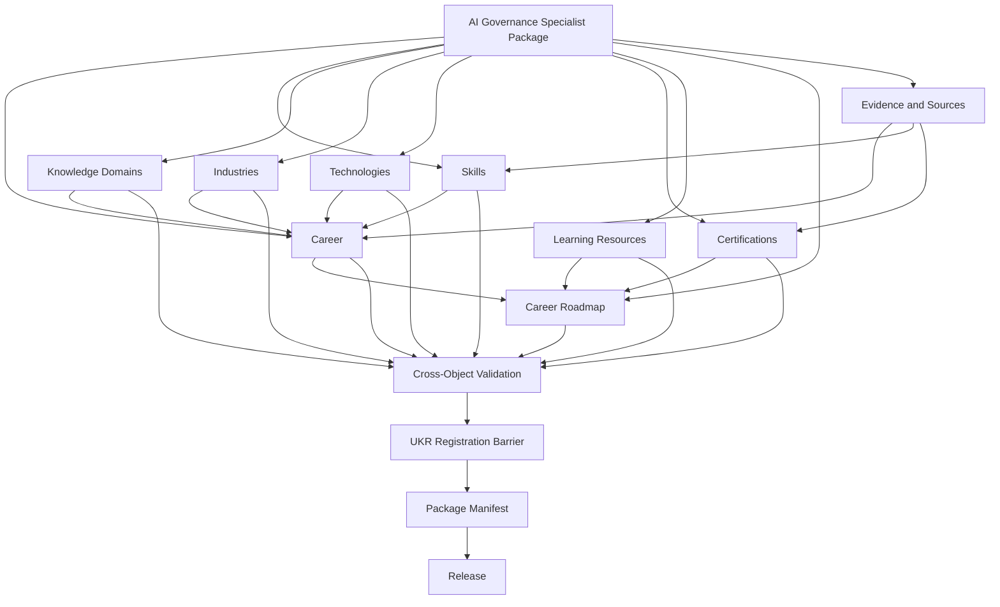

## 63.4 Orchestration

- discover and reuse existing dependencies;
- recursively compile missing mandatory objects;
- parallelize independent Skills, Domains, and Sources;
- validate each item;
- register dependencies before root active pointer;
- run cross-object and package QA;
- publish atomically or through approved release waves.

## 63.5 Partiality

If optional Learning Resources fail, the package may release with limitations if policy permits.

If core Career, mandatory Skills, evidence, or identity fails, the package is blocked.

---

# 64. Framework Binding Matrix

| Compiler Concern | Authoritative Framework | UKCF Role |
|---|---|---|
| Safety, authority, human dignity | AI Constitution | Enforce admission and constraints |
| Semantic classes and predicates | Ontology | Resolve and type-check |
| Object structure | KOS | Plan object kinds and fields |
| Generator architecture | UEGF | Resolve compliant generator contract |
| Production lifecycle | UKPP | Submit and orchestrate production cases |
| Validation | UKVF | Plan profiles and consume outcomes |
| Identity and registration | UKR | Resolve, reserve, and register through APIs |
| Semantic queries | UKL | Express compiler discovery intent |
| Query execution | UKQF | Execute discovery and impact queries |
| Published-object change | UKEF | Plan and govern evolution |
| Compilation | UKCF | Coordinate all frameworks without duplication |

---

# 65. Compiler Success Criteria

UKCF is successful when:

1. every natural-language knowledge-production request becomes a typed Compilation IR or typed failure;
2. every object target maps to a valid KOS object kind;
3. every entity target maps to a valid Ontology type;
4. every identity is resolved through UKR;
5. every knowledge lookup uses UKL and UKQF;
6. every generator is UEGF-conformant;
7. every production action runs through UKPP;
8. every Draft passes UKVF before registration;
9. every published-object change invokes UKEF;
10. every canonical revision registers through UKR;
11. every dependency is visible in the execution graph;
12. recursive and batch compilation are bounded and reconcilable;
13. incremental compilation safely reuses valid artifacts;
14. retries preserve semantic intent;
15. rollback preserves canonical history;
16. diagnostics are precise and actionable;
17. plans are reproducible under the same fingerprint;
18. framework ownership is never duplicated;
19. multi-object packages are cross-validated and dependency-complete;
20. the compiler scales to billions of Knowledge Objects without changing its logical contract.

---

# 66. Closing Standard

Universal Knowledge Compilation Framework V1 is the official AI compiler and orchestration standard of the KarirGPS Knowledge Operating System.

The AI Constitution defines what the system may do.

The Ontology defines what knowledge means.

KOS defines how Knowledge Objects are structured.

UEGF defines how entity generators are derived.

UKPP defines how Knowledge Objects move through production.

UKVF defines how they are validated.

UKR defines how they are canonically identified and registered.

UKL defines how knowledge intent is expressed.

UKQF defines how semantic queries are executed.

UKEF defines how published knowledge evolves.

UKCF defines how a natural-language production request invokes all of those systems in the correct order.

UKCF does not generate Career knowledge.

It resolves the Career generator and invokes it through UKPP.

UKCF does not decide that a Skill exists.

It queries UKR through UKL and UKQF and plans the identity operation.

UKCF does not validate a Draft.

It compiles the UKVF Validation Plan and consumes its result.

UKCF does not register or publish directly.

It plans and invokes UKR and UKPP operations under their authority.

UKCF does not update published knowledge as ordinary generation.

It invokes UKEF.

Every completed compilation therefore has:

- an admitted request;
- Prompt and Intent IRs;
- Object and Entity Plans;
- Ontology and KOS resolution;
- a Dependency Graph;
- framework bindings;
- validation, Registry, evolution, query, packaging, and release plans;
- a frozen Execution Graph;
- typed framework artifacts;
- diagnostics;
- package and release results;
- complete traceability and audit.

The permanent contracts of UKCF are:

- compilation unit;
- intermediate representation;
- framework binding;
- dependency graph;
- execution context;
- execution graph;
- typed diagnostic;
- artifact manifest;
- deterministic fingerprint;
- trace and audit.

These contracts allow KarirGPS to compile and orchestrate knowledge production across future AI models, agents, generators, workflow engines, databases, graph systems, cloud platforms, institutions, jurisdictions, and billions of Knowledge Objects without losing semantic authority, safety, determinism, explainability, or historical integrity.
