# Universal Knowledge Evolution Framework V1

**Product:** KarirGPS  
**Document Type:** Enterprise Knowledge Evolution Architecture and Operating Standard  
**Version:** 1.0  
**Status:** Normative Framework Baseline  
**Governing Constitution:** AI Constitution  
**Governing Ontology:** Career Knowledge Ontology  
**Governing Object Contract:** Knowledge Object Specification  
**Governing Generator Framework:** `assets/knowledge/frameworks/Universal_Entity_Generator_Framework_V1.md`  
**Governing Production Pipeline:** `assets/knowledge/frameworks/Universal_Knowledge_Production_Pipeline_V1.md`  
**Governing Validation Framework:** `assets/knowledge/frameworks/Universal_Knowledge_Validation_Framework_V1.md`  
**Governing Registry Framework:** `assets/knowledge/frameworks/Universal_Knowledge_Registry_Framework_V1.md`  
**Governing Language Framework:** `assets/knowledge/frameworks/Universal_Knowledge_Language_Framework_V1.md`  
**Governing Query Framework:** `assets/knowledge/frameworks/Universal_Knowledge_Query_Framework_V1.md`  
**Target Path:** `assets/knowledge/frameworks/Universal_Knowledge_Evolution_Framework_V1.md`

---

## 0. Normative Status, Authority, and Evolution Boundary

### 0.1 Status

Universal Knowledge Evolution Framework V1, hereafter **UKEF**, is the authoritative post-publication evolution architecture for canonical KarirGPS Knowledge Objects.

UKEF governs how knowledge changes over time while preserving:

- canonical identity;
- immutable revision history;
- effective-time truth;
- transaction-time history;
- publication history;
- evidence and source provenance;
- validation history;
- dependency integrity;
- query compatibility;
- reproducibility;
- explainability;
- auditability.

### 0.2 Acronym Clarification

Within this document and all successor evolution specifications, **UKEF** exclusively means:

**Universal Knowledge Evolution Framework**.

The earlier UKR V1 placeholder referring to a future “Universal Knowledge Exchange Framework” is treated as a legacy provisional label only. It does not redefine UKEF. Any future exchange framework MUST receive a distinct governed name and identifier.

This clarification does not modify UKR semantics. It prevents acronym collision in future architecture.

### 0.3 Authority Precedence

When an evolution instruction conflicts with another authoritative source, apply this order:

1. applicable law, safety, privacy, and binding rights restrictions;
2. AI Constitution;
3. Career Knowledge Ontology;
4. Knowledge Object Specification;
5. Universal Entity Generator Framework or applicable object-kind framework;
6. Universal Knowledge Production Pipeline;
7. Universal Knowledge Validation Framework;
8. Universal Knowledge Registry Framework;
9. Universal Knowledge Language Framework;
10. Universal Knowledge Query Framework;
11. Universal Knowledge Evolution Framework;
12. entity-specific evolution policy;
13. release-specific migration instruction;
14. execution-specific optimization.

A lower authority may strengthen but MUST NOT weaken a higher authority.

### 0.4 Evolution Boundary

UKEF defines:

- evolution cases and change classification;
- revision and version semantics;
- canonical identity preservation;
- effective, transaction, and publication time;
- merge, split, replacement, deprecation, and rollback;
- schema and Ontology evolution;
- relationship and dependency propagation;
- migration planning and execution;
- compatibility and version negotiation;
- validation, Registry, query, snapshot, and release impacts;
- post-publication governance;
- audit and observability;
- continuous evolution at billion-object scale.

UKEF does not:

- redesign KOS lifecycle states;
- create a second canonical Registry;
- redefine UKVF validation rules;
- replace UKPP production workflows;
- replace UKL or UKQF query semantics;
- permit in-place mutation of canonical revisions;
- mandate a storage engine, database, graph platform, version-control product, or cloud provider;
- automatically infer that every change requires a new identity.

### 0.5 Normative Terms

- **MUST** indicates a mandatory requirement.
- **MUST NOT** indicates a prohibited condition.
- **SHOULD** indicates a requirement that may be waived only through documented governance.
- **MAY** indicates an allowed option.
- **CONDITIONAL** indicates a requirement activated by a defined condition.

### 0.6 Evolution Invariants

Every UKEF-conformant implementation MUST preserve these invariants:

1. Published canonical payloads are never edited in place.
2. Every material change creates a new immutable Revision ID.
3. Entity ID, Object ID, Revision ID, Release ID, and Evolution Case ID remain distinct.
4. Names and labels may change without changing canonical identity.
5. Canonical identity changes only through governed merge, split, replacement, or identity-correction procedures.
6. Historical revisions remain exactly resolvable.
7. Historical queries do not silently substitute a newer revision.
8. Effective time, transaction time, and publication time remain distinct.
9. Retroactive corrections preserve what was known and published at each prior time.
10. A rollback changes active pointers or release exposure; it does not delete the rolled-back revision.
11. A deprecated object remains resolvable unless access or lawful deletion rules prohibit it.
12. A superseded object identifies a successor or explicit terminal invalidation.
13. Merge preserves all retired identities through redirects.
14. Split preserves the origin identity and an allocation map.
15. Relationship evolution is independent from identity evolution unless the relationship itself changes semantic identity.
16. Dependency impact is evaluated before activation of an evolved revision.
17. Validation results apply only to the exact revision and compatible dependency snapshot.
18. Schema and Ontology evolution require compatibility classification.
19. Query engines must negotiate versions and mappings explicitly.
20. Release compatibility is independently assessed from object compatibility.
21. Nonbreaking changes cannot silently introduce breaking downstream semantics.
22. Breaking changes require migration or explicit incompatibility.
23. Evolution events are append-only and auditable.
24. Evolution decisions identify evidence, authority, scope, time, and affected dependencies.
25. Projection systems are rebuilt or migrated from canonical evolution records.
26. AI-assisted change detection may propose evolution but cannot self-authorize canonical evolution.
27. New evidence may increase, decrease, or reverse confidence without erasing prior confidence history.
28. Source withdrawal propagates to all dependent claims and revisions.
29. Contextual changes do not automatically modify stable intrinsic identity.
30. Taxonomy reclassification does not automatically create a new entity.
31. Renaming does not automatically create a new entity.
32. Provider, organization, or product replacement does not automatically imply identity continuity.
33. Evolution must be explainable to human reviewers without private chain of thought.
34. Every active revision has a reproducible change lineage.
35. Every migrated consumer can identify the source and target versions used.
36. Partial migrations are explicit and cannot appear complete.
37. Evolution at scale uses deterministic cohorts, checkpoints, and bounded propagation.
38. Emergency evolution retains evidence, authority, validation, audit, and rollback.
39. Derived graph, vector, search, and analytical representations never become the canonical evolution authority.
40. UKEF remains implementation-neutral and valid across future technologies.

### 0.7 Four-Dimension State Separation

UKEF preserves four independent state dimensions:

1. **KOS Object Lifecycle State**  
   Draft, Review, Validated, Active, Deprecated, Superseded, Archived, Deleted.

2. **UKR Registration State**  
   Unregistered, Identity Reserved, Registration Pending, Registered, Registration Conflict, Quarantined, Registration Withdrawn, Registry Archived.

3. **Publication Exposure State**  
   Not Published, Publication Pending, Published, Withdrawn, Superseded in Publication, Archived from Publication, Publication Blocked.

4. **Evolution Case State**  
   Detected, Proposed, Triaged, Impact Assessing, Planned, Generating, Validating, Reviewing, Approved, Migrating, Releasing, Monitoring, Completed, Rejected, Cancelled, Rolled Back, Quarantined.

No state dimension replaces another.

### 0.8 Architecture Planes

UKEF consists of six logical planes:

1. **Change Detection Plane**
2. **Evolution Planning Plane**
3. **Revision and Compatibility Plane**
4. **Propagation and Migration Plane**
5. **Governance and Release Plane**
6. **Audit, Observation, and Recovery Plane**

---

# 1. Purpose

## 1.1 Primary Purpose

UKEF defines how canonical knowledge evolves after publication without losing identity, history, evidence, or reproducibility.

## 1.2 Operational Purpose

UKEF provides the normative process for:

- correcting published knowledge;
- enriching published knowledge;
- responding to new evidence;
- replacing obsolete technologies or credentials;
- renaming organizations;
- merging duplicate occupations;
- splitting conflated occupations;
- updating historical quantitative observations;
- migrating taxonomies;
- adapting to schema and Ontology changes;
- preserving old query behavior where required;
- migrating releases and downstream projections.

## 1.3 Long-Term Purpose

UKEF ensures that KarirGPS can evolve continuously over decades while retaining:

- stable identifiers;
- exact historical states;
- reasoned compatibility;
- clear migration paths;
- auditable governance;
- trustworthy current knowledge.

## 1.4 System Impact

UKEF converts post-publication change from ad hoc editing into a governed, versioned, reversible knowledge-evolution process.

---

# 2. Scope

## 2.1 Covered Knowledge Objects

UKEF applies to:

- Entity Objects;
- Contextual Assertion Objects;
- Relationship Objects;
- Evidence Objects;
- Source Objects;
- Package Objects;
- Collection Objects;
- localized variants;
- graph relationships;
- release manifests;
- schemas;
- Ontology versions;
- validation profiles;
- query compatibility mappings;
- derived projection versions.

## 2.2 Covered Change Sources

Evolution may be triggered by:

- new evidence;
- contradictory evidence;
- factual correction;
- source withdrawal;
- regulatory change;
- market change;
- technology obsolescence;
- entity renaming;
- organization merger;
- organization split;
- taxonomy revision;
- schema change;
- Ontology change;
- user correction;
- audit finding;
- validation defect;
- model drift;
- retrieval failure;
- rights change;
- security incident;
- localization correction;
- statistical revision;
- historical data restatement;
- dependency supersession.

## 2.3 Covered Evolution Modes

- patch revision;
- compatible enrichment;
- breaking revision;
- contextual update;
- retroactive correction;
- prospective change;
- merge;
- split;
- replacement;
- deprecation;
- supersession;
- archive;
- rollback;
- migration;
- reclassification;
- revalidation;
- projection rebuild.

## 2.4 Exclusions

UKEF does not govern temporary user-session state, private working drafts not submitted to UKPP, or physical infrastructure migration unless it changes knowledge semantics or reproducibility.

---

# 3. Design Philosophy

## 3.1 Append, Supersede, Redirect

Evolution adds new records and changes governed pointers.

It does not overwrite history.

## 3.2 Identity Is More Stable Than Description

An entity may change names, attributes, relationships, or context while retaining identity.

Identity changes require stronger evidence and governance than ordinary revision.

## 3.3 Time Is Part of Meaning

A claim may be correct for one period and incorrect for another.

Temporal scope is a semantic property, not only metadata.

## 3.4 Compatibility Is Explicit

Every evolution declares whether it is:

- backward compatible;
- forward compatible;
- conditionally compatible;
- migration required;
- incompatible.

## 3.5 Propagate by Dependency, Not by Guess

A change affects only objects connected through registered dependency and lineage paths, subject to impact rules.

## 3.6 Current Truth and Historical Truth Coexist

The active revision answers current queries.

Historical revisions answer past-state and known-at-time queries.

## 3.7 Validation Follows Change Surface

Revalidation scope is proportional to the fields, claims, relationships, dependencies, and contexts changed.

## 3.8 Rollback Is Pointer Recovery

Rollback restores a safe active state while preserving the failed evolution record.

## 3.9 Change Must Be Explainable

Every evolution explains:

- what changed;
- why;
- based on what evidence;
- when it applies;
- what it replaces;
- what consumers must do.

## 3.10 Scale Through Cohorts

Large evolutions use deterministic impact cohorts, migration waves, checkpoints, and reconciliation.

---

# 4. Evolution Principles

## 4.1 Immutable Revision Principle

Registered revision payloads are immutable.

## 4.2 Stable Identity Principle

Retain the same Entity ID when the semantic subject remains the same.

## 4.3 New Identity Principle

Create a new Entity ID when the semantic subject becomes distinct or the old identity was conflated.

## 4.4 Effective-Time Principle

The revision’s applicability period must be explicit.

## 4.5 Transaction-Time Principle

UKR records when each evolution fact entered the system.

## 4.6 Publication-Time Principle

Release exposure is recorded independently from validity and registration.

## 4.7 Minimal Breaking Principle

Prefer compatible enrichment or contextualization over breaking change when semantics allow.

## 4.8 No False Compatibility Principle

Do not label a change nonbreaking merely to avoid migration.

## 4.9 Dependency Closure Principle

Mandatory dependencies must be compatible before activation.

## 4.10 Evidence Continuity Principle

Prior evidence remains linked to prior revisions even if later invalidated.

## 4.11 Consumer Transparency Principle

Consumers receive deprecation, replacement, migration, and compatibility information.

## 4.12 Reversible Activation Principle

Every high-risk evolution has a tested rollback or roll-forward plan before release.

## 4.13 Human Authority Principle

Identity merge, split, breaking semantic change, and mass deprecation require authorized human governance.

## 4.14 Distributed Consistency Principle

At billion-object scale, evolution may propagate asynchronously, but completion cannot be declared until all mandatory cohorts reconcile.

---

# 5. Knowledge Lifecycle

## 5.1 KOS Lifecycle Preservation

UKEF records and orchestrates transitions but does not redefine KOS lifecycle states:

- Draft;
- Review;
- Validated;
- Active;
- Deprecated;
- Superseded;
- Archived;
- Deleted.

## 5.2 Post-Publication Evolution Path

The standard path is:

1. Active published revision exists.
2. Evolution trigger is detected.
3. Evolution Case is opened.
4. Impact is assessed.
5. New Draft revision or identity operation is produced through UKPP.
6. Revision passes UKVF.
7. Revision is registered through UKR.
8. Release compatibility is validated.
9. New revision is published.
10. Prior revision becomes Superseded or Deprecated according to policy.
11. Downstream projections and dependents migrate.
12. Evolution Case is monitored and closed.

## 5.3 Canonical Lifecycle State Machine

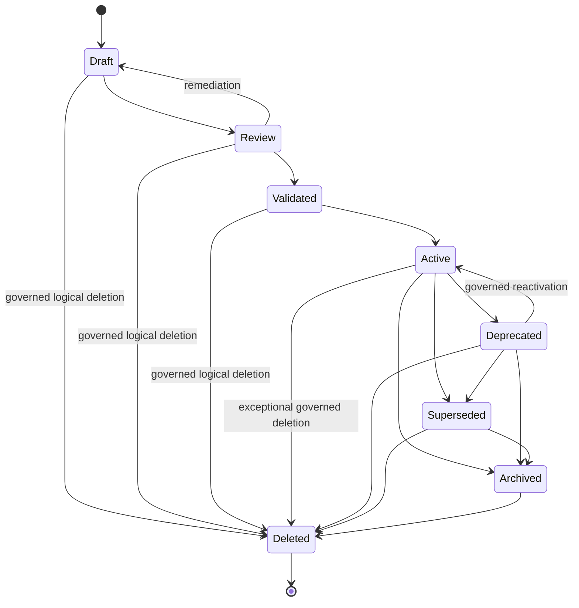

## 5.4 Lifecycle Transition Evidence

Every lifecycle transition records:

- prior and target state;
- Revision ID;
- authority;
- reason;
- evidence;
- effective time;
- UKVF result;
- UKR transaction;
- publication impact;
- rollback eligibility.

---

# 6. Revision Model

## 6.1 Revision Definition

A Revision is an immutable, registered representation of one Object ID at a defined semantic version and temporal scope.

## 6.2 Revision Record

Every revision contains:

- Revision ID;
- Object ID;
- Entity ID when applicable;
- semantic version;
- parent revision or revisions;
- branch;
- change classification;
- change set;
- effective interval;
- transaction timestamp;
- publication interval;
- schema version;
- Ontology version;
- evidence bundle;
- validation runs;
- review decision;
- migration requirements;
- compatibility declaration;
- integrity reference.

## 6.3 Revision Creation Rule

A new Revision ID is required when any material canonical payload field changes.

## 6.4 Revision Graph

Revision history is a directed acyclic graph.

Common structures include:

- linear successor;
- parallel context branch;
- branch merge;
- emergency correction branch;
- migration branch.

## 6.5 Version Graph Diagram

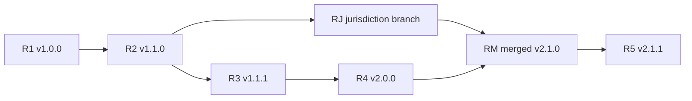

## 6.6 Revision Parent Rules

- linear revision: one parent;
- merge revision: two or more parents;
- initial revision: no parent;
- split child revision: records origin identity and allocation source;
- migrated revision: records source schema and Ontology version.

## 6.7 Revision Immutability

Operational annotations may be appended outside the canonical payload:

- release membership;
- validation expiry;
- projection status;
- access-event audit.

These annotations do not alter revision content.

---

# 7. Version Semantics

## 7.1 Semantic Version

UKEF uses semantic versioning:

`MAJOR.MINOR.PATCH`

## 7.2 Major Version

Increase MAJOR for:

- breaking semantic boundary;
- incompatible mandatory-field meaning;
- identity-affecting representation change;
- removal or reinterpretation of core semantics;
- incompatible relationship meaning;
- incompatible schema or Ontology migration;
- consumer behavior requiring mandatory migration.

## 7.3 Minor Version

Increase MINOR for:

- backward-compatible enrichment;
- new optional structured fields;
- additional approved relationships;
- additional localizations;
- expanded contextual coverage;
- new evidence that strengthens but does not reverse core meaning;
- compatible taxonomy placement enhancement.

## 7.4 Patch Version

Increase PATCH for:

- typographic correction;
- citation metadata correction;
- display-label correction;
- nonsemantic explanation clarification;
- equivalent formatting normalization;
- source locator correction that does not change evidence meaning.

## 7.5 Revision Versus Version

Every material change creates a Revision ID.

Semantic version communicates compatibility.

Revision sequence and semantic version are not interchangeable.

## 7.6 Version Precedence

Higher semantic version does not automatically mean higher truth or publication priority.

Active selection also considers:

- context;
- validation;
- effective time;
- publication state;
- access;
- release policy.

## 7.7 Pre-Release Versions

Experimental or review branches MAY use pre-release labels:

- `alpha`;
- `beta`;
- `rc`;
- registered profile-specific labels.

Pre-release revisions cannot become default canonical Active revisions without governed promotion.

---

# 8. Canonical Identity Preservation

## 8.1 Identity Continuity Test

Retain the Entity ID when:

- the subject remains the same;
- changes describe evolution of that subject;
- name changes do not create a new subject;
- classification changes do not create a new subject;
- attributes or relationships evolve without changing identity boundary;
- legal continuity is established for real-world entities when relevant.

## 8.2 Identity Discontinuity Test

Create new Entity IDs or use split/replacement when:

- one prior entity represented multiple distinct subjects;
- the successor is a different product, credential, organization, or concept;
- semantic boundary changes beyond continuity;
- legal or institutional continuity is absent and material;
- an Ontology change reveals distinct identities;
- a historical label was falsely equated with another entity.

## 8.3 Renaming

A rename normally preserves Entity ID.

The prior name becomes:

- former name;
- historical alias;
- localized alias;
- deprecated label.

## 8.4 Reclassification

Taxonomy or Ontology class reclassification normally preserves Entity ID if the semantic subject remains unchanged.

## 8.5 Replacement Without Identity Continuity

A replacement uses:

- old Entity ID retained and deprecated or superseded;
- new Entity ID created;
- typed replacement relationship;
- migration guidance;
- historical redirects that do not claim exact identity.

## 8.6 Identity Decision Record

Contains:

- Identity Evolution Decision ID;
- prior Entity ID;
- candidate continuity;
- evidence;
- boundary analysis;
- legal or institutional context;
- authority;
- outcome;
- confidence;
- effective time.

---

# 9. Revision Identity

## 9.1 Revision ID Stability

A Revision ID identifies one immutable payload forever.

## 9.2 Content Fingerprint

Each revision stores a deterministic content fingerprint over canonical payload and declared semantic metadata.

## 9.3 Duplicate Revision Prevention

An identical payload submitted under the same Object ID and context is idempotently resolved to the existing Revision ID or rejected as duplicate according to policy.

## 9.4 Equivalent but Distinct Revisions

Distinct Revision IDs may exist for:

- different jurisdictions;
- different locales when localization is canonical payload;
- different audiences;
- different policy profiles;
- experimental branches.

Their contexts must be explicit.

## 9.5 Revision Selector Behavior

UKL and UKQF may select:

- exact Revision ID;
- active revision;
- published revision;
- latest validated;
- as-of effective time;
- known-at transaction time;
- release-bound revision.

UKEF defines compatibility and migration information used during selection.

---

# 10. Temporal Dimensions

## 10.1 Tritemporal Model

UKEF requires three independent temporal dimensions:

1. Effective Time
2. Transaction Time
3. Publication Time

## 10.2 Temporal Record

Every evolved revision or evolution event records applicable values for:

- `effective_from`;
- `effective_to`;
- `recorded_at`;
- `superseded_in_registry_at`;
- `published_from`;
- `published_to`;
- `known_at`;
- `review_due`.

## 10.3 Temporal Integrity

Temporal intervals must:

- be ordered;
- use explicit timezone when time-of-day matters;
- preserve open-ended intervals;
- avoid unexplained overlapping defaults;
- retain historical corrections.

## 10.4 Retroactive Correction

A retroactive correction may have:

- effective time in the past;
- transaction time in the present;
- publication time in the present.

Historical known-at queries still show the previously recorded knowledge.

## 10.5 Prospective Change

A prospective revision may be registered and published before its effective date but must not become effective current truth before `effective_from`.

---

# 11. Effective Time

## 11.1 Definition

Effective Time is when the knowledge applies in the represented domain.

## 11.2 Uses

- organization rename date;
- certification retirement date;
- salary observation period;
- regulatory effective date;
- Technology version support period;
- relationship validity period.

## 11.3 Effective Interval

A revision or assertion may use:

- closed-open interval `[from, to)`;
- open-ended interval;
- point event;
- recurring interval when defined by a profile.

## 11.4 Overlap Rule

Overlapping effective revisions for the same Object ID and pointer context require:

- explicit contextual distinction;
- disputed state;
- migration window;
- error.

## 11.5 Unknown Effective Time

Unknown effective time is explicit and may block time-sensitive publication.

---

# 12. Transaction Time

## 12.1 Definition

Transaction Time is when UKR recorded an evolution fact.

## 12.2 Immutability

Transaction history is append-only.

## 12.3 Known-at Queries

Transaction time enables queries such as:

- what did KarirGPS know on a date;
- when was a correction recorded;
- which release first included a revision;
- when did a source withdrawal enter the system.

## 12.4 Late-Arriving Evidence

Late evidence retains its actual source date while transaction time records when KarirGPS received and registered it.

## 12.5 Transaction Correction

Incorrect registry metadata is corrected by a new transaction record, not by deleting the original audit event.

---

# 13. Publication Time

## 13.1 Definition

Publication Time is when an authorized audience could consume the revision through a release channel.

## 13.2 Multi-Channel Publication

The same Revision ID may have different publication intervals by:

- public channel;
- internal channel;
- partner channel;
- jurisdiction;
- locale;
- experimental channel.

## 13.3 Publication Delay

A validated and registered revision may remain unpublished.

## 13.4 Withdrawal

Publication withdrawal ends exposure but preserves Registry history.

## 13.5 Publication Timeline Diagram

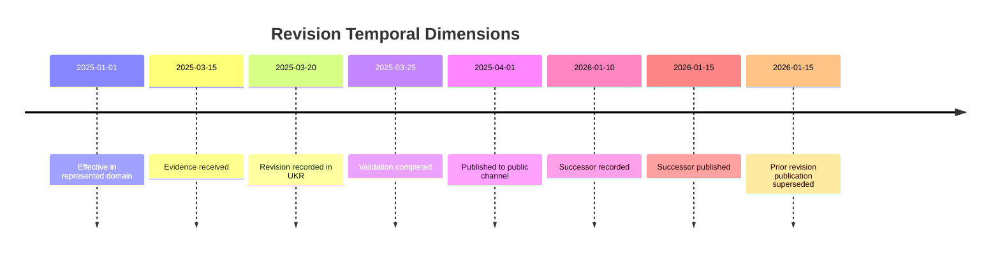

---

# 14. Evolution Events

## 14.1 Event Envelope

Every Evolution Event contains:

- Event ID;
- event type;
- schema version;
- Evolution Case ID;
- affected Entity, Object, and Revision IDs;
- event time;
- effective time when applicable;
- actor;
- authority;
- correlation and causation IDs;
- change classification;
- compatibility;
- payload reference;
- evidence reference;
- access classification;
- integrity reference.

## 14.2 Core Event Types

### Detection Events

- EvolutionSignalDetected
- SourceChangeDetected
- ContradictionDetected
- DependencyChangeDetected
- ValidationExpired
- RightsChangeDetected
- QueryCompatibilityIssueDetected

### Planning Events

- EvolutionCaseCreated
- EvolutionCaseTriaged
- ImpactAssessmentStarted
- ImpactAssessmentCompleted
- ChangeClassified
- MigrationPlanCreated
- CompatibilityAssessed

### Revision Events

- EvolutionRevisionRequested
- EvolutionRevisionGenerated
- EvolutionRevisionValidated
- EvolutionRevisionApproved
- EvolutionRevisionRegistered

### Identity Events

- IdentityContinuityConfirmed
- IdentityMergeApproved
- IdentitySplitApproved
- ReplacementIdentityCreated
- IdentityRedirectActivated

### Release Events

- EvolutionReleasePlanned
- EvolutionReleaseApproved
- EvolutionReleaseActivated
- EvolutionReleasePartiallyActivated
- EvolutionReleaseFailed
- EvolutionRolledBack

### Completion Events

- DependencyMigrationCompleted
- ProjectionMigrationCompleted
- EvolutionMonitoringStarted
- EvolutionCaseCompleted
- EvolutionCaseRejected
- EvolutionCaseQuarantined

## 14.3 Event Ordering

Ordering must be preserved within:

- one Evolution Case;
- one Object lineage;
- one Entity identity operation;
- one release channel pointer.

## 14.4 Event Replay

Consumers must support idempotent replay.

---

# 15. Merge Strategy

## 15.1 Purpose

Merge identities or object lineages when evidence establishes that they represent one canonical semantic subject.

## 15.2 Merge Types

- identity merge;
- object-lineage merge;
- revision-branch merge;
- alias consolidation;
- source identity merge;
- taxonomy-node merge.

## 15.3 Preconditions

- duplicate or equivalence evidence;
- same or compatible Ontology type;
- identity-boundary analysis;
- UKVF identity validation;
- dependency impact assessment;
- relationship migration plan;
- alias and external-ID plan;
- canonical survivor decision;
- release migration plan;
- rollback plan;
- Steward approval.

## 15.4 Canonical Survivor

Default strategy:

- select one existing Entity ID as survivor;
- preserve all source Entity IDs as retired identities with redirects.

A new consolidated Entity ID is allowed only when none of the existing IDs can safely represent the merged subject.

## 15.5 Merge Allocation

Every source item is mapped to:

- survivor canonical core;
- retained contextual assertion;
- retained historical-only record;
- disputed record;
- discarded duplicate projection, not deleted history;
- unresolved human review.

## 15.6 Merge Diagram

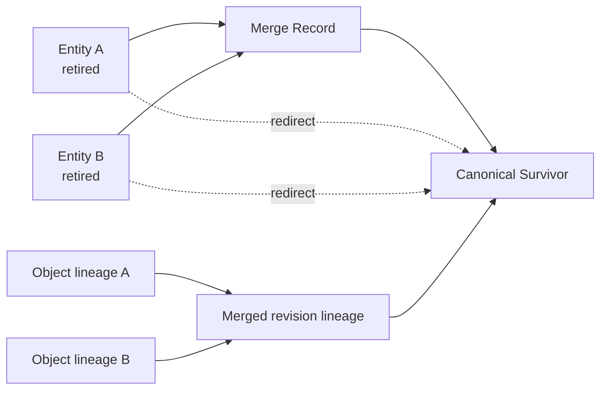

## 15.7 Merge Compatibility

The merge record declares:

- exact identity equivalence;
- contextual equivalence;
- historical equivalence;
- partial compatibility;
- incompatible attributes retained separately.

## 15.8 Merge Activation

Activation order:

1. freeze affected identity writes;
2. register Merge Record;
3. register survivor revision;
4. migrate relationships and dependencies;
5. activate redirects;
6. migrate publication pointers;
7. rebuild projections;
8. reconcile;
9. monitor.

## 15.9 Merge Rollback

Rollback may restore prior active identities if:

- redirects are reversible;
- no irreversible external synchronization occurred;
- dependent migrations can be reversed.

If not, use corrective roll-forward.

---

# 16. Split Strategy

## 16.1 Purpose

Split an identity or object when one canonical record incorrectly conflates distinct semantic subjects.

## 16.2 Split Types

- identity split;
- subtype extraction;
- product-version separation;
- occupation-role separation;
- regional concept separation;
- historical concept separation;
- taxonomy-node split.

## 16.3 Preconditions

- evidence of distinct semantic boundaries;
- child definitions;
- target Entity ID reservations;
- claim allocation plan;
- relationship allocation plan;
- alias and external-ID allocation;
- dependency impact;
- publication migration;
- UKVF validation;
- Steward approval;
- rollback or containment plan.

## 16.4 Origin Disposition

The origin may:

- remain as a broader parent;
- become deprecated;
- become superseded by children;
- remain historical only;
- be archived.

## 16.5 Allocation Status

Every field, claim, relationship, source, alias, and dependency receives:

- child A;
- child B or other child;
- shared with explicit context;
- retained in parent;
- disputed;
- historical only;
- not applicable.

## 16.6 Split Diagram

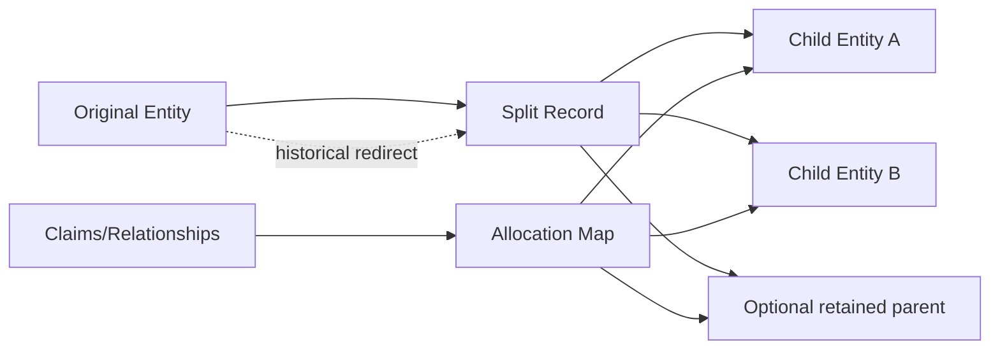

## 16.7 Query Behavior

A query to the origin identity returns:

- split notice;
- children;
- allocation summary;
- historical revisions;
- current resolution policy.

It must not silently choose one child.

## 16.8 Split Rollback

Rollback is possible before broad publication and dependency migration.

After external use, corrective roll-forward is usually safer than collapsing children again.

---

# 17. Deprecation Model

## 17.1 Definition

Deprecation marks a revision, object, identity, relationship, schema, Ontology term, or API contract as discouraged for new use while remaining resolvable.

## 17.2 Deprecation Reasons

- obsolete;
- replaced;
- low evidence;
- source withdrawn;
- legacy schema;
- incorrect but historically relevant;
- no longer supported;
- unsafe for current reasoning;
- jurisdiction ended.

## 17.3 Deprecation Record

Contains:

- target;
- reason;
- authority;
- effective time;
- replacement;
- migration deadline;
- allowed uses;
- prohibited uses;
- warnings;
- dependency impact;
- review date.

## 17.4 Deprecation Diagram

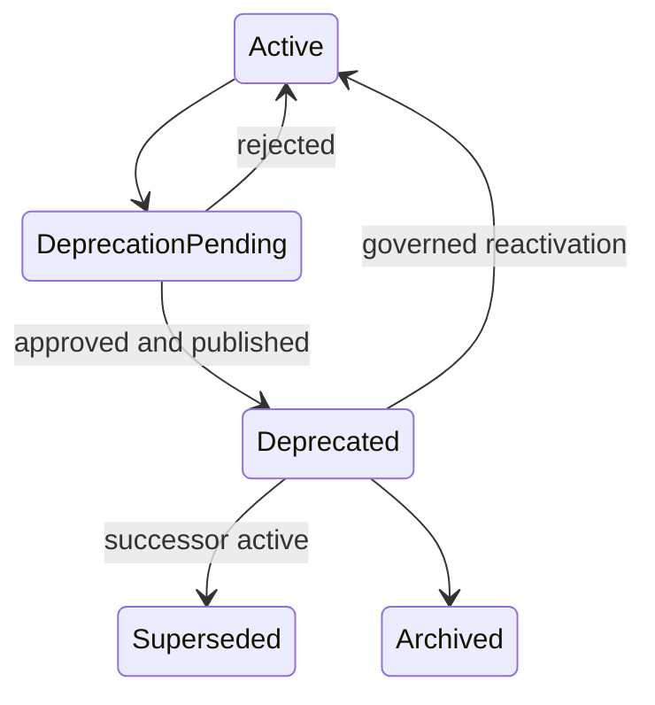

## 17.5 Query Behavior

Default current queries exclude deprecated targets unless:

- no active replacement exists and policy allows;
- the caller requests them;
- historical context requires them.

## 17.6 Deprecation Window

A migration window may permit both old and new revisions.

The default pointer and warning behavior must be explicit.

---

# 18. Replacement Model

## 18.1 Definition

Replacement links a predecessor to a successor without asserting exact identity unless evidence supports continuity.

## 18.2 Replacement Types

- direct successor;
- functional replacement;
- recommended alternative;
- compatible replacement;
- partial replacement;
- no-equivalent replacement;
- provider replacement;
- standard replacement.

## 18.3 Identity Continuity

If identity continuity exists, use revision supersession under the same Entity ID.

If identity continuity does not exist, use a new Entity ID and typed replacement relationship.

## 18.4 Replacement Record

Contains:

- predecessor;
- successor;
- replacement type;
- compatibility;
- effective time;
- migration;
- evidence;
- limitations;
- authority.

## 18.5 Multiple Replacements

One predecessor may map to multiple successors by:

- context;
- feature;
- jurisdiction;
- use case.

## 18.6 No Replacement

Terminal invalidation without successor is permitted with explicit reason and consumer guidance.

---

# 19. Historical Lineage

## 19.1 Purpose

Preserve exact historical understanding and reconstruct every canonical state.

## 19.2 Lineage Dimensions

- identity lineage;
- revision lineage;
- evidence lineage;
- source lineage;
- relationship lineage;
- schema lineage;
- Ontology lineage;
- validation lineage;
- release lineage;
- migration lineage;
- projection lineage.

## 19.3 Historical Query Requirements

UKEF supports:

- exact revision;
- as-of effective time;
- known-at transaction time;
- published-at time;
- release snapshot;
- pre-merge identity;
- pre-split identity;
- prior taxonomy;
- prior schema.

## 19.4 Lineage Completeness

A published evolved revision must identify:

- predecessor;
- change class;
- evidence delta;
- validation delta;
- compatibility;
- migration;
- release.

## 19.5 Historical Integrity

Later corrections do not alter prior known-at results.

---

# 20. Provenance Across Versions

## 20.1 Provenance Delta

Every revision records changes in:

- sources added;
- sources removed;
- sources invalidated;
- evidence strengthened;
- evidence weakened;
- claims added;
- claims removed;
- claims reclassified;
- relationships added or removed;
- confidence changed;
- validation changed.

## 20.2 Source Continuity

Source IDs remain stable across revisions when the source identity remains the same.

## 20.3 Evidence Supersession

New evidence may:

- supplement;
- contradict;
- supersede;
- invalidate;
- contextualize prior evidence.

## 20.4 Provenance Query

Consumers can ask:

- why did this claim change;
- which source caused the change;
- when did confidence change;
- which revision first introduced a relationship;
- which revision removed it.

## 20.5 Explanation Requirement

Evolution explanations are assembled from registered deltas and decisions, not private reasoning.

---

# 21. Evolution Graph

## 21.1 Purpose

The Evolution Graph represents identities, revisions, events, migrations, dependencies, and releases across time.

## 21.2 Node Types

- Entity ID;
- Object ID;
- Revision ID;
- Evolution Case;
- Change Request;
- Merge Record;
- Split Record;
- Migration Plan;
- Release;
- Schema Version;
- Ontology Version;
- Validation Run;
- Evidence Bundle;
- Source Revision.

## 21.3 Edge Types

- revises;
- supersedes;
- deprecates;
- replaces;
- merged_into;
- split_into;
- derived_from;
- migrated_from;
- compatible_with;
- incompatible_with;
- validated_by;
- published_in;
- depends_on;
- affected_by;
- rolled_back_to.

## 21.4 Evolution Graph Diagram

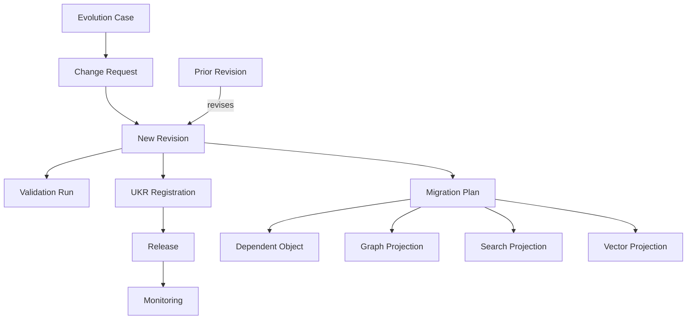

## 21.5 Graph Authority

The Evolution Graph is a canonical semantic projection of UKR and UKEF records.

It does not replace UKR.

---

# 22. Dependency Evolution

## 22.1 Dependency Impact Classes

- no impact;
- revalidation only;
- compatible update;
- migration required;
- publication blocked;
- identity review required;
- cascade deprecation;
- quarantine.

## 22.2 Change Propagation Model

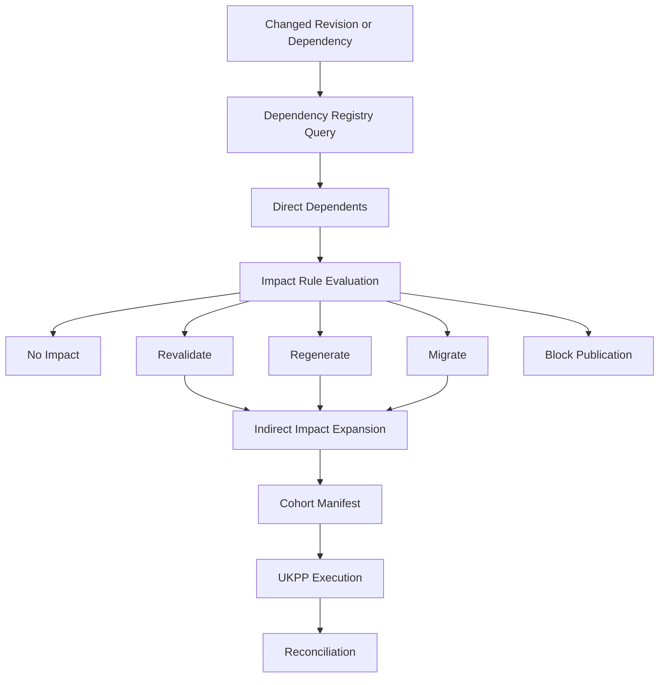

## 22.3 Dependency Propagation Rules

- only registered dependencies propagate automatically;
- unregistered inferred dependencies may create review signals, not automatic mutation;
- propagation depth is bounded by policy;
- cycles are handled through strongly connected impact cohorts;
- optional dependencies may produce warnings;
- mandatory dependencies may block activation.

## 22.4 Dependency Cohort

A propagation cohort contains:

- changed target;
- dependent IDs;
- dependency paths;
- impact class;
- required action;
- priority;
- owner;
- checkpoint;
- terminal disposition.

## 22.5 Source Withdrawal

Source withdrawal propagates:

Source → Evidence → Claim → Revision → Relationship → Dependent Object → Release.

## 22.6 Dependency Completion

Evolution cannot close until all mandatory dependents are:

- migrated;
- revalidated;
- deprecated;
- explicitly waived when eligible;
- blocked with governed exception;
- proven unaffected.

---

# 23. Relationship Evolution

## 23.1 Relationship Change Classes

- evidence refresh;
- confidence change;
- strength change;
- requirement-level change;
- context change;
- valid-period change;
- source change;
- target replacement;
- predicate change;
- relationship removal;
- dispute introduced or resolved.

## 23.2 Relationship Identity

Retain Relationship ID when the source, predicate, target, and core semantic edge remain the same.

Create a new Relationship ID when:

- predicate changes;
- source changes;
- target changes;
- semantic meaning changes materially.

## 23.3 Relationship Revision

Evidence, confidence, context, status, and validity changes create a new relationship revision or declaring object revision.

## 23.4 Inverse Relationship Propagation

Stored inverses must be reconciled.

Derived inverses are rebuilt from canonical relationship state.

## 23.5 Relationship Deprecation

Deprecated relationships remain historically queryable and are excluded from current reasoning unless requested.

## 23.6 Relationship Migration

When a target identity merges or splits:

- merge redirects may remap to survivor;
- split requires explicit target allocation;
- unresolved edges become disputed or blocked.

---

# 24. Schema Evolution

## 24.1 Schema Change Types

- optional field addition;
- mandatory field addition;
- field removal;
- field rename;
- type widening;
- type narrowing;
- enumeration addition;
- enumeration removal;
- structural relocation;
- default change;
- semantic reinterpretation.

## 24.2 Compatibility Rules

### Backward-Compatible Schema Changes

Typically:

- optional field addition;
- enumeration addition with tolerant consumers;
- nonsemantic metadata addition;
- safe type widening.

### Breaking Schema Changes

Typically:

- mandatory field without default or migration;
- field removal;
- semantic reinterpretation;
- type narrowing;
- enumeration removal;
- identifier semantic change.

## 24.3 Schema Migration Record

Contains:

- source Schema ID and version;
- target Schema ID and version;
- field mappings;
- transformations;
- defaults;
- lossiness;
- validation;
- rollback;
- compatible consumer versions.

## 24.4 Unknown Fields

Forward-compatible consumers may ignore unknown optional fields only when KOS permits and semantic correctness is preserved.

## 24.5 Lossy Migration

Lossy migration requires:

- explicit fields lost;
- reason;
- archival of source revision;
- human approval;
- consumer warning.

---

# 25. Ontology Evolution

## 25.1 Ontology Change Types

- new class;
- class rename;
- class reparenting;
- class split;
- class merge;
- predicate addition;
- predicate rename;
- predicate domain or range change;
- controlled vocabulary change;
- inheritance change;
- deprecation;
- removal.

## 25.2 Ontology Identity

Renaming an Ontology term does not necessarily change its semantic identifier.

Semantic identifier changes require migration mappings.

## 25.3 Ontology Mapping Types

- exact;
- renamed;
- broader;
- narrower;
- split;
- merged;
- close;
- incompatible;
- no mapping.

## 25.4 Ontology Migration

Objects affected by Ontology evolution are classified:

- natively compatible;
- compatible through mapping;
- revalidation required;
- regeneration required;
- identity review required;
- incompatible.

## 25.5 Class Split

An Ontology class split does not automatically split every entity.

Each entity must be classified into:

- child class A;
- child class B;
- multiple classes if allowed;
- unresolved;
- parent retained.

## 25.6 Predicate Change

Changing predicate domain or range triggers relationship impact analysis and graph rebuild.

---

# 26. Backward Compatibility

## 26.1 Definition

A new version is backward compatible when consumers built for the prior supported contract can use the new version without semantic error or mandatory migration.

## 26.2 Backward Compatibility Dimensions

- payload schema;
- Ontology terms;
- identity resolution;
- relationship semantics;
- query behavior;
- publication behavior;
- validation profile;
- evidence interpretation;
- migration API;
- event schema.

## 26.3 Compatibility Levels

- full;
- compatible with warning;
- compatible through adapter or mapping;
- migration required;
- incompatible;
- not assessed.

## 26.4 Backward Compatibility Guarantee

Guarantees are version- and profile-specific.

No universal promise is implied.

## 26.5 Historical Consumers

Historical and audit consumers may continue using old versions through exact revision and release snapshots.

---

# 27. Forward Compatibility

## 27.1 Definition

A consumer is forward compatible when it can safely process future compatible additions without misunderstanding them.

## 27.2 Forward Compatibility Techniques

- optional fields;
- namespaced extensions;
- unknown-field preservation;
- typed absence states;
- version negotiation;
- capability declaration;
- tolerant event consumers;
- explicit defaults;
- stable IDs.

## 27.3 Forward Compatibility Limits

A consumer must reject or degrade explicitly when:

- mandatory semantics are unknown;
- a new enum changes behavior;
- a new predicate affects eligibility;
- a new security classification is unsupported;
- a new version is breaking.

## 27.4 No Silent Ignore for Material Semantics

Unknown material fields cannot be silently ignored.

---

# 28. Migration Rules

## 28.1 Migration Types

- object revision migration;
- schema migration;
- Ontology migration;
- identity merge migration;
- identity split migration;
- relationship migration;
- release migration;
- projection migration;
- query compatibility migration;
- consumer contract migration.

## 28.2 Migration Plan

Contains:

- Migration ID;
- source versions;
- target versions;
- affected cohort;
- transformation rules;
- compatibility;
- lossiness;
- validation plan;
- release waves;
- rollback or roll-forward;
- owner;
- deadline;
- success criteria.

## 28.3 Migration Workflow

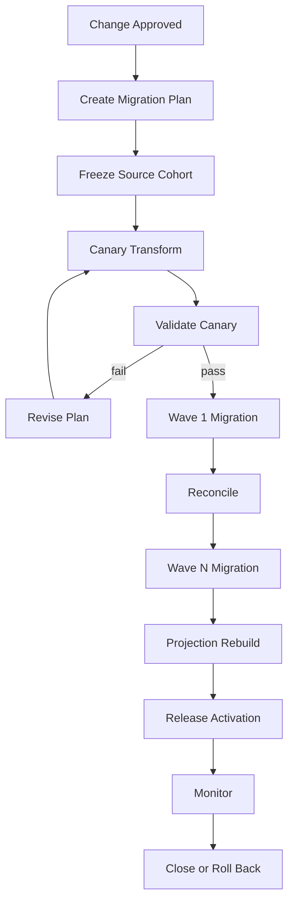

## 28.4 Migration Idempotency

Re-executing the same migration step must not create duplicate revisions or relationships.

## 28.5 Migration Checkpoints

- plan approved;
- cohort locked;
- canary complete;
- validation complete;
- each wave complete;
- projection rebuild complete;
- release complete;
- final reconciliation.

## 28.6 Migration Failure

Failed items enter:

- retry;
- manual remediation;
- blocked;
- quarantined;
- excluded with explicit partial migration.

## 28.7 Migration Completion

Completion requires every cohort item to have a terminal disposition.

---

# 29. Change Classification

## 29.1 Universal Change Classes

- editorial;
- metadata;
- evidence refresh;
- source correction;
- confidence recalibration;
- compatible enrichment;
- contextual update;
- temporal update;
- geographic update;
- localization update;
- relationship update;
- semantic correction;
- schema migration;
- Ontology migration;
- identity rename;
- identity merge;
- identity split;
- replacement;
- deprecation;
- breaking semantic change;
- rights correction;
- security correction;
- emergency correction;
- historical restatement.

## 29.2 Change Classification Record

Contains:

- Change Classification ID;
- affected target;
- category;
- materiality;
- semantic scope;
- identity impact;
- compatibility;
- temporal mode;
- dependency impact;
- validation impact;
- release impact;
- authority.

## 29.3 Classification Precedence

When multiple classes apply, the most restrictive class governs migration and approval.

## 29.4 Automated Classification

AI may propose classification.

Human or deterministic governance rules approve high-impact classifications.

---

# 30. Breaking vs Non-Breaking Changes

## 30.1 Non-Breaking Change

A change is nonbreaking only if existing supported consumers can continue without semantic error.

## 30.2 Breaking Change Indicators

- identity boundary changes;
- mandatory field meaning changes;
- predicate semantics change;
- field removal;
- required context added;
- default behavior changes materially;
- ranking or eligibility semantics change;
- historical query behavior changes;
- access classification becomes stricter;
- source or evidence interpretation reverses;
- confidence scale changes;
- query output meaning changes.

## 30.3 Compatibility Matrix

| Change | Identity | Schema | Ontology | Query | Release | Default Classification |
|---|---|---|---|---|---|---|
| Typographic correction | unchanged | compatible | unchanged | compatible | compatible | Patch |
| Canonical display-name change | unchanged | compatible | unchanged | alias migration | compatible | Patch or Minor |
| Optional field added | unchanged | backward compatible | unchanged | forward-compatible consumer required | compatible | Minor |
| Mandatory field added | unchanged | potentially breaking | unchanged | migration required | staged | Major unless safe default |
| Relationship evidence strengthened | unchanged | compatible | unchanged | compatible | compatible | Minor |
| Relationship predicate changed | unchanged or review | breaking | breaking | migration required | staged | Major |
| Class reparented | unchanged | compatible or migration | potentially breaking | mapping required | staged | Major or Minor by impact |
| Identity merge | survivor + redirects | migration | compatible type required | redirect-aware | coordinated | Major evolution |
| Identity split | new child IDs | migration | may require class review | ambiguity handling | coordinated | Major evolution |
| Source locator corrected | unchanged | compatible | unchanged | compatible | compatible | Patch |
| Historical salary restated | unchanged | compatible | unchanged | as-of and known-at affected | release note | Minor or Major by impact |
| Technology replaced by new entity | new identity | compatible | unchanged | replacement-aware | successor release | Major evolution |
| Validation policy tightened | unchanged | compatible | unchanged | result eligibility may change | revalidation | Breaking for affected profile |

## 30.4 Breaking Change Approval

Breaking change requires:

- full impact analysis;
- Migration Plan;
- UKVF validation;
- consumer compatibility review;
- release coordination;
- rollback or roll-forward plan;
- governance approval.

---

# 31. Validation Impact

## 31.1 Validation Scope Determination

Validation impact is derived from the change surface.

## 31.2 Revalidation Classes

- no revalidation;
- structural revalidation;
- targeted field revalidation;
- relationship revalidation;
- evidence revalidation;
- temporal revalidation;
- localization revalidation;
- cross-object revalidation;
- full validation;
- specialist human review.

## 31.3 Validation Reuse

Prior UKVF results may be reused only when:

- changed fields are outside validator scope;
- dependencies remain compatible;
- validation remains current;
- no new conflict or source withdrawal exists;
- profile permits reuse.

## 31.4 Identity Operations

Merge and split require full identity, Ontology, relationship, cross-object, policy, and publication-readiness validation.

## 31.5 Validation Delta Report

Contains:

- reused results;
- invalidated results;
- newly executed validators;
- changed findings;
- changed scores;
- changed warnings or waivers;
- result expiry.

---

# 32. Registry Impact

## 32.1 UKR Operations

Evolution may require:

- new Revision ID;
- new Entity ID;
- active-pointer change;
- redirect;
- merge record;
- split record;
- alias update;
- relationship revision;
- dependency update;
- publication-pointer migration;
- archive or deletion marker.

## 32.2 Registry Checkpoints

### ER1 — Identity Continuity

Confirm Entity ID strategy.

### ER2 — Revision Registration

Register new immutable revision.

### ER3 — Reference Integrity

Reconcile aliases, relationships, dependencies, evidence, and sources.

### ER4 — Pointer Activation

Change active pointers only after approval and release readiness.

### ER5 — Historical Resolution

Verify old IDs and revisions still resolve.

## 32.3 Registry Conflict

Concurrent evolution of the same Object ID requires:

- branch;
- conflict analysis;
- merge or rejection;
- no blind overwrite.

## 32.4 Registry Reconciliation

After evolution, compare:

- expected active revision;
- redirects;
- dependency states;
- publication pointers;
- projection tasks;
- audit events.

---

# 33. Query Compatibility

## 33.1 UKL Compatibility

UKEF supplies UKL and UKQF with:

- version mappings;
- deprecated fields;
- replacement fields;
- identity redirects;
- split ambiguity behavior;
- historical selector behavior;
- compatibility warnings.

## 33.2 Query Behavior by Evolution Type

### Rename

Old and new names resolve to the same Entity ID.

### Merge

Retired IDs redirect to survivor, with merge metadata.

### Split

Origin ID returns split result or requires explicit child selection.

### Deprecation

Default current queries exclude or warn according to policy.

### Replacement

Predecessor query may return replacement relationship but not exact identity.

### Schema Change

Query adapter maps old fields when mapping is lossless.

## 33.3 Query Compatibility Contract

Contains:

- source query contract version;
- target version;
- mapping;
- lost semantics;
- default changes;
- warnings;
- expiration.

## 33.4 Query Rewrite

UKQF may rewrite deprecated UKL field references only when semantic equivalence is registered.

## 33.5 Query Failure

If a safe mapping is unavailable, the query fails explicitly or requires a historical version.

---

# 34. Snapshot Compatibility

## 34.1 Snapshot Types

- UKR snapshot;
- release snapshot;
- historical effective-time snapshot;
- transaction-time snapshot;
- publication-time snapshot;
- migration checkpoint snapshot.

## 34.2 Snapshot Compatibility Classes

- exact;
- compatible;
- compatible through mapping;
- mixed-version allowed;
- migration required;
- incompatible.

## 34.3 Mixed-Version Snapshot

A mixed-version snapshot is allowed only when:

- semantic compatibility is known;
- dependencies are resolved;
- query engine supports it;
- release policy permits it;
- limitations are explicit.

## 34.4 Snapshot Freeze

High-impact migrations freeze source and target snapshots for reproducibility.

## 34.5 Snapshot Reproduction

A historical release can be reconstructed from:

- exact revisions;
- schema and Ontology versions;
- pointer states;
- policy versions;
- migration mappings.

---

# 35. Release Compatibility

## 35.1 Release Impact Types

- no release change;
- additive release;
- patch release;
- staged replacement;
- dual-run migration;
- breaking release;
- emergency release;
- rollback release.

## 35.2 Release Gate

An evolution release requires:

- validated revision;
- Registry registration;
- dependency closure;
- query compatibility;
- projection readiness;
- access compatibility;
- release notes;
- rollback or roll-forward plan.

## 35.3 Dual-Run Window

Old and new revisions may coexist during migration.

The release manifest identifies:

- default revision;
- legacy revision;
- consumer cohort;
- end date;
- compatibility adapter.

## 35.4 Release Notes

Must identify:

- changed objects;
- breaking changes;
- deprecations;
- replacements;
- migration requirements;
- known limitations;
- rollback target.

## 35.5 Release Compatibility Matrix

Each release declares compatibility with:

- UKL versions;
- UKQF profiles;
- schema versions;
- Ontology versions;
- consumer versions;
- projection versions.

---

# 36. Evolution Policies

## 36.1 Policy Registry

UKEF relies on versioned policies for:

- change classification;
- compatibility;
- identity continuity;
- merge;
- split;
- deprecation;
- replacement;
- migration;
- rollback;
- revalidation;
- query compatibility;
- release;
- retention.

## 36.2 Policy Precedence

More restrictive policy applies when policies overlap, unless governance resolves the conflict.

## 36.3 Policy Scope

Policies may be scoped by:

- object kind;
- entity type;
- jurisdiction;
- risk;
- volatility;
- release channel;
- consumer profile.

## 36.4 Policy Evolution

Policy changes may themselves trigger revalidation or migration.

## 36.5 Exceptions

Exceptions are:

- explicit;
- time-bound;
- scoped;
- approved;
- auditable;
- non-conflicting with non-waivable authority.

---

# 37. Governance Workflow

## 37.1 Governance Roles

- UKEF Owner;
- Knowledge Evolution Board;
- Domain Steward;
- Identity Steward;
- Ontology Owner;
- KOS Owner;
- UKPP Owner;
- UKVF Owner;
- UKR Owner;
- UKL and UKQF Compatibility Owners;
- Release Manager;
- Security and Compliance Reviewer;
- Records Manager;
- Production Auditor.

## 37.2 Governance Workflow Diagram

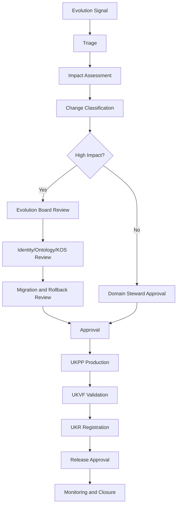

## 37.3 Governance Escalation

Escalation is mandatory for:

- identity merge;
- identity split;
- breaking Ontology change;
- mass deprecation;
- source withdrawal affecting high-impact knowledge;
- historical restatement with material downstream effect;
- inability to roll back safely;
- cross-jurisdiction conflict.

## 37.4 Conflict of Interest

Decision-makers disclose:

- source authorship;
- institutional interest;
- commercial interest;
- prior generation involvement;
- affected product ownership.

---

# 38. Approval Workflow

## 38.1 Approval Levels

### Level 1 — Compatible Patch

Domain Steward or delegated authority.

### Level 2 — Compatible Minor Evolution

Domain Steward plus validation and release authority.

### Level 3 — Breaking or High-Impact Evolution

Evolution Board, relevant framework owners, Security or Compliance when applicable, and Release Manager.

### Level 4 — Identity Transformation

Identity Steward, Ontology Owner, Domain Steward, UKR Owner, UKVF authority, and Evolution Board.

### Level 5 — Emergency Evolution

Emergency authority with mandatory retrospective review.

## 38.2 Approval Package

Contains:

- Evolution Case;
- change classification;
- evidence;
- impact graph;
- compatibility matrix;
- migration plan;
- validation plan;
- release plan;
- rollback plan;
- consumer communication;
- unresolved risks.

## 38.3 Approval Outcomes

- approved;
- approved with conditions;
- changes required;
- rejected;
- deferred;
- quarantined;
- emergency approved.

## 38.4 Approval Validity

Approval expires if:

- evidence changes materially;
- impact cohort changes materially;
- migration plan changes;
- validation expires;
- release deadline passes under policy.

---

# 39. Auditability

## 39.1 Audit Chain

Signal → Evolution Case → Impact Assessment → Classification → Approval → Revision Generation → Validation → Registration → Migration → Release → Monitoring → Closure.

## 39.2 Audit Record

Every material action records:

- actor;
- authority;
- time;
- affected IDs;
- prior state;
- target state;
- evidence;
- decision;
- policy;
- compatibility;
- migration;
- rollback;
- event;
- correlation.

## 39.3 Evolution Explanation

Audit must answer:

- what changed;
- why;
- who approved;
- when it became effective;
- when it was recorded;
- when it was published;
- what depended on it;
- what was migrated;
- what remains compatible;
- how to reproduce the prior and current state.

## 39.4 No Chain-of-Thought Requirement

Audit uses registered rationale, evidence, rules, deltas, and decisions.

Private model reasoning is not stored.

## 39.5 Tamper Evidence

Evolution records, events, approvals, and migration checkpoints require integrity protection.

---

# 40. Observability

## 40.1 Observability Dimensions

- detected evolution signals;
- open Evolution Cases;
- case age;
- impact cohort size;
- migration progress;
- validation status;
- blocked dependencies;
- projection lag;
- release state;
- rollback readiness;
- query compatibility errors;
- unresolved redirects;
- historical-resolution integrity;
- source-withdrawal propagation;
- cost.

## 40.2 Dashboards

Required views include:

- evolution portfolio;
- breaking-change pipeline;
- merge and split cases;
- deprecation deadlines;
- migration waves;
- dependency heat map;
- version distribution;
- query compatibility;
- rollback status;
- audit completeness.

## 40.3 Alerts

- active revision without valid validation;
- failed redirect;
- migration cohort divergence;
- mixed-version incompatibility;
- stale dependent object;
- old query contract still used after cutoff;
- release partially activated;
- rollback target invalid;
- source withdrawal not fully propagated;
- duplicate active pointer;
- historical query mismatch.

## 40.4 Distributed Trace

Every migration item retains:

- Evolution Case ID;
- Migration ID;
- cohort;
- wave;
- source Revision ID;
- target Revision ID;
- UKPP case;
- UKVF run;
- UKR transaction;
- release;
- projection tasks.

---

# 41. Evolution Metrics

## 41.1 Volume Metrics

- Evolution Cases opened;
- revisions created;
- merges;
- splits;
- deprecations;
- replacements;
- migrations;
- rollbacks;
- historical restatements.

## 41.2 Quality Metrics

- first-pass validation rate;
- post-release defect rate;
- compatibility misclassification rate;
- identity reversal rate;
- migration failure rate;
- unresolved dependency rate;
- historical reproducibility rate;
- lineage completeness.

## 41.3 Time Metrics

- signal-to-triage;
- triage-to-approval;
- approval-to-release;
- migration duration;
- rollback duration;
- source-withdrawal propagation time;
- correction latency.

## 41.4 Compatibility Metrics

- consumers on supported versions;
- deprecated-query usage;
- adapter mapping success;
- mixed-version failures;
- breaking-change frequency;
- average migration window.

## 41.5 Governance Metrics

- exceptions;
- overdue deprecations;
- approval SLA;
- unresolved high-impact cases;
- emergency evolution frequency;
- retrospective review completion.

## 41.6 Metric Guardrails

Metrics MUST NOT incentivize:

- misclassifying breaking changes as minor;
- avoiding necessary merges or splits;
- suppressing contradictions;
- shortening migration without reconciliation;
- deleting historical evidence;
- skipping validation.

---

# 42. Future Compatibility

## 42.1 New Entity Types

New entity types inherit the same identity, revision, temporal, compatibility, migration, and audit contracts.

## 42.2 New Object Kinds

New KOS object kinds define object-specific evolution deltas without changing the UKEF kernel.

## 42.3 New Storage Technologies

UKEF remains valid across relational, graph, document, event-sourced, ledger, object, distributed, and future storage systems.

## 42.4 Federated Evolution

Federated registries may exchange evolution events when:

- namespaces are stable;
- provenance is preserved;
- identity mappings are governed;
- conflicts are explicit;
- local authority is respected.

## 42.5 Multimodal Evolution

Images, audio, video, datasets, simulations, and executable artifacts may evolve using:

- immutable revisions;
- content fingerprints;
- compatibility;
- evidence;
- rights;
- migration.

## 42.6 AI-Native Evolution

AI may assist:

- change detection;
- impact discovery;
- compatibility analysis;
- migration proposal;
- explanation;
- anomaly detection.

AI cannot independently approve canonical evolution.

## 42.7 Decade-Scale Stability

UKEF remains valid by preserving:

- stable identity;
- immutable revision graph;
- tritemporal history;
- explicit compatibility;
- governed propagation;
- auditable migration;
- reversible release activation.

---

# 43. Evolution State Machine

## 43.1 Evolution Case States

- `detected`;
- `proposed`;
- `triaged`;
- `impact_assessing`;
- `planned`;
- `generating`;
- `validating`;
- `reviewing`;
- `approved`;
- `migrating`;
- `releasing`;
- `monitoring`;
- `completed`;
- `rejected`;
- `cancelled`;
- `rolled_back`;
- `quarantined`.

## 43.2 State Machine Diagram

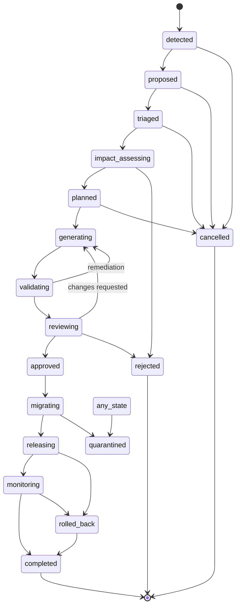

## 43.3 Transition Authority Matrix

| From | To | Authorized Trigger | Required Artifact |
|---|---|---|---|
| detected | proposed | Curator, Auditor, automated signal owner | Evolution Signal |
| proposed | triaged | Evolution Coordinator | initial scope and owner |
| triaged | impact_assessing | Domain Steward | accepted case |
| impact_assessing | planned | Evolution Architect | Impact Assessment and classification |
| planned | generating | UKPP authority | approved Change Request |
| generating | validating | UKPP | candidate revision |
| validating | reviewing | UKVF coordinator | validation result |
| reviewing | approved | authorized approver | approval package |
| approved | migrating | Migration Coordinator | Migration Plan and checkpoints |
| migrating | releasing | Release Manager | reconciled migration cohort |
| releasing | monitoring | Publisher | activated release |
| monitoring | completed | Evolution Coordinator | success criteria and observation period |
| any eligible | rolled_back | Rollback authority | rollback decision and safe target |
| any state | quarantined | Security, Auditor, Steward | critical integrity finding |

## 43.4 Terminal States

- completed;
- rejected;
- cancelled;
- rolled_back;
- quarantined.

A rolled-back case may spawn a new corrective Evolution Case.

---

# 44. Evolution Checkpoints

## 44.1 C0 — Signal Integrity

Verify the change signal is attributable and not duplicate noise.

## 44.2 C1 — Identity Boundary

Determine identity continuity, merge, split, or replacement.

## 44.3 C2 — Change Classification

Classify materiality and compatibility.

## 44.4 C3 — Temporal Scope

Resolve effective, transaction, and publication times.

## 44.5 C4 — Impact Graph

Identify dependencies, releases, queries, schemas, Ontology terms, and projections.

## 44.6 C5 — Migration Readiness

Approve transformation, cohorts, waves, rollback, and consumer communication.

## 44.7 C6 — Revision Validation

UKVF passes the candidate revision and migration artifacts.

## 44.8 C7 — Registry Readiness

UKR IDs, lineage, redirects, and pointer changes are valid.

## 44.9 C8 — Release Readiness

Query, snapshot, access, projection, and consumer compatibility pass.

## 44.10 C9 — Activation Verification

Verify active pointers, release exposure, redirects, and projections.

## 44.11 C10 — Propagation Reconciliation

All mandatory dependents reach terminal disposition.

## 44.12 C11 — Closure

Monitoring, audit, metrics, and historical reproducibility pass.

---

# 45. Change Propagation Model

## 45.1 Propagation Inputs

- changed Revision ID;
- change class;
- compatibility;
- effective time;
- dependency graph;
- relationship graph;
- source and evidence lineage;
- release membership;
- query usage telemetry;
- schema and Ontology versions.

## 45.2 Propagation Algorithm — Semantic Contract

1. identify direct dependents;
2. classify dependency type;
3. evaluate impact rule;
4. determine required action;
5. expand indirect dependents when required;
6. collapse cycles into impact cohorts;
7. assign migration waves;
8. execute through UKPP;
9. validate through UKVF;
10. register through UKR;
11. rebuild projections;
12. reconcile and close.

## 45.3 Propagation Actions

- no action;
- warning;
- revalidate;
- regenerate;
- revise relationship;
- migrate schema;
- migrate Ontology mapping;
- update query compatibility;
- deprecate;
- supersede;
- quarantine;
- block publication.

## 45.4 Propagation Priority

Priority considers:

- current publication exposure;
- user impact;
- legal or safety impact;
- dependency centrality;
- stale exposure risk;
- release deadline;
- reversibility.

## 45.5 Propagation at Scale

For billions of objects:

- deterministic partitioning;
- dependency-index lookup;
- bounded breadth expansion;
- cohort checkpoints;
- backpressure;
- idempotent migration;
- reconciliation sampling plus complete terminal accounting.

---

# 46. Dependency Propagation Model

## 46.1 Dependency Impact Rules

Each dependency type registers:

- triggering change classes;
- impact severity;
- propagation direction;
- maximum depth;
- revalidation profile;
- migration action;
- waiver eligibility.

## 46.2 Example Rules

### Evidence Dependency

Source invalidated → evidence invalidated → claim revalidation → revision revalidation → dependent reasoning restriction.

### Ontology Dependency

Predicate range changed → relationship validation → graph projection migration → query compatibility check.

### Schema Dependency

Mandatory field changed → object migration → consumer compatibility → release migration.

### Identity Dependency

Entity split → relationship target allocation → query ambiguity behavior → search redirect update.

## 46.3 Strongly Connected Components

Circular dependencies are migrated as one coordinated cohort or isolated until consistency can be restored.

## 46.4 Partial Propagation

Partial propagation is permitted only when:

- unaffected subgraphs are proven independent;
- release notes disclose partial state;
- no false default truth is exposed.

---

# 47. Version Negotiation Model

## 47.1 Negotiation Participants

- producer revision;
- consumer;
- UKL version;
- UKQF execution profile;
- schema version;
- Ontology version;
- release;
- compatibility adapter.

## 47.2 Negotiation Inputs

- consumer-supported versions;
- requested semantic capabilities;
- object version;
- schema and Ontology version;
- required fields;
- compatibility mappings;
- security and jurisdiction.

## 47.3 Negotiation Outcomes

- exact version;
- latest compatible;
- mapped compatible;
- legacy snapshot;
- migration required;
- unsupported;
- ambiguous;
- blocked.

## 47.4 Negotiation Sequence

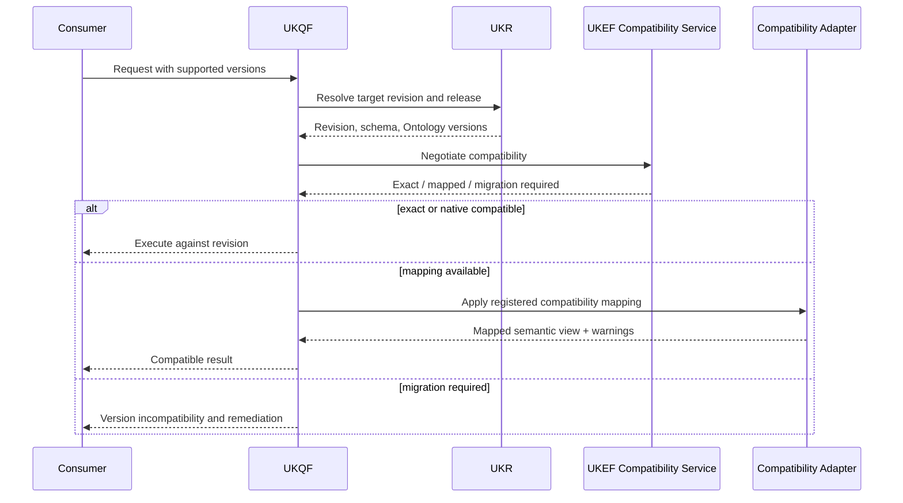

## 47.5 Version Preference

Default preference:

1. exact requested version;
2. latest fully compatible;
3. latest mapped-compatible with warning;
4. historical version;
5. explicit failure.

## 47.6 No Unsafe Downgrade

A newer breaking revision cannot be silently downgraded to an older revision when doing so changes requested current truth.

---

# 48. Rollback Workflow

## 48.1 Rollback Types

- active Revision pointer rollback;
- publication release rollback;
- relationship rollback;
- schema activation rollback;
- Ontology activation rollback;
- migration wave rollback;
- projection rollback;
- merge or split rollback when safe.

## 48.2 Preconditions

- prior safe state exists;
- prior state remains compatible with current dependencies;
- access and rights remain valid;
- rollback impact is assessed;
- authority approves;
- checkpoint exists;
- downstream reversal is possible.

## 48.3 Rollback Workflow Diagram

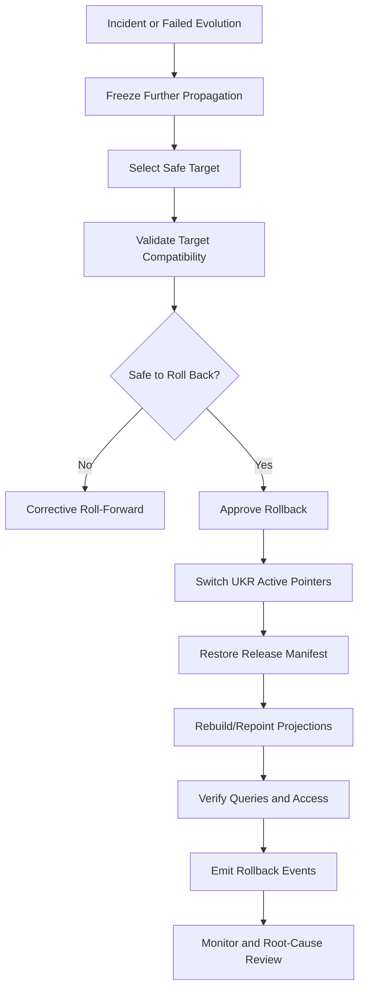

## 48.4 Rollback Semantics

The failed revision remains registered and historically resolvable.

Its publication state may become withdrawn.

## 48.5 Rollback Failure

If rollback cannot restore consistency:

- quarantine affected identities or release;
- disable default retrieval;
- execute corrective roll-forward;
- invoke disaster recovery when required.

---

# 49. Evolution Sequence Diagram

## 49.1 Standard Revision Evolution

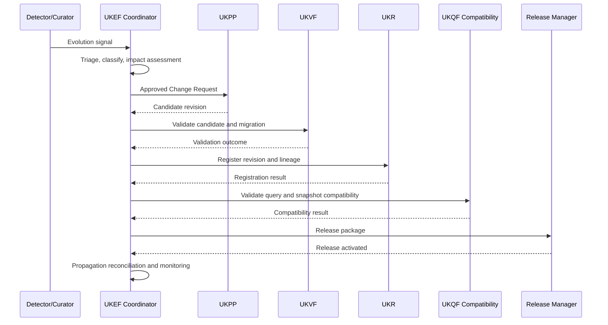

## 49.2 Source Withdrawal Sequence

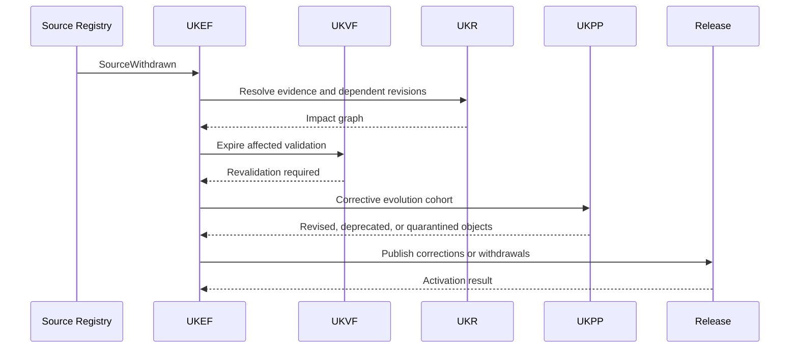

---

# 50. Execution Example — Career Evolves

## 50.1 Scenario

A Career retains its identity, but automation changes its core task distribution and introduces new Skill relationships.

## 50.2 Classification

- identity: unchanged;
- change: compatible enrichment plus contextual update;
- version: MINOR unless core definition changes incompatibly;
- effective time: date new task evidence applies;
- dependencies: Skills, Learning Resources, Career Roadmaps, Recommendations.

## 50.3 Execution

1. open Evolution Case from new evidence;
2. preserve Career Entity ID and Object ID;
3. create new Revision ID;
4. add or revise task and Skill relationships;
5. retain prior relationships with prior valid periods;
6. run relationship, evidence, semantic, temporal, and cross-object validation;
7. register revision;
8. revalidate affected Career Roadmaps and recommendations;
9. publish successor revision;
10. supersede prior revision;
11. monitor query and recommendation changes.

## 50.4 Query Result

Current UKL queries return the new revision.

Historical as-of queries return the prior task profile.

---

# 51. Execution Example — Skill Evolves

## 51.1 Scenario

A Skill’s accepted definition expands, and its prerequisites are revised.

## 51.2 Identity Decision

Same Entity ID if the core capability remains the same.

Create a new Skill Entity ID if the expansion creates a distinct capability rather than evolving the old one.

## 51.3 Change

- definition enrichment;
- relationship revision;
- prerequisite changes;
- possible taxonomy reclassification.

## 51.4 Execution

1. identity continuity review;
2. create MINOR revision if compatible;
3. create new Relationship revisions for prerequisites;
4. retain historical prerequisite graph;
5. propagate to Careers, Certifications, Assessments, and Learning Resources;
6. recalculate Skill-gap paths;
7. publish after dependency validation.

## 51.5 Edge Case

If one Skill was conflating two capabilities, use Split Strategy rather than broadening the definition.

---

# 52. Execution Example — Technology Replaced

## 52.1 Scenario

An obsolete Technology is functionally replaced by a newer Technology with a distinct product or semantic identity.

## 52.2 Identity Decision

Do not reuse the old Entity ID.

## 52.3 Evolution

- old Technology: Deprecated, then Superseded or Archived;
- new Technology: new Entity ID and Object lineage;
- relationship: `replaced_by` or registered equivalent;
- compatibility: partial, full, or no direct compatibility;
- migration guidance: Skills, Careers, Companies, Tools, Learning Resources.

## 52.4 Execution

1. create new Technology identity;
2. register replacement relationship;
3. define support and effective periods;
4. migrate current relationships where evidence supports;
5. retain historical use relationships on the old Technology;
6. update search aliases without claiming identity equivalence;
7. publish replacement and deprecation notices;
8. monitor old-query redirect behavior.

---

# 53. Execution Example — University Renamed

## 53.1 Scenario

A University changes its official name while institutional identity and legal continuity remain intact.

## 53.2 Identity

Same Entity ID.

## 53.3 Version

PATCH or MINOR depending on related institutional changes.

## 53.4 Execution

1. verify official authority and effective date;
2. create new revision with new canonical display name;
3. register former name as historical alias with validity period;
4. update localization records;
5. preserve external IDs;
6. update search and graph projections;
7. publish new revision;
8. ensure historical queries return the old name for prior effective periods.

## 53.5 Edge Case

If the rename accompanies a legal merger into a different institution, use Merge or Replacement Strategy based on continuity.

---

# 54. Execution Example — Certification Deprecated

## 54.1 Scenario

An issuing authority stops offering a Certification and recommends a successor.

## 54.2 Evolution

- Certification identity remains;
- lifecycle becomes Deprecated;
- publication warning added;
- valid issuance period retained;
- successor relationship added;
- holders’ historical credential references remain valid.

## 54.3 Execution

1. verify issuing-authority evidence;
2. set deprecation effective date;
3. register replacement relationship;
4. distinguish no-longer-issued from invalid;
5. update Career and Skill recommendation relationships;
6. prevent default recommendation after cutoff;
7. preserve historical queries and credential records;
8. archive later according to retention policy.

---

# 55. Execution Example — Occupation Merged

## 55.1 Scenario

Two Career or Occupation identities were duplicates created from different source taxonomies.

## 55.2 Merge Decision

- same semantic subject;
- compatible Ontology type;
- one canonical survivor;
- retired IDs redirect.

## 55.3 Execution

1. compare definitions, tasks, Skills, external codes, and geography;
2. preserve contextual differences;
3. approve merge;
4. select survivor Entity ID;
5. create merged revision and allocation map;
6. remap aliases and external IDs;
7. migrate relationships and dependencies;
8. activate redirects;
9. reconcile UKQF search, graph, and recommendation results;
10. publish merge notice.

## 55.4 Historical Behavior

Exact retired IDs remain resolvable with merge history.

---

# 56. Execution Example — Occupation Split

## 56.1 Scenario

One Career identity combines two materially distinct occupations.

## 56.2 Split Decision

Create two new child Entity IDs.

The original may remain as a broader parent or become Superseded.

## 56.3 Execution

1. define child boundaries;
2. reserve child IDs;
3. allocate tasks, Skills, industries, qualifications, evidence, and aliases;
4. mark ambiguous relationships for review;
5. validate each child independently;
6. create Split Record;
7. migrate dependencies in waves;
8. update queries to return split ambiguity for the origin ID;
9. publish children and origin disposition;
10. monitor search and recommendation effects.

## 56.4 Edge Case

Do not assign all historical observations to children when evidence cannot support the allocation. Retain them on the historical origin with explicit limitation.

---

# 57. Execution Example — Historical Salary Revision

## 57.1 Scenario

A data provider revises a previously published salary dataset due to a methodological correction.

## 57.2 Temporal Model

- observation effective period remains historical;
- transaction time is current correction date;
- publication time is correction release;
- old revision remains known-at historical record.

## 57.3 Change Classification

Historical restatement.

MINOR or MAJOR depending on magnitude and interpretation.

## 57.4 Execution

1. register new Source Revision;
2. create new Evidence revisions;
3. create corrected Salary Observation revision;
4. retain prior observation as Superseded, not erased;
5. revalidate aggregates and claims;
6. identify reports, Career Objects, and recommendations using old values;
7. republish corrected aggregates;
8. provide restatement note and methodology delta.

## 57.5 Query Behavior

- as-of effective time with current knowledge returns corrected historical value;
- known-at prior transaction time returns original published value.

---

# 58. Execution Example — Industry Taxonomy Update

## 58.1 Scenario

An Industry taxonomy reorganizes categories, merging some nodes and splitting others.

## 58.2 Evolution Type

Ontology and taxonomy migration.

## 58.3 Execution

1. register new taxonomy or Ontology version;
2. create mapping matrix:
   - exact;
   - renamed;
   - broader;
   - narrower;
   - merged;
   - split;
   - incompatible;
3. classify Industry entities;
4. preserve Entity IDs where subjects remain unchanged;
5. create merge or split identity cases where semantic boundaries changed;
6. migrate Career, Company, Technology, and labor-market relationships;
7. rebuild graph projections;
8. provide query compatibility adapter for old taxonomy;
9. release new taxonomy snapshot;
10. maintain historical old-taxonomy queries.

## 58.4 Edge Case

Taxonomy node split does not automatically mean every Company or Career maps uniquely to one child. Multi-mapping or unresolved status may be required.

---

# 59. Execution Example — AI Model Capability Evolution

## 59.1 Scenario

An AI model gains new capabilities or loses support for an old capability.

## 59.2 Entity Boundary

If the model identity remains the same versioned product lineage, create a new Technology or Tool revision.

If a separately marketed or technically distinct model is introduced, create a new Entity ID and replacement or family relationship.

## 59.3 Evolution

- capability relationships revised;
- benchmark evidence revised;
- supported-context assertions updated;
- deprecation or replacement relationship for old model version;
- query and recommendation compatibility reviewed.

## 59.4 Execution

1. verify official release and independent evidence;
2. distinguish vendor claims from observed capability;
3. create new revision or identity;
4. scope capability claims by model version, date, and method;
5. update Company, Technology, Tool, Skill, and AI Trend relationships;
6. revalidate AI Trend and Future Career forecasts;
7. preserve old model capability history;
8. publish with uncertainty and known limitations.

## 59.5 Safety

A newer model version must not inherit all prior claims automatically.

Every material capability claim requires version-specific evidence.

---

# 60. Evolution Metadata

Every Evolution Case MUST record:

- Evolution Case ID;
- signal and source;
- affected Entity, Object, and Revision IDs;
- owner;
- risk;
- change classification;
- identity decision;
- semantic version;
- effective time;
- transaction time;
- publication time;
- evidence;
- impact graph;
- dependencies;
- compatibility matrix;
- Migration Plan;
- Validation Plan and runs;
- UKR transactions;
- release IDs;
- rollback target;
- checkpoints;
- events;
- monitoring;
- final disposition;
- correlation and causation IDs.

---

# 61. Conceptual Evolution APIs

## 61.1 API Principles

Operations may be implemented as services, workflow commands, events, or agent tasks.

Mutating operations require:

- authentication;
- authorization;
- idempotency;
- expected state;
- version precondition;
- audit metadata;
- typed outcome.

## 61.2 Signal Operations

### Submit Evolution Signal

Creates or links to an Evolution Case.

### Classify Evolution Signal

Records initial change type and materiality.

### Dismiss Duplicate Signal

Links duplicate signal to existing case.

## 61.3 Impact Operations

### Start Impact Assessment

### Get Dependency Impact

### Get Release Impact

### Get Query Compatibility Impact

### Complete Impact Assessment

## 61.4 Planning Operations

### Create Evolution Plan

### Create Migration Plan

### Assess Compatibility

### Approve Evolution Plan

## 61.5 Identity Operations

### Confirm Identity Continuity

### Propose Merge

### Propose Split

### Propose Replacement

## 61.6 Revision Operations

### Request Revision Production

### Bind Candidate Revision

### Register Evolution Revision

### Activate Evolution Revision

## 61.7 Migration Operations

### Create Migration Cohort

### Start Migration Wave

### Record Item Migration

### Reconcile Migration

### Complete Migration

## 61.8 Release Operations

### Create Evolution Release

### Activate Evolution Release

### Monitor Evolution Release

### Roll Back Evolution

## 61.9 Query Operations

### Get Evolution Case

### Get Version Graph

### Get Compatibility Matrix

### Get Migration Status

### Get Historical Lineage

### Resolve Version

### Get Evolution Audit

---

# 62. Evolution Error Model

## 62.1 Error Categories

- duplicate evolution signal;
- identity continuity conflict;
- unsupported change classification;
- incompatible schema;
- incompatible Ontology;
- dependency graph incomplete;
- migration transformation failure;
- validation failure;
- Registry conflict;
- query compatibility failure;
- release incompatibility;
- rollback target invalid;
- historical lineage gap;
- unauthorized approval;
- partial migration divergence;
- source or evidence integrity failure;
- security incident.

## 62.2 Error Contract

Contains:

- Error ID;
- Evolution Case ID;
- stage;
- category;
- severity;
- affected IDs;
- retryability;
- cause;
- containment;
- remediation;
- rollback eligibility;
- owner;
- correlation ID.

## 62.3 Error Containment

Contain at the smallest safe scope:

- revision;
- identity;
- dependency cohort;
- migration wave;
- release;
- entire evolution program.

## 62.4 Non-Retryable Errors

Examples:

- invalid identity merge;
- prohibited rights use;
- unrecoverable lineage corruption;
- constitutional violation;
- rejected breaking change.

---

# 63. Evolution Recovery and Continuity

## 63.1 Recovery Sources

- UKR revisions and events;
- Evolution Case records;
- Migration checkpoints;
- release manifests;
- UKVF runs;
- dependency cohorts;
- audit logs.

## 63.2 Recovery Procedure

1. freeze unsafe propagation;
2. identify last trusted checkpoint;
3. reconcile UKR and release state;
4. classify incomplete migrations;
5. resume idempotent items;
6. rollback or roll forward failed cohorts;
7. rebuild projections;
8. verify query compatibility;
9. resume monitoring.

## 63.3 Orphan Revisions

A revision produced but not linked to an active Evolution Case is quarantined pending lineage reconciliation.

## 63.4 Incomplete Redirect

If merge or split redirect activation is incomplete:

- suspend current resolution;
- return explicit temporary ambiguity;
- reconcile before ordinary query service resumes.

---

# 64. Evolution Program and Batch Scaling

## 64.1 Evolution Program

Large changes are grouped into an Evolution Program.

Examples:

- Ontology major upgrade;
- taxonomy migration;
- source withdrawal campaign;
- mass localization update;
- model capability reclassification.

## 64.2 Hierarchy

1. Evolution Program
2. Release Train
3. Evolution Batch
4. Migration Cohort
5. Work Item
6. Attempt
7. Artifact

## 64.3 Batch Rules

- deterministic manifests;
- immutable source and target versions;
- idempotent work items;
- dependency-aware ordering;
- checkpoints;
- terminal disposition for every item;
- reconciliation.

## 64.4 Parallel Evolution

Parallel execution is allowed for independent cohorts.

Shared identities, active pointers, and strongly connected dependencies require coordination.

## 64.5 Backpressure

Generation slows when:

- validation backlog grows;
- Registry conflicts increase;
- migration failures exceed threshold;
- query compatibility errors rise;
- release capacity is saturated.

---

# 65. Production Readiness Checklist

A UKEF implementation is production-ready only when:

- [ ] KOS, UKR, publication, and Evolution Case states remain separate.
- [ ] Revision payloads are immutable.
- [ ] Tritemporal fields are implemented.
- [ ] Identity continuity rules are governed.
- [ ] Semantic versioning is enforced.
- [ ] Revision graph supports branches and merge parents.
- [ ] Merge and split preserve redirects and allocation maps.
- [ ] Deprecation and replacement are distinct.
- [ ] Compatibility matrix is versioned.
- [ ] Version negotiation is available.
- [ ] Migration plans support canary, waves, checkpoints, and reconciliation.
- [ ] Dependency propagation rules are registered.
- [ ] Relationship evolution is independently versioned.
- [ ] Schema and Ontology migrations are supported.
- [ ] UKVF impact and revalidation are integrated.
- [ ] UKR registration and pointer changes are integrated.
- [ ] UKL and UKQF compatibility mappings are available.
- [ ] Snapshot and release compatibility are validated.
- [ ] Rollback and roll-forward are tested.
- [ ] Historical known-at and as-of queries reproduce correctly.
- [ ] Source withdrawal propagation is tested.
- [ ] Audit chain is complete.
- [ ] Monitoring and alerts are active.
- [ ] Billion-object cohort scaling is tested.
- [ ] AI proposals cannot self-approve evolution.
- [ ] Emergency evolution retains all non-waivable controls.

---

# 66. Success Criteria

UKEF is successful when:

1. canonical knowledge can evolve without overwriting history;
2. every material change creates an immutable revision;
3. canonical identities remain stable unless governed evidence requires merge, split, or replacement;
4. effective, transaction, and publication time remain independently queryable;
5. every evolution is classified for compatibility;
6. breaking changes always include migration and release plans;
7. dependencies propagate through registered impact rules;
8. relationship, schema, and Ontology evolution remain traceable;
9. UKVF revalidation is proportional and complete;
10. UKR lineage and pointers remain consistent;
11. UKL and UKQF can negotiate historical and current versions;
12. releases can be reproduced and rolled back;
13. prior revisions, names, relationships, and evidence remain historically resolvable;
14. merges and splits preserve all source identities and allocation history;
15. deprecation does not erase knowledge;
16. replacements do not falsely claim identity continuity;
17. migration at billion-object scale remains idempotent and reconcilable;
18. every evolution decision is explainable and auditable;
19. emergency corrections remain governed;
20. the framework remains valid across future technologies and entity types.

---

# 67. Closing Standard

Universal Knowledge Evolution Framework V1 is the long-term change standard of the KarirGPS Knowledge Operating System.

KOS defines Knowledge Object lifecycle.

UKPP defines how changes are produced.

UKVF defines how changed revisions are validated.

UKR defines how identities, revisions, lineage, and pointers are registered.

UKL defines how consumers express version and historical intent.

UKQF defines how current, historical, and migrated knowledge is resolved and executed.

UKEF defines how all of those systems preserve truth while knowledge changes.

UKEF does not edit published knowledge.

It creates a new revision.

UKEF does not reuse an identity merely because two names look similar.

It performs an identity continuity decision.

UKEF does not delete the past when evidence changes.

It preserves what was effective, what was recorded, and what was published at each time.

UKEF does not call every successor the same entity.

It distinguishes revision, replacement, merge, and split.

UKEF does not declare compatibility without testing consumers, dependencies, schemas, Ontology mappings, queries, and releases.

UKEF does not treat rollback as erasure.

It restores a safe pointer while preserving the failed evolution.

Every completed evolution therefore has:

- an Evolution Case;
- a classified change;
- an identity decision;
- a new immutable revision or governed identity operation;
- effective, transaction, and publication time;
- a compatibility matrix;
- a dependency impact graph;
- a Migration Plan;
- UKVF validation;
- UKR lineage;
- UKL and UKQF compatibility;
- a release and rollback record;
- complete audit and monitoring.

The permanent contracts of UKEF are:

- stable identity;
- immutable revision;
- semantic version;
- tritemporal history;
- compatibility;
- migration;
- propagation;
- approval;
- release;
- rollback;
- lineage;
- explanation.

These contracts allow KarirGPS knowledge to evolve continuously for decades while remaining trustworthy, historically accurate, query-compatible, graph-compatible, distributed-system ready, and reproducible across future models, databases, organizations, jurisdictions, and technologies.
