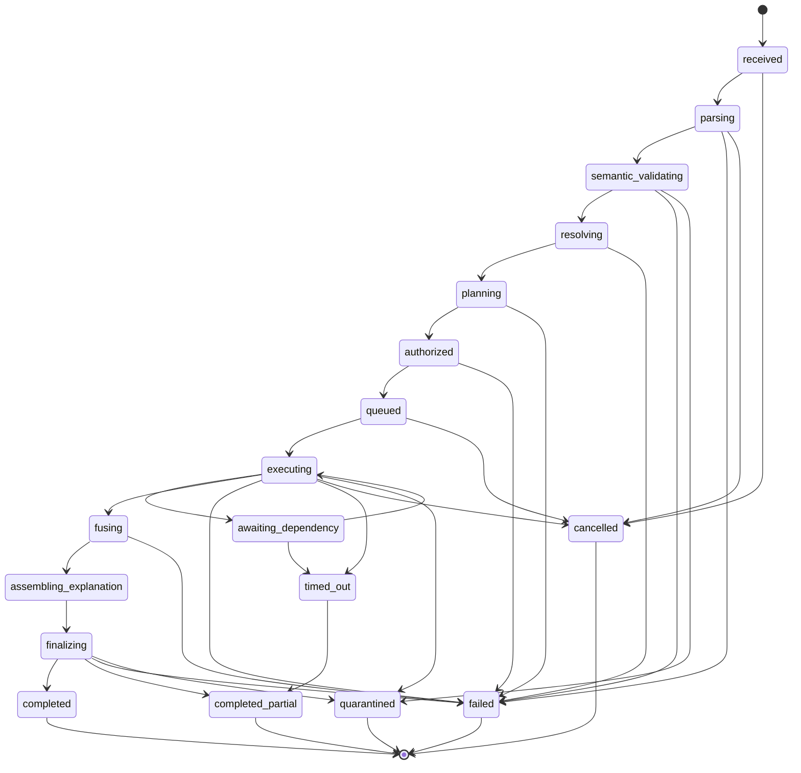
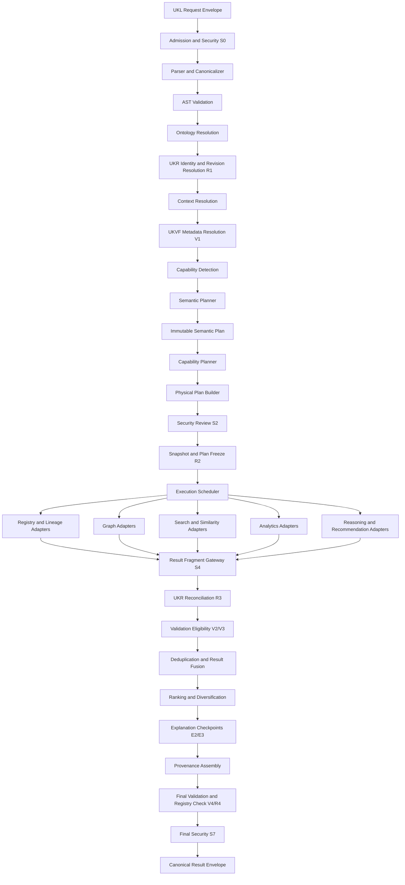
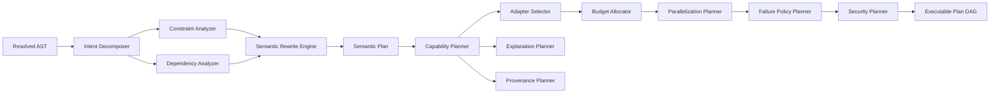
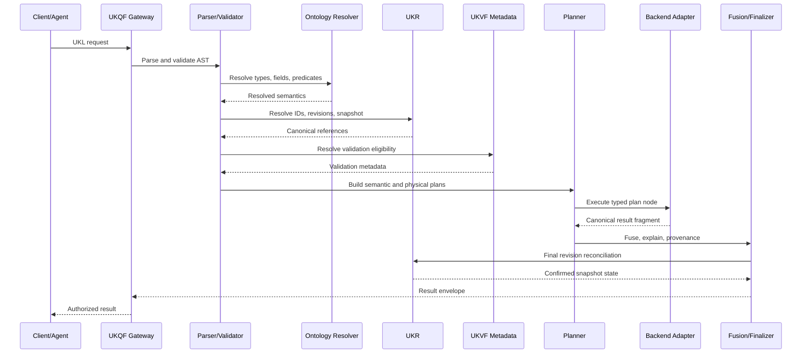
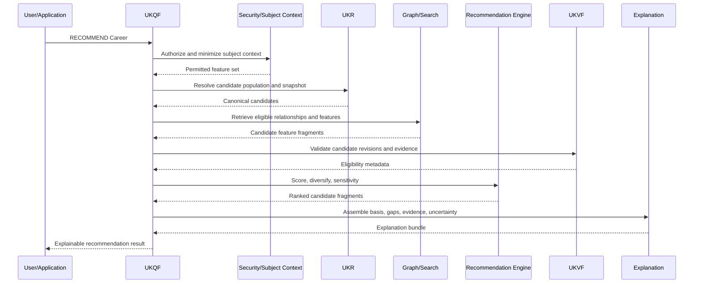
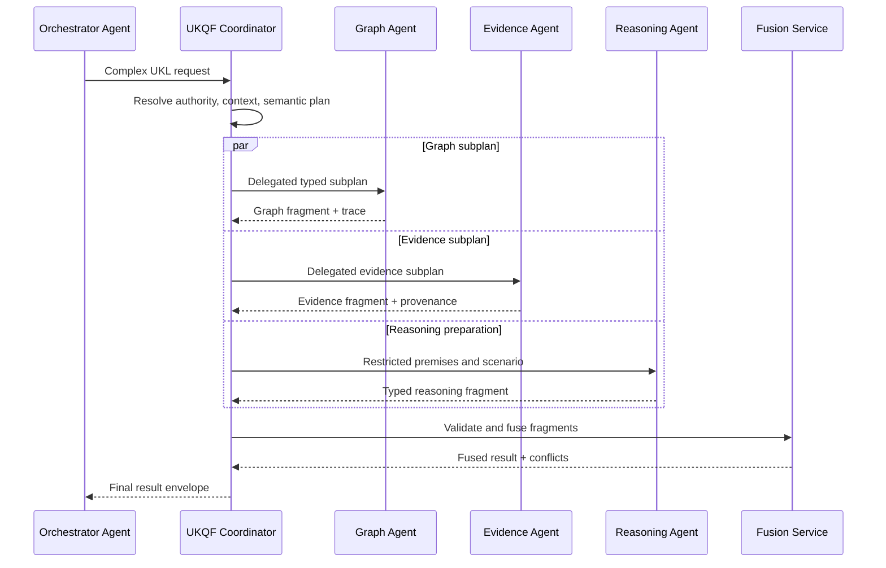

# Universal Knowledge Query Framework V1

**Product:** KarirGPS  
**Document Type:** Enterprise Semantic Query Execution Architecture and Operating Standard  
**Version:** 1.0  
**Status:** Normative Framework Baseline  
**Governing Constitution:** AI Constitution  
**Governing Ontology:** Career Knowledge Ontology  
**Governing Object Contract:** Knowledge Object Specification  
**Governing Generator Framework:** `assets/knowledge/frameworks/Universal_Entity_Generator_Framework_V1.md`  
**Governing Production Pipeline:** `assets/knowledge/frameworks/Universal_Knowledge_Production_Pipeline_V1.md`  
**Governing Validation Framework:** `assets/knowledge/frameworks/Universal_Knowledge_Validation_Framework_V1.md`  
**Governing Registry Framework:** `assets/knowledge/frameworks/Universal_Knowledge_Registry_Framework_V1.md`  
**Governing Language Framework:** `assets/knowledge/frameworks/Universal_Knowledge_Language_Framework_V1.md`  
**Target Path:** `assets/knowledge/frameworks/Universal_Knowledge_Query_Framework_V1.md`

---

## 0. Normative Status, Authority, and Execution Boundary

### 0.1 Status

Universal Knowledge Query Framework V1, hereafter **UKQF**, is the authoritative semantic execution architecture that transforms a valid Universal Knowledge Language request into deterministic, explainable, auditable, policy-compliant, and backend-independent knowledge results.

UKQF is the execution plane of the KarirGPS Knowledge Operating System.

### 0.2 Authority Precedence

When an execution instruction conflicts with another authoritative source, apply this order:

1. applicable law, safety, privacy, and binding rights restrictions;
2. AI Constitution;
3. Career Knowledge Ontology;
4. Knowledge Object Specification;
5. Universal Entity Generator Framework or applicable object-kind framework;
6. Universal Knowledge Production Pipeline;
7. Universal Knowledge Validation Framework;
8. Universal Knowledge Registry Framework;
9. Universal Knowledge Language Framework;
10. Universal Knowledge Query Framework;
11. registered UKQF profile or extension;
12. backend adapter optimization;
13. request-specific execution preference.

A lower-level execution mechanism may optimize implementation but MUST NOT alter higher-level semantics.

### 0.3 Execution Boundary

UKQF defines:

- the canonical execution lifecycle;
- semantic parsing and AST checks;
- Ontology, Registry, context, validation, publication, and policy resolution;
- capability detection and negotiation;
- semantic and physical plan separation;
- adapter contracts;
- graph, search, similarity, recommendation, reasoning, aggregation, and lineage execution;
- deterministic result fusion;
- deduplication;
- ranking integration;
- explanation and provenance assembly;
- security checkpoints;
- timeouts, retries, recovery, and partial-result behavior;
- auditability and observability;
- conformance and extension architecture.

UKQF does not define:

- physical database design;
- vendor-specific query syntax;
- storage indexes;
- distributed database algorithms;
- low-level cost-based optimization;
- a specific model provider;
- a specific graph, vector, search, or analytical engine;
- Knowledge Object generation;
- canonical registration;
- validation rules owned by UKVF;
- publication transitions owned by UKPP and UKR.

### 0.4 Normative Terms

- **MUST** indicates a mandatory requirement.
- **MUST NOT** indicates a prohibited condition.
- **SHOULD** indicates a requirement that may be waived only through governed policy.
- **MAY** indicates an allowed option.
- **CONDITIONAL** indicates a requirement activated by a defined condition.

### 0.5 Execution Invariants

Every UKQF-conformant implementation MUST preserve these invariants:

1. The UKL AST is the authoritative request meaning.
2. The Semantic Plan is immutable after authorization and snapshot lock.
3. A Physical Execution Plan may change without changing the Semantic Plan.
4. Backend adapters cannot add, remove, or reinterpret material UKL constraints.
5. Every canonical identity is resolved through UKR.
6. Every entity type, predicate, and semantic field is resolved through the Ontology and registered schema contracts.
7. Every validation-aware constraint is resolved through UKVF metadata.
8. Object lifecycle, Registry state, validation status, and publication state remain distinct.
9. Every query executes against a declared consistency point, snapshot, release, or explicit cross-snapshot policy.
10. Security and purpose checks occur before restricted data is accessed and again before results are released.
11. Unknown is not false.
12. Not applicable is not unknown.
13. Inaccessible is not a semantic truth value.
14. Missing evidence is not evidence of absence.
15. Similarity does not imply equivalence.
16. Ranking does not imply objective superiority.
17. Recommendation does not imply certainty or guarantee.
18. Forecast does not imply fact.
19. Every result item identifies its canonical revision when policy allows.
20. Every material result preserves provenance and validation state.
21. Result fusion never invents a new canonical identity.
22. Deduplication uses UKR identity and explicit equivalence rules, not text similarity alone.
23. Adapter failure cannot silently remove mandatory semantic constraints.
24. Partial results are explicit and identify unexecuted plan nodes.
25. Retries are idempotent and bounded.
26. Timeouts are budgeted by plan stage and do not authorize unsafe degradation.
27. Explanation is assembled from registered evidence, plan decisions, scores, paths, and constraints—not private chain of thought.
28. Execution traces are immutable from an audit perspective.
29. Caches cannot serve results with incompatible context, policy, snapshot, or access scope.
30. Deterministic operators produce stable results under the same fingerprint.
31. Probabilistic operators identify model, method, version, and score semantics.
32. Multi-agent delegation narrows or preserves authority and context; it never broadens them.
33. Backend implementations are replaceable.
34. UKQF remains valid at billions-of-object scale.
35. Execution never mutates canonical UKR knowledge in UKQF V1.
36. Every failure is typed and attributable to an AST node, plan node, adapter, policy, or dependency.
37. Every successful result exposes enough traceability to reproduce the semantic execution.
38. An engine that cannot preserve semantics MUST reject or return an explicit unsupported capability outcome.
39. Cost and latency objectives never override security, evidence, validation, or publication constraints.
40. The framework remains AI-native, model-agnostic, and technology-neutral.

### 0.6 Two-Plan Principle

UKQF separates:

1. **Semantic Execution Plan**  
   A backend-independent representation of what must be resolved, constrained, computed, compared, ranked, explained, and returned.

2. **Physical Execution Plan**  
   A replaceable arrangement of adapters, execution stages, partitions, concurrency, retries, and resource budgets used to implement the Semantic Plan.

A physical planner may reorder commutative operations or push eligible filters to adapters only when semantic equivalence is provable.

---

# 1. Purpose

## 1.1 Primary Purpose

UKQF defines how the KarirGPS Knowledge Operating System executes valid UKL requests from semantic intent to canonical result.

## 1.2 Interoperability Purpose

UKQF allows one UKL request to be executed through any compatible combination of:

- UKR identity and revision services;
- Knowledge Graph projections;
- lexical search systems;
- semantic or vector retrieval systems;
- analytical engines;
- reasoning engines;
- recommendation engines;
- validation services;
- lineage and provenance services;
- future knowledge backends.

## 1.3 Assurance Purpose

UKQF ensures that execution is:

- semantically faithful;
- context-correct;
- access-controlled;
- evidence-aware;
- validation-aware;
- version-aware;
- explainable;
- reproducible;
- observable;
- recoverable.

## 1.4 Scope

UKQF supports all UKL V1 intents:

- `RETRIEVE`;
- `SEARCH`;
- `TRAVERSE`;
- `COMPARE`;
- `AGGREGATE`;
- `RANK`;
- `SIMILAR`;
- `REASON`;
- `RECOMMEND`;
- `EXPLAIN`;
- `TRACE`;
- `RESOLVE`.

## 1.5 Non-Scope

UKQF does not:

- define new Ontology terms;
- create canonical IDs;
- modify Knowledge Objects;
- approve validation waivers;
- publish results into UKR;
- expose backend-specific plans as semantic contracts;
- substitute model output for canonical evidence.

---

# 2. Design Philosophy

## 2.1 Semantics Before Execution

The request is understood and normalized before any backend is selected.

## 2.2 Canonical Resolution Before Retrieval

Names, aliases, object references, revisions, predicates, and fields are resolved before authoritative result assembly.

## 2.3 One Semantic Plan, Many Physical Strategies

Backend selection is an implementation choice.

The Semantic Plan remains stable.

## 2.4 Security Before Data

Authorization is evaluated before data acquisition and before result release.

## 2.5 Evidence and Validation in the Execution Path

Evidence and validation constraints are not post-processing decorations.

They affect eligibility, ranking, explanation, and result confidence.

## 2.6 Deterministic Core, Probabilistic Extensions

Identity, Registry, Ontology, lifecycle, Boolean, version, and policy operations should be deterministic.

Search, similarity, recommendation, forecast, and AI reasoning may be probabilistic but must expose method and uncertainty.

## 2.7 Explainability by Construction

Every execution plan retains the data required to explain:

- what was resolved;
- what was excluded;
- what constraints applied;
- which paths or scores affected the result;
- which evidence and validation states were used;
- what remained unknown.

## 2.8 Fail Closed, Degrade Explicitly

Mandatory clauses never disappear silently.

An unavailable optional capability may produce a declared partial result when the request and policy permit it.

## 2.9 Backend Neutrality

A graph adapter, search adapter, vector adapter, or model adapter is a replaceable executor.

It does not own semantic truth.

## 2.10 Scale Through Decomposition

Complex requests are decomposed into independently traceable plan nodes with explicit dependencies, budgets, and fusion rules.

---

# 3. Execution Principles

## 3.1 Immutable Request Fingerprint

Every execution receives a fingerprint covering:

- UKL AST;
- UKL version;
- extension versions;
- actor and purpose context;
- Registry snapshot or release;
- Ontology and schema versions;
- validation policy;
- capability profile;
- security policy;
- deterministic options;
- probabilistic model versions where selected.

## 3.2 Explicit Consistency

Each execution declares one of:

- strong snapshot consistency;
- release consistency;
- bounded-staleness consistency;
- eventual consistency with warning;
- historical as-of consistency;
- explicit cross-snapshot comparison.

## 3.3 Typed Plan Nodes

Every plan node has:

- node type;
- inputs;
- outputs;
- semantic contract;
- dependencies;
- security requirements;
- validation requirements;
- timeout;
- retry class;
- deterministic status;
- explanation contribution;
- provenance contribution.

## 3.4 Referential Stability

Plan nodes exchange stable references and typed result fragments.

They do not exchange ungoverned prose as authoritative data.

## 3.5 Idempotent Effects

UKQF V1 is read-oriented. Execution retries must not create side effects in canonical knowledge systems.

## 3.6 Monotonic Constraint Preservation

Each downstream node must preserve or strengthen upstream mandatory constraints.

## 3.7 Independent Eligibility and Preference

Eligibility constraints are resolved before recommendation preferences and ranking.

## 3.8 Score Transparency

Every score identifies:

- method;
- dimensions;
- weights;
- normalization;
- missing-value policy;
- version;
- uncertainty.

## 3.9 Bounded Resource Use

Every query has:

- total deadline;
- stage budgets;
- fan-out limits;
- depth limits;
- result limits;
- model-token or inference budgets where applicable.

## 3.10 Traceable Degradation

Any degradation from requested capability is represented in the result envelope and execution trace.

---

# 4. Query Lifecycle

## 4.1 Lifecycle States

### `received`

A request envelope has entered the execution boundary.

### `parsing`

Canonical text or transport AST is being parsed and normalized.

### `semantic_validating`

The AST is being checked for language, type, Ontology, Registry, context, policy, and capability validity.

### `resolving`

Canonical identities, revisions, contexts, defaults, validation profiles, and access policies are being resolved.

### `planning`

Semantic and physical plans are being constructed.

### `authorized`

Security, purpose, and execution-policy checks have passed for the locked plan.

### `queued`

The plan is waiting for execution capacity.

### `executing`

One or more plan nodes are running.

### `awaiting_dependency`

Execution is waiting for a required service, reference, or delegated result.

### `fusing`

Fragments are being normalized, deduplicated, joined, aggregated, ranked, or reconciled.

### `assembling_explanation`

Explanation and provenance are being assembled.

### `finalizing`

Security, validation, projection, determinism, and result-contract checks are running.

### `completed`

A final result envelope has been produced.

### `completed_partial`

A permitted partial result has been produced.

### `failed`

Execution did not produce a valid result.

### `cancelled`

Execution was cancelled.

### `timed_out`

The total execution deadline expired.

### `quarantined`

Execution or result was isolated because of security, provenance, or integrity risk.

## 4.2 State Machine



## 4.3 Transition Record

Every state transition records:

- Execution ID;
- prior state;
- new state;
- actor or component;
- timestamp;
- reason;
- AST or plan node reference;
- correlation and causation IDs;
- error or warning;
- snapshot;
- deadline status.

## 4.4 Terminal States

- completed;
- completed_partial;
- failed;
- cancelled;
- quarantined.

A timed-out execution may become `completed_partial` only when partial results are authorized.

---

# 5. Semantic Parsing Pipeline

## 5.1 Inputs

UKQF accepts:

- UKL Canonical Text Form;
- a transport serialization of the UKL AST;
- a registered backward-compatible UKL representation.

## 5.2 Parsing Stages

1. envelope validation;
2. version detection;
3. lexical analysis;
4. syntax parsing;
5. AST construction;
6. extension loading;
7. canonicalization;
8. AST fingerprint generation;
9. syntax diagnostics.

## 5.3 Canonicalization

Canonicalization:

- normalizes keyword form;
- normalizes literals;
- expands material defaults later supplied by context policy;
- resolves extension namespaces;
- preserves ordered expressions;
- normalizes commutative Boolean sets;
- assigns AST node IDs.

## 5.4 Parser Output

- parsed AST;
- canonical text;
- AST fingerprint;
- syntax warnings;
- unresolved symbols;
- requested capabilities.

## 5.5 Parsing Failure

Parsing fails on:

- unsupported UKL version;
- malformed syntax;
- invalid literal;
- unknown mandatory extension;
- structurally incomplete intent.

## 5.6 Parser Determinism

The same canonical input and parser version must produce the same AST and fingerprint.

---

# 6. AST Validation

## 6.1 Validation Layers

AST validation checks:

1. root contract;
2. intent completeness;
3. type compatibility;
4. operator compatibility;
5. clause compatibility;
6. reference syntax;
7. context syntax;
8. projection validity;
9. extension validity;
10. constraint satisfiability.

## 6.2 Type Checking

The type checker verifies:

- field path types;
- literal types;
- operator operand types;
- collection element types;
- result type expectations;
- function signatures;
- path step types.

## 6.3 Constraint Satisfiability

The analyzer detects contradictions such as:

```text
publication.state = published
AND publication.state = not_published
```

It also detects mutually impossible context and version requirements.

## 6.4 Intent-Specific Rules

Examples:

- `TRAVERSE` requires a start expression and path.
- `RECOMMEND` requires a subject context and candidate type.
- `AGGREGATE` requires at least one aggregation item.
- `SIMILAR` requires a reference target and dimensions or a profile default.
- `FORECAST` requires a horizon.
- historical selectors require temporal capability.

## 6.5 AST Validation Output

- valid;
- valid with warnings;
- invalid;
- ambiguity requiring resolution;
- unsupported extension.

## 6.6 Validation Checkpoint A

No Ontology, Registry, search, graph, vector, reasoning, or recommendation execution begins before AST validation passes.

---

# 7. Ontology Resolution

## 7.1 Purpose

Resolve all semantic types, fields, predicates, controlled values, inheritance, and domain/range rules against a locked Ontology version.

## 7.2 Resolution Inputs

- AST;
- Ontology version;
- schema contracts;
- registered UKL extensions;
- object-kind profiles.

## 7.3 Resolution Operations

- resolve entity and object types;
- resolve field paths;
- resolve predicates;
- resolve controlled vocabularies;
- validate predicate direction;
- validate path domain and range;
- apply inheritance;
- identify deprecated terms;
- identify migration aliases.

## 7.4 Resolved Semantic Symbols

Each symbol receives:

- canonical semantic ID;
- declared type;
- source version;
- deprecation status;
- compatible replacement;
- constraints.

## 7.5 Ontology Failure

- unknown type;
- unknown field;
- unknown predicate;
- invalid path;
- category mixing;
- incompatible extension;
- deprecated term without accepted migration.

## 7.6 Ontology Checkpoint

The Semantic Plan cannot be frozen until all material Ontology symbols resolve.

---

# 8. Registry Resolution

## 8.1 Purpose

Resolve UKL references, labels, aliases, active pointers, exact revisions, redirects, historical states, and publication contexts through UKR.

## 8.2 Resolution Modes

- exact Entity ID;
- exact Object ID;
- exact Revision ID;
- active revision;
- published revision;
- latest validated revision;
- historical as-of revision;
- alias resolution;
- external ID resolution;
- contextual active pointer;
- merge or split redirect.

## 8.3 Label Resolution

Unresolved labels are resolved using:

1. canonical name;
2. aliases;
3. synonyms;
4. localizations;
5. external references;
6. type and context filters.

Authoritative mode returns ambiguity rather than silently selecting a candidate.

## 8.4 Registry Snapshot Lock

The resolver selects:

- release ID;
- Registry snapshot ID;
- transaction-time point;
- historical as-of context;
- bounded-staleness point.

The selection is recorded in the Execution Fingerprint.

## 8.5 Redirect Handling

Redirects may be:

- followed;
- returned;
- prohibited;
- expanded to split candidates.

The request or policy controls behavior.

## 8.6 Registry Checkpoint A

Before planning, UKQF verifies:

- referenced IDs exist or have authorized minimal tombstones;
- selected revisions are eligible;
- active pointers are unambiguous;
- logical deletion and access restrictions are respected;
- validation metadata is available when required.

---

# 9. Context Resolution

## 9.1 Context Dimensions

- valid time;
- transaction time;
- publication time;
- geography;
- jurisdiction;
- locale;
- language;
- currency;
- unit system;
- audience;
- purpose;
- actor;
- subject;
- scenario;
- release;
- Registry snapshot;
- validation profile;
- publication channel;
- access context.

## 9.2 Resolution Precedence

1. explicit UKL expression;
2. request envelope;
3. delegated parent context;
4. application policy;
5. governed system default;
6. context-required error.

## 9.3 Required Context Detection

The Context Resolver uses:

- intent;
- target type;
- fields;
- predicates;
- profiles;
- selected operations.

Examples:

- salary requires geography, currency, and time;
- regulation requires jurisdiction and effective period;
- localization requires locale;
- historical comparison requires two temporal selectors;
- recommendation requires subject and purpose.

## 9.4 Context Object

The canonical context object records:

- explicit dimensions;
- defaulted dimensions;
- unresolved dimensions;
- source policies;
- context fingerprint.

## 9.5 Context Conflict

A conflict produces:

- invalid context;
- context comparison plan when explicitly requested;
- human or caller clarification requirement.

## 9.6 Context Checkpoint

No result fragment may be fused across incompatible contexts without an explicit normalization or comparison rule.

---

# 10. Capability Detection

## 10.1 Purpose

Determine whether the execution environment can implement every required Semantic Plan node.

## 10.2 Capability Sources

- Engine Capability Registry;
- Backend Adapter Registry;
- model and reasoning registry;
- profile declarations;
- security and jurisdiction restrictions;
- current service health;
- resource policy.

## 10.3 Capability Dimensions

- Registry resolution;
- Ontology resolution;
- graph traversal;
- lexical search;
- semantic retrieval;
- hybrid search;
- similarity method;
- numerical aggregation;
- statistical aggregation;
- recommendation;
- symbolic reasoning;
- AI-assisted reasoning;
- scenario forecast;
- lineage;
- validation lookup;
- evidence lookup;
- localization;
- historical snapshots;
- secure redaction.

## 10.4 Capability Status

- available;
- available with limitations;
- degraded;
- temporarily unavailable;
- unauthorized;
- unsupported.

## 10.5 Capability Requirement Classes

- mandatory;
- preferred;
- optional.

Mandatory unsupported capabilities fail the request.

Preferred or optional capabilities may degrade only under request and policy permission.

## 10.6 Capability Report

The report identifies:

- requested capability;
- selected provider;
- version;
- limitations;
- fallback;
- effect on semantics;
- effect on explanation.

---

# 11. Semantic Planning

## 11.1 Purpose

Transform the resolved AST into a backend-independent Semantic Execution Plan.

## 11.2 Semantic Plan Nodes

The universal node catalog includes:

- `ResolveReference`;
- `ResolveContext`;
- `Authorize`;
- `SelectCandidates`;
- `LexicalSearch`;
- `SemanticSearch`;
- `AliasSearch`;
- `TraverseRelationship`;
- `ResolveDependency`;
- `FetchCanonicalObject`;
- `FetchRevision`;
- `FetchValidation`;
- `FetchEvidence`;
- `FetchSource`;
- `ApplyFilter`;
- `EvaluateBoolean`;
- `Compare`;
- `Aggregate`;
- `NormalizeMeasure`;
- `ComputeSimilarity`;
- `EvaluateEligibility`;
- `ComputeRecommendationFeatures`;
- `Rank`;
- `Diversify`;
- `Reason`;
- `Forecast`;
- `TraceLineage`;
- `Deduplicate`;
- `FuseResults`;
- `Project`;
- `AssembleExplanation`;
- `AssembleProvenance`;
- `SecurityRedact`;
- `FinalizeResult`.

## 11.3 Semantic Plan Node Contract

Every node contains:

- Plan Node ID;
- node type;
- AST node references;
- semantic inputs;
- semantic outputs;
- mandatory constraints;
- optional preferences;
- context;
- dependencies;
- result cardinality;
- ordering semantics;
- deterministic class;
- explanation obligation;
- provenance obligation;
- security class;
- failure policy.

## 11.4 Logical Rewrites

Permitted rewrites include:

- filter pushdown;
- projection minimization;
- equivalent path inversion;
- commutative filter reordering;
- candidate narrowing before expensive reasoning;
- aggregation pre-grouping;
- cache substitution.

A rewrite is allowed only when a semantic equivalence rule is registered and auditable.

## 11.5 Prohibited Rewrites

The planner must not:

- change mandatory constraints into ranking preferences;
- weaken evidence or confidence thresholds;
- replace exact identity with similarity;
- replace published revision with latest draft;
- collapse historical revisions into current state;
- infer missing context silently;
- remove excluded candidates;
- alter ranking weights;
- convert forecast into factual retrieval.

## 11.6 Semantic Plan Output

- immutable Semantic Plan;
- semantic plan fingerprint;
- required capabilities;
- required checkpoints;
- expected result type;
- explanation and provenance obligations.

---

# 12. Execution Planning

## 12.1 Purpose

Translate the Semantic Plan into a concrete, backend-neutral execution graph using available adapters and runtime policies.

## 12.2 Physical Plan Elements

- adapter selection;
- plan-node grouping;
- data partitioning;
- parallel branches;
- materialization boundaries;
- cache checks;
- retries;
- timeout budgets;
- fallbacks;
- fusion strategy;
- continuation strategy.

## 12.3 Planner Architecture


## 12.4 Plan DAG

The Physical Execution Plan is a directed acyclic graph for execution dependencies.

Semantic graph cycles may be traversed inside a bounded plan node; the execution plan itself must remain schedulable.

## 12.5 Plan Alternatives

The planner may retain ranked plan alternatives.

Selection considers:

- capability;
- semantic fidelity;
- access policy;
- freshness;
- consistency;
- cost class;
- latency profile;
- reliability;
- explanation support.

Semantic fidelity and security are non-compensatory.

## 12.6 Plan Freeze

Before execution:

- snapshot is locked;
- adapter versions are selected;
- model versions are selected;
- budgets are assigned;
- mandatory checkpoints are inserted;
- Execution Fingerprint is created.

## 12.7 Replanning

Replanning is allowed after:

- transient adapter failure;
- capacity change;
- permitted degradation;
- partial branch failure.

Replanning MUST preserve the Semantic Plan and record the changed Physical Plan.

---

# 13. Backend Adapter Architecture

## 13.1 Adapter Purpose

Adapters translate plan-node contracts into backend-specific operations and normalize backend outputs into canonical Result Fragments.

## 13.2 Mandatory Adapter Interface

Every adapter declares:

- Adapter ID;
- version;
- adapter type;
- supported Semantic Plan nodes;
- supported object and entity types;
- supported consistency levels;
- supported filters and projections;
- security capabilities;
- temporal capabilities;
- localization capabilities;
- deterministic or probabilistic classification;
- resource limits;
- timeout behavior;
- retry behavior;
- health status;
- output normalization contract.

## 13.3 Adapter Types

- Registry Adapter;
- Ontology Adapter;
- Validation Adapter;
- Evidence Adapter;
- Source Adapter;
- Graph Adapter;
- Lexical Search Adapter;
- Semantic Search Adapter;
- Similarity Adapter;
- Aggregation Adapter;
- Statistical Adapter;
- Recommendation Adapter;
- Symbolic Reasoning Adapter;
- AI Reasoning Adapter;
- Forecast Adapter;
- Lineage Adapter;
- Localization Adapter;
- Security Policy Adapter;
- Cache Adapter.

## 13.4 Result Fragment Contract

Every adapter output includes:

- Fragment ID;
- Execution ID;
- Plan Node ID;
- adapter and version;
- source snapshot;
- canonical references;
- payload;
- score semantics;
- confidence;
- validation state;
- provenance;
- context;
- completeness;
- warnings;
- errors;
- latency and resource metadata;
- integrity reference.

## 13.5 Adapter Constraints

Adapters MUST NOT:

- mint canonical IDs;
- suppress mandatory warnings;
- reinterpret lifecycle or publication states;
- claim unsupported evidence;
- expose restricted fields;
- return untyped scores;
- silently use a different snapshot;
- modify canonical knowledge.

## 13.6 Adapter Certification

Adapters must pass conformance tests for:

- semantic preservation;
- filter correctness;
- context correctness;
- access enforcement;
- determinism or declared variance;
- error mapping;
- pagination and continuation;
- provenance completeness.

---

# 14. Graph Execution

## 14.1 Purpose

Execute typed Ontology traversal, relationship selection, path discovery, dependency traversal, and graph navigation.

## 14.2 Inputs

- start identities;
- resolved predicates;
- directions;
- target types;
- depth;
- cycle policy;
- edge constraints;
- node constraints;
- evidence and confidence requirements;
- snapshot;
- access policy.

## 14.3 Graph Execution Stages

1. resolve start nodes through UKR;
2. validate predicate domain and range;
3. apply access filter;
4. traverse bounded paths;
5. apply node and edge filters;
6. resolve target revisions;
7. validate relationship status and context;
8. return paths and fragments;
9. assemble edge provenance.

## 14.4 Cycle Policies

- no cycles;
- unique entities;
- unique relationships;
- semantic cycles allowed;
- path-specific repeat bounds.

## 14.5 Path Determinism

When multiple valid paths exist, output ordering uses:

1. path length;
2. relationship strength;
3. evidence quality;
4. canonical ID tie-break.

A request may specify another declared ordering.

## 14.6 Graph Failure

- unresolved start node;
- invalid predicate;
- depth exceeded;
- cycle limit;
- target access denied;
- stale graph projection;
- graph and UKR divergence.

## 14.7 Graph Reconciliation Checkpoint

Material graph results are reconciled with UKR revision and lifecycle metadata before final fusion.

---

# 15. Search Execution

## 15.1 Search Modes

- lexical;
- alias;
- semantic;
- relational;
- hybrid.

## 15.2 Search Pipeline

1. normalize query text and locale;
2. apply Ontology type scope;
3. apply access and publication eligibility;
4. execute eligible search modes;
5. normalize scores;
6. resolve candidates through UKR;
7. deduplicate identities;
8. apply semantic filters;
9. rerank when requested;
10. produce match explanation.

## 15.3 Lexical Search

Uses:

- canonical names;
- aliases;
- localizations;
- summaries;
- registered searchable fields.

## 15.4 Semantic Search

Uses approved semantic representations.

Embedding similarity is candidate evidence, not canonical truth.

## 15.5 Hybrid Fusion

Hybrid search combines independent modes using a registered fusion method.

The method and weights are recorded.

## 15.6 Search Match Types

- exact canonical;
- exact alias;
- prefix;
- lexical relevance;
- semantic similarity;
- relational match;
- hybrid.

## 15.7 Search Security

Restricted object existence must not be leaked through scores, counts, or suggestions beyond policy.

---

# 16. Similarity Execution

## 16.1 Purpose

Compute similarity between canonical entities, objects, revisions, profiles, or result sets using declared semantic dimensions.

## 16.2 Dimensions

- semantic content;
- relationships;
- skills;
- tasks;
- knowledge domains;
- industries;
- pathways;
- technologies;
- evidence profiles;
- temporal trajectories;
- registered extension dimensions.

## 16.3 Similarity Pipeline

1. resolve reference object;
2. select comparison population;
3. resolve dimensions;
4. extract dimension features;
5. normalize features;
6. compute dimension scores;
7. apply weights;
8. enforce thresholds;
9. deduplicate;
10. explain shared and differing features.

## 16.4 Similarity Method Contract

Every method declares:

- feature definition;
- normalization;
- weighting;
- distance or similarity function;
- score range;
- calibration;
- version;
- missing-value handling.

## 16.5 Similarity Safety

Similarity MUST NOT be converted to equivalence, eligibility, or recommendation without an explicit subsequent rule.

---

# 17. Recommendation Execution

## 17.1 Purpose

Produce constrained, evidence-aware, explainable candidate recommendations for a subject and goal.

## 17.2 Recommendation Pipeline

1. authorize subject context;
2. minimize subject data;
3. resolve candidate type and population;
4. evaluate hard eligibility;
5. apply explicit exclusions;
6. extract candidate and subject features;
7. compute criterion scores;
8. calibrate missing and uncertain data;
9. apply weights;
10. enforce evidence and validation constraints;
11. diversify;
12. rank;
13. perform sensitivity analysis when required;
14. assemble gaps and pathway implications;
15. explain recommendation and excluded candidates.

## 17.3 Eligibility Before Ranking

Candidates failing mandatory constraints are not rescued by high preference scores.

## 17.4 Recommendation Score Contract

Each candidate score exposes:

- criterion;
- raw value;
- normalized value;
- weight;
- evidence;
- confidence;
- missing-value behavior;
- contribution;
- uncertainty.

## 17.5 Diversity

Diversity may operate across:

- Career Family;
- Industry;
- geography;
- pathway type;
- education requirement;
- provider;
- source lineage.

Diversity never introduces ineligible candidates.

## 17.6 Subject Privacy

The Recommendation Executor receives only authorized subject features required by the plan.

Protected or sensitive attributes are excluded unless explicitly lawful, necessary, and constitutionally permitted.

## 17.7 Recommendation Result

Includes:

- ranked candidates;
- score components;
- eligibility;
- matched factors;
- gaps;
- pathway constraints;
- evidence;
- uncertainty;
- exclusions;
- alternatives.

---

# 18. Reasoning Execution

## 18.1 Reasoning Classes

- deductive;
- rule-based inference;
- gap analysis;
- dependency reasoning;
- path reasoning;
- scenario analysis;
- forecast;
- counterfactual;
- consistency;
- eligibility;
- impact analysis.

## 18.2 Reasoning Inputs

- canonical facts;
- Contextual Assertions;
- Ontology rules;
- registered relationships;
- evidence and confidence;
- explicit assumptions;
- scenarios;
- horizon;
- policy constraints.

## 18.3 Reasoning Fact Classes

Every premise is labeled:

- verified fact;
- contextual fact;
- inference;
- assumption;
- projection;
- disputed claim;
- unknown.

## 18.4 Symbolic and AI-Assisted Reasoning

Symbolic reasoning is preferred for formally registered rules.

AI-assisted reasoning may:

- synthesize explanations;
- propose hypotheses;
- identify patterns;
- compare scenarios.

AI-assisted reasoning MUST NOT create unregistered facts as authoritative premises.

## 18.5 Reasoning Output Contract

- conclusion;
- conclusion type;
- premise references;
- relationship paths;
- applied rules;
- assumptions;
- evidence;
- confidence;
- counterevidence;
- unresolved questions;
- limitations.

## 18.6 Forecast Execution

Forecast planning requires:

- horizon;
- scenario set;
- baseline;
- drivers;
- source dates;
- model or method;
- uncertainty;
- refresh policy.

## 18.7 Reasoning Checkpoint

Before finalization, conclusions are checked against:

- source premise scope;
- Ontology;
- four-valued logic;
- confidence ceilings;
- constitutional constraints.

---

# 19. Aggregation Execution

## 19.1 Purpose

Execute numerical, statistical, grouped, and distributional operations over semantically compatible result sets.

## 19.2 Aggregation Pipeline

1. select eligible observations;
2. validate units and currencies;
3. normalize time and geography;
4. apply missing-value policy;
5. deduplicate observations;
6. group;
7. calculate;
8. validate result;
9. attach denominator and method;
10. explain limitations.

## 19.3 Semantic Compatibility

Values may be aggregated only when:

- measurement definitions match;
- units are compatible;
- currency normalization is declared;
- time periods are compatible;
- geographic scope is coherent;
- population or denominator is known.

## 19.4 Statistical Operations

Statistical adapters must expose:

- sample size;
- estimator;
- weighting;
- uncertainty;
- missing-data treatment;
- source coverage;
- method version.

## 19.5 Aggregation Determinism

Deterministic aggregation under the same ordered input snapshot must produce identical values within declared numerical tolerance.

---

# 20. Result Fusion

## 20.1 Purpose

Combine heterogeneous Result Fragments into one semantically coherent result set.

## 20.2 Fusion Stages

1. validate fragment contracts;
2. verify snapshot compatibility;
3. normalize canonical references;
4. normalize context;
5. normalize scores;
6. deduplicate;
7. reconcile conflicts;
8. join complementary fields;
9. apply final constraints;
10. rank or aggregate;
11. preserve provenance;
12. identify partial coverage.

## 20.3 Fusion Methods

- union;
- intersection;
- keyed join;
- path join;
- evidence join;
- score fusion;
- result-set comparison;
- consensus with conflict preservation;
- priority-source merge.

## 20.4 Conflict Preservation

Conflicting fragments are not overwritten silently.

They may be:

- context-separated;
- source-separated;
- marked disputed;
- escalated;
- excluded under a declared policy.

## 20.5 Field Precedence

Field precedence may use:

1. exact canonical revision;
2. registered source authority;
3. validation state;
4. context specificity;
5. evidence quality;
6. freshness;
7. explicit profile policy.

Precedence decisions are explainable and auditable.

## 20.6 Fusion Output

- fused items;
- contributing fragments;
- conflict records;
- coverage;
- warnings;
- fusion method;
- deterministic ordering key.

---

# 21. Deduplication

## 21.1 Deduplication Levels

- canonical identity;
- object lineage;
- revision;
- relationship;
- claim;
- source lineage;
- observation;
- textual fragment;
- recommendation candidate.

## 21.2 Identity Deduplication

Uses:

- Entity ID;
- UKR redirects;
- merge records;
- exact external mappings.

Text similarity alone cannot merge identities.

## 21.3 Revision Deduplication

Exact Revision IDs are unique.

Equivalent payload fingerprints may be collapsed for execution while preserving all source references.

## 21.4 Observation Deduplication

Observations are deduplicated using:

- source lineage;
- population;
- time;
- geography;
- metric definition;
- record identity.

## 21.5 Deduplication Result

Records:

- retained item;
- suppressed duplicates;
- rule;
- confidence;
- impact on count or ranking.

## 21.6 False-Deduplication Prevention

Subtype, local variant, historical revision, and context-specific assertion distinctions must be preserved.

---

# 22. Ranking Integration

## 22.1 Ranking Position

Ranking occurs after eligibility, deduplication, and mandatory constraints.

## 22.2 Ranking Inputs

- normalized criteria;
- weights;
- direction;
- missing-value policy;
- evidence quality;
- confidence;
- context;
- diversity rules;
- tie-break rules.

## 22.3 Score Normalization

Allowed normalization methods come from UKL and registered ranking profiles.

## 22.4 Score Fusion

When multiple engines produce scores:

- score semantics are checked;
- incompatible scores are not directly averaged;
- calibrated transformations are applied;
- provenance is retained.

## 22.5 Tie-Breaking

Default deterministic tie-break:

1. higher evidence quality;
2. higher validation status;
3. higher confidence;
4. canonical ID lexical order.

A registered profile may override this.

## 22.6 Ranking Stability

A result identifies whether ranking is:

- deterministic;
- probabilistic stable;
- approximate;
- partial due to missing data.

## 22.7 Ranking Sensitivity

High-impact recommendation may include:

- weight sensitivity;
- missing-data sensitivity;
- near-tie identification;
- rank confidence.

---

# 23. Explanation Assembly

## 23.1 Purpose

Construct an explanation satisfying the UKL explanation clause and the applicable profile.

## 23.2 Explanation Sources

- resolved intent;
- context and defaults;
- Semantic Plan;
- eligibility decisions;
- filters;
- traversal paths;
- score components;
- fusion decisions;
- evidence;
- validation;
- uncertainty;
- exclusions;
- capability degradations;
- partial-result notices.

## 23.3 Explanation Types

- identity explanation;
- match explanation;
- path explanation;
- comparison explanation;
- ranking explanation;
- similarity explanation;
- recommendation explanation;
- reasoning explanation;
- aggregation methodology;
- provenance explanation;
- error explanation.

## 23.4 Explanation Checkpoints

### Checkpoint E1 — Planning

Verify every material Semantic Plan node declares an explanation contribution.

### Checkpoint E2 — Fragment Execution

Adapters return sufficient rationale metadata.

### Checkpoint E3 — Fusion

Record conflict, precedence, deduplication, and score fusion.

### Checkpoint E4 — Finalization

Verify the requested explanation dimensions are complete and authorized.

## 23.5 Chain-of-Thought Boundary

Explanation may expose:

- premises;
- rules;
- paths;
- score contributions;
- assumptions;
- evidence;
- conclusions;
- limitations.

It does not expose private token-level reasoning or hidden chain of thought.

## 23.6 Explanation Integrity

An explanation cannot claim a factor influenced the result unless the execution trace shows that it did.

---

# 24. Provenance Assembly

## 24.1 Purpose

Create a complete trace from result item to canonical revision, relationship, evidence, source, validation, and execution fragment.

## 24.2 Provenance Layers

- result provenance;
- identity provenance;
- revision provenance;
- relationship provenance;
- claim provenance;
- evidence provenance;
- source provenance;
- algorithm provenance;
- model provenance;
- execution provenance.

## 24.3 Provenance Record

Each result item may include:

- Entity ID;
- Object ID;
- Revision ID;
- relationship IDs;
- claim IDs;
- Evidence IDs;
- Source IDs;
- Validation Run IDs;
- adapter and model versions;
- plan-node IDs;
- snapshot;
- transformation record.

## 24.4 Provenance Completeness

A material result cannot be labeled fully explainable if required provenance is missing.

## 24.5 Provenance Minimization

Restricted provenance may be summarized or redacted while retaining an auditable internal reference.

---

# 25. Validation Integration

## 25.1 UKVF Role

UKVF remains the authority for validation rules and outcomes.

UKQF consumes UKVF metadata and may invoke read-only validation lookups.

## 25.2 Validation-Aware Eligibility

The executor can enforce:

- required profile;
- outcome;
- validity period;
- blocker count;
- warning limit;
- waiver policy;
- dimension scores;
- Validator Versions.

## 25.3 Validation Checkpoints

### V1 — Reference Resolution

Confirm selected revision has validation metadata when required.

### V2 — Candidate Eligibility

Remove or mark candidates that fail mandatory validation constraints.

### V3 — Reasoning Premises

Prevent invalid or expired claims from being treated as verified facts.

### V4 — Final Result

Verify all returned material items still satisfy the requested validation constraints.

## 25.4 Validation Expiry During Execution

If validation expires during execution:

- restart against a valid snapshot;
- exclude affected result;
- return partial with warning;
- fail when mandatory.

## 25.5 Waivers

Waived findings are visible when relevant.

A waiver is not treated as proof that the underlying issue does not exist.

---

# 26. Registry Integration

## 26.1 UKR Role

UKR is authoritative for:

- identities;
- object and revision lineage;
- aliases;
- localizations;
- active pointers;
- publication states;
- redirects;
- relationships;
- dependencies;
- source and evidence registrations.

## 26.2 Registry Checkpoints

### R1 — Initial Reference Resolution

Resolve explicit references and aliases.

### R2 — Snapshot Lock

Lock Registry snapshot or release.

### R3 — Fragment Reconciliation

Resolve adapter-returned IDs and revision eligibility.

### R4 — Final Result Validation

Verify current execution result matches the locked snapshot and requested pointer semantics.

## 26.3 Registry Divergence

If a derived backend returns a record not reconcilable with UKR:

- quarantine the fragment;
- record adapter divergence;
- continue only if permitted and unaffected;
- trigger reconciliation.

## 26.4 No Query-Side Identity Creation

UKQF cannot create Entity IDs or canonical aliases.

Unresolved candidates remain unresolved references.

---

# 27. Security Enforcement

## 27.1 Security Checkpoints

### S0 — Request Admission

Authenticate actor, validate purpose, rate and complexity policy.

### S1 — AST Security Analysis

Detect prohibited fields, operations, and extensions.

### S2 — Reference Authorization

Check access to referenced identities and revisions.

### S3 — Adapter Dispatch

Issue least-privilege delegated credentials or capability tokens.

### S4 — Fragment Ingress

Validate classification, provenance, and leakage.

### S5 — Fusion

Enforce field-level and item-level restrictions.

### S6 — Explanation and Provenance

Redact restricted rationale or source metadata.

### S7 — Result Release

Perform final purpose, audience, and projection authorization.

## 27.2 Access Model

UKQF supports:

- role-based controls;
- attribute-based controls;
- purpose-based controls;
- jurisdiction-based controls;
- object and field classification;
- row or item-level eligibility;
- explanation-specific access;
- source-rights restrictions.

## 27.3 Delegated Execution

Subplans receive only:

- required fields;
- permitted identities;
- narrowed purpose;
- expiration;
- Plan Node ID;
- output contract.

## 27.4 Prompt Injection and Source Instructions

Source and object text are data.

They cannot alter plan authority, system policy, adapter configuration, or result projection.

## 27.5 Side-Channel Protection

Restricted object existence must not leak through:

- counts;
- latency;
- autocomplete;
- ranking positions;
- error specificity;
- similarity neighbors.

## 27.6 Security Failure

Critical security failure produces `quarantined` or `access_denied` and an incident event.

---

# 28. Performance Profiles

## 28.1 Purpose

Performance Profiles define latency, completeness, consistency, and resource expectations without changing semantic meaning.

## 28.2 Profiles

### `INTERACTIVE`

- low latency;
- bounded result size;
- preferred cache use;
- optional deep explanation;
- no weakening of mandatory constraints.

### `STANDARD`

- balanced latency and completeness;
- full requested explanation;
- ordinary consistency.

### `DEEP`

- expanded graph depth;
- broader evidence;
- multi-method similarity or reasoning;
- longer deadline.

### `BATCH`

- high throughput;
- deterministic partitioning;
- durable continuation;
- large result sets.

### `AUDIT`

- strongest traceability;
- exact snapshot;
- complete provenance;
- no approximate methods unless explicitly requested.

### `REAL_TIME`

- current volatile data;
- strict freshness;
- accelerated timeout;
- explicit partial behavior.

## 28.3 Performance Budget

The Request Budget includes:

- total deadline;
- parse budget;
- resolution budget;
- planning budget;
- execution budget;
- fusion budget;
- explanation budget;
- maximum fan-out;
- maximum path depth;
- maximum candidates;
- model inference budget.

## 28.4 Budget Exhaustion

Budget exhaustion may:

- stop optional branches;
- return authorized partial results;
- fail mandatory execution;
- issue continuation.

It cannot drop security or semantic checks.

---

# 29. Caching Semantics

## 29.1 Cache Layers

- parsed AST cache;
- semantic resolution cache;
- Semantic Plan cache;
- Registry resolution cache;
- adapter fragment cache;
- fused result cache;
- explanation cache;
- provenance cache.

## 29.2 Cache Key Requirements

A material cache key includes:

- UKL AST fingerprint;
- Registry snapshot or release;
- Ontology version;
- validation policy;
- actor access class or safe authorization partition;
- purpose;
- context fingerprint;
- adapter or model version where relevant;
- extension versions;
- output projection;
- explanation depth.

## 29.3 Cache Validity

A cache entry is valid only when:

- source revisions remain valid;
- publication and access state remain compatible;
- validation has not expired;
- dependencies have not invalidated it;
- model or method version matches;
- policy has not changed.

## 29.4 Security Partitioning

Results with different access scopes must not share unsafe cache entries.

## 29.5 Stale-While-Revalidate

Allowed only for profiles and data classes that permit bounded staleness.

Staleness is disclosed.

## 29.6 Negative Caching

No-result and access-denied caching must not leak restricted existence.

## 29.7 Cache Is Non-Authoritative

All cache results retain references to canonical source snapshots.

---

# 30. Failure Recovery

## 30.1 Failure Classes

- request and parse failure;
- semantic validation failure;
- Ontology resolution failure;
- Registry resolution failure;
- context failure;
- authorization failure;
- capability failure;
- planning failure;
- adapter failure;
- timeout;
- dependency failure;
- fusion failure;
- explanation failure;
- provenance failure;
- security incident;
- integrity divergence.

## 30.2 Recovery Strategies

- retry same adapter;
- use qualified fallback adapter;
- replan optional branch;
- reduce optional expansion;
- use cached valid fragment;
- wait for dependency;
- return continuation;
- return partial result;
- fail closed;
- quarantine.

## 30.3 Recovery Constraints

Recovery MUST NOT:

- change exact identity to semantic approximation;
- weaken mandatory evidence;
- change validation profile;
- bypass access control;
- change requested historical period;
- alter ranking weights;
- use an unqualified model.

## 30.4 Checkpoint Recovery

Durable executions may checkpoint:

- parsed AST;
- resolved context;
- Semantic Plan;
- Physical Plan version;
- completed fragments;
- fusion state;
- explanation state.

A resumed execution verifies all snapshots and validity periods before reusing checkpoints.

## 30.5 Orphan Fragment Handling

Fragments without an active Execution ID or compatible Plan Node are discarded from result fusion and retained only for diagnostics according to policy.

---

# 31. Partial Result Strategy

## 31.1 Partial Result Eligibility

Partial results are allowed only when:

- the UKL request or profile permits them;
- all returned items satisfy mandatory security and semantic constraints;
- missing branches are identified;
- the missing branch does not invalidate returned conclusions.

## 31.2 Partial Result Causes

- optional adapter unavailable;
- timeout;
- inaccessible subset;
- unresolved optional dependency;
- incomplete geography;
- missing optional evidence;
- deep explanation unavailable;
- continuation required.

## 31.3 Partial Result Contract

Includes:

- completed plan nodes;
- failed or skipped plan nodes;
- affected result dimensions;
- completeness estimate;
- warnings;
- continuation token;
- retry advice;
- interpretation limitations.

## 31.4 Forbidden Partial Results

Partial results are forbidden when missing data affects:

- identity;
- mandatory eligibility;
- security;
- core evidence;
- required validation;
- calculation denominator;
- requested exact historical state.

## 31.5 Partial Aggregation

An aggregate over incomplete input must be labeled partial and expose the covered population or fail when the denominator is essential.

---

# 32. Deterministic Execution

## 32.1 Determinism Classes

### D0 — Fully Deterministic

Same fingerprint produces identical result and ordering.

### D1 — Deterministic with External Snapshot

Identical under the same immutable snapshot.

### D2 — Probabilistic but Seeded

Same model, seed, input, and environment should reproduce within defined tolerance.

### D3 — Probabilistic Stable

Exact text may vary; semantic result and score tolerance are bounded.

### D4 — Non-Reproducible External Dependency

Permitted only with warning and not for audit-grade execution.

## 32.2 Deterministic Ordering

Unordered result sets receive a canonical tie-break using stable IDs.

## 32.3 Numerical Tolerance

Numerical and similarity results declare tolerance and precision.

## 32.4 AI Output Normalization

AI-assisted fragments are converted into typed structures and validated before fusion.

## 32.5 Determinism Report

The result envelope records:

- determinism class;
- seed when applicable;
- method versions;
- tolerance;
- nondeterministic dependencies.

## 32.6 Audit Profile

Audit execution requires D0, D1, or approved D2 for material operations.

---

# 33. Parallel Execution

## 33.1 Unit of Parallelism

- independent plan node;
- partitioned candidate set;
- graph frontier partition;
- evidence batch;
- recommendation feature family;
- scenario;
- locale;
- geography.

## 33.2 Parallel Safety

Parallel branches must share:

- Semantic Plan;
- snapshot;
- context;
- security policy;
- version fingerprint.

## 33.3 Fan-Out Control

The planner enforces:

- maximum parallel branches;
- per-adapter quotas;
- graph expansion limits;
- model concurrency;
- downstream fusion capacity.

## 33.4 Backpressure

Execution slows or pauses when:

- fragment queues grow;
- fusion capacity is saturated;
- adapter health degrades;
- security checks backlog;
- explanation assembly falls behind.

## 33.5 Branch Cancellation

When a decisive blocker or sufficient top-k condition occurs, optional branches may be cancelled if semantics permit.

## 33.6 Parallel Result Ordering

Fragments are fused using semantic ordering, not arrival time.

## 33.7 Distributed Execution

Plan nodes may execute across regions or services when:

- data residency permits;
- snapshot consistency is preserved;
- access is narrowed;
- trace correlation remains intact.

---

# 34. Capability Negotiation

## 34.1 Request Capability Declaration

A request or caller may declare:

- mandatory profiles;
- acceptable methods;
- prohibited methods;
- maximum approximation;
- required explanation;
- required determinism;
- acceptable partiality.

## 34.2 Engine Capability Response

Before or during planning, UKQF may return:

- supported;
- supported with limitation;
- alternative available;
- partial capability;
- unsupported;
- unauthorized.

## 34.3 Negotiation Rules

An alternative is acceptable only when semantic equivalence or approved degradation is declared.

## 34.4 Example

A vector similarity adapter is unavailable.

Possible outcomes:

- use a qualified graph-structural similarity adapter if the request permits `HYBRID` or alternative methods;
- return partial lexical similarity;
- fail when semantic similarity is mandatory.

## 34.5 Capability Lock

Selected capabilities and versions become part of the Execution Fingerprint.

---

# 35. Extension Architecture

## 35.1 Extension Types

- new Semantic Plan node;
- new adapter type;
- new reasoning mode;
- new similarity dimension;
- new aggregation function;
- new performance profile;
- new output representation;
- domain-specific execution profile.

## 35.2 Extension Contract

Each extension defines:

- namespace;
- version;
- owning authority;
- UKL AST node mapping;
- semantic contract;
- input and output types;
- planning rules;
- adapter requirements;
- security requirements;
- explanation obligations;
- provenance obligations;
- error codes;
- conformance tests;
- compatibility.

## 35.3 Extension Constraints

Extensions MUST NOT:

- bypass UKR identity;
- bypass UKVF validation metadata;
- weaken UKL constraints;
- add physical database syntax to the semantic language;
- broaden actor authority;
- hide probabilistic methods;
- remove audit obligations.

## 35.4 Extension Registration

Extensions are registered in an Execution Extension Registry and activated through governance.

## 35.5 Unknown Extensions

Unknown mandatory extensions fail.

Unknown optional extensions may be ignored only when the request declares that behavior and semantics remain valid.

---

# 36. Conformance Profiles

## 36.1 Core Execution Profile

Supports:

- parsing;
- AST validation;
- Ontology resolution;
- UKR resolution;
- context;
- filtering;
- projection;
- security;
- result envelope.

## 36.2 Search Execution Profile

Adds:

- lexical;
- alias;
- semantic or hybrid search;
- score normalization;
- candidate resolution.

## 36.3 Graph Execution Profile

Adds:

- traversal;
- path;
- relationship constraints;
- graph reconciliation.

## 36.4 Analytics Execution Profile

Adds:

- aggregation;
- comparison;
- ranking;
- numerical and statistical metadata.

## 36.5 Similarity Execution Profile

Adds:

- dimension extraction;
- method calibration;
- similarity explanation.

## 36.6 Recommendation Execution Profile

Adds:

- subject authorization;
- eligibility;
- scoring;
- diversity;
- gaps;
- sensitivity;
- recommendation explanation.

## 36.7 Reasoning Execution Profile

Adds:

- premise classification;
- rules;
- assumptions;
- scenario;
- confidence ceilings;
- reasoning explanation.

## 36.8 Historical and Lineage Profile

Adds:

- as-of resolution;
- revision traversal;
- provenance;
- release history.

## 36.9 Distributed Execution Profile

Adds:

- durable checkpoints;
- distributed Plan DAG;
- leases;
- partial continuation;
- regional execution.

## 36.10 Audit Execution Profile

Adds:

- exact snapshot;
- full trace;
- complete provenance;
- strict determinism;
- no unsafe degradation.

## 36.11 Conformance Levels

- parser conformant;
- semantic planner conformant;
- adapter conformant;
- profile conformant;
- full UKQF V1 conformant.

---

# 37. Auditability

## 37.1 Audit Trace Model

Request → Parsed AST → Resolved AST → Semantic Plan → Physical Plan Versions → Adapter Calls → Result Fragments → Fusion Decisions → Ranking → Explanation → Final Result.

## 37.2 Audit Record

Every execution records:

- Execution ID;
- Request ID;
- actor and purpose;
- UKL version;
- AST fingerprint;
- context fingerprint;
- snapshot;
- Ontology version;
- UKR references;
- validation policy;
- Semantic Plan fingerprint;
- Physical Plan versions;
- adapter and model versions;
- security decisions;
- retries;
- timeouts;
- fragment IDs;
- fusion and deduplication;
- ranking method;
- result fingerprint;
- warnings and errors;
- completion state.

## 37.3 Decision Records

Material decisions include:

- identity candidate selection;
- default context application;
- adapter selection;
- fallback;
- conflict precedence;
- candidate exclusion;
- score normalization;
- partial-result authorization;
- redaction.

## 37.4 Audit Without Private Reasoning

Audit stores rules, evidence, paths, score components, and decisions.

It does not store private chain of thought.

## 37.5 Reproduction

A reproduction package contains enough information to:

- rebuild the Semantic Plan;
- select compatible adapters;
- re-execute against the same snapshot;
- compare within declared tolerance.

---

# 38. Observability

## 38.1 Observability Dimensions

- request throughput;
- lifecycle state;
- parse failures;
- resolution latency;
- planning latency;
- execution latency;
- adapter health;
- cache hit;
- graph expansion;
- candidate volume;
- model calls;
- retries;
- timeouts;
- partial results;
- security denials;
- result quality;
- explanation completeness;
- provenance completeness;
- cost.

## 38.2 Distributed Trace

Every Plan Node execution includes:

- Execution ID;
- Plan Node ID;
- adapter;
- correlation ID;
- parent span;
- start and end;
- status;
- snapshot;
- item count;
- error;
- retry.

## 38.3 Metrics

- p50, p95, p99 latency;
- first-plan success rate;
- replanning rate;
- adapter fallback rate;
- partial-result rate;
- timeout rate;
- cache correctness incidents;
- UKR divergence;
- validation-expiry incidents;
- recommendation explanation completeness;
- deterministic replay success.

## 38.4 Alerts

- repeated semantic drift;
- adapter returns unknown IDs;
- security checkpoint failure;
- provenance loss;
- ranking instability;
- result-fusion conflict spike;
- timeout budget exhaustion;
- cache isolation failure;
- model hallucination signal;
- snapshot mismatch.

## 38.5 Health

The Control Plane tracks:

- planner availability;
- adapter availability;
- Registry and Ontology health;
- validation service health;
- queue and executor health;
- model lane health;
- fusion service health;
- audit sink health.

---

# 39. Future Compatibility

## 39.1 New Entity Types

New Ontology entity types become executable through existing target, field, predicate, and adapter contracts.

## 39.2 New Object Kinds

New KOS object kinds require semantic profiles but not a redesign of the execution lifecycle.

## 39.3 New Backends

A future backend implements registered adapter contracts.

No UKL or Semantic Plan change is required when existing semantics are preserved.

## 39.4 Multimodal Execution

Future adapters may execute over:

- images;
- audio;
- video;
- diagrams;
- datasets;
- simulations;
- executable artifacts.

They must preserve identity, evidence, validation, access, and explanation semantics.

## 39.5 Federated Query

UKQF may execute across federated registries using:

- namespace mappings;
- identity reconciliation;
- source trust;
- jurisdiction policy;
- partial-result semantics;
- provenance.

## 39.6 Edge and Offline Execution

Subset snapshots may execute UKL locally when:

- snapshot scope is declared;
- access policy permits;
- result completeness is disclosed;
- synchronization lineage exists.

## 39.7 New Reasoning Paradigms

Symbolic, probabilistic, causal, neural, simulation-based, and hybrid engines can participate through qualified adapters and declared semantics.

## 39.8 Long-Term Stability

UKQF remains valid by preserving:

- AST authority;
- Semantic Plan immutability;
- adapter abstraction;
- context and snapshot;
- security checkpoints;
- typed fragments;
- deterministic fusion;
- explanation and provenance;
- auditable execution.

---

# 40. Canonical Execution Pipeline

## 40.1 Pipeline



## 40.2 Pipeline Rule

No backend execution may begin before:

- AST validation;
- Ontology resolution;
- mandatory Registry resolution;
- Context resolution;
- initial security authorization;
- capability confirmation.

---

# 41. Planner Architecture

## 41.1 Planner Components

- Intent Decomposer;
- Symbol Resolver;
- Context Resolver;
- Constraint Analyzer;
- Dependency Analyzer;
- Semantic Rewrite Engine;
- Capability Planner;
- Adapter Selector;
- Budget Allocator;
- Parallelization Planner;
- Failure Policy Planner;
- Explanation Planner;
- Provenance Planner;
- Security Planner.

## 41.2 Component Interaction Diagram



## 41.3 Planner Determinism

Under the same:

- Semantic Plan;
- capability snapshot;
- performance profile;
- policy;
- service health class;

the planner should select the same preferred plan.

When multiple equivalent plans exist, a stable Plan ID ordering is used.

## 41.4 Plan Explainability

The planner records high-level reasons such as:

- graph traversal selected because request contains typed path;
- hybrid search selected because both lexical and semantic modes are requested;
- exact UKR revision fetch selected because request uses exact revision;
- recommendation engine selected after eligibility filter.

Physical cost details may remain internal.

---

# 42. Capability Planner

## 42.1 Responsibilities

The Capability Planner:

- maps Semantic Plan nodes to qualified adapters;
- identifies mandatory and optional capabilities;
- checks health and authorization;
- selects fallbacks;
- detects unsupported clauses;
- determines partial-result eligibility;
- declares capability limits.

## 42.2 Capability Matching

Matching considers:

- node type;
- entity and object types;
- context;
- consistency;
- geography and residency;
- security class;
- determinism requirement;
- explanation requirement;
- result scale;
- adapter health.

## 42.3 Fallback Order

1. semantically equivalent qualified adapter;
2. qualified alternate method explicitly permitted;
3. cache with compatible fingerprint;
4. authorized partial result;
5. failure.

## 42.4 No Hidden Substitution

The Capability Planner cannot replace:

- exact retrieval with semantic search;
- evidence-backed reasoning with unsupported LLM synthesis;
- current published data with stale draft data;
- mandatory graph traversal with text similarity.

---

# 43. Error Propagation Model

## 43.1 Error Object

Every error contains:

- Error ID;
- Execution ID;
- Plan Node ID;
- AST Node ID;
- component or adapter;
- category;
- code;
- severity;
- retryability;
- scope;
- cause;
- affected outputs;
- remediation;
- fallback eligibility;
- correlation ID.

## 43.2 Propagation Rules

### Local Warning

Propagates to the fragment and result warning list.

### Branch Error

Fails one branch and invokes its failure policy.

### Mandatory Node Error

Fails the execution unless a semantically equivalent fallback succeeds.

### Security or Integrity Error

Quarantines the affected fragment or entire execution.

### Timeout

Triggers branch cancellation, fallback, continuation, partial result, or query timeout according to budget policy.

## 43.3 Error Masking

Public error messages may be less detailed than internal audit records when security requires.

## 43.4 Aggregate Error

The final envelope groups errors by:

- resolved;
- degraded;
- unresolved;
- blocking;
- quarantined.

---

# 44. Retry Strategy

## 44.1 Retry Classes

### Transient Adapter Retry

For temporary connectivity, capacity, or rate-limit failures.

### Idempotent Resolution Retry

For Registry, Ontology, or validation lookup interruption.

### Fallback Retry

Switches to a qualified equivalent adapter.

### Replan Retry

Builds a new Physical Plan preserving the Semantic Plan.

### Continuation Retry

Continues a durable batch or deep query from a checkpoint.

### No Retry

For semantic invalidity, authorization failure, unsupported mandatory capability, and nontransient integrity failures.

## 44.2 Retry Preconditions

- operation is idempotent;
- snapshot remains valid;
- deadline remains;
- adapter retry policy permits;
- security credentials remain valid;
- retry count is within limit.

## 44.3 Backoff

Transient retries use bounded exponential backoff with jitter.

## 44.4 Retry Trace

Every retry records:

- prior attempt;
- error;
- changed condition;
- adapter;
- delay;
- outcome.

## 44.5 Circuit Breaker

Adapters are temporarily removed from planning when health thresholds are exceeded.

---

# 45. Timeout Model

## 45.1 Deadline Hierarchy

- request deadline;
- stage deadline;
- Plan Node deadline;
- adapter call deadline;
- model inference deadline;
- fusion and finalization reserve.

## 45.2 Budget Allocation

The planner reserves time for:

- final security;
- provenance;
- explanation;
- result serialization.

It must not consume the entire deadline in retrieval.

## 45.3 Timeout Types

- soft timeout;
- hard timeout;
- idle timeout;
- dependency timeout;
- model inference timeout;
- continuation boundary.

## 45.4 Soft Timeout

May stop optional expansion and return a permitted partial result.

## 45.5 Hard Timeout

Cancels remaining work and returns timed-out or authorized partial status.

## 45.6 Timeout Determinism

Timeout-driven partial results identify which plan nodes completed.

Arrival order does not determine semantic ordering.

---

# 46. Traceability Model

## 46.1 Trace IDs

- Request ID;
- Execution ID;
- Semantic Plan ID;
- Physical Plan ID;
- Plan Node ID;
- Adapter Invocation ID;
- Fragment ID;
- Fusion Decision ID;
- Explanation Bundle ID;
- Provenance Bundle ID;
- Result ID;
- Correlation ID;
- Causation ID.

## 46.2 Trace Chain

```text
UKL Request
  → AST Node
  → Semantic Plan Node
  → Physical Plan Node
  → Adapter Invocation
  → Result Fragment
  → Fusion/Deduplication Decision
  → Result Item
  → Explanation and Provenance
```

## 46.3 Result-to-Source Trace

Every material result can be traced to:

- canonical revision;
- relationship or claim;
- evidence;
- source;
- validation;
- adapter;
- model or method.

## 46.4 Trace Retention

Retention follows:

- security class;
- audit profile;
- legal requirements;
- purpose;
- result materiality.

---

# 47. Sequence Diagrams

## 47.1 Standard Retrieval Sequence



## 47.2 Recommendation Sequence



## 47.3 Multi-Agent Delegation Sequence



---

# 48. Complete Execution Examples

The identifiers below are conceptual placeholders. They illustrate execution architecture and do not assert real-world facts.

## 48.1 Career Search

### UKL Intent

```ukl
UKL 1.0
REQUEST exec-career-search

SEARCH Career FOR "cloud security"
USING LEXICAL, SEMANTIC, ALIAS
THRESHOLD 0.70

CONTEXT
  locale = "en",
  release = release:active

CONSTRAIN
  publication.state = published
  AND validation.outcome IN [passed, passed_with_warnings]
  AND confidence.object >= medium

RETURN
  entity_id,
  canonical_name,
  summary,
  match_score,
  match_basis,
  evidence
```

### Semantic Plan

1. Resolve `Career`, fields, and constraints.
2. Lock active release.
3. Execute lexical, alias, and semantic candidate selection.
4. Resolve candidates to UKR Entity IDs.
5. Remove unpublished and validation-ineligible candidates.
6. Deduplicate by Entity ID.
7. Normalize search scores.
8. Fuse and rank.
9. Assemble match explanation and evidence.

### Adapter Plan

- Registry Adapter;
- Lexical Search Adapter;
- Semantic Search Adapter;
- Validation Adapter;
- Evidence Adapter.

### Failure Behavior

- semantic adapter unavailable: permitted partial only if the request profile allows it;
- unresolved candidate label: excluded with warning;
- stale search index: reconcile candidate through UKR before return.

### Result Trace

Each result identifies the search modes contributing to its score and the canonical revision returned.

---

## 48.2 Career Recommendation

### UKL Intent

```ukl
UKL 1.0
REQUEST exec-career-recommend
ACTOR actor:authorized_agent
PURPOSE "career_exploration"

RECOMMEND Career
FOR subject:user_context

GOALS [
  "analytical_work",
  "continuous_learning",
  "flexible_work_environment"
]

CONSTRAIN
  publication.state = published
  AND validation.outcome IN [passed, passed_with_warnings]
  AND confidence.object >= medium

OPTIMIZE
  skill_compatibility DESC WEIGHT 0.35,
  interest_alignment DESC WEIGHT 0.25,
  pathway_feasibility DESC WEIGHT 0.20,
  work_environment_alignment DESC WEIGHT 0.10,
  evidence_quality DESC WEIGHT 0.10

DIVERSIFY BY career_family_refs

RETURN
  candidates,
  score_components,
  skill_gaps,
  pathway_summary,
  uncertainty

EXPLAIN
  recommendation_basis,
  evidence,
  excluded_candidates,
  limitations
DEPTH DETAILED
```

### Execution

1. Authorize subject data and minimize features.
2. Resolve active Career candidate population.
3. Enforce publication and validation eligibility.
4. Retrieve Career-to-Skill, Interest, Work Environment, and pathway relationships.
5. Compute feature matches and missing values.
6. Score using declared weights.
7. Apply confidence ceilings from evidence.
8. Diversify across Career Families.
9. Run rank sensitivity.
10. Assemble gaps, pathways, exclusions, and explanation.

### Determinism

- candidate eligibility: D1;
- graph features: D1;
- score calculation: D0;
- AI-generated narrative explanation: D3, constrained by typed explanation bundle.

### Safety

No candidate is described as guaranteed or uniquely correct.

---

## 48.3 Skill Gap Analysis

### UKL Intent

```ukl
UKL 1.0
REQUEST exec-skill-gap

REASON GAP Career
USING [
  subject:current_skill_profile,
  entity:career:target
]

CONSTRAIN
  relationship.status = active
  AND relationship.confidence >= medium
  AND validation.outcome IN [passed, passed_with_warnings]

RETURN
  matched_skills,
  missing_skills,
  prerequisite_skills,
  dependency_order,
  learning_resource_options

EXPLAIN
  relationship_basis,
  evidence,
  assumptions,
  limitations
```

### Execution

1. Resolve target Career and subject Skill IDs.
2. Traverse required and beneficial Skill relationships.
3. Normalize Skill equivalence through UKR aliases and mappings.
4. Compare current versus target Skill set.
5. Traverse Skill prerequisites.
6. Classify gaps by requirement level.
7. Recommend Learning Resources only after eligibility.
8. Assemble evidence-backed dependency order.

### Failure

If the subject profile uses unresolved free-text skills, return ambiguity candidates rather than silently mapping them.

---

## 48.4 University Recommendation

### UKL Intent

```ukl
UKL 1.0
REQUEST exec-university-recommend

RECOMMEND University
FOR subject:education_context
GOALS [entity:major:target]

CONTEXT
  geography = geography:country:ID,
  locale = "id-ID",
  as_of = 2026-06-28

CONSTRAIN
  publication.state = published
  AND offers_program_for(entity:major:target) = true
  AND access_policy permits purpose:"education_exploration"

OPTIMIZE
  program_fit DESC WEIGHT 0.40,
  geographic_fit DESC WEIGHT 0.20,
  evidence_quality DESC WEIGHT 0.20,
  subject_constraint_fit DESC WEIGHT 0.20

DIVERSIFY BY geography.region

RETURN
  candidates,
  matching_programs,
  eligibility_unknowns,
  score_components

EXPLAIN
  recommendation_basis,
  evidence,
  unknown_requirements,
  limitations
```

### Execution

1. Resolve Major and Geography.
2. Retrieve University → Education Program → Major paths.
3. Apply publication and temporal validity.
4. Keep institution-specific attributes separate from universal Major semantics.
5. Evaluate subject constraints only when authorized.
6. Rank and diversify.
7. Surface unknown admissions or eligibility as unknown—not false.

---

## 48.5 Scholarship Search

### UKL Intent

```ukl
UKL 1.0
REQUEST exec-scholarship-search

SEARCH Scholarship FOR "engineering undergraduate"
USING LEXICAL, SEMANTIC

CONTEXT
  geography = geography:country:ID,
  locale = "id-ID",
  as_of = 2026-06-28

CONSTRAIN
  publication.state = published
  AND valid_period CONTAINS context.as_of
  AND validation.outcome = passed

RETURN
  entity_id,
  canonical_name,
  deadline,
  eligibility,
  funding_scope,
  source,
  warnings
```

### Execution

1. Search candidate Scholarships.
2. Resolve canonical IDs and current published revisions.
3. Enforce valid period.
4. Validate current evidence and source status.
5. Filter by geography and education level when present.
6. Return unresolved eligibility dimensions explicitly.

### Timeout Policy

Current-status and deadline checks are mandatory and cannot be dropped for partial execution.

---

## 48.6 Technology Similarity

### UKL Intent

```ukl
UKL 1.0
REQUEST exec-tech-similarity

SIMILAR Technology TO entity:technology:reference
BY SEMANTIC, RELATIONSHIPS, INDUSTRIES, CAPABILITIES
THRESHOLD 0.72

CONSTRAIN
  publication.state = published
  AND validation.outcome IN [passed, passed_with_warnings]

RETURN
  entity_id,
  canonical_name,
  similarity_score,
  dimension_scores,
  shared_features,
  differences
```

### Execution

1. Resolve reference Technology.
2. Select candidate population.
3. Extract semantic, graph, Industry, and capability features.
4. Compute dimension scores through qualified adapters.
5. Normalize and weight according to the Similarity Profile.
6. Deduplicate identities.
7. Explain shared and differing features.
8. State that similarity is not equivalence.

---

## 48.7 Graph Traversal

### UKL Intent

```ukl
UKL 1.0
REQUEST exec-graph-traversal

TRAVERSE FROM entity:career:target
  -requires_skill-> Skill
  / <-develops- LearningResource

CONSTRAIN
  relationship.status = active
  AND relationship.evidence_coverage = complete
  AND LearningResource.publication.state = published

RETURN
  path,
  Skill.entity_id,
  Skill.canonical_name,
  LearningResource.entity_id,
  LearningResource.canonical_name,
  evidence
AS GRAPH
```

### Execution

1. Resolve start Career.
2. Validate predicates and directions.
3. Traverse Career-to-Skill.
4. Traverse inverse LearningResource-to-Skill.
5. Apply edge evidence constraints.
6. Reconcile all nodes with UKR.
7. Deduplicate repeated Learning Resources.
8. Return path-level provenance.

---

## 48.8 Historical Query

### UKL Intent

```ukl
UKL 1.0
REQUEST exec-history

COMPARE [
  entity:career:target @ AS_OF 2024-01-01,
  entity:career:target @ AS_OF 2026-01-01
]

ON
  required_skill_refs,
  technology_refs,
  contextual_assertion_refs

RETURN
  revisions,
  added,
  removed,
  changed,
  evidence_change,
  confidence_change

EXPLAIN
  lineage,
  temporal_context,
  limitations
```

### Execution

1. Resolve Entity ID.
2. Resolve valid-time revisions for each date.
3. Fetch exact historical revisions.
4. Align schema and Ontology versions through registered compatibility mappings.
5. Compare selected dimensions.
6. Distinguish changed knowledge from changed evidence.
7. Return revision lineage.

---

## 48.9 Forecast Query

### UKL Intent

```ukl
UKL 1.0
REQUEST exec-forecast

REASON FORECAST Career
USING [
  entity:career:target,
  AITrend,
  FutureOfWorkSignal
]

HORIZON 2031-12-31
SCENARIOS [
  "baseline",
  "accelerated_adoption",
  "regulated_adoption"
]

CONTEXT
  geography = geography:country:ID,
  as_of = 2026-06-28

CONSTRAIN
  evidence.quality >= medium
  AND confidence.claim >= medium
  AND validation.outcome IN [passed, passed_with_warnings]

RETURN
  scenarios,
  drivers,
  affected_tasks,
  emerging_skills,
  opportunity_signals,
  risk_signals,
  uncertainty

EXPLAIN
  assumptions,
  evidence,
  counterevidence,
  limitations
DEPTH AUDIT
```

### Execution

1. Resolve Career and driver populations.
2. Select evidence-valid current signals.
3. Classify verified facts, assumptions, and projections.
4. Build scenario-specific premise sets.
5. Execute qualified Forecast Adapter.
6. Apply confidence ceilings.
7. Compare scenarios.
8. Return uncertainty and counterevidence.
9. Do not label any scenario as certain.

---

## 48.10 Multi-Agent Execution

### Request

A compound request asks:

- find suitable Careers;
- identify Skill gaps;
- suggest Learning Resources;
- explain evidence and pathway.

### Semantic Decomposition

1. Candidate Career retrieval.
2. Career eligibility and recommendation.
3. Skill gap analysis per candidate.
4. Learning Resource recommendation per missing Skill.
5. Evidence and validation retrieval.
6. Cross-candidate result fusion.
7. Explanation assembly.

### Delegation

- Graph Agent receives typed Career–Skill paths.
- Recommendation Agent receives minimized subject features and eligible candidates.
- Evidence Agent receives Claim and Relationship IDs.
- Learning Agent receives missing Skill IDs.
- Explanation Agent receives only typed decisions and provenance.

### Authority

Every delegated request inherits:

- parent Execution ID;
- narrowed purpose;
- snapshot;
- access policy;
- maximum projection;
- deadline;
- Plan Node ID.

### Fusion

The coordinator rejects any sub-agent output containing:

- unknown canonical IDs;
- unsupported claims;
- changed context;
- missing provenance;
- unauthorized fields.

---

# 49. Execution Metadata

Every execution MUST record:

- Execution ID;
- Request ID;
- UKL version;
- AST fingerprint;
- Semantic Plan ID and fingerprint;
- Physical Plan IDs and versions;
- actor;
- purpose;
- context fingerprint;
- Registry snapshot or release;
- Ontology version;
- KOS and schema versions when applicable;
- UKVF profile;
- capability profile;
- performance profile;
- determinism class;
- adapter and model versions;
- cache use;
- retries;
- timeouts;
- partial-result status;
- result fingerprint;
- explanation and provenance bundle IDs;
- start and completion time;
- correlation and causation IDs;
- security classification;
- audit references.

---

# 50. Execution APIs — Conceptual

## 50.1 API Principles

Conceptual APIs may be synchronous, asynchronous, streaming, event-driven, or agent-mediated.

They must preserve:

- UKL AST;
- execution identity;
- authorization;
- idempotency;
- cancellation;
- continuation;
- audit.

## 50.2 Operations

### Submit Query

Input:

- UKL request envelope;
- execution profile;
- deadline;
- capability requirements.

Output:

- Execution ID;
- admission result;
- initial state.

### Validate Query

Returns:

- parsed AST;
- errors;
- warnings;
- required capabilities;
- unresolved context.

### Explain Plan

Returns:

- Semantic Plan summary;
- required capabilities;
- selected methods;
- limitations;
- estimated execution class.

It does not expose physical secrets or private reasoning.

### Get Query Status

Returns lifecycle, progress, warnings, and continuation state.

### Cancel Query

Cancels eligible execution.

### Continue Query

Resumes a durable partial or paginated execution.

### Get Result

Returns canonical result envelope.

### Get Execution Trace

Returns authorized trace, provenance, and decisions.

### Replay Query

Re-executes against the same or explicitly changed snapshot.

## 50.3 API Error Contract

Includes:

- Error ID;
- code;
- state;
- retryability;
- affected AST or Plan Node;
- remediation;
- correlation ID.

---

# 51. Execution Events

## 51.1 Event Envelope

Every event contains:

- Event ID;
- event type;
- schema version;
- Execution ID;
- Request ID;
- Plan Node ID when applicable;
- event time;
- producer;
- actor;
- correlation and causation IDs;
- state;
- snapshot;
- payload reference;
- access class;
- integrity reference.

## 51.2 Core Events

- QueryReceived;
- QueryParsed;
- QuerySemanticValidationPassed;
- QuerySemanticValidationFailed;
- OntologyResolved;
- RegistryResolved;
- ContextResolved;
- CapabilitiesResolved;
- SemanticPlanCreated;
- PhysicalPlanCreated;
- ExecutionAuthorized;
- ExecutionQueued;
- PlanNodeStarted;
- PlanNodeCompleted;
- PlanNodeFailed;
- AdapterFallbackSelected;
- QueryReplanned;
- ResultFragmentProduced;
- FragmentQuarantined;
- ResultFusionStarted;
- ResultFusionCompleted;
- ExplanationAssembled;
- ProvenanceAssembled;
- QueryCompleted;
- QueryCompletedPartial;
- QueryTimedOut;
- QueryFailed;
- QueryCancelled;
- SecurityIncidentRaised.

## 51.3 Event Delivery

Consumers must tolerate at-least-once delivery and deduplicate by Event ID.

---

# 52. Governance

## 52.1 Governance Roles

- UKQF Owner;
- Query Architecture Board;
- UKL Owner;
- UKR Owner;
- UKVF Owner;
- Ontology Owner;
- Adapter Owner;
- Recommendation Governance Owner;
- Reasoning Governance Owner;
- Security and Compliance Reviewer;
- Performance Profile Owner;
- Audit Owner.

## 52.2 Governed Assets

- lifecycle;
- Plan Node catalog;
- adapter contracts;
- capability registry;
- performance profiles;
- deterministic classes;
- fusion methods;
- ranking methods;
- retry and timeout policies;
- extension registry;
- conformance tests.

## 52.3 Change Control

A change proposal must identify:

- semantic impact;
- UKL compatibility;
- adapter impact;
- security impact;
- determinism impact;
- audit impact;
- migration;
- rollback;
- tests.

## 52.4 No Backend Governance Capture

A backend vendor cannot redefine Semantic Plan meaning, scores, or identity behavior.

---

# 53. Conformance and Qualification

## 53.1 Planner Qualification

Tests:

- semantic preservation;
- constraint preservation;
- stable plan selection;
- fallback correctness;
- partial-result rules;
- security insertion;
- explanation obligations.

## 53.2 Adapter Qualification

Tests:

- type correctness;
- filter correctness;
- snapshot correctness;
- access control;
- error mapping;
- result normalization;
- provenance;
- determinism.

## 53.3 Fusion Qualification

Tests:

- identity deduplication;
- conflict preservation;
- score normalization;
- stable ordering;
- partial coverage;
- provenance retention.

## 53.4 Recommendation Qualification

Tests:

- eligibility before preference;
- missing data;
- sensitivity;
- diversity;
- constitutional compliance;
- explanation.

## 53.5 Reasoning Qualification

Tests:

- premise classes;
- no unsupported facts;
- confidence ceilings;
- scenario separation;
- counterevidence;
- explanation.

## 53.6 Failure and Recovery Qualification

Tests:

- transient failure;
- adapter outage;
- timeout;
- Registry divergence;
- validation expiry;
- security denial;
- cache invalidation;
- checkpoint recovery.

## 53.7 Scale Qualification

Tests:

- high fan-out;
- billion-object candidate space through partitioned adapters;
- deep graph within limits;
- batch continuation;
- backpressure;
- distributed tracing.

---

# 54. Production Readiness Checklist

A UKQF implementation is production-ready only when:

- [ ] UKL parser and AST canonicalizer are conformant.
- [ ] Ontology and Registry resolution are authoritative.
- [ ] Context requirements are detected.
- [ ] Semantic Plan and Physical Plan are separate.
- [ ] Semantic Plan is immutable after authorization.
- [ ] Capability Registry exists.
- [ ] Backend adapters use typed contracts.
- [ ] Security checkpoints S0–S7 are implemented.
- [ ] Registry checkpoints R1–R4 are implemented.
- [ ] Validation checkpoints V1–V4 are implemented.
- [ ] Explanation checkpoints E1–E4 are implemented.
- [ ] Snapshot consistency is explicit.
- [ ] Result Fragments are canonicalized.
- [ ] Deduplication uses UKR identity.
- [ ] Fusion preserves conflicts and provenance.
- [ ] Ranking methods are versioned and explainable.
- [ ] Recommendation eligibility precedes scoring.
- [ ] Reasoning labels facts, assumptions, and projections.
- [ ] Aggregations preserve units and denominators.
- [ ] Partial-result policy is explicit.
- [ ] Retries are bounded and idempotent.
- [ ] Timeout budgets reserve finalization time.
- [ ] Caches include context, access, and snapshot.
- [ ] Distributed traces are complete.
- [ ] Audit records are immutable.
- [ ] Adapter and planner qualification suites pass.
- [ ] Failure recovery and replay are tested.
- [ ] Billion-scale partition and backpressure tests pass.
- [ ] Multi-agent delegation preserves authority.
- [ ] Result envelopes identify snapshot and revisions.
- [ ] No backend-specific syntax leaks into UKL semantics.

---

# 55. Success Criteria

UKQF is successful when:

1. every valid UKL request is converted into an immutable Semantic Plan;
2. every Semantic Plan can be executed through replaceable qualified adapters;
3. backend optimizations cannot change request meaning;
4. canonical identities and revisions always resolve through UKR;
5. validation constraints always resolve through UKVF;
6. security and purpose limitations apply before data access and result release;
7. graph, search, similarity, analytics, reasoning, and recommendation results can be fused coherently;
8. deduplication never collapses distinct semantic identities;
9. rankings and recommendations expose their criteria and uncertainty;
10. historical and lineage requests preserve exact revision semantics;
11. partial results are explicit and safe;
12. retries, fallbacks, and replanning preserve the Semantic Plan;
13. deterministic execution can be reproduced under the same fingerprint;
14. probabilistic execution identifies its method and tolerance;
15. every material result is explainable and provenance-linked;
16. distributed execution remains traceable and context-consistent;
17. new backends can be integrated without changing UKL or canonical semantics;
18. the architecture can scale to billions of Knowledge Objects;
19. multi-agent execution preserves authority, context, and audit;
20. implementation technology can change over the next decade without redesigning the execution contract.

---

# 56. Closing Standard

Universal Knowledge Query Framework V1 is the semantic execution standard of the KarirGPS Knowledge Operating System.

UKL defines what an authorized consumer intends to know.

UKQF defines how that intent is resolved and executed.

UKQF does not treat a database query as the request.

It treats the UKL AST as the authoritative meaning.

UKQF does not treat a backend result as canonical knowledge.

It reconciles the result through UKR.

UKQF does not treat a model answer as evidence.

It assembles evidence, source, validation, and provenance through governed records.

UKQF does not treat search score, vector distance, graph path, recommendation score, or forecast probability as self-explanatory truth.

It preserves the method, context, evidence, confidence, uncertainty, and limitations of each.

UKQF does not permit optimization to weaken semantics.

It separates the immutable Semantic Plan from the replaceable Physical Execution Plan.

UKQF does not hide partial execution.

It identifies incomplete branches, missing capabilities, inaccessible data, and their interpretive impact.

Every completed execution therefore has:

- a valid UKL AST;
- resolved Ontology semantics;
- resolved UKR identities and revisions;
- explicit context;
- capability and performance profiles;
- an immutable Semantic Plan;
- a versioned Physical Plan;
- typed adapter fragments;
- deterministic deduplication and fusion;
- validation and security checkpoints;
- explanation and provenance bundles;
- a canonical result envelope;
- complete traceability.

The permanent contracts of UKQF are:

- semantic plan;
- physical plan separation;
- capability contract;
- adapter contract;
- snapshot;
- context;
- checkpoint;
- result fragment;
- fusion decision;
- explanation;
- provenance;
- trace;
- deterministic outcome.

These contracts allow KarirGPS to execute knowledge requests across future databases, graph systems, search engines, vector stores, analytical engines, AI models, reasoning systems, cloud environments, federated registries, and multi-agent architectures without losing semantic fidelity, security, explainability, or auditability.
