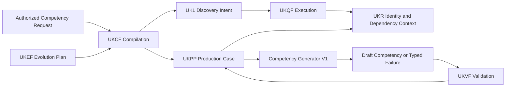
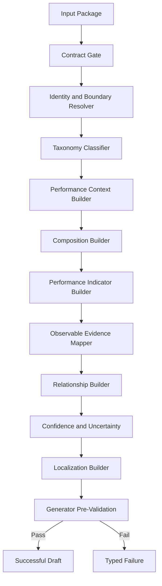
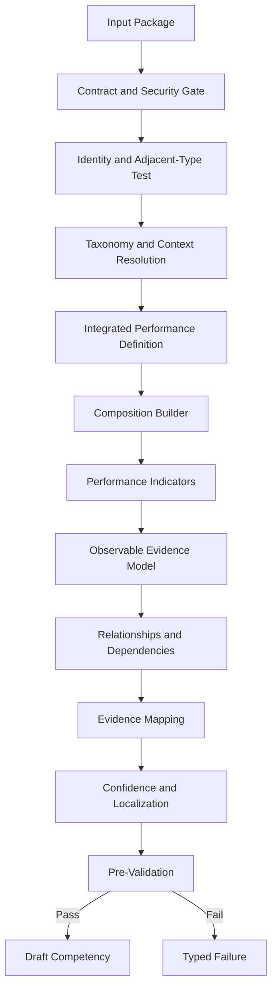
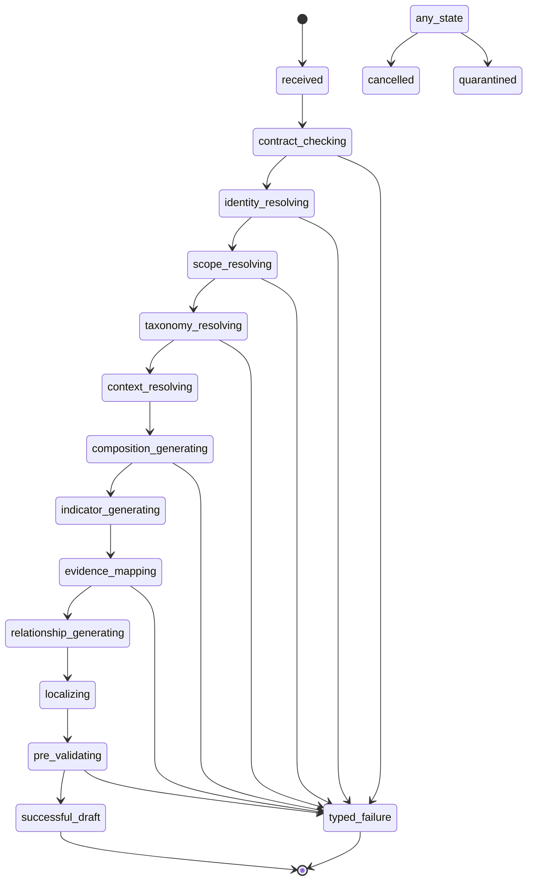
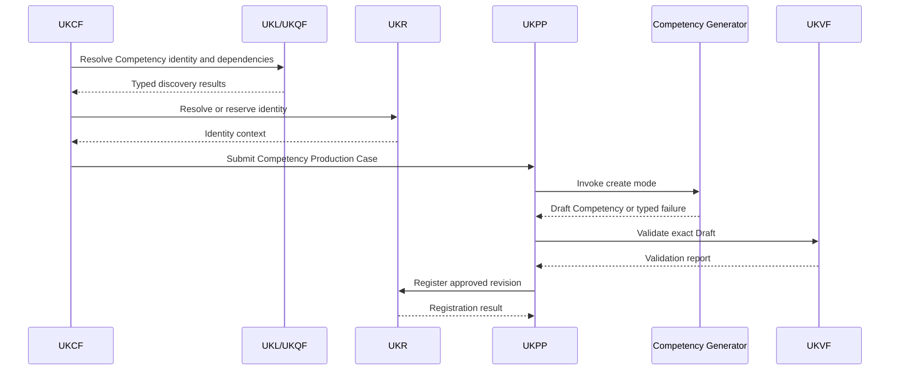
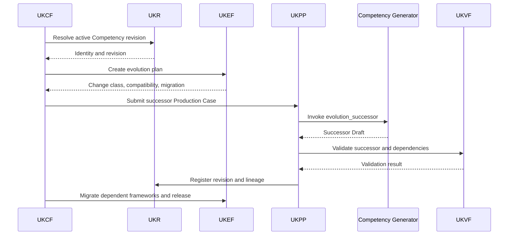
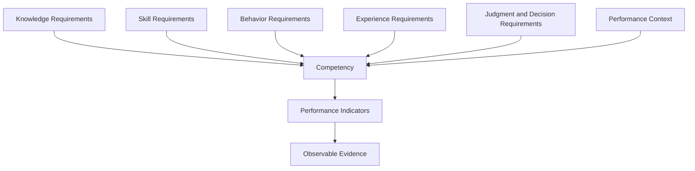
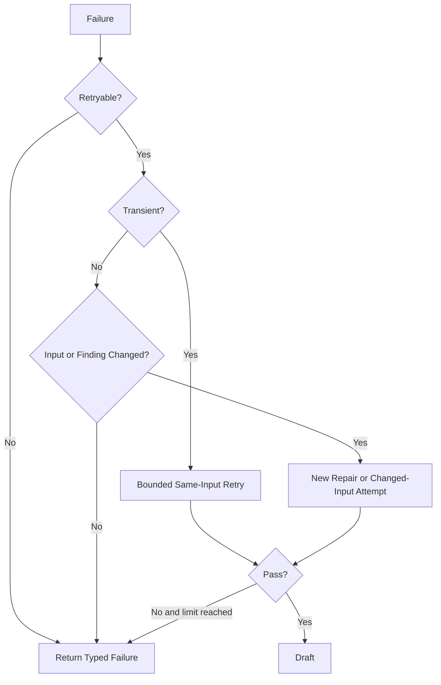

# Competency Generator V1

**Product:** KarirGPS  
**Document Type:** Production Entity Generator Specification  
**Generator Family:** Universal Entity Generator Framework implementation  
**Generator ID:** `generator:competency`  
**Entity Type:** Competency  
**Ontology Class:** `Competency`  
**Object Kind:** Entity Object  
**Generator Version:** 1.0.0  
**Specification Major Version:** V1  
**Status:** Normative Production Baseline  
**Certification Target:** Production Certified  
**UEGF Baseline:** 1.0  
**Generator Development Standard:** 1.0.0  
**Target Path:** `assets/knowledge/generators/competency/Competency_Generator_V1.md`  
**Governance Owner:** Knowledge Generator Architecture  
**Domain Steward:** Competency and Performance Ontology Steward  

**Authoritative Dependencies**

- AI Constitution
- Career Knowledge Ontology
- Knowledge Object Specification
- Universal Entity Generator Framework
- Universal Knowledge Production Pipeline
- Universal Knowledge Validation Framework
- Universal Knowledge Registry Framework
- Universal Knowledge Language Framework
- Universal Knowledge Query Framework
- Universal Knowledge Evolution Framework
- Universal Knowledge Compilation Framework
- Generator Development Standard V1
- Career Generator V1
- Skill Generator V1

---

## 0. Normative Status, Inheritance, and Generator Boundary

### 0.1 Status

Competency Generator V1, hereafter **Competency Generator**, is the production-ready UEGF-derived Entity Generator for the Ontology class `Competency`.

It defines only Competency-specific generation behavior.

It inherits universal safety, semantic, object, production, validation, Registry, query, evolution, compilation, engineering, security, and audit requirements from the authoritative architecture.

### 0.2 Competency Definition

A Competency is the demonstrated ability to perform consistently in a defined context through the integration of:

- knowledge;
- Skills;
- behaviors;
- relevant experience;
- judgment;
- performance expectations;
- observable evidence.

A Competency is not a synonym for Skill.

A Skill is a capability to perform an activity or produce an outcome.

A Competency requires integrated and context-appropriate application of multiple components against observable performance expectations.

### 0.3 Authority Precedence

When requirements conflict, apply this order:

1. applicable law, privacy, safety, licensing, and binding rights restrictions;
2. AI Constitution;
3. Career Knowledge Ontology;
4. Knowledge Object Specification;
5. Universal Entity Generator Framework;
6. Universal Knowledge Production Pipeline;
7. Universal Knowledge Validation Framework;
8. Universal Knowledge Registry Framework;
9. Universal Knowledge Language Framework;
10. Universal Knowledge Query Framework;
11. Universal Knowledge Evolution Framework;
12. Universal Knowledge Compilation Framework;
13. Generator Development Standard V1;
14. Competency Generator V1;
15. approved Competency prompt asset;
16. execution-specific request.

Competency Generator may specialize inherited rules but MUST NOT weaken, replace, or duplicate them.

### 0.4 Normative Terms

- **MUST** indicates a mandatory requirement.
- **MUST NOT** indicates a prohibited condition.
- **SHOULD** indicates a requirement that may be waived only through governed justification.
- **MAY** indicates an allowed option.
- **CONDITIONAL** indicates a requirement activated by a defined condition.

### 0.5 Generator Authority

Competency Generator may:

- validate an authorized Competency Generator Input Package;
- generate one Draft Competency Entity Object;
- define Competency composition using supplied Knowledge Domain, Skill, Behavior, Experience, and performance references;
- generate proposed Competency relationships;
- map claims and performance indicators to supplied Evidence IDs;
- identify unresolved identity, taxonomy, composition, context, evidence, and dependency issues;
- propose aliases and localized competency terminology;
- produce a deterministic Generator Pre-Validation Report;
- emit one typed failure when a safe Draft cannot be produced.

Competency Generator may not:

- create or approve canonical identifiers;
- query storage, graphs, search indexes, vector stores, or public networks directly;
- generate dependent Skill, Knowledge Domain, Behavior, Assessment, Certification, Learning Resource, Career, or Experience Objects;
- evaluate a person or assign a person a competency level;
- define universal competency requirements for all Careers;
- equate credential ownership with demonstrated competency;
- create an Assessment instrument;
- validate or publish its own Draft;
- merge or split identities;
- evolve a published Competency without a UKEF Evolution Plan;
- invent an Ontology category, relationship, proficiency framework, or performance standard;
- use model memory as evidence.

### 0.6 Competency Generator Invariants

Every successful result MUST satisfy all of the following:

1. exactly one primary Competency semantic identity;
2. object kind is `entity_object`;
3. entity type is `Competency` or an Ontology-approved Competency subtype;
4. lifecycle state is `Draft`;
5. identity context is supplied by UKR through UKCF or UKPP;
6. the Competency has a defined performance context;
7. the Competency has an integrated composition model;
8. the Competency is distinguishable from one Skill, a Skill list, a Knowledge Domain, a Career, a role, a Certification, an Assessment, a behavior, a trait, or an experience record;
9. knowledge, Skill, behavior, experience, and performance components are represented by references or explicit absence rules;
10. performance indicators are observable and evidence-supported;
11. consistency expectations are contextual rather than universal;
12. person-specific assessment results are prohibited;
13. all material claims map to supplied Evidence IDs;
14. all relationships use Ontology-resolved predicates and typed target references;
15. unresolved mandatory dependencies remain explicit and block readiness;
16. taxonomy categories are applied only under defined rules;
17. current organizational frameworks are contextualized and time-scoped where necessary;
18. unknown information remains unknown;
19. no evidence, source, relationship, identifier, or fact is fabricated;
20. one invocation returns one successful Draft or one typed failure;
21. no output claims UKVF approval, UKR registration, UKPP publication, or UKEF completion;
22. output structure is deterministic under the same input and contract lock;
23. the generation is auditable without private chain of thought.

### 0.7 Entity Extension Pack Completeness

Competency Generator implements all mandatory UEGF Entity Extension Pack elements:

1. Entity Descriptor
2. Identity Rules
3. Adjacent Entity Matrix
4. Scope Rules
5. Stable Core Definition
6. Contextual Externalization Rules
7. Mandatory Domain Fields
8. Optional Domain Fields
9. Forbidden Intrinsic Fields
10. Evidence Categories
11. Source Preference Rules
12. Recency and Volatility Rules
13. Mandatory Relationships
14. Recommended Relationships
15. Forbidden Relationships
16. Domain Output Modules
17. Domain Validation Rules
18. Domain Confidence Rules
19. Domain Failure Types
20. Forbidden Behaviors
21. Quality Rules
22. Naming and Localization
23. Acceptance Delta
24. Future Compatibility
25. Governance Owner
26. Version and Change Record

---

# 1. Purpose

## 1.1 Primary Purpose

Competency Generator produces one structured Draft Competency Entity Object representing demonstrated and consistent performance in a defined context through integrated application of knowledge, Skills, behaviors, experience, and performance expectations.

## 1.2 Production Purpose

It standardizes Competency generation across:

- single-object production;
- UKCF recursive compilation;
- Career-package production;
- workforce-framework import;
- competency-library migration;
- evidence refresh;
- localization;
- repair;
- Draft revision;
- UKEF successor revision;
- distributed batch production.

## 1.3 Semantic Purpose

A generated Competency Object must answer:

- what performance capability the Competency represents;
- in which context performance occurs;
- what Knowledge Domains are required;
- what Skills are integrated;
- what behaviors are expected;
- what experience or exposure is relevant;
- what performance indicators demonstrate the Competency;
- what evidence can establish demonstrated performance;
- what level or progression model applies, if any;
- how the Competency relates to Careers, Skills, Assessments, Certifications, and Learning Resources;
- what is stable and what is context-dependent.

## 1.4 Operational Purpose

The result must be directly consumable by:

- UKPP as a generated Draft artifact;
- UKVF as an exact revision validation candidate;
- UKR registration preparation;
- Knowledge Graph projection preparation;
- UKL and UKQF retrieval, comparison, and traversal;
- UKEF successor workflows;
- UKCF multi-object orchestration;
- downstream Career, Assessment, Certification, and Learning Resource packages.

---

# 2. Scope

## 2.1 In Scope

Competency Generator supports one canonical Competency concept that:

- represents integrated demonstrated performance;
- has a defined context and outcome;
- combines two or more relevant component dimensions unless an authoritative framework explicitly defines otherwise;
- has observable performance indicators;
- can be evidenced, assessed, or verified;
- has a stable semantic core;
- participates in Career, Skill, Knowledge Domain, Assessment, Certification, Learning Resource, and hierarchy relationships.

## 2.2 Supported Competency Scope

Valid scope includes:

- core organizational or cross-role competencies;
- functional competencies;
- technical competencies;
- leadership competencies;
- behavioral competencies;
- digital competencies;
- AI competencies;
- regulated or professional competencies;
- domain-specific performance competencies;
- transferable competencies when context and composition remain stable.

## 2.3 Conditional Scope

A successor Draft for an existing Competency requires:

- exact Entity ID;
- exact Object ID;
- base Revision ID;
- authorized Change Request;
- UKEF Evolution Plan when the base is Active or Published;
- intended semantic version;
- compatibility class;
- affected dependencies;
- migration implications for Career, Assessment, Certification, and Learning Resource relationships.

## 2.4 Out of Scope

Competency Generator MUST NOT generate:

- Skill Objects;
- Knowledge Domain Objects;
- Behavior taxonomy Objects;
- Work Task Objects;
- Career Objects;
- Assessment instruments or results;
- Certification Objects;
- Learning Resource Objects;
- employee or user competency profiles;
- performance review records;
- job descriptions;
- organization-specific level assignments without contextual object treatment;
- salary or promotion decisions;
- personality traits;
- interests, values, or preferences;
- unverified experience claims.

## 2.5 Scope Boundary Tests

A candidate is a Competency only when all are true:

1. it expresses integrated performance, not isolated capability;
2. it has a defined context, outcome, or responsibility domain;
3. it contains observable performance expectations;
4. it can be supported by evidence of application;
5. it is distinguishable from one Skill, a body of knowledge, or one behavior;
6. it does not depend on one individual’s current result;
7. its identity remains meaningful beyond one assessment attempt.

---

# 3. Responsibilities

Competency Generator is responsible for:

1. validating the Competency-specific input contract;
2. interpreting UKR identity resolution;
3. applying Competency identity and boundary tests;
4. selecting Ontology-approved Competency classifications;
5. defining the performance context;
6. generating the integrated composition model;
7. linking required Knowledge Domain references;
8. linking required Skill references;
9. defining required behavioral manifestations;
10. representing relevant experience requirements contextually;
11. generating observable performance indicators;
12. defining evidence and verification expectations;
13. generating hierarchy and parent-child structure;
14. generating proposed relationships;
15. separating stable core semantics from organizational or contextual assertions;
16. mapping claims to Evidence IDs;
17. expressing confidence, conflict, and uncertainty;
18. generating localized terminology;
19. producing a pre-validation report;
20. returning a typed Draft or typed failure;
21. producing complete audit metadata.

---

# 4. Non-Responsibilities

Competency Generator is not responsible for:

- determining whether a person is competent;
- assigning a person a competency rating;
- defining employee performance consequences;
- deciding whether a Career universally requires a Competency;
- creating or administering Assessments;
- creating dependent entities;
- collecting evidence outside approved UKPP and UKQF workflows;
- defining universal Competency taxonomy outside the Ontology;
- registering identities or relationships;
- validating or publishing the Draft;
- executing merge, split, deprecation, or migration;
- creating learning curricula;
- deciding whether a Certification proves competence;
- forecasting workforce demand;
- producing hiring, promotion, or termination decisions;
- treating personality conformity as behavioral competence.

---

# 5. Supported Object Types and Generation Modes

## 5.1 Supported Object Type

Primary output:

- KOS `Entity Object`;
- Ontology class `Competency`;
- approved subtypes:
  - `Core Competency`;
  - `Functional Competency`;
  - `Technical Competency`;
  - `Leadership Competency`;
  - `Behavioral Competency`;
  - `Digital Competency`;
  - `AI Competency`;
  - future Ontology-approved Competency subtypes.

The generator MUST use exact registered subtype identifiers. Human-readable category names in this specification do not create new Ontology classes.

## 5.2 Supported Generation Modes

### `create`

Produces a new Draft Competency for a UKR-resolved or reserved identity.

### `revise`

Produces a successor Draft for a nonpublished Competency revision.

### `enrich`

Adds compatible evidence-backed composition, indicators, or relationships without changing identity.

### `localize`

Produces localized naming, definitions, behavioral language, and performance indicator wording bound to the same identity.

### `evidence_refresh`

Refreshes evidence, source status, confidence, and affected performance claims.

### `repair`

Produces a corrected Draft within exact UKVF finding scope.

### `evolution_successor`

Produces a successor Draft under an approved UKEF Evolution Plan.

## 5.3 Unsupported Modes

- direct publish;
- direct register;
- merge;
- split;
- delete;
- user_assessment;
- employee_rating;
- recommendation;
- assessment_generation;
- taxonomy_creation;
- unrestricted_free_generation.

## 5.4 Readiness Targets

A successful generator output may target:

- Draft readiness;
- UKVF submission readiness;
- human-review readiness;
- registration-preparation readiness.

It cannot claim approved registration or publication readiness.

---

# 6. Architecture and Framework Bindings

## 6.1 Architecture Diagram



Competency Generator operates only inside the UKPP invocation boundary.

## 6.2 Internal Component Diagram



## 6.3 Framework Binding Matrix

| Concern | Authority | Competency Generator Role |
|---|---|---|
| Safety, dignity, fairness | AI Constitution | Apply prohibitions and safeguards |
| Competency semantics and predicates | Ontology | Resolve and obey |
| Object structure | KOS | Produce compliant Draft |
| Generator kernel | UEGF | Implement Competency Extension Pack |
| Production lifecycle | UKPP | Execute only as invoked |
| Validation | UKVF | Prepare Draft and consume findings |
| Identity and registration | UKR | Use supplied identity context |
| Semantic intent | UKL | Consume compiler-produced query plans |
| Query execution | UKQF | Consume typed results |
| Published evolution | UKEF | Produce successor only under plan |
| Compilation | UKCF | Consume typed invocation plan |
| Engineering conventions | GDS V1 | Follow repository, schema, tests, and certification |
| Career semantics | Career Generator V1 | Preserve Career–Competency boundary |
| Skill semantics | Skill Generator V1 | Preserve Skill–Competency boundary |

## 6.4 UEGF Extension Pack Mapping

| Extension Point | Competency Generator Section |
|---|---|
| EP-01 Entity Descriptor | Sections 1, 2, 15 |
| EP-02 Identity Rules | Section 15 |
| EP-03 Scope Rules | Sections 2, 15, 17 |
| EP-04 Core Semantic Fields | Sections 10, 17–29 |
| EP-05 Evidence Rules | Section 31 |
| EP-06 Relationship Rules | Section 30 |
| EP-07 Output Contract | Section 10 |
| EP-08 Validation Rules | Section 35 |
| EP-09 Confidence Rules | Section 32 |
| EP-10 Forbidden Behaviors | Sections 4, 15, 44 |
| EP-11 Quality Rules | Section 42 |
| EP-12 Failure Rules | Sections 40–41 |
| EP-13 Naming and Localization | Sections 16, 38 |
| EP-14 Acceptance Delta | Sections 53–54 |
| EP-15 Future Compatibility | Section 39 |

---

# 7. Required Inputs

## 7.1 Mandatory Input Package

- Generator Request;
- Execution Context;
- Contract Lock;
- Identity Resolution;
- Competency Scope Resolution;
- Composition Manifest;
- Performance Context;
- Evidence Bundle;
- Existing Knowledge Package;
- Dependency Manifest;
- Prompt Binding;
- Security Context;
- Audit Context.

## 7.2 Generator Request

Required fields:

- request ID;
- Compilation ID;
- Production Case ID;
- generation mode;
- target label;
- proposed entity type;
- requested locale;
- desired readiness;
- request purpose.

## 7.3 Execution Context

- geography;
- jurisdiction;
- industry or functional context;
- organization context when applicable;
- role or Career context when applicable;
- effective date;
- locale;
- audience;
- release context;
- access profile;
- deadline;
- batch context;
- recursion depth.

## 7.4 Contract Lock

- AI Constitution version;
- Ontology version;
- KOS version;
- UEGF version;
- UKPP version;
- UKVF version;
- UKR version;
- UKL version;
- UKQF version;
- UKEF version;
- UKCF version;
- GDS version;
- Competency Generator version;
- prompt versions;
- schema versions.

## 7.5 Identity Resolution

- identity disposition;
- Entity ID or reservation reference;
- Object ID when existing;
- base Revision ID when applicable;
- exact-match candidates;
- alias candidates;
- duplicate-risk findings;
- merge or split indicators;
- identity confidence.

## 7.6 Competency Scope Resolution

- integrated performance statement;
- context;
- expected outcome;
- included responsibility;
- excluded responsibility;
- granularity;
- category candidates;
- adjacent entity candidates;
- proposed subtype;
- consistency expectation.

## 7.7 Composition Manifest

May contain:

- Knowledge Domain references;
- Skill references;
- Behavior references or controlled descriptors;
- Experience requirements;
- judgment or decision requirements;
- performance expectation references;
- Assessment references;
- Certification references;
- Learning Resource references.

## 7.8 Performance Context

- operating environment;
- stakeholder context;
- risk level;
- autonomy;
- complexity;
- scope;
- quality standards;
- constraints;
- accountability;
- frequency or consistency expectations.

## 7.9 Evidence Bundle

Every evidence entry provides:

- Evidence ID;
- Source ID;
- claim scope;
- source location;
- source class;
- quality;
- independence group;
- date;
- valid period;
- rights status;
- normalized proposition.

## 7.10 Existing Knowledge Package

When applicable:

- active or base Competency revision;
- historical revisions;
- aliases;
- composition;
- performance indicators;
- relationships;
- evidence lineage;
- validation findings;
- evolution constraints.

## 7.11 Dependency Manifest

May include references to:

- parent Competencies;
- subcompetencies;
- Knowledge Domains;
- Skills;
- behaviors or behavioral descriptors;
- Careers;
- Assessments;
- Certifications;
- Learning Resources;
- Work Tasks;
- Technologies;
- Industries;
- Education Programs;
- standards.

## 7.12 Prompt Binding

- system prompt ID;
- invocation prompt ID;
- prompt versions;
- allowed variables;
- output schema;
- model lane;
- model restrictions.

## 7.13 Conditional Inputs

### Localization

- target locale;
- source locale;
- terminology authority;
- behavioral-language equivalence;
- performance-standard equivalence;
- human-review requirement.

### Evolution

- Evolution Case ID;
- change classification;
- identity decision;
- semantic version target;
- compatibility;
- effective time;
- dependency impact.

### Repair

- prior attempt;
- exact UKVF findings;
- allowed field scope;
- repair attempt number.

### Regulated Competency

- jurisdiction;
- governing standard;
- effective period;
- licensing or certification context;
- mandatory human review.

### AI Competency

- AI Technology context;
- risk and governance evidence;
- version-sensitive evidence;
- review date;
- human oversight expectations.

---

# 8. Input Schema

## 8.1 Logical Input Schema

```yaml
schema_id: competency_generator_input_v1
generator:
  id: generator:competency
  version: 1.0.0
request:
  request_id: string
  compilation_id: string
  production_case_id: string
  mode: create | revise | enrich | localize | evidence_refresh | repair | evolution_successor
  purpose: string
  target_label: string
  requested_entity_type: Competency
  requested_subtype: core | functional | technical | leadership | behavioral | digital | ai | null
  target_locale: bcp47
  desired_readiness: draft | ukvf_submission | human_review
context:
  geography_ref: optional_typed_reference
  jurisdiction_ref: optional_typed_reference
  industry_ref: optional_typed_reference
  career_ref: optional_typed_reference
  organization_context_ref: optional_typed_reference
  effective_at: date_or_datetime
  security_profile: string
  recursion_depth: integer
contract_lock:
  constitution_version: string
  ontology_version: string
  kos_version: string
  uegf_version: string
  ukpp_version: string
  ukvf_version: string
  ukr_version: string
  ukl_version: string
  ukqf_version: string
  ukef_version: string
  ukcf_version: string
  gds_version: string
  generator_version: string
  input_schema_version: string
  output_schema_version: string
identity_resolution:
  disposition: exact_existing | reserved_new | ambiguous | merge_review | split_review | blocked
  entity_id: optional_reference
  reservation_ref: optional_reference
  object_id: optional_reference
  base_revision_id: optional_reference
  candidates: []
  confidence: confidence_level
scope_resolution:
  integrated_performance_candidate: string
  performance_context: {}
  expected_outcomes: []
  included_scope: []
  excluded_scope: []
  granularity: atomic | composite | broad
  category_candidates: []
  adjacent_entity_candidates: []
composition_manifest:
  knowledge_requirements: []
  skill_requirements: []
  behavior_requirements: []
  experience_requirements: []
  judgment_requirements: []
  performance_expectations: []
evidence_bundle:
  evidence_entries: []
existing_knowledge:
  base_object: optional_reference
  base_revision: optional_payload_reference
  composition: {}
  relationships: []
  validation_findings: []
dependency_manifest:
  mandatory: []
  optional: []
  unresolved: []
prompt_binding:
  system_prompt_id: string
  invocation_prompt_id: string
  output_schema_id: string
  model_lane: string
evolution_plan:
  evolution_case_id: optional_reference
  change_class: optional_string
  target_version: optional_semver
repair_context:
  prior_attempt_id: optional_string
  finding_refs: []
  allowed_fields: []
audit:
  actor_ref: typed_reference
  correlation_id: string
  causation_id: optional_string
```

## 8.2 Input Gate

The input gate MUST reject:

- missing contract versions;
- unsupported generation mode;
- wrong entity type;
- ambiguous identity without authorized handling;
- Published-base revision without UKEF plan;
- missing performance context;
- missing integrated performance statement;
- empty composition without authoritative exception;
- missing prompt binding;
- missing evidence for material generation;
- unresolved security context;
- repair request without exact findings;
- unsupported subtype;
- recursion depth above UKCF profile.

---

# 9. Required Outputs

## 9.1 Allowed Outcomes

Exactly one:

- `successful_draft`;
- `typed_failure`.

## 9.2 Successful Output

A successful result contains:

- generator metadata;
- target identity context;
- Draft Competency payload;
- composition manifest;
- evidence manifest;
- performance indicator manifest;
- observable evidence manifest;
- relationship manifest;
- dependency manifest;
- confidence and uncertainty summary;
- Generator Pre-Validation Report;
- audit metadata.

## 9.3 Typed Failure

A failure contains:

- stable Competency error code;
- failure category;
- severity;
- affected fields;
- retryability;
- remediation;
- evidence or dependency context;
- audit metadata.

## 9.4 Output Prohibitions

The output MUST NOT contain:

- approved canonical ID creation;
- UKVF `passed` claim;
- UKR `registered` claim;
- UKPP `published` claim;
- individual competency rating;
- employee performance conclusion;
- credential-as-proof claim;
- hidden dependent object payloads;
- unsupported source citation;
- undocumented fields.

---

# 10. Output Schema and Canonical Competency Contract

## 10.1 Output Envelope

```yaml
schema_id: competency_generator_output_v1
outcome: successful_draft
generator:
  id: generator:competency
  version: 1.0.0
  system_prompt_id: prompt:competency:system:1.0.0
  invocation_prompt_id: prompt:competency:create:1.0.0
  model_lane: qualified_lane_reference
target:
  object_kind: entity_object
  entity_type: Competency
  ontology_class_ref: ontology:Competency
  entity_id: resolved_or_reserved_reference
  object_id: optional_existing_reference
  base_revision_id: optional_reference
draft:
  lifecycle_state: Draft
  semantic_version: 1.0.0
  contract_and_identity: {}
  naming_and_localization: {}
  definition_and_scope: {}
  competency_core: {}
  taxonomy_and_hierarchy: {}
  composition: {}
  performance_context: {}
  performance_indicators: []
  observable_evidence: []
  lifecycle_and_context: {}
  relationships: []
  evidence_and_sources: {}
  confidence_conflict_uncertainty: {}
  governance_quality_readiness: {}
  generation_audit: {}
composition_manifest: {}
performance_indicator_manifest: []
observable_evidence_manifest: []
evidence_manifest: []
relationship_manifest: []
dependency_manifest: []
pre_validation:
  status: pass | pass_with_warnings
  findings: []
audit:
  input_fingerprint: string
  output_fingerprint: string
  generated_at: datetime
```

## 10.2 Canonical Section Order

The Competency Draft preserves the UEGF Universal Output Spine:

1. Contract and Identity
2. Naming and Localization
3. Definition and Scope
4. Competency Core Semantics
5. Taxonomy and Classification
6. Hierarchy and Granularity
7. Composition
8. Knowledge Requirements
9. Skill Requirements
10. Behavior Requirements
11. Experience Requirements
12. Performance Context
13. Performance Indicators
14. Observable Competency Evidence
15. Proficiency and Progression
16. Lifecycle and Context
17. Relationships
18. Dependencies
19. Evidence and Sources
20. Confidence, Conflict, and Uncertainty
21. Governance and Lifecycle
22. Quality and Readiness
23. Generation and Audit Record

## 10.3 Contract and Identity

Mandatory:

- schema version;
- Ontology version;
- KOS version;
- entity type;
- object kind;
- Entity ID or reservation;
- Object ID when applicable;
- base Revision ID when applicable;
- Draft lifecycle state;
- semantic version;
- generation mode.

## 10.4 Naming and Localization

Mandatory:

- canonical name;
- canonical locale;
- display name;
- aliases;
- localization status;
- disambiguation note.

## 10.5 Definition and Scope

Mandatory:

- concise definition;
- integrated performance statement;
- performance context;
- expected outcomes;
- included scope;
- excluded scope;
- competency boundary;
- granularity;
- adjacent-entity distinctions.

## 10.6 Competency Core

Mandatory:

- competency category references;
- integrated performance object;
- component summary;
- consistency expectation;
- accountability and context;
- verification scope;
- stability profile.

## 10.7 Taxonomy and Hierarchy

Conditional:

- parent Competency;
- subcompetencies;
- broader/narrower mapping;
- taxonomy mapping;
- subtype classification;
- rationale.

## 10.8 Composition

Mandatory:

- Knowledge requirements;
- Skill requirements;
- behavior requirements;
- experience requirements or explicit nonrequirement;
- judgment or decision requirements where applicable;
- performance expectation references;
- composition completeness status.

## 10.9 Performance Context

Mandatory:

- domain;
- responsibility scope;
- autonomy;
- complexity;
- stakeholder context;
- risk or impact;
- constraints;
- quality standard;
- consistency period or evidence rule.

## 10.10 Performance Indicators

Each indicator contains:

- indicator ID;
- observable action;
- expected result;
- quality criterion;
- context;
- evidence method;
- frequency or consistency expectation;
- evidence references;
- confidence.

## 10.11 Observable Evidence

- work product;
- direct observation;
- simulation;
- structured Assessment;
- verified outcome;
- portfolio artifact;
- supervisor or expert review under policy;
- Certification evidence as supporting, not conclusive;
- experience evidence as contextual, not sufficient alone.

## 10.12 Lifecycle and Context

Conditional:

- lifecycle status assertion;
- regulatory status;
- digital or AI context;
- framework version;
- review date;
- effective period.

## 10.13 Relationship Module

Proposed relationships only, with:

- predicate;
- target;
- direction;
- requirement or relevance level;
- context;
- evidence;
- confidence;
- status.

## 10.14 Evidence and Sources

- Claim-to-Evidence map;
- Source references;
- source quality;
- independence;
- recency;
- rights;
- conflicts.

## 10.15 Confidence and Uncertainty

- identity confidence;
- scope confidence;
- composition confidence;
- performance-indicator confidence;
- evidence confidence;
- relationship confidence;
- localization confidence;
- object confidence;
- conflicts;
- unknowns;
- assumptions.

## 10.16 Governance and Readiness

- generator pre-validation;
- unresolved dependencies;
- UKVF profiles;
- human-review triggers;
- readiness limitations.

## 10.17 Generation and Audit

- request and case IDs;
- prompt IDs;
- model lane;
- evidence fingerprint;
- dependency fingerprint;
- input/output fingerprints;
- timestamps;
- correlation and causation.

---

# 11. Generation Pipeline

## 11.1 Canonical Steps

1. Validate input envelope.
2. Verify contract lock.
3. Verify authorization and security context.
4. Interpret UKR identity disposition.
5. Apply Competency identity test.
6. Apply adjacent-entity exclusions.
7. Resolve taxonomy and subtype.
8. Define integrated performance and context.
9. Build Competency composition.
10. Build Knowledge requirements.
11. Build Skill requirements.
12. Build behavior requirements.
13. Build experience requirements.
14. Build performance indicators.
15. Build observable evidence expectations.
16. Build hierarchy and granularity.
17. Build lifecycle and digital/AI context.
18. Propose relationships.
19. Map every material claim to evidence.
20. Calculate scoped confidence.
21. Generate localization modules.
22. Run generator pre-validation.
23. Emit successful Draft or typed failure.

## 11.2 Pipeline Flowchart



## 11.3 Evidence-First Rule

The generator MUST construct performance claims from supplied evidence propositions and authoritative framework content.

## 11.4 Integration-First Rule

A Competency cannot be generated by renaming a Skill or concatenating component labels.

The generator must establish how components integrate to produce defined performance.

## 11.5 Context-First Rule

Performance context is mandatory.

A context-free “Competency” is either too broad, a Skill, or an incomplete framework label.

## 11.6 Stable-Core Rule

Current organizational level assignments, role-specific importance, market demand, salary, and current assessment results are externalized.

---

# 12. Generator State Machine

## 12.1 States

- `received`;
- `contract_checking`;
- `identity_resolving`;
- `scope_resolving`;
- `taxonomy_resolving`;
- `context_resolving`;
- `composition_generating`;
- `indicator_generating`;
- `evidence_mapping`;
- `relationship_generating`;
- `localizing`;
- `pre_validating`;
- `successful_draft`;
- `typed_failure`;
- `cancelled`;
- `quarantined`.

## 12.2 State Diagram



## 12.3 Terminal Outcomes

Only:

- successful Draft;
- typed failure;
- cancelled;
- quarantined.

---

# 13. Sequence Diagrams

## 13.1 New Competency Generation



## 13.2 Published Competency Successor



---

# 14. Prompt Templates

## 14.1 Prompt Asset Contract

Required prompt assets:

- `prompt:competency:system:1.0.0`;
- `prompt:competency:create:1.0.0`;
- `prompt:competency:revise:1.0.0`;
- `prompt:competency:enrich:1.0.0`;
- `prompt:competency:localize:1.0.0`;
- `prompt:competency:evidence_refresh:1.0.0`;
- `prompt:competency:repair:1.0.0`;
- `prompt:competency:evolution_successor:1.0.0`.

## 14.2 Normative System Template

```text
You are Competency Generator V1 for KarirGPS.

Generate exactly one Draft Competency Entity Object or one typed failure.

A Competency is demonstrated and consistent performance in a defined context
through integrated application of knowledge, Skills, behaviors, experience,
judgment, and performance expectations.

A Competency is not:
- one Skill;
- a list of Skills without integration;
- a Knowledge Domain;
- a Career or job role;
- a Certification;
- an Assessment;
- a behavior or personality trait;
- a person's current rating.

You MUST obey the supplied contract lock, identity resolution, Ontology terms,
KOS schema, composition manifest, performance context, evidence bundle,
dependency manifest, and generation mode.

Do not create canonical IDs.
Do not create dependent objects.
Do not retrieve external data.
Do not fabricate evidence, indicators, relationships, or aliases.
Do not claim validation, registration, publication, or personal competence.
Do not expose private chain of thought.

Every material claim and performance indicator must reference supplied Evidence IDs.
All relationships must use supplied Ontology predicates and typed targets.
Credential ownership may support evidence but cannot independently prove competence.

Return only the declared output schema.
```

## 14.3 Create Template

```text
MODE: create

GENERATOR_REQUEST:
{{generator_request}}

CONTRACT_LOCK:
{{contract_lock}}

IDENTITY_RESOLUTION:
{{identity_resolution}}

COMPETENCY_SCOPE:
{{scope_resolution}}

COMPOSITION_MANIFEST:
{{composition_manifest}}

PERFORMANCE_CONTEXT:
{{performance_context}}

EVIDENCE_BUNDLE:
{{evidence_bundle}}

DEPENDENCY_MANIFEST:
{{dependency_manifest}}

TASK:
Produce one Draft Competency Object.
Apply identity, taxonomy, context, composition, indicator, evidence,
relationship, localization, confidence, and pre-validation rules.
Return a typed failure if a non-waivable condition fails.
```

## 14.4 Revise Template

```text
MODE: revise

BASE_OBJECT:
{{base_object}}

AUTHORIZED_CHANGE_REQUEST:
{{change_request}}

VALIDATION_CONTEXT:
{{validation_context}}

Update only authorized fields.
Preserve Entity ID and Object ID.
Do not alter published knowledge without a UKEF Evolution Plan.
```

## 14.5 Enrich Template

```text
MODE: enrich

BASE_OBJECT:
{{base_object}}

NEW_EVIDENCE:
{{evidence_bundle}}

ENRICHMENT_SCOPE:
{{allowed_fields}}

Add only backward-compatible, evidence-supported composition,
performance indicators, or relationships.
Do not broaden the Competency identity silently.
```

## 14.6 Localize Template

```text
MODE: localize

SOURCE_COMPETENCY:
{{source_competency}}

TARGET_LOCALE:
{{target_locale}}

TERMINOLOGY_AUTHORITY:
{{terminology_authority}}

Generate localized labels, definition, behavior wording, and performance indicators.
Preserve identity and component semantics.
Flag non-equivalent terminology or culturally invalid behavior wording.
```

## 14.7 Evidence Refresh Template

```text
MODE: evidence_refresh

BASE_OBJECT:
{{base_object}}

CURRENT_EVIDENCE:
{{current_evidence}}

NEW_EVIDENCE:
{{new_evidence}}

Recalculate evidence coverage, confidence, conflict, indicator support,
and affected relationships. Do not change unsupported semantic fields.
```

## 14.8 Repair Template

```text
MODE: repair

PRIOR_ATTEMPT:
{{prior_attempt}}

UKVF_FINDINGS:
{{finding_refs}}

ALLOWED_REPAIR_SCOPE:
{{allowed_fields}}

Repair only cited findings.
Preserve unaffected identity, composition, and indicators.
Return typed failure if repair requires broader semantic change.
```

## 14.9 Evolution Successor Template

```text
MODE: evolution_successor

BASE_REVISION:
{{base_revision}}

UKEF_EVOLUTION_PLAN:
{{evolution_plan}}

DEPENDENCY_IMPACT:
{{dependency_impact}}

Produce one successor Draft within the approved identity decision,
change class, target semantic version, effective time, and compatibility.
Do not execute merge, split, registration, migration, or release.
```

---

# 15. Competency Identity and Scope Rules

## 15.1 Positive Identity Test

A Competency identity is valid when:

- it represents one coherent integrated performance capability;
- it has a stable purpose and performance outcome;
- it has a defined application context;
- it requires integrated component use;
- it has observable indicators;
- it can be distinguished from adjacent entities;
- aliases point to the same performance construct.

## 15.2 Adjacent Entity Matrix

| Candidate | Competency? | Rule |
|---|---:|---|
| Project Management Competency | Yes | Integrated project performance, not only planning Skill |
| Project Management | Ambiguous | May be Skill, Competency, Knowledge Domain, or function |
| Python Programming | Usually no | Skill unless integrated performance framework is defined |
| Software Engineering Competency | Yes | Integrates technical Skills, knowledge, behaviors, quality expectations, and experience |
| Leadership | Ambiguous | May be Skill, Competency, behavior cluster, or role expectation |
| Strategic Thinking | Usually Skill or Competency | Competency only when contextual integrated performance and indicators exist |
| PMP | No | Certification |
| Annual Performance Rating | No | Assessment result |
| Five years of experience | No | Experience requirement, not Competency |
| Collaboration behavior | No alone | Behavior component unless integrated competency construct |
| Communication Competency | Yes | Must integrate Skills, behavior, context, and performance indicators |
| BIM Coordination Competency | Yes | Integrates BIM Skills, domain knowledge, coordination behaviors, experience, and deliverables |

## 15.3 Competency Name Rule

The canonical name SHOULD identify the integrated performance domain.

Where a common label is ambiguous, use `Competency` in the canonical name when necessary for disambiguation.

## 15.4 Granularity

### Atomic Competency

A tightly bounded integrated performance capability.

### Composite Competency

A coherent combination of subcompetencies.

### Broad Competency

A high-level construct requiring subcompetencies and explicit context for precise use.

## 15.5 Scope Inflation Control

Do not combine unrelated Skills and behaviors under a broad label without a common performance outcome.

## 15.6 Scope Fragmentation Control

Do not create separate identities for:

- proficiency levels;
- organizational departments;
- locale variants;
- one assessment method;
- one Technology version;
- one Career relationship.

## 15.7 Competency Versus Skill Decision

Use Competency when:

- multiple dimensions integrate;
- consistent application matters;
- context and performance expectations are essential;
- observable evidence extends beyond isolated task execution.

Use Skill when:

- one capability can be defined independently;
- integration and broader accountability are not required.

## 15.8 Identity Confidence Factors

- same integrated performance outcome;
- same component composition;
- same context boundary;
- same performance indicators;
- same hierarchy position;
- same external framework mapping;
- evidence agreement;
- alias authority.

---

# 16. Naming and Localization Strategy

## 16.1 Canonical Name

The canonical name must:

- identify the performance construct;
- avoid employee-grade labels;
- avoid organization-specific jargon when universal semantics exist;
- avoid Certification names;
- avoid level suffixes;
- avoid aspirational marketing terms.

## 16.2 Preferred Names

- Project Management Competency
- Software Engineering Competency
- Construction Management Competency
- BIM Coordination Competency
- AI Productivity Competency

## 16.3 Names Requiring Disambiguation

- Leadership
- Communication
- Sales
- Strategic Thinking
- Financial Analysis

The definition must determine whether the object is a Skill or Competency.

## 16.4 Alias Types

- exact alias;
- framework label;
- abbreviation;
- localized label;
- historical label;
- organization-specific alias;
- deprecated label;
- close but nonexact term.

Organization-specific aliases require context and do not become universal exact aliases automatically.

## 16.5 Localization

Localization may adapt:

- name;
- definition;
- behavior descriptions;
- performance indicators;
- role terminology;
- evidence terminology;
- disambiguation.

It must preserve integrated performance meaning.

---

# 17. Competency Core Generation Rules

## 17.1 Mandatory Domain Fields

- `integrated_performance`;
- `performance_context`;
- `composition`;
- `performance_indicators`;
- `observable_evidence`;
- `competency_boundary`.

## 17.2 Optional Domain Fields

- parent Competency;
- subcompetencies;
- proficiency or progression framework;
- regulatory standard;
- transferability;
- role scope;
- risk profile;
- decision authority;
- digital context;
- AI context;
- lifecycle status.

## 17.3 Forbidden Intrinsic Fields

- person rating;
- employee outcome;
- universal Career requirement;
- salary impact;
- promotion threshold;
- one organization’s grade as universal level;
- Certification ownership as proof;
- years of experience as proof;
- personality trait;
- current demand;
- guaranteed result.

## 17.4 Integrated Performance

Must identify:

- responsibility or challenge;
- integrated action;
- context;
- expected outcome;
- quality or performance standard;
- consistency expectation.

## 17.5 Expected Outcome

The outcome must be observable or verifiable.

Avoid abstract claims such as “is excellent at leadership.”

## 17.6 Competency Boundary

Must state:

- included performance responsibilities;
- excluded adjacent Skills, Tasks, or Careers;
- context limitations;
- component dependencies;
- relationship to external frameworks.

---

# 18. Competency Taxonomy

## 18.1 Multi-Axis Taxonomy

Competency classification may use separate axes:

1. organizational scope;
2. function or domain;
3. technicality;
4. behavioral orientation;
5. leadership scope;
6. digital context;
7. AI context;
8. transferability;
9. regulatory status;
10. granularity.

A Competency may be technical and functional, or leadership and behavioral.

The generator MUST NOT force categories into one mutually exclusive axis unless the Ontology requires it.

## 18.2 Taxonomy Evidence

Classification requires:

- Ontology rule;
- authoritative competency framework;
- professional standard;
- validated organizational mapping;
- evidence-supported rationale.

## 18.3 External Framework Mapping

External competency framework terms use mappings:

- exact;
- broader;
- narrower;
- related;
- split;
- merged;
- no mapping.

External framework codes do not replace UKR identity.

## 18.4 Taxonomy Conflict

Conflicting classifications are retained with:

- context;
- source;
- mapping type;
- confidence;
- human-review trigger where material.

---

# 19. Core Competency

## 19.1 Definition

A Core Competency is broadly expected across a defined organization, institution, professional community, or population context.

## 19.2 Context Requirement

“Core” is not universally intrinsic.

It requires a context reference such as:

- organization;
- profession;
- program;
- public service;
- occupational family.

## 19.3 Stable Identity

The stable Competency identity may exist independently of one organization.

The `core_for` relationship or contextual assertion records organizational applicability.

## 19.4 Prohibition

Do not store one company’s universal employee requirement as an intrinsic global property of the Competency.

---

# 20. Functional Competency

## 20.1 Definition

A Functional Competency represents integrated performance within a business, operational, or professional function.

## 20.2 Required Context

- function;
- responsibility;
- processes;
- expected outcomes;
- stakeholder interface;
- quality criteria.

## 20.3 Examples

- Sales Competency;
- Financial Analysis Competency;
- Project Management Competency;
- Construction Management Competency.

## 20.4 Boundary

A functional Competency is broader than one Skill and narrower than an entire Career identity.

---

# 21. Technical Competency

## 21.1 Definition

A Technical Competency integrates technical Knowledge, Skills, Tool or Technology use, judgment, quality standards, and evidence of performance.

## 21.2 Required Components

Normally:

- Knowledge Domain;
- multiple technical Skills;
- applicable standards;
- Tool or Technology relationships;
- quality criteria;
- observable work products.

## 21.3 Examples

- Software Engineering Competency;
- BIM Coordination Competency;
- Financial Analysis Competency when framed technically.

## 21.4 Tool Boundary

Tool use alone is a Skill.

Competency requires appropriate technical application, judgment, outcomes, and consistency.

---

# 22. Leadership Competency

## 22.1 Definition

A Leadership Competency represents integrated performance that influences direction, coordination, decision-making, accountability, development, or change in a defined context.

## 22.2 Required Components

May include:

- strategic Knowledge;
- communication Skills;
- decision Skills;
- behavior expectations;
- experience context;
- stakeholder impact;
- ethical and governance constraints;
- measurable outcomes.

## 22.3 Trait Prohibition

Leadership Competency MUST NOT be defined as charisma, extroversion, dominance, or personality conformity.

## 22.4 Position Prohibition

Holding a leadership title does not prove Leadership Competency.

---

# 23. Behavioral Competency

## 23.1 Definition

A Behavioral Competency integrates observable behavior patterns with Skills, Knowledge, context, and performance outcomes.

## 23.2 Behavior Requirements

Behavior descriptors must be:

- observable;
- context-specific;
- non-discriminatory;
- tied to performance;
- free from protected-class stereotypes;
- distinct from personality traits.

## 23.3 Examples

- Communication Competency;
- Negotiation-related Competency;
- Collaboration Competency;
- Customer Engagement Competency.

## 23.4 Cultural Context

Behavior manifestation may vary across cultures and environments.

Localization must preserve performance purpose without requiring one cultural style.

---

# 24. Digital Competency

## 24.1 Definition

A Digital Competency integrates digital Knowledge, Skills, behaviors, judgment, safety, and effective performance in a defined digital context.

## 24.2 Components

May include:

- digital literacy;
- data handling;
- Tool use;
- information evaluation;
- security and privacy;
- collaboration;
- digital content production;
- problem solving;
- governance.

## 24.3 Version Sensitivity

Digital Competencies may be:

- stable at the conceptual level;
- version-sensitive in Tool or Technology relationships;
- subject to periodic evidence refresh.

## 24.4 Tool Proficiency Boundary

Proficiency in one Tool may be a Skill, not the entire Digital Competency.

---

# 25. AI Competency

## 25.1 Definition

An AI Competency integrates Knowledge, Skills, behaviors, judgment, risk awareness, human oversight, and performance expectations for responsible and effective work involving AI systems.

## 25.2 AI Competency Components

May include:

- AI system understanding;
- instruction or interaction Skills;
- output evaluation;
- data and privacy awareness;
- risk identification;
- workflow redesign;
- human oversight;
- accountability;
- domain application;
- measurement of outcomes.

## 25.3 AI Productivity Competency

AI Productivity Competency is not mere Tool use.

It requires evidence of:

- appropriate task selection;
- effective AI interaction;
- output verification;
- risk handling;
- integration into workflow;
- measurable quality or efficiency outcome;
- preservation of human accountability.

## 25.4 Version and Context

AI Competency claims require:

- AI Technology context;
- effective date;
- risk profile;
- review date;
- uncertainty.

## 25.5 Automation Prohibition

The generator MUST NOT claim that AI Competency guarantees productivity or employment advantage.

---

# 26. Competency Hierarchy

## 26.1 Parent–Child Rule

A parent Competency contains the performance scope of a child or organizes a coherent competency family.

## 26.2 Subcompetency Rule

A subcompetency must:

- have distinct integrated performance;
- be meaningfully narrower;
- have its own composition and indicators;
- not be only a level.

## 26.3 Broad Competency

A broad Competency used for assessment or recommendation must identify relevant subcompetencies.

## 26.4 Polyhierarchy

A Competency may have multiple parents when different frameworks provide valid contextual hierarchy.

Mappings must retain source context.

## 26.5 Cycle Prevention

No:

- self-parent;
- direct cycle;
- indirect cycle;
- broader/narrower contradiction.

## 26.6 Competency Framework Group

A framework group or library is not necessarily a parent Competency.

---

# 27. Competency Composition

## 27.1 Composition Principle

Composition defines how components combine to produce integrated performance.

It is not a bag of references.

## 27.2 Composition Model



## 27.3 Component Requirement Levels

- mandatory;
- commonly_required;
- beneficial;
- context_specific;
- alternative_path;
- not_applicable.

## 27.4 Composition Completeness

A successful Draft must have:

- at least one Skill requirement;
- at least one Knowledge or context requirement;
- at least one performance indicator;
- observable evidence method;
- behavior or judgment component when relevant.

An authoritative external framework may define a different minimum, but the exception must be explicit and evidenced.

## 27.5 Component Interaction

The Draft should explain how components interact.

Example:

Project planning Knowledge and scheduling Skills are applied with stakeholder communication behaviors and judgment under cost, time, and risk constraints.

## 27.6 Alternative Composition

Alternative pathways may exist.

Do not claim one universal experience or Certification pathway if equivalent evidence can demonstrate competence.

---

# 28. Knowledge, Skill, Behavior, and Experience Requirements

## 28.1 Knowledge Requirements

Knowledge requirements reference Knowledge Domain entities and identify:

- scope;
- depth when contextual framework exists;
- application purpose;
- evidence;
- requirement level.

Knowledge is necessary but not sufficient for Competency.

## 28.2 Skill Requirements

Skill requirements reference canonical Skill entities and identify:

- requirement level;
- context;
- integration role;
- evidence;
- required proficiency framework when applicable.

The Competency Generator does not redefine Skill semantics.

## 28.3 Behavior Requirements

Behavior requirements identify observable ways of acting that contribute to performance.

They must be:

- non-trait;
- non-discriminatory;
- performance-linked;
- context-sensitive;
- assessable.

## 28.4 Experience Requirements

Experience may be represented as:

- exposure to defined complexity;
- repeated application;
- participation in defined responsibilities;
- supervised practice;
- independent practice;
- evidence portfolio.

Years alone are insufficient unless an external regulated standard explicitly requires them.

## 28.5 Experience as Evidence

Experience supports opportunity to demonstrate Competency.

It does not prove performance without observable evidence.

## 28.6 Judgment Requirements

Judgment includes:

- choosing among alternatives;
- managing uncertainty;
- balancing constraints;
- escalating risk;
- applying standards;
- adapting to context.

## 28.7 Composition Conflict

When sources disagree on component requirements:

- retain contextual variants;
- identify authoritative scope;
- lower confidence;
- trigger human review where material.

---

# 29. Performance Indicators and Observable Competency Evidence

## 29.1 Performance Indicator Rule

Each indicator must contain:

1. observable action;
2. object or responsibility;
3. expected result;
4. quality criterion;
5. context;
6. evidence method.

## 29.2 Indicator Quality

Indicators must be:

- specific enough to assess;
- not tied to one assessment provider;
- not personality judgments;
- not guaranteed outcomes;
- measurable or reviewable;
- proportionate to context.

## 29.3 Indicator Examples

Good:

- Produces a dependency-aware project schedule and updates it using verified progress data.
- Reviews AI-generated work for factual, privacy, and task-fit risks before release.
- Coordinates BIM model issues across disciplines and records resolution decisions.

Bad:

- Is a great leader.
- Has excellent communication.
- Always succeeds in projects.
- Holds a relevant certificate.

## 29.4 Consistency

Consistency may be demonstrated through:

- repeated outputs;
- multiple contexts;
- time-bounded observation;
- independent review;
- sustained responsibility.

The generator must not invent a universal duration.

## 29.5 Observable Evidence Types

- authenticated work product;
- structured observation;
- simulation result;
- Assessment result;
- verified project outcome;
- portfolio artifact;
- issue or decision record;
- quality review;
- audit record;
- Certification evidence as supporting evidence;
- Learning Resource completion as developmental evidence, not proof.

## 29.6 Evidence Sufficiency

No single evidence type is universally sufficient.

The Competency Object defines acceptable evidence categories, not an individual determination.

## 29.7 Assessment Relationship

Assessment relationships identify instruments or processes designed to evaluate the Competency.

The generator does not create assessment items or scoring rules.

---

# 30. Competency Relationships

## 30.1 Career Relationships

Allowed examples:

- `required_by` Career;
- `supports` Career;
- `core_for` Career Family;
- `differentiates` advanced Career scope;
- `developed_in` Career pathway.

Requirement level must be contextual and evidence-supported.

## 30.2 Skill Relationships

Allowed examples:

- `integrates_skill`;
- `requires_skill`;
- `demonstrated_through` Skill application;
- `has_subskill_component`.

The Competency must not duplicate Skill payloads.

## 30.3 Knowledge Domain Relationships

Allowed:

- `requires_knowledge`;
- `applies_knowledge_domain`;
- `grounded_in`.

## 30.4 Assessment Relationships

Allowed:

- `assessed_by`;
- `evidenced_by`;
- `partially_assessed_by`.

An Assessment may cover only part of a Competency.

## 30.5 Certification Relationships

Allowed:

- `recognized_by`;
- `partially_validated_by`;
- `aligned_with`;
- `required_for` in regulated context.

Certification MUST NOT imply demonstrated Competency without supporting evidence and applicable framework rules.

## 30.6 Learning Resource Relationships

Allowed:

- `developed_by`;
- `supported_by`;
- `practiced_through`.

Course completion does not prove Competency.

## 30.7 Technology Relationships

Digital and AI Competencies may:

- `uses`;
- `governs_use_of`;
- `applies_to`;
- `version_sensitive_to`.

## 30.8 Relationship Entry Schema

```yaml
relationship_id: null
predicate_ref: ontology:integrates_skill
source_ref:
  entity_id: entity:competency:project_management
target_ref:
  entity_id: entity:skill:project_planning
direction: outgoing
status: proposed
requirement_level: mandatory
context:
  industry_ref: null
  geography_ref: null
  valid_from: 2026-01-01
  valid_to: null
evidence_refs:
  - evidence:competency_framework:project_management
confidence: high
generator_notes:
  unresolved_constraints: []
```

## 30.9 Forbidden Relationships

- Competency `is_a` Skill;
- Competency `is_a` Certification;
- Competency `is_a` Career;
- Certification `proves` Competency universally;
- years of experience `proves` Competency;
- personality trait `is_component_of` Competency;
- Learning Resource completion `confirms` Competency;
- unsupported exact equivalence;
- cyclic hierarchy.

---

# 31. Evidence Requirements

## 31.1 Material Claim Categories

Evidence is required for:

- definition and integrated performance;
- context;
- category and subtype;
- component composition;
- performance indicators;
- experience requirements;
- observable evidence methods;
- hierarchy;
- Career relationships;
- Skill relationships;
- Knowledge Domain relationships;
- Assessment relationships;
- Certification relationships;
- Learning Resource relationships;
- digital or AI context;
- regulated status;
- external framework mapping.

## 31.2 Source Preference

Preferred order:

1. official competency standards or professional frameworks;
2. regulatory or licensing bodies;
3. recognized occupational standards;
4. professional associations;
5. peer-reviewed competency research;
6. established organizational frameworks with documented methodology;
7. Assessment validity documentation;
8. Certification blueprints;
9. reputable educational frameworks;
10. secondary sources for discovery only unless verified.

## 31.3 Evidence Threshold

At minimum:

- one authoritative source for identity and definition;
- evidence for each mandatory component;
- evidence for every performance indicator;
- two independent sources for broad transferable claims where feasible;
- official source for regulated or Certification relationships;
- version-specific evidence for digital and AI Competencies.

## 31.4 Framework Bias Control

One organization’s framework does not automatically establish universal competency semantics.

The generator must distinguish:

- universal stable core;
- framework-specific composition;
- organization-specific level;
- contextual performance expectations.

## 31.5 Recency

- stable professional Competencies: review when standards change;
- technical and digital Competencies: review with Technology and standards;
- AI Competencies: time-bounded review;
- regulated Competencies: jurisdiction and effective date;
- behavioral Competencies: cultural and evidence review.

## 31.6 Conflict

Conflicting composition or indicators must produce:

- competing variants;
- context;
- source authority comparison;
- confidence adjustment;
- human-review trigger where material.

## 31.7 Missing Evidence Vocabulary

- `unknown`;
- `insufficient_evidence`;
- `not_applicable`;
- `disputed`;
- `context_required`;
- `framework_specific`;
- `not_yet_registered`.

## 31.8 Rights

All evidence must have permitted use and citation status.

---

# 32. Claim, Confidence, Conflict, and Uncertainty Rules

## 32.1 Claim Classes

- stable intrinsic;
- compositional;
- contextual;
- performance;
- hierarchy;
- relationship;
- temporal;
- regulatory;
- digital;
- AI-related;
- disputed;
- inferred proposal.

## 32.2 Confidence Dimensions

- identity;
- scope;
- taxonomy;
- composition;
- component completeness;
- performance indicators;
- observable evidence;
- relationships;
- lifecycle;
- localization;
- object-level.

## 32.3 Confidence Vocabulary

Use the registered UEGF confidence vocabulary.

No custom scale may be invented.

## 32.4 Confidence Ceiling

Object confidence cannot exceed the weakest critical dimension:

- identity;
- integrated performance boundary;
- composition;
- indicator evidence;
- mandatory relationship integrity.

## 32.5 Conflict Adjustment

Material unresolved conflict lowers confidence and may block readiness.

## 32.6 Assumptions

Assumptions must be:

- explicit;
- scoped;
- noncanonical;
- excluded from verified facts;
- reviewed.

## 32.7 Forbidden Interpretations

Confidence is not:

- individual rating;
- Assessment score;
- Certification status;
- popularity;
- Career importance;
- validation outcome;
- probability of promotion.

---

# 33. Dependency Handling

## 33.1 Mandatory Dependencies

- identity resolution;
- Ontology class and predicates;
- KOS contract;
- performance context;
- composition manifest;
- evidence for core performance;
- prompt binding;
- UKVF profile;
- security context;
- audit context.

## 33.2 Conditional Dependencies

- parent Competency;
- subcompetency;
- Knowledge Domain;
- Skill;
- Behavior reference;
- Career;
- Assessment;
- Certification;
- Learning Resource;
- Technology;
- UKEF plan;
- localization authority;
- regulated standard.

## 33.3 Optional Dependencies

- external framework mapping;
- Work Task;
- Industry;
- Education Program;
- Project evidence type;
- Tool.

## 33.4 Dependency Outcomes

- resolved and reusable;
- provisional reference allowed;
- unresolved but optional;
- mandatory blocker;
- identity conflict;
- version conflict;
- contextual variant required.

## 33.5 No Recursive Generation

Competency Generator does not invoke dependent generators.

UKCF may compile missing dependencies as child targets.

## 33.6 Dependency Fingerprint

Every successful output records the dependency manifest fingerprint.

---

# 34. Competency Lifecycle

## 34.1 KOS Lifecycle

KOS lifecycle remains authoritative.

Competency-specific context may include:

- established;
- emerging;
- changing;
- regulated;
- deprecated framework term;
- superseded composition;
- version-sensitive.

## 34.2 Stable Identity

A Competency may evolve in:

- composition;
- indicators;
- Technology relationships;
- Career relationships;
- framework mappings;
- evidence.

Identity remains when the integrated performance core remains.

## 34.3 New Identity

New identity may be required when:

- performance context changes fundamentally;
- broad Competency is split into distinct constructs;
- Skill was incorrectly represented as Competency;
- one organization-specific construct cannot map to the universal core;
- expected outcome changes incompatibly.

## 34.4 Experience Change

Changes in typical experience expectations do not automatically change identity.

They may be contextual or relationship changes.

## 34.5 Digital and AI Review

Digital and AI Competencies require review dates and version-sensitive evidence.

## 34.6 Deprecation

Deprecation is governed through UKEF and UKR.

The generator only produces an authorized successor Draft.

---

# 35. Validation Integration

## 35.1 Required UKVF Profiles

- Universal Core;
- Entity Object;
- Publication when requested;
- Localization when applicable;
- Regulated Knowledge when applicable;
- Volatile Knowledge for digital and AI context;
- Quantitative when metrics or level scales require it;
- High-Impact Reasoning when used in consequential workforce decisions;
- Cross-Object Validation.

## 35.2 Required Validators

- structural;
- schema;
- Ontology;
- identity;
- scope;
- adjacent-type;
- composition;
- Knowledge requirement;
- Skill requirement;
- behavior requirement;
- experience requirement;
- performance indicator;
- observable evidence;
- hierarchy cycle;
- evidence;
- source;
- relationship;
- confidence;
- localization;
- constitutional;
- security;
- evolution compatibility.

## 35.3 Generator Pre-Validation

Checks:

1. schema valid;
2. exact entity type valid;
3. integrated performance present;
4. performance context present;
5. competency boundary present;
6. composition complete;
7. at least one Skill reference;
8. Knowledge or context requirement present;
9. behavior or judgment component addressed;
10. performance indicators observable;
11. evidence methods present;
12. no person rating;
13. no credential-as-proof;
14. no embedded dependent object;
15. all claims have evidence;
16. all relationship targets typed;
17. no hierarchy cycle;
18. no forbidden guarantee;
19. audit complete.

## 35.4 UKVF Authority

Pre-validation cannot set UKVF outcome.

## 35.5 Repair Integration

Repair receives exact UKVF findings and is restricted to affected fields.

## 35.6 Validation Example

```yaml
pre_validation:
  status: pass_with_warnings
  checks:
    schema: pass
    identity: pass
    performance_context: pass
    composition: pass
    indicators: pass
    evidence: pass
    relationships: pass
    ai_context: warning
  findings:
    - code: COMP-GEN-VALIDATION-022
      severity: warning
      message: AI Technology relationship is valid for the current review period and requires refresh by 2026-12-28.
```

---

# 36. Registry Integration

## 36.1 Identity Use

Competency Generator consumes:

- resolved Entity ID; or
- provisional reservation reference.

## 36.2 Registration Preparation

The generator prepares:

- canonical name;
- aliases;
- payload;
- composition manifest;
- indicator manifest;
- evidence manifest;
- relationship manifest;
- dependency manifest;
- validation references;
- semantic version;
- fingerprints.

## 36.3 Prohibited Registry Behavior

The generator MUST NOT:

- create Entity ID;
- create Object ID;
- create Revision ID;
- activate pointer;
- merge;
- split;
- register alias;
- register relationship;
- publish.

## 36.4 Duplicate Handling

Duplicate or ambiguity findings return control to UKCF or UKR.

## 36.5 Framework Mapping

External competency framework identifiers may be registered as external mappings only through UKR.

---

# 37. Evolution Integration

## 37.1 Trigger

UKEF is required when:

- base Competency is Active or Published;
- integrated performance changes;
- composition changes incompatibly;
- performance context changes materially;
- hierarchy changes materially;
- Competency is renamed with semantic impact;
- Competency is split or merged;
- Competency is deprecated or replaced;
- evidence reverses core claims;
- level framework changes incompatibly;
- regulatory or AI context creates breaking change.

## 37.2 Required UKEF Inputs

- Evolution Case ID;
- base Entity/Object/Revision IDs;
- change classification;
- identity decision;
- target semantic version;
- effective time;
- compatibility;
- dependency impact;
- Migration Plan;
- rollback target.

## 37.3 Generator Role

Competency Generator only produces the successor Draft.

## 37.4 Framework Migration

If an external framework changes:

- preserve stable Competency identity where applicable;
- update mapping and composition;
- retain historical framework version;
- migrate dependent Assessments and Certifications through UKEF.

## 37.5 Split

A broad Competency split requires new child identities and an allocation map.

## 37.6 Merge

The generator cannot select the survivor or activate redirects.

---

# 38. Localization Strategy

## 38.1 Canonical Language

Canonical language is supplied by the production contract.

## 38.2 Localized Fields

- name;
- aliases;
- definition;
- integrated performance statement;
- behavior descriptors;
- performance indicators;
- evidence terminology;
- disambiguation.

## 38.3 Stable References

IDs, Ontology terms, Evidence IDs, Source IDs, and framework references remain stable.

## 38.4 Behavior Localization

Behavior language must preserve performance meaning without imposing one cultural communication style.

## 38.5 Regulated Terminology

Requires official terminology authority and human review.

## 38.6 Non-Equivalent Translation

Use explanatory localized wording and mark equivalence status.

---

# 39. Versioning Strategy

## 39.1 Generator Version

Semantic Versioning:

- MAJOR: incompatible contract or Competency behavior;
- MINOR: compatible mode, field, validator, or relationship support;
- PATCH: clarification or nonsemantic defect.

## 39.2 Draft Semantic Version

Supplied by:

- UKCF and UKR for new objects;
- UKEF for published successors;
- revision policy for Draft changes.

## 39.3 Prompt Version

Independent and locked per attempt.

## 39.4 Schema Version

Input, output, failure, composition, and performance indicator schemas are independently versioned.

## 39.5 Competency Identity Versioning

Same Entity ID when integrated performance core remains.

New identity when:

- one construct becomes distinct Competencies;
- expected outcomes change incompatibly;
- context boundary changes fundamentally;
- prior object was only a Skill or framework label;
- composition and indicators no longer describe the same performance construct.

## 39.6 Compatibility

Every MINOR or MAJOR release declares compatibility with:

- UKCF;
- UKPP;
- UKVF;
- UKR;
- prompts;
- schemas;
- prior fixtures;
- Skill Generator references;
- Career Generator references.

## 39.7 Deprecation

Deprecated generator versions remain resolvable for audit and historical reproduction where safe.

---

# 40. Failure Modes

## 40.1 Failure Envelope

```yaml
schema_id: competency_generator_failure_v1
outcome: typed_failure
generator:
  id: generator:competency
  version: 1.0.0
attempt_id: attempt:competency_scope_failure
failure:
  code: COMP-GEN-SCOPE-003
  category: SCOPE
  severity: blocker
  message: Candidate describes one Skill and lacks integrated performance context.
  affected_fields:
    - scope_resolution.integrated_performance_candidate
    - composition_manifest
  retryability: changed_input_only
  remediation:
    - Resolve the Skill identity separately.
    - Provide an integrated performance context and component manifest.
audit:
  input_fingerprint: c81ecbc3
  failed_at: 2026-06-28T00:00:00Z
```

## 40.2 Competency-Specific Failure Codes

| Code | Meaning |
|---|---|
| COMP-GEN-INPUT-001 | Required input missing |
| COMP-GEN-CONTRACT-001 | Contract lock incompatible |
| COMP-GEN-IDENTITY-001 | Identity unresolved |
| COMP-GEN-IDENTITY-002 | Duplicate candidates unresolved |
| COMP-GEN-SCOPE-001 | Integrated performance absent |
| COMP-GEN-SCOPE-002 | Performance context absent |
| COMP-GEN-SCOPE-003 | Adjacent entity detected |
| COMP-GEN-TAXONOMY-001 | Invalid category |
| COMP-GEN-COMPOSITION-001 | Composition incomplete |
| COMP-GEN-KNOWLEDGE-001 | Knowledge requirement unresolved |
| COMP-GEN-SKILL-001 | Required Skill unresolved |
| COMP-GEN-BEHAVIOR-001 | Behavior is trait-based or nonobservable |
| COMP-GEN-EXPERIENCE-001 | Years treated as proof |
| COMP-GEN-INDICATOR-001 | Performance indicator not observable |
| COMP-GEN-EVIDENCE-001 | Core performance unsupported |
| COMP-GEN-EVIDENCE-002 | Indicator evidence insufficient |
| COMP-GEN-RELATIONSHIP-001 | Invalid predicate or target |
| COMP-GEN-HIERARCHY-001 | Competency hierarchy cycle |
| COMP-GEN-CERTIFICATION-001 | Certification treated as proof |
| COMP-GEN-LOCALIZATION-001 | Non-equivalent localization unresolved |
| COMP-GEN-EVOLUTION-001 | Published revision lacks UKEF plan |
| COMP-GEN-SECURITY-001 | Prohibited or restricted content |
| COMP-GEN-GENERATION-001 | Output schema invalid |
| COMP-GEN-REPAIR-001 | Repair exceeds authorized scope |

## 40.3 Safe Partiality

Optional missing modules may be explicit absence values only when quality gates pass.

A composition-critical missing component produces failure.

## 40.4 No Mixed Outcome

A result cannot contain both success and failure.

---

# 41. Retry Rules

## 41.1 Retry Classes

### Same-Input Retry

Only for transient infrastructure or model-call failure.

### Changed-Input Retry

After:

- identity resolution;
- additional evidence;
- corrected composition;
- resolved Skill or Knowledge reference;
- corrected behavior descriptor;
- supplied performance context;
- supplied UKEF plan.

### Repair Retry

Uses exact UKVF findings and allowed field scope.

### No Retry

For:

- prohibited content;
- unsupported entity type;
- missing qualified contract;
- governance-required merge or split;
- repeated deterministic contract failure without changed input.

## 41.2 Retry Limit

Default maximum:

- two transient retries;
- two repair attempts;
- one governed exceptional attempt.

## 41.3 Retry Invariants

- same target identity;
- same or explicitly revised contract;
- all attempts preserved;
- no quality threshold reduction;
- no evidence fabrication;
- no component removal to avoid a blocker.

## 41.4 Retry Flow



---

# 42. Quality Gates

## 42.1 Gate Q0 — Contract

All versions and schema bindings valid.

## 42.2 Gate Q1 — Identity

One coherent Competency identity; no unresolved duplicate.

## 42.3 Gate Q2 — Scope

Integrated performance and context valid.

## 42.4 Gate Q3 — Taxonomy

Classification and subtype valid.

## 42.5 Gate Q4 — Composition

Knowledge, Skills, behaviors, experience, judgment, and expectations addressed.

## 42.6 Gate Q5 — Indicators

Observable, contextual, and quality-linked performance indicators exist.

## 42.7 Gate Q6 — Evidence

All material claims and indicators supported.

## 42.8 Gate Q7 — Hierarchy

No cycle or level-as-subcompetency error.

## 42.9 Gate Q8 — Relationships

Predicates, targets, context, and evidence valid.

## 42.10 Gate Q9 — Assessment and Certification

No instrument or credential treated as universal proof.

## 42.11 Gate Q10 — Localization

Meaning preserved; cultural and regulatory issues resolved.

## 42.12 Gate Q11 — Safety and Security

No protected-trait, personality, discriminatory, or prohibited inference.

## 42.13 Gate Q12 — Audit

Complete prompt, model, evidence, dependency, and fingerprint records.

## 42.14 Non-Compensatory Blockers

No score can compensate for:

- invalid identity;
- no integrated performance;
- no context;
- incomplete composition;
- no observable indicator;
- fabricated evidence;
- invalid Ontology predicate;
- person-specific rating;
- Certification-as-proof;
- missing UKEF plan;
- security-critical failure.

---

# 43. Performance Targets

## 43.1 Interactive Single Competency

Recommended target excluding human review:

- contract and pre-validation: p95 under 3 seconds;
- generation lane: profile-defined;
- total invocation: p95 under 40 seconds where model capability permits.

## 43.2 Standard Production

- bounded evidence package;
- bounded composition;
- bounded indicators;
- complete pre-validation;
- deterministic output serialization.

## 43.3 Batch

Must support:

- deterministic UKCF sharding;
- stateless workers;
- idempotent attempts;
- parallel independent Competencies;
- shared dependency reuse;
- backpressure;
- terminal accounting.

## 43.4 Scale

Logical architecture supports billions of objects and relationships through framework-level partitioning.

The generator does not load an entire competency library into memory.

## 43.5 Resource Limits

Implementation manifest defines:

- maximum input bytes;
- evidence count;
- component count;
- indicator count;
- relationship count;
- prompt tokens;
- timeout;
- concurrency;
- retry count.

## 43.6 Performance Degradation

Performance optimization cannot remove composition, evidence, validation, security, or audit gates.

---

# 44. Security Considerations

## 44.1 Least Data

Only necessary evidence and context are supplied.

## 44.2 Prompt Injection

Source and framework text are treated as data, not instructions.

## 44.3 Personal Data

A Competency Object must not contain person-specific ratings, histories, or evaluations.

## 44.4 Bias and Discrimination

Behavioral and Leadership Competencies must not encode:

- protected-class stereotypes;
- cultural conformity as universal competence;
- disability exclusion;
- gendered leadership norms;
- age-based assumptions;
- personality preference as performance fact.

## 44.5 High-Impact Use

Competencies used in hiring, promotion, or workforce decisions require High-Impact validation and contextual governance.

## 44.6 Certification and Experience Claims

Credential ownership and years of experience must not be treated as proof of competence.

## 44.7 Output Exfiltration

The schema blocks undeclared restricted source text and secrets.

## 44.8 Quarantine

Quarantine on:

- malicious source instruction;
- fabricated source;
- restricted content leakage;
- identity tampering;
- discriminatory behavior requirement;
- unauthorized person inference;
- integrity mismatch.

---

# 45. Observability and Audit

## 45.1 Metrics

- attempts;
- successful Draft rate;
- typed failure rate;
- identity ambiguity rate;
- Skill-versus-Competency rejection rate;
- composition blocker rate;
- indicator blocker rate;
- Certification-as-proof rejection rate;
- evidence blocker rate;
- repair success;
- localization review rate;
- UKVF pass rate;
- post-release defect rate;
- latency;
- inference use.

## 45.2 Trace Chain

Request → UKCF plan → UKQF discovery → UKR identity → UKPP attempt → prompt → model lane → Draft/failure → UKVF → UKR.

## 45.3 Audit Requirements

Record:

- exact prompt versions;
- input and output fingerprints;
- composition manifest;
- indicator manifest;
- evidence manifest;
- relationship manifest;
- dependency manifest;
- classification rationale;
- confidence;
- findings;
- retry history;
- timestamps.

---

# 46. Example Input Requests

## 46.1 Project Management Competency

“Generate Project Management Competency as integrated performance involving project knowledge, planning, risk, stakeholder, scheduling, decision, and delivery expectations. Distinguish it from the Project Management Skill and Project Manager Career.”

## 46.2 Software Engineering Competency

“Generate Software Engineering Competency with software-design knowledge, programming and testing Skills, quality behaviors, experience context, and performance indicators.”

## 46.3 Leadership Competency

“Generate Leadership Competency as observable integrated performance without personality traits, title assumptions, or cultural stereotypes.”

## 46.4 Construction Management Competency

“Generate Construction Management Competency with construction knowledge, planning and coordination Skills, safety and quality behaviors, project experience, and delivery indicators.”

## 46.5 AI Productivity Competency

“Generate AI Productivity Competency covering appropriate task selection, AI interaction, output verification, risk handling, workflow integration, and measurable outcomes.”

## 46.6 BIM Coordination Competency

“Generate BIM Coordination Competency separate from BIM Modeling Skill and BIM software Tools.”

## 46.7 Financial Analysis Competency

“Generate Financial Analysis Competency as integrated application of finance Knowledge, analytical Skills, judgment, communication, and decision-support outcomes.”

## 46.8 Sales Competency

“Generate Sales Competency with customer understanding, communication, negotiation, pipeline management, ethical behavior, and performance evidence.”

## 46.9 Communication Competency

“Generate Communication Competency with context-specific oral, written, listening, adaptation, and feedback performance indicators.”

## 46.10 Strategic Thinking Competency

“Generate Strategic Thinking Competency as integrated analysis, systems understanding, scenario reasoning, judgment, and decision influence.”

---

# 47. Example Generated Competency Objects

All IDs below are deterministic documentation fixture identifiers and do not assert live UKR registration.

## 47.1 Complete Example — Project Management Competency

```yaml
outcome: successful_draft
generator:
  id: generator:competency
  version: 1.0.0
  system_prompt_id: prompt:competency:system:1.0.0
  invocation_prompt_id: prompt:competency:create:1.0.0
  model_lane: qualified_lane_reference
target:
  object_kind: entity_object
  entity_type: Competency
  ontology_class_ref: ontology:FunctionalCompetency
  entity_id: fixture:entity:competency:project_management
draft:
  lifecycle_state: Draft
  semantic_version: 1.0.0
  contract_and_identity:
    canonical_identity_status: reserved_new
    granularity: broad
  naming_and_localization:
    canonical_name: Project Management Competency
    canonical_locale: en
    aliases:
      - label: Project Delivery Competency
        type: related_framework_label
  definition_and_scope:
    definition: Demonstrated ability to plan, coordinate, monitor, adapt, and close temporary work by integrating project knowledge, Skills, behaviors, experience, judgment, and performance expectations in a defined delivery context.
    integrated_performance: Directs and coordinates project work toward agreed outcomes while managing scope, schedule, resources, risk, quality, stakeholders, and change.
    included_scope:
      - project planning
      - delivery coordination
      - risk and issue management
      - stakeholder engagement
      - monitoring and adaptation
    excluded_scope:
      - Project Management as one broad Skill label
      - Project Manager Career identity
      - possession of a project-management Certification
    competency_boundary: The Competency is integrated and evidenced project performance, not isolated planning capability or job title.
  competency_core:
    category_refs:
      - ontology:FunctionalCompetency
    consistency_expectation: Demonstrated across more than one material project phase or equivalent structured simulation under the applicable evidence profile.
    verification_scope:
      - authenticated work products
      - structured observation
      - project outcome review
  taxonomy_and_hierarchy:
    parent_competency_refs:
      - fixture:entity:competency:delivery_management
    subcompetency_refs:
      - fixture:entity:competency:project_planning
      - fixture:entity:competency:project_risk_management
      - fixture:entity:competency:project_stakeholder_management
  composition:
    knowledge_requirements:
      - target_ref: fixture:entity:knowledge_domain:project_management
        requirement_level: mandatory
    skill_requirements:
      - target_ref: fixture:entity:skill:project_planning
        requirement_level: mandatory
      - target_ref: fixture:entity:skill:risk_analysis
        requirement_level: commonly_required
      - target_ref: fixture:entity:skill:stakeholder_communication
        requirement_level: mandatory
    behavior_requirements:
      - descriptor: Escalates material risks transparently and records decisions.
        requirement_level: mandatory
    experience_requirements:
      - descriptor: Repeated application across planning, execution, and monitoring activities or an approved equivalent simulation.
        evidence_rule: Experience alone is not sufficient without performance evidence.
    judgment_requirements:
      - descriptor: Balances scope, time, cost, quality, risk, and stakeholder constraints.
  performance_context:
    autonomy: contextual
    complexity: multi_constraint
    stakeholder_context: multi_stakeholder
    risk_profile: variable
    accountability: outcome_and_process
  performance_indicators:
    - indicator_id: fixture:indicator:pm:plan
      observable_action: Produces an integrated project plan with dependencies, responsibilities, milestones, risks, and control methods.
      expected_result: The plan is internally coherent and usable for execution and monitoring.
      quality_criterion: Complete, traceable, and consistent with approved scope.
      evidence_method: work_product_review
      evidence_refs:
        - fixture:evidence:pm_standard
    - indicator_id: fixture:indicator:pm:monitor
      observable_action: Compares actual progress with the approved baseline and initiates proportionate corrective action.
      expected_result: Material deviations are identified, explained, and managed.
      quality_criterion: Timely, evidence-based, and documented.
      evidence_method: observation_and_record_review
      evidence_refs:
        - fixture:evidence:pm_standard
  observable_evidence:
    - type: authenticated_project_plan
    - type: risk_and_issue_record
    - type: change_decision_record
    - type: structured_observation
    - type: project_outcome_review
  lifecycle_and_context:
    stability_profile: moderately_evolving
    review_due: 2028-06-28
  relationships:
    - predicate_ref: ontology:integrates_skill
      target_ref: fixture:entity:skill:project_planning
      requirement_level: mandatory
      evidence_refs:
        - fixture:evidence:pm_standard
      confidence: high
    - predicate_ref: ontology:supports
      target_ref: fixture:entity:career:project_manager
      requirement_level: context_specific
      evidence_refs:
        - fixture:evidence:career_standard
      confidence: medium_high
    - predicate_ref: ontology:aligned_with
      target_ref: fixture:entity:certification:project_management
      requirement_level: beneficial
      evidence_refs:
        - fixture:evidence:certification_blueprint
      confidence: medium
  evidence_and_sources:
    claim_evidence_map:
      integrated_performance:
        - fixture:evidence:pm_standard
      composition:
        - fixture:evidence:pm_standard
      performance_indicators:
        - fixture:evidence:pm_standard
  confidence_conflict_uncertainty:
    identity_confidence: high
    scope_confidence: high
    composition_confidence: high
    indicator_confidence: medium_high
    object_confidence: medium_high
    unknowns:
      - No universal experience duration is asserted.
  governance_quality_readiness:
    ukvf_profiles:
      - universal_core
      - entity_object
      - publication
      - cross_object
    unresolved_dependencies: []
    readiness: ukvf_submission
  generation_audit:
    request_id: fixture:request:project_management_competency
    production_case_id: fixture:production_case:project_management_competency
    input_fingerprint: 2845ba8c
    output_fingerprint: 9c961e23
```

## 47.2 Software Engineering Competency

```yaml
canonical_name: Software Engineering Competency
primary_classification: TechnicalCompetency
integrated_performance: Designs, implements, tests, reviews, deploys, and maintains software systems by integrating engineering knowledge, programming Skills, quality practices, collaboration behaviors, and technical judgment.
knowledge_requirements:
  - software architecture
  - software lifecycle
  - quality and reliability
skill_requirements:
  - programming
  - software testing
  - debugging
  - technical design
performance_indicators:
  - Produces maintainable software that satisfies defined requirements.
  - Identifies and manages technical quality risks.
boundary:
  - Not identical to Programming Skill.
  - Not the Software Engineer Career.
```

## 47.3 Leadership Competency

```yaml
canonical_name: Leadership Competency
primary_classification: LeadershipCompetency
integrated_performance: Establishes direction, enables coordinated action, makes accountable decisions, develops others, and adapts leadership behavior to a defined responsibility context.
behavior_requirements:
  - communicates direction and decision rationale
  - invites relevant challenge and evidence
  - addresses material risks and accountability
prohibited_interpretations:
  - extroversion
  - dominance
  - job title
  - guaranteed team performance
```

## 47.4 Construction Management Competency

```yaml
canonical_name: Construction Management Competency
classifications:
  - FunctionalCompetency
  - TechnicalCompetency
integrated_performance: Coordinates construction planning, resources, safety, quality, schedule, cost, contracts, stakeholders, and site delivery to achieve defined project outcomes.
knowledge_requirements:
  - construction methods
  - safety and quality requirements
  - contracts and project controls
skill_requirements:
  - construction planning
  - construction scheduling
  - coordination
  - issue management
observable_evidence:
  - site coordination records
  - approved plans
  - progress and quality records
```

## 47.5 AI Productivity Competency

```yaml
canonical_name: AI Productivity Competency
classifications:
  - DigitalCompetency
  - AICompetency
integrated_performance: Selects appropriate work for AI assistance, interacts effectively with AI systems, verifies outputs, manages privacy and quality risks, integrates results into accountable workflows, and measures relevant outcomes.
performance_indicators:
  - Selects AI use only where task, data, and risk conditions are appropriate.
  - Verifies AI-generated outputs before consequential use.
  - Documents human accountability and material limitations.
lifecycle:
  stability_profile: rapidly_evolving
  review_due: 2026-12-28
```

## 47.6 BIM Coordination Competency

```yaml
canonical_name: BIM Coordination Competency
classifications:
  - TechnicalCompetency
  - DigitalCompetency
integrated_performance: Coordinates multidisciplinary building information models, identifies and resolves information conflicts, manages agreed model exchanges, and records decisions in accordance with project information requirements.
skill_requirements:
  - fixture:entity:skill:bim_model_review
  - fixture:entity:skill:issue_coordination
  - fixture:entity:skill:technical_communication
boundary:
  - Not BIM Modeling Skill alone.
  - Not a BIM software Tool.
```

## 47.7 Financial Analysis Competency

```yaml
canonical_name: Financial Analysis Competency
classifications:
  - FunctionalCompetency
  - TechnicalCompetency
integrated_performance: Applies financial knowledge, analytical Skills, judgment, assumptions, controls, and communication to produce decision-relevant analysis.
performance_indicators:
  - States assumptions and data limitations.
  - Applies methods appropriate to the decision.
  - Communicates conclusions with uncertainty.
prohibited_interpretations:
  - investment guarantee
  - Certification ownership as proof
```

## 47.8 Sales Competency

```yaml
canonical_name: Sales Competency
primary_classification: FunctionalCompetency
integrated_performance: Understands customer context, qualifies opportunities, communicates value, negotiates responsibly, manages pipeline activity, and maintains evidence-based commercial records.
behavior_requirements:
  - ethical representation
  - accurate expectation setting
  - responsive communication
performance_indicators:
  - Records opportunity status and evidence.
  - Aligns proposed value with verified customer needs.
  - Avoids unsupported commitments.
```

## 47.9 Communication Competency

```yaml
canonical_name: Communication Competency
classifications:
  - CoreCompetency
  - BehavioralCompetency
integrated_performance: Selects and applies oral, written, listening, visual, and feedback methods appropriate to audience, purpose, medium, and context to achieve shared understanding or documented action.
skill_requirements:
  - written communication
  - oral communication
  - active listening
behavior_requirements:
  - adapts respectfully to audience and context
  - confirms material understanding
cultural_context_required: true
```

## 47.10 Strategic Thinking Competency

```yaml
canonical_name: Strategic Thinking Competency
classifications:
  - LeadershipCompetency
  - FunctionalCompetency
integrated_performance: Integrates systems understanding, evidence, scenario analysis, long-term objectives, constraints, and judgment to frame strategic choices and influence accountable decisions.
performance_indicators:
  - Identifies relevant system dependencies and uncertainty.
  - Compares plausible scenarios and trade-offs.
  - Connects recommendations to objectives and evidence.
boundary:
  - Not one isolated Critical Thinking Skill.
  - Not authority to set strategy without governance.
```

---

# 48. Example Failure Outputs

## 48.1 Skill Misclassified as Competency

```yaml
outcome: typed_failure
generator:
  id: generator:competency
  version: 1.0.0
attempt_id: attempt:python_programming_as_competency
failure:
  code: COMP-GEN-SCOPE-003
  category: SCOPE
  severity: blocker
  message: Python Programming is represented as one observable Skill and the input provides no integrated competency context.
  affected_fields:
    - request.target_label
    - composition_manifest
  retryability: changed_input_only
  remediation:
    - Use Skill Generator V1.
    - Or provide a distinct integrated performance construct.
audit:
  input_fingerprint: 00af24b8
  failed_at: 2026-06-28T00:00:00Z
```

## 48.2 Certification-as-Proof Failure

```yaml
outcome: typed_failure
generator:
  id: generator:competency
  version: 1.0.0
attempt_id: attempt:certification_proof
failure:
  code: COMP-GEN-CERTIFICATION-001
  category: EVIDENCE
  severity: blocker
  message: Certification ownership was supplied as the only proof of demonstrated Competency.
  retryability: changed_input_only
  remediation:
    - Supply observable performance evidence.
    - Represent Certification as supporting or aligned evidence only.
```

## 48.3 Missing Performance Context Failure

```yaml
outcome: typed_failure
failure:
  code: COMP-GEN-SCOPE-002
  category: SCOPE
  severity: blocker
  message: Competency performance context is missing.
  retryability: changed_input_only
  remediation:
    - Define responsibility, complexity, outcome, and evidence context.
```

---

# 49. End-to-End Generation Example

## 49.1 Request

Generate `AI Productivity Competency`.

## 49.2 UKCF Compilation

UKCF:

- resolves production intent;
- identifies Competency object kind;
- compiles UKL duplicate, Skill, Technology, Assessment, and evidence queries;
- selects Competency Generator V1;
- requires AI, risk, security, and volatile evidence;
- constructs Validation, Registry, and Release Plans.

## 49.3 UKQF Discovery

UKQF returns:

- existing Competency candidates;
- AI Productivity Skill and Tool candidates;
- AI Technology relationships;
- related Skills;
- evidence;
- active revisions;
- Assessment and Learning Resource candidates.

## 49.4 UKR Decision

UKR supplies exact identity or reservation.

## 49.5 UKEF Decision

If an Active or Published Competency exists, UKEF supplies:

- Evolution Case;
- change class;
- target version;
- compatibility;
- dependency migration.

## 49.6 Generation

Competency Generator:

- distinguishes Competency from AI Tool proficiency;
- defines performance context;
- composes Knowledge, Skills, behaviors, risk handling, and oversight;
- creates observable indicators;
- maps evidence;
- sets a review date;
- emits Draft.

## 49.7 Validation

UKVF validates:

- identity;
- AI context;
- privacy and risk;
- component composition;
- indicators;
- evidence;
- prohibited productivity guarantee;
- Technology version scope.

## 49.8 Registration and Publication

UKPP and UKR handle review, registration, projection, package QA, and publication.

---

# 50. Validation Examples

## 50.1 Pass — BIM Coordination Competency

```yaml
validation_outcome: passed
validated_revision: fixture:revision:competency:bim_coordination:1
findings: []
notes:
  - Composition includes Skills, domain knowledge, behaviors, and evidence.
  - BIM Modeling Skill and BIM Tool identities remain separate.
```

## 50.2 Pass with Warning — AI Productivity Competency

```yaml
validation_outcome: passed_with_warnings
findings:
  - code: UKVF-VOLATILITY-REVIEW-001
    severity: warning
    message: AI Technology context requires review by 2026-12-28.
```

## 50.3 Blocker — Leadership Trait Collapse

```yaml
validation_outcome: failed
findings:
  - code: UKVF-COMPETENCY-BEHAVIOR-004
    severity: blocker
    message: Leadership Competency is defined through extroversion and dominance traits.
```

## 50.4 Blocker — Certification as Proof

```yaml
validation_outcome: failed
findings:
  - code: UKVF-COMPETENCY-EVIDENCE-009
    severity: blocker
    message: Certification ownership is treated as sufficient proof of competence.
```

## 50.5 Blocker — Skill List Without Integration

```yaml
validation_outcome: failed
findings:
  - code: UKVF-COMPETENCY-COMPOSITION-002
    severity: blocker
    message: Object contains a Skill list but no integrated performance model or indicators.
```

---

# 51. Error Handling Examples

## 51.1 Ambiguous Leadership Request

Input: `Leadership`.

Outcome:

- identify Skill, Competency, behavior cluster, and Career-context candidates;
- block until integrated performance scope is supplied or authorized selection exists.

## 51.2 Missing Required Skill

A mandatory Skill reference is unresolved.

Outcome:

- `COMP-GEN-SKILL-001`;
- no successful Draft;
- return target to UKCF for child compilation or identity resolution.

## 51.3 Organization-Specific Core Competency

A company labels “Customer Obsession” as a Core Competency.

Outcome:

- preserve organization context;
- determine whether universal stable Competency exists;
- use organization-specific alias or contextual relation;
- do not universalize branding language.

## 51.4 Invalid Experience Rule

Input states ten years always proves competence.

Outcome:

- `COMP-GEN-EXPERIENCE-001`;
- require observable evidence and contextualize any regulated duration.

## 51.5 Published Revision Without UKEF

Outcome:

- `COMP-GEN-EVOLUTION-001`;
- stop generation;
- return to UKCF.

## 51.6 Repair Exceeds Scope

UKVF finding targets one indicator, but repair requires changing identity.

Outcome:

- `COMP-GEN-REPAIR-001`;
- stop repair;
- request new evolution or identity process.

## 51.7 Source Hallucination

Output references a Source ID absent from input.

Outcome:

- quarantine;
- integrity finding;
- no same-condition automatic retry.

---

# 52. Conformance Tests

## 52.1 Contract Tests

- CG-CON-001 accepts valid create input.
- CG-CON-002 rejects missing contract lock.
- CG-CON-003 rejects unsupported mode.
- CG-CON-004 rejects undeclared top-level field.
- CG-CON-005 emits exactly one outcome.
- CG-CON-006 preserves prompt and schema versions.

## 52.2 Identity and Scope Tests

- CG-ID-001 recognizes Project Management Competency.
- CG-ID-002 distinguishes Skill from Competency.
- CG-ID-003 distinguishes Career from Competency.
- CG-ID-004 rejects Certification as Competency.
- CG-ID-005 rejects Assessment result.
- CG-ID-006 detects duplicate identities.
- CG-ID-007 preserves identity for localization.
- CG-ID-008 blocks merge without authority.
- CG-ID-009 blocks split without reserved identities.

## 52.3 Taxonomy Tests

- CG-TAX-001 classifies Core Competency with context.
- CG-TAX-002 classifies Functional Competency.
- CG-TAX-003 classifies Technical Competency.
- CG-TAX-004 classifies Leadership Competency without traits.
- CG-TAX-005 classifies Behavioral Competency with observable behaviors.
- CG-TAX-006 classifies Digital Competency.
- CG-TAX-007 classifies AI Competency with AI context.
- CG-TAX-008 permits multi-axis classification.
- CG-TAX-009 rejects invented category.

## 52.4 Composition Tests

- CG-COMP-001 requires integrated performance.
- CG-COMP-002 requires performance context.
- CG-COMP-003 requires Skill reference.
- CG-COMP-004 requires Knowledge or context requirement.
- CG-COMP-005 addresses behavior or judgment.
- CG-COMP-006 rejects Skill list without integration.
- CG-COMP-007 accepts alternative composition paths.
- CG-COMP-008 prevents dependent object embedding.

## 52.5 Knowledge and Skill Tests

- CG-KS-001 references Knowledge Domain correctly.
- CG-KS-002 references Skill correctly.
- CG-KS-003 preserves Skill semantics from Skill Generator.
- CG-KS-004 rejects embedded Skill payload.
- CG-KS-005 blocks unresolved mandatory Skill.
- CG-KS-006 distinguishes proficiency requirement from Skill identity.

## 52.6 Behavior and Experience Tests

- CG-BE-001 requires observable behavior.
- CG-BE-002 rejects personality trait.
- CG-BE-003 rejects discriminatory behavior language.
- CG-BE-004 contextualizes cultural behavior.
- CG-BE-005 rejects years as proof.
- CG-BE-006 accepts experience as contextual evidence.
- CG-BE-007 accepts regulated duration with authority.

## 52.7 Performance Indicator Tests

- CG-PI-001 requires observable action.
- CG-PI-002 requires expected result.
- CG-PI-003 requires quality criterion.
- CG-PI-004 requires evidence method.
- CG-PI-005 rejects “is excellent.”
- CG-PI-006 rejects guaranteed outcome.
- CG-PI-007 supports repeated performance evidence.
- CG-PI-008 preserves contextual consistency.

## 52.8 Evidence Tests

- CG-EVD-001 maps definition to evidence.
- CG-EVD-002 maps every indicator to evidence.
- CG-EVD-003 blocks fabricated Source ID.
- CG-EVD-004 requires current evidence for AI context.
- CG-EVD-005 requires authoritative framework mapping.
- CG-EVD-006 preserves conflicting variants.
- CG-EVD-007 enforces rights.
- CG-EVD-008 rejects credential-only proof.

## 52.9 Relationship Tests

- CG-REL-001 accepts Career relationship.
- CG-REL-002 accepts Skill relationship.
- CG-REL-003 accepts Knowledge Domain relationship.
- CG-REL-004 accepts Assessment relationship.
- CG-REL-005 accepts Certification alignment.
- CG-REL-006 accepts Learning Resource relationship.
- CG-REL-007 rejects invalid predicate.
- CG-REL-008 requires evidence and context.
- CG-REL-009 prevents graph inflation.

## 52.10 Hierarchy Tests

- CG-HIER-001 accepts valid parent.
- CG-HIER-002 rejects self-parent.
- CG-HIER-003 rejects indirect cycle.
- CG-HIER-004 rejects level as subcompetency.
- CG-HIER-005 permits contextual polyhierarchy.

## 52.11 Localization Tests

- CG-LOC-001 preserves identity.
- CG-LOC-002 flags non-equivalent term.
- CG-LOC-003 preserves component references.
- CG-LOC-004 requires review for cultural behavior variation.
- CG-LOC-005 requires official regulated terminology.

## 52.12 Evolution Tests

- CG-EVO-001 permits Draft revision when authorized.
- CG-EVO-002 blocks Published successor without UKEF.
- CG-EVO-003 preserves target semantic version.
- CG-EVO-004 does not execute merge.
- CG-EVO-005 preserves historical framework mappings.

## 52.13 Failure and Retry Tests

- CG-ERR-001 produces stable code.
- CG-ERR-002 maps retryability.
- CG-ERR-003 prevents mixed outcome.
- CG-TRY-001 retries transient failure.
- CG-TRY-002 refuses blind deterministic retry.
- CG-TRY-003 confines repair scope.
- CG-TRY-004 preserves prior findings.

## 52.14 Determinism Tests

- CG-DET-001 same normalized input produces same structure.
- CG-DET-002 canonical key order stable.
- CG-DET-003 fingerprints repeat.
- CG-DET-004 arrival order does not change component or relationship ordering.

## 52.15 Security Tests

- CG-SEC-001 ignores source prompt injection.
- CG-SEC-002 excludes secrets from logs.
- CG-SEC-003 blocks protected-class stereotype.
- CG-SEC-004 blocks personality-based Leadership.
- CG-SEC-005 quarantines restricted leakage.
- CG-SEC-006 does not expose private chain of thought.
- CG-SEC-007 blocks person-specific rating.
- CG-SEC-008 blocks Certification-as-proof.

## 52.16 Example Coverage Tests

Fixtures cover:

- Project Management Competency;
- Software Engineering Competency;
- Leadership Competency;
- Construction Management Competency;
- AI Productivity Competency;
- BIM Coordination Competency;
- Financial Analysis Competency;
- Sales Competency;
- Communication Competency;
- Strategic Thinking Competency.

---

# 53. Production Readiness Checklist

## 53.1 Architecture and Framework Compliance

- [ ] AI Constitution binding verified.
- [ ] Ontology class and predicates verified.
- [ ] KOS Competency contract implemented.
- [ ] UEGF Extension Pack complete.
- [ ] UKPP invocation compatible.
- [ ] UKVF profiles compatible.
- [ ] UKR identity and registration preparation compatible.
- [ ] UKL discovery semantics compatible.
- [ ] UKQF typed result consumption compatible.
- [ ] UKEF successor mode compatible.
- [ ] UKCF binding compatible.
- [ ] GDS V1 conventions followed.
- [ ] Career Generator boundary preserved.
- [ ] Skill Generator boundary preserved.
- [ ] No universal responsibility duplicated.

## 53.2 Specification and Assets

- [ ] Specification complete.
- [ ] `generator.yaml` complete.
- [ ] Input schema complete.
- [ ] Output schema complete.
- [ ] Failure schema complete.
- [ ] Composition schema complete.
- [ ] Performance indicator schema complete.
- [ ] Relationship schema complete.
- [ ] README complete.
- [ ] CHANGELOG complete.
- [ ] MIGRATION guide complete when required.
- [ ] Diagrams parse successfully.

## 53.3 Prompt Assets

- [ ] System prompt complete.
- [ ] Create prompt complete.
- [ ] Revise prompt complete.
- [ ] Enrich prompt complete.
- [ ] Localize prompt complete.
- [ ] Evidence refresh prompt complete.
- [ ] Repair prompt complete.
- [ ] Evolution successor prompt complete.
- [ ] Prompt IDs unique.
- [ ] Prompt versions locked.

## 53.4 Competency Semantics

- [ ] Integrated performance mandatory.
- [ ] Performance context mandatory.
- [ ] Competency boundary mandatory.
- [ ] Core Competency rules implemented.
- [ ] Functional Competency rules implemented.
- [ ] Technical Competency rules implemented.
- [ ] Leadership Competency rules implemented.
- [ ] Behavioral Competency rules implemented.
- [ ] Digital Competency rules implemented.
- [ ] AI Competency rules implemented.
- [ ] Hierarchy cycle prevention implemented.
- [ ] Composition model implemented.
- [ ] Knowledge requirements implemented.
- [ ] Skill requirements implemented.
- [ ] Behavior requirements implemented.
- [ ] Experience requirements implemented.
- [ ] Performance indicators implemented.
- [ ] Observable evidence model implemented.
- [ ] Person rating prohibited.
- [ ] Certification-as-proof prohibited.

## 53.5 Evidence and Relationships

- [ ] Claim-to-Evidence mapping implemented.
- [ ] Indicator-to-Evidence mapping implemented.
- [ ] Source preference rules implemented.
- [ ] Recency rules implemented.
- [ ] Conflict handling implemented.
- [ ] Career relationships supported.
- [ ] Skill relationships supported.
- [ ] Knowledge Domain relationships supported.
- [ ] Assessment relationships supported.
- [ ] Certification relationships supported.
- [ ] Learning Resource relationships supported.
- [ ] Technology relationships supported where applicable.
- [ ] No graph inflation.
- [ ] No dependent object embedding.

## 53.6 Quality, Security, and Operations

- [ ] Pre-validation complete.
- [ ] Noncompensatory blockers enforced.
- [ ] Error taxonomy complete.
- [ ] Retry limits enforced.
- [ ] Logging follows GDS.
- [ ] Audit chain verified.
- [ ] Prompt injection tests pass.
- [ ] Sensitive-data tests pass.
- [ ] Bias and stereotype tests pass.
- [ ] High-impact use controls pass.
- [ ] Performance targets pass.
- [ ] Batch behavior passes.
- [ ] Deterministic replay passes.

## 53.7 Testing and Certification

- [ ] Unit tests pass.
- [ ] Integration tests pass.
- [ ] Conformance tests pass.
- [ ] Regression tests pass.
- [ ] Security tests pass.
- [ ] Performance tests pass.
- [ ] All ten required examples validate.
- [ ] Certification manifest complete.
- [ ] Required reviewers approve.
- [ ] Version tagged.
- [ ] Artifacts fingerprinted.
- [ ] Status set to `production_certified`.

---

# 54. Engineering Certification Checklist

## 54.1 Repository Certification

- [ ] Directory is `assets/knowledge/generators/competency/`.
- [ ] Specification filename is `Competency_Generator_V1.md`.
- [ ] Generator manifest exists.
- [ ] Prompt folder structure conforms to GDS V1.
- [ ] Schema folder contains input, output, failure, composition, indicator, and relationship schemas.
- [ ] Tests are separated into unit, integration, conformance, regression, security, and performance suites.
- [ ] Certification artifacts are versioned and fingerprinted.

## 54.2 Contract Certification

- [ ] Successful Draft and typed failure form a discriminated union.
- [ ] Unknown fields are rejected.
- [ ] All IDs are typed references.
- [ ] All controlled values are Ontology-resolved.
- [ ] No framework-owned state is claimed.
- [ ] No direct backend interface exists.
- [ ] No direct Registry or publication operation exists.
- [ ] No hidden generator recursion exists.

## 54.3 Prompt Certification

- [ ] Prompt assets include normative metadata.
- [ ] Prompt variables use lowercase snake case.
- [ ] System prompt enforces Competency–Skill distinction.
- [ ] System prompt prohibits person ratings.
- [ ] System prompt prohibits Certification-as-proof.
- [ ] Output-only schema behavior is enforced.
- [ ] Prompt-injection test corpus passes.
- [ ] Prompt regression baseline is approved.

## 54.4 Validation Certification

- [ ] Structural validator passes.
- [ ] Ontology validator passes.
- [ ] Identity validator passes.
- [ ] Scope validator passes.
- [ ] Composition validator passes.
- [ ] Performance indicator validator passes.
- [ ] Evidence validator passes.
- [ ] Relationship validator passes.
- [ ] Hierarchy-cycle validator passes.
- [ ] Security and constitutional validators pass.
- [ ] Cross-object validation passes.

## 54.5 Operational Certification

- [ ] Timeouts are bounded.
- [ ] Retries are bounded.
- [ ] Cancellation is supported where runtime permits.
- [ ] Structured logging is implemented.
- [ ] Sensitive data is redacted.
- [ ] Audit records are append-only.
- [ ] Metrics and alerts are configured.
- [ ] Batch sharding is deterministic.
- [ ] Recovery from checkpoint is tested.
- [ ] Incident owner is assigned.

## 54.6 Release Certification

- [ ] Semantic version is correct.
- [ ] CHANGELOG is complete.
- [ ] MIGRATION guide exists for breaking changes.
- [ ] Compatibility matrix is complete.
- [ ] Certification manifest is signed by required roles.
- [ ] Release tag follows `generator/competency/v1.0.0`.
- [ ] Released artifacts are immutable.
- [ ] Production status is published to the Generator Registry.

---

# 55. Acceptance Criteria

Competency Generator V1 is accepted only when:

1. it produces one KOS-compliant Draft Competency or typed failure;
2. it never substitutes a Skill, Skill list, Career, Certification, Assessment, behavior, trait, experience, or person result for Competency;
3. it defines integrated performance and context;
4. it implements all seven required Competency taxonomy categories;
5. it supports all seven generation modes;
6. it generates a complete composition model;
7. it defines observable and evidence-supported performance indicators;
8. it distinguishes evidence of experience from proof of competence;
9. it prohibits Certification-as-proof;
10. it handles hierarchy without cycles;
11. it generates only Ontology-valid relationships;
12. it maps every material claim and indicator to evidence;
13. it handles digital and AI context with temporal evidence;
14. it integrates with all authoritative frameworks without duplication;
15. it passes all conformance, regression, security, and performance tests;
16. it includes complete schemas, prompts, examples, diagrams, checklists, and certification evidence;
17. an engineering team can implement it without unresolved architectural decisions.

---

# 56. Closing Standard

Competency Generator V1 is the official UEGF-derived production specification for canonical Draft Competency Knowledge Objects in KarirGPS.

It does not redefine Skill.

It composes canonical Skill references into integrated performance.

It does not define a Career.

It may relate Competencies to Careers.

It does not assess a person.

It defines what observable evidence could demonstrate competence.

It does not treat a credential as competence.

It may relate a Certification to part of a Competency’s evidence or recognition model.

It does not invent performance standards.

It applies supplied authoritative standards and evidence.

It does not create identity.

It consumes UKR identity context.

It does not search backends.

It consumes UKL and UKQF results.

It does not own production state.

It executes inside UKPP.

It does not validate its own Draft.

It prepares the Draft for UKVF.

It does not evolve published knowledge.

It produces a successor only under UKEF.

It does not compile natural-language requests.

It consumes UKCF’s typed invocation plan.

The permanent Competency Generator contracts are:

- integrated performance;
- explicit context;
- complete composition;
- observable indicators;
- evidence of consistent application;
- distinction from Skill and person assessment;
- reference-first relationships;
- typed success or failure;
- complete auditability.

These contracts ensure that Project Management, Software Engineering, Leadership, Construction Management, AI Productivity, BIM Coordination, Financial Analysis, Sales, Communication, Strategic Thinking, and future Competencies are generated consistently as performance constructs rather than mislabeled Skills, credentials, traits, job titles, or employee ratings.
