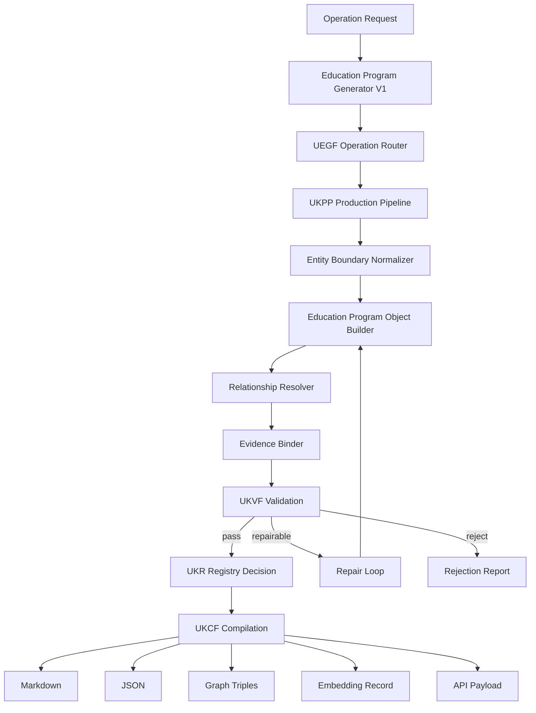
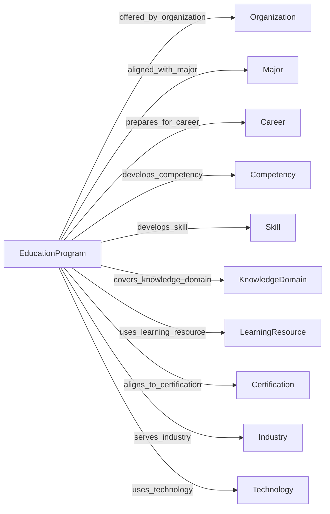
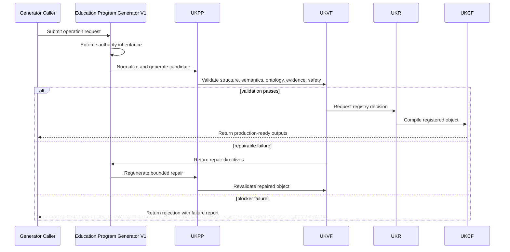
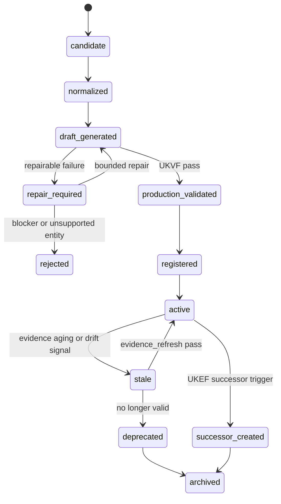
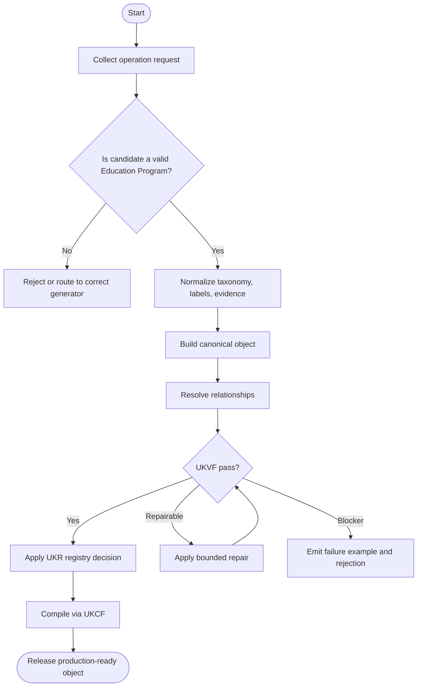
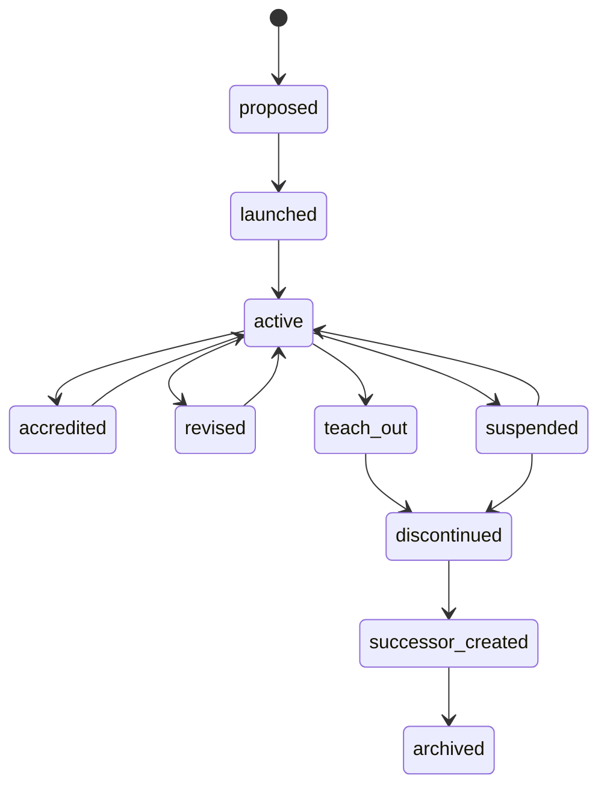

# Education Program Generator V1

**File Path:** `assets/knowledge/generators/education_program/Education_Program_Generator_V1.md`  
**Generator ID:** `generator:education_program:v1`  
**Entity Type:** `education_program`  
**Status:** Production Ready  
**Version:** 1.0.0  
**Release Date:** 2026-06-28  
**Owner:** KarirGPS Principal Knowledge Engineering Team

---

## 1. Document Control

| Field | Value |
| --- | --- |
| Document name | Education Program Generator V1 |
| Canonical file | `assets/knowledge/generators/education_program/Education_Program_Generator_V1.md` |
| Generator class | Entity Generator |
| Target entity | Education Program |
| Upstream dependencies | AI Constitution, Career Knowledge Ontology, KOS, UEGF, UKPP, UKVF, UKR, UKL, UKQF, UKEF, UKCF, Generator Development Standard V1 |
| Reference style | Career Generator V1, Skill Generator V1, Competency Generator V1, Knowledge Domain Generator V1, Work Task Generator V1, Work Activity Generator V1, Technology Generator V1, Tool Generator V1 |
| Release state | Production-ready implementation specification |
| Change policy | Revisions must preserve architecture inheritance and pass conformance tests |

## 2. Purpose and Scope

The Education Program Generator V1 creates, revises, repairs, localizes, enriches, refreshes evidence for, and creates evolution successors for `education_program` knowledge objects. An education program is a structured learning pathway offered by an institution or provider that has curriculum, learning outcomes, prerequisites, duration, assessment model, credential or recognition model, and relationships to majors, careers, competencies, skills, certifications, and learning resources.

### 2.1 In Scope

- Program taxonomy including degree, diploma, vocational, certificate, apprenticeship, bootcamp, continuing education, micro-credential, and professional program types.
- Curriculum structure, learning outcomes, prerequisites, duration, accreditation, assessment, delivery mode, micro-credentials, stackability, and credential model.
- Competency mapping, skill mapping, knowledge-domain mapping, career pathway mapping, major relationships, certification alignment, and learning-resource relationships.
- Localization of credential names, accreditation terms, duration conventions, delivery formats, grading/assessment terminology, and jurisdiction-specific education structures.
- Operation support for create, revise, repair, localize, enrich, evidence_refresh, and evolution_successor.

### 2.2 Out of Scope

- Creating academic majors as fields of study; use Major Generator V1.
- Creating individual institutions or providers; use Organization Generator V1.
- Creating courses, modules, learning resources, careers, skills, competencies, certifications, technologies, or tools except as relationships.
- Guaranteeing admission, employment, licensing, equivalency, or accreditation recognition without evidence.
- Inventing program accreditation, duration, curriculum, or credential claims without evidence.

## 3. Authority, Inheritance, and Non-Redesign Constraint

This generator is an implementation artifact only. It does not redesign, fork, supersede, duplicate, or reinterpret any KarirGPS foundation, ontology, standard, or universal framework. It inherits the following authoritative contracts exactly as upstream requirements.

| Authority | Inheritance Applied in This Generator |
| --- | --- |
| AI Constitution | Safety, truthfulness, privacy, non-deceptive generation, fairness, traceability, and human-benefit constraints are enforced for every operation. |
| Career Knowledge Ontology | All classes, relationship names, cardinalities, and semantic boundaries must remain aligned with the canonical career graph. |
| Knowledge Object Specification (KOS) | Every generated object must use the canonical KOS envelope, identity, evidence, language, validation, registry, lineage, and lifecycle fields. |
| Universal Entity Generator Framework (UEGF) | The universal operation model, normalization contract, generation guarantees, and repair behavior are inherited without modification. |
| Universal Knowledge Production Pipeline (UKPP) | Intake, normalization, generation, validation, repair, registration, compilation, and release stages are implemented as the production pipeline. |
| Universal Knowledge Validation Framework (UKVF) | Structural, semantic, ontological, evidence, safety, localization, registry, query, evolution, and compilation validation are required. |
| Universal Knowledge Registry Framework (UKR) | Object identity, versioning, deduplication, lineage, merge rules, and registry state transitions are enforced. |
| Universal Knowledge Language Framework (UKL) | Canonical language, localized variants, controlled terminology, and locale-specific examples are supported. |
| Universal Knowledge Query Framework (UKQF) | Generated objects must be queryable by identity, label, taxonomy, relationships, evidence, maturity, lifecycle state, and career-graph impact. |
| Universal Knowledge Evolution Framework (UKEF) | Revision, deprecation, evidence aging, drift detection, successor creation, and relation revalidation are supported. |
| Universal Knowledge Compilation Framework (UKCF) | Objects compile into registry-ready Markdown, JSON, graph triples, embeddings, and API payloads without semantic loss. |
| Generator Development Standard V1 | All mandatory sections, diagrams, schemas, prompt templates, validation examples, failure examples, tests, certification checks, and readiness checks are included. |

### 3.1 Binding Implementation Rule

If any instruction in this generator conflicts with an upstream authority, the upstream authority wins. The generator must stop, report the conflict, and produce a repair request rather than generating a non-conformant object.

## 4. Generator Development Standard V1 Mandatory Section Map

The following table maps this document to the mandatory sections required by Generator Development Standard V1. No mandatory section is intentionally omitted.

| GDS V1 Mandatory Section | Implemented Section in This Document |
| --- | --- |
| Document control | Section 1 |
| Purpose and scope | Section 2 |
| Authority and inheritance | Section 3 |
| Mandatory section conformance map | Section 4 |
| Entity definition | Section 5 |
| Ontology alignment | Section 6 |
| Canonical object model | Section 7 |
| Operation support | Section 8 |
| Production pipeline | Section 9 |
| Validation framework | Section 10 |
| Registry and identity rules | Section 11 |
| Language and localization rules | Section 12 |
| Query support | Section 13 |
| Evolution rules | Section 14 |
| Compilation outputs | Section 15 |
| Architecture diagrams | Section 16 |
| Mermaid diagrams | Section 16 |
| Sequence diagrams | Section 16 |
| State diagrams | Section 16 |
| Flowcharts | Section 16 |
| Schemas | Section 17 |
| Prompt templates | Section 18 |
| Validation examples | Section 19 |
| Failure examples | Section 20 |
| Conformance tests | Section 21 |
| Engineering certification checklist | Section 22 |
| Production readiness checklist | Section 23 |
| Release contract | Section 24 |


## 5. Entity Definition: Education Program

An `education_program` represents a coherent learning pathway that leads to a credential, degree, certificate, diploma, professional qualification, micro-credential, or recognized completion outcome. It can be institution-specific or archetypal depending on registry scope, but it must have curriculum structure and learning-outcome semantics.

### 5.1 Canonical Definition

```yaml
object_type: education_program
canonical_definition: >
  A structured learning pathway with curriculum, learning outcomes, prerequisites, duration, assessment, credential or recognition model, accreditation context, delivery mode, stackability, and validated relationships to majors, careers, competencies, skills, certifications, and learning resources.
boundary_rule: >
  An education program must define a structured pathway of study or training; it must not be merely an academic major, single course, learning resource, career, skill, competency, organization, or certification exam.
```

### 5.2 Boundary Tests

| Test | A Valid Object Must Answer |
| --- | --- |
| Program structure | What curriculum or pathway structure defines it? |
| Credential outcome | What degree, diploma, certificate, micro-credential, or recognition does completion produce? |
| Learning outcomes | Which competencies, skills, and knowledge outcomes are expected? |
| Prerequisites | What prior education, knowledge, skill, credential, or experience is required? |
| Duration and delivery | How long does it take and how is it delivered? |
| Assessment | How are learning outcomes evaluated? |
| Relationship to careers and majors | Which majors, careers, certifications, or learning resources does it connect to? |

### 5.3 Non-Examples

| Invalid Candidate | Reason It Is Not This Entity | Correct Entity Direction |
| --- | --- | --- |
| Computer Science | Major or academic discipline, not necessarily a program. | Major |
| Intro to Python | Course or learning resource, not full program unless credentialized as a program. | Learning Resource or Course |
| Software engineer | Career, not program. | Career |
| University of Indonesia | Organization, not program. | Organization |
| AWS Solutions Architect exam | Certification assessment, not education program by itself. | Certification |

### 5.4 Canonical Taxonomy Rules

Program taxonomy must distinguish credential level, credential type, provider type, delivery mode, discipline area, major alignment, duration band, stackability, accreditation status, and learner stage. Degree level and major must remain distinct: a Bachelor of Data Science is an education program; Data Science is a major or field alignment.

### 5.5 Lifecycle, Maturity, and Change Semantics

Education program lifecycle includes proposed, launched, accredited, active, revised, teach-out, suspended, discontinued, replaced, and successor states. Curriculum evolution may be handled through revision, but credential-level change, accreditation loss, program merger, or provider restructuring can require successor handling.

### 5.6 Entity-Specific Required Coverage

The generator must emit the following semantic coverage for every production object unless the evidence model explicitly proves a field is not applicable.

| Coverage Area | Required Generator Behavior | Quality Gate |
| --- | --- | --- |
| Program taxonomy | Emit credential type, level, provider context, discipline, delivery mode, and stackability. | Program type is not confused with major, course, certification, or organization. |
| Curriculum structure | Represent curriculum components, phases, credits or workload units, core/elective structure, and capstone or practicum when applicable. | Curriculum has sequence and outcome semantics. |
| Learning outcomes | Map outcomes to competencies, skills, knowledge domains, and assessment types. | Outcomes are measurable and not generic slogans. |
| Prerequisites and duration | Define entry requirements, prior knowledge, duration band, and pacing. | Requirements are jurisdiction-aware when applicable. |
| Accreditation and assessment | Represent accreditation status, quality assurance, assessments, grading, practicum, and credential recognition. | Accreditation claims are evidence-bound. |
| Stackability and micro-credentials | Model pathways, modular credentials, credit transfer, and progression. | Stacking rules are explicit and evidence-scoped. |


## 6. Ontology Alignment

Education Program objects are bound to the Career Knowledge Ontology as career-graph context entities. They must connect to adjacent entities using explicit, validated, and queryable relationships.

### 6.1 Required Ontology Class

```yaml
ontology_binding:
  primary_class: career_ontology.EducationProgram
  parent_classes:
    - career_ontology.LearningPathway
    - career_ontology.CredentialPathway
    - career_ontology.CareerPreparationEntity
  disjoint_with:
    - career_ontology.Major
    - career_ontology.Organization
    - career_ontology.Industry
    - career_ontology.Career
    - career_ontology.Technology
    - career_ontology.Tool
    - career_ontology.Skill
    - career_ontology.Competency
    - career_ontology.WorkTask
    - career_ontology.WorkActivity
```

### 6.2 Allowed Relationships

| Relationship | Target Entity | Cardinality | Meaning |
| --- | --- | --- | --- |
| offered_by_organization | organization | 0..n | Institution or provider offering the program. |
| aligned_with_major | major | 0..n | Major or field of study aligned with the program. |
| prepares_for_career | career | 0..n | Careers or role families the program prepares learners for. |
| develops_competency | competency | 0..n | Competencies developed by program outcomes. |
| develops_skill | skill | 0..n | Skills developed by courses, projects, labs, or practicum. |
| covers_knowledge_domain | knowledge_domain | 0..n | Knowledge domains covered by curriculum. |
| uses_learning_resource | learning_resource | 0..n | Learning resources used or recommended. |
| requires_prerequisite | major | education_program | competency | skill | knowledge_domain | certification | 0..n | Prerequisite pathway, knowledge, skill, credential, or certification. |
| includes_microcredential | microcredential | 0..n | Micro-credentials or stackable components within the program. |
| aligns_to_certification | certification | 0..n | Certifications or licensure pathways aligned with the program. |
| serves_industry | industry | 0..n | Industries for which the program prepares talent. |
| uses_technology | technology | 0..n | Technologies used in instruction or expected practice. |

### 6.3 Relationship Integrity Rules

1. Education program and major must not be merged; program is the structured pathway, major is the academic field or specialization.
2. Offered-by relationships must target organizations, not industries or careers.
3. Accreditation relationships must be evidence-bound and jurisdiction-scoped.
4. Career preparation relationships must not guarantee employment or licensure.
5. Micro-credential stackability must specify whether it stacks into the same program, another program, or external certification.

### 6.4 Cross-Generator Dependency Rules

| Referenced Generator | Dependency Rule | Failure Trigger |
| --- | --- | --- |
| Major Generator V1 | Use for field-of-study alignment and specialization. | Candidate is a discipline or major without program structure. |
| Organization Generator V1 | Use for institutions or providers offering the program. | Candidate is a university, school, bootcamp provider, or training company. |
| Career Generator V1 | Use for careers prepared by the program. | Candidate is a profession or occupation. |
| Skill and Competency Generators | Use for learning outcome mappings. | Candidate describes ability or integrated performance capacity. |
| Learning Resource or Certification Generators | Use for resources and certifications linked to the program. | Candidate is a course material, credential exam, or certificate standard. |


## 7. Canonical Object Model

### 7.1 Required KOS Envelope

```yaml
kos:
  kos_version: "1.0"
  object_id: "education_program:bachelor-of-data-science:v1"
  object_type: "education_program"
  object_version: "1.0.0"
  lifecycle_state: active
  canonical_language: en
  created_by_generator: "generator:education_program:v1"
  created_at: "2026-06-28"
  updated_at: "2026-06-28"
```

### 7.2 Required Education Program Fields

| Field | Type | Required | Description |
| --- | --- | --- | --- |
| canonical_label | string | Yes | Stable program name. |
| aliases | string[] | Yes | Alternative names, abbreviations, localized names, and credential variants. |
| definition | string | Yes | Boundary-aware definition of the program. |
| program_taxonomy | object | Yes | Program type, level, credential, provider type, delivery mode, and discipline alignment. |
| curriculum_structure | object | Yes | Curriculum components, sequencing, credits/workload, and learning phases. |
| learning_outcomes | object[] | Yes | Measurable outcomes mapped to competencies, skills, and knowledge domains. |
| prerequisites | object[] | Yes | Entry requirements, prerequisite knowledge, skills, credentials, or experience. |
| duration | object | Yes | Duration band, pacing, workload, credits, or clock hours. |
| accreditation | object | Yes | Accreditation, quality assurance, recognition, and jurisdiction scope. |
| competency_mapping | object[] | Yes | Program outcomes mapped to competencies. |
| skill_mapping | object[] | Yes | Program outcomes mapped to skills. |
| assessment | object[] | Yes | Assessment methods and evidence of learning. |
| delivery_mode | object | Yes | Online, hybrid, in-person, apprenticeship, lab, practicum, or workplace delivery. |
| micro_credentials | object[] | Yes | Embedded or associated micro-credentials. |
| stackability | object | Yes | Pathways into, through, and beyond the program. |
| relationships | relation[] | Yes | Validated career-graph relationships. |

### 7.3 Embedded Model Requirements

The embedded education program model must include: `program_taxonomy_model`, `curriculum_model`, `learning_outcome_model`, `prerequisite_model`, `duration_model`, `accreditation_model`, `competency_mapping_model`, `skill_mapping_model`, `assessment_model`, `delivery_mode_model`, `microcredential_model`, and `stackability_model`.

### 7.4 Evidence Model

Every object must include evidence records for claims that affect taxonomy, legal or accreditation status, labor demand, maturity, relationships, or successor decisions. Evidence is represented as structured records, not prose-only citations.

```yaml
evidence_record:
  evidence_id: "evidence:education_program:source:v1"
  claim_supported: "Specific claim in the object"
  source_type: "official | standards_body | institutional | labor_market | academic | industry_report | registry | expert_review"
  source_title: "Source title as captured by evidence pipeline"
  source_date: "2026-06-28"
  retrieval_date: "2026-06-28"
  reliability_tier: "A | B | C"
  freshness_window_days: 365
  confidence: 0.0_to_1.0
  affected_fields:
    - "taxonomy"
    - "relationships"
```

### 7.5 Quality Metadata

```yaml
quality_metadata:
  generation_confidence: 0.0_to_1.0
  ontology_conformance: pass
  evidence_sufficiency: pass
  localization_status: canonical_only | localized | localization_pending
  validation_status: draft_validated | production_validated | repair_required
  registry_action: create | update | merge | split | deprecate | successor
```


## 8. Supported Operations

The generator supports exactly the seven required operations. Each operation must use the same inherited UEGF operation envelope and may not bypass UKPP, UKVF, UKR, UKL, UKQF, UKEF, or UKCF.

| Operation | Universal Meaning | Education Program-Specific Contract |
| --- | --- | --- |
| create | Create a new canonical object from normalized source material and ontology constraints. | Create an education program only after confirming structured curriculum, learning outcomes, duration, assessment, and credential or recognition model. |
| revise | Modify an existing object while preserving identity, lineage, registry history, and semantic integrity. | Update curriculum, outcomes, prerequisites, duration, accreditation, assessment, delivery mode, stackability, or mappings while preserving identity. |
| repair | Correct invalid, incomplete, stale, contradictory, unsafe, or non-conformant object content. | Fix confusion with major, course, certification, or organization; repair missing outcomes, invalid mappings, or unsupported accreditation claims. |
| localize | Create or update locale-specific labels, examples, regulatory references, terminology, and delivery context without changing canonical identity. | Adapt credential names, accreditation terms, duration conventions, learning outcome language, and delivery context for locale. |
| enrich | Add validated relationships, mappings, evidence, examples, maturity details, and query metadata to an existing object. | Add curriculum components, outcome mappings, skill and competency links, micro-credentials, stackability, learning resources, and career pathways. |
| evidence_refresh | Reassess sources, evidence timestamps, confidence, and affected fields while preserving auditable provenance. | Refresh accreditation, curriculum, delivery mode, duration, provider, recognition, and career-alignment evidence. |
| evolution_successor | Create a successor object when the entity has materially changed, split, merged, deprecated, or evolved beyond revision scope. | Create successor when program is discontinued, replaced, merged, recredentialed, split, or materially restructured. |

### 8.1 Operation Input Envelope

```yaml
operation_request:
  operation: create | revise | repair | localize | enrich | evidence_refresh | evolution_successor
  generator_id: "generator:education_program:v1"
  target_object_type: "education_program"
  locale: "en | id-ID | other_valid_locale"
  source_material:
    structured_records: []
    narrative_context: ""
    existing_object: null
    evidence_records: []
  constraints:
    preserve_identity: true
    preserve_architecture: true
    allow_successor_creation: true
    require_registry_validation: true
```

### 8.2 Operation Output Envelope

```yaml
operation_result:
  status: success | repaired | rejected | successor_required
  object_type: "education_program"
  object_id: "education_program:bachelor-of-data-science:v1"
  object_version: "1.0.0"
  registry_action: create | revise | repair | localize | enrich | refresh | successor
  validation_summary:
    structural: pass
    semantic: pass
    ontology: pass
    evidence: pass
    safety: pass
  compiled_outputs:
    markdown: true
    json: true
    graph_triples: true
    embedding_record: true
    api_payload: true
```


## 9. Universal Knowledge Production Pipeline Implementation

| Stage | Implementation | Exit Gate |
| --- | --- | --- |
| 1. Intake | Collect source material, target locale, operation type, existing object context, and authority constraints. | Reject unsafe or insufficient requests before generation. |
| 2. Normalization | Normalize labels, aliases, taxonomy terms, lifecycle vocabulary, and education_program boundaries. | Produce canonical terms and candidate identity slug. |
| 3. Entity Boundary Check | Confirm that the candidate is a structured learning pathway with curriculum, learning outcomes, assessment, duration, and credential semantics. | Reject candidates that belong to another generator. |
| 4. Draft Generation | Generate the education_program object using the canonical object model and entity-specific coverage rules. | Populate all required fields with auditable rationale. |
| 5. Relationship Resolution | Resolve relationships against existing registry identities and mark unresolved targets for controlled registry handling. | No ambiguous relationship may be emitted as confirmed. |
| 6. Evidence Binding | Bind claims to evidence records and confidence scores. | Evidence-dependent fields include source and freshness metadata. |
| 7. Validation | Run UKVF structural, semantic, ontological, safety, evidence, localization, registry, query, evolution, and compilation checks. | Any failure routes to repair or rejection. |
| 8. Repair Loop | Apply bounded repair to missing fields, inconsistent relationships, invalid lifecycle states, weak evidence, or localization defects. | Repair attempts remain logged and may not invent evidence. |
| 9. Registry Decision | Apply UKR identity, deduplication, merge, split, version, and lifecycle rules. | Object receives a registry-safe action. |
| 10. Compilation | Compile through UKCF into Markdown, JSON, graph triples, embeddings, and API payload. | Outputs preserve semantic equivalence. |
| 11. Release | Release only after conformance tests and production readiness checks pass. | Object is production-ready or explicitly rejected. |

### 9.1 Pipeline Invariants

1. The generator must not create a new framework, schema family, ontology layer, or validation discipline.
2. The generator must not emit objects outside its target entity type.
3. Evidence-dependent claims must be traceable to evidence records or explicitly marked as low-confidence inference.
4. Repair must preserve identity unless UKR determines that a split, merge, or successor is required.
5. Compilation must not remove relationship semantics, confidence, evidence, localization, or lifecycle data.


## 10. Universal Knowledge Validation Framework Implementation

| Validation Layer | Required Check |
| --- | --- |
| Structural validation | All required KOS and entity fields exist, types are valid, cardinalities are respected, and schema compiles. |
| Semantic validation | Definition, taxonomy, lifecycle, maturity, relationships, and examples describe a true education_program object. |
| Ontology validation | All relationship targets use allowed entity types and do not violate disjointness or cycle rules. |
| Evidence validation | Evidence is adequate, fresh enough, source-typed, confidence-scored, and bound to claims. |
| Safety validation | Content avoids discriminatory, deceptive, privacy-invasive, or harmful career guidance claims. |
| Localization validation | Localized terms preserve meaning, regulatory/accreditation terms are locale-aware, and canonical identity remains stable. |
| Registry validation | Object identity, version, slug, aliases, deduplication result, and lifecycle state comply with UKR. |
| Query validation | Object supports the required UKQF access patterns and filter dimensions. |
| Evolution validation | Deprecation, split, merge, replacement, and successor logic is consistent with UKEF. |
| Compilation validation | Markdown, JSON, graph triples, embedding metadata, and API payload are semantically equivalent. |

### 10.1 Entity-Specific Validation Rules

1. The object must not be only a major, course, learning resource, organization, certification exam, skill, or career.
2. Program taxonomy must include program type, credential level, delivery mode, and discipline alignment.
3. Curriculum structure must contain components or phases and must support sequencing.
4. Learning outcomes must be measurable or performance-oriented and mapped to skills or competencies.
5. Accreditation and recognition claims must be jurisdiction-scoped and evidence-bound.
6. Prerequisites must distinguish required, recommended, and assumed knowledge.
7. Stackability must specify valid upstream and downstream pathways.
8. Career preparation claims must not guarantee employment, licensure, or salary outcomes.

### 10.2 Severity Model

| Severity | Meaning |
| --- | --- |
| Blocker | Object cannot be released. Examples: wrong entity type, missing KOS identity, unsafe claim, invalid relationship target, fabricated evidence. |
| Major | Object cannot be production-ready until repaired. Examples: weak taxonomy, missing lifecycle stage, insufficient mapping, unclear boundary. |
| Minor | Object may pass only if repair is applied before release. Examples: alias normalization issue, sparse examples, formatting inconsistency. |
| Advisory | Object can be released with improvement note. Examples: optional enrichment candidate, additional localization opportunity. |

### 10.3 Repair Routing Rules

| Failure Type | Route | Resolution |
| --- | --- | --- |
| Missing required field | repair | Populate from source material or reject when evidence is unavailable. |
| Wrong entity boundary | rejected | Route to the correct generator without creating an object here. |
| Insufficient evidence | repair or evidence_refresh | Attach stronger evidence or downgrade claim confidence. |
| Material historical change | evolution_successor | Create successor when revision would erase lineage. |
| Locale-specific mismatch | localize | Correct terminology while preserving canonical identity. |


## 11. Registry, Identity, and Versioning Rules

### 11.1 Object Identity

```yaml
identity_policy:
  object_id_pattern: "education_program:<canonical-slug>:v<major>"
  canonical_slug_source: "normalized canonical label plus disambiguator when required"
  version_policy: "semantic versioning for object content; major version for successor-level change"
  merge_policy: "merge only when two records represent the same real-world or conceptual entity under the same ontology class"
  split_policy: "split when one record incorrectly contains multiple distinct education_program objects"
```

### 11.2 Deduplication Keys

| Deduplication Key | Use | Collision Handling |
| --- | --- | --- |
| Canonical program label + credential level | Primary matching for archetypal programs. | Add provider or jurisdiction disambiguator when necessary. |
| Provider + program title | Primary matching for institution-specific programs. | Keep separate when providers differ. |
| Credential type + curriculum signature | Detect duplicate program archetypes. | Merge only when curriculum and outcomes align. |
| Accreditation or registry code | High-confidence matching for official programs. | Human review when evidence conflicts. |
| Localized credential names | Detect same program across languages. | Localize rather than split when canonical identity is same. |

### 11.3 Version Triggers

| Version Level | Trigger |
| --- | --- |
| Patch | Typographic correction, alias cleanup, formatting correction, or non-semantic metadata update. |
| Minor | Added evidence, mappings, relationships, localization, or richer examples without changing entity identity. |
| Major | Meaning changes enough that downstream graph consumers need explicit migration. |
| Successor | Entity is replaced, deprecated, split, merged, renamed with identity shift, or transformed by external structural change. |

### 11.4 Registry States

```yaml
registry_states:
  - candidate
  - normalized
  - draft_generated
  - validation_failed
  - repair_required
  - production_validated
  - registered
  - active
  - stale
  - deprecated
  - successor_created
  - archived
```


## 12. Language and Localization Rules

The canonical language for registry identity is English unless the upstream registry defines another canonical language for a deployment. Localization adds language-specific labels, examples, regulations, delivery context, and market terminology without changing canonical identity.

### 12.1 Localization Requirements

| Component | Localization Rule |
| --- | --- |
| Canonical label | Translate or adapt only in localized label fields; never mutate canonical identity. |
| Aliases | Include local spellings, abbreviations, regulatory names, institutional terms, and common market terms. |
| Definitions | Preserve semantic meaning while adapting examples to local career and education context. |
| Regulation and accreditation terms | Use jurisdiction-specific terms and cite jurisdiction-specific evidence records. |
| Relationships | Do not create locale-only relationships unless the localized context is explicitly scoped. |
| Query metadata | Add localized search terms, synonyms, and disambiguators. |

### 12.2 Locale Pack Structure

```yaml
localization:
  canonical_language: en
  available_locales:
    - locale: id-ID
      localized_label: "Program Sarjana Sains Data"
      localized_definition: "Localized definition preserving canonical meaning."
      localized_aliases: []
      jurisdiction_notes: []
      terminology_notes: []
      evidence_refs: []
```


## 13. Query Support

Generated objects must support direct lookup, semantic search, graph traversal, filtering, aggregation, and downstream recommendation queries under UKQF.

### 13.1 Required Query Dimensions

| Query Dimension | Use | Example Query |
| --- | --- | --- |
| Program type and level | Find programs by degree, diploma, certificate, micro-credential, or vocational type. | Show bachelor programs in data science. |
| Curriculum and outcomes | Find programs developing specific competencies or skills. | Programs that develop machine learning competency. |
| Prerequisites | Find programs requiring prior knowledge or credentials. | Programs requiring calculus and programming. |
| Delivery mode | Filter online, hybrid, in-person, apprenticeship, or workplace programs. | Hybrid cybersecurity certificate programs. |
| Accreditation | Find programs by accreditation or recognition context. | Accredited engineering programs in a jurisdiction. |
| Career alignment | Traverse program to careers, industries, majors, and certifications. | Programs preparing for data analyst careers. |

### 13.2 Query Metadata Contract

```yaml
query_metadata:
  primary_search_terms:
    - "bachelor of data science"
  aliases:
    - "undergraduate data science program"
  filters:
    - program_type
    - credential_level
    - delivery_mode
    - duration_band
    - accreditation_status
    - major_alignment
    - career_alignment
    - skill_mapping
    - competency_mapping
    - jurisdiction
    - provider_type
  graph_traversal_entrypoints:
    - education_program_to_major
    - education_program_to_career
    - education_program_to_competency
    - education_program_to_skill
    - education_program_to_learning_resource
    - education_program_to_certification
    - education_program_to_industry
  ranking_signals:
    evidence_confidence: high
    relationship_density: medium
    localization_match: supported
    lifecycle_state: active
```

### 13.3 Query Safety Rules

1. Do not rank careers, majors, organizations, industries, or education programs by protected attributes.
2. Do not infer personal suitability from sensitive personal characteristics.
3. Do not present low-confidence or stale evidence as current fact.
4. Do not hide uncertainty when regulation, accreditation, labor demand, or technology adoption data is incomplete.


## 14. Evolution and Successor Rules

The generator inherits UKEF and applies it to education_program evolution without creating a new evolution framework.

### 14.1 Evolution Triggers

| Trigger | Generator Response | Successor Required When |
| --- | --- | --- |
| Curriculum revision | Revise and update mappings. | Curriculum identity remains same. |
| Credential-level change | Create successor if credential outcome changes materially. | Program changes from diploma to bachelor or equivalent identity shift. |
| Accreditation change | Evidence refresh and revise recognition model. | Accreditation loss or new accreditation changes market identity. |
| Program merger or split | Create merge/split successor lineage. | Multiple programs combine or one program becomes distinct tracks. |
| Discontinuation or teach-out | Deprecate or successor depending on replacement. | Program is no longer available or replaced by new program. |

### 14.2 Successor Creation Contract

```yaml
evolution_successor:
  predecessor_object_id: "education_program:bachelor-of-data-science:v1"
  successor_object_id: "education_program:bachelor-of-data-science-successor:v2"
  successor_reason: "material identity change | deprecation | split | merge | replacement | regulatory transformation"
  migration_notes:
    downstream_relationships_revalidated: true
    deprecated_fields_mapped: true
    evidence_refreshed: true
    query_redirect_created: true
```

### 14.3 Deprecation Rules

1. Teach-out status should not immediately archive the program; mark lifecycle and preserve historical relationships.
2. Discontinuation must be evidence-bound before deprecation.
3. Replacement programs require predecessor-successor links and migration notes.
4. Accreditation loss requires evidence refresh and relationship revalidation before successor or deprecation.


## 15. Compilation Outputs

UKCF compilation must generate semantically equivalent outputs for registry use, API use, graph use, search use, and human review.

| Output | Purpose |
| --- | --- |
| Markdown | Human-readable specification, review artifact, and repository-native knowledge object. |
| JSON | API-ready structured object following the JSON Schema in Section 17. |
| Graph triples | Ontology graph representation for traversal and reasoning. |
| Embedding record | Search vector payload with canonical label, definition, aliases, relationships, and query metadata. |
| Registry payload | UKR-ready identity, lifecycle, lineage, evidence, validation, and versioning record. |
| Localization bundle | Locale-specific labels, definitions, aliases, examples, and jurisdiction notes. |

### 15.1 Graph Triple Pattern

```ttl
<education_program:bachelor-of-data-science:v1> a career_ontology:EducationProgram .
<education_program:bachelor-of-data-science:v1> career_ontology:canonicalLabel "Bachelor of Data Science" .
<education_program:bachelor-of-data-science:v1> career_ontology:lifecycleState "active" .
<education_program:bachelor-of-data-science:v1> career_ontology:createdByGenerator "generator:education_program:v1" .
```


## 16. Architecture and Mermaid Diagrams

### 16.1 Generator Architecture Diagram



### 16.2 Ontology Relationship Diagram



### 16.3 Operation Sequence Diagram



### 16.4 Lifecycle State Diagram



### 16.5 Flowchart



### 16.6 Entity-Specific Lifecycle Diagram




## 17. Schemas

### 17.1 JSON Schema

```json
{
  "$schema": "https://json-schema.org/draft/2020-12/schema",
  "$id": "karirgps://schemas/education_program/v1",
  "title": "Education Program Knowledge Object",
  "type": "object",
  "additionalProperties": false,
  "required": [
    "kos",
    "canonical_label",
    "aliases",
    "definition",
    "program_taxonomy",
    "curriculum_structure",
    "learning_outcomes",
    "prerequisites",
    "duration",
    "accreditation",
    "competency_mapping",
    "skill_mapping",
    "assessment",
    "delivery_mode",
    "micro_credentials",
    "stackability",
    "relationships",
    "evidence",
    "validation",
    "registry",
    "localization",
    "query_metadata",
    "evolution"
  ],
  "properties": {
    "kos": {
      "type": "object",
      "required": [
        "kos_version",
        "object_id",
        "object_type",
        "object_version",
        "lifecycle_state",
        "canonical_language",
        "created_by_generator",
        "created_at",
        "updated_at"
      ]
    },
    "canonical_label": {
      "type": "string",
      "minLength": 3
    },
    "aliases": {
      "type": "array",
      "items": {
        "type": "string"
      }
    },
    "definition": {
      "type": "string",
      "minLength": 40
    },
    "taxonomy": {
      "type": "object"
    },
    "relationships": {
      "type": "array",
      "items": {
        "type": "object"
      }
    },
    "evidence": {
      "type": "array",
      "items": {
        "type": "object"
      }
    },
    "validation": {
      "type": "object"
    },
    "registry": {
      "type": "object"
    },
    "localization": {
      "type": "object"
    },
    "query_metadata": {
      "type": "object"
    },
    "evolution": {
      "type": "object"
    },
    "program_taxonomy": {
      "type": [
        "object",
        "array",
        "string",
        "number",
        "boolean"
      ]
    },
    "curriculum_structure": {
      "type": [
        "object",
        "array",
        "string",
        "number",
        "boolean"
      ]
    },
    "learning_outcomes": {
      "type": [
        "object",
        "array",
        "string",
        "number",
        "boolean"
      ]
    },
    "prerequisites": {
      "type": [
        "object",
        "array",
        "string",
        "number",
        "boolean"
      ]
    },
    "duration": {
      "type": [
        "object",
        "array",
        "string",
        "number",
        "boolean"
      ]
    },
    "accreditation": {
      "type": [
        "object",
        "array",
        "string",
        "number",
        "boolean"
      ]
    },
    "competency_mapping": {
      "type": [
        "object",
        "array",
        "string",
        "number",
        "boolean"
      ]
    },
    "skill_mapping": {
      "type": [
        "object",
        "array",
        "string",
        "number",
        "boolean"
      ]
    },
    "assessment": {
      "type": [
        "object",
        "array",
        "string",
        "number",
        "boolean"
      ]
    },
    "delivery_mode": {
      "type": [
        "object",
        "array",
        "string",
        "number",
        "boolean"
      ]
    },
    "micro_credentials": {
      "type": [
        "object",
        "array",
        "string",
        "number",
        "boolean"
      ]
    },
    "stackability": {
      "type": [
        "object",
        "array",
        "string",
        "number",
        "boolean"
      ]
    }
  }
}
```

### 17.2 Canonical YAML Shape

```yaml
education_program_object:
  kos:
    kos_version: "1.0"
    object_id: "education_program:bachelor-of-data-science:v1"
    object_type: "education_program"
    object_version: "1.0.0"
    lifecycle_state: active
    canonical_language: en
    created_by_generator: "generator:education_program:v1"
    created_at: "2026-06-28"
    updated_at: "2026-06-28"
  canonical_label: "Bachelor of Data Science"
  aliases:
    - "Undergraduate Data Science Program"
  definition: "A structured postsecondary education program with defined curriculum, learning outcomes, prerequisites, duration, assessment, accreditation context, competency mapping, skill mapping, delivery modes, stackability, and career relationships."
  program_taxonomy:
    program_type: "Bachelor Degree"
    credential_level: "Undergraduate"
    delivery_mode: "In-person | hybrid | online"
  curriculum_structure:
    components: []
    sequencing: []
  learning_outcomes: []
  prerequisites: []
  duration:
    duration_band: "3-4 years or jurisdiction equivalent"
  accreditation: {}
  competency_mapping: []
  skill_mapping: []
  assessment: []
  delivery_mode: {}
  micro_credentials: []
  stackability: {}
  relationships: []
  evidence: []
  validation:
    structural: pass
    semantic: pass
    ontology: pass
    evidence: pass
    safety: pass
  registry:
    registry_state: active
    dedupe_status: unique
    version_policy: semantic
  localization:
    canonical_language: en
    available_locales: []
  query_metadata: {}
  evolution:
    successor_policy: UKEF
    predecessor_object_id: null
```

### 17.3 Relationship Record Schema

```yaml
relationship_record:
  relationship_type: "offered_by_organization"
  target_object_type: "organization"
  target_object_id: "registered_target_id"
  relationship_confidence: 0.0_to_1.0
  evidence_refs: []
  directionality: outbound | inbound | bidirectional
  lifecycle_state: active
```


## 18. Prompt Templates

Prompt templates define operational instructions for AI-native execution. Template variables are controlled input variables, not unfinished placeholders. Each variable must be resolved before production generation.

### 18.1 Template Selection Matrix

| Operation | Template Use |
| --- | --- |
| create | Use the `create` template when the caller requests create a new canonical object from normalized source material and ontology constraints. |
| revise | Use the `revise` template when the caller requests modify an existing object while preserving identity, lineage, registry history, and semantic integrity. |
| repair | Use the `repair` template when the caller requests correct invalid, incomplete, stale, contradictory, unsafe, or non-conformant object content. |
| localize | Use the `localize` template when the caller requests create or update locale-specific labels, examples, regulatory references, terminology, and delivery context without changing canonical identity. |
| enrich | Use the `enrich` template when the caller requests add validated relationships, mappings, evidence, examples, maturity details, and query metadata to an existing object. |
| evidence_refresh | Use the `evidence_refresh` template when the caller requests reassess sources, evidence timestamps, confidence, and affected fields while preserving auditable provenance. |
| evolution_successor | Use the `evolution_successor` template when the caller requests create a successor object when the entity has materially changed, split, merged, deprecated, or evolved beyond revision scope. |

### 18.2 Create Template

```text
SYSTEM: You are executing Education Program Generator V1 under AI Constitution, Career Knowledge Ontology, KOS, UEGF, UKPP, UKVF, UKR, UKL, UKQF, UKEF, UKCF, and Generator Development Standard V1. Do not redesign architecture.

TASK: Create one production-ready education_program object.

INPUTS:
- canonical_label: {canonical_label}
- source_material: {source_material}
- target_locale: {target_locale}
- evidence_records: {evidence_records}

REQUIRED OUTPUT:
- KOS envelope
- education_program canonical object model
- taxonomy, lifecycle, maturity, relationships, evidence, validation, registry, localization, query metadata, evolution metadata
- rejection report when the candidate fails entity boundary tests

QUALITY RULES:
- Apply all Education Program boundary tests.
- Emit only validated relationships.
- Do not invent evidence.
- Return repair directives for any non-blocker validation failure.
```

### 18.3 Revise Template

```text
Revise the existing education_program object {object_id} using {revision_request}. Preserve identity unless UKR requires split, merge, or successor. Re-run UKVF and return a versioned change summary with affected fields, evidence updates, relationship impacts, and query metadata impacts.
```

### 18.4 Repair Template

```text
Repair the invalid education_program object {object_id} using validation failures {failure_report}. Apply bounded repair only. Do not fabricate evidence or change canonical identity unless the registry decision authorizes it. Return repaired object plus before/after validation summary.
```

### 18.5 Localize Template

```text
Localize the education_program object {object_id} into locale {target_locale}. Preserve canonical identity. Add localized label, aliases, definition, examples, jurisdiction or institutional notes when applicable, and localized query terms. Validate semantic equivalence and locale-specific evidence.
```

### 18.6 Enrich Template

```text
Enrich the education_program object {object_id} with additional validated mappings, relationships, evidence, examples, taxonomy detail, and query metadata from {enrichment_sources}. Keep all additions traceable to evidence records and re-run UKVF.
```

### 18.7 Evidence Refresh Template

```text
Refresh evidence for education_program object {object_id}. Reassess source reliability, retrieval dates, freshness windows, affected fields, confidence scores, and claims requiring downgrade. Return updated evidence records, field impact report, and validation summary.
```

### 18.8 Evolution Successor Template

```text
Evaluate whether education_program object {object_id} requires an evolution successor based on {change_signal}. If successor is required, create successor object with predecessor link, migration notes, relationship revalidation, deprecation handling, and query redirect metadata. If not required, return revision or evidence_refresh recommendation.
```


## 19. Validation Examples

### 19.1 Passing Example

```yaml
operation: create
candidate_label: "Bachelor of Data Science"
expected_result: pass
why_it_passes:
  - Represents a structured education program with credential level and curriculum.
  - Can map outcomes to data, statistics, programming, ethics, and machine learning competencies.
  - Can connect to a Data Science major and data-related careers.
minimum_required_relationships:
  - aligned_with_major -> major:data_science
  - prepares_for_career -> career:data_analyst
  - develops_skill -> skill:data_visualization
validation_summary:
  structural: pass
  semantic: pass
  ontology: pass
  evidence: pass
  safety: pass
  registry: pass
  compilation: pass
```

### 19.2 Borderline Example Requiring Repair

```yaml
operation: create
candidate_label: "Data Science"
expected_result: repair_required
repair_reasons:
  - Could be a major, knowledge domain, or program depending on wording.
  - Missing credential level, curriculum, duration, assessment, and provider context.
repair_actions:
  - Ask or infer from evidence whether it is a major or education program.
  - Add program type, curriculum, learning outcomes, duration, and assessment if program scope is confirmed.
```

### 19.3 Localization Example

```yaml
operation: localize
source_object: "education_program:bachelor-of-data-science:v1"
target_locale: id-ID
localized_label: "Program Sarjana Sains Data"
validation_expectation:
  semantic_equivalence: pass
  canonical_identity_preserved: pass
  localized_query_terms_added: pass
```


## 20. Failure Examples

| Candidate | Failure Type | Why It Fails | Required Handling |
| --- | --- | --- | --- |
| Computer Science | Wrong entity boundary | Academic field or major without program structure. | Route to Major Generator V1. |
| Coursera video on SQL | Wrong entity boundary | Learning resource or course, not full education program. | Route to Learning Resource or reject. |
| Google | Wrong entity boundary | Organization, not education program. | Route to Organization Generator V1. |
| Guaranteed job bootcamp | Unsafe unsupported claim | Employment guarantee requires strong evidence and may be misleading. | Repair claim or reject if deceptive. |

### 20.1 Blocker Failure Report Shape

```yaml
failure_report:
  status: rejected
  generator_id: "generator:education_program:v1"
  candidate_label: "Computer Science"
  blocker_reasons:
    - "Wrong entity boundary or missing required evidence."
  correct_routing: "Use the referenced generator indicated by ontology boundary analysis."
  emitted_object: false
```


## 21. Conformance Tests

| Test ID | Test Name | Procedure | Required Result |
| --- | --- | --- | --- |
| CT-001 | Mandatory sections exist | Parse Markdown headings and verify Sections 1 through 24 are present. | pass |
| CT-002 | KOS envelope exists | Validate KOS fields, object type, generator ID, lifecycle state, language, and version. | pass |
| CT-003 | Entity boundary | Run candidate through Education Program boundary tests. | pass |
| CT-004 | Operation support | Verify create, revise, repair, localize, enrich, evidence_refresh, and evolution_successor are implemented. | pass |
| CT-005 | Ontology relationships | Validate relationship names, target entity types, cardinality, and disjointness. | pass |
| CT-006 | Pipeline conformance | Ensure UKPP stages are executed and logged. | pass |
| CT-007 | Validation conformance | Ensure UKVF layers are executed and failures route correctly. | pass |
| CT-008 | Registry conformance | Ensure UKR identity, dedupe, versioning, lifecycle, and lineage rules are applied. | pass |
| CT-009 | Localization conformance | Ensure UKL localization preserves canonical identity and semantic equivalence. | pass |
| CT-010 | Query conformance | Ensure UKQF metadata supports required search and traversal dimensions. | pass |
| CT-011 | Evolution conformance | Ensure UKEF revision, deprecation, and successor decisions are valid. | pass |
| CT-012 | Compilation conformance | Ensure UKCF outputs are semantically equivalent. | pass |
| CT-013 | Safety conformance | Ensure AI Constitution safety checks pass. | pass |
| CT-014 | No architecture redesign | Scan output for new universal framework definitions or conflicting architecture claims. | pass |

### 21.1 Minimal Automated Test Manifest

```yaml
conformance_manifest:
  generator_id: "generator:education_program:v1"
  test_suite: "Generator Development Standard V1 Entity Generator Conformance"
  required_pass_rate: 1.0
  blocker_policy: "zero_blockers_allowed"
  tests:
    - CT-001
    - CT-002
    - CT-003
    - CT-004
    - CT-005
    - CT-006
    - CT-007
    - CT-008
    - CT-009
    - CT-010
    - CT-011
    - CT-012
    - CT-013
    - CT-014
```


## 22. Engineering Certification Checklist

- [x] Authority inheritance from AI Constitution, Career Knowledge Ontology, KOS, UEGF, UKPP, UKVF, UKR, UKL, UKQF, UKEF, UKCF, and GDS V1 is explicit.
- [x] No architecture is redesigned, duplicated, forked, or extended into a new universal framework.
- [x] Education Program boundary rules distinguish the entity from adjacent generators.
- [x] All seven operations are implemented with input and output contracts.
- [x] Production pipeline stages are defined with exit gates.
- [x] Validation layers and repair routes are defined.
- [x] Registry identity, deduplication, versioning, and lifecycle rules are defined.
- [x] Localization rules preserve canonical identity.
- [x] Query metadata supports graph traversal and semantic search.
- [x] Evolution and successor rules are defined.
- [x] Compilation outputs are defined and semantically equivalent.
- [x] Architecture, relationship, sequence, state, flowchart, and lifecycle Mermaid diagrams are included.
- [x] JSON Schema, YAML shape, and relationship schema are included.
- [x] Prompt templates for all operations are included.
- [x] Validation examples and failure examples are included.
- [x] Conformance tests are executable as review criteria.

## 23. Production Readiness Checklist

- [x] Repository path matches the canonical output path.
- [x] Document status is Production Ready and versioned as 1.0.0.
- [x] All mandatory GDS V1 sections are present.
- [x] Entity-specific requirements from the Batch 3 mission are covered.
- [x] No unresolved placeholders, TODO markers, or simplified sections are present.
- [x] All diagrams render as Mermaid code blocks.
- [x] Schemas are syntactically valid and aligned with KOS.
- [x] Prompt templates contain operation-specific controls.
- [x] Validation and failure examples cover pass, repair, and rejection paths.
- [x] Certification checklist has no open exception.
- [x] Document can be used immediately by implementation, QA, registry, and production teams.

## 24. Release Contract

This document is released as `Education Program Generator V1` version 1.0.0. It is a production-ready implementation specification for the `education_program` entity generator in KarirGPS. It inherits all required foundations, core frameworks, engineering standards, and reference-generator conventions without redesign or duplication.

```yaml
release_contract:
  generator_id: "generator:education_program:v1"
  entity_type: "education_program"
  version: "1.0.0"
  status: production_ready
  release_date: "2026-06-28"
  architecture_change: false
  universal_framework_change: false
  mandatory_sections_complete: true
  operations_supported:
    - create
    - revise
    - repair
    - localize
    - enrich
    - evidence_refresh
    - evolution_successor
  certification: passed
  production_readiness: passed
```
