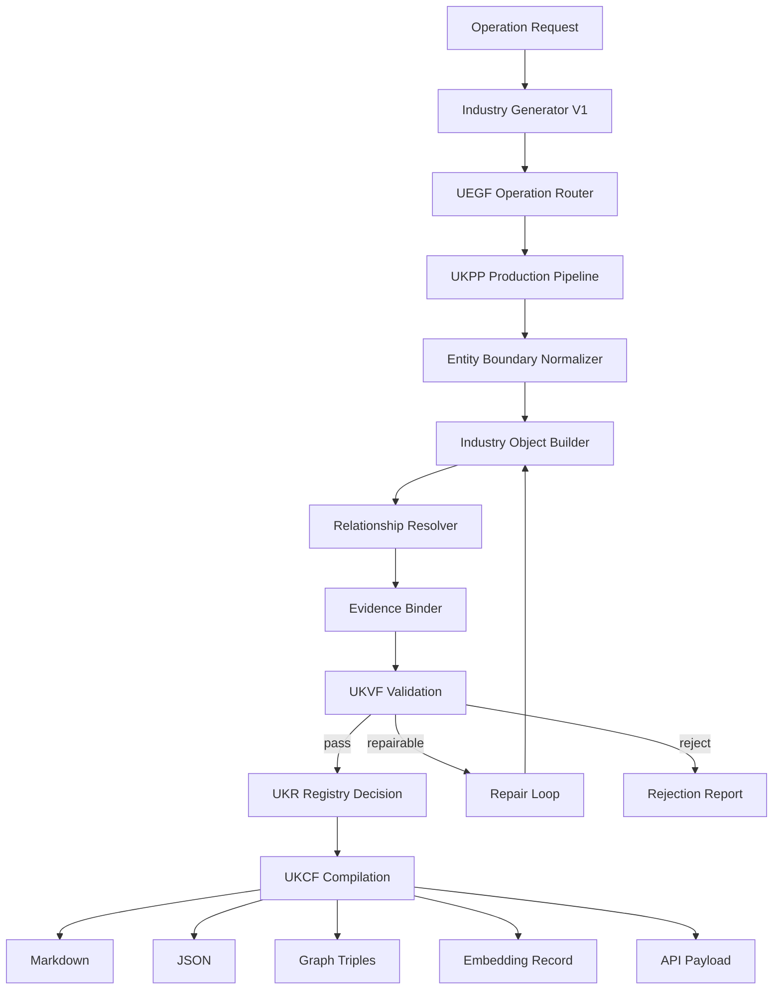
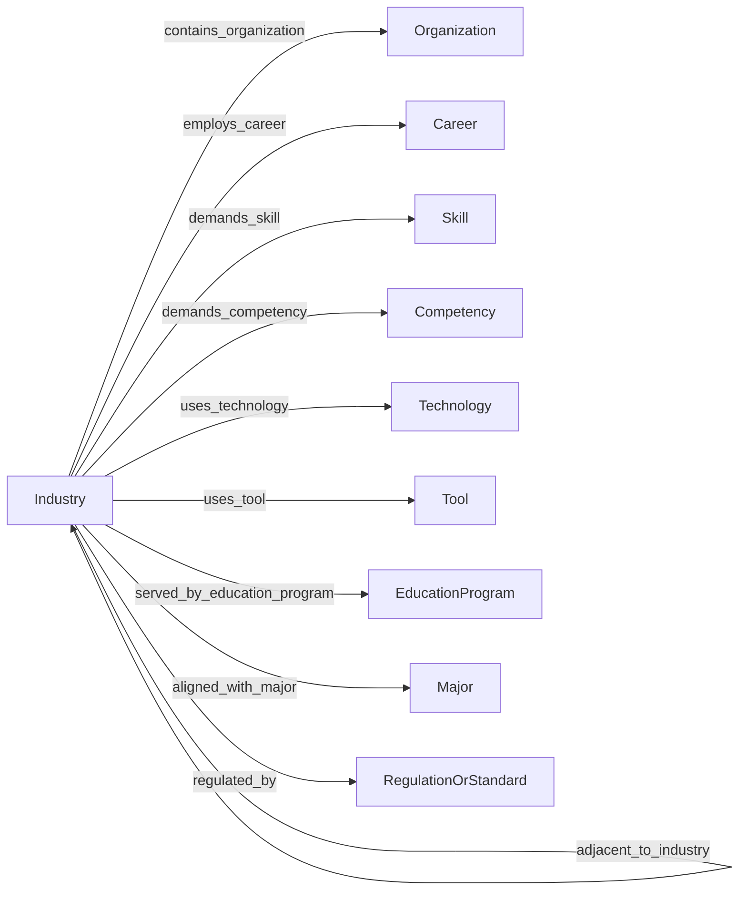
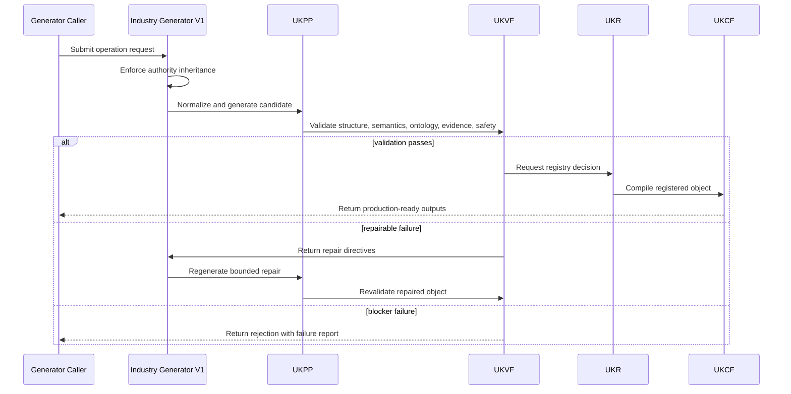
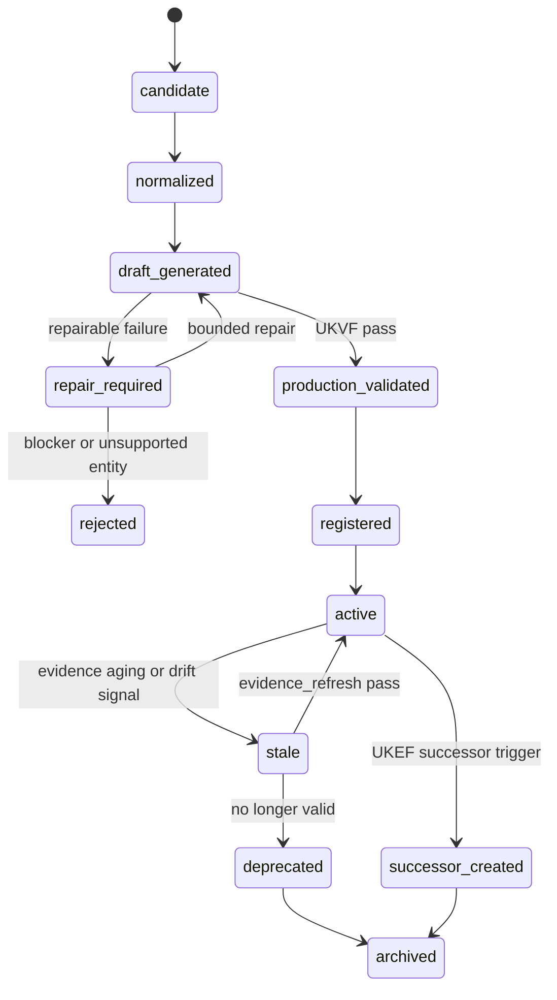
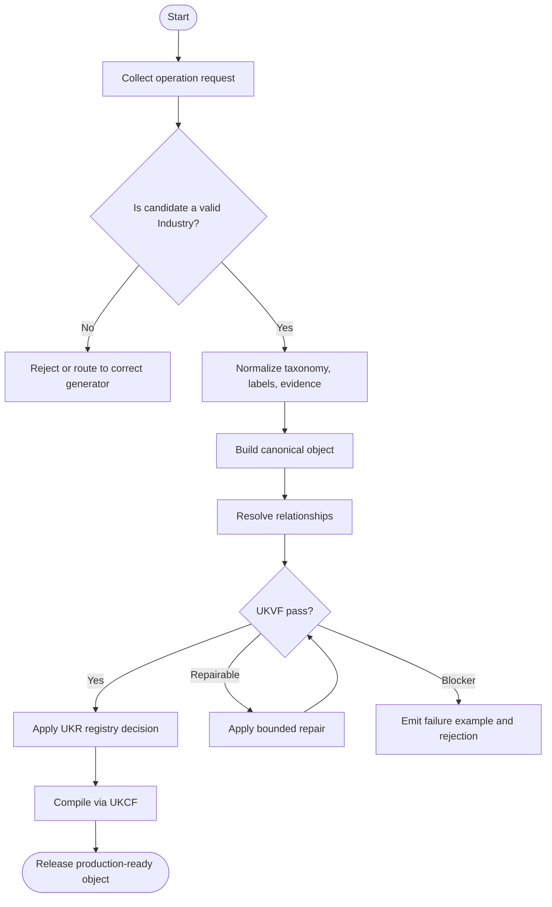
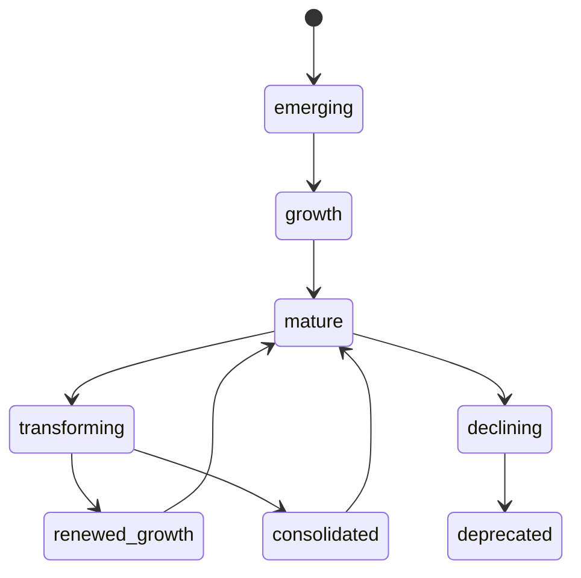

# Industry Generator V1

**File Path:** `assets/knowledge/generators/industry/Industry_Generator_V1.md`  
**Generator ID:** `generator:industry:v1`  
**Entity Type:** `industry`  
**Status:** Production Ready  
**Version:** 1.0.0  
**Release Date:** 2026-06-28  
**Owner:** KarirGPS Principal Knowledge Engineering Team

---

## 1. Document Control

| Field | Value |
| --- | --- |
| Document name | Industry Generator V1 |
| Canonical file | `assets/knowledge/generators/industry/Industry_Generator_V1.md` |
| Generator class | Entity Generator |
| Target entity | Industry |
| Upstream dependencies | AI Constitution, Career Knowledge Ontology, KOS, UEGF, UKPP, UKVF, UKR, UKL, UKQF, UKEF, UKCF, Generator Development Standard V1 |
| Reference style | Career Generator V1, Skill Generator V1, Competency Generator V1, Knowledge Domain Generator V1, Work Task Generator V1, Work Activity Generator V1, Technology Generator V1, Tool Generator V1 |
| Release state | Production-ready implementation specification |
| Change policy | Revisions must preserve architecture inheritance and pass conformance tests |

## 2. Purpose and Scope

The Industry Generator V1 creates, revises, repairs, localizes, enriches, refreshes evidence for, and creates evolution successors for `industry` knowledge objects. An industry is a structured economic domain that groups organizations, value chains, market dynamics, regulations, technologies, labor demand, career pathways, skills, and competencies around a coherent production or service arena.

### 2.1 In Scope

- Industry taxonomy, sectors, sub-sectors, segments, and value-chain boundaries.
- Industry lifecycle, maturity, growth, consolidation, decline, disruption, and transformation states.
- Regulatory, standards, licensing, safety, environmental, and compliance context at the industry level.
- Market dynamics including demand drivers, supply-side constraints, competitive intensity, globalization, localization, and platform shifts.
- Digital transformation and AI transformation patterns affecting work, roles, technologies, organizations, and skills.
- Labor demand signals and relationships with careers, organizations, technologies, skills, competencies, knowledge domains, work activities, and work tasks.
- Operation support for create, revise, repair, localize, enrich, evidence_refresh, and evolution_successor.

### 2.2 Out of Scope

- Creating individual organization profiles; use Organization Generator V1.
- Creating job families, careers, skills, competencies, knowledge domains, technologies, tools, work tasks, or work activities except as validated relationships.
- Publishing financial forecasts or investment advice.
- Replacing jurisdiction-specific legal counsel or regulatory interpretation.
- Inventing market statistics, labor demand claims, or regulatory claims without evidence records.

## 3. Authority, Inheritance, and Non-Redesign Constraint

This generator is an implementation artifact only. It does not redesign, fork, supersede, duplicate, or reinterpret any KarirGPS foundation, ontology, standard, or universal framework. It inherits the following authoritative contracts exactly as upstream requirements.

| Authority | Inheritance Applied in This Generator |
| --- | --- |
| AI Constitution | Safety, truthfulness, privacy, non-deceptive generation, fairness, traceability, and human-benefit constraints are enforced for every operation. |
| Career Knowledge Ontology | All classes, relationship names, cardinalities, and semantic boundaries must remain aligned with the canonical career graph. |
| Knowledge Object Specification (KOS) | Every generated object must use the canonical KOS envelope, identity, evidence, language, validation, registry, lineage, and lifecycle fields. |
| Universal Entity Generator Framework (UEGF) | The universal operation model, normalization contract, generation guarantees, and repair behavior are inherited without modification. |
| Universal Knowledge Production Pipeline (UKPP) | Intake, normalization, generation, validation, repair, registration, compilation, and release stages are implemented as the production pipeline. |
| Universal Knowledge Validation Framework (UKVF) | Structural, semantic, ontological, evidence, safety, localization, registry, query, evolution, and compilation validation are required. |
| Universal Knowledge Registry Framework (UKR) | Object identity, versioning, deduplication, lineage, merge rules, and registry state transitions are enforced. |
| Universal Knowledge Language Framework (UKL) | Canonical language, localized variants, controlled terminology, and locale-specific examples are supported. |
| Universal Knowledge Query Framework (UKQF) | Generated objects must be queryable by identity, label, taxonomy, relationships, evidence, maturity, lifecycle state, and career-graph impact. |
| Universal Knowledge Evolution Framework (UKEF) | Revision, deprecation, evidence aging, drift detection, successor creation, and relation revalidation are supported. |
| Universal Knowledge Compilation Framework (UKCF) | Objects compile into registry-ready Markdown, JSON, graph triples, embeddings, and API payloads without semantic loss. |
| Generator Development Standard V1 | All mandatory sections, diagrams, schemas, prompt templates, validation examples, failure examples, tests, certification checks, and readiness checks are included. |

### 3.1 Binding Implementation Rule

If any instruction in this generator conflicts with an upstream authority, the upstream authority wins. The generator must stop, report the conflict, and produce a repair request rather than generating a non-conformant object.

## 4. Generator Development Standard V1 Mandatory Section Map

The following table maps this document to the mandatory sections required by Generator Development Standard V1. No mandatory section is intentionally omitted.

| GDS V1 Mandatory Section | Implemented Section in This Document |
| --- | --- |
| Document control | Section 1 |
| Purpose and scope | Section 2 |
| Authority and inheritance | Section 3 |
| Mandatory section conformance map | Section 4 |
| Entity definition | Section 5 |
| Ontology alignment | Section 6 |
| Canonical object model | Section 7 |
| Operation support | Section 8 |
| Production pipeline | Section 9 |
| Validation framework | Section 10 |
| Registry and identity rules | Section 11 |
| Language and localization rules | Section 12 |
| Query support | Section 13 |
| Evolution rules | Section 14 |
| Compilation outputs | Section 15 |
| Architecture diagrams | Section 16 |
| Mermaid diagrams | Section 16 |
| Sequence diagrams | Section 16 |
| State diagrams | Section 16 |
| Flowcharts | Section 16 |
| Schemas | Section 17 |
| Prompt templates | Section 18 |
| Validation examples | Section 19 |
| Failure examples | Section 20 |
| Conformance tests | Section 21 |
| Engineering certification checklist | Section 22 |
| Production readiness checklist | Section 23 |
| Release contract | Section 24 |


## 5. Entity Definition: Industry

An `industry` represents a durable economic domain in which related organizations create products, services, infrastructure, or value through comparable value chains, regulatory exposure, technologies, and labor needs. It is broader than a single organization and more market-contextual than a knowledge domain.

### 5.1 Canonical Definition

```yaml
object_type: industry
canonical_definition: >
  A structured economic domain composed of related sectors, sub-sectors, organizations, value chains, technologies, regulations, market dynamics, labor demand, and career-graph relationships.
boundary_rule: >
  An industry must represent an economic arena with multiple participating organizations and labor-market relevance, not a single employer, product, technology, occupation, or academic discipline.
```

### 5.2 Boundary Tests

| Test | A Valid Object Must Answer |
| --- | --- |
| Economic domain | What market or value-production arena does it describe? |
| Multi-organization scope | Does it include many organizations rather than one entity? |
| Value chain | What upstream, core, and downstream activities define the industry? |
| Regulatory context | Which regulatory or standards environment materially shapes the industry? |
| Labor demand | Which careers, competencies, skills, and work activities does it demand? |
| Technology context | Which technologies and tools shape current and future work? |
| Lifecycle state | Is the industry emerging, growing, mature, transforming, declining, or consolidating? |

### 5.3 Non-Examples

| Invalid Candidate | Reason It Is Not This Entity | Correct Entity Direction |
| --- | --- | --- |
| Tesla | Single organization, not an industry. | Organization |
| Solar panel installation | Work activity or service segment, not full industry unless framed as a sub-sector. | Work Activity or Industry Segment |
| Python | Technology, not economic arena. | Technology |
| Software engineer | Career, not industry. | Career |
| Machine learning | Knowledge domain or technology family, not an industry by itself. | Knowledge Domain or Technology |

### 5.4 Canonical Taxonomy Rules

Industry taxonomy must use a hierarchical model: economy domain → sector → industry → sub-sector → segment → niche. Sectors and sub-sectors must be named using stable economic language, while segments may reflect more specific market, technology, or value-chain positions. The generator must avoid mixing geographical market labels, technology labels, and occupation labels as if they were the same taxonomic level.

### 5.5 Lifecycle, Maturity, and Change Semantics

Industry lifecycle must distinguish emergence, growth, maturity, consolidation, transformation, disruption, decline, and regulated transition. Maturity is not a popularity score; it describes institutionalization, technology diffusion, labor-market stability, regulatory clarity, capital formation, supply-chain depth, and standardization.

### 5.6 Entity-Specific Required Coverage

The generator must emit the following semantic coverage for every production object unless the evidence model explicitly proves a field is not applicable.

| Coverage Area | Required Generator Behavior | Quality Gate |
| --- | --- | --- |
| Industry taxonomy | Emit sector, sub-sector, segment, and adjacent-industry boundaries. | Taxonomy levels are internally consistent and not confused with careers or technologies. |
| Regulations | Describe regulatory domains, compliance pressures, standards bodies, licensing or safety regimes when applicable. | Claims are evidence-bound and jurisdiction-scoped. |
| Trends | Separate short-term trends from structural drivers. | Trend confidence and freshness windows are present. |
| Digital transformation | Map platformization, datafication, automation, cloud, cyber, and workflow digitization patterns. | Transformation is linked to work activities, tasks, skills, technologies, and tools. |
| AI transformation | Describe AI adoption patterns, AI-augmented work, automation risk, and new competency demand. | AI claims distinguish assistance, augmentation, and autonomous execution. |
| Labor demand | Represent careers, roles, skills, competencies, and demand signals. | Demand claims are time-scoped, geography-scoped, and confidence-scored. |


## 6. Ontology Alignment

Industry objects are bound to the Career Knowledge Ontology as career-graph context entities. They must connect to adjacent entities using explicit, validated, and queryable relationships.

### 6.1 Required Ontology Class

```yaml
ontology_binding:
  primary_class: career_ontology.Industry
  parent_classes:
    - career_ontology.EconomicContext
    - career_ontology.CareerGraphContext
    - career_ontology.MarketSystem
  disjoint_with:
    - career_ontology.Organization
    - career_ontology.Career
    - career_ontology.Technology
    - career_ontology.Tool
    - career_ontology.Skill
    - career_ontology.Competency
    - career_ontology.EducationProgram
    - career_ontology.Major
```

### 6.2 Allowed Relationships

| Relationship | Target Entity | Cardinality | Meaning |
| --- | --- | --- | --- |
| contains_sector | industry_sector | 0..n | Sector-level subdivisions contained by the industry classification. |
| contains_subsector | industry | 0..n | More specific industry sub-domains or segments. |
| adjacent_to_industry | industry | 0..n | Related industries with overlapping value chains, labor pools, technologies, or markets. |
| contains_organization | organization | 0..n | Organizations operating in the industry. |
| employs_career | career | 0..n | Careers commonly employed by organizations in the industry. |
| demands_competency | competency | 0..n | Competencies demanded by industry work. |
| demands_skill | skill | 0..n | Skills demanded by industry work. |
| uses_technology | technology | 0..n | Technologies used across the industry. |
| uses_tool | tool | 0..n | Tools commonly used in industry work. |
| regulated_by | regulation_or_standard | 0..n | Regulations, standards, or compliance regimes shaping the industry. |
| served_by_education_program | education_program | 0..n | Programs preparing talent for the industry. |
| aligned_with_major | major | 0..n | Majors commonly aligned with industry workforce needs. |

### 6.3 Relationship Integrity Rules

1. Industry-to-organization relationships must not imply ownership unless an ownership relation is separately modeled by Organization objects.
2. Industry-to-career relationships must describe labor-market relevance, not guarantee employment.
3. Industry-to-technology relationships must distinguish core production technology, enabling technology, digital infrastructure, and emerging technology.
4. Regulatory relationships must be scoped by jurisdiction or standard body when applicable.
5. An industry successor must revalidate all downstream career, technology, organization, and education relationships.

### 6.4 Cross-Generator Dependency Rules

| Referenced Generator | Dependency Rule | Failure Trigger |
| --- | --- | --- |
| Organization Generator V1 | Use only for organization objects contained in or operating within the industry. | Candidate describes one employer, agency, institution, or enterprise. |
| Career Generator V1 | Use for occupations and career pathways employed by the industry. | Candidate describes a job or profession rather than market domain. |
| Technology Generator V1 | Use for technology objects used by or transforming the industry. | Candidate is a platform, method, infrastructure, or technical system. |
| Skill and Competency Generators | Use for capability demand created by industry dynamics. | Candidate describes ability or integrated performance capacity. |
| Education Program and Major Generators | Use for education pathways aligned with the industry. | Candidate describes a program or academic field rather than an economic arena. |


## 7. Canonical Object Model

### 7.1 Required KOS Envelope

```yaml
kos:
  kos_version: "1.0"
  object_id: "industry:renewable-energy:v1"
  object_type: "industry"
  object_version: "1.0.0"
  lifecycle_state: active
  canonical_language: en
  created_by_generator: "generator:industry:v1"
  created_at: "2026-06-28"
  updated_at: "2026-06-28"
```

### 7.2 Required Industry Fields

| Field | Type | Required | Description |
| --- | --- | --- | --- |
| canonical_label | string | Yes | Stable industry name. |
| aliases | string[] | Yes | Alternative names, sector labels, local labels, and common abbreviations. |
| definition | string | Yes | Boundary-aware definition of the industry. |
| industry_taxonomy | object | Yes | Sector, sub-sector, segment, and niche classification. |
| sectors | object[] | Yes | Sector components and classification notes. |
| sub_sectors | object[] | Yes | Sub-sector and segment breakdown. |
| industry_lifecycle | object | Yes | Lifecycle stage and lifecycle rationale. |
| maturity | object | Yes | Maturity assessment across regulation, technology, labor, capital, and standards. |
| regulations | object[] | Yes | Regulatory and standards context. |
| trends | object[] | Yes | Evidence-bound market and workforce trends. |
| digital_transformation | object | Yes | Digitization, automation, data, cloud, platform, and cyber transformation. |
| ai_transformation | object | Yes | AI adoption, AI augmentation, automation, and new skill demand. |
| market_dynamics | object | Yes | Demand, supply, competition, value-chain, and geography dynamics. |
| labor_demand | object | Yes | Careers, roles, skills, competencies, and demand indicators. |
| relationships | relation[] | Yes | Validated career-graph relationships. |

### 7.3 Embedded Model Requirements

The embedded industry model must include: `industry_taxonomy`, `sector_model`, `sub_sector_model`, `lifecycle_model`, `maturity_model`, `regulatory_model`, `trend_model`, `digital_transformation_model`, `ai_transformation_model`, `market_dynamics_model`, and `labor_demand_model`. Each model must include confidence, evidence references, and affected relationship targets.

### 7.4 Evidence Model

Every object must include evidence records for claims that affect taxonomy, legal or accreditation status, labor demand, maturity, relationships, or successor decisions. Evidence is represented as structured records, not prose-only citations.

```yaml
evidence_record:
  evidence_id: "evidence:industry:source:v1"
  claim_supported: "Specific claim in the object"
  source_type: "official | standards_body | institutional | labor_market | academic | industry_report | registry | expert_review"
  source_title: "Source title as captured by evidence pipeline"
  source_date: "2026-06-28"
  retrieval_date: "2026-06-28"
  reliability_tier: "A | B | C"
  freshness_window_days: 365
  confidence: 0.0_to_1.0
  affected_fields:
    - "taxonomy"
    - "relationships"
```

### 7.5 Quality Metadata

```yaml
quality_metadata:
  generation_confidence: 0.0_to_1.0
  ontology_conformance: pass
  evidence_sufficiency: pass
  localization_status: canonical_only | localized | localization_pending
  validation_status: draft_validated | production_validated | repair_required
  registry_action: create | update | merge | split | deprecate | successor
```


## 8. Supported Operations

The generator supports exactly the seven required operations. Each operation must use the same inherited UEGF operation envelope and may not bypass UKPP, UKVF, UKR, UKL, UKQF, UKEF, or UKCF.

| Operation | Universal Meaning | Industry-Specific Contract |
| --- | --- | --- |
| create | Create a new canonical object from normalized source material and ontology constraints. | Create an industry object only after confirming multi-organization economic-domain scope. |
| revise | Modify an existing object while preserving identity, lineage, registry history, and semantic integrity. | Update taxonomy, lifecycle, regulations, trends, labor demand, or relationships without breaking object identity. |
| repair | Correct invalid, incomplete, stale, contradictory, unsafe, or non-conformant object content. | Fix boundary confusion, stale market claims, weak regulation evidence, or invalid career/technology mappings. |
| localize | Create or update locale-specific labels, examples, regulatory references, terminology, and delivery context without changing canonical identity. | Adapt sector terminology, regulatory context, labor-market examples, and aliases for the target jurisdiction. |
| enrich | Add validated relationships, mappings, evidence, examples, maturity details, and query metadata to an existing object. | Add sub-sectors, adjacent industries, market dynamics, transformation patterns, and labor demand relationships. |
| evidence_refresh | Reassess sources, evidence timestamps, confidence, and affected fields while preserving auditable provenance. | Refresh regulation, trend, digital transformation, AI transformation, and labor-demand evidence. |
| evolution_successor | Create a successor object when the entity has materially changed, split, merged, deprecated, or evolved beyond revision scope. | Create successor when industry structure, name, regulation, technology base, or market identity materially changes. |

### 8.1 Operation Input Envelope

```yaml
operation_request:
  operation: create | revise | repair | localize | enrich | evidence_refresh | evolution_successor
  generator_id: "generator:industry:v1"
  target_object_type: "industry"
  locale: "en | id-ID | other_valid_locale"
  source_material:
    structured_records: []
    narrative_context: ""
    existing_object: null
    evidence_records: []
  constraints:
    preserve_identity: true
    preserve_architecture: true
    allow_successor_creation: true
    require_registry_validation: true
```

### 8.2 Operation Output Envelope

```yaml
operation_result:
  status: success | repaired | rejected | successor_required
  object_type: "industry"
  object_id: "industry:renewable-energy:v1"
  object_version: "1.0.0"
  registry_action: create | revise | repair | localize | enrich | refresh | successor
  validation_summary:
    structural: pass
    semantic: pass
    ontology: pass
    evidence: pass
    safety: pass
  compiled_outputs:
    markdown: true
    json: true
    graph_triples: true
    embedding_record: true
    api_payload: true
```


## 9. Universal Knowledge Production Pipeline Implementation

| Stage | Implementation | Exit Gate |
| --- | --- | --- |
| 1. Intake | Collect source material, target locale, operation type, existing object context, and authority constraints. | Reject unsafe or insufficient requests before generation. |
| 2. Normalization | Normalize labels, aliases, taxonomy terms, lifecycle vocabulary, and industry boundaries. | Produce canonical terms and candidate identity slug. |
| 3. Entity Boundary Check | Confirm that the candidate represents a multi-organization economic domain with labor-market relevance. | Reject candidates that belong to another generator. |
| 4. Draft Generation | Generate the industry object using the canonical object model and entity-specific coverage rules. | Populate all required fields with auditable rationale. |
| 5. Relationship Resolution | Resolve relationships against existing registry identities and mark unresolved targets for controlled registry handling. | No ambiguous relationship may be emitted as confirmed. |
| 6. Evidence Binding | Bind claims to evidence records and confidence scores. | Evidence-dependent fields include source and freshness metadata. |
| 7. Validation | Run UKVF structural, semantic, ontological, safety, evidence, localization, registry, query, evolution, and compilation checks. | Any failure routes to repair or rejection. |
| 8. Repair Loop | Apply bounded repair to missing fields, inconsistent relationships, invalid lifecycle states, weak evidence, or localization defects. | Repair attempts remain logged and may not invent evidence. |
| 9. Registry Decision | Apply UKR identity, deduplication, merge, split, version, and lifecycle rules. | Object receives a registry-safe action. |
| 10. Compilation | Compile through UKCF into Markdown, JSON, graph triples, embeddings, and API payload. | Outputs preserve semantic equivalence. |
| 11. Release | Release only after conformance tests and production readiness checks pass. | Object is production-ready or explicitly rejected. |

### 9.1 Pipeline Invariants

1. The generator must not create a new framework, schema family, ontology layer, or validation discipline.
2. The generator must not emit objects outside its target entity type.
3. Evidence-dependent claims must be traceable to evidence records or explicitly marked as low-confidence inference.
4. Repair must preserve identity unless UKR determines that a split, merge, or successor is required.
5. Compilation must not remove relationship semantics, confidence, evidence, localization, or lifecycle data.


## 10. Universal Knowledge Validation Framework Implementation

| Validation Layer | Required Check |
| --- | --- |
| Structural validation | All required KOS and entity fields exist, types are valid, cardinalities are respected, and schema compiles. |
| Semantic validation | Definition, taxonomy, lifecycle, maturity, relationships, and examples describe a true industry object. |
| Ontology validation | All relationship targets use allowed entity types and do not violate disjointness or cycle rules. |
| Evidence validation | Evidence is adequate, fresh enough, source-typed, confidence-scored, and bound to claims. |
| Safety validation | Content avoids discriminatory, deceptive, privacy-invasive, or harmful career guidance claims. |
| Localization validation | Localized terms preserve meaning, regulatory/accreditation terms are locale-aware, and canonical identity remains stable. |
| Registry validation | Object identity, version, slug, aliases, deduplication result, and lifecycle state comply with UKR. |
| Query validation | Object supports the required UKQF access patterns and filter dimensions. |
| Evolution validation | Deprecation, split, merge, replacement, and successor logic is consistent with UKEF. |
| Compilation validation | Markdown, JSON, graph triples, embedding metadata, and API payload are semantically equivalent. |

### 10.1 Entity-Specific Validation Rules

1. The object must not describe a single organization, product, technology, career, academic major, or work activity.
2. Industry taxonomy must include at least sector and sub-sector or justify why the industry is already the lowest meaningful level.
3. Lifecycle and maturity fields must include rationale, not just labels.
4. Regulatory and standards claims must be scoped by jurisdiction, standard body, or compliance domain.
5. Digital transformation and AI transformation fields must distinguish current adoption from projected impact.
6. Labor demand mappings must connect to careers, competencies, skills, or work activities with confidence and evidence.
7. Trend claims must include freshness window and source reliability tier.
8. Adjacent-industry relationships must include reason for adjacency.

### 10.2 Severity Model

| Severity | Meaning |
| --- | --- |
| Blocker | Object cannot be released. Examples: wrong entity type, missing KOS identity, unsafe claim, invalid relationship target, fabricated evidence. |
| Major | Object cannot be production-ready until repaired. Examples: weak taxonomy, missing lifecycle stage, insufficient mapping, unclear boundary. |
| Minor | Object may pass only if repair is applied before release. Examples: alias normalization issue, sparse examples, formatting inconsistency. |
| Advisory | Object can be released with improvement note. Examples: optional enrichment candidate, additional localization opportunity. |

### 10.3 Repair Routing Rules

| Failure Type | Route | Resolution |
| --- | --- | --- |
| Missing required field | repair | Populate from source material or reject when evidence is unavailable. |
| Wrong entity boundary | rejected | Route to the correct generator without creating an object here. |
| Insufficient evidence | repair or evidence_refresh | Attach stronger evidence or downgrade claim confidence. |
| Material historical change | evolution_successor | Create successor when revision would erase lineage. |
| Locale-specific mismatch | localize | Correct terminology while preserving canonical identity. |


## 11. Registry, Identity, and Versioning Rules

### 11.1 Object Identity

```yaml
identity_policy:
  object_id_pattern: "industry:<canonical-slug>:v<major>"
  canonical_slug_source: "normalized canonical label plus disambiguator when required"
  version_policy: "semantic versioning for object content; major version for successor-level change"
  merge_policy: "merge only when two records represent the same real-world or conceptual entity under the same ontology class"
  split_policy: "split when one record incorrectly contains multiple distinct industry objects"
```

### 11.2 Deduplication Keys

| Deduplication Key | Use | Collision Handling |
| --- | --- | --- |
| Canonical label + sector context | Primary identity matching for industry names. | Add disambiguator when label is used across unrelated sectors. |
| Aliases + sub-sector structure | Detect duplicate industry labels across localized or synonym records. | Merge aliases only when taxonomy and scope match. |
| Value-chain boundary | Differentiate adjacent industries with similar labels. | Split when value-chain coverage differs materially. |
| Regulatory context | Detect jurisdiction-specific variants. | Localize rather than split when the core industry is same. |
| Career and technology relationship pattern | Detect duplicate records with different names but same labor and technology graph. | Human review when confidence is below threshold. |

### 11.3 Version Triggers

| Version Level | Trigger |
| --- | --- |
| Patch | Typographic correction, alias cleanup, formatting correction, or non-semantic metadata update. |
| Minor | Added evidence, mappings, relationships, localization, or richer examples without changing entity identity. |
| Major | Meaning changes enough that downstream graph consumers need explicit migration. |
| Successor | Entity is replaced, deprecated, split, merged, renamed with identity shift, or transformed by external structural change. |

### 11.4 Registry States

```yaml
registry_states:
  - candidate
  - normalized
  - draft_generated
  - validation_failed
  - repair_required
  - production_validated
  - registered
  - active
  - stale
  - deprecated
  - successor_created
  - archived
```


## 12. Language and Localization Rules

The canonical language for registry identity is English unless the upstream registry defines another canonical language for a deployment. Localization adds language-specific labels, examples, regulations, delivery context, and market terminology without changing canonical identity.

### 12.1 Localization Requirements

| Component | Localization Rule |
| --- | --- |
| Canonical label | Translate or adapt only in localized label fields; never mutate canonical identity. |
| Aliases | Include local spellings, abbreviations, regulatory names, institutional terms, and common market terms. |
| Definitions | Preserve semantic meaning while adapting examples to local career and education context. |
| Regulation and accreditation terms | Use jurisdiction-specific terms and cite jurisdiction-specific evidence records. |
| Relationships | Do not create locale-only relationships unless the localized context is explicitly scoped. |
| Query metadata | Add localized search terms, synonyms, and disambiguators. |

### 12.2 Locale Pack Structure

```yaml
localization:
  canonical_language: en
  available_locales:
    - locale: id-ID
      localized_label: "Industri Energi Terbarukan"
      localized_definition: "Localized definition preserving canonical meaning."
      localized_aliases: []
      jurisdiction_notes: []
      terminology_notes: []
      evidence_refs: []
```


## 13. Query Support

Generated objects must support direct lookup, semantic search, graph traversal, filtering, aggregation, and downstream recommendation queries under UKQF.

### 13.1 Required Query Dimensions

| Query Dimension | Use | Example Query |
| --- | --- | --- |
| Taxonomy | Find industries by sector, sub-sector, segment, or niche. | Which industries belong to energy infrastructure? |
| Lifecycle and maturity | Filter by emerging, mature, transforming, or declining industries. | Show emerging industries with high AI transformation. |
| Regulation | Find industries affected by specific compliance domains. | Industries with strong safety regulation. |
| Labor demand | Traverse from industry to careers, skills, and competencies. | Which skills are demanded by renewable energy? |
| Technology adoption | Find industries using or transformed by technologies. | Industries transformed by computer vision. |
| Education alignment | Connect industries to majors and education programs. | Majors aligned with healthcare technology industry. |

### 13.2 Query Metadata Contract

```yaml
query_metadata:
  primary_search_terms:
    - "renewable energy industry"
  aliases:
    - "clean energy sector"
  filters:
    - sector
    - sub_sector
    - lifecycle_stage
    - maturity_level
    - jurisdiction
    - regulatory_domain
    - digital_transformation_level
    - ai_transformation_level
    - labor_demand_signal
  graph_traversal_entrypoints:
    - industry_to_career
    - industry_to_organization
    - industry_to_technology
    - industry_to_skill
    - industry_to_competency
    - industry_to_education_program
    - industry_to_major
  ranking_signals:
    evidence_confidence: high
    relationship_density: medium
    localization_match: supported
    lifecycle_state: active
```

### 13.3 Query Safety Rules

1. Do not rank careers, majors, organizations, industries, or education programs by protected attributes.
2. Do not infer personal suitability from sensitive personal characteristics.
3. Do not present low-confidence or stale evidence as current fact.
4. Do not hide uncertainty when regulation, accreditation, labor demand, or technology adoption data is incomplete.


## 14. Evolution and Successor Rules

The generator inherits UKEF and applies it to industry evolution without creating a new evolution framework.

### 14.1 Evolution Triggers

| Trigger | Generator Response | Successor Required When |
| --- | --- | --- |
| Industry convergence | Revise or merge relationships after evidence review. | Two industries become structurally integrated under shared value chains. |
| Regulatory transformation | Refresh evidence and revise compliance model. | New legal category changes industry identity or operating boundary. |
| Technology disruption | Enrich transformation model and revalidate labor demand. | Core technology shift creates new industry identity. |
| Market decline or deprecation | Update lifecycle to declining or deprecated. | Industry no longer exists as an active market category. |
| Sub-sector spinout | Split sub-sector into successor industry. | Segment becomes independent economic arena with distinct labor market. |

### 14.2 Successor Creation Contract

```yaml
evolution_successor:
  predecessor_object_id: "industry:renewable-energy:v1"
  successor_object_id: "industry:renewable-energy-successor:v2"
  successor_reason: "material identity change | deprecation | split | merge | replacement | regulatory transformation"
  migration_notes:
    downstream_relationships_revalidated: true
    deprecated_fields_mapped: true
    evidence_refreshed: true
    query_redirect_created: true
```

### 14.3 Deprecation Rules

1. Deprecate only when the industry identity is obsolete, merged, replaced, or no longer used in the registry context.
2. Do not deprecate solely because a trend has weakened; revise maturity and market dynamics instead.
3. Create query redirects from deprecated industry aliases to successors.
4. Revalidate downstream career, skill, organization, technology, major, and education-program relationships before archiving.


## 15. Compilation Outputs

UKCF compilation must generate semantically equivalent outputs for registry use, API use, graph use, search use, and human review.

| Output | Purpose |
| --- | --- |
| Markdown | Human-readable specification, review artifact, and repository-native knowledge object. |
| JSON | API-ready structured object following the JSON Schema in Section 17. |
| Graph triples | Ontology graph representation for traversal and reasoning. |
| Embedding record | Search vector payload with canonical label, definition, aliases, relationships, and query metadata. |
| Registry payload | UKR-ready identity, lifecycle, lineage, evidence, validation, and versioning record. |
| Localization bundle | Locale-specific labels, definitions, aliases, examples, and jurisdiction notes. |

### 15.1 Graph Triple Pattern

```ttl
<industry:renewable-energy:v1> a career_ontology:Industry .
<industry:renewable-energy:v1> career_ontology:canonicalLabel "Renewable Energy Industry" .
<industry:renewable-energy:v1> career_ontology:lifecycleState "active" .
<industry:renewable-energy:v1> career_ontology:createdByGenerator "generator:industry:v1" .
```


## 16. Architecture and Mermaid Diagrams

### 16.1 Generator Architecture Diagram



### 16.2 Ontology Relationship Diagram



### 16.3 Operation Sequence Diagram



### 16.4 Lifecycle State Diagram



### 16.5 Flowchart



### 16.6 Entity-Specific Lifecycle Diagram




## 17. Schemas

### 17.1 JSON Schema

```json
{
  "$schema": "https://json-schema.org/draft/2020-12/schema",
  "$id": "karirgps://schemas/industry/v1",
  "title": "Industry Knowledge Object",
  "type": "object",
  "additionalProperties": false,
  "required": [
    "kos",
    "canonical_label",
    "aliases",
    "definition",
    "industry_taxonomy",
    "sectors",
    "sub_sectors",
    "industry_lifecycle",
    "maturity",
    "regulations",
    "trends",
    "digital_transformation",
    "ai_transformation",
    "market_dynamics",
    "labor_demand",
    "relationships",
    "evidence",
    "validation",
    "registry",
    "localization",
    "query_metadata",
    "evolution"
  ],
  "properties": {
    "kos": {
      "type": "object",
      "required": [
        "kos_version",
        "object_id",
        "object_type",
        "object_version",
        "lifecycle_state",
        "canonical_language",
        "created_by_generator",
        "created_at",
        "updated_at"
      ]
    },
    "canonical_label": {
      "type": "string",
      "minLength": 3
    },
    "aliases": {
      "type": "array",
      "items": {
        "type": "string"
      }
    },
    "definition": {
      "type": "string",
      "minLength": 40
    },
    "taxonomy": {
      "type": "object"
    },
    "relationships": {
      "type": "array",
      "items": {
        "type": "object"
      }
    },
    "evidence": {
      "type": "array",
      "items": {
        "type": "object"
      }
    },
    "validation": {
      "type": "object"
    },
    "registry": {
      "type": "object"
    },
    "localization": {
      "type": "object"
    },
    "query_metadata": {
      "type": "object"
    },
    "evolution": {
      "type": "object"
    },
    "industry_taxonomy": {
      "type": [
        "object",
        "array",
        "string",
        "number",
        "boolean"
      ]
    },
    "sectors": {
      "type": [
        "object",
        "array",
        "string",
        "number",
        "boolean"
      ]
    },
    "sub_sectors": {
      "type": [
        "object",
        "array",
        "string",
        "number",
        "boolean"
      ]
    },
    "industry_lifecycle": {
      "type": [
        "object",
        "array",
        "string",
        "number",
        "boolean"
      ]
    },
    "maturity": {
      "type": [
        "object",
        "array",
        "string",
        "number",
        "boolean"
      ]
    },
    "regulations": {
      "type": [
        "object",
        "array",
        "string",
        "number",
        "boolean"
      ]
    },
    "trends": {
      "type": [
        "object",
        "array",
        "string",
        "number",
        "boolean"
      ]
    },
    "digital_transformation": {
      "type": [
        "object",
        "array",
        "string",
        "number",
        "boolean"
      ]
    },
    "ai_transformation": {
      "type": [
        "object",
        "array",
        "string",
        "number",
        "boolean"
      ]
    },
    "market_dynamics": {
      "type": [
        "object",
        "array",
        "string",
        "number",
        "boolean"
      ]
    },
    "labor_demand": {
      "type": [
        "object",
        "array",
        "string",
        "number",
        "boolean"
      ]
    }
  }
}
```

### 17.2 Canonical YAML Shape

```yaml
industry_object:
  kos:
    kos_version: "1.0"
    object_id: "industry:renewable-energy:v1"
    object_type: "industry"
    object_version: "1.0.0"
    lifecycle_state: active
    canonical_language: en
    created_by_generator: "generator:industry:v1"
    created_at: "2026-06-28"
    updated_at: "2026-06-28"
  canonical_label: "Renewable Energy Industry"
  aliases:
    - "Clean Energy Sector"
  definition: "An industry composed of organizations, technologies, occupations, value chains, and regulations involved in producing, storing, distributing, financing, and maintaining energy from renewable sources."
  industry_taxonomy:
    sector: "Energy"
    industry: "Renewable Energy"
    sub_sectors: []
  sectors: []
  sub_sectors: []
  industry_lifecycle:
    stage: growth
    rationale: "Evidence-bound lifecycle rationale."
  maturity:
    level: developing
    dimensions: []
  regulations: []
  trends: []
  digital_transformation: {}
  ai_transformation: {}
  market_dynamics: {}
  labor_demand: {}
  relationships: []
  evidence: []
  validation:
    structural: pass
    semantic: pass
    ontology: pass
    evidence: pass
    safety: pass
  registry:
    registry_state: active
    dedupe_status: unique
    version_policy: semantic
  localization:
    canonical_language: en
    available_locales: []
  query_metadata: {}
  evolution:
    successor_policy: UKEF
    predecessor_object_id: null
```

### 17.3 Relationship Record Schema

```yaml
relationship_record:
  relationship_type: "contains_sector"
  target_object_type: "industry_sector"
  target_object_id: "registered_target_id"
  relationship_confidence: 0.0_to_1.0
  evidence_refs: []
  directionality: outbound | inbound | bidirectional
  lifecycle_state: active
```


## 18. Prompt Templates

Prompt templates define operational instructions for AI-native execution. Template variables are controlled input variables, not unfinished placeholders. Each variable must be resolved before production generation.

### 18.1 Template Selection Matrix

| Operation | Template Use |
| --- | --- |
| create | Use the `create` template when the caller requests create a new canonical object from normalized source material and ontology constraints. |
| revise | Use the `revise` template when the caller requests modify an existing object while preserving identity, lineage, registry history, and semantic integrity. |
| repair | Use the `repair` template when the caller requests correct invalid, incomplete, stale, contradictory, unsafe, or non-conformant object content. |
| localize | Use the `localize` template when the caller requests create or update locale-specific labels, examples, regulatory references, terminology, and delivery context without changing canonical identity. |
| enrich | Use the `enrich` template when the caller requests add validated relationships, mappings, evidence, examples, maturity details, and query metadata to an existing object. |
| evidence_refresh | Use the `evidence_refresh` template when the caller requests reassess sources, evidence timestamps, confidence, and affected fields while preserving auditable provenance. |
| evolution_successor | Use the `evolution_successor` template when the caller requests create a successor object when the entity has materially changed, split, merged, deprecated, or evolved beyond revision scope. |

### 18.2 Create Template

```text
SYSTEM: You are executing Industry Generator V1 under AI Constitution, Career Knowledge Ontology, KOS, UEGF, UKPP, UKVF, UKR, UKL, UKQF, UKEF, UKCF, and Generator Development Standard V1. Do not redesign architecture.

TASK: Create one production-ready industry object.

INPUTS:
- canonical_label: {canonical_label}
- source_material: {source_material}
- target_locale: {target_locale}
- evidence_records: {evidence_records}

REQUIRED OUTPUT:
- KOS envelope
- industry canonical object model
- taxonomy, lifecycle, maturity, relationships, evidence, validation, registry, localization, query metadata, evolution metadata
- rejection report when the candidate fails entity boundary tests

QUALITY RULES:
- Apply all Industry boundary tests.
- Emit only validated relationships.
- Do not invent evidence.
- Return repair directives for any non-blocker validation failure.
```

### 18.3 Revise Template

```text
Revise the existing industry object {object_id} using {revision_request}. Preserve identity unless UKR requires split, merge, or successor. Re-run UKVF and return a versioned change summary with affected fields, evidence updates, relationship impacts, and query metadata impacts.
```

### 18.4 Repair Template

```text
Repair the invalid industry object {object_id} using validation failures {failure_report}. Apply bounded repair only. Do not fabricate evidence or change canonical identity unless the registry decision authorizes it. Return repaired object plus before/after validation summary.
```

### 18.5 Localize Template

```text
Localize the industry object {object_id} into locale {target_locale}. Preserve canonical identity. Add localized label, aliases, definition, examples, jurisdiction or institutional notes when applicable, and localized query terms. Validate semantic equivalence and locale-specific evidence.
```

### 18.6 Enrich Template

```text
Enrich the industry object {object_id} with additional validated mappings, relationships, evidence, examples, taxonomy detail, and query metadata from {enrichment_sources}. Keep all additions traceable to evidence records and re-run UKVF.
```

### 18.7 Evidence Refresh Template

```text
Refresh evidence for industry object {object_id}. Reassess source reliability, retrieval dates, freshness windows, affected fields, confidence scores, and claims requiring downgrade. Return updated evidence records, field impact report, and validation summary.
```

### 18.8 Evolution Successor Template

```text
Evaluate whether industry object {object_id} requires an evolution successor based on {change_signal}. If successor is required, create successor object with predecessor link, migration notes, relationship revalidation, deprecation handling, and query redirect metadata. If not required, return revision or evidence_refresh recommendation.
```


## 19. Validation Examples

### 19.1 Passing Example

```yaml
operation: create
candidate_label: "Renewable Energy Industry"
expected_result: pass
why_it_passes:
  - Represents a multi-organization economic domain.
  - Includes sectors, sub-sectors, value chains, regulations, technologies, and labor demand.
  - Can be connected to careers, organizations, majors, education programs, skills, and competencies.
minimum_required_relationships:
  - employs_career -> career:solar_energy_engineer
  - uses_technology -> technology:photovoltaic_systems
  - demands_skill -> skill:energy_system_analysis
validation_summary:
  structural: pass
  semantic: pass
  ontology: pass
  evidence: pass
  safety: pass
  registry: pass
  compilation: pass
```

### 19.2 Borderline Example Requiring Repair

```yaml
operation: create
candidate_label: "Solar panel installation"
expected_result: repair_required
repair_reasons:
  - Could be a sub-sector, service segment, or work activity depending on scope.
  - Needs evidence that it represents an industry segment with multiple organizations and labor demand.
repair_actions:
  - Clarify whether the candidate is an industry segment or activity.
  - Add taxonomy parent, value-chain boundaries, and labor-market evidence.
```

### 19.3 Localization Example

```yaml
operation: localize
source_object: "industry:renewable-energy:v1"
target_locale: id-ID
localized_label: "Industri Energi Terbarukan"
validation_expectation:
  semantic_equivalence: pass
  canonical_identity_preserved: pass
  localized_query_terms_added: pass
```


## 20. Failure Examples

| Candidate | Failure Type | Why It Fails | Required Handling |
| --- | --- | --- | --- |
| Microsoft | Wrong entity boundary | A single organization cannot be generated as an industry. | Reject and route to Organization Generator V1. |
| Nursing | Wrong entity boundary | A profession/career field is not an industry. | Route to Career or Major depending on context. |
| Blockchain | Wrong entity boundary | Technology is not an industry unless framed as a broader blockchain services industry with evidence. | Route to Technology Generator V1 or repair scope. |
| Fast-growing industry | Insufficient identity | Adjective phrase lacks canonical label, taxonomy, and economic boundary. | Reject until specific industry is provided. |

### 20.1 Blocker Failure Report Shape

```yaml
failure_report:
  status: rejected
  generator_id: "generator:industry:v1"
  candidate_label: "Microsoft"
  blocker_reasons:
    - "Wrong entity boundary or missing required evidence."
  correct_routing: "Use the referenced generator indicated by ontology boundary analysis."
  emitted_object: false
```


## 21. Conformance Tests

| Test ID | Test Name | Procedure | Required Result |
| --- | --- | --- | --- |
| CT-001 | Mandatory sections exist | Parse Markdown headings and verify Sections 1 through 24 are present. | pass |
| CT-002 | KOS envelope exists | Validate KOS fields, object type, generator ID, lifecycle state, language, and version. | pass |
| CT-003 | Entity boundary | Run candidate through Industry boundary tests. | pass |
| CT-004 | Operation support | Verify create, revise, repair, localize, enrich, evidence_refresh, and evolution_successor are implemented. | pass |
| CT-005 | Ontology relationships | Validate relationship names, target entity types, cardinality, and disjointness. | pass |
| CT-006 | Pipeline conformance | Ensure UKPP stages are executed and logged. | pass |
| CT-007 | Validation conformance | Ensure UKVF layers are executed and failures route correctly. | pass |
| CT-008 | Registry conformance | Ensure UKR identity, dedupe, versioning, lifecycle, and lineage rules are applied. | pass |
| CT-009 | Localization conformance | Ensure UKL localization preserves canonical identity and semantic equivalence. | pass |
| CT-010 | Query conformance | Ensure UKQF metadata supports required search and traversal dimensions. | pass |
| CT-011 | Evolution conformance | Ensure UKEF revision, deprecation, and successor decisions are valid. | pass |
| CT-012 | Compilation conformance | Ensure UKCF outputs are semantically equivalent. | pass |
| CT-013 | Safety conformance | Ensure AI Constitution safety checks pass. | pass |
| CT-014 | No architecture redesign | Scan output for new universal framework definitions or conflicting architecture claims. | pass |

### 21.1 Minimal Automated Test Manifest

```yaml
conformance_manifest:
  generator_id: "generator:industry:v1"
  test_suite: "Generator Development Standard V1 Entity Generator Conformance"
  required_pass_rate: 1.0
  blocker_policy: "zero_blockers_allowed"
  tests:
    - CT-001
    - CT-002
    - CT-003
    - CT-004
    - CT-005
    - CT-006
    - CT-007
    - CT-008
    - CT-009
    - CT-010
    - CT-011
    - CT-012
    - CT-013
    - CT-014
```


## 22. Engineering Certification Checklist

- [x] Authority inheritance from AI Constitution, Career Knowledge Ontology, KOS, UEGF, UKPP, UKVF, UKR, UKL, UKQF, UKEF, UKCF, and GDS V1 is explicit.
- [x] No architecture is redesigned, duplicated, forked, or extended into a new universal framework.
- [x] Industry boundary rules distinguish the entity from adjacent generators.
- [x] All seven operations are implemented with input and output contracts.
- [x] Production pipeline stages are defined with exit gates.
- [x] Validation layers and repair routes are defined.
- [x] Registry identity, deduplication, versioning, and lifecycle rules are defined.
- [x] Localization rules preserve canonical identity.
- [x] Query metadata supports graph traversal and semantic search.
- [x] Evolution and successor rules are defined.
- [x] Compilation outputs are defined and semantically equivalent.
- [x] Architecture, relationship, sequence, state, flowchart, and lifecycle Mermaid diagrams are included.
- [x] JSON Schema, YAML shape, and relationship schema are included.
- [x] Prompt templates for all operations are included.
- [x] Validation examples and failure examples are included.
- [x] Conformance tests are executable as review criteria.

## 23. Production Readiness Checklist

- [x] Repository path matches the canonical output path.
- [x] Document status is Production Ready and versioned as 1.0.0.
- [x] All mandatory GDS V1 sections are present.
- [x] Entity-specific requirements from the Batch 3 mission are covered.
- [x] No unresolved placeholders, TODO markers, or simplified sections are present.
- [x] All diagrams render as Mermaid code blocks.
- [x] Schemas are syntactically valid and aligned with KOS.
- [x] Prompt templates contain operation-specific controls.
- [x] Validation and failure examples cover pass, repair, and rejection paths.
- [x] Certification checklist has no open exception.
- [x] Document can be used immediately by implementation, QA, registry, and production teams.

## 24. Release Contract

This document is released as `Industry Generator V1` version 1.0.0. It is a production-ready implementation specification for the `industry` entity generator in KarirGPS. It inherits all required foundations, core frameworks, engineering standards, and reference-generator conventions without redesign or duplication.

```yaml
release_contract:
  generator_id: "generator:industry:v1"
  entity_type: "industry"
  version: "1.0.0"
  status: production_ready
  release_date: "2026-06-28"
  architecture_change: false
  universal_framework_change: false
  mandatory_sections_complete: true
  operations_supported:
    - create
    - revise
    - repair
    - localize
    - enrich
    - evidence_refresh
    - evolution_successor
  certification: passed
  production_readiness: passed
```
