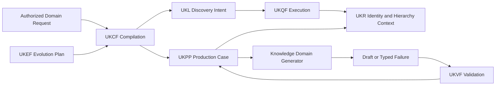
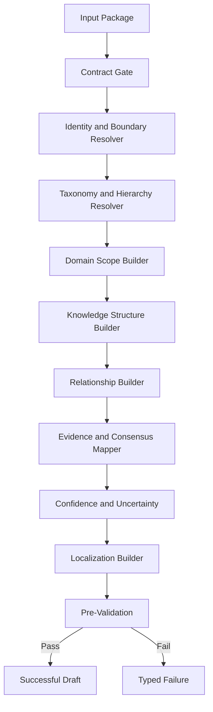
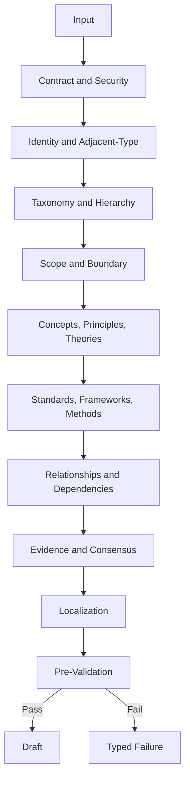
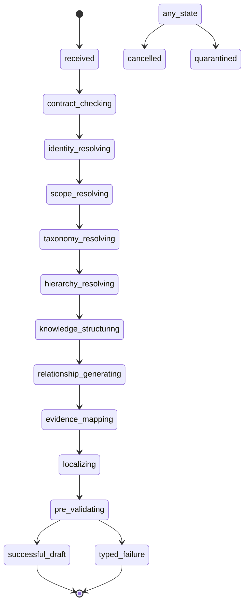
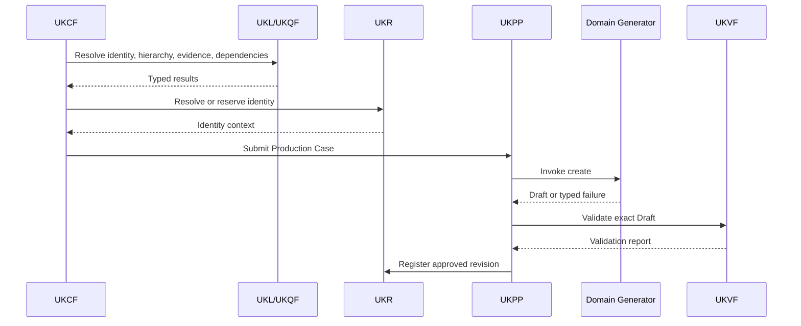
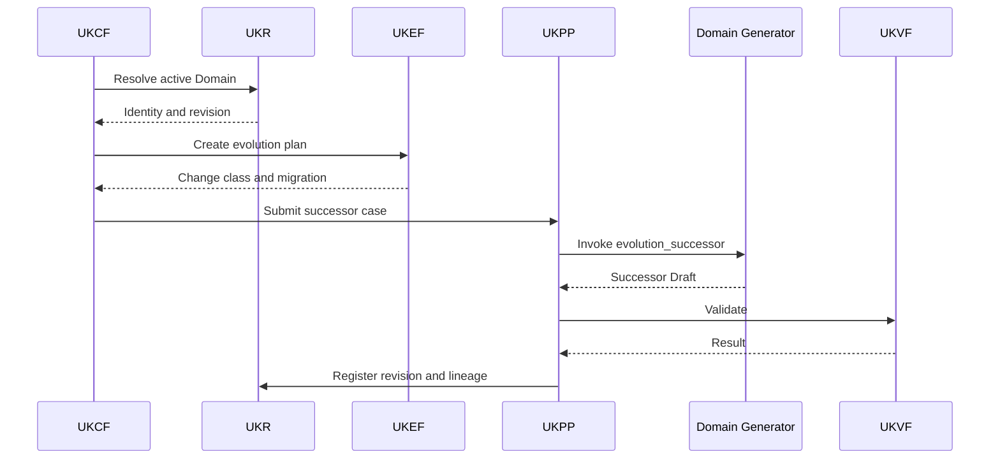
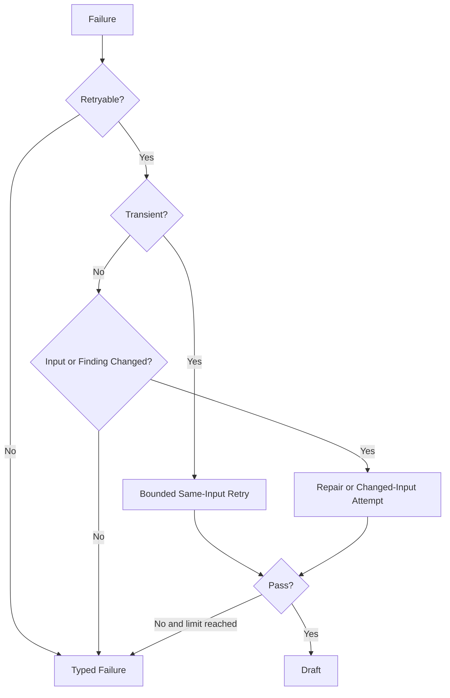

# Knowledge Domain Generator V1

**Product:** KarirGPS  
**Document Type:** Production Entity Generator Specification  
**Generator ID:** `generator:knowledge_domain`  
**Entity Type:** Knowledge Domain  
**Ontology Class:** `Knowledge Domain`  
**Object Kind:** Entity Object  
**Generator Version:** 1.0.0  
**Status:** Normative Production Baseline  
**Certification Target:** Production Certified  
**UEGF Baseline:** 1.0  
**Generator Development Standard:** 1.0.0  
**Target Path:** `assets/knowledge/generators/knowledge_domain/Knowledge_Domain_Generator_V1.md`  
**Governance Owner:** Knowledge Generator Architecture  
**Domain Steward:** Knowledge Domain and Discipline Ontology Steward  

**Authoritative Dependencies**

- AI Constitution
- Career Knowledge Ontology
- Knowledge Object Specification
- Universal Entity Generator Framework
- Universal Knowledge Production Pipeline
- Universal Knowledge Validation Framework
- Universal Knowledge Registry Framework
- Universal Knowledge Language Framework
- Universal Knowledge Query Framework
- Universal Knowledge Evolution Framework
- Universal Knowledge Compilation Framework
- Generator Development Standard V1
- Career Generator V1
- Skill Generator V1
- Competency Generator V1

---

## 0. Normative Status, Inheritance, and Generator Boundary

### 0.1 Status

Knowledge Domain Generator V1, hereafter **Knowledge Domain Generator**, is the production UEGF-derived Entity Generator for the Ontology class `Knowledge Domain`.

It defines only Knowledge Domain-specific generation behavior and inherits every universal contract from the authoritative architecture.

### 0.2 Definition

A Knowledge Domain is a coherent body of knowledge that can be studied, organized, taught, learned, applied, extended, and referenced. It may contain concepts, principles, theories, models, laws, methods, methodologies, standards, frameworks, accepted practices, intellectual traditions, subdomains, and application contexts.

It is not:

- Skill;
- Competency;
- Career;
- Technology;
- Tool;
- Course;
- Education Program;
- Major;
- Degree;
- Certification;
- Work Task;
- Work Activity;
- one publication;
- one standard;
- one methodology;
- one software product.

### 0.3 Authority Precedence

Apply this order:

1. applicable law, safety, privacy, licensing, research ethics, and rights;
2. AI Constitution;
3. Career Knowledge Ontology;
4. KOS;
5. UEGF;
6. UKPP;
7. UKVF;
8. UKR;
9. UKL;
10. UKQF;
11. UKEF;
12. UKCF;
13. Generator Development Standard V1;
14. Knowledge Domain Generator V1;
15. approved prompt assets;
16. execution request.

Lower authority MUST NOT weaken higher authority.

### 0.4 Normative Terms

- **MUST** and **MUST NOT** are mandatory.
- **SHOULD** and **SHOULD NOT** require documented justification when waived.
- **MAY** is optional.
- **CONDITIONAL** applies only when its condition is met.

### 0.5 Generator Authority

Knowledge Domain Generator may:

- validate an authorized input package;
- generate one Draft Knowledge Domain Entity Object;
- generate domain scope and knowledge-boundary semantics;
- classify the Domain in approved taxonomies and hierarchies;
- identify concepts, principles, theories, standards, frameworks, methodologies, and best-practice references from supplied evidence;
- generate proposed relationships;
- map claims to supplied Evidence IDs;
- generate localization modules;
- produce pre-validation findings;
- return a typed Draft or typed failure.

It may not:

- create or approve canonical IDs;
- query storage, graph, vector, search, or external network systems directly;
- generate dependent entities;
- define a universal taxonomy;
- generate curricula or credentials;
- turn a standard, framework, method, Technology, or Tool into the Domain identity;
- validate, register, publish, merge, split, or evolve knowledge directly;
- use model memory as evidence;
- declare scholarly consensus without evidence.

### 0.6 Invariants

Every successful result MUST:

1. represent exactly one Knowledge Domain identity;
2. use KOS `Entity Object`;
3. use Ontology class `Knowledge Domain` or approved subtype;
4. remain in `Draft`;
5. use UKR-supplied identity context;
6. define `domain_scope`;
7. define `knowledge_boundary`;
8. remain distinct from every excluded adjacent entity;
9. separate concepts, principles, theories, standards, frameworks, methodologies, and practices;
10. provide cycle-free, evidence-backed hierarchy;
11. treat academic, professional, scientific, applied, interdisciplinary, regulated, and emerging categories as separate axes where supported;
12. externalize volatile demand, course, Tool, and market data;
13. map every material claim to Evidence IDs;
14. use Ontology-resolved predicates and typed references;
15. preserve disagreement and uncertainty;
16. fabricate nothing;
17. return exactly one successful Draft or typed failure;
18. never claim validation, registration, publication, or evolution completion;
19. be deterministic at its contract boundary;
20. be fully auditable without private chain of thought.

### 0.7 UEGF Extension Pack

This specification implements all mandatory UEGF extension points: descriptor, identity, scope, adjacent-entity matrix, core fields, evidence, relationships, output, validation, confidence, failures, forbidden behaviors, quality, naming, localization, acceptance, future compatibility, governance, and version records.

---

# 1. Purpose

Knowledge Domain Generator produces one structured Draft Knowledge Domain Entity Object representing a coherent body of knowledge with an explicit semantic scope, intellectual boundary, internal structure, evidence base, hierarchy, and application relationships.

It standardizes production for:

- single objects;
- UKCF recursive compilation;
- Career, Skill, Competency, Education, and credential packages;
- taxonomy import;
- localization;
- evidence refresh;
- Draft revision;
- repair;
- UKEF successor revision;
- distributed batch production.

A generated object must explain:

- what body of knowledge is represented;
- what is included and excluded;
- where it sits academically, professionally, and scientifically;
- which concepts, principles, theories, standards, frameworks, and methodologies matter;
- which subdomains and related Domains exist;
- how it relates to work, education, Technology, credentials, and resources;
- what is stable, contextual, disputed, historical, or evolving.

---

# 2. Scope

## 2.1 In Scope

Valid Domains:

- academic disciplines;
- professional bodies of knowledge;
- scientific fields;
- applied Domains;
- interdisciplinary Domains;
- regulated Domains;
- emerging Domains;
- cross-domain foundational bodies of knowledge.

## 2.2 Required Characteristics

A candidate must:

1. represent a coherent body of knowledge;
2. have concepts or intellectual structures independent of one Tool or Course;
3. have a stable semantic boundary;
4. not be defined primarily as observable action;
5. not be defined primarily as demonstrated performance;
6. not be an educational product or credential;
7. remain meaningful across more than one learning or application context.

## 2.3 Successor Scope

A successor Draft requires exact identity and revision context. Active or Published bases additionally require an approved UKEF Evolution Plan, target semantic version, compatibility, effective time, and dependency impact.

## 2.4 Out of Scope

The generator MUST NOT generate Skills, Competencies, Careers, Technologies, Tools, Courses, Education Programs, Majors, Degrees, Certifications, Learning Resources, Work Tasks, Work Activities, learner records, research publications, or datasets.

---

# 3. Responsibilities

The generator is responsible for:

- input contract validation;
- identity and adjacent-type checks;
- Domain taxonomy;
- academic, professional, and scientific hierarchy;
- domain scope and knowledge boundary;
- concept, principle, theory, standard, framework, methodology, and practice modules;
- application and prerequisite relationships;
- evidence mapping;
- consensus, disagreement, and uncertainty;
- localization;
- pre-validation;
- typed outcomes;
- audit metadata.

---

# 4. Non-Responsibilities

The generator is not responsible for:

- teaching or assessing the Domain;
- creating curricula, Courses, Programs, Majors, Degrees, or Certifications;
- generating Skills or Competencies;
- creating research outputs;
- deciding learner knowledge;
- defining universal Career requirements;
- collecting evidence outside UKPP/UKQF;
- Registry operations;
- UKVF approval;
- publication;
- evolution governance;
- job-demand forecasting;
- selecting one disputed theory as universal truth.

---

# 5. Supported Object Types and Generation Modes

## 5.1 Object Type

Primary output:

- KOS `Entity Object`;
- Ontology class `Knowledge Domain`;
- approved subtypes only, including academic, professional, scientific, applied, interdisciplinary, regulated, or emerging classifications where registered.

## 5.2 Modes

- `create`
- `revise`
- `enrich`
- `localize`
- `evidence_refresh`
- `repair`
- `evolution_successor`

## 5.3 Mode Semantics

- `create`: new Draft for UKR-resolved or reserved identity.
- `revise`: successor Draft for nonpublished revision.
- `enrich`: backward-compatible, evidence-supported expansion.
- `localize`: localized terminology without identity change.
- `evidence_refresh`: evidence, source, conflict, and confidence refresh.
- `repair`: exact UKVF finding remediation.
- `evolution_successor`: successor Draft under UKEF.

Unsupported modes include direct register, publish, merge, split, delete, curriculum generation, assessment, taxonomy creation, and unrestricted free generation.

---

# 6. Architecture and Framework Bindings

## 6.1 Architecture



## 6.2 Internal Components



## 6.3 Framework Binding Matrix

| Concern | Authority | Generator Role |
|---|---|---|
| Safety, rights, integrity | AI Constitution | Enforce |
| Domain semantics | Ontology | Resolve and obey |
| Object structure | KOS | Produce compliant Draft |
| Generator kernel | UEGF | Implement extension pack |
| Production lifecycle | UKPP | Execute only as invoked |
| Validation | UKVF | Prepare candidate and consume findings |
| Identity | UKR | Consume identity context |
| Query intent | UKL | Consume compiler plan |
| Query execution | UKQF | Consume typed results |
| Evolution | UKEF | Produce successor under plan |
| Compilation | UKCF | Consume typed invocation |
| Engineering | GDS V1 | Follow repository and certification rules |
| Career boundary | Career Generator V1 | Preserve |
| Skill boundary | Skill Generator V1 | Preserve |
| Competency boundary | Competency Generator V1 | Preserve |

---

# 7. Required Inputs

The input package MUST include:

- Generator Request;
- Execution Context;
- Contract Lock;
- Identity Resolution;
- Domain Scope Resolution;
- Taxonomy and Hierarchy Context;
- Knowledge Structure Manifest;
- Evidence Bundle;
- Existing Knowledge Package when applicable;
- Dependency Manifest;
- Prompt Binding;
- Security Context;
- Audit Context.

Conditional packages:

- Localization Context;
- UKEF Evolution Plan;
- Repair Context;
- Regulated Domain Context;
- Scientific Consensus Context;
- Emerging Domain Context.

Required identity fields include disposition, Entity ID or reservation, Object ID and base Revision ID when existing, duplicate candidates, merge/split indicators, and confidence.

Required scope fields include proposed definition, included and excluded knowledge, abstraction level, subtype candidates, adjacent entities, and stability assumptions.

Required knowledge-structure inputs may include concept, principle, theory, standard, framework, methodology, practice, application, learning-sequence, and dispute candidates.

---

# 8. Input Schema

```yaml
schema_id: knowledge_domain_generator_input_v1
generator:
  id: generator:knowledge_domain
  version: 1.0.0
request:
  request_id: string
  compilation_id: string
  production_case_id: string
  mode: create | revise | enrich | localize | evidence_refresh | repair | evolution_successor
  purpose: string
  target_label: string
  requested_entity_type: KnowledgeDomain
  requested_subtype: academic | professional | scientific | applied | interdisciplinary | regulated | emerging | null
  target_locale: bcp47
  desired_readiness: draft | ukvf_submission | human_review
context:
  geography_ref: optional_typed_reference
  jurisdiction_ref: optional_typed_reference
  academic_context_ref: optional_typed_reference
  professional_context_ref: optional_typed_reference
  scientific_context_ref: optional_typed_reference
  effective_at: date_or_datetime
  security_profile: string
  recursion_depth: integer
contract_lock:
  constitution_version: string
  ontology_version: string
  kos_version: string
  uegf_version: string
  ukpp_version: string
  ukvf_version: string
  ukr_version: string
  ukl_version: string
  ukqf_version: string
  ukef_version: string
  ukcf_version: string
  gds_version: string
  generator_version: string
  input_schema_version: string
  output_schema_version: string
identity_resolution:
  disposition: exact_existing | reserved_new | ambiguous | merge_review | split_review | blocked
  entity_id: optional_reference
  reservation_ref: optional_reference
  object_id: optional_reference
  base_revision_id: optional_reference
  candidates: []
  confidence: confidence_level
scope_resolution:
  domain_definition_candidate: string
  included_scope: []
  excluded_scope: []
  abstraction_level: broad | intermediate | narrow
  category_candidates: []
  adjacent_entity_candidates: []
taxonomy_hierarchy:
  parent_domain_refs: []
  subdomain_refs: []
  related_domain_refs: []
  external_mappings: []
  cycle_check_graph_ref: typed_reference
knowledge_structure:
  concept_candidates: []
  principle_candidates: []
  theory_candidates: []
  standard_refs: []
  framework_refs: []
  methodology_refs: []
  best_practice_refs: []
  disputed_propositions: []
evidence_bundle:
  evidence_entries: []
existing_knowledge:
  base_object: optional_reference
  base_revision: optional_payload_reference
  hierarchy: {}
  knowledge_structure: {}
  relationships: []
  validation_findings: []
dependency_manifest:
  mandatory: []
  optional: []
  unresolved: []
prompt_binding:
  system_prompt_id: string
  invocation_prompt_id: string
  output_schema_id: string
  model_lane: string
evolution_plan:
  evolution_case_id: optional_reference
  change_class: optional_string
  target_version: optional_semver
repair_context:
  prior_attempt_id: optional_string
  finding_refs: []
  allowed_fields: []
audit:
  actor_ref: typed_reference
  correlation_id: string
  causation_id: optional_string
```

The input gate MUST reject wrong entity type, unsupported mode, incomplete contract lock, ambiguous identity, absent scope or boundary, missing core evidence, Published revision without UKEF, invalid subtype, missing prompt binding, or recursion depth above the UKCF profile.

---

# 9. Required Outputs

Exactly one outcome:

- `successful_draft`;
- `typed_failure`.

A successful output contains:

- generator metadata;
- target identity context;
- Draft Domain payload;
- taxonomy and hierarchy manifest;
- concept, principle, theory, standard, framework, methodology, and practice manifests;
- evidence, relationship, and dependency manifests;
- confidence and uncertainty;
- pre-validation;
- audit metadata.

A failure contains stable code, category, severity, affected fields, retryability, remediation, context, and audit data.

The output MUST NOT claim validation, registration, publication, identity creation, learner knowledge, curricular completeness, or scholarly consensus beyond supplied evidence.

---

# 10. Output Schema and Canonical Contract

```yaml
schema_id: knowledge_domain_generator_output_v1
outcome: successful_draft
generator:
  id: generator:knowledge_domain
  version: 1.0.0
  system_prompt_id: prompt:knowledge_domain:system:1.0.0
  invocation_prompt_id: prompt:knowledge_domain:create:1.0.0
  model_lane: qualified_lane_reference
target:
  object_kind: entity_object
  entity_type: KnowledgeDomain
  ontology_class_ref: ontology:KnowledgeDomain
  entity_id: resolved_or_reserved_reference
  object_id: optional_existing_reference
  base_revision_id: optional_reference
draft:
  lifecycle_state: Draft
  semantic_version: 1.0.0
  contract_and_identity: {}
  naming_and_localization: {}
  definition_and_scope: {}
  domain_core: {}
  taxonomy_and_hierarchy: {}
  concepts: []
  principles: []
  theories_and_models: []
  standards_and_frameworks: []
  methodologies: []
  best_practices: []
  application_contexts: []
  lifecycle_and_evolution: {}
  relationships: []
  evidence_and_sources: {}
  confidence_conflict_uncertainty: {}
  governance_quality_readiness: {}
  generation_audit: {}
taxonomy_manifest: {}
concept_manifest: []
principle_manifest: []
theory_manifest: []
standard_framework_manifest: []
methodology_practice_manifest: []
evidence_manifest: []
relationship_manifest: []
dependency_manifest: []
pre_validation:
  status: pass | pass_with_warnings
  findings: []
audit:
  input_fingerprint: string
  output_fingerprint: string
  generated_at: datetime
```

Canonical module order:

1. Contract and Identity
2. Naming and Localization
3. Definition and Scope
4. Domain Core
5. Taxonomy
6. Academic Hierarchy
7. Professional Hierarchy
8. Scientific Hierarchy
9. Stable Boundary
10. Concepts
11. Principles
12. Theories and Models
13. Standards
14. Frameworks
15. Methodologies
16. Best Practices
17. Application Contexts
18. Learning and Prerequisite Structure
19. Lifecycle and Evolution
20. Relationships
21. Dependencies
22. Evidence and Sources
23. Confidence, Conflict, and Uncertainty
24. Governance and Lifecycle
25. Quality and Readiness
26. Generation and Audit

---

# 11. Generation Pipeline

1. Validate envelope.
2. Verify contract lock.
3. Verify security and authorization.
4. Interpret UKR identity.
5. Apply Domain identity test.
6. Exclude adjacent entity types.
7. Resolve subtype and taxonomy.
8. Resolve academic, professional, and scientific hierarchy.
9. Define scope.
10. Define stable knowledge boundary.
11. Build core semantics.
12. Generate concepts.
13. Generate principles.
14. Generate theories and models.
15. Generate Standard and Framework references.
16. Generate methodologies.
17. Generate best practices.
18. Generate application and learning context.
19. Generate relationships.
20. Map all claims to evidence.
21. Represent consensus, dispute, and uncertainty.
22. Localize.
23. Pre-validate.
24. Emit Draft or failure.



Rules:

- evidence first;
- boundary before structure;
- no layer collapse;
- stable core separate from volatile context.

---

# 12. Generator State Machine

States:

- `received`
- `contract_checking`
- `identity_resolving`
- `scope_resolving`
- `taxonomy_resolving`
- `hierarchy_resolving`
- `knowledge_structuring`
- `relationship_generating`
- `evidence_mapping`
- `localizing`
- `pre_validating`
- `successful_draft`
- `typed_failure`
- `cancelled`
- `quarantined`



---

# 13. Sequence Diagrams

## 13.1 New Domain



## 13.2 Published Successor



---

# 14. Prompt Templates

Required assets:

- `prompt:knowledge_domain:system:1.0.0`
- `prompt:knowledge_domain:create:1.0.0`
- `prompt:knowledge_domain:revise:1.0.0`
- `prompt:knowledge_domain:enrich:1.0.0`
- `prompt:knowledge_domain:localize:1.0.0`
- `prompt:knowledge_domain:evidence_refresh:1.0.0`
- `prompt:knowledge_domain:repair:1.0.0`
- `prompt:knowledge_domain:evolution_successor:1.0.0`

### System Prompt

```text
You are Knowledge Domain Generator V1 for KarirGPS.

Generate exactly one Draft Knowledge Domain Entity Object or one typed failure.

A Knowledge Domain is a coherent body of knowledge containing concepts,
principles, theories, methods, standards, frameworks, and intellectual foundations
within a defined boundary.

It is not a Skill, Competency, Career, Technology, Tool, Course,
Education Program, Major, Degree, Certification, Task, Activity,
one Standard, one Framework, one Methodology, one publication, or one product.

Obey the supplied contract lock, identity resolution, Ontology terms,
KOS schema, scope, hierarchy, knowledge structure, evidence,
dependencies, security, and generation mode.

Do not create canonical IDs or dependent objects.
Do not retrieve external data.
Do not fabricate concepts, theories, evidence, consensus, aliases, or relationships.
Do not claim validation, registration, publication, or universal consensus.
Do not expose private chain of thought.

Map every material claim to supplied Evidence IDs.
Keep concepts, principles, theories, Standards, Frameworks,
methodologies, and best practices distinct.
Return only the declared output schema.
```

### Create Prompt

```text
MODE: create
GENERATOR_REQUEST: {{generator_request}}
CONTRACT_LOCK: {{contract_lock}}
IDENTITY_RESOLUTION: {{identity_resolution}}
DOMAIN_SCOPE: {{scope_resolution}}
TAXONOMY_AND_HIERARCHY: {{taxonomy_hierarchy}}
KNOWLEDGE_STRUCTURE: {{knowledge_structure}}
EVIDENCE_BUNDLE: {{evidence_bundle}}
DEPENDENCY_MANIFEST: {{dependency_manifest}}

Produce one Draft Knowledge Domain Object.
Return typed failure if any non-waivable condition fails.
```

### Revise Prompt

```text
MODE: revise
BASE_OBJECT: {{base_object}}
AUTHORIZED_CHANGE_REQUEST: {{change_request}}
VALIDATION_CONTEXT: {{validation_context}}

Update only authorized fields.
Preserve identity.
Do not alter published knowledge without UKEF.
```

### Enrich Prompt

```text
MODE: enrich
BASE_OBJECT: {{base_object}}
NEW_EVIDENCE: {{evidence_bundle}}
ENRICHMENT_SCOPE: {{allowed_fields}}

Add only compatible, evidence-supported content.
Do not broaden identity silently.
```

### Localize Prompt

```text
MODE: localize
SOURCE_DOMAIN: {{source_domain}}
TARGET_LOCALE: {{target_locale}}
TERMINOLOGY_AUTHORITY: {{terminology_authority}}

Preserve identity and knowledge boundary.
Flag non-equivalent disciplinary terminology.
```

### Evidence Refresh Prompt

```text
MODE: evidence_refresh
BASE_OBJECT: {{base_object}}
CURRENT_EVIDENCE: {{current_evidence}}
NEW_EVIDENCE: {{new_evidence}}

Refresh evidence, consensus, conflict, and confidence only.
```

### Repair Prompt

```text
MODE: repair
PRIOR_ATTEMPT: {{prior_attempt}}
UKVF_FINDINGS: {{finding_refs}}
ALLOWED_REPAIR_SCOPE: {{allowed_fields}}

Repair only cited findings.
Return typed failure if a broader semantic change is required.
```

### Evolution Successor Prompt

```text
MODE: evolution_successor
BASE_REVISION: {{base_revision}}
UKEF_EVOLUTION_PLAN: {{evolution_plan}}
DEPENDENCY_IMPACT: {{dependency_impact}}

Produce one successor Draft within the approved identity,
version, time, and compatibility.
```

---

# 15. Knowledge Domain Identity Rules

A valid Domain has:

- one coherent body of knowledge;
- an identifiable intellectual subject;
- stable scope and boundary;
- recognizable concept structure;
- meaning independent of one Tool, Course, Skill, or credential;
- supported hierarchy and aliases.

Adjacent entity matrix:

| Candidate | Domain? | Decision |
|---|---:|---|
| Civil Engineering | Yes | Coherent academic, scientific, professional Domain |
| Structural Engineering | Yes | Narrower Domain |
| Python Programming | No | Skill |
| Python | No | Technology/language entity |
| Software Engineering | Contextual | Domain when body of knowledge; Competency when performance |
| Project Management | Contextual | Domain, Skill, Competency, or function |
| BIM | Contextual | Domain only with body-of-knowledge boundary |
| Machine Learning | Yes | Domain; distinct Skill and Technology identities may coexist |
| PMP | No | Certification |
| Bachelor of Civil Engineering | No | Degree/Program |
| Scrum Guide | No | Framework/standard reference |
| Data Science Course | No | Course/Learning Resource |

Identity rules:

- broad, intermediate, and narrow Domains are allowed;
- narrow Domains must be broader than one method or Standard;
- interdisciplinary identity requires stable integrated subject and recognition;
- locale, Tool, textbook, curriculum, standard version, or methodology does not create a new Domain by itself;
- lexical similarity is insufficient for alias or identity equivalence.

---

# 16. Naming and Localization Strategy

Canonical names MUST:

- use recognized disciplinary terminology;
- identify the body of knowledge;
- avoid provider branding, course wording, Skill verbs, credential suffixes, and Tool names.

Alias types:

- exact alias;
- abbreviation;
- historical name;
- localized name;
- academic classification label;
- professional classification label;
- scientific classification label;
- deprecated label;
- close but nonexact term.

Localization may adapt name, definition, scope, concept labels, theory display names, and disambiguation while preserving identity and boundary.

Acronyms such as AI, BIM, HRM, and ML require explicit disambiguation. Transliteration alone does not prove equivalence. Named theories and official Standards retain canonical external references.

---

# 17. Domain Core Generation Rules

Mandatory KOS fields:

- `domain_scope`;
- `knowledge_boundary`.

Additional generator-required fields:

- canonical definition;
- organizing concerns;
- principal knowledge forms;
- hierarchy disposition;
- evidence basis.

Optional fields include subdomains, concepts, related disciplines, application contexts, learning sequence, principles, theories, standards, frameworks, methodologies, best practices, traditions, and lifecycle status.

Forbidden intrinsic fields include:

- observable capability as primary definition;
- person knowledge level;
- universal Career requirement;
- current market demand or salary;
- one curriculum;
- one Tool version;
- one Certification status;
- one Standard, Framework, or Method treated as complete Domain;
- guaranteed practical outcome.

Organizing concerns identify the objects, systems, phenomena, questions, or decisions addressed. Knowledge forms may be descriptive, explanatory, predictive, normative, procedural, design-oriented, mathematical, empirical, interpretive, or regulatory.

---

# 18. Domain Taxonomy

Taxonomy uses separate axes:

- academic discipline;
- professional Domain;
- scientific field;
- applied or theoretical orientation;
- interdisciplinary status;
- regulated status;
- methodological orientation;
- lifecycle;
- abstraction level.

Classification requires Ontology rules and authoritative evidence.

External mappings use exact, broader, narrower, related, split, merged, deprecated, or no-mapping status.

Conflicting taxonomies remain contextual. No external taxonomy becomes the universal canonical hierarchy automatically.


# 19. Academic Discipline Hierarchy

## 19.1 Definition

Academic hierarchy represents how scholarly communities, universities, and educational classifications organize bodies of knowledge.

## 19.2 Parent–Child Rule

A child Domain must be:

- intellectually narrower than the parent;
- semantically included in the parent;
- supported by academic classification or scholarly evidence;
- distinct enough to maintain its own identity.

## 19.3 Academic Examples

Valid patterns include:

- Engineering → Civil Engineering → Structural Engineering;
- Computing → Software Engineering;
- Business and Management → Marketing;
- Business and Management → Human Resource Management;
- Architecture and Built Environment → Building Information Modeling.

These examples are logical fixtures. Production use requires exact Ontology and UKR references.

## 19.4 Program Boundary

A Major, Degree, Course, or Education Program may teach or contain a Domain but is never its parent identity solely because of curriculum structure.

## 19.5 Polyhierarchy

Interdisciplinary Domains may have multiple academic parents. Every edge retains source taxonomy, mapping type, scope, and evidence.

## 19.6 Cycle Rules

The generator MUST reject:

- self-parent;
- direct cycle;
- indirect cycle;
- simultaneous broader and narrower assertion for the same context;
- an educational offering used as a parent Domain.

---

# 20. Professional Domain Hierarchy

## 20.1 Definition

Professional hierarchy represents bodies of knowledge recognized through occupational practice, professional associations, regulatory authorities, bodies of knowledge, or practice standards.

## 20.2 Professional Domain Requirements

A Professional Domain must have:

- a coherent practice-related knowledge scope;
- recognition independent of one employer;
- authoritative professional or occupational evidence;
- relationships to Skills and Competencies without becoming them;
- explicit jurisdiction when regulated.

## 20.3 Professional Examples

- Project Management;
- Construction Management;
- Accounting;
- Cybersecurity;
- Human Resource Management;
- Marketing;
- Finance.

## 20.4 Professional Framework Boundary

A professional body of knowledge, guide, framework, or standard is a source or structured reference within the Domain. It is not automatically the Domain identity.

## 20.5 Organizational Framework Boundary

One organization’s knowledge framework may map to a canonical Domain but cannot define universal scope without broader evidence.

---

# 21. Scientific Domain Hierarchy

## 21.1 Definition

Scientific hierarchy represents fields organized around systematic inquiry, explanatory or predictive models, empirical evidence, mathematical structures, design science, or scientific methods.

## 21.2 Scientific Domain Requirements

A Scientific Domain should identify:

- object or phenomenon of study;
- core concepts;
- theories or model families;
- methods of inquiry;
- evidence traditions;
- consensus and dispute structure;
- parent and neighboring fields.

## 21.3 Scientific Examples

- Artificial Intelligence;
- Machine Learning;
- Data Science;
- Structural Engineering as engineering science;
- Cybersecurity as computing and security science.

## 21.4 Emerging Scientific Field

An emerging scientific field requires:

- evidence of field recognition;
- stable-core rationale;
- terminology history;
- relationship to parent fields;
- review date;
- uncertainty.

## 21.5 Theory Plurality

The generator MUST preserve competing or complementary theories. It MUST NOT synthesize false consensus to simplify the Domain.

---

# 22. Domain Scope and Stable Semantic Boundary

## 22.1 Domain Scope

`domain_scope` MUST define:

- subjects;
- phenomena;
- systems;
- questions;
- knowledge forms;
- principal methods;
- application areas;
- level of abstraction.

## 22.2 Knowledge Boundary

`knowledge_boundary` MUST define:

- included knowledge;
- excluded adjacent knowledge;
- overlap with related Domains;
- relationship to practice;
- relationship to education;
- relationship to Technology and Tools;
- relationship to Skills and Competencies.

## 22.3 Stable Boundary Test

The boundary should remain meaningful despite:

- one Standard revision;
- one Tool change;
- one Course redesign;
- one Certification update;
- one methodology change;
- one temporary trend.

## 22.4 Overlap

Overlap between Domains is allowed. The generator records:

- shared concepts;
- distinct organizing concerns;
- mapping type;
- context;
- evidence.

## 22.5 Broad and Narrow Control

Broad Domains MUST identify major subdomains. Narrow Domains MUST remain broader than one isolated method, software product, Standard, or Skill.

## 22.6 Application Boundary

Application contexts show where knowledge is used. An application context alone does not establish a distinct Domain identity.

---

# 23. Concepts

## 23.1 Definition

A Concept is a fundamental idea, category, object, relation, construct, or abstraction used within the Domain.

## 23.2 Selection Rules

Include concepts that are:

- central to understanding the Domain;
- structurally important;
- recurrent across authoritative sources;
- necessary to distinguish the Domain from adjacent Domains;
- useful for retrieval, learning, or reasoning.

## 23.3 Concept Schema

```yaml
concept_id: fixture:concept:structural_load
label: Structural Load
definition: A force, action, or imposed condition considered when evaluating structural response.
centrality: core
status: established
evidence_refs:
  - fixture:evidence:structural_engineering_reference
confidence: high
```

## 23.4 Concept Entity Boundary

An inline concept entry does not create a canonical Concept Object. If the Ontology supports Concept entities, UKCF must compile them separately.

## 23.5 Granularity

The concept manifest is not a glossary dump. It includes only concepts material to Domain identity, hierarchy, or reasoning.

## 23.6 Synonymy

Lexical similarity is insufficient for Concept equivalence. Aliases require evidence and scope compatibility.

---

# 24. Principles

## 24.1 Definition

A Principle is a foundational proposition, rule, constraint, or normative orientation used to organize reasoning or practice within the Domain.

## 24.2 Principle Types

- scientific;
- mathematical;
- engineering;
- design;
- ethical;
- accounting;
- management;
- legal or regulatory;
- security;
- methodological.

## 24.3 Principle Schema

```yaml
principle_id: fixture:principle:accounting_consistency
statement: Comparable reporting requires consistent application of relevant accounting policies unless a justified change is disclosed.
scope: financial_reporting
status: established
authority_ref: fixture:organization:accounting_standard_setter
evidence_refs:
  - fixture:evidence:accounting_standard
confidence: high
```

## 24.4 Scope and Limits

Every principle should identify:

- applicable context;
- exceptions;
- authority;
- evidence;
- whether it is descriptive, normative, or methodological.

## 24.5 Prohibition

The generator MUST NOT present professional guidance or a local convention as a natural law.

---

# 25. Theories and Models

## 25.1 Theory

A Theory explains, organizes, or predicts phenomena within the Domain.

## 25.2 Model

A Model is a representation used for explanation, analysis, simulation, prediction, design, or decision support.

## 25.3 Entry Schema

```yaml
theory_or_model_ref: fixture:theory:portfolio_theory
type: theory
role_in_domain: Provides a formal approach to analyzing risk and return across asset combinations.
status: established_with_assumptions
scope: investment_analysis
limitations:
  - depends on assumptions and input quality
evidence_refs:
  - fixture:evidence:finance_academic_reference
confidence: high
```

## 25.4 Competing Theories

Competing theories MUST be:

- represented separately;
- scoped;
- evidence-linked;
- marked competing, complementary, historical, or disputed;
- preserved without forced reconciliation.

## 25.5 Status Vocabulary

Use registered statuses such as:

- established;
- widely_used;
- developing;
- contested;
- historical;
- deprecated.

## 25.6 Proprietary Models

Proprietary models may be referenced only when permitted and sufficiently described for their Domain role without reproducing protected content.

---

# 26. Standards

## 26.1 Definition

A Standard is an authoritative documented requirement, specification, guideline, or agreed convention issued by a recognized body.

## 26.2 Standard Role

A Standard may:

- define terminology;
- establish quality, safety, or interoperability requirements;
- constrain methods;
- classify information;
- govern professional practice;
- support assessment or Certification.

It remains separate from the Domain.

## 26.3 Required Standard Metadata

- issuing body;
- canonical identifier;
- title;
- version;
- publication date;
- effective period;
- status;
- jurisdiction or recognition scope;
- source reference;
- applicability to the Domain.

## 26.4 Multiple Standards

Overlapping or competing Standards may coexist. The generator records applicability and does not select one globally without authority.

## 26.5 Historical Standards

Superseded Standards remain historically resolvable through prior relationships and revisions.

---

# 27. Frameworks

## 27.1 Definition

A Framework is a structured conceptual, procedural, classification, governance, risk, lifecycle, architectural, or analytical arrangement used within the Domain.

## 27.2 Required Metadata

- owner;
- purpose;
- scope;
- version;
- status;
- applicable context;
- relationship to concepts or methods;
- evidence.

## 27.3 Boundary Rule

A Framework may organize part of a Domain. It is not the Domain itself unless identity evidence independently establishes that equivalence.

## 27.4 Organization-Specific Framework

Organization-specific frameworks remain contextual. They may map to canonical Domain concepts without becoming universal facts.

---

# 28. Methodologies

## 28.1 Definition

A Methodology is an organized system of methods, assumptions, principles, processes, and decision rules used to investigate, design, analyze, or act within a Domain.

## 28.2 Method Versus Methodology

A method is one technique. A methodology explains how methods are selected, combined, sequenced, and justified.

## 28.3 Required Metadata

- objective;
- scope;
- assumptions;
- procedure class;
- limitations;
- evidence;
- status;
- related Skills, Tools, or Standards;
- applicable context.

## 28.4 Boundary Rule

The generator MUST NOT create a new Domain identity for every method or methodology.

## 28.5 Version Sensitivity

Technology-dependent methodologies require Technology context, effective time, and review date.

---

# 29. Best Practices

## 29.1 Definition

A Best Practice is an evidence-supported or authoritative recommended practice for a defined context.

## 29.2 Required Scope

Every practice must identify:

- context;
- authority;
- evidence;
- alternatives;
- limitations;
- maturity;
- review or expiration date when volatile.

## 29.3 Prohibitions

The generator MUST NOT claim:

- universal superiority;
- guaranteed results;
- timeless applicability;
- universal consensus;
- mandatory status unless a Standard or authority makes it mandatory.

## 29.4 Practice Status

Distinguish:

- required by Standard;
- recommended by Framework;
- evidence-supported;
- common practice;
- emerging practice;
- historical practice.

---

# 30. Knowledge Evolution and Domain Lifecycle

## 30.1 Lifecycle Context

KOS lifecycle remains authoritative. Domain-specific states may describe:

- established;
- emerging;
- expanding;
- consolidating;
- contested;
- interdisciplinary;
- historical;
- deprecated terminology;
- split field;
- merged field.

## 30.2 Identity Continuity

A Domain normally retains identity while its concepts, theories, methods, standards, applications, or subdomains evolve, provided the body-of-knowledge core and boundary remain continuous.

## 30.3 New Identity Conditions

A new identity may be required when:

- a broad Domain splits into independently coherent fields;
- historical labels prove non-equivalent;
- a Tool, Technology, method, or Framework was incorrectly treated as a Domain;
- organizing concerns change fundamentally;
- an interdisciplinary field gains stable independent recognition.

## 30.4 Emerging Domain Rules

An Emerging Domain requires:

- field-recognition evidence;
- stable-core rationale;
- parent and neighboring Domain mappings;
- terminology uncertainty;
- time scope;
- review date.

## 30.5 Theory and Standard Change

A new theory or Standard usually changes content or relationships, not Domain identity.

## 30.6 Deprecation

Deprecation, split, merge, and replacement are governed by UKEF and UKR. The generator only produces authorized Draft revisions.

---

# 31. Knowledge Domain Relationships

## 31.1 Career

Logical roles include:

- `applied_by` Career;
- `required_knowledge_for` Career;
- `relevant_to` Career.

Requirement strength is contextual.

## 31.2 Skill

Ontology-supported roles include:

- `supports` Skill;
- `knowledge_basis_for` Skill;
- `applied_through` Skill.

The exact predicate ID must be supplied by the Ontology contract.

## 31.3 Competency

Allowed roles:

- `knowledge_component_of` Competency;
- `required_by` Competency;
- `applied_in` Competency.

## 31.4 Work Task

Allowed roles:

- `applied_in` Work Task;
- `informs` Work Task;
- `required_for` Work Task in context.

## 31.5 Technology

Allowed roles:

- `underpins` Technology;
- `studies` Technology;
- `applied_to` Technology;
- `enabled_by` Technology when contextual.

## 31.6 Tool

Allowed roles:

- `implemented_with` Tool;
- `analyzed_with` Tool;
- `supported_by` Tool.

Tool relationships are usually version-sensitive and contextual.

## 31.7 Education Program

Allowed roles:

- `taught_by` Education Program;
- `contained_in` Education Program;
- `core_to` Education Program.

## 31.8 Major

Ontology-supported roles include:

- `taught_by` Major;
- `core_to` Major;
- `supporting_domain_for` Major.

## 31.9 Certification

Allowed roles:

- `knowledge_scope_of` Certification;
- `assessed_by` Certification;
- `required_for` Certification in context.

Coverage by one Certification does not define the complete Domain.

## 31.10 Learning Resource

Allowed roles:

- `taught_by` Learning Resource;
- `explained_by` Learning Resource;
- `practiced_through` Learning Resource.

## 31.11 Prerequisite Domain

Ontology permits `prerequisite_for` Knowledge Domain. Strength and context must be explicit.

## 31.12 Relationship Schema

```yaml
relationship_id: null
predicate_ref: ontology:supports
source_ref:
  entity_id: fixture:entity:knowledge_domain:structural_engineering
target_ref:
  entity_id: fixture:entity:skill:structural_analysis
direction: outgoing
status: proposed
relevance_level: core
context:
  geography_ref: null
  valid_from: 2026-01-01
  valid_to: null
evidence_refs:
  - fixture:evidence:structural_engineering_body_of_knowledge
confidence: high
```

## 31.13 Forbidden Relationships

- Domain `is_a` Skill, Competency, Career, Tool, Course, or Certification;
- one Standard or Framework `equivalent_to` the complete Domain without identity evidence;
- one Learning Resource `defines` the complete Domain;
- one Certification `owns` the Domain;
- unsupported exact equivalence;
- cyclic hierarchy.

---

# 32. Contextual Knowledge Externalization

The Domain object MUST reference rather than intrinsically store:

- current job demand;
- current salary premium;
- current vacancy counts;
- current Course offerings;
- current Certification cost;
- current Tool versions;
- current professional popularity;
- current research funding;
- forecasts;
- organization-specific curricula;
- jurisdiction-specific requirements;
- organization compliance status.

Example:

```yaml
assertion_ref: fixture:assertion:cybersecurity_demand:id:2026
subject_ref: fixture:entity:knowledge_domain:cybersecurity
predicate: labor_market_demand
context:
  geography_ref: fixture:geography:ID
  valid_period:
    from: 2026-01-01
    to: 2026-12-31
evidence_refs:
  - fixture:evidence:cybersecurity_labor_market_2026
```

Volatile values MUST NOT be copied into the stable Domain core.

---

# 33. Evidence Requirements

## 33.1 Evidence-Covered Claims

Evidence is mandatory for:

- identity;
- definition;
- scope;
- boundary;
- taxonomy;
- hierarchy;
- concepts;
- principles;
- theories;
- standards;
- frameworks;
- methodologies;
- practices;
- prerequisites;
- every material external relationship;
- emerging status;
- external mappings.

## 33.2 Source Preference

Preferred hierarchy:

1. authoritative academic classifications;
2. recognized professional bodies and bodies of knowledge;
3. standards and regulatory authorities;
4. peer-reviewed scholarly sources;
5. recognized scientific or educational taxonomies;
6. authoritative reference works;
7. official technical documentation for Technology-linked scope;
8. high-quality institutional frameworks;
9. verified secondary sources.

## 33.3 Minimum Evidence

A production candidate requires:

- at least one authoritative source for identity and core scope;
- corroboration for broad, interdisciplinary, or disputed boundaries;
- evidence for every hierarchy edge;
- authoritative references for Standards and Frameworks;
- scholarly or authoritative support for theory claims;
- current evidence for emerging status;
- version-specific evidence for Technology-linked applications.

## 33.4 Consensus Claims

Consensus requires multiple independent authoritative sources, scope, date, known dissent, and confidence.

## 33.5 Dispute

Disputed definitions or theories remain visible. The generator MUST NOT choose one position merely to simplify output.

## 33.6 Recency

- stable identity: review on major classification change;
- Standards and Frameworks: version review;
- technical and AI Domains: periodic review;
- regulated Domains: jurisdiction and effective date;
- emerging Domains: frequent review;
- historical theories: status review.

## 33.7 Absence Vocabulary

- `unknown`
- `insufficient_evidence`
- `not_applicable`
- `disputed`
- `context_required`
- `framework_specific`
- `historical`
- `not_yet_registered`

## 33.8 Rights

Every evidence item must have permitted use and citation status.

---

# 34. Claim, Confidence, Conflict, and Uncertainty

Claim classes include stable intrinsic, taxonomic, hierarchy, conceptual, theoretical, methodological, Standards-based, professional, scientific, contextual, historical, emerging, disputed, and inferred proposal.

Confidence dimensions:

- identity;
- scope;
- boundary;
- taxonomy;
- hierarchy;
- concepts;
- principles;
- theories;
- Standards and Frameworks;
- methodologies;
- relationships;
- lifecycle;
- localization;
- object-level.

Use the UEGF confidence vocabulary. Object confidence cannot exceed the weakest critical dimension among identity, boundary, evidence, hierarchy integrity, and mandatory relationship integrity.

Confidence does not mean academic prestige, importance, demand, funding, validation outcome, theoretical certainty, or learner success.

---

# 35. Dependency Handling

Mandatory dependencies:

- identity;
- Ontology;
- KOS;
- scope;
- boundary;
- taxonomy;
- hierarchy;
- core evidence;
- prompt binding;
- UKVF profile;
- security;
- audit.

Conditional dependencies:

- parent and child Domains;
- related disciplines;
- Standards;
- Frameworks;
- Methodologies;
- Careers;
- Skills;
- Competencies;
- Tasks;
- Technologies;
- Tools;
- Education Programs;
- Majors;
- Certifications;
- Learning Resources;
- UKEF plan;
- terminology authorities.

Dependency outcomes:

- resolved and reusable;
- provisional reference allowed;
- optional unresolved;
- mandatory blocker;
- identity conflict;
- version conflict;
- contextual variant;
- scholarly dispute.

The generator MUST NOT invoke dependent generators. UKCF handles recursive compilation.

---

# 36. Validation Integration

Required UKVF profiles:

- Universal Core;
- Entity Object;
- Publication;
- Localization when applicable;
- Regulated Knowledge when applicable;
- Volatile Knowledge for emerging or Technology-sensitive Domains;
- Quantitative when needed;
- High-Impact Reasoning when used consequentially;
- Cross-Object Validation.

Required validators:

- structural;
- schema;
- Ontology;
- identity;
- scope;
- boundary;
- adjacent type;
- taxonomy;
- academic, professional, and scientific hierarchy;
- cycle detection;
- concepts;
- principles;
- theories and consensus;
- Standards and Frameworks;
- methodologies;
- evidence;
- source;
- relationship;
- confidence;
- localization;
- constitutional;
- security;
- evolution compatibility.

Generator pre-validation MUST confirm:

1. schema and entity type;
2. scope and boundary;
3. adjacent-type separation;
4. valid taxonomy;
5. cycle-free hierarchy;
6. supported concepts and principles;
7. typed theories and models;
8. separated Standards, Frameworks, and methodologies;
9. contextualized practices;
10. evidence for all material claims;
11. typed relationships;
12. no false consensus;
13. complete audit.

Example:

```yaml
pre_validation:
  status: pass_with_warnings
  checks:
    schema: pass
    identity: pass
    scope: pass
    knowledge_boundary: pass
    hierarchy: pass
    theories: pass
    evidence: pass
  findings:
    - code: KD-GEN-VALIDATION-024
      severity: warning
      message: Emerging classification requires review by 2026-12-31.
```

Pre-validation never substitutes for UKVF.

---

# 37. Registry Integration

The generator consumes a resolved Entity ID or reservation reference.

It prepares:

- canonical name;
- aliases;
- payload;
- hierarchy manifest;
- knowledge-structure manifests;
- evidence;
- relationships;
- dependencies;
- semantic version;
- fingerprints.

It MUST NOT create IDs, activate pointers, merge, split, register aliases, register relationships, or publish.

External academic, professional, and scientific codes remain UKR mappings and do not replace canonical identity.

---

# 38. Evolution Integration

UKEF is mandatory when an Active or Published Domain changes materially, including:

- boundary change;
- hierarchy change;
- semantic rename;
- split or merge;
- deprecation or replacement;
- reversal of core scope;
- independent emergence of an interdisciplinary field;
- taxonomy migration;
- breaking Standard/Framework interpretation;
- historical reclassification.

The UKEF package supplies Evolution Case ID, base IDs, change class, identity decision, target version, effective time, compatibility, dependency impact, migration, and rollback.

The generator produces only the successor Draft.

Domain split requires child identity reservations and allocation of concepts, theories, methods, hierarchy, and relationships. The generator never selects merge survivors or activates redirects.

A Standard revision usually changes a relationship, not Domain identity.

---

# 39. Localization Strategy

Localized fields:

- canonical display name;
- aliases;
- definition;
- scope;
- boundary;
- concept labels;
- principle descriptions;
- theory display names;
- Framework and methodology descriptions;
- disambiguation.

Stable IDs and references remain unchanged.

Academic terms may differ across jurisdictions and traditions. Acronyms require disambiguation. Human review is mandatory for no exact equivalent, regulated terminology, disputed translation, named-theory ambiguity, and technical acronym conflict.

---

# 40. Versioning Strategy

Semantic Versioning applies to generator, prompts, and schemas independently.

Generator MAJOR changes include incompatible contract, boundary, output, or behavior changes. MINOR adds compatible fields, modes, validators, or relationships. PATCH fixes nonsemantic defects.

Same Domain Entity ID is retained while the body-of-knowledge core remains continuous. New identity may be required for a true field split, stable independent interdisciplinary emergence, prior misclassification, fundamentally changed organizing concerns, or non-equivalent historical labels.

Content evolution in concepts, theories, methods, and Standards creates MINOR or MAJOR object revisions according to semantic impact.

Every release declares compatibility with UKCF, UKPP, UKVF, UKR, prompts, schemas, fixtures, and reference generators.


# 41. Failure Modes

## 41.1 Failure Envelope

```yaml
schema_id: knowledge_domain_generator_failure_v1
outcome: typed_failure
generator:
  id: generator:knowledge_domain
  version: 1.0.0
attempt_id: fixture:attempt:domain_scope_failure
failure:
  code: KD-GEN-SCOPE-003
  category: SCOPE
  severity: blocker
  message: Candidate describes an observable Skill rather than a coherent body of knowledge.
  affected_fields:
    - scope_resolution.domain_definition_candidate
  retryability: changed_input_only
  remediation:
    - Resolve the Skill identity separately.
    - Supply an evidence-backed body-of-knowledge scope and boundary.
audit:
  input_fingerprint: 4414b529
  failed_at: 2026-06-28T00:00:00Z
```

## 41.2 Error Codes

| Code | Meaning |
|---|---|
| KD-GEN-INPUT-001 | Required input missing |
| KD-GEN-CONTRACT-001 | Contract lock incompatible |
| KD-GEN-IDENTITY-001 | Identity unresolved |
| KD-GEN-IDENTITY-002 | Duplicate candidates unresolved |
| KD-GEN-SCOPE-001 | Domain scope absent |
| KD-GEN-SCOPE-002 | Knowledge boundary absent |
| KD-GEN-SCOPE-003 | Adjacent entity detected |
| KD-GEN-TAXONOMY-001 | Invalid Domain category |
| KD-GEN-HIERARCHY-001 | Hierarchy cycle |
| KD-GEN-HIERARCHY-002 | Unsupported parent mapping |
| KD-GEN-CONCEPT-001 | Core concepts unsupported |
| KD-GEN-PRINCIPLE-001 | Principle scope unsupported |
| KD-GEN-THEORY-001 | Theory unsupported or falsely consensual |
| KD-GEN-STANDARD-001 | Standard identity or version unresolved |
| KD-GEN-FRAMEWORK-001 | Framework treated as Domain |
| KD-GEN-METHOD-001 | Methodology treated as Domain |
| KD-GEN-PRACTICE-001 | Best practice claimed universally |
| KD-GEN-EVIDENCE-001 | Core identity unsupported |
| KD-GEN-EVIDENCE-002 | Emerging status insufficiently evidenced |
| KD-GEN-RELATIONSHIP-001 | Invalid predicate or target |
| KD-GEN-DEPENDENCY-001 | Mandatory dependency unresolved |
| KD-GEN-LOCALIZATION-001 | Non-equivalent localization unresolved |
| KD-GEN-EVOLUTION-001 | Published revision lacks UKEF plan |
| KD-GEN-SECURITY-001 | Prohibited or restricted content |
| KD-GEN-GENERATION-001 | Output schema invalid |
| KD-GEN-REPAIR-001 | Repair exceeds authorized scope |

## 41.3 Partiality

Optional modules may use explicit absence states only when the quality profile permits. Missing identity, scope, boundary, core evidence, hierarchy disposition, or required security context is a blocker.

## 41.4 Outcome Exclusivity

An attempt MUST NOT return both `successful_draft` and `typed_failure`.

---

# 42. Retry Rules

Retry classes:

- same-input transient retry;
- changed-input retry;
- repair retry;
- no retry.

Same-input retry is allowed only for transient infrastructure or qualified model failure. Changed-input retry requires a real change such as identity resolution, new evidence, corrected hierarchy, resolved Standard, corrected terminology, or supplied UKEF plan.

Default maximum:

- two transient retries;
- two repair attempts;
- one additional governed attempt.

All retries preserve target identity, prior findings, audit history, and quality thresholds. The generator MUST NOT remove dissenting evidence or weaken the Domain boundary merely to pass validation.



---

# 43. Quality Gates

- **Q0 Contract:** versions, schemas, prompt binding, security context.
- **Q1 Identity:** one coherent Domain; no unresolved duplicate.
- **Q2 Scope:** `domain_scope` complete.
- **Q3 Boundary:** `knowledge_boundary` stable and explicit.
- **Q4 Taxonomy:** valid academic, professional, scientific, applied, interdisciplinary, regulated, or emerging classification.
- **Q5 Hierarchy:** all broader, narrower, related, and prerequisite edges valid and cycle-free.
- **Q6 Knowledge Structure:** concepts, principles, theories, Standards, Frameworks, methodologies, and practices typed and distinct.
- **Q7 Evidence:** every material claim supported with rights-compatible evidence.
- **Q8 Consensus:** no false consensus; disputes explicit.
- **Q9 Relationships:** predicates, targets, direction, context, and evidence valid.
- **Q10 Adjacent Entities:** no Skill, Competency, Career, Technology, Tool, education, credential, Task, or Activity collapse.
- **Q11 Localization:** technical meaning preserved.
- **Q12 Security and Rights:** no prohibited, restricted, plagiarized, or fabricated content.
- **Q13 Audit:** complete fingerprints, prompt, model, evidence, dependency, and attempt records.

Noncompensatory blockers include invalid identity, no scope, no boundary, wrong entity type, fabricated evidence, false consensus, invalid hierarchy, one Method or Standard treated as the Domain, missing UKEF plan, and security-critical failure.

---

# 44. Performance Targets

## 44.1 Interactive

Recommended target excluding human review:

- contract and pre-validation p95 under 3 seconds;
- complete generator invocation p95 under 45 seconds where the qualified model lane permits.

## 44.2 Batch

The implementation MUST support deterministic UKCF sharding, stateless workers, idempotent attempts, independent parallel Domains, shared source reuse, backpressure, checkpoints, and terminal accounting.

## 44.3 Resource Controls

The generator manifest MUST declare maximum:

- input bytes;
- evidence entries;
- hierarchy edges;
- concepts;
- principles;
- theories and models;
- Standards and Frameworks;
- methodologies and practices;
- relationships;
- prompt tokens;
- timeout;
- concurrency;
- retry attempts.

## 44.4 Scale

The logical contract supports billions of objects and edges through framework-level partitioning. The generator MUST NOT load the entire Knowledge Graph or every taxonomy into one invocation.

## 44.5 Quality Preservation

Latency or cost optimization MUST NOT remove boundary, evidence, hierarchy, validation, security, rights, or audit gates.

---

# 45. Security Considerations

The generator applies least-data access and treats all source text as data, not instructions.

It MUST:

- prevent prompt injection;
- avoid secrets and unnecessary personal data;
- protect copyrighted and proprietary Standards, textbooks, and Frameworks;
- generate structured summaries rather than impermissible reproduction;
- prevent fabricated citations, authorities, and consensus;
- preserve material scholarly disagreement;
- apply special controls to legal, health, security, hazardous, and dual-use Domains;
- prevent restricted detail from being included merely because it belongs to a Domain;
- quarantine rights, leakage, fabrication, identity-tampering, and integrity incidents.

A Knowledge Domain Object never contains person-specific learning data.

---

# 46. Observability and Audit

Required metrics:

- attempts and successful Draft rate;
- typed failures;
- identity ambiguity;
- adjacent-entity rejection;
- scope and boundary blockers;
- hierarchy cycles;
- false-consensus findings;
- evidence blockers;
- repair success;
- localization review;
- UKVF pass rate;
- post-release defects;
- latency and inference use.

Trace chain:

Request → UKCF plan → UKQF discovery → UKR identity → UKPP attempt → prompt and model lane → Draft/failure → UKVF → UKR.

Audit records exact prompt versions, input and output fingerprints, taxonomy and hierarchy, concepts, principles, theories, Standards, Frameworks, methodologies, practices, evidence, relationships, dependencies, consensus state, confidence, findings, retries, timestamps, correlation, and causation.

---

# 47. Example Input Requests

1. **Construction Management:** Generate the professional and applied Domain covering construction delivery knowledge, distinct from the Competency and Career.
2. **Civil Engineering:** Generate the broad academic, scientific, professional, and applied Domain with major subdomains.
3. **Structural Engineering:** Generate the Civil Engineering subdomain concerning structural behavior, analysis, design, reliability, construction, assessment, and maintenance.
4. **Software Engineering:** Generate the body of knowledge, not the Competency, Skill, or Career.
5. **Artificial Intelligence:** Generate the scientific and applied Domain while keeping AI Technologies and Skills separate.
6. **Machine Learning:** Generate the Domain covering learning paradigms, models, algorithms, evaluation, data assumptions, and responsible application.
7. **Project Management:** Generate the professional Domain, not the Skill, Competency, Framework, or Certification.
8. **Finance:** Generate the academic and professional Domain covering valuation, investment, funding, markets, institutions, risk, and public finance.
9. **Accounting:** Generate the academic, professional, and regulated Domain with Standards and assurance context.
10. **Marketing:** Generate the Domain covering markets, customer behavior, value, segmentation, positioning, channels, communication, and measurement.
11. **Human Resource Management:** Generate the Domain covering workforce planning, employment, development, performance, rewards, relations, and governance.
12. **Architecture:** Generate the academic, professional, design, and applied Domain, distinct from Career, Skill, and Tools.
13. **Building Information Modeling:** Generate the interdisciplinary applied Domain, distinct from BIM Skill, Competency, Technology, Tool, and Standards.
14. **Data Science:** Generate the interdisciplinary Domain integrating statistics, computing, data management, modeling, inference, ethics, and application.
15. **Cybersecurity:** Generate the scientific, professional, technical, and regulated Domain covering security principles, threats, risk, controls, governance, operations, and resilience.

---

# 48. Example Generated Knowledge Domain Objects

All identifiers in this section are deterministic documentation fixtures, not claims of live UKR registration.

## 48.1 Civil Engineering — Complete Fixture

```yaml
outcome: successful_draft
generator:
  id: generator:knowledge_domain
  version: 1.0.0
  system_prompt_id: prompt:knowledge_domain:system:1.0.0
  invocation_prompt_id: prompt:knowledge_domain:create:1.0.0
  model_lane: qualified_lane_reference
target:
  object_kind: entity_object
  entity_type: KnowledgeDomain
  ontology_class_ref: ontology:KnowledgeDomain
  entity_id: fixture:entity:knowledge_domain:civil_engineering
draft:
  lifecycle_state: Draft
  semantic_version: 1.0.0
  contract_and_identity:
    canonical_identity_status: reserved_new
    abstraction_level: broad
  naming_and_localization:
    canonical_name: Civil Engineering
    canonical_locale: en
    aliases:
      - label: Civil Engineering Science and Practice
        type: related_academic_label
  definition_and_scope:
    definition: A body of knowledge concerned with analysis, planning, design, construction, operation, maintenance, and stewardship of built and natural infrastructure systems.
    domain_scope:
      subjects:
        - structures
        - geotechnical systems
        - transportation systems
        - water and environmental systems
        - construction and infrastructure management
      knowledge_forms:
        - scientific
        - mathematical
        - design
        - empirical
        - regulatory
        - professional
    knowledge_boundary:
      included:
        - behavior and design of infrastructure systems
        - engineering materials and mechanics
        - infrastructure planning and performance
        - safety, reliability, sustainability, and Standards
      excluded:
        - Architecture as a separate Domain
        - Construction Management as a related Domain
        - Civil Engineer Career
        - civil-engineering Skills and Competencies
  domain_core:
    category_refs:
      - taxonomy:academic_domain
      - taxonomy:scientific_domain
      - taxonomy:professional_domain
      - taxonomy:applied_domain
    organizing_concerns:
      - safe and reliable infrastructure
      - system performance under physical and environmental conditions
      - lifecycle planning and stewardship
    stability_profile: established_and_evolving
    consensus_profile: broad_core_with_specialized_variation
  taxonomy_and_hierarchy:
    parent_domain_refs:
      - fixture:entity:knowledge_domain:engineering
    subdomain_refs:
      - fixture:entity:knowledge_domain:structural_engineering
      - fixture:entity:knowledge_domain:geotechnical_engineering
      - fixture:entity:knowledge_domain:transportation_engineering
      - fixture:entity:knowledge_domain:water_resources_engineering
      - fixture:entity:knowledge_domain:environmental_engineering
    related_domain_refs:
      - fixture:entity:knowledge_domain:architecture
      - fixture:entity:knowledge_domain:construction_management
  concepts:
    - concept_id: fixture:concept:civil_engineering:infrastructure_system
      label: Infrastructure System
      centrality: core
      status: established
      evidence_refs:
        - fixture:evidence:civil_engineering_body_of_knowledge
    - concept_id: fixture:concept:civil_engineering:load_and_response
      label: Load and System Response
      centrality: core
      status: established
      evidence_refs:
        - fixture:evidence:civil_engineering_body_of_knowledge
  principles:
    - principle_id: fixture:principle:civil_engineering:safety_and_serviceability
      statement: Infrastructure must satisfy applicable safety, serviceability, durability, and public-interest requirements across its intended lifecycle.
      scope: engineering_design_and_stewardship
      evidence_refs:
        - fixture:evidence:civil_engineering_standard
      confidence: high
  theories_and_models:
    - theory_or_model_ref: fixture:model:civil_engineering:continuum_mechanics
      type: model_family
      role_in_domain: Supports analysis of material and structural response.
      status: established
      evidence_refs:
        - fixture:evidence:engineering_mechanics_reference
  standards_and_frameworks:
    - reference: fixture:standard:civil_engineering:design_code_family
      type: standard_family
      role: Defines context-specific design and verification requirements.
      status: version_sensitive
      evidence_refs:
        - fixture:evidence:civil_engineering_standard
  methodologies:
    - reference: fixture:methodology:civil_engineering:engineering_design_process
      objective: Develop and verify infrastructure solutions under stated requirements and constraints.
      limitations:
        - implementation varies by subdomain and jurisdiction
      evidence_refs:
        - fixture:evidence:civil_engineering_body_of_knowledge
  best_practices:
    - practice_id: fixture:practice:civil_engineering:lifecycle_consideration
      statement: Evaluate safety, performance, maintainability, environmental effects, and uncertainty across the infrastructure lifecycle.
      scope: professional_practice
      maturity: established
      evidence_refs:
        - fixture:evidence:civil_engineering_body_of_knowledge
  lifecycle_and_evolution:
    status: established
    review_due: 2029-06-28
  relationships:
    - predicate_ref: ontology:applied_by
      target_ref: fixture:entity:career:civil_engineer
      relevance_level: core
      evidence_refs:
        - fixture:evidence:civil_engineering_body_of_knowledge
      confidence: high
    - predicate_ref: ontology:supports
      target_ref: fixture:entity:skill:structural_analysis
      relevance_level: core
      evidence_refs:
        - fixture:evidence:structural_engineering_body_of_knowledge
      confidence: high
    - predicate_ref: ontology:taught_by
      target_ref: fixture:entity:major:civil_engineering
      relevance_level: core
      evidence_refs:
        - fixture:evidence:civil_engineering_academic_classification
      confidence: high
  evidence_and_sources:
    claim_evidence_map:
      definition:
        - fixture:evidence:civil_engineering_body_of_knowledge
      hierarchy:
        - fixture:evidence:civil_engineering_academic_classification
      principles:
        - fixture:evidence:civil_engineering_standard
  confidence_conflict_uncertainty:
    identity_confidence: high
    boundary_confidence: high
    taxonomy_confidence: high
    hierarchy_confidence: high
    object_confidence: medium_high
    unknowns:
      - Jurisdiction-specific Standards use separate versioned relationships.
  governance_quality_readiness:
    ukvf_profiles:
      - universal_core
      - entity_object
      - publication
      - cross_object
    unresolved_dependencies: []
    readiness: ukvf_submission
  generation_audit:
    request_id: fixture:request:knowledge_domain:civil_engineering
    production_case_id: fixture:production_case:knowledge_domain:civil_engineering
    input_fingerprint: 893ed2a1
    output_fingerprint: 5a1138dc
```

## 48.2 Construction Management

```yaml
canonical_name: Construction Management
classifications: [professional_domain, applied_domain]
definition: A body of knowledge concerned with planning, organizing, coordinating, controlling, and governing construction delivery across scope, time, cost, quality, safety, contracts, resources, information, and stakeholders.
core_concepts:
  - project delivery systems
  - construction planning
  - cost and schedule control
  - contract administration
  - site operations
  - safety and quality management
knowledge_boundary:
  excluded:
    - Construction Management Competency
    - Construction Manager Career
    - Project Management as a broader related Domain
```

## 48.3 Structural Engineering

```yaml
canonical_name: Structural Engineering
classifications: [scientific_domain, professional_domain, applied_domain]
parent_domain_refs:
  - fixture:entity:knowledge_domain:civil_engineering
definition: A body of knowledge concerned with behavior, analysis, design, reliability, construction, assessment, and maintenance of load-resisting structures.
core_concepts:
  - loads
  - structural systems
  - stiffness
  - strength
  - stability
  - serviceability
  - reliability
knowledge_boundary:
  excluded:
    - Structural Analysis Skill
    - structural-design software
```

## 48.4 Software Engineering

```yaml
canonical_name: Software Engineering
classifications: [academic_domain, professional_domain, applied_domain]
definition: A body of knowledge concerned with systematic development, operation, maintenance, evolution, quality, and governance of software systems.
core_concepts:
  - requirements
  - architecture
  - design
  - construction
  - testing
  - configuration
  - maintenance
  - software quality
knowledge_boundary:
  excluded:
    - Software Engineering Competency
    - Software Engineer Career
    - Programming Skill
```

## 48.5 Artificial Intelligence

```yaml
canonical_name: Artificial Intelligence
classifications: [scientific_domain, academic_domain, applied_domain]
definition: A body of knowledge concerned with computational systems that perform or support perception, representation, reasoning, learning, planning, decision-making, language, action, and interaction.
subdomain_refs:
  - fixture:entity:knowledge_domain:machine_learning
  - fixture:entity:knowledge_domain:natural_language_processing
  - fixture:entity:knowledge_domain:computer_vision
  - fixture:entity:knowledge_domain:knowledge_representation_and_reasoning
knowledge_boundary:
  excluded:
    - AI model and system Technology entities
    - AI development and use Skills
    - AI Competencies
```

## 48.6 Machine Learning

```yaml
canonical_name: Machine Learning
classifications: [scientific_domain, academic_domain, applied_domain]
parent_domain_refs:
  - fixture:entity:knowledge_domain:artificial_intelligence
related_domain_refs:
  - fixture:entity:knowledge_domain:statistics
  - fixture:entity:knowledge_domain:data_science
definition: A body of knowledge concerned with computational methods that learn patterns, representations, predictions, or decision rules from data or interaction.
core_concepts:
  - supervised learning
  - unsupervised learning
  - reinforcement learning
  - generalization
  - optimization
  - evaluation
knowledge_boundary:
  excluded:
    - Machine Learning System Development Skill
    - one model family
    - one software library
```

## 48.7 Project Management

```yaml
canonical_name: Project Management
classifications: [professional_domain, applied_domain]
definition: A body of knowledge concerned with initiating, planning, organizing, executing, monitoring, adapting, and closing temporary endeavors to achieve defined outcomes under constraints.
core_concepts:
  - scope
  - schedule
  - cost
  - risk
  - stakeholders
  - resources
  - quality
  - governance
knowledge_boundary:
  excluded:
    - Project Management Skill
    - Project Management Competency
    - one project-management Framework
    - project-management Certification
```

## 48.8 Finance

```yaml
canonical_name: Finance
classifications: [academic_domain, professional_domain, applied_domain]
definition: A body of knowledge concerned with allocation, valuation, funding, investment, risk, markets, institutions, and financial decision-making over time and under uncertainty.
subdomain_refs:
  - fixture:entity:knowledge_domain:corporate_finance
  - fixture:entity:knowledge_domain:investment
  - fixture:entity:knowledge_domain:financial_markets
  - fixture:entity:knowledge_domain:public_finance
  - fixture:entity:knowledge_domain:financial_risk_management
knowledge_boundary:
  excluded:
    - Financial Analysis Skill
    - Financial Analysis Competency
    - financial-adviser Certification
```

## 48.9 Accounting

```yaml
canonical_name: Accounting
classifications: [academic_domain, professional_domain, regulated_domain]
definition: A body of knowledge concerned with recognition, measurement, recording, reporting, analysis, assurance, control, and interpretation of economic information.
core_concepts:
  - assets
  - liabilities
  - equity
  - income
  - expense
  - measurement
  - financial reporting
  - assurance
standards_context_required: true
knowledge_boundary:
  excluded:
    - individual accounting Standards as the whole Domain
    - Bookkeeping Skill and Activity
```

## 48.10 Marketing

```yaml
canonical_name: Marketing
classifications: [academic_domain, professional_domain, applied_domain]
definition: A body of knowledge concerned with understanding markets and customers, creating and communicating value, managing offerings and channels, building relationships, and measuring market outcomes.
core_concepts:
  - customer needs
  - segmentation
  - targeting
  - positioning
  - value proposition
  - brand
  - channels
  - market research
knowledge_boundary:
  excluded:
    - Sales Competency
    - Advertising as one subdomain or activity
```

## 48.11 Human Resource Management

```yaml
canonical_name: Human Resource Management
classifications: [academic_domain, professional_domain, applied_domain]
definition: A body of knowledge concerned with workforce planning, employment, development, performance, rewards, employee relations, work design, organizational capability, and people governance.
core_concepts:
  - workforce planning
  - recruitment and selection
  - learning and development
  - performance management
  - rewards
  - employee relations
  - employment governance
knowledge_boundary:
  excluded:
    - Human Resources Career
    - one HR information system
```

## 48.12 Architecture

```yaml
canonical_name: Architecture
classifications: [academic_domain, professional_domain, design_domain, applied_domain]
definition: A body of knowledge concerned with conception, design, representation, realization, use, and stewardship of buildings and spatial environments in cultural, technical, environmental, and regulatory contexts.
core_concepts:
  - spatial organization
  - form
  - function
  - context
  - materiality
  - building performance
  - representation
  - design process
knowledge_boundary:
  excluded:
    - Architect Career
    - Architectural Design Skill
    - CAD and BIM Tools
```

## 48.13 Building Information Modeling

```yaml
canonical_name: Building Information Modeling
aliases:
  - label: BIM
    type: abbreviation
classifications: [interdisciplinary_domain, professional_domain, applied_domain, digital_domain]
definition: A body of knowledge concerned with structured digital representation, information requirements, collaborative processes, Standards, governance, and lifecycle use of built-asset information.
related_domain_refs:
  - fixture:entity:knowledge_domain:architecture
  - fixture:entity:knowledge_domain:construction_management
  - fixture:entity:knowledge_domain:information_management
knowledge_boundary:
  excluded:
    - BIM Modeling Skill
    - BIM Coordination Competency
    - BIM software Tools
    - one BIM Standard or Framework
```

## 48.14 Data Science

```yaml
canonical_name: Data Science
classifications: [interdisciplinary_domain, scientific_domain, applied_domain]
definition: A body of knowledge concerned with acquiring, managing, analyzing, modeling, interpreting, communicating, and governing data to produce reliable insight or decision support.
parent_domain_refs:
  - fixture:entity:knowledge_domain:computing
  - fixture:entity:knowledge_domain:statistics
core_concepts:
  - data generation
  - data quality
  - statistical inference
  - computation
  - modeling
  - reproducibility
  - visualization
  - ethics
knowledge_boundary:
  excluded:
    - Data Analysis Skill
    - one analytics Tool
```

## 48.15 Cybersecurity

```yaml
canonical_name: Cybersecurity
classifications: [scientific_domain, professional_domain, technical_domain, regulated_domain]
definition: A body of knowledge concerned with protecting information, systems, services, identities, and operations against threats through security principles, risk management, governance, controls, detection, response, recovery, and resilience.
core_concepts:
  - confidentiality
  - integrity
  - availability
  - authentication
  - authorization
  - threat
  - vulnerability
  - risk
  - control
  - resilience
knowledge_boundary:
  excluded:
    - Cybersecurity Skill
    - Cybersecurity Competency
    - one security Tool
    - one Certification
    - one control Framework
```

---

# 49. Example Failure Outputs

## 49.1 Skill Misclassification

```yaml
outcome: typed_failure
generator:
  id: generator:knowledge_domain
  version: 1.0.0
attempt_id: fixture:attempt:knowledge_domain:python_programming
failure:
  code: KD-GEN-SCOPE-003
  category: SCOPE
  severity: blocker
  message: Python Programming is an observable capability and belongs to Skill.
  retryability: changed_input_only
  remediation:
    - Use Skill Generator V1.
    - Supply a separate body-of-knowledge boundary if a Domain is intended.
```

## 49.2 Tool Misclassification

```yaml
outcome: typed_failure
failure:
  code: KD-GEN-SCOPE-003
  category: SCOPE
  severity: blocker
  message: The candidate is a BIM software Tool, not the Building Information Modeling Domain.
  retryability: changed_input_only
```

## 49.3 False Consensus

```yaml
outcome: typed_failure
failure:
  code: KD-GEN-THEORY-001
  category: EVIDENCE
  severity: blocker
  message: A contested theory was represented as universal disciplinary consensus.
  retryability: changed_input_only
  remediation:
    - Restore competing positions and consensus status.
    - Supply authoritative evidence for the scoped claim.
```

---

# 50. End-to-End Generation Example

Request: generate Building Information Modeling as a Knowledge Domain.

UKCF:

1. resolves Domain intent;
2. distinguishes Domain, Skill, Competency, Technology, Tool, Standard, and Framework candidates;
3. compiles UKL duplicate, hierarchy, evidence, and dependency queries;
4. selects this generator;
5. creates validation, Registry, and release plans.

UKQF returns BIM identity candidates, related Domains, Skills, Competencies, Tools, Standards, Frameworks, evidence, and active revisions.

UKR supplies exact identity or reservation.

UKEF supplies change class, target version, hierarchy impact, compatibility, and migration when an Active or Published Domain exists.

The generator:

- defines the body-of-knowledge boundary;
- distinguishes BIM from modeling Skill, coordination Competency, Tools, and Standards;
- structures concepts, Standards, Frameworks, methods, and application contexts;
- maps evidence and related Domains;
- emits the Draft.

UKVF validates identity, boundary, hierarchy, Standard versioning, Tool separation, evidence, relationships, and localization.

UKPP and UKR own review, registration, projection, package QA, and publication.

---

# 51. Validation Examples

## 51.1 Pass — Structural Engineering

```yaml
validation_outcome: passed
validated_revision: fixture:revision:knowledge_domain:structural_engineering:1
findings: []
notes:
  - Domain is distinct from Structural Analysis Skill.
  - Parent mapping to Civil Engineering is supported.
  - Standards remain separate references.
```

## 51.2 Pass with Warning — Artificial Intelligence

```yaml
validation_outcome: passed_with_warnings
findings:
  - code: UKVF-DOMAIN-EVOLUTION-004
    severity: warning
    message: Rapidly evolving subdomain and Technology relationships require review by 2027-06-28.
```

## 51.3 Blocker — Framework Collapse

```yaml
validation_outcome: failed
findings:
  - code: UKVF-DOMAIN-FRAMEWORK-002
    severity: blocker
    message: One project-management Framework was represented as the complete Project Management Domain.
```

## 51.4 Blocker — Skill Collapse

```yaml
validation_outcome: failed
findings:
  - code: UKVF-DOMAIN-BOUNDARY-006
    severity: blocker
    message: The definition is an observable Data Analysis capability and belongs to Skill.
```

## 51.5 Blocker — Unsupported Consensus

```yaml
validation_outcome: failed
findings:
  - code: UKVF-DOMAIN-CONSENSUS-003
    severity: blocker
    message: Disputed theoretical claims were presented as universally accepted.
```

---

# 52. Error Handling Examples

- **Ambiguous Machine Learning:** return typed failure unless the request selects body of knowledge rather than Skill, Technology, model, or Course.
- **Missing parent:** block a narrow Domain when hierarchy placement is mandatory and unresolved.
- **Proprietary Framework as Domain:** classify it as Framework reference and seek the broader Domain.
- **Course as Domain:** reject the Course identity and map its covered Domains separately.
- **Published revision without UKEF:** return `KD-GEN-EVOLUTION-001`.
- **Repair requires split:** return `KD-GEN-REPAIR-001` and escalate to UKEF.
- **Unknown Source ID:** quarantine the attempt and issue an integrity finding.
- **Standard version conflict:** preserve both version contexts, block current applicability until resolved.
- **Non-equivalent localization:** retain source name, explanatory localized label, and human-review requirement.

---

# 53. Conformance Tests

## 53.1 Contract

- KDG-CON-001 valid create input.
- KDG-CON-002 missing contract lock rejected.
- KDG-CON-003 unsupported mode rejected.
- KDG-CON-004 unknown field rejected.
- KDG-CON-005 one outcome only.
- KDG-CON-006 prompt and schema versions preserved.

## 53.2 Identity and Boundary

- KDG-ID-001 Civil Engineering accepted.
- KDG-ID-002 Skill distinguished.
- KDG-ID-003 Competency distinguished.
- KDG-ID-004 Career distinguished.
- KDG-ID-005 Technology distinguished.
- KDG-ID-006 Tool distinguished.
- KDG-ID-007 Course and Program distinguished.
- KDG-ID-008 Certification distinguished.
- KDG-ID-009 duplicate candidates detected.
- KDG-ID-010 localization preserves identity.
- KDG-ID-011 merge blocked without authority.
- KDG-ID-012 split blocked without reservations.

## 53.3 Taxonomy

- KDG-TAX-001 academic classification.
- KDG-TAX-002 professional classification.
- KDG-TAX-003 scientific classification.
- KDG-TAX-004 applied classification.
- KDG-TAX-005 interdisciplinary classification.
- KDG-TAX-006 regulated classification with jurisdiction.
- KDG-TAX-007 emerging classification with review date.
- KDG-TAX-008 multi-axis classification.
- KDG-TAX-009 invented category rejected.

## 53.4 Hierarchy

- KDG-HIER-001 valid academic parent.
- KDG-HIER-002 valid professional mapping.
- KDG-HIER-003 valid scientific parent.
- KDG-HIER-004 contextual polyhierarchy.
- KDG-HIER-005 self-parent rejected.
- KDG-HIER-006 indirect cycle rejected.
- KDG-HIER-007 Program-as-parent rejected.
- KDG-HIER-008 related versus broader distinguished.
- KDG-HIER-009 prerequisite validated.
- KDG-HIER-010 external mapping type preserved.

## 53.5 Knowledge Structure

- KDG-KS-001 scope required.
- KDG-KS-002 boundary required.
- KDG-KS-003 core concepts generated.
- KDG-KS-004 inline concepts not falsely registered.
- KDG-KS-005 principles scoped.
- KDG-KS-006 theory and model distinguished.
- KDG-KS-007 competing theories preserved.
- KDG-KS-008 Standard separate.
- KDG-KS-009 Framework separate.
- KDG-KS-010 method and methodology distinguished.
- KDG-KS-011 practices contextualized.
- KDG-KS-012 glossary inflation rejected.

## 53.6 Evidence

- KDG-EVD-001 definition evidence.
- KDG-EVD-002 hierarchy evidence.
- KDG-EVD-003 theory evidence.
- KDG-EVD-004 fabricated Source blocked.
- KDG-EVD-005 emerging evidence current.
- KDG-EVD-006 official Standard version.
- KDG-EVD-007 disputes preserved.
- KDG-EVD-008 false consensus blocked.
- KDG-EVD-009 rights enforced.
- KDG-EVD-010 insufficient evidence retained as unknown.

## 53.7 Relationships

- KDG-REL-001 Career.
- KDG-REL-002 Skill.
- KDG-REL-003 Competency.
- KDG-REL-004 Work Task.
- KDG-REL-005 Technology.
- KDG-REL-006 Tool.
- KDG-REL-007 Education Program.
- KDG-REL-008 Major.
- KDG-REL-009 Certification.
- KDG-REL-010 Learning Resource.
- KDG-REL-011 invalid predicate rejected.
- KDG-REL-012 evidence and context required.
- KDG-REL-013 graph inflation prevented.
- KDG-REL-014 dependent object embedding rejected.

## 53.8 Localization

- KDG-LOC-001 identity preserved.
- KDG-LOC-002 non-equivalent term flagged.
- KDG-LOC-003 technical references preserved.
- KDG-LOC-004 acronym conflict resolved.
- KDG-LOC-005 regulated terminology reviewed.
- KDG-LOC-006 named theory attribution preserved.

## 53.9 Evolution

- KDG-EVO-001 Draft revision allowed.
- KDG-EVO-002 Published successor blocked without UKEF.
- KDG-EVO-003 target version preserved.
- KDG-EVO-004 merge not executed.
- KDG-EVO-005 historical taxonomy preserved.
- KDG-EVO-006 Standard revision handled as relationship change when appropriate.
- KDG-EVO-007 Domain split allocation supported.

## 53.10 Failure and Retry

- KDG-ERR-001 stable error code.
- KDG-ERR-002 retryability mapped.
- KDG-ERR-003 mixed outcome prevented.
- KDG-TRY-001 transient retry.
- KDG-TRY-002 blind deterministic retry refused.
- KDG-TRY-003 repair scope confined.
- KDG-TRY-004 prior findings preserved.
- KDG-TRY-005 dissent not removed to pass.

## 53.11 Determinism

- KDG-DET-001 same normalized input, same structure.
- KDG-DET-002 stable key order.
- KDG-DET-003 repeatable fingerprints.
- KDG-DET-004 arrival order does not alter hierarchy.
- KDG-DET-005 stable concept ordering.

## 53.12 Security

- KDG-SEC-001 source injection ignored.
- KDG-SEC-002 secrets excluded.
- KDG-SEC-003 rights enforced.
- KDG-SEC-004 restricted leakage quarantined.
- KDG-SEC-005 private chain of thought excluded.
- KDG-SEC-006 dual-use controls applied.
- KDG-SEC-007 fabricated authority blocked.
- KDG-SEC-008 impermissible source reproduction blocked.

## 53.13 Fixture Coverage

All fifteen required Domains have positive fixtures and at least one boundary or failure assertion.

---

# 54. Production Readiness Checklist

## 54.1 Architecture

- [ ] AI Constitution binding verified.
- [ ] Ontology class and predicates verified.
- [ ] KOS Domain contract implemented.
- [ ] UEGF Extension Pack complete.
- [ ] UKPP compatible.
- [ ] UKVF compatible.
- [ ] UKR compatible.
- [ ] UKL compatible.
- [ ] UKQF compatible.
- [ ] UKEF successor mode compatible.
- [ ] UKCF binding compatible.
- [ ] GDS V1 conventions followed.
- [ ] Career, Skill, and Competency boundaries preserved.
- [ ] No universal responsibility duplicated.

## 54.2 Specification and Assets

- [ ] Specification complete.
- [ ] `generator.yaml` complete.
- [ ] Input, output, and failure schemas complete.
- [ ] Taxonomy and hierarchy schemas complete.
- [ ] Concept and principle schemas complete.
- [ ] Theory and model schema complete.
- [ ] Standard and Framework schema complete.
- [ ] Methodology and practice schema complete.
- [ ] Relationship schema complete.
- [ ] README, CHANGELOG, and MIGRATION complete.
- [ ] Diagrams parse.

## 54.3 Prompts

- [ ] System.
- [ ] Create.
- [ ] Revise.
- [ ] Enrich.
- [ ] Localize.
- [ ] Evidence refresh.
- [ ] Repair.
- [ ] Evolution successor.
- [ ] Prompt IDs unique.
- [ ] Prompt versions locked.

## 54.4 Domain Semantics

- [ ] Scope mandatory.
- [ ] Boundary mandatory.
- [ ] Academic hierarchy.
- [ ] Professional hierarchy.
- [ ] Scientific hierarchy.
- [ ] Interdisciplinary mapping.
- [ ] Concepts.
- [ ] Principles.
- [ ] Theories and models.
- [ ] Standards.
- [ ] Frameworks.
- [ ] Methodologies.
- [ ] Best practices.
- [ ] Evolution.
- [ ] Adjacent-entity exclusion.
- [ ] False consensus prohibited.
- [ ] Hierarchy-cycle prevention.

## 54.5 Evidence and Relationships

- [ ] Claim-to-Evidence mapping.
- [ ] Hierarchy evidence.
- [ ] Theory evidence.
- [ ] Source preference and recency.
- [ ] Conflict and dissent handling.
- [ ] Career relationship.
- [ ] Skill relationship.
- [ ] Competency relationship.
- [ ] Work Task relationship.
- [ ] Technology relationship.
- [ ] Tool relationship.
- [ ] Education Program relationship.
- [ ] Major relationship.
- [ ] Certification relationship.
- [ ] Learning Resource relationship.
- [ ] Prerequisite Domain relationship.
- [ ] No graph inflation.
- [ ] No dependent object embedding.

## 54.6 Quality, Security, Operations

- [ ] Pre-validation complete.
- [ ] Noncompensatory blockers enforced.
- [ ] Error taxonomy complete.
- [ ] Retry bounds enforced.
- [ ] GDS logging implemented.
- [ ] Audit chain verified.
- [ ] Prompt-injection tests pass.
- [ ] Intellectual-property tests pass.
- [ ] False-consensus tests pass.
- [ ] Sensitive-domain controls pass.
- [ ] Performance and batch targets pass.
- [ ] Deterministic replay passes.

## 54.7 Certification

- [ ] Unit tests pass.
- [ ] Integration tests pass.
- [ ] Conformance tests pass.
- [ ] Regression tests pass.
- [ ] Security tests pass.
- [ ] Performance tests pass.
- [ ] Fifteen fixtures validate.
- [ ] Certification manifest complete.
- [ ] Required reviewers approve.
- [ ] Version tagged.
- [ ] Artifacts fingerprinted.
- [ ] Status is `production_certified`.

---

# 55. Engineering Certification Checklist

## 55.1 Repository

- [ ] Directory is `assets/knowledge/generators/knowledge_domain/`.
- [ ] Specification filename is exact.
- [ ] Generator manifest exists.
- [ ] GDS prompt structure exists.
- [ ] All required schema files exist.
- [ ] Unit, integration, conformance, regression, security, and performance suites exist.
- [ ] Certification evidence is versioned and fingerprinted.

## 55.2 Contract

- [ ] Success and failure are a discriminated union.
- [ ] Unknown fields rejected.
- [ ] IDs typed.
- [ ] Controlled values Ontology-resolved.
- [ ] No framework-owned state claimed.
- [ ] No direct backend, Registry, or publication interface.
- [ ] No hidden generator recursion.
- [ ] Scope and boundary cannot be omitted.

## 55.3 Prompt

- [ ] Metadata complete.
- [ ] Variables use lower snake case.
- [ ] Domain–Skill distinction enforced.
- [ ] Domain–Competency distinction enforced.
- [ ] Domain–Technology/Tool distinction enforced.
- [ ] Domain–education/credential distinction enforced.
- [ ] False consensus prohibited.
- [ ] Structured-output behavior enforced.
- [ ] Injection corpus passes.
- [ ] Prompt regression approved.

## 55.4 Validation

- [ ] Structural, Ontology, identity, scope, and boundary validators pass.
- [ ] Taxonomy and hierarchy validators pass.
- [ ] Concept, theory, Standard, Framework, and methodology validators pass.
- [ ] Evidence and relationship validators pass.
- [ ] Security, constitutional, and cross-object validators pass.

## 55.5 Operations

- [ ] Bounded timeout and retries.
- [ ] Cancellation where supported.
- [ ] Structured logs.
- [ ] Rights and sensitive content controls.
- [ ] Append-only audit.
- [ ] Metrics and alerts.
- [ ] Deterministic batch sharding.
- [ ] Checkpoint recovery tested.
- [ ] Incident owner assigned.

## 55.6 Release

- [ ] Semantic version correct.
- [ ] CHANGELOG complete.
- [ ] MIGRATION for breaking change.
- [ ] Compatibility matrix complete.
- [ ] Certification manifest approved.
- [ ] Tag is `generator/knowledge_domain/v1.0.0`.
- [ ] Released artifacts immutable.
- [ ] Production status published to the Generator Registry.

---

# 56. Acceptance Criteria

Knowledge Domain Generator V1 is accepted only when:

1. it returns one KOS-compliant Draft Domain or typed failure;
2. it never substitutes an excluded adjacent entity;
3. it defines scope and stable boundary;
4. it supports the required taxonomy axes;
5. it supports all seven modes;
6. it generates cycle-free hierarchy;
7. it separates every knowledge-structure layer;
8. it preserves disagreement and historical status;
9. it emits only Ontology-valid relationships;
10. every material claim is evidence-linked;
11. evolving and Technology-sensitive content is temporalized;
12. all authoritative framework integrations are preserved without duplication;
13. all tests pass;
14. all schemas, prompts, fixtures, diagrams, checklists, and certification artifacts are complete;
15. an engineering team can implement it without additional architectural decisions.

---

# 57. Closing Standard

Knowledge Domain Generator V1 is the official UEGF-derived production specification for canonical Draft Knowledge Domain Entity Objects in KarirGPS.

It does not define a Skill; it may provide the body of knowledge that supports a Skill.

It does not define a Competency; it may provide the knowledge component applied in Competency.

It does not define a Career; it may represent knowledge applied by Career.

It does not define Course, Major, Program, Degree, Certification, or Learning Resource; it may be taught, contained, assessed, or explained by those entities.

It does not define Technology or Tool; it may explain, underpin, study, or apply to them.

It does not invent consensus. It records evidence, authority, history, uncertainty, and dispute.

It consumes UKR identity context, UKL/UKQF discovery results, UKPP production state, UKVF findings, UKEF plans, UKCF invocation, and GDS engineering rules.

Its permanent contracts are:

- coherent body of knowledge;
- explicit scope;
- stable boundary;
- valid taxonomy;
- cycle-free hierarchy;
- typed concepts, principles, theories, Standards, Frameworks, methodologies, and practices;
- evidence-backed relationships;
- explicit consensus and disagreement;
- typed success or failure;
- complete auditability.

These contracts ensure that Construction Management, Civil Engineering, Structural Engineering, Software Engineering, Artificial Intelligence, Machine Learning, Project Management, Finance, Accounting, Marketing, Human Resource Management, Architecture, Building Information Modeling, Data Science, Cybersecurity, and future Domains are generated consistently as bodies of knowledge rather than mislabeled Skills, Competencies, Technologies, Tools, Courses, credentials, Tasks, or Activities.
