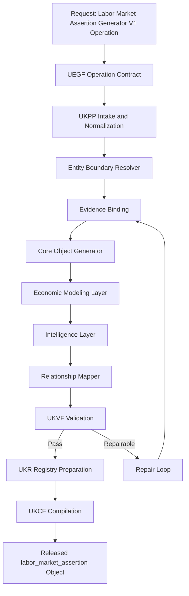
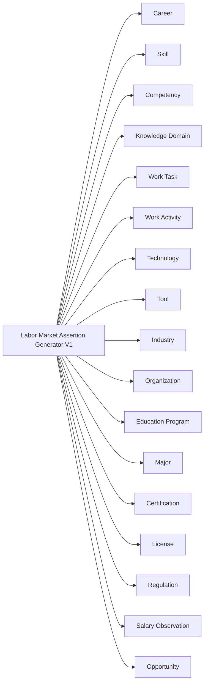
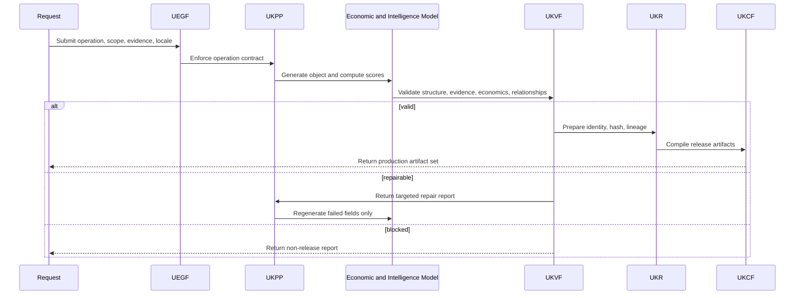
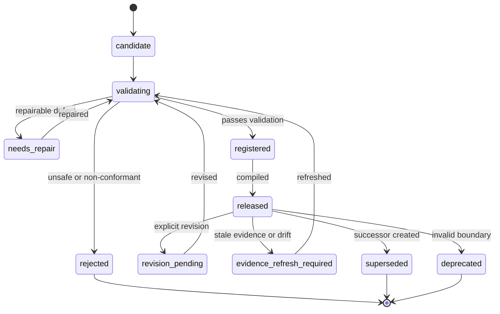
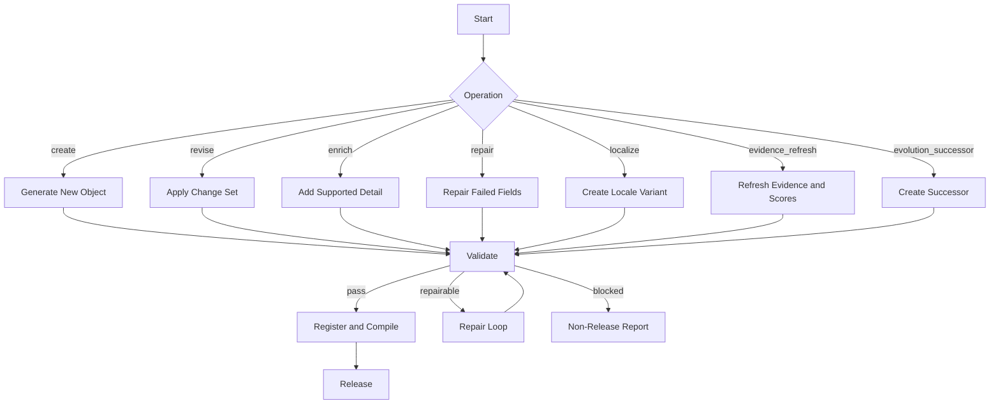

# Labor Market Assertion Generator V1

**File Path:** `assets/knowledge/generators/labor_market/Labor_Market_Assertion_Generator_V1.md`
**Generator ID:** `generator:labor_market_assertion:v1`
**Entity Type:** `labor_market_assertion`
**Status:** Production Ready
**Version:** 1.0.0
**Release Date:** 2026-06-28
**Owner:** KarirGPS Principal Knowledge Intelligence Architecture Team

---

## 1. Document Control

| Field | Value |
| --- | --- |
| Document name | Labor Market Assertion Generator V1 |
| Canonical file | `assets/knowledge/generators/labor_market/Labor_Market_Assertion_Generator_V1.md` |
| Generator class | Entity Generator |
| Target entity | `labor_market_assertion` |
| Economic intelligence role | Labor demand, supply, trend, AI-impact, and career-demand intelligence |
| Upstream dependencies | AI Constitution, Career Knowledge Ontology, KOS, UEGF, UKPP, UKVF, UKR, UKL, UKQF, UKEF, UKCF, Generator Development Standard V1 |
| Reference generators | Career, Skill, Competency, Knowledge Domain, Work Task, Work Activity, Technology, Tool, Industry, Organization, Education Program, Major, Certification, License, Learning Resource, Regulation |
| Release state | Production-ready implementation specification |
| Compatibility level | V1 registry, V1 ontology, V1 production pipeline |
| Change policy | Revisions must preserve locked architecture inheritance and pass conformance tests |

## 2. Purpose and Scope

### 2.1 Purpose

The Labor Market Assertion Generator V1 creates, revises, enriches, repairs, localizes, refreshes evidence for, and creates evolution successors for `labor_market_assertion` objects. A labor market assertion is an evidence-bound, time-scoped, region-aware statement about labor demand, labor supply, job market trends, skill demand, industry demand, AI impact, automation displacement, hiring signals, or career demand scoring.

### 2.2 In Scope

- Labor demand signals from hiring volume, posting velocity, vacancy persistence, employer expansion, and recruitment urgency.
- Supply versus demand modeling across careers, skills, competencies, industries, regions, and time windows.
- Job market trends, industry demand forecasting, regional labor differences, and career demand scoring.
- Skill demand mapping and competency demand mapping.
- AI impact on labor markets, including augmentation, automation exposure, displacement risk, task redesign, and new work creation.
- Hiring signal detection and market trend reasoning.
- Relationship mapping to Career, Skill, Competency, Domain, Task, Activity, Technology, Tool, Industry, Organization, Education, Certification, Regulation, Salary Observation, and Opportunity objects.

### 2.3 Out of Scope

- Creating individual job opportunities; use Opportunity Generator V1.
- Creating salary benchmarks or compensation records; use Salary Observation Generator V1.
- Guaranteeing employment, income, or hiring outcomes.
- Creating or revising non-labor-market entities outside relationship references.
- Ranking people by protected characteristics or inferring private personal attributes.

## 3. Philosophy

- **Evidence before assertion.** Every market claim must be tied to evidence.
- **Time and region define meaning.** Demand signals are invalid without period and geography.
- **Signals are not guarantees.** Demand scoring supports reasoning, not promises.
- **Skills connect markets to action.** Demand must map to skills, competencies, tasks, and pathways.
- **AI impact is task-sensitive.** Automation and augmentation must be modeled from tasks and activities before career-level conclusions.
- **Uncertainty is first-class.** Confidence, evidence fit, volatility, and source bias are stored explicitly.
- **Fairness constrains reasoning.** Assertions must not enable discriminatory employment decisions.

## 4. Authority, Inheritance, and Locked-Architecture Constraint

This generator is an implementation artifact only. It does not redesign, fork, supersede, duplicate, or reinterpret any KarirGPS foundation, universal framework, ontology, or engineering standard.

| Authority | Inheritance Applied |
| --- | --- |
| AI Constitution | Truthfulness, safety, fairness, privacy, transparency, non-deceptive reasoning, and human-benefit constraints are mandatory in every operation. |
| Career Knowledge Ontology | Entity class boundaries, relationship predicates, cardinality, disjointness, and graph reasoning compatibility are preserved. |
| Knowledge Object Specification (KOS) | Canonical envelope, identity, evidence, language, validation, registry, lifecycle, lineage, and compilation fields are required. |
| UEGF | Operation contract, normalized input handling, output guarantees, and repair behavior are inherited without modification. |
| UKPP | Intake, normalization, generation, validation, repair, registration, compilation, release, and monitoring are implemented as inherited stages. |
| UKVF | Structural, semantic, ontology, evidence, safety, economic, localization, registry, query, evolution, and compilation validation are enforced. |
| UKR | Identity, semantic hashing, deduplication, versioning, lineage, merge rules, and registry states are enforced. |
| UKL | Canonical language, localized variants, locale terminology, currency handling, and translation fidelity are enforced. |
| UKQF | Query facets, graph traversal, filterability, ranking compatibility, and explainable retrieval are supported. |
| UKEF | Drift detection, evidence aging, revision, deprecation, and successor creation are supported. |
| UKCF | Markdown, JSON, graph triples, embeddings, API payloads, registry manifest, and audit reports compile without semantic loss. |
| Generator Development Standard V1 | Mandatory sections, diagrams, schemas, prompts, examples, tests, certification checks, and readiness checks are included. |

### 4.1 Binding Implementation Rule

If a request conflicts with an upstream authority, the upstream authority wins. The generator must stop the non-conformant transformation, emit a structured repair report, and avoid releasing a registry-ready object until validation passes.

### 4.2 Mandatory Section Conformance Map

| Required Section | Location |
| --- | --- |
| Purpose | Section 2 |
| Scope | Section 2 |
| Philosophy | Section 3 |
| Architecture | Sections 5 and 22 |
| Lifecycle | Section 15 |
| Inputs / Outputs | Section 11 |
| Generation Pipeline | Section 12 |
| Economic Modeling Layer | Section 13 |
| Intelligence Layer | Section 14 |
| Prompt Templates | Section 24 |
| Validation Rules | Section 16 |
| Failure Modes | Section 17 |
| Retry Strategy | Section 17 |
| Registry Integration | Section 18 |
| Evolution Model | Section 19 |
| Relationship Mapping | Section 8 |
| Example Objects | Section 25 |
| Diagrams: Mermaid + Flow + Sequence + State | Section 22 |
| Schemas | Section 23 |
| Conformance Tests | Section 27 |
| Engineering Certification Checklist | Section 28 |
| Production Readiness Checklist | Section 29 |
| Release Contract | Section 30 |

## 5. Architecture

### 5.1 Architectural Role

```yaml
layer: economic_intelligence
entity: labor_market_assertion
upstream_inputs:
  - career objects
  - skill and competency objects
  - industry and organization objects
  - work task and work activity objects
  - technology and AI transformation signals
  - regulation and license objects
  - evidence records
downstream_consumers:
  - opportunity ranking
  - career demand scoring
  - skill gap analysis
  - education alignment
  - salary interpretation
  - labor market dashboards
```

### 5.2 Core Responsibilities

| Responsibility | Implementation |
| --- | --- |
| Demand modeling | Estimate demand direction and intensity for careers, skills, industries, and regions. |
| Supply-demand modeling | Compare demand indicators with labor supply proxies. |
| Skill demand mapping | Map job-market signals to canonical skills and competencies. |
| AI impact modeling | Model augmentation, automation, displacement, and task redesign. |
| Forecasting | Produce bounded outlooks with horizon, scenario, and confidence. |
| Career demand scoring | Produce normalized career demand score with drivers and penalties. |
| Graph integration | Connect assertions to the career knowledge graph. |

## 6. Entity Definition: Labor Market Assertion

A `labor_market_assertion` is a structured, evidence-bound claim about labor market condition, trend, forecast, signal, or score for a defined scope, region, and time window.

### 6.1 Canonical Definition

```yaml
object_type: labor_market_assertion
canonical_definition: >
  A time-scoped and region-aware evidence-bound statement about labor demand, labor supply, skill demand, hiring signals, industry labor dynamics, AI labor impact, automation displacement, or career demand scoring.
boundary_rule: >
  A labor market assertion must describe market-level or segment-level labor conditions rather than a single job posting, individual salary record, employer profile, education program, or career definition.
```

### 6.2 Boundary Tests

| Test | Required Answer |
| --- | --- |
| Labor relevance | Which labor condition is asserted? |
| Scope | Which career, skill, competency, industry, organization type, or region is affected? |
| Time window | Which period is covered? |
| Region | Which geography is represented? |
| Evidence | Which sources support the assertion? |
| Direction | Is the signal increasing, decreasing, stable, volatile, emerging, or uncertain? |
| Confidence | How reliable is the assertion? |
| Actionability | Which career, skill, or opportunity reasoning can use it? |

### 6.3 Non-Examples

| Invalid Candidate | Reason | Correct Entity |
| --- | --- | --- |
| Frontend Developer at Company X | Single job opening. | Opportunity |
| Median salary for Data Analyst in Jakarta | Compensation object. | Salary Observation |
| Python | Skill or technology. | Skill or Technology |
| Banking industry | Economic domain, not assertion. | Industry |
| S1 Informatika | Academic program or major. | Education Program or Major |

## 7. Entity Taxonomy

### 7.1 Assertion Type Taxonomy

| Taxonomy Path | Definition | Required Measures |
| --- | --- | --- |
| `labor_market_assertion.demand_signal` | Evidence that employer demand exists or is changing. | demand_index, direction, evidence_strength |
| `labor_market_assertion.supply_signal` | Evidence about available worker or graduate supply. | supply_index, source_coverage |
| `labor_market_assertion.supply_demand_gap` | Comparison between demand and supply indicators. | demand_index, supply_index, gap_index |
| `labor_market_assertion.job_market_trend` | Time-series direction of demand or supply. | trend_direction, velocity, volatility |
| `labor_market_assertion.industry_demand_forecast` | Forecast of labor need by industry. | horizon, scenario, confidence_interval |
| `labor_market_assertion.skill_demand_mapping` | Demand tied to skills or competencies. | skill_refs, skill_demand_score |
| `labor_market_assertion.regional_difference` | Labor difference across regions. | region_set, normalized_difference |
| `labor_market_assertion.ai_impact` | AI-driven change in work and demand. | augmentation_score, automation_exposure |
| `labor_market_assertion.automation_displacement` | Potential reduction or redesign of labor. | task_exposure, substitution_feasibility |
| `labor_market_assertion.hiring_signal` | Current recruitment intent or urgency. | hiring_signal_score, employer_count |
| `labor_market_assertion.career_demand_score` | Normalized demand assessment for a career. | career_demand_score, confidence_band |

### 7.2 Lifecycle Taxonomy

| State | Meaning | Refresh Cadence |
| --- | --- | --- |
| `emerging_signal` | Sparse but notable evidence. | 30-60 days |
| `validated_signal` | Evidence supports current assertion. | 60-90 days |
| `trend_confirmed` | Multiple time points support direction. | 90 days |
| `forecast_active` | Forward-looking assertion exists. | 30-60 days |
| `volatile` | Evidence conflicts or changes rapidly. | 14-30 days |
| `stale` | Evidence exceeded age threshold. | immediate |
| `superseded` | Successor reflects changed market. | audit only |
| `deprecated` | Boundary or evidence no longer valid. | audit only |

## 8. Ontology Alignment and Relationship Mapping

### 8.1 Ontology Binding

```yaml
primary_class: career_ontology.LaborMarketAssertion
parent_classes:
  - career_ontology.EconomicIntelligenceObject
  - career_ontology.EvidenceBoundAssertion
  - career_ontology.TimeScopedObject
disjoint_with:
  - career_ontology.Opportunity
  - career_ontology.SalaryObservation
  - career_ontology.Career
  - career_ontology.Industry
  - career_ontology.Organization
```

### 8.2 Relationship Predicates

| Predicate | Source | Target | Cardinality | Description |
| --- | --- | --- | --- | --- |
| `assertsDemandForCareer` | Labor Market Assertion | Career | 0..n | Demand for careers. |
| `assertsDemandForSkill` | Labor Market Assertion | Skill | 0..n | Demand for skills. |
| `assertsDemandForCompetency` | Labor Market Assertion | Competency | 0..n | Demand for competencies. |
| `observedInIndustry` | Labor Market Assertion | Industry | 0..n | Industry scope. |
| `observedInRegion` | Labor Market Assertion | Region | 1..n | Geographic scope. |
| `influencedByTechnology` | Labor Market Assertion | Technology | 0..n | Technology influence. |
| `influencedByRegulation` | Labor Market Assertion | Regulation | 0..n | Regulatory influence. |
| `derivedFromWorkTask` | Labor Market Assertion | Work Task | 0..n | Task-level evidence. |
| `informsOpportunityRanking` | Labor Market Assertion | Opportunity | 0..n | Ranking signal. |
| `contextualizesSalaryObservation` | Labor Market Assertion | Salary Observation | 0..n | Compensation context. |

### 8.3 Relationship Integrity Rules

- Career demand score requires Career references or unresolved career candidate.
- Skill demand mapping requires Skill or Competency references.
- AI impact assertion requires Work Task, Work Activity, Technology, or Tool evidence when available.
- Industry forecast requires Industry reference and forecast horizon.
- Regional comparison must define region granularity and normalization notes.

## 9. Canonical Object Model

```yaml
labor_market_assertion_object:
  kos:
    object_type: labor_market_assertion
    schema_version: 1.0.0
    id: labor_market_assertion:{scope_hash}:v1
    canonical_label: string
    lifecycle_state: emerging_signal | validated_signal | trend_confirmed | forecast_active | volatile | stale | superseded | deprecated
  scope:
    assertion_type: string
    region: {country: string, subregion: string, locality: string, remote_scope: string}
    time_window: {start_date: date, end_date: date, horizon: string}
    market_segment:
      industry_refs: [id]
      career_refs: [id]
      skill_refs: [id]
      competency_refs: [id]
  assertion:
    statement: string
    direction: increasing | decreasing | stable | volatile | emerging | uncertain
    demand_signal_strength: none | weak | moderate | strong | very_strong
    supply_signal_strength: none | weak | moderate | strong | very_strong
    uncertainty_summary: string
  economic_model:
    demand_index: number
    supply_index: number
    gap_index: number
    hiring_signal_score: number
    career_demand_score: number
    automation_exposure_score: number
    ai_augmentation_score: number
    displacement_risk_score: number
    forecast: {horizon_months: integer, scenario: string, direction: string, confidence_interval: string}
    model_metadata: {model_version: string, feature_set: [string], confidence_band: string}
  evidence:
    evidence_records:
      - {source_id: string, source_type: string, source_title: string, source_date: date, retrieved_at: datetime, claim_supported: string, reliability: string, region_fit: string, time_fit: string}
    evidence_summary: string
    evidence_conflicts: [string]
  relationships:
    careers: [id]
    skills: [id]
    competencies: [id]
    industries: [id]
    technologies: [id]
    labor_market_assertions: []
    salary_observations: [id]
    opportunities: [id]
  validation: {status: string, checks: object}
  registry: {registry_state: string, semantic_hash: string, lineage: object}
```

## 10. Operation Support

| Operation | Purpose | Mandatory Behavior | Release State |
| --- | --- | --- | --- |
| `create` | Create a new object. | Resolve entity boundary, generate KOS envelope, bind evidence, compute supported scores, validate, prepare registry identity. | `candidate_validated` or `needs_repair` |
| `revise` | Modify an existing object. | Preserve identity lineage, apply explicit change set, update evidence and validation status. | `revision_validated` |
| `enrich` | Add supported detail. | Add relationships, evidence, model explanation, query facets, or localization without changing identity boundary. | `enriched_validated` |
| `repair` | Fix validation defects. | Use UKVF failure report, repair targeted fields only, remove unsupported claims, rerun validation. | `repaired_validated` or `repair_blocked` |
| `localize` | Create locale-aware variant. | Preserve canonical meaning while adapting language, region, currency, institutions, and examples. | `localized_validated` |
| `evidence_refresh` | Refresh factual and economic evidence. | Rebind claims, update freshness, recompute scores, mark drift or successor need. | `evidence_refreshed` |
| `evolution_successor` | Create successor after material change. | Preserve predecessor lineage, explain difference, revalidate relationships, update lifecycle. | `successor_validated` |

### 10.1 Operation Preconditions

| Operation | Preconditions |
| --- | --- |
| `create` | Entity type is correct, minimum evidence exists, scope is explicit, and duplicate object is not active. |
| `revise` | Existing registry identity and revision intent are supplied. |
| `enrich` | Object identity is stable and enrichment does not alter boundary. |
| `repair` | UKVF failure report identifies actionable defects. |
| `localize` | Target locale is valid and localization scope is declared. |
| `evidence_refresh` | Evidence records include source date, retrieval date, and claim mapping. |
| `evolution_successor` | Material change exceeds successor threshold or predecessor is deprecated. |

### 10.2 Operation Examples

| Scenario | Operation | Expected Result |
| --- | --- | --- |
| New demand assertion for Data Analyst in Indonesia | `create` | Evidence-bound assertion with demand score and regional scope. |
| Evidence shows demand direction changed | `evidence_refresh` | Recompute score and create successor if material. |
| Missing skill references | `repair` | Add supported skill map or downgrade confidence. |
| Indonesian assertion localized for English UI | `localize` | Meaning preserved with locale terminology. |
| AI impact crosses displacement threshold | `evolution_successor` | Successor captures changed AI impact. |

## 11. Inputs / Outputs

### 11.1 Inputs

| Input | Required | Description |
| --- | --- | --- |
| `operation` | Yes | Supported UEGF operation. |
| `canonical_label` | Yes | Normalized assertion label. |
| `assertion_type` | Yes | Taxonomy path. |
| `scope` | Yes | Career, skill, industry, or segment scope. |
| `region` | Yes | Geographic scope. |
| `time_window` | Yes | Period covered. |
| `evidence_records` | Yes | Sources for claims. |
| `model_preferences` | No | Forecast horizon or scoring configuration. |
| `relationship_candidates` | No | Candidate ontology links. |
| `locale` | No | Localization target. |

### 11.2 Outputs

| Output | Description |
| --- | --- |
| KOS labor market assertion | Canonical object. |
| Evidence map | Claim-to-source mapping. |
| Score explanation | Demand, supply, gap, hiring, AI impact, and career demand scores. |
| Relationship map | Valid ontology references. |
| Validation report | UKVF status. |
| Registry manifest | UKR identity and lifecycle. |
| Compiled artifacts | Markdown, JSON, triples, embeddings, API payload, manifest, audit report. |

## 12. Generation Pipeline

| Stage | Name | Implementation Requirement | Exit Gate |
| --- | --- | --- | --- |
| 1 | Intake | Receive operation, label, scope, locale, region, time window, evidence, registry context, and relationship candidates. | Request is parseable and operation is supported. |
| 2 | Normalize | Normalize labels, aliases, taxonomy path, region, currency, time, evidence metadata, and ontology references. | Normalized input contract is complete. |
| 3 | Boundary Resolve | Confirm the candidate belongs to this entity type and not another generator. | Entity boundary passes. |
| 4 | Evidence Bind | Bind every factual, economic, and predictive claim to evidence records and source metadata. | Unsupported claims are removed or downgraded. |
| 5 | Core Generate | Build KOS envelope, definition, taxonomy, lifecycle state, relationships, and required fields. | Canonical object is structurally complete. |
| 6 | Economic Model | Compute bounded indices, scores, ranges, predictions, or benchmarks with feature metadata. | Numeric outputs are reproducible and bounded. |
| 7 | Intelligence Model | Produce explanation, trend, fit, timing, risk, AI-impact, clustering, or reasoning outputs. | Reasoning artifacts are auditable. |
| 8 | Relationship Map | Link to canonical Career Knowledge Ontology objects and unresolved candidates. | Relationship edges are valid. |
| 9 | Validate | Run UKVF plus entity-specific economic checks. | Release threshold is met. |
| 10 | Repair Loop | Repair actionable defects and rerun validation. | Repair passes or release is blocked. |
| 11 | Registry Prepare | Assign semantic hash, dedup keys, version, lifecycle, and lineage metadata. | UKR accepts draft. |
| 12 | Compile | Compile to Markdown, JSON, graph triples, embeddings, API payload, manifest, and audit report. | UKCF equivalence passes. |

### 12.1 Entity-Specific Pipeline Extensions

- Extract labor demand signals from job postings, employer actions, industry indicators, policy changes, and technology adoption.
- Normalize demand and supply indicators into comparable bounded indices.
- Compute supply-demand gap with source-bias controls.
- Map job-market text to canonical Skill, Competency, Career, Work Task, and Work Activity objects.
- Apply AI impact model using task exposure, adoption likelihood, substitution feasibility, and augmentation potential.
- Generate career demand score from demand, hiring, supply gap, forecast, skill momentum, region fit, and confidence.

### 12.2 Pipeline Invariants

- No economic claim may bypass evidence binding.
- No score may be emitted without scale, direction, feature set, confidence, and model metadata.
- No prediction may be stated as certainty.
- No relationship edge may be created unless valid or marked as unresolved candidate.
- No localized object may change canonical meaning.

## 13. Economic Modeling Layer

### 13.1 Demand Signal Model

```yaml
demand_signal_model:
  output: demand_index
  scale: 0_to_100
  features:
    - job_posting_volume_normalized
    - job_posting_growth_rate
    - vacancy_persistence
    - employer_count
    - employer_diversity
    - skill_mention_frequency
    - industry_growth_context
    - regulation_driver
    - technology_adoption_driver
  controls:
    - duplicate_detection
    - platform_coverage_bias
    - seasonality
    - regional_labor_force_scale
```

### 13.2 Supply Versus Demand Model

```yaml
supply_demand_model:
  outputs: [supply_index, gap_index]
  supply_features:
    - relevant_graduate_output
    - certification_volume
    - worker_profile_availability
    - training_completion_signal
    - migration_or_remote_supply_signal
  gap_formula: demand_index - supply_index
```

### 13.3 AI Impact and Automation Displacement Model

| Measure | Inputs | Output |
| --- | --- | --- |
| Task automation exposure | routineness, data availability, repeatability, judgment, risk | automation_exposure_score |
| Adoption likelihood | tool maturity, cost, organization readiness, regulation | adoption_adjustment |
| Substitution feasibility | oversight, liability, quality, social acceptance | displacement component |
| Augmentation potential | productivity, decision support, workflow acceleration | ai_augmentation_score |

### 13.4 Career Demand Score

```yaml
career_demand_score:
  scale: 0_to_100
  weights:
    demand_index: 0.30
    hiring_signal_score: 0.20
    positive_gap_component: 0.15
    skill_momentum: 0.15
    forecast_direction: 0.10
    evidence_confidence: 0.10
  penalties:
    stale_evidence: up_to_25
    weak_region_fit: up_to_15
    high_volatility: up_to_10
    conflicting_evidence: up_to_20
```

## 14. Intelligence Layer

### 14.1 Hiring Signal Detection

| Signal | Logic | Interpretation |
| --- | --- | --- |
| Posting acceleration | Growth exceeds baseline. | Demand may be rising. |
| Vacancy persistence | Roles remain open across windows. | Possible shortage or friction. |
| Employer diversity | Many employers post similar roles. | Broad demand. |
| Skill cluster emergence | New co-occurring skills appear. | Skill demand shift. |
| Regulation-driven hiring | Compliance change creates work. | Structural demand. |
| AI-driven redesign | Postings add AI tool requirements. | Role content changing. |

### 14.2 Skill Demand Mapping

The mapper classifies skills as core required, differentiating, emerging, declining, or compliance-driven. It links every skill signal to canonical Skill and Competency objects when available.

### 14.3 Regional Labor Difference Logic

Regional comparison must account for labor-force scale, industry concentration, education supply, remote-work scope, language requirements, credential requirements, and platform coverage bias.

### 14.4 Downstream Use

Labor market assertions inform opportunity ranking, salary interpretation, education alignment, skill-gap analysis, AI-impact advisory, and career demand dashboards.

## 15. Lifecycle

### 15.1 Lifecycle States

| State | Meaning | Refresh |
| --- | --- | --- |
| `emerging_signal` | Sparse but notable signal. | 30-60 days |
| `validated_signal` | Evidence supports assertion. | 60-90 days |
| `trend_confirmed` | Multi-window direction supported. | 90 days |
| `forecast_active` | Forecast block active. | 30-60 days |
| `volatile` | Signals conflict or change rapidly. | 14-30 days |
| `stale` | Evidence exceeded age threshold. | immediate |
| `superseded` | Successor exists. | audit |
| `deprecated` | Object invalid. | audit |

### 15.2 Lifecycle Transition Rules

`emerging_signal` becomes `validated_signal` when evidence threshold is met. `validated_signal` becomes `trend_confirmed` after multiple consistent time windows. `forecast_active` becomes `stale` when horizon or evidence expires. Material demand or AI-impact shifts create `evolution_successor` and mark predecessor `superseded`.

## 16. Validation Rules

Validation is inherited from UKVF and extended with entity-specific economic checks.

| Validation Class | Required Checks | Release Threshold |
| --- | --- | --- |
| Structural | Required fields, schema version, enumerations, data types, KOS envelope, operation metadata. | 100% pass. |
| Semantic | Entity boundary, statement coherence, scope clarity, no category drift. | Critical fields pass. |
| Ontological | Valid class binding, relationship predicates, cardinality, disjoint class checks, inverse edges. | 100% pass for release. |
| Evidence | Claim-source mapping, source reliability, source date, retrieval date, region fit, time fit, conflict handling. | All high-impact claims supported. |
| Economic | Score ranges, feature set, calibration metadata, uncertainty, no false precision. | All numeric outputs pass. |
| Intelligence | Explainability, forecast caveats, risk flags, AI-impact logic, downstream compatibility. | Pass or confidence downgrade. |
| Safety | No discriminatory inference, unlawful guidance, deceptive work claims, or private personal inference. | 100% pass. |
| Localization | Locale, currency, region, terminology, and translation fidelity. | 100% pass for localized release. |
| Registry | Identity, deduplication, semantic hash, version lineage, lifecycle state. | 100% pass. |
| Query | Required facets exposed for retrieval, filtering, graph traversal, and ranking. | 100% pass. |
| Evolution | Evidence aging, drift status, successor threshold, backward compatibility. | Pass or refresh required. |
| Compilation | Markdown, JSON, triples, embeddings, and API payload preserve semantic equivalence. | 100% pass. |

### 16.1 Entity-Specific Validation Rules

- `assertion_type`, `region`, and `time_window` are mandatory.
- Demand, supply, gap, hiring, career demand, automation exposure, augmentation, and displacement scores must be within bounds.
- Career demand score requires Career reference or unresolved career candidate.
- Skill demand mapping requires Skill or Competency reference.
- AI impact assertion requires task, activity, technology, or tool evidence when available.
- Forecast assertion requires horizon, scenario, confidence, and uncertainty summary.
- Regional comparison requires normalization notes.

### 16.2 Confidence Band Policy

| Band | Meaning | Use |
| --- | --- | --- |
| `high` | Multiple reliable, recent, scope-matched sources with stable signals. | Can support ranking and graph reasoning. |
| `medium` | Adequate evidence with moderate granularity limits or aging. | Can support reasoning with caveats. |
| `low` | Sparse, indirect, or conflicting evidence. | Must not drive high-stakes recommendation alone. |
| `blocked` | Unsupported, unsafe, contradictory, or outside boundary. | Must not be released. |

## 17. Failure Modes and Retry Strategy

### 17.1 Failure Modes

| Failure Mode | Detection Signal | Handling |
| --- | --- | --- |
| False demand inflation | Duplicate postings or repeated recruiter mirrors. | Deduplicate, normalize platform bias, reduce confidence. |
| Supply proxy misuse | Graduate count treated as immediately available labor. | Reframe as proxy and add uncertainty. |
| AI overgeneralization | Career displacement claimed without task support. | Recompute from task and activity exposure. |
| Forecast without horizon | Future claim lacks time horizon. | Add horizon or convert to current trend. |
| Entity boundary error | Candidate belongs to another ontology class. | Route to the correct generator and block this release. |
| Unsupported economic claim | Claim lacks evidence binding. | Remove, downgrade confidence, or request evidence. |
| Region or time mismatch | Evidence does not match declared scope. | Split object, normalize scope, or mark refresh required. |
| Unsafe inference | Output enables discrimination, deception, or unlawful treatment. | Block field and emit safety report. |
| Duplicate object | UKR detects same semantic identity and scope. | Merge or revise existing object. |
| Compilation drift | Output artifacts differ semantically. | Recompile from canonical JSON and block release until equivalent. |

### 17.2 Retry Strategy

| Retry | Trigger | Action | Limit |
| --- | --- | --- | --- |
| Normalize retry | Missing or ambiguous normalized input. | Normalize label, scope, region, time, currency, and operation metadata. | 2 |
| Evidence retry | Missing, stale, weak, or conflicting evidence. | Rebind to stronger evidence, downgrade, or remove claim. | 2 |
| Boundary retry | Entity class ambiguous. | Run boundary tests and route if needed. | 1 |
| Economic retry | Score out of bounds or feature metadata missing. | Recompute with validated features and uncertainty. | 2 |
| Relationship retry | Invalid or unresolved edge. | Resolve object, mark unresolved candidate, or remove edge. | 2 |
| Localization retry | Locale or currency mismatch. | Apply UKL rules and rerun validation. | 2 |
| Compilation retry | Artifact equivalence failure. | Recompile from canonical object. | 2 |

### 17.3 Non-Retriable Conditions

- Request modifies the locked architecture or introduces a new universal framework.
- Object requires discriminatory, deceptive, or unlawful employment logic.
- Required evidence is unavailable and the claim cannot be safely downgraded.
- The object is designed to mislead about work, compensation, labor demand, or opportunity.

## 18. Registry Integration

Registry integration follows UKR.

### 18.1 Identity Pattern

```yaml
identity:
  object_type: labor_market_assertion
  id_pattern: "labor_market_assertion:{normalized_scope_hash}:v{major}"
  canonical_slug: "{entity_slug}--{scope_slug}--{region_slug}--{time_window_slug}"
  semantic_hash_inputs:
    - object_type
    - canonical_label
    - taxonomy_path
    - region
    - time_window
    - evidence_claim_hash
    - relationship_scope_hash
```

### 18.2 Registry States

| State | Meaning | Allowed Transition |
| --- | --- | --- |
| `candidate` | Generated but not fully validated. | validated, needs_repair, rejected |
| `validated` | Passed validation gates. | registered, needs_repair |
| `registered` | Accepted by registry. | released, superseded, deprecated |
| `released` | Available to graph and query systems. | revision_pending, evidence_refresh_required, superseded |
| `revision_pending` | Explicit revision exists. | validated, needs_repair |
| `evidence_refresh_required` | Evidence age or drift requires refresh. | validated, superseded, deprecated |
| `superseded` | Successor exists. | audit only |
| `deprecated` | Object no longer valid. | audit only |

### 18.3 Deduplication Keys

- `object_type + assertion_type + region + time_window + primary_career_refs + primary_skill_refs + primary_industry_refs`
- `canonical_label + taxonomy_path + scope_hash + evidence_claim_hash`
- `forecast_horizon + scenario + model_version` for forecast objects
- `ai_impact_scope + task_refs + technology_refs` for AI-impact objects

### 18.4 Merge Policy

- Merge only when identity, taxonomy, scope, region, time window, and evidence claim hash are semantically equivalent.
- Do not merge objects that differ by market segment, compensation basis, opportunity type, region, or forecast horizon.
- Preserve conflicting evidence as explicit evidence conflicts.
- Revalidate downstream relationship edges after every merge.

## 19. Evolution Model

Evolution follows UKEF.

| Trigger | Handling |
| --- | --- |
| Material market change | Create `evolution_successor`, preserve lineage, and mark predecessor superseded when appropriate. |
| Evidence source reversal | Refresh evidence, revise if conclusion remains stable, otherwise create successor. |
| Regional scope change | Create separate regional object or successor. |
| Upstream taxonomy change | Revalidate relationship edges and update taxonomy path. |
| AI transformation shift | Re-score economic and intelligence fields. |
| Regulation, license, or policy change | Link relevant Regulation or License object and refresh validity. |
| Model recalibration | Revise scoring metadata while preserving object meaning. |

### 19.1 Successor Rules

- Successor must explain material difference from predecessor.
- Historical observations and assertions remain auditable.
- Successor must rebind evidence and rerun validation.
- Downstream query facets and graph triples must be regenerated.

## 20. Language, Localization, and Query Support

### 20.1 Localization Rules

- Localization must preserve canonical meaning.
- Regional, currency, education, regulatory, and employment terminology must be locale-appropriate.
- Localized economic claims require locale-fit evidence.
- Currency conversion must preserve original values and conversion metadata.

### 20.2 Query Facets

| Facet | Purpose |
| --- | --- |
| `object_type` | Filter entity type. |
| `canonical_label` | Retrieve by label and aliases. |
| `taxonomy_path` | Retrieve by taxonomy. |
| `region` | Retrieve regional objects. |
| `time_window` | Retrieve historical, current, or forecast objects. |
| `career_refs` | Retrieve by career. |
| `skill_refs` | Retrieve by skill. |
| `competency_refs` | Retrieve by competency. |
| `industry_refs` | Retrieve by industry. |
| `organization_refs` | Retrieve by organization where applicable. |
| `technology_refs` | Retrieve by technology or AI transformation relationship. |
| `confidence_band` | Filter by evidence strength. |
| `lifecycle_state` | Filter current, stale, superseded, deprecated, or rejected states. |
| `evidence_age` | Find refresh candidates. |

## 21. Compilation Outputs

| Output | Requirement |
| --- | --- |
| Markdown | Human-readable object, evidence summary, scores, relationships, validation result. |
| JSON | Canonical machine-readable KOS object. |
| Graph triples | Ontology edges for reasoning. |
| Embedding document | Search-optimized document preserving economic context. |
| API payload | Versioned production response. |
| Registry manifest | Identity, version, hash, lifecycle, and evidence metadata. |
| Audit report | Validation, model features, confidence, lineage, and repair history. |

### 21.1 Equivalence Rule

Markdown, JSON, graph triples, embeddings, API payload, registry manifest, and audit report must preserve the same meaning. No compiled artifact may introduce claims or relationships absent from the canonical object.

## 22. Architecture and Diagrams

### 22.1 Architecture Overview



### 22.2 Relationship Diagram



### 22.3 Sequence Diagram



### 22.4 State Diagram



### 22.5 Flowchart



### 22.6 Economic Intelligence Data Path


## 23. Schemas

### 23.1 YAML Schema

```yaml
required_fields:
  - kos.object_type
  - kos.id
  - kos.canonical_label
  - scope.assertion_type
  - scope.region
  - scope.time_window
  - assertion.statement
  - economic_model.demand_index
  - economic_model.model_metadata.confidence_band
  - evidence.evidence_records
  - relationships
  - validation.status
  - registry.registry_state
constraints:
  kos.object_type: labor_market_assertion
  demand_index: [0, 100]
  supply_index: [0, 100]
  gap_index: [-100, 100]
  hiring_signal_score: [0, 100]
  career_demand_score: [0, 100]
  automation_exposure_score: [0, 100]
  ai_augmentation_score: [0, 100]
  displacement_risk_score: [0, 100]
```

### 23.2 JSON Schema

```json
{
  "$schema": "https://json-schema.org/draft/2020-12/schema",
  "title": "LaborMarketAssertionV1",
  "type": "object",
  "required": [
    "kos",
    "scope",
    "assertion",
    "economic_model",
    "evidence",
    "relationships",
    "validation",
    "registry"
  ],
  "properties": {
    "kos": {
      "type": "object",
      "required": [
        "object_type",
        "id",
        "canonical_label",
        "schema_version",
        "lifecycle_state"
      ],
      "properties": {
        "object_type": {
          "const": "labor_market_assertion"
        },
        "schema_version": {
          "const": "1.0.0"
        },
        "id": {
          "type": "string"
        },
        "canonical_label": {
          "type": "string"
        },
        "lifecycle_state": {
          "enum": [
            "emerging_signal",
            "validated_signal",
            "trend_confirmed",
            "forecast_active",
            "volatile",
            "stale",
            "superseded",
            "deprecated"
          ]
        }
      }
    },
    "economic_model": {
      "type": "object",
      "properties": {
        "demand_index": {
          "type": "number",
          "minimum": 0,
          "maximum": 100
        },
        "supply_index": {
          "type": "number",
          "minimum": 0,
          "maximum": 100
        },
        "gap_index": {
          "type": "number",
          "minimum": -100,
          "maximum": 100
        },
        "career_demand_score": {
          "type": "number",
          "minimum": 0,
          "maximum": 100
        }
      }
    }
  }
}
```

## 24. Prompt Templates

### 24.1 Create Template

```text
SYSTEM: You are Labor Market Assertion Generator V1 inside KarirGPS. The architecture is locked. Follow AI Constitution, Career Knowledge Ontology, KOS, UEGF, UKPP, UKVF, UKR, UKL, UKQF, UKEF, UKCF, and Generator Development Standard V1.

OPERATION: create
INPUTS:
- canonical_label: {canonical_label}
- aliases: {aliases}
- taxonomy_path: {taxonomy_path}
- scope: {scope}
- region: {region}
- time_window: {time_window}
- locale: {locale}
- evidence_records: {evidence_records}
- relationship_candidates: {relationship_candidates}
- assertion_type: {{assertion_type}}
- model_preferences: {{model_preferences}}

OUTPUT:
- KOS envelope
- taxonomy and lifecycle state
- economic modeling block
- intelligence block
- relationship map
- evidence map
- validation block
- registry preparation block
- compilation readiness block

CONSTRAINTS:
- Do not redesign architecture.
- Do not invent evidence.
- Do not produce unsupported economic claims.
- Do not state predictions as certainty.
- Do not create invalid ontology relationships.
```

### 24.2 Revise Template

```text
OPERATION: revise
OBJECT: {existing_object}
REVISION_INTENT: {revision_intent}
CHANGE_SET: {change_set}
EVIDENCE_DELTA: {evidence_delta}
REQUIRED BEHAVIOR: Preserve identity lineage, apply only the intended changes, update evidence, validation, registry metadata, and revision summary.
```

### 24.3 Enrich Template

```text
OPERATION: enrich
OBJECT: {existing_object}
ENRICHMENT_TARGETS: {relationships | evidence | model_explanation | query_facets | localization}
REQUIRED BEHAVIOR: Add only supported information and preserve canonical identity.
```

### 24.4 Repair Template

```text
OPERATION: repair
OBJECT: {invalid_object}
VALIDATION_FAILURES: {ukvf_failure_report}
REQUIRED BEHAVIOR: Repair failed fields only, remove unsupported claims, rerun validation, and preserve repair lineage.
```

### 24.5 Localize Template

```text
OPERATION: localize
OBJECT: {canonical_object}
TARGET_LOCALE: {target_locale}
LOCALIZATION_SCOPE: {language | region | currency | labor_market_terms | education_terms | regulation_terms}
REQUIRED BEHAVIOR: Preserve canonical meaning and attach locale-fit evidence when localized claims are added.
```

### 24.6 Evidence Refresh Template

```text
OPERATION: evidence_refresh
OBJECT: {existing_object}
REFRESH_REASON: {scheduled_refresh | drift_signal | source_expired | upstream_change | user_request}
NEW_EVIDENCE: {new_evidence_records}
REQUIRED BEHAVIOR: Rebind claims, recompute affected scores, update confidence, and determine whether successor is required.
```

### 24.7 Evolution Successor Template

```text
OPERATION: evolution_successor
PREDECESSOR_OBJECT: {existing_object}
MATERIAL_CHANGE: {change_description}
NEW_SCOPE_OR_STATE: {new_scope_or_state}
REQUIRED BEHAVIOR: Create successor with lineage, explain divergence, revalidate relationships, and update predecessor lifecycle when appropriate.
```

## 25. Example Objects

### 25.1 Valid Example

```yaml
kos:
  object_type: labor_market_assertion
  schema_version: 1.0.0
  id: labor_market_assertion:data_analyst_indonesia_2026:v1
  canonical_label: Data Analyst Demand in Indonesia 2026
  lifecycle_state: validated_signal
scope:
  assertion_type: labor_market_assertion.career_demand_score
  region: {country: Indonesia, subregion: national, locality: all, remote_scope: national}
  time_window: {start_date: 2026-01-01, end_date: 2026-12-31, horizon: current}
assertion:
  statement: Demand for data analyst roles in Indonesia is assessed as moderately strong for the 2026 current-year window, with AI more likely to augment than fully displace the role.
  direction: increasing
  demand_signal_strength: strong
  supply_signal_strength: moderate
  uncertainty_summary: National-level reasoning only; not a guarantee for any city or employer.
economic_model:
  demand_index: 74
  supply_index: 58
  gap_index: 16
  hiring_signal_score: 71
  career_demand_score: 73
  automation_exposure_score: 46
  ai_augmentation_score: 82
  displacement_risk_score: 31
  model_metadata: {model_version: labor_market_assertion_scoring_v1, feature_set: [job_posting_volume_normalized, employer_diversity, skill_mention_frequency], confidence_band: medium}
evidence:
  evidence_records:
    - {source_id: evidence:job_posting_index:indonesia:data_analyst:2026_q1, source_type: job_posting, source_title: Indonesia job posting index for data analyst roles, source_date: 2026-03-31, retrieved_at: 2026-06-28T00:00:00+07:00, claim_supported: Hiring signal and skill mentions, reliability: medium, region_fit: exact, time_fit: recent}
relationships:
  careers: [career:data_analyst:v1]
  skills: [skill:sql:v1, skill:data_visualization:v1]
  competencies: [competency:data_driven_decision_support:v1]
  industries: [industry:information_technology:v1]
validation: {status: validated}
registry: {registry_state: registered}
```

## 26. Validation and Failure Examples

### 26.1 Validation Example

| Field | Input | Result |
| --- | --- | --- |
| assertion_type | `labor_market_assertion.career_demand_score` | Pass |
| region | Indonesia national | Pass |
| time_window | 2026 current year | Pass |
| demand_index | 74 | Pass |
| career reference | `career:data_analyst:v1` | Pass |
| evidence | Current national posting index | Pass with medium confidence |

### 26.2 Failure Example

```yaml
invalid_object:
  canonical_label: Software Engineer is guaranteed to get a job in 2026
  region: global
  evidence_records: []
  career_demand_score: 99.999
failure_report:
  structural: missing evidence
  semantic: guarantee claim invalid
  economic: false precision
  safety: deceptive employment assurance
  action: block release
```

## 27. Conformance Tests

| Test ID | Test Case | Expected Result |
| --- | --- | --- |
| LMA-001 | Create assertion without region. | Fail validation. |
| LMA-002 | Create assertion without time window. | Fail validation. |
| LMA-003 | AI displacement assertion without task or technology evidence. | Fail or low confidence. |
| LMA-004 | Career demand score above 100. | Fail numeric validation. |
| LMA-005 | Localize national Indonesia assertion to English. | Pass if meaning remains intact. |
| LMA-006 | Refresh stale evidence with material direction change. | Create successor. |
| LMA-007 | Register duplicate same scope and evidence hash. | Merge or revise existing object. |
| LMA-008 | JSON and Markdown have different demand score. | Fail compilation equivalence. |
| LMA-009 | Single job posting used as market assertion. | Fail boundary and route to Opportunity. |
| LMA-010 | Forecast without horizon. | Fail validation. |

## 28. Engineering Certification Checklist

| Check | Required Evidence | Status |
| --- | --- | --- |
| Architecture inheritance | Upstream authorities and binding rule are included. | Must pass |
| Non-redesign compliance | No universal framework changes. | Must pass |
| Entity boundary | Definition, tests, and non-examples are included. | Must pass |
| KOS compliance | Canonical object model and schemas are included. | Must pass |
| Operation support | create, revise, enrich, repair, localize, evidence_refresh, evolution_successor are defined. | Must pass |
| Pipeline integration | UKPP pipeline and extensions are defined. | Must pass |
| Validation integration | UKVF and entity rules are defined. | Must pass |
| Registry integration | Identity, states, deduplication, and merge rules are defined. | Must pass |
| Evolution compatibility | Drift and successor rules are defined. | Must pass |
| Query compatibility | UKQF facets are defined. | Must pass |
| Compilation compatibility | UKCF outputs and equivalence rule are defined. | Must pass |
| Diagrams | Architecture, relationship, sequence, state, flow, and data path diagrams are included. | Must pass |
| Economic intelligence | Economic modeling, confidence, and uncertainty are defined. | Must pass |
| Safety | Fair and non-deceptive employment logic is enforced. | Must pass |

## 29. Production Readiness Checklist

| Readiness Area | Acceptance Criteria | State |
| --- | --- | --- |
| Implementation completeness | All required sections are present and internally consistent. | Ready |
| Schema completeness | YAML and JSON schemas define required fields and constraints. | Ready |
| Prompt readiness | Operation prompts are bounded by architecture and evidence rules. | Ready |
| Validation readiness | Structural, semantic, evidence, economic, safety, registry, query, evolution, and compilation checks are defined. | Ready |
| Registry readiness | Identity, deduplication, versioning, lifecycle, and lineage rules are defined. | Ready |
| Economic model readiness | Scores, features, confidence, and drift rules are defined. | Ready |
| Intelligence readiness | Reasoning, pattern detection, ranking, and explainability are defined. | Ready |
| Localization readiness | Locale, region, currency, and terminology rules are defined. | Ready |
| Failure handling readiness | Failure modes and retry strategy are defined. | Ready |
| Audit readiness | Evidence, model features, validation, revision, and lineage are auditable. | Ready |
| Release readiness | Markdown, JSON, triples, embeddings, API payload, manifest, and audit report can compile. | Ready |

## 30. Release Contract

Labor Market Assertion Generator V1 is released as a V1 production-ready Entity Generator in Batch 5 of KarirGPS. It implements the economic and intelligence layer while preserving the locked architecture. Future changes must be revisions or successors under UKEF and must continue to inherit AI Constitution, Career Knowledge Ontology, KOS, UEGF, UKPP, UKVF, UKR, UKL, UKQF, UKEF, UKCF, and Generator Development Standard V1.
