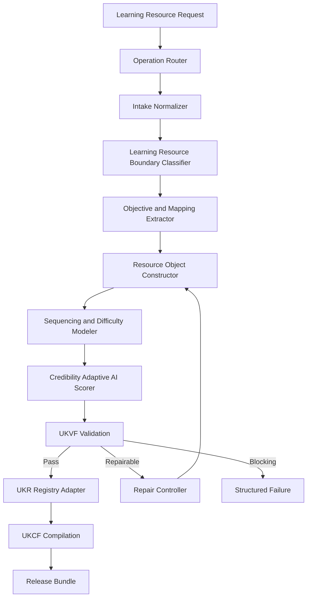
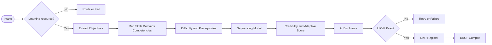
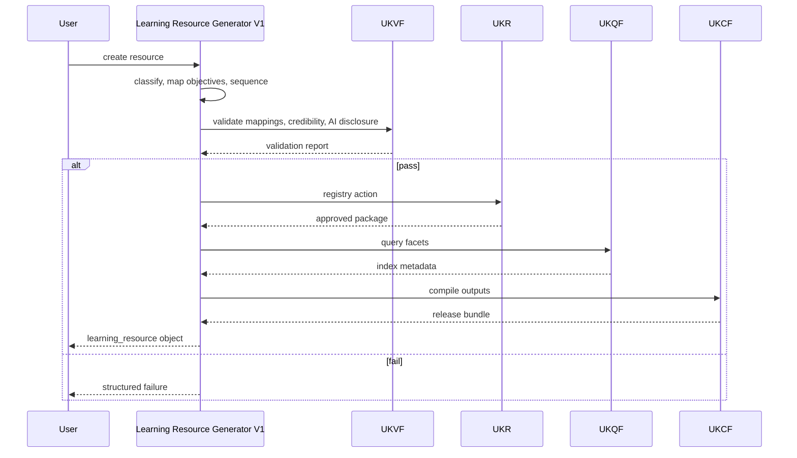
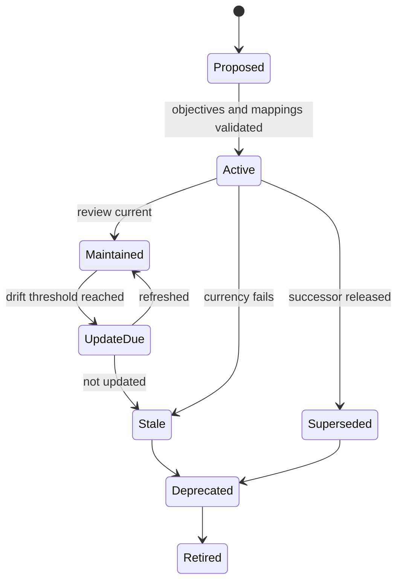

# Learning Resource Generator V1

    **File Path:** `assets/knowledge/generators/learning_resource/Learning_Resource_Generator_V1.md`  
    **Generator ID:** `generator:learning_resource:v1`  
    **Entity Type:** `learning_resource`  
    **Status:** Production Ready  
    **Version:** 1.0.0  
    **Release Date:** 2026-06-28  
    **Owner:** KarirGPS Principal Knowledge Engineering Team

    ---

    ## 1. Document Control

    | Field | Value |
    |---|---|
    | Document name | Learning Resource Generator V1 |
    | Canonical file | `assets/knowledge/generators/learning_resource/Learning_Resource_Generator_V1.md` |
    | Generator class | Entity Generator |
    | Target entity | Learning Resource |
    | Upstream dependencies | AI Constitution, Career Knowledge Ontology, KOS, UEGF, UKPP, UKVF, UKR, UKL, UKQF, UKEF, UKCF, Generator Development Standard V1 |
    | Reference generator lineage | Career, Skill, Competency, Knowledge Domain, Work Task, Work Activity, Technology, Tool, Industry, Organization, Education Program, Major Generators V1 |
    | Release state | Production-ready implementation specification |
    | Change policy | Revisions must preserve locked architecture inheritance and pass conformance tests. |


### 1.1 Generator Development Standard V1 Mandatory Section Map

| Required Element | Implemented Section |
|---|---|
| Purpose | Section 2 |
| Scope | Section 3 |
| Philosophy | Section 4 |
| Architecture | Section 6 |
| Lifecycle | Section 7 |
| Inputs/Outputs | Section 8 |
| Entity taxonomy and definition | Section 9 |
| Relationship mapping | Section 10 |
| Canonical object model | Section 11 |
| Generation Pipeline | Section 12 |
| Prompt Templates | Section 13 |
| Validation Rules | Section 14 |
| Failure Modes | Section 15 |
| Retry Strategy | Section 16 |
| Registry Integration | Section 17 |
| Language, query, and compilation | Section 18 |
| Evolution Model | Section 19 |
| Example Objects | Section 20 |
| Diagrams: Mermaid + Flow + Sequence + State | Section 21 |
| Conformance Tests | Section 22 |
| Production Readiness Checklist | Section 23 |
| Release Contract | Section 24 |


## 2. Purpose

The Learning Resource Generator V1 creates, revises, repairs, localizes, enriches, refreshes evidence for, and creates evolution successors for `learning_resource` knowledge objects. A learning resource is a structured or semi-structured learning artifact, experience, interaction, tool-mediated environment, mentor support, or AI-assisted tutor that helps a learner acquire, practice, assess, or maintain knowledge, skills, competencies, and domain understanding.

## 3. Scope

### 3.1 In Scope

- Courses, books, videos, simulations, mentors, AI tutors, labs, projects, articles, case studies, assessments, workshops, bootcamps, documentation, datasets, practice environments, and learning paths.
- Mapping to skills, domains, competencies, careers, tasks, activities, technologies, tools, certifications, licenses, regulations, education programs, majors, and industries.
- Difficulty, prerequisites, learning objectives, sequencing, credibility, curriculum alignment, adaptive potential, AI-generated resource support, accessibility, access model, maintenance, and evidence.

### 3.2 Out of Scope

- Awarded credentials; use Certification.
- Legal authorizations; use License.
- Legal/compliance rules; use Regulation.
- Formal academic programs or majors; use the existing Education Program or Major generators.

## 4. Philosophy

Learning resource objects represent instructional usefulness, not popularity alone. A resource is valuable when it has clear outcomes, accurate coverage, appropriate difficulty, credible authorship/review, valid sequencing, accessibility, assessment support, and measurable alignment to skills or competencies. AI-generated resources are supported only with provenance, review state, hallucination-risk controls, update policy, and safety/accuracy safeguards.


## 5. Authority, Inheritance, and Non-Redesign Constraint

This generator is an implementation artifact. It does not redesign, fork, replace, duplicate, or reinterpret any KarirGPS foundation, ontology, core engine, standard, registry rule, validation rule, language rule, query rule, evolution rule, or compilation rule. It implements entity-specific behavior only inside the locked KarirGPS architecture.

| Authority | Binding Inheritance |
|---|---|
| AI Constitution | Enforces safety, truthfulness, privacy, non-deception, fairness, traceability, and human-benefit constraints. |
| Career Knowledge Ontology | Binds this entity to the canonical Career → Skill → Competency → Knowledge Domain → Work Task → Work Activity → Technology → Tool graph and to Batch 3/4 entities through explicitly allowed relationships. |
| KOS | Requires canonical identity, version, lifecycle, evidence, validation, registry, language, query, lineage, and compiled output fields. |
| UEGF | Supplies operation contracts for create, revise, repair, localize, enrich, evidence_refresh, and evolution_successor. |
| UKPP | Supplies deterministic intake, normalization, generation, validation, repair, registration, compilation, and release stages. |
| UKVF | Supplies structural, semantic, ontological, evidence, safety, language, registry, query, evolution, and compilation validation suites. |
| UKR | Supplies identity, deduplication, merge, versioning, lineage, registry transition, deprecation, and successor rules. |
| UKL | Supplies canonical language, localization, terminology control, and semantic equivalence rules. |
| UKQF | Supplies query facets, graph traversal, relationship indexing, and embedding-text requirements. |
| UKEF | Supplies drift detection, evidence aging, lifecycle transitions, successor creation, compatibility, and migration handling. |
| UKCF | Supplies lossless compilation to Markdown, JSON, graph triples, embedding text, API payload, and registry manifest. |
| Generator Development Standard V1 | Supplies mandatory sections, engineering acceptance gates, failure handling, diagrams, and release checks. |

### 5.1 Binding Conflict Rule

If any entity-specific rule conflicts with an upstream authority, the generator must stop, emit `authoritative_conflict`, identify the exact rule path, and return a structured repair report. The generator must not resolve conflicts by guessing or silently overriding the locked system.


## 6. Architecture

### 6.1 Runtime Components

| Component | Responsibility | Output |
|---|---|---|
| Operation Router | Routes UEGF operation and validates operation preconditions. | Operation context. |
| Intake Normalizer | Normalizes label, aliases, source facts, locale, evidence policy, jurisdiction terms, and relationship hints. | Normalized request. |
| Entity Boundary Classifier | Confirms the candidate belongs to this entity and not to a neighboring generator. | Boundary decision. |
| Evidence Planner | Classifies claims by source need, freshness, reliability, and unsupported-claim policy. | Evidence plan. |
| Object Constructor | Builds KOS envelope, entity fields, lifecycle, scores, risks, and query facets. | Candidate object. |
| Relationship Resolver | Normalizes relationship names, target types, cardinalities, inverse hints, and graph impact. | Relationship graph. |
| Validation Orchestrator | Runs UKVF and entity-specific validation. | Validation report. |
| Repair Controller | Applies deterministic repair for valid repair classes and enforces retry limits. | Repaired object or failure. |
| Registry Adapter | Applies UKR identity, deduplication, merge, versioning, lineage, and state transition. | Registry action. |
| Evolution Adapter | Applies UKEF drift, successor, deprecation, compatibility, and migration rules. | Evolution package. |
| Compilation Adapter | Applies UKCF to generate Markdown, JSON, graph triples, embedding text, API payload, and manifest. | Release bundle. |

### 6.2 Architecture Constraints

- The generator is stateless except for registry and validation context supplied by UKR/UKVF.
- The generator emits only a KOS-compliant object, compiled release bundle, registry action, or structured failure.
- It cannot introduce new universal frameworks, new ontology roots, hidden relation types, or non-KOS output formats.
- All object claims requiring evidence must be evidence-backed, evidence-limited, or removed.
- Localization and compilation must preserve canonical meaning.


## 7. Lifecycle

```yaml
learning_resource_lifecycle:
  lifecycle_state:
    - proposed
    - active
    - maintained
    - update_due
    - stale
    - superseded
    - deprecated
    - retired
  content_state:
    - draft
    - published
    - peer_reviewed
    - instructor_verified
    - ai_generated_unreviewed
    - ai_generated_human_reviewed
    - archived
  recommendation_state:
    - recommended
    - recommended_with_limitations
    - supplementary
    - not_recommended
    - compliance_required
```

| Transition | Allowed When | Required Metadata |
|---|---|---|
| proposed → active | Type, objectives, mappings, difficulty, and credibility validate. | publication_date, evidence. |
| active → maintained | Update cadence and relevance verified. | last_reviewed_at, update_policy. |
| maintained → update_due | Domain/tool/regulation/certification drift threshold reached. | drift_signal, due_reason. |
| update_due → maintained | Content review/update completed. | review_record, updated_alignment. |
| active → stale | Evidence or content currency fails threshold. | stale_reason, impacted_mappings. |
| active → superseded | Better/newer resource replaces it. | successor_resource_id, migration_notes. |
| stale/superseded → deprecated | Resource should not be primary recommendation. | deprecation_basis. |
| deprecated → retired | Resource removed from active use. | retirement_basis. |


## 8. Inputs/Outputs

### 8.1 Required Inputs

| Input | Type | Required | Rule |
|---|---|---:|---|
| `operation` | enum | Yes | `create`, `revise`, `repair`, `localize`, `enrich`, `evidence_refresh`, or `evolution_successor`. |
| `candidate_label` | string | Yes | Name or title to normalize into canonical label and slug. |
| `candidate_description` | string | Yes | Source description sufficient for boundary classification and required fields. |
| `canonical_language` | BCP-47 language tag | Yes | Default `en`; localized variants are handled by UKL. |
| `source_context` | object | Yes | User source facts, imported data, registry state, or controlled corpus references. |
| `evidence_policy` | object | Yes | Required source class, freshness threshold, reliability threshold, and unsupported-claim behavior. |
| `registry_mode` | enum | Yes | `draft`, `candidate`, `registered`, `revise_existing`, `merge_candidate`, or `deprecate_candidate`. |
| `validation_mode` | enum | Yes | `strict` for release; `exploratory` for non-release analysis. |
| `relationship_hints` | relation[] | No | Existing graph references to validate, normalize, or reject. |
| `locale_targets` | string[] | No | Locale variants to generate through UKL. |

### 8.2 Required Outputs

| Output | Type | Required | Rule |
|---|---|---:|---|
| `kos_object` | object | Yes | Canonical KOS-compliant entity object. |
| `validation_report` | object | Yes | UKVF result plus entity-specific checks. |
| `registry_action` | object | Yes | UKR action and lineage entry. |
| `relationship_delta` | object | Yes | Added, changed, removed, and rejected relationships. |
| `evidence_delta` | object | Yes | Evidence added, refreshed, downgraded, or rejected. |
| `compiled_outputs` | object | Yes | Markdown, JSON, graph triples, embedding text, API payload, registry manifest. |
| `audit_log` | object | Yes | Operation, generator version, source hash, validation summary, release decision. |

### 8.3 Structured Failure Output

```yaml
failure:
  code: string
  severity: blocking | major | minor | advisory
  operation: create | revise | repair | localize | enrich | evidence_refresh | evolution_successor
  entity_type: string
  field_path: string
  reason: string
  upstream_rule: string
  repair_action: string
  retry_allowed: boolean
  registry_safe: boolean
```


## 9. Entity Definition and Taxonomy

A `learning_resource` object has a resource label, format, learning objectives, target learners, difficulty/prerequisites, ontology mappings, credibility/currency/access metadata, and adaptation support.

### 9.1 Learning Resource Taxonomy

```yaml
learning_resource_taxonomy:
  primary_type:
    - course
    - book
    - video
    - simulation
    - mentor
    - ai_tutor
    - lab
    - project
    - article
    - case_study
    - assessment
    - practice_exercise
    - workshop
    - bootcamp
    - documentation
    - dataset
    - learning_path
    - community_of_practice
  delivery_mode:
    - self_paced
    - instructor_led
    - cohort_based
    - one_to_one
    - blended
    - workplace_embedded
    - simulation_based
    - ai_adaptive
    - peer_learning
  media_format:
    - text
    - video
    - audio
    - interactive
    - code_lab
    - virtual_lab
    - augmented_reality
    - virtual_reality
    - conversational_ai
    - assessment_item_bank
  access_model:
    - open_access
    - paid
    - subscription
    - institutional_access
    - employer_internal
    - license_restricted
    - offline
  credential_outcome:
    - no_credential
    - completion_badge
    - certificate_of_completion
    - continuing_education_credit
    - certification_preparation
    - license_preparation
```

### 9.2 Difficulty, Mapping, Sequencing

```yaml
difficulty_model:
  level: exploratory | beginner | intermediate | advanced | expert | specialist
  assumed_prior_knowledge: none | basic_literacy | domain_foundations | professional_experience | advanced_theory | tool_fluency
  cognitive_load: low | moderate | high | very_high
  practice_intensity: passive_exposure | guided_practice | independent_practice | project_based | supervised_performance

learning_mapping:
  teaches_skills:
    - skill_ref: skill:clinical_data_classification:v1
      coverage_depth: introduces | develops | practices | assesses | refreshes
      target_proficiency: beginner | intermediate | advanced | expert
      assessment_present: true
      estimated_learning_hours: 6
      confidence: 0.84
  covers_knowledge_domains:
    - domain_ref: knowledge_domain:health_information_privacy:v1
      coverage_depth: overview | foundations | applied | advanced | specialist
      confidence: 0.80
  supports_competencies:
    - competency_ref: competency:privacy_aware_data_handling:v1
      support_type: knowledge_foundation | practice | assessment | performance_support

sequencing_model:
  prerequisite_resources: []
  prerequisite_skills: []
  prerequisite_domains: []
  recommended_before: []
  recommended_after: []
  alternative_resources: []
  next_step_resources: []
  path_position: orientation | foundation | guided_practice | applied_project | assessment_preparation | mastery_extension | refresher
  sequencing_confidence: 0.78
```

### 9.3 Credibility, Curriculum, Adaptive, and AI Support

```yaml
credibility_score:
  total: 0-100
  components:
    author_or_instructor_credibility: 0-15
    institutional_or_publisher_reliability: 0-15
    evidence_and_citation_quality: 0-15
    instructional_design_quality: 0-15
    assessment_quality: 0-10
    currency_and_maintenance: 0-10
    learner_fit_and_accessibility: 0-10
    alignment_to_validated_ontology: 0-10
  bands:
    very_high: 85-100
    high: 70-84
    moderate: 50-69
    low: 25-49
    unreliable: 0-24

curriculum_alignment:
  education_program_refs: []
  major_refs: []
  certification_refs: []
  license_refs: []
  regulation_refs: []
  alignment_type: core_required | elective_support | prerequisite_support | exam_preparation | continuing_education | compliance_training | enrichment
  alignment_strength: weak | moderate | strong | required

adaptive_learning_potential:
  supports_diagnostics: true
  supports_personalized_sequence: true
  supports_feedback_loop: true
  supports_mastery_tracking: true
  supports_remediation: true
  supports_spaced_repetition: false
  learner_data_required: [prior_skill_level, assessment_results, learning_goal]
  privacy_risk_level: low | medium | high
  adaptability_score: 0-100

ai_generated_resource_support:
  ai_generated: true
  generation_mode: fully_ai_generated | ai_assisted_human_authored | ai_adaptive_runtime | ai_feedback_only
  human_review_state: not_reviewed | reviewed_for_accuracy | reviewed_for_pedagogy | reviewed_for_safety | expert_approved
  hallucination_risk: low | medium | high
  mitigation_controls: [source_grounding, expert_review, retrieval_augmented_generation, assessment_validation, versioned_content_lock, learner_warning]
  update_policy: string
```

## 10. Relationship Mapping and Ontology Alignment

| Relationship | Target Entity | Cardinality | Meaning |
|---|---|---:|---|
| `teaches_skill` | skill | 0..n | Skill introduced, developed, practiced, or assessed. |
| `covers_knowledge_domain` | knowledge_domain | 0..n | Domain concepts covered. |
| `supports_competency` | competency | 0..n | Competency supported. |
| `prepares_for_career` | career | 0..n | Career readiness supported. |
| `supports_work_task` | work_task | 0..n | Task preparation. |
| `supports_work_activity` | work_activity | 0..n | Activity preparation. |
| `uses_technology` | technology | 0..n | Technology taught or used. |
| `uses_tool` | tool | 0..n | Tool taught or used. |
| `aligned_to_industry` | industry | 0..n | Industry relevance. |
| `provided_by_organization` | organization | 0..n | Provider, publisher, platform, school, employer, or mentor organization. |
| `aligned_to_education_program` | education_program | 0..n | Formal curriculum alignment. |
| `aligned_to_major` | major | 0..n | Major/field alignment. |
| `prepares_for_certification` | certification | 0..n | Certification preparation. |
| `prepares_for_license` | license | 0..n | License/exam preparation. |
| `supports_regulation_compliance` | regulation | 0..n | Compliance training/literacy. |
| `prerequisite_resource` | learning_resource | 0..n | Resource should precede this one. |
| `next_resource` | learning_resource | 0..n | Recommended next step. |
| `alternative_to_resource` | learning_resource | 0..n | Substitutable resource. |
| `supersedes_resource` | learning_resource | 0..n | Replacement relationship. |
| `superseded_by_resource` | learning_resource | 0..n | Successor resource. |

Boundary rules: credential outcome routes to Certification; legal permission routes to License; legal rule routes to Regulation; formal program/major routes to existing generators; product-only object routes to Tool unless modeled as AI tutor learning resource.

## 11. Canonical Object Model

```yaml
kos:
  kos_version: "1.0"
  object_id: "learning_resource:clinical_data_privacy_simulation_lab:v1"
  object_type: "learning_resource"
  object_version: "1.0.0"
  lifecycle_state: active
  canonical_language: en
  created_by_generator: "generator:learning_resource:v1"
  created_at: "2026-06-28T00:00:00+07:00"
  updated_at: "2026-06-28T00:00:00+07:00"
```

| Field | Type | Required | Description |
|---|---|---:|---|
| `canonical_label` | string | Yes | Resource name. |
| `aliases` | string[] | Yes | Alternate titles and abbreviations. |
| `definition` | string | Yes | Resource description and learning purpose. |
| `learning_resource_taxonomy` | object | Yes | Type, delivery, media, access, credential outcome. |
| `learning_objectives` | object[] | Yes | Observable learning objectives. |
| `target_learners` | object | Yes | Audience, prerequisites, readiness assumptions. |
| `difficulty_model` | object | Yes | Difficulty, cognitive load, prior knowledge, practice intensity. |
| `learning_mapping` | object | Yes | Skill, competency, domain mapping. |
| `sequencing_model` | object | Yes | Prerequisites, path position, next steps, alternatives. |
| `assessment_and_feedback` | object | Yes | Feedback, quizzes, labs, projects, mentor/AI evaluation. |
| `credibility_score` | object | Yes | Component score and total. |
| `curriculum_alignment` | object | Yes | Program, major, certification, license, regulation alignment. |
| `adaptive_learning_potential` | object | Yes | Personalization and privacy metadata. |
| `ai_generated_resource_support` | object | Yes | AI generation/review/risk controls; explicit non-applicable state if not AI-generated. |
| `accessibility_and_inclusion` | object | Yes | Language, accessibility features, cost/access barriers. |
| `currency_and_maintenance` | object | Yes | Review date, update cadence, staleness triggers. |
| `relationships` | object | Yes | Ontology relationships. |
| `risks_and_limitations` | object[] | Yes | Accuracy, bias, outdated content, privacy, overclaiming risks. |
| `evidence` | object[] | Yes | Evidence ledger. |
| `validation` | object | Yes | UKVF result. |
| `registry` | object | Yes | UKR action and lineage. |
| `query_facets` | object | Yes | UKQF indexing metadata. |


## 12. Generation Pipeline

| Stage | Name | Inputs | Processing | Outputs | Blocking Gate |
|---:|---|---|---|---|---|
| 1 | Intake | Operation context, source context | Parse operation, normalize label, extract aliases and claims. | Normalized request. | Missing operation, label, description, or evidence policy. |
| 2 | Boundary Classification | Normalized request | Check entity identity against all neighboring generators. | Boundary decision. | Candidate belongs elsewhere or mixes entities. |
| 3 | Ontology Binding | Boundary decision, hints | Bind allowed classes, relationships, and inverse hints. | Binding map. | Unknown class or illegal relationship. |
| 4 | Evidence Planning | Claims, evidence policy | Determine evidence need, freshness, source reliability, unsupported-claim treatment. | Evidence plan. | High-impact claim has no allowed evidence route. |
| 5 | Object Construction | Binding map, source facts | Generate KOS envelope, entity fields, lifecycle, scores, risks, and query facets. | Draft KOS object. | Required fields missing. |
| 6 | Relationship Resolution | Draft object, registry refs | Resolve target IDs, cardinality, direction, and graph consistency. | Relationship graph. | Unsupported, circular, or contradictory relation. |
| 7 | Scoring and Risk | Draft object, evidence ledger | Compute score components and risk flags. | Scored candidate. | Score not reproducible. |
| 8 | Validation | Scored candidate | Run UKVF and entity-specific validators. | Validation report. | Any blocking finding. |
| 9 | Repair Loop | Validation report | Apply deterministic repair and rerun validation. | Repaired object or failure. | More than two repair cycles or non-repairable defect. |
| 10 | Registry Decision | Validated object, UKR lookup | Create, revise, merge, reject, deprecate, or successor-link. | Registry action. | Identity collision or unsafe merge. |
| 11 | Compilation | Registry-ready object | Compile through UKCF. | Release bundle. | Markdown/JSON/triples/API mismatch. |
| 12 | Release | Release bundle, audit log | Emit artifacts and registry action. | Production release artifact. | Missing artifact or incomplete audit. |

### 12.1 Supported Operations

| Operation | Identity Rule | Output Rule |
|---|---|---|
| `create` | Allocate new canonical ID unless UKR resolves equivalent object. | New registry-ready object. |
| `revise` | Preserve identity; increment semantic version; append lineage. | Revision diff and updated object. |
| `repair` | Preserve identity unless misclassified. | Repair log and repaired object. |
| `localize` | Preserve canonical ID and meaning. | Locale variant and query aliases. |
| `enrich` | Preserve identity; append provenance. | Enrichment delta and updated object. |
| `evidence_refresh` | Preserve identity; update evidence ledger. | Evidence delta and drift report. |
| `evolution_successor` | Create successor ID; link predecessor. | Successor object and migration notes. |


## 13. Prompt Templates

### 13.1 Create Prompt

```text
System: You are Learning Resource Generator V1 operating under the locked KarirGPS architecture. Do not redesign frameworks. Produce only a KOS-compliant learning_resource object or a structured failure.
Developer: Confirm entity boundary, required fields, lifecycle, evidence, relationships, validation, registry action, and compiled outputs.
User: operation=create; candidate_label={candidate_label}; candidate_description={candidate_description}; canonical_language={canonical_language}; evidence_policy={evidence_policy}; registry_mode={registry_mode}; relationship_hints={relationship_hints}.
Output: kos_object, validation_report, registry_action, relationship_delta, evidence_delta, compiled_outputs, audit_log.
```

### 13.2 Revise Prompt

```text
System: Preserve object identity unless UKR/UKEF requires successor or reclassification.
Developer: Apply the requested source-supported changes, compute field/relationship/evidence deltas, rerun strict validation, and append lineage.
User: operation=revise; existing_object={existing_object}; change_request={change_request}; source_context={source_context}.
Output: revision_diff, updated_kos_object, validation_report, registry_action.
```

### 13.3 Repair Prompt

```text
System: Repair only defects supported by source context, ontology, or schema. Do not invent evidence or authority facts.
Developer: Fix blocking and major validation findings within retry limits; return repair_required when unresolved.
User: operation=repair; invalid_object={object}; validation_findings={validation_findings}; evidence_policy={evidence_policy}.
Output: repair_log, repaired_object, unresolved_findings, validation_report.
```

### 13.4 Localize Prompt

```text
System: Preserve canonical meaning while creating locale-specific labels, definitions, examples, and query aliases.
Developer: Apply UKL terminology control and semantic-equivalence validation.
User: operation=localize; object_id={object_id}; target_locales={locale_targets}; localization_context={localization_context}.
Output: localized_variants, UKL_validation_report, query_alias_delta.
```

### 13.5 Enrich Prompt

```text
System: Enrich only when evidence, ontology, and registry policy allow it.
Developer: Add relationships, scoring detail, risk flags, examples, or operational detail; validate no contradiction.
User: operation=enrich; object_id={object_id}; enrichment_request={enrichment_request}; source_context={source_context}.
Output: enriched_object, enrichment_delta, validation_report.
```

### 13.6 Evidence Refresh Prompt

```text
System: Reassess evidence freshness, source reliability, source relevance, lifecycle drift, and score changes.
Developer: Remove, downgrade, or repair claims that no longer satisfy evidence policy.
User: operation=evidence_refresh; object_id={object_id}; evidence_policy={evidence_policy}; refresh_date=2026-06-28.
Output: evidence_delta, score_delta, drift_report, updated_object.
```

### 13.7 Evolution Successor Prompt

```text
System: Create a successor only when material change requires a new identity under UKEF.
Developer: Compare predecessor and successor candidate, decide revise versus successor, link migration notes.
User: operation=evolution_successor; predecessor={object_id}; successor_context={successor_context}.
Output: successor_object, predecessor_transition, migration_notes, validation_report.
```


## 14. Validation Rules

### 14.1 Universal UKVF Layers

| Layer | Checks | Blocking Conditions | Repair Path |
|---|---|---|---|
| Structural | Required fields, types, enums, cardinality, KOS envelope. | Missing required field, invalid object type, malformed schema. | Rebuild schema fragment or fail. |
| Semantic | Definition clarity, entity boundary, non-circular meaning, unsupported claims. | Entity cannot be distinguished from neighboring generator. | Rewrite, reclassify, or fail. |
| Ontological | Allowed relationship names, target types, cardinality, graph direction. | Illegal relation, invalid target, contradictory dependency. | Remove, remap, or fail. |
| Evidence | Source reliability, relevance, freshness, traceability, claim coverage. | Fabricated evidence or high-impact unsupported claim. | Refresh, downgrade, remove, or fail. |
| Safety | Privacy, non-deception, harmful automation, legal/credential misinformation. | Unsafe or deceptive object claim. | Constrain or fail. |
| Language | Canonical language, localization equivalence, controlled terminology. | Translation changes credential/legal/compliance meaning. | Regenerate locale variant. |
| Registry | ID uniqueness, duplicate detection, version lineage, merge safety. | Identity collision or unsafe merge. | Use UKR resolution or fail. |
| Query | Facet completeness, alias quality, graph indexability, embedding fidelity. | Object cannot be retrieved or traversed correctly. | Rebuild facets. |
| Evolution | Valid lifecycle transitions, successor basis, compatibility notes. | Invalid transition or successor without material change. | Correct UKEF metadata. |
| Compilation | Markdown/JSON/triples/API equivalence. | Lost relationship, missing field, checksum mismatch. | Recompile from canonical object. |

### 14.2 Validation Result Format

```yaml
validation:
  framework: UKVF
  validation_mode: strict
  result: pass | fail | pass_with_warnings
  blocking_count: 0
  major_count: 0
  minor_count: 0
  advisory_count: 0
  checks:
    structural: pass | fail
    semantic: pass | fail
    ontological: pass | fail
    evidence: pass | fail | limited
    safety: pass | fail
    language: pass | fail
    registry: pass | fail
    query: pass | fail
    evolution: pass | fail
    compilation: pass | fail
  entity_specific_checks: []
  repair_attempts: 0
  release_allowed: true
```


### 14.3 Learning-Resource-Specific Rules

| Rule ID | Rule | Severity |
|---|---|---|
| LR-V-01 | Resource must have a learning purpose and at least one learning objective. | Blocking |
| LR-V-02 | At least one valid ontology mapping must exist. | Blocking |
| LR-V-03 | Difficulty and prerequisite assumptions must be defined. | Blocking |
| LR-V-04 | Credibility score total must equal component sum and remain 0–100. | Blocking |
| LR-V-05 | Resource cannot claim mastery unless assessment and feedback support it. | Blocking |
| LR-V-06 | AI-generated resources must disclose generation mode, review state, hallucination risk, and controls. | Blocking |
| LR-V-07 | Compliance/license preparation claims require mapped regulation or license. | Major |
| LR-V-08 | Stale resources cannot be primary recommendations for fast-changing domains. | Major |
| LR-V-09 | Curriculum alignment must indicate strength and evidence basis. | Major |
| LR-V-10 | Adaptive learning claims require diagnostics, feedback, and personalization evidence. | Major |


## 15. Failure Modes

| Failure Code | Severity | Meaning | Required Response |
|---|---|---|---|
| `entity_boundary_error` | Blocking | Candidate belongs to another generator or mixes entity types. | Stop, identify correct generator, do not release object. |
| `missing_required_field` | Blocking | Required KOS/entity field is absent. | Repair when source-supported; otherwise return repair request. |
| `invalid_relationship` | Blocking | Relation name, target type, cardinality, or direction violates ontology. | Remove or remap only when unambiguous. |
| `unsupported_claim` | Blocking for high-impact facts | Claim lacks acceptable evidence. | Remove, downgrade, refresh evidence, or fail. |
| `identity_collision` | Blocking | Proposed ID conflicts with UKR. | Invoke UKR duplicate/merge resolution. |
| `lifecycle_transition_error` | Major or blocking | Proposed lifecycle transition violates UKEF. | Correct transition or fail. |
| `localization_drift` | Major | Locale variant changes canonical meaning. | Regenerate locale variant. |
| `compilation_mismatch` | Blocking | Compiled outputs lose canonical semantics. | Recompile from canonical object. |
| `safety_policy_violation` | Blocking | Output enables deception, privacy breach, harm, or legal/credential misinformation. | Stop and emit safety failure. |
| `authoritative_conflict` | Blocking | Entity behavior conflicts with locked architecture. | Stop and report conflict. |

## 16. Retry Strategy

| Failure Class | Retry Allowed | Maximum Attempts | Strategy |
|---|---:|---:|---|
| Missing optional enrichment | Yes | 1 | Generate conservative enrichment only if ontology/evidence permit. |
| Missing required field with source support | Yes | 2 | Fill from source context or deterministic schema inference. |
| Invalid enum or malformed schema | Yes | 2 | Normalize enum and rebuild schema fragment. |
| Unsupported relation | Yes | 1 | Remove or remap when semantic equivalence is clear. |
| Ambiguous entity boundary | Yes | 1 | Reclassify against neighboring generators; fail if unresolved. |
| Weak or stale evidence | Yes | 1 | Downgrade, refresh, or remove affected claim. |
| Identity collision | Yes | 1 | Use UKR deduplication/merge decision. |
| Legal/compliance contradiction | No | 0 | Stop; do not repair by guessing. |
| Safety violation | No | 0 | Stop; emit AI Constitution failure. |
| Upstream conflict | No | 0 | Stop; emit authoritative conflict. |

Retry exits when blocking failures reach zero, the same blocking defect appears twice, a no-retry defect appears, or repair would require missing facts. A third unresolved blocking defect emits `repair_required`.

## 17. Registry Integration

### 17.1 Identity and Versioning

| Rule | Requirement |
|---|---|
| Canonical ID | `object_type:normalized_slug:vMajor` unless UKR assigns a canonical ID. |
| Slug source | Canonical label, disambiguated by authority, jurisdiction, level, domain, or scope. |
| Version | Semantic version in `object_version`; major version only when compatibility breaks. |
| Lineage | Every operation appends operation, timestamp, generator ID, source hash, evidence delta, relationship delta, and reason. |
| Duplicate detection | Compare canonical label, aliases, authority/source, jurisdiction/scope, taxonomy, relationships, and evidence signature. |
| Merge policy | Merge only when semantic equivalence is proven and no legal, credential, learning, or compliance scope is lost. |

### 17.2 Registry Action Payload

```yaml
registry_action:
  action: create | revise | repair | merge | reject | deprecate | successor
  target_object_id: string
  prior_object_id: string | null
  successor_object_id: string | null
  identity_confidence: 0.0
  version_increment: major | minor | patch | none
  deduplication_basis: []
  lineage_entry:
    timestamp: datetime
    generator_id: string
    operation: string
    reason: string
    evidence_delta_summary: string
    relationship_delta_summary: string
```

## 18. Language, Query, and Compilation Integration

### 18.1 UKL Rules

- Canonical language is preserved in `canonical_language`.
- Localized variants must preserve canonical meaning and relationship semantics.
- Locale aliases must not override canonical labels.
- Legal, credential, curriculum, and compliance terms must use precise local equivalents when available.
- Localized examples must carry locale metadata and cannot change object identity.

### 18.2 UKQF Facets

```yaml
query_facets:
  object_type: string
  canonical_label: string
  aliases: []
  taxonomy: []
  lifecycle_state: string
  jurisdiction_scope: []
  industry_alignment: []
  related_careers: []
  related_skills: []
  related_competencies: []
  related_knowledge_domains: []
  related_work_tasks: []
  related_work_activities: []
  related_technologies: []
  related_tools: []
  related_certifications: []
  related_licenses: []
  related_learning_resources: []
  related_regulations: []
  authority_or_source: []
  compliance_relevance: []
  score_bands: []
  evidence_confidence: string
```

### 18.3 UKCF Outputs

| Output | Requirement |
|---|---|
| Markdown | Human-readable object card and specification summary. |
| JSON | Canonical machine object with stable field order. |
| Graph triples | Subject-predicate-object triples for all relationships. |
| Embedding text | Controlled summary optimized for semantic retrieval. |
| API payload | Registry-safe payload with validation and registry metadata. |
| Registry manifest | Object ID, version, checksum, dependencies, lifecycle, release status. |


## 19. Evolution Model

| Drift Signal | Impact | Action |
|---|---|---|
| Domain knowledge changes | Accuracy/relevance risk | Refresh evidence; update or deprecate stale mapping. |
| Tool/technology version changes | Practice steps may break | Revise technology/tool relations. |
| Certification/license exam changes | Preparation alignment risk | Update alignment or limitations. |
| Regulation changes | Compliance training risk | Refresh regulation mapping. |
| AI content lacks review | Trust/safety risk | Mark recommended_with_limitations or not_recommended. |
| Better resource replaces it | Sequencing impact | Link successor or alternative. |
| Provider disappears/access changes | Availability risk | Update access model and recommendation state. |

Successor is required for a materially new edition, rewritten curriculum, new provider identity, changed delivery mode affecting pedagogy, changed assessment model, or new AI-adaptive behavior. Typos and routine review use `revise`.

## 20. Example Objects

This synthetic object is for engineering conformance tests only.

```yaml
kos:
  kos_version: "1.0"
  object_id: "learning_resource:clinical_data_privacy_simulation_lab:v1"
  object_type: "learning_resource"
  object_version: "1.0.0"
  lifecycle_state: active
  canonical_language: en
  created_by_generator: "generator:learning_resource:v1"
  created_at: "2026-06-28T00:00:00+07:00"
  updated_at: "2026-06-28T00:00:00+07:00"
canonical_label: "Clinical Data Privacy Simulation Lab"
aliases: ["CDP Simulation Lab"]
definition: "An interactive simulation resource for practicing clinical data classification, privacy-risk recognition, and escalation decisions in synthetic healthcare workflows."
learning_resource_taxonomy:
  primary_type: simulation
  delivery_mode: simulation_based
  media_format: interactive
  access_model: institutional_access
  credential_outcome: certification_preparation
learning_objectives:
  - {objective: "Classify synthetic clinical data by sensitivity level.", bloom_level: apply}
  - {objective: "Select escalation path for privacy-risk scenarios.", bloom_level: analyze}
target_learners:
  audience: "Entry-level health data staff and trainees"
  prerequisites: ["Basic healthcare data terminology"]
difficulty_model:
  level: intermediate
  assumed_prior_knowledge: domain_foundations
  cognitive_load: moderate
  practice_intensity: guided_practice
learning_mapping:
  teaches_skills:
    - skill_ref: "skill:clinical_data_classification:v1"
      coverage_depth: practices
      target_proficiency: intermediate
      assessment_present: true
      estimated_learning_hours: 6
      confidence: 0.84
  covers_knowledge_domains:
    - domain_ref: "knowledge_domain:health_information_privacy:v1"
      coverage_depth: applied
      confidence: 0.80
  supports_competencies:
    - competency_ref: "competency:privacy_aware_data_handling:v1"
      support_type: practice
sequencing_model:
  path_position: guided_practice
  next_step_resources: ["learning_resource:clinical_data_privacy_mock_exam:v1"]
  sequencing_confidence: 0.78
credibility_score:
  total: 79
  components:
    author_or_instructor_credibility: 12
    institutional_or_publisher_reliability: 12
    evidence_and_citation_quality: 10
    instructional_design_quality: 13
    assessment_quality: 9
    currency_and_maintenance: 8
    learner_fit_and_accessibility: 8
    alignment_to_validated_ontology: 7
  band: high
adaptive_learning_potential:
  supports_diagnostics: true
  supports_personalized_sequence: true
  supports_feedback_loop: true
  supports_mastery_tracking: true
  supports_remediation: true
  privacy_risk_level: low
  adaptability_score: 72
ai_generated_resource_support:
  ai_generated: false
  generation_mode: []
  human_review_state: [reviewed_for_accuracy]
  hallucination_risk: low
relationships:
  teaches_skill: ["skill:clinical_data_classification:v1"]
  covers_knowledge_domain: ["knowledge_domain:health_information_privacy:v1"]
  prepares_for_certification: ["certification:clinical_data_privacy_associate:v1"]
evidence:
  - evidence_id: "ev:lr:cdp_lab:synthetic:001"
    source_type: synthetic_conformance_record
    claim: "Object exists for generator conformance testing."
    confidence: 1.0
validation: {framework: UKVF, result: pass, blocking_count: 0}
registry: {action: create, identity_status: new_unique}
query_facets:
  object_type: learning_resource
  taxonomy: [simulation]
  score_bands: [high_credibility]
```

## 21. Diagrams

### 21.1 Mermaid Architecture Diagram



### 21.2 Flow Diagram



### 21.3 Sequence Diagram



### 21.4 State Diagram




## 22. Conformance Tests

| Test ID | Test Name | Procedure | Expected Result |
|---|---|---|---|
| CT-01 | KOS Envelope Completeness | Generate minimum valid object and inspect KOS envelope. | Correct object type, generator ID, version, lifecycle, language, and timestamps. |
| CT-02 | Entity Boundary Protection | Submit neighboring entity candidates from all finalized generators. | Incorrect candidates are rejected or routed; no mixed object released. |
| CT-03 | Required Field Enforcement | Remove each required field one at a time. | UKVF reports blocking `missing_required_field`. |
| CT-04 | Relationship Cardinality | Submit invalid targets and illegal relation names. | Invalid relations rejected with field path. |
| CT-05 | Evidence Integrity | Attach stale, fabricated, or irrelevant evidence. | Evidence validation blocks or downgrades claims. |
| CT-06 | Registry Deduplication | Submit duplicate by alias, spelling, authority, and scope variation. | UKR identifies duplicate, merge, or disambiguation action. |
| CT-07 | Localization Equivalence | Generate locale variant and compare meaning. | UKL passes; no identity change. |
| CT-08 | Query Coverage | Query by label, alias, taxonomy, relationship, jurisdiction, lifecycle, and score band. | UKQF retrieves object and valid graph path. |
| CT-09 | Evolution Successor | Trigger material-change scenario. | UKEF creates successor only when required and links predecessor. |
| CT-10 | Compilation Equivalence | Compile to Markdown, JSON, triples, embedding text, API payload. | All formats preserve canonical semantics. |
| CT-11 | Retry Limit | Inject repeated blocking defect. | Generator stops after allowed attempts and emits structured failure. |
| CT-12 | Release Gate | Run strict validation on release candidate. | Release allowed only with zero blocking findings. |

## 23. Production Readiness Checklist

| Item | Required Status |
|---|---|
| Purpose, scope, and philosophy are explicit. | Pass |
| Architecture integrates UEGF, UKPP, UKVF, UKR, UKL, UKQF, UKEF, and UKCF. | Pass |
| Entity taxonomy, lifecycle, inputs/outputs, pipeline, prompts, validation, failures, retry, registry, evolution, relationships, examples, and diagrams are present. | Pass |
| Entity-specific scoring and evidence rules are reproducible. | Pass |
| All relationships use ontology-consistent target entity types and cardinalities. | Pass |
| Example object is complete enough for implementation tests. | Pass |
| Mermaid architecture, flow, sequence, and state diagrams are present. | Pass |
| Conformance tests are executable as engineering acceptance criteria. | Pass |
| No unfinished markers, missing sections, or framework redesign instructions are present. | Pass |

## 24. Release Contract

This generator is production-ready when all conformance tests pass, the production readiness checklist is satisfied, and strict UKVF validation returns zero blocking findings. Release authorizes implementation of this entity generator only and does not authorize any modification of the locked KarirGPS architecture.
