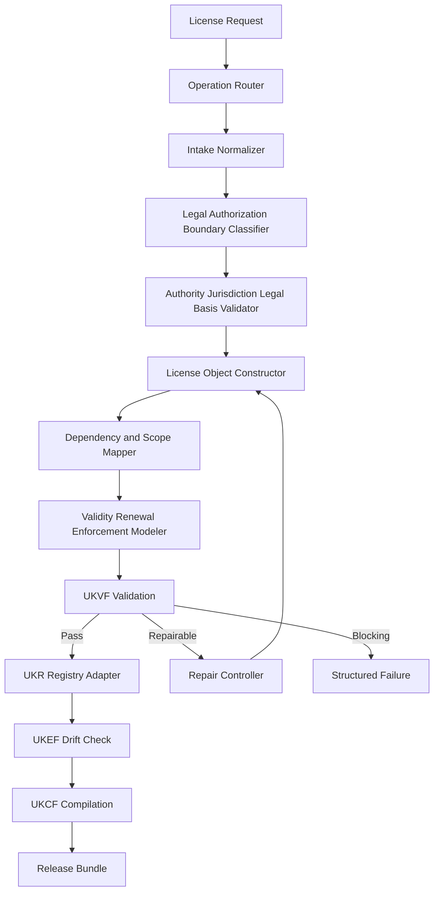
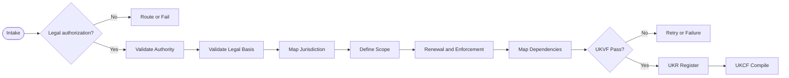
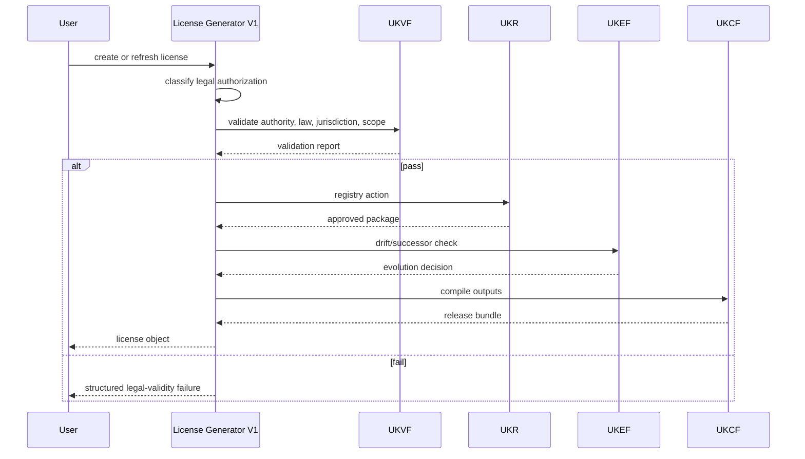
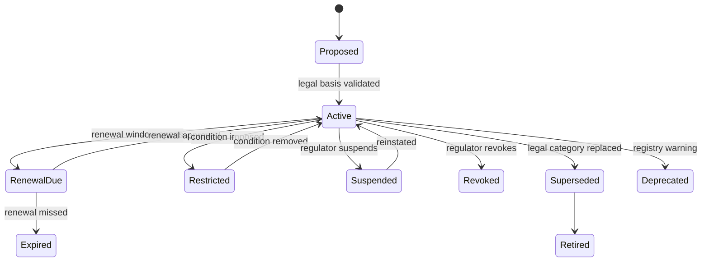

# License Generator V1

    **File Path:** `assets/knowledge/generators/license/License_Generator_V1.md`  
    **Generator ID:** `generator:license:v1`  
    **Entity Type:** `license`  
    **Status:** Production Ready  
    **Version:** 1.0.0  
    **Release Date:** 2026-06-28  
    **Owner:** KarirGPS Principal Knowledge Engineering Team

    ---

    ## 1. Document Control

    | Field | Value |
    |---|---|
    | Document name | License Generator V1 |
    | Canonical file | `assets/knowledge/generators/license/License_Generator_V1.md` |
    | Generator class | Entity Generator |
    | Target entity | License |
    | Upstream dependencies | AI Constitution, Career Knowledge Ontology, KOS, UEGF, UKPP, UKVF, UKR, UKL, UKQF, UKEF, UKCF, Generator Development Standard V1 |
    | Reference generator lineage | Career, Skill, Competency, Knowledge Domain, Work Task, Work Activity, Technology, Tool, Industry, Organization, Education Program, Major Generators V1 |
    | Release state | Production-ready implementation specification |
    | Change policy | Revisions must preserve locked architecture inheritance and pass conformance tests. |


### 1.1 Generator Development Standard V1 Mandatory Section Map

| Required Element | Implemented Section |
|---|---|
| Purpose | Section 2 |
| Scope | Section 3 |
| Philosophy | Section 4 |
| Architecture | Section 6 |
| Lifecycle | Section 7 |
| Inputs/Outputs | Section 8 |
| Entity taxonomy and definition | Section 9 |
| Relationship mapping | Section 10 |
| Canonical object model | Section 11 |
| Generation Pipeline | Section 12 |
| Prompt Templates | Section 13 |
| Validation Rules | Section 14 |
| Failure Modes | Section 15 |
| Retry Strategy | Section 16 |
| Registry Integration | Section 17 |
| Language, query, and compilation | Section 18 |
| Evolution Model | Section 19 |
| Example Objects | Section 20 |
| Diagrams: Mermaid + Flow + Sequence + State | Section 21 |
| Conformance Tests | Section 22 |
| Production Readiness Checklist | Section 23 |
| Release Contract | Section 24 |


## 2. Purpose

The License Generator V1 creates, revises, repairs, localizes, enriches, refreshes evidence for, and creates evolution successors for `license` knowledge objects. A license is a legally recognized authorization, permit, registration, approval, or right-to-practice issued or recognized by a government agency, statutory board, professional regulator, or legally empowered authority within a defined jurisdiction.

## 3. Scope

### 3.1 In Scope

- Government-issued licenses, professional licenses, occupational licenses, business/facility licenses, operating permits, protected-title registrations, temporary/provisional licenses, restricted endorsements, and cross-border recognition arrangements.
- Legal licensing models, jurisdiction mapping, issuing authority, legal basis, scope of practice, legal validity, renewal cycle, compliance enforcement, cross-border recognition, dependency on certification/education/examination/experience, and lifecycle.

### 3.2 Out of Scope

- Non-legal skill credentials; use Certification.
- Learning materials and preparation content; use Learning Resource.
- Regulations themselves; use Regulation.
- Legal advice to end users. This generator models license objects and must surface verification limits.

## 4. Philosophy

License objects are high-stakes legal entities. The generator must be conservative, jurisdiction-aware, evidence-driven, and explicit about legal validity. A license cannot be inferred from a certification, degree, course, or job title. It must be anchored to legal authority, legal basis, jurisdiction, and a defined authorized activity or protected title. Career matching may use license objects to identify requirements, but no generated object may state that a person is legally allowed to practice without current jurisdiction-specific verification.


## 5. Authority, Inheritance, and Non-Redesign Constraint

This generator is an implementation artifact. It does not redesign, fork, replace, duplicate, or reinterpret any KarirGPS foundation, ontology, core engine, standard, registry rule, validation rule, language rule, query rule, evolution rule, or compilation rule. It implements entity-specific behavior only inside the locked KarirGPS architecture.

| Authority | Binding Inheritance |
|---|---|
| AI Constitution | Enforces safety, truthfulness, privacy, non-deception, fairness, traceability, and human-benefit constraints. |
| Career Knowledge Ontology | Binds this entity to the canonical Career → Skill → Competency → Knowledge Domain → Work Task → Work Activity → Technology → Tool graph and to Batch 3/4 entities through explicitly allowed relationships. |
| KOS | Requires canonical identity, version, lifecycle, evidence, validation, registry, language, query, lineage, and compiled output fields. |
| UEGF | Supplies operation contracts for create, revise, repair, localize, enrich, evidence_refresh, and evolution_successor. |
| UKPP | Supplies deterministic intake, normalization, generation, validation, repair, registration, compilation, and release stages. |
| UKVF | Supplies structural, semantic, ontological, evidence, safety, language, registry, query, evolution, and compilation validation suites. |
| UKR | Supplies identity, deduplication, merge, versioning, lineage, registry transition, deprecation, and successor rules. |
| UKL | Supplies canonical language, localization, terminology control, and semantic equivalence rules. |
| UKQF | Supplies query facets, graph traversal, relationship indexing, and embedding-text requirements. |
| UKEF | Supplies drift detection, evidence aging, lifecycle transitions, successor creation, compatibility, and migration handling. |
| UKCF | Supplies lossless compilation to Markdown, JSON, graph triples, embedding text, API payload, and registry manifest. |
| Generator Development Standard V1 | Supplies mandatory sections, engineering acceptance gates, failure handling, diagrams, and release checks. |

### 5.1 Binding Conflict Rule

If any entity-specific rule conflicts with an upstream authority, the generator must stop, emit `authoritative_conflict`, identify the exact rule path, and return a structured repair report. The generator must not resolve conflicts by guessing or silently overriding the locked system.


## 6. Architecture

### 6.1 Runtime Components

| Component | Responsibility | Output |
|---|---|---|
| Operation Router | Routes UEGF operation and validates operation preconditions. | Operation context. |
| Intake Normalizer | Normalizes label, aliases, source facts, locale, evidence policy, jurisdiction terms, and relationship hints. | Normalized request. |
| Entity Boundary Classifier | Confirms the candidate belongs to this entity and not to a neighboring generator. | Boundary decision. |
| Evidence Planner | Classifies claims by source need, freshness, reliability, and unsupported-claim policy. | Evidence plan. |
| Object Constructor | Builds KOS envelope, entity fields, lifecycle, scores, risks, and query facets. | Candidate object. |
| Relationship Resolver | Normalizes relationship names, target types, cardinalities, inverse hints, and graph impact. | Relationship graph. |
| Validation Orchestrator | Runs UKVF and entity-specific validation. | Validation report. |
| Repair Controller | Applies deterministic repair for valid repair classes and enforces retry limits. | Repaired object or failure. |
| Registry Adapter | Applies UKR identity, deduplication, merge, versioning, lineage, and state transition. | Registry action. |
| Evolution Adapter | Applies UKEF drift, successor, deprecation, compatibility, and migration rules. | Evolution package. |
| Compilation Adapter | Applies UKCF to generate Markdown, JSON, graph triples, embedding text, API payload, and manifest. | Release bundle. |

### 6.2 Architecture Constraints

- The generator is stateless except for registry and validation context supplied by UKR/UKVF.
- The generator emits only a KOS-compliant object, compiled release bundle, registry action, or structured failure.
- It cannot introduce new universal frameworks, new ontology roots, hidden relation types, or non-KOS output formats.
- All object claims requiring evidence must be evidence-backed, evidence-limited, or removed.
- Localization and compilation must preserve canonical meaning.


## 7. Lifecycle

```yaml
license_lifecycle:
  object_lifecycle_state:
    - proposed
    - active
    - restricted
    - temporary
    - probationary
    - renewal_due
    - expired
    - suspended
    - revoked
    - superseded
    - deprecated
    - retired
  applicant_pathway_state:
    - eligible
    - education_required
    - certification_required
    - examination_required
    - supervised_practice_required
    - application_pending
    - approved
    - denied
  legal_validity_state:
    - valid
    - conditionally_valid
    - limited_validity
    - not_currently_valid
    - recognition_pending
    - recognition_not_available
```

| Transition | Allowed When | Required Metadata |
|---|---|---|
| proposed → active | Legal authority, legal basis, jurisdiction, scope, and evidence validate. | effective_date, authority, legal_basis. |
| active → renewal_due | Renewal window opens. | renewal_due_date, renewal_requirements. |
| renewal_due → active | Regulator accepts renewal. | renewal_evidence, new_expiry_date. |
| active → restricted | Legal scope limited by condition, endorsement, supervision, or disciplinary order. | restriction_basis, restricted_scope. |
| restricted/suspended → active | Authority restores status. | reinstatement_basis. |
| active → suspended | Authority temporarily removes privilege. | suspension_basis. |
| active/suspended/restricted → revoked | Authority permanently removes privilege. | revocation_basis. |
| active → expired | Validity period ends without renewal. | expiration_date, grace_period. |
| active → superseded | Legal category or framework replaced. | successor_id, transition_rule. |


## 8. Inputs/Outputs

### 8.1 Required Inputs

| Input | Type | Required | Rule |
|---|---|---:|---|
| `operation` | enum | Yes | `create`, `revise`, `repair`, `localize`, `enrich`, `evidence_refresh`, or `evolution_successor`. |
| `candidate_label` | string | Yes | Name or title to normalize into canonical label and slug. |
| `candidate_description` | string | Yes | Source description sufficient for boundary classification and required fields. |
| `canonical_language` | BCP-47 language tag | Yes | Default `en`; localized variants are handled by UKL. |
| `source_context` | object | Yes | User source facts, imported data, registry state, or controlled corpus references. |
| `evidence_policy` | object | Yes | Required source class, freshness threshold, reliability threshold, and unsupported-claim behavior. |
| `registry_mode` | enum | Yes | `draft`, `candidate`, `registered`, `revise_existing`, `merge_candidate`, or `deprecate_candidate`. |
| `validation_mode` | enum | Yes | `strict` for release; `exploratory` for non-release analysis. |
| `relationship_hints` | relation[] | No | Existing graph references to validate, normalize, or reject. |
| `locale_targets` | string[] | No | Locale variants to generate through UKL. |

### 8.2 Required Outputs

| Output | Type | Required | Rule |
|---|---|---:|---|
| `kos_object` | object | Yes | Canonical KOS-compliant entity object. |
| `validation_report` | object | Yes | UKVF result plus entity-specific checks. |
| `registry_action` | object | Yes | UKR action and lineage entry. |
| `relationship_delta` | object | Yes | Added, changed, removed, and rejected relationships. |
| `evidence_delta` | object | Yes | Evidence added, refreshed, downgraded, or rejected. |
| `compiled_outputs` | object | Yes | Markdown, JSON, graph triples, embedding text, API payload, registry manifest. |
| `audit_log` | object | Yes | Operation, generator version, source hash, validation summary, release decision. |

### 8.3 Structured Failure Output

```yaml
failure:
  code: string
  severity: blocking | major | minor | advisory
  operation: create | revise | repair | localize | enrich | evidence_refresh | evolution_successor
  entity_type: string
  field_path: string
  reason: string
  upstream_rule: string
  repair_action: string
  retry_allowed: boolean
  registry_safe: boolean
```


## 9. Entity Definition and Taxonomy

A `license` object is a legal authorization with issuing/legal authority, jurisdiction, scope of practice, legal validity rules, renewal cycle, compliance obligations, enforcement consequences, and dependency pathway.

### 9.1 Legal Licensing Models

```yaml
license_taxonomy:
  primary_model:
    - government_issued_license
    - professional_license
    - occupational_license
    - facility_license
    - business_license
    - operating_permit
    - practice_registration
    - title_protection_registration
    - temporary_license
    - trainee_or_provisional_license
    - restricted_endorsement
    - cross_border_recognition_license
  authority_type:
    - national_government_agency
    - subnational_government_agency
    - municipal_authority
    - statutory_professional_board
    - court_or_legal_authority
    - delegated_regulator
    - accreditation_body_with_legal_mandate
    - treaty_or_mutual_recognition_body
  legal_effect:
    - authorizes_practice
    - authorizes_business_operation
    - authorizes_facility_operation
    - authorizes_protected_title_use
    - authorizes_controlled_activity
    - authorizes_public_service_role
    - authorizes_cross_border_practice
    - restricts_practice_to_supervision
  validity_model:
    - fixed_term_renewable
    - annual_renewal
    - multi_year_renewal
    - perpetual_with_continuing_obligations
    - temporary_fixed_term
    - conditional_validity
    - emergency_or_exception_validity
```

### 9.2 Jurisdiction Mapping and Legal Validity

```yaml
legal_validity_rules:
  issuing_authority_required: true
  legal_basis_required: true
  jurisdiction_required: true
  scope_of_practice_required: true
  effective_date_required: true
  expiration_or_perpetual_basis_required: true
  verification_path_required_for_release: true
  cannot_infer_from_certification: true
  cannot_infer_from_degree: true
  cannot_recommend_as_valid_without_current_evidence: true

jurisdiction_mapping:
  jurisdiction_type: country | state_or_province | municipality | regional_bloc | treaty_zone | professional_district | special_administrative_zone
  jurisdiction_name: string
  jurisdiction_code: string
  authority_scope: string
  practice_scope: []
  recognition_scope: []
  localization_terms: []
```

### 9.3 Renewal, Enforcement, Cross-Border Recognition, and Dependencies

```yaml
renewal_model:
  renewal_required: true
  renewal_cycle_months: 60
  renewal_window_days_before_expiry: 120
  grace_period_days: 30
  renewal_requirements:
    - fee_payment
    - continuing_professional_development
    - updated_background_check
    - practice_hours
    - certification_maintenance
    - professional_good_standing

compliance_enforcement:
  enforcement_body: organization_ref_or_authority_name
  enforcement_mechanisms:
    - audit
    - inspection
    - complaint_investigation
    - renewal_review
    - disciplinary_hearing
    - administrative_penalty
    - civil_penalty
    - criminal_referral
  disciplinary_outcomes:
    - warning
    - fine
    - restriction
    - suspension
    - revocation
    - remediation_order
    - public_registry_notice

cross_border_recognition:
  recognition_type:
    - none
    - mutual_recognition_agreement
    - reciprocity
    - endorsement
    - temporary_mobility
    - automatic_recognition
    - partial_recognition
    - case_by_case_assessment
  target_jurisdictions: []
  additional_requirements:
    - local_law_exam
    - language_requirement
    - supervised_practice
    - local_registration
    - good_standing_certificate
    - credential_evaluation

dependency_model:
  education_dependencies: []
  major_dependencies: []
  certification_dependencies: []
  examination_dependencies: []
  experience_dependencies: []
  background_dependencies: []
```

## 10. Relationship Mapping and Ontology Alignment

| Relationship | Target Entity | Cardinality | Meaning |
|---|---|---:|---|
| `issued_by` | organization | 1..n | Legal authority administering license. |
| `authorized_by_regulation` | regulation | 1..n | Legal framework governing license. |
| `authorizes_career` | career | 0..n | Career role or protected title requiring license. |
| `authorizes_work_task` | work_task | 0..n | Regulated task permitted by license. |
| `authorizes_work_activity` | work_activity | 0..n | Regulated activity permitted by license. |
| `requires_skill` | skill | 0..n | Skills required to qualify or practice safely. |
| `requires_competency` | competency | 0..n | Competencies required by licensure pathway. |
| `requires_knowledge_domain` | knowledge_domain | 0..n | Domain knowledge required by law/exam/practice. |
| `requires_education_program` | education_program | 0..n | Education program required or accepted. |
| `requires_major` | major | 0..n | Major or field requirement. |
| `requires_certification` | certification | 0..n | Certification required or accepted. |
| `supported_by_learning_resource` | learning_resource | 0..n | Preparation resource. |
| `aligned_to_industry` | industry | 0..n | Industry where license controls work. |
| `restricts_tool_use` | tool | 0..n | Tool use restricted to license holders. |
| `restricts_technology_use` | technology | 0..n | Technology operation legally restricted. |
| `recognizes_license` | license | 0..n | This license recognizes another license. |
| `recognized_by_license` | license | 0..n | Another license recognizes this license. |
| `supersedes_license` | license | 0..n | Legal successor relationship. |
| `superseded_by_license` | license | 0..n | Replacement license. |

Boundary rules: non-legal credentials route to Certification; legal rules route to Regulation; preparation content routes to Learning Resource; education pathways route to Education Program or Major.

## 11. Canonical Object Model

```yaml
kos:
  kos_version: "1.0"
  object_id: "license:registered_clinical_data_practitioner_demo:v1"
  object_type: "license"
  object_version: "1.0.0"
  lifecycle_state: active
  canonical_language: en
  created_by_generator: "generator:license:v1"
  created_at: "2026-06-28T00:00:00+07:00"
  updated_at: "2026-06-28T00:00:00+07:00"
```

| Field | Type | Required | Description |
|---|---|---:|---|
| `canonical_label` | string | Yes | Official or normalized license name. |
| `aliases` | string[] | Yes | Local names, abbreviations, former names. |
| `definition` | string | Yes | Legal authorization definition. |
| `license_taxonomy` | object | Yes | Model, authority type, legal effect, validity model. |
| `issuing_authority` | object | Yes | Authority, jurisdiction, verification path. |
| `legal_basis` | object | Yes | Regulation/statute/delegated instrument establishing license. |
| `jurisdiction_mapping` | object | Yes | Jurisdiction and recognition scope. |
| `scope_of_practice` | object | Yes | Authorized, restricted, and excluded activities. |
| `legal_validity_rules` | object | Yes | Validity and verification conditions. |
| `renewal_model` | object | Yes | Renewal cycle, requirements, grace period, effects. |
| `compliance_enforcement` | object | Yes | Enforcement body, inspections, penalties, discipline. |
| `cross_border_recognition` | object | Yes | Reciprocity, endorsement, mobility, partial recognition, or none. |
| `dependency_model` | object | Yes | Education, certification, exam, experience, background dependencies. |
| `risk_level` | object | Yes | Public safety, legal, compliance, and recommendation caution. |
| `relationships` | object | Yes | Ontology relationships. |
| `evidence` | object[] | Yes | Evidence ledger. |
| `validation` | object | Yes | UKVF result. |
| `registry` | object | Yes | UKR action and lineage. |
| `query_facets` | object | Yes | UKQF indexing metadata. |


## 12. Generation Pipeline

| Stage | Name | Inputs | Processing | Outputs | Blocking Gate |
|---:|---|---|---|---|---|
| 1 | Intake | Operation context, source context | Parse operation, normalize label, extract aliases and claims. | Normalized request. | Missing operation, label, description, or evidence policy. |
| 2 | Boundary Classification | Normalized request | Check entity identity against all neighboring generators. | Boundary decision. | Candidate belongs elsewhere or mixes entities. |
| 3 | Ontology Binding | Boundary decision, hints | Bind allowed classes, relationships, and inverse hints. | Binding map. | Unknown class or illegal relationship. |
| 4 | Evidence Planning | Claims, evidence policy | Determine evidence need, freshness, source reliability, unsupported-claim treatment. | Evidence plan. | High-impact claim has no allowed evidence route. |
| 5 | Object Construction | Binding map, source facts | Generate KOS envelope, entity fields, lifecycle, scores, risks, and query facets. | Draft KOS object. | Required fields missing. |
| 6 | Relationship Resolution | Draft object, registry refs | Resolve target IDs, cardinality, direction, and graph consistency. | Relationship graph. | Unsupported, circular, or contradictory relation. |
| 7 | Scoring and Risk | Draft object, evidence ledger | Compute score components and risk flags. | Scored candidate. | Score not reproducible. |
| 8 | Validation | Scored candidate | Run UKVF and entity-specific validators. | Validation report. | Any blocking finding. |
| 9 | Repair Loop | Validation report | Apply deterministic repair and rerun validation. | Repaired object or failure. | More than two repair cycles or non-repairable defect. |
| 10 | Registry Decision | Validated object, UKR lookup | Create, revise, merge, reject, deprecate, or successor-link. | Registry action. | Identity collision or unsafe merge. |
| 11 | Compilation | Registry-ready object | Compile through UKCF. | Release bundle. | Markdown/JSON/triples/API mismatch. |
| 12 | Release | Release bundle, audit log | Emit artifacts and registry action. | Production release artifact. | Missing artifact or incomplete audit. |

### 12.1 Supported Operations

| Operation | Identity Rule | Output Rule |
|---|---|---|
| `create` | Allocate new canonical ID unless UKR resolves equivalent object. | New registry-ready object. |
| `revise` | Preserve identity; increment semantic version; append lineage. | Revision diff and updated object. |
| `repair` | Preserve identity unless misclassified. | Repair log and repaired object. |
| `localize` | Preserve canonical ID and meaning. | Locale variant and query aliases. |
| `enrich` | Preserve identity; append provenance. | Enrichment delta and updated object. |
| `evidence_refresh` | Preserve identity; update evidence ledger. | Evidence delta and drift report. |
| `evolution_successor` | Create successor ID; link predecessor. | Successor object and migration notes. |


## 13. Prompt Templates

### 13.1 Create Prompt

```text
System: You are License Generator V1 operating under the locked KarirGPS architecture. Do not redesign frameworks. Produce only a KOS-compliant license object or a structured failure.
Developer: Confirm entity boundary, required fields, lifecycle, evidence, relationships, validation, registry action, and compiled outputs.
User: operation=create; candidate_label={candidate_label}; candidate_description={candidate_description}; canonical_language={canonical_language}; evidence_policy={evidence_policy}; registry_mode={registry_mode}; relationship_hints={relationship_hints}.
Output: kos_object, validation_report, registry_action, relationship_delta, evidence_delta, compiled_outputs, audit_log.
```

### 13.2 Revise Prompt

```text
System: Preserve object identity unless UKR/UKEF requires successor or reclassification.
Developer: Apply the requested source-supported changes, compute field/relationship/evidence deltas, rerun strict validation, and append lineage.
User: operation=revise; existing_object={existing_object}; change_request={change_request}; source_context={source_context}.
Output: revision_diff, updated_kos_object, validation_report, registry_action.
```

### 13.3 Repair Prompt

```text
System: Repair only defects supported by source context, ontology, or schema. Do not invent evidence or authority facts.
Developer: Fix blocking and major validation findings within retry limits; return repair_required when unresolved.
User: operation=repair; invalid_object={object}; validation_findings={validation_findings}; evidence_policy={evidence_policy}.
Output: repair_log, repaired_object, unresolved_findings, validation_report.
```

### 13.4 Localize Prompt

```text
System: Preserve canonical meaning while creating locale-specific labels, definitions, examples, and query aliases.
Developer: Apply UKL terminology control and semantic-equivalence validation.
User: operation=localize; object_id={object_id}; target_locales={locale_targets}; localization_context={localization_context}.
Output: localized_variants, UKL_validation_report, query_alias_delta.
```

### 13.5 Enrich Prompt

```text
System: Enrich only when evidence, ontology, and registry policy allow it.
Developer: Add relationships, scoring detail, risk flags, examples, or operational detail; validate no contradiction.
User: operation=enrich; object_id={object_id}; enrichment_request={enrichment_request}; source_context={source_context}.
Output: enriched_object, enrichment_delta, validation_report.
```

### 13.6 Evidence Refresh Prompt

```text
System: Reassess evidence freshness, source reliability, source relevance, lifecycle drift, and score changes.
Developer: Remove, downgrade, or repair claims that no longer satisfy evidence policy.
User: operation=evidence_refresh; object_id={object_id}; evidence_policy={evidence_policy}; refresh_date=2026-06-28.
Output: evidence_delta, score_delta, drift_report, updated_object.
```

### 13.7 Evolution Successor Prompt

```text
System: Create a successor only when material change requires a new identity under UKEF.
Developer: Compare predecessor and successor candidate, decide revise versus successor, link migration notes.
User: operation=evolution_successor; predecessor={object_id}; successor_context={successor_context}.
Output: successor_object, predecessor_transition, migration_notes, validation_report.
```


## 14. Validation Rules

### 14.1 Universal UKVF Layers

| Layer | Checks | Blocking Conditions | Repair Path |
|---|---|---|---|
| Structural | Required fields, types, enums, cardinality, KOS envelope. | Missing required field, invalid object type, malformed schema. | Rebuild schema fragment or fail. |
| Semantic | Definition clarity, entity boundary, non-circular meaning, unsupported claims. | Entity cannot be distinguished from neighboring generator. | Rewrite, reclassify, or fail. |
| Ontological | Allowed relationship names, target types, cardinality, graph direction. | Illegal relation, invalid target, contradictory dependency. | Remove, remap, or fail. |
| Evidence | Source reliability, relevance, freshness, traceability, claim coverage. | Fabricated evidence or high-impact unsupported claim. | Refresh, downgrade, remove, or fail. |
| Safety | Privacy, non-deception, harmful automation, legal/credential misinformation. | Unsafe or deceptive object claim. | Constrain or fail. |
| Language | Canonical language, localization equivalence, controlled terminology. | Translation changes credential/legal/compliance meaning. | Regenerate locale variant. |
| Registry | ID uniqueness, duplicate detection, version lineage, merge safety. | Identity collision or unsafe merge. | Use UKR resolution or fail. |
| Query | Facet completeness, alias quality, graph indexability, embedding fidelity. | Object cannot be retrieved or traversed correctly. | Rebuild facets. |
| Evolution | Valid lifecycle transitions, successor basis, compatibility notes. | Invalid transition or successor without material change. | Correct UKEF metadata. |
| Compilation | Markdown/JSON/triples/API equivalence. | Lost relationship, missing field, checksum mismatch. | Recompile from canonical object. |

### 14.2 Validation Result Format

```yaml
validation:
  framework: UKVF
  validation_mode: strict
  result: pass | fail | pass_with_warnings
  blocking_count: 0
  major_count: 0
  minor_count: 0
  advisory_count: 0
  checks:
    structural: pass | fail
    semantic: pass | fail
    ontological: pass | fail
    evidence: pass | fail | limited
    safety: pass | fail
    language: pass | fail
    registry: pass | fail
    query: pass | fail
    evolution: pass | fail
    compilation: pass | fail
  entity_specific_checks: []
  repair_attempts: 0
  release_allowed: true
```


### 14.3 License-Specific Rules

| Rule ID | Rule | Severity |
|---|---|---|
| LIC-V-01 | Issuing authority must be legally empowered. | Blocking |
| LIC-V-02 | Legal basis is required for release. | Blocking |
| LIC-V-03 | Jurisdiction and recognition scope must be explicit. | Blocking |
| LIC-V-04 | Scope of practice must define authorized and excluded activities. | Blocking |
| LIC-V-05 | License cannot be inferred from certification, degree, employer role, or course. | Blocking |
| LIC-V-06 | Cross-border recognition requires explicit recognition basis. | Blocking |
| LIC-V-07 | Renewal or perpetual-validity basis must be specified. | Blocking |
| LIC-V-08 | Suspended, revoked, restricted, or expired licenses cannot be recommended as unrestricted authorization. | Blocking |
| LIC-V-09 | Dependency chain must use valid entity types and direction. | Major |
| LIC-V-10 | Enforcement body must be identified or disclosed as evidence-limited. | Major |


## 15. Failure Modes

| Failure Code | Severity | Meaning | Required Response |
|---|---|---|---|
| `entity_boundary_error` | Blocking | Candidate belongs to another generator or mixes entity types. | Stop, identify correct generator, do not release object. |
| `missing_required_field` | Blocking | Required KOS/entity field is absent. | Repair when source-supported; otherwise return repair request. |
| `invalid_relationship` | Blocking | Relation name, target type, cardinality, or direction violates ontology. | Remove or remap only when unambiguous. |
| `unsupported_claim` | Blocking for high-impact facts | Claim lacks acceptable evidence. | Remove, downgrade, refresh evidence, or fail. |
| `identity_collision` | Blocking | Proposed ID conflicts with UKR. | Invoke UKR duplicate/merge resolution. |
| `lifecycle_transition_error` | Major or blocking | Proposed lifecycle transition violates UKEF. | Correct transition or fail. |
| `localization_drift` | Major | Locale variant changes canonical meaning. | Regenerate locale variant. |
| `compilation_mismatch` | Blocking | Compiled outputs lose canonical semantics. | Recompile from canonical object. |
| `safety_policy_violation` | Blocking | Output enables deception, privacy breach, harm, or legal/credential misinformation. | Stop and emit safety failure. |
| `authoritative_conflict` | Blocking | Entity behavior conflicts with locked architecture. | Stop and report conflict. |

## 16. Retry Strategy

| Failure Class | Retry Allowed | Maximum Attempts | Strategy |
|---|---:|---:|---|
| Missing optional enrichment | Yes | 1 | Generate conservative enrichment only if ontology/evidence permit. |
| Missing required field with source support | Yes | 2 | Fill from source context or deterministic schema inference. |
| Invalid enum or malformed schema | Yes | 2 | Normalize enum and rebuild schema fragment. |
| Unsupported relation | Yes | 1 | Remove or remap when semantic equivalence is clear. |
| Ambiguous entity boundary | Yes | 1 | Reclassify against neighboring generators; fail if unresolved. |
| Weak or stale evidence | Yes | 1 | Downgrade, refresh, or remove affected claim. |
| Identity collision | Yes | 1 | Use UKR deduplication/merge decision. |
| Legal/compliance contradiction | No | 0 | Stop; do not repair by guessing. |
| Safety violation | No | 0 | Stop; emit AI Constitution failure. |
| Upstream conflict | No | 0 | Stop; emit authoritative conflict. |

Retry exits when blocking failures reach zero, the same blocking defect appears twice, a no-retry defect appears, or repair would require missing facts. A third unresolved blocking defect emits `repair_required`.

## 17. Registry Integration

### 17.1 Identity and Versioning

| Rule | Requirement |
|---|---|
| Canonical ID | `object_type:normalized_slug:vMajor` unless UKR assigns a canonical ID. |
| Slug source | Canonical label, disambiguated by authority, jurisdiction, level, domain, or scope. |
| Version | Semantic version in `object_version`; major version only when compatibility breaks. |
| Lineage | Every operation appends operation, timestamp, generator ID, source hash, evidence delta, relationship delta, and reason. |
| Duplicate detection | Compare canonical label, aliases, authority/source, jurisdiction/scope, taxonomy, relationships, and evidence signature. |
| Merge policy | Merge only when semantic equivalence is proven and no legal, credential, learning, or compliance scope is lost. |

### 17.2 Registry Action Payload

```yaml
registry_action:
  action: create | revise | repair | merge | reject | deprecate | successor
  target_object_id: string
  prior_object_id: string | null
  successor_object_id: string | null
  identity_confidence: 0.0
  version_increment: major | minor | patch | none
  deduplication_basis: []
  lineage_entry:
    timestamp: datetime
    generator_id: string
    operation: string
    reason: string
    evidence_delta_summary: string
    relationship_delta_summary: string
```

## 18. Language, Query, and Compilation Integration

### 18.1 UKL Rules

- Canonical language is preserved in `canonical_language`.
- Localized variants must preserve canonical meaning and relationship semantics.
- Locale aliases must not override canonical labels.
- Legal, credential, curriculum, and compliance terms must use precise local equivalents when available.
- Localized examples must carry locale metadata and cannot change object identity.

### 18.2 UKQF Facets

```yaml
query_facets:
  object_type: string
  canonical_label: string
  aliases: []
  taxonomy: []
  lifecycle_state: string
  jurisdiction_scope: []
  industry_alignment: []
  related_careers: []
  related_skills: []
  related_competencies: []
  related_knowledge_domains: []
  related_work_tasks: []
  related_work_activities: []
  related_technologies: []
  related_tools: []
  related_certifications: []
  related_licenses: []
  related_learning_resources: []
  related_regulations: []
  authority_or_source: []
  compliance_relevance: []
  score_bands: []
  evidence_confidence: string
```

### 18.3 UKCF Outputs

| Output | Requirement |
|---|---|
| Markdown | Human-readable object card and specification summary. |
| JSON | Canonical machine object with stable field order. |
| Graph triples | Subject-predicate-object triples for all relationships. |
| Embedding text | Controlled summary optimized for semantic retrieval. |
| API payload | Registry-safe payload with validation and registry metadata. |
| Registry manifest | Object ID, version, checksum, dependencies, lifecycle, release status. |


## 19. Evolution Model

| Drift Signal | Impact | Action |
|---|---|---|
| Law/regulation amended | Legal basis or scope changes | Evidence refresh; revise or successor. |
| Issuing authority reorganized | Registry and verification path changes | Revise; successor if legal continuity breaks. |
| Scope of practice changes | Career/task authorization changes | Update relationships; successor if incompatible. |
| Cross-border agreement changes | Recognition changes | Update recognition model and facets. |
| Renewal requirements change | Pathway and maintenance impact | Revise renewal model. |
| License renamed with legal continuity | Identity ambiguity | Preserve ID with aliases. |
| License category abolished | Lifecycle impact | Supersede, deprecate, or retire. |

Successor is required for a new legal category, materially different scope, regulator discontinuity, changed jurisdictional basis, or statutory replacement. Fee or form changes normally use `revise`.

## 20. Example Objects

This synthetic object is for engineering conformance tests only.

```yaml
kos:
  kos_version: "1.0"
  object_id: "license:registered_clinical_data_practitioner_demo:v1"
  object_type: "license"
  object_version: "1.0.0"
  lifecycle_state: active
  canonical_language: en
  created_by_generator: "generator:license:v1"
  created_at: "2026-06-28T00:00:00+07:00"
  updated_at: "2026-06-28T00:00:00+07:00"
canonical_label: "Registered Clinical Data Practitioner Demo License"
aliases: ["RCDP Demo License"]
definition: "A synthetic legal-authorization object used to test jurisdiction-specific permission to perform regulated clinical data handling activities."
license_taxonomy:
  primary_model: professional_license
  authority_type: statutory_professional_board
  legal_effect: authorizes_controlled_activity
  validity_model: fixed_term_renewable
issuing_authority:
  authority_name: "KarirGPS Synthetic Health Data Licensing Board"
  authority_type: statutory_professional_board
  jurisdiction: "synthetic_jurisdiction"
  verification_path: "synthetic_registry_record"
legal_basis:
  basis_type: synthetic_regulation
  regulation_ref: "regulation:synthetic_health_data_practice_rule:v1"
  effective_date: "2026-01-01"
jurisdiction_mapping:
  jurisdiction_type: special_administrative_zone
  jurisdiction_name: "Synthetic Health Data Zone"
  recognition_scope: local
scope_of_practice:
  authorized_activities: ["Classify clinical data sensitivity under supervised organizational policy."]
  excluded_activities: ["Independent legal privacy advice.", "Clinical diagnosis or treatment."]
  protected_title: "Registered Clinical Data Practitioner Demo"
renewal_model:
  renewal_required: true
  renewal_cycle_months: 24
  renewal_requirements: [continuing_professional_development, professional_good_standing]
compliance_enforcement:
  enforcement_body: "KarirGPS Synthetic Health Data Licensing Board"
  enforcement_mechanisms: [audit, complaint_investigation]
  disciplinary_outcomes: [restriction, suspension, revocation]
cross_border_recognition:
  recognition_type: none
  target_jurisdictions: []
dependency_model:
  certification_dependencies:
    - certification_ref: "certification:clinical_data_privacy_associate:v1"
      requirement_type: required
relationships:
  authorized_by_regulation: ["regulation:synthetic_health_data_practice_rule:v1"]
  requires_certification: ["certification:clinical_data_privacy_associate:v1"]
  authorizes_work_task: ["work_task:classify_clinical_data_sensitivity:v1"]
evidence:
  - evidence_id: "ev:license:rcdp:synthetic:001"
    source_type: synthetic_conformance_record
    claim: "Object exists for generator conformance testing."
    confidence: 1.0
validation: {framework: UKVF, result: pass, blocking_count: 0}
registry: {action: create, identity_status: new_unique}
query_facets:
  object_type: license
  jurisdiction_scope: [synthetic_jurisdiction]
  compliance_relevance: [regulated_activity_authorization]
```

## 21. Diagrams

### 21.1 Mermaid Architecture Diagram



### 21.2 Flow Diagram



### 21.3 Sequence Diagram



### 21.4 State Diagram




## 22. Conformance Tests

| Test ID | Test Name | Procedure | Expected Result |
|---|---|---|---|
| CT-01 | KOS Envelope Completeness | Generate minimum valid object and inspect KOS envelope. | Correct object type, generator ID, version, lifecycle, language, and timestamps. |
| CT-02 | Entity Boundary Protection | Submit neighboring entity candidates from all finalized generators. | Incorrect candidates are rejected or routed; no mixed object released. |
| CT-03 | Required Field Enforcement | Remove each required field one at a time. | UKVF reports blocking `missing_required_field`. |
| CT-04 | Relationship Cardinality | Submit invalid targets and illegal relation names. | Invalid relations rejected with field path. |
| CT-05 | Evidence Integrity | Attach stale, fabricated, or irrelevant evidence. | Evidence validation blocks or downgrades claims. |
| CT-06 | Registry Deduplication | Submit duplicate by alias, spelling, authority, and scope variation. | UKR identifies duplicate, merge, or disambiguation action. |
| CT-07 | Localization Equivalence | Generate locale variant and compare meaning. | UKL passes; no identity change. |
| CT-08 | Query Coverage | Query by label, alias, taxonomy, relationship, jurisdiction, lifecycle, and score band. | UKQF retrieves object and valid graph path. |
| CT-09 | Evolution Successor | Trigger material-change scenario. | UKEF creates successor only when required and links predecessor. |
| CT-10 | Compilation Equivalence | Compile to Markdown, JSON, triples, embedding text, API payload. | All formats preserve canonical semantics. |
| CT-11 | Retry Limit | Inject repeated blocking defect. | Generator stops after allowed attempts and emits structured failure. |
| CT-12 | Release Gate | Run strict validation on release candidate. | Release allowed only with zero blocking findings. |

## 23. Production Readiness Checklist

| Item | Required Status |
|---|---|
| Purpose, scope, and philosophy are explicit. | Pass |
| Architecture integrates UEGF, UKPP, UKVF, UKR, UKL, UKQF, UKEF, and UKCF. | Pass |
| Entity taxonomy, lifecycle, inputs/outputs, pipeline, prompts, validation, failures, retry, registry, evolution, relationships, examples, and diagrams are present. | Pass |
| Entity-specific scoring and evidence rules are reproducible. | Pass |
| All relationships use ontology-consistent target entity types and cardinalities. | Pass |
| Example object is complete enough for implementation tests. | Pass |
| Mermaid architecture, flow, sequence, and state diagrams are present. | Pass |
| Conformance tests are executable as engineering acceptance criteria. | Pass |
| No unfinished markers, missing sections, or framework redesign instructions are present. | Pass |

## 24. Release Contract

This generator is production-ready when all conformance tests pass, the production readiness checklist is satisfied, and strict UKVF validation returns zero blocking findings. Release authorizes implementation of this entity generator only and does not authorize any modification of the locked KarirGPS architecture.
