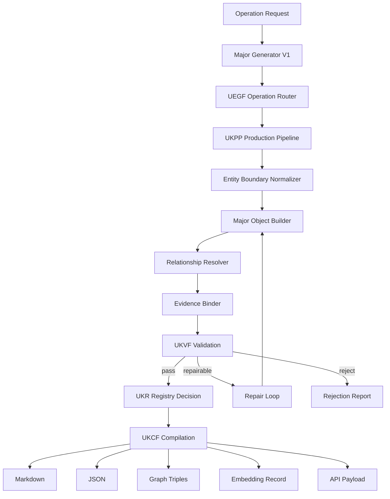
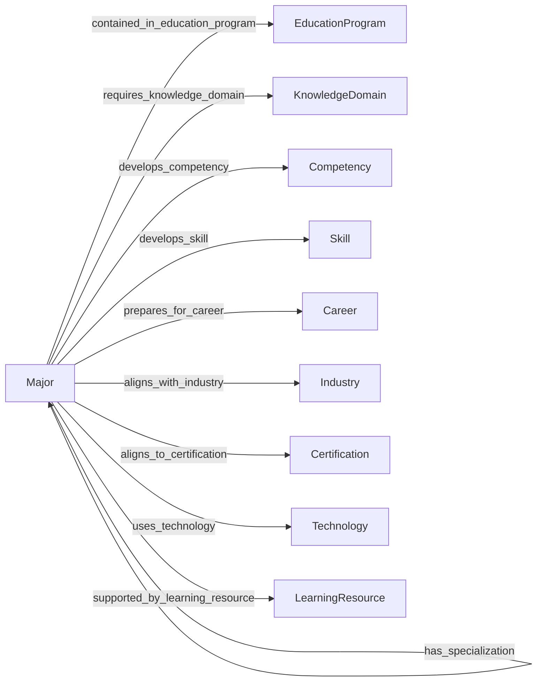
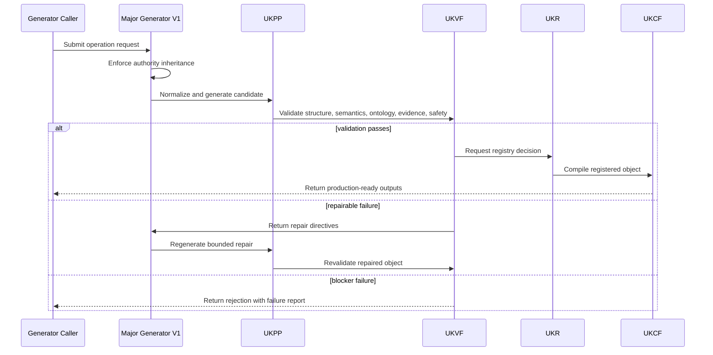
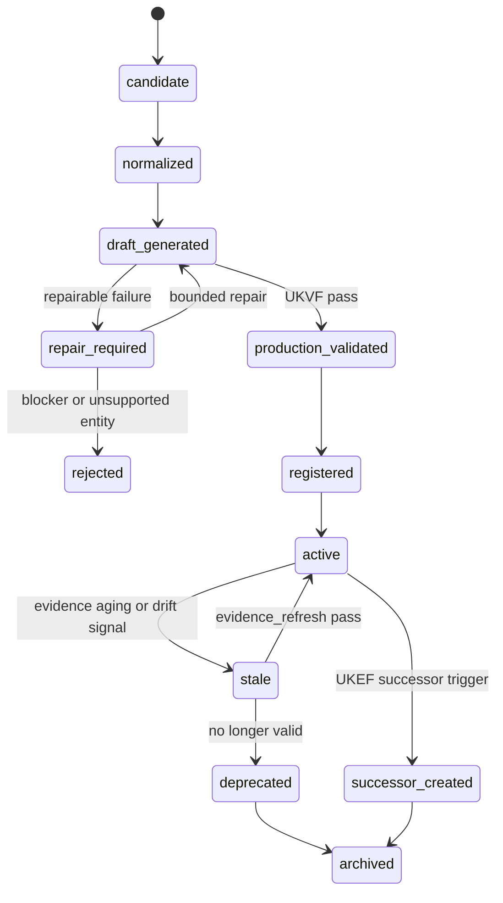
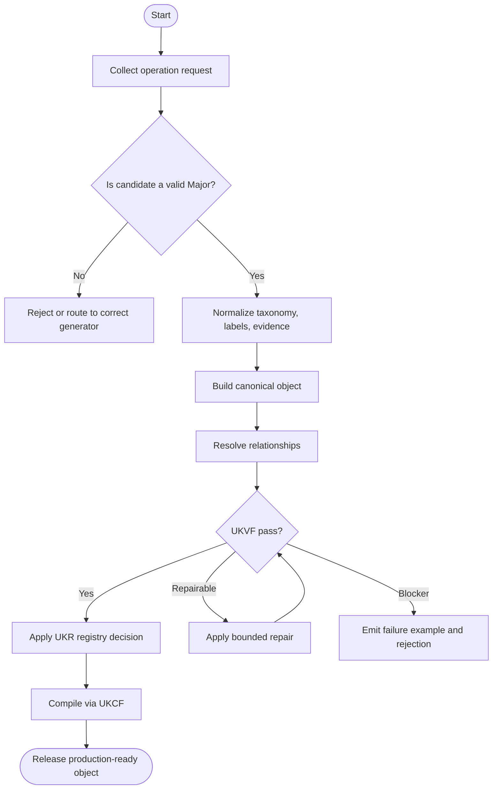
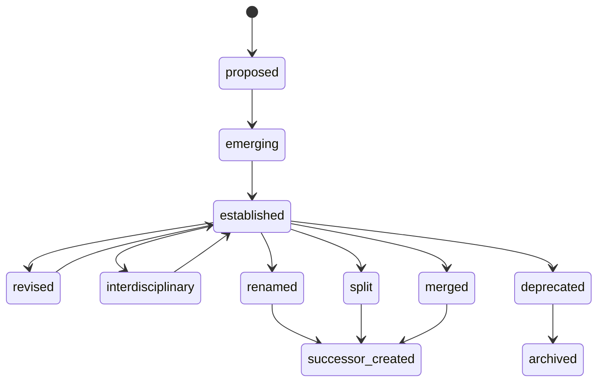

# Major Generator V1

**File Path:** `assets/knowledge/generators/major/Major_Generator_V1.md`  
**Generator ID:** `generator:major:v1`  
**Entity Type:** `major`  
**Status:** Production Ready  
**Version:** 1.0.0  
**Release Date:** 2026-06-28  
**Owner:** KarirGPS Principal Knowledge Engineering Team

---

## 1. Document Control

| Field | Value |
| --- | --- |
| Document name | Major Generator V1 |
| Canonical file | `assets/knowledge/generators/major/Major_Generator_V1.md` |
| Generator class | Entity Generator |
| Target entity | Major |
| Upstream dependencies | AI Constitution, Career Knowledge Ontology, KOS, UEGF, UKPP, UKVF, UKR, UKL, UKQF, UKEF, UKCF, Generator Development Standard V1 |
| Reference style | Career Generator V1, Skill Generator V1, Competency Generator V1, Knowledge Domain Generator V1, Work Task Generator V1, Work Activity Generator V1, Technology Generator V1, Tool Generator V1 |
| Release state | Production-ready implementation specification |
| Change policy | Revisions must preserve architecture inheritance and pass conformance tests |

## 2. Purpose and Scope

The Major Generator V1 creates, revises, repairs, localizes, enriches, refreshes evidence for, and creates evolution successors for `major` knowledge objects. A major is an academic field-of-study specialization or concentration within an education hierarchy that defines prerequisite knowledge, expected competencies, expected skills, curriculum evolution, accreditation context, career pathways, industry alignment, certifications, and relationships to education programs.

### 2.1 In Scope

- Major taxonomy, academic hierarchy, discipline, field, major, specialization, concentration, and track boundaries.
- Prerequisite knowledge, expected competencies, expected skills, core knowledge domains, curriculum evolution, and localization of academic terms.
- Career pathways, industry alignment, accreditation context, certification relationships, education-program relationships, and learning progression.
- Operation support for create, revise, repair, localize, enrich, evidence_refresh, and evolution_successor.

### 2.2 Out of Scope

- Creating education programs with duration, credential, provider, curriculum delivery, and assessment; use Education Program Generator V1.
- Creating individual courses, learning resources, certifications, careers, skills, competencies, knowledge domains, organizations, technologies, or industries except as relationships.
- Guaranteeing employment, salary, licensing, admission, or credential recognition.
- Inventing accreditation status, curriculum requirements, or certification alignment without evidence.

## 3. Authority, Inheritance, and Non-Redesign Constraint

This generator is an implementation artifact only. It does not redesign, fork, supersede, duplicate, or reinterpret any KarirGPS foundation, ontology, standard, or universal framework. It inherits the following authoritative contracts exactly as upstream requirements.

| Authority | Inheritance Applied in This Generator |
| --- | --- |
| AI Constitution | Safety, truthfulness, privacy, non-deceptive generation, fairness, traceability, and human-benefit constraints are enforced for every operation. |
| Career Knowledge Ontology | All classes, relationship names, cardinalities, and semantic boundaries must remain aligned with the canonical career graph. |
| Knowledge Object Specification (KOS) | Every generated object must use the canonical KOS envelope, identity, evidence, language, validation, registry, lineage, and lifecycle fields. |
| Universal Entity Generator Framework (UEGF) | The universal operation model, normalization contract, generation guarantees, and repair behavior are inherited without modification. |
| Universal Knowledge Production Pipeline (UKPP) | Intake, normalization, generation, validation, repair, registration, compilation, and release stages are implemented as the production pipeline. |
| Universal Knowledge Validation Framework (UKVF) | Structural, semantic, ontological, evidence, safety, localization, registry, query, evolution, and compilation validation are required. |
| Universal Knowledge Registry Framework (UKR) | Object identity, versioning, deduplication, lineage, merge rules, and registry state transitions are enforced. |
| Universal Knowledge Language Framework (UKL) | Canonical language, localized variants, controlled terminology, and locale-specific examples are supported. |
| Universal Knowledge Query Framework (UKQF) | Generated objects must be queryable by identity, label, taxonomy, relationships, evidence, maturity, lifecycle state, and career-graph impact. |
| Universal Knowledge Evolution Framework (UKEF) | Revision, deprecation, evidence aging, drift detection, successor creation, and relation revalidation are supported. |
| Universal Knowledge Compilation Framework (UKCF) | Objects compile into registry-ready Markdown, JSON, graph triples, embeddings, and API payloads without semantic loss. |
| Generator Development Standard V1 | All mandatory sections, diagrams, schemas, prompt templates, validation examples, failure examples, tests, certification checks, and readiness checks are included. |

### 3.1 Binding Implementation Rule

If any instruction in this generator conflicts with an upstream authority, the upstream authority wins. The generator must stop, report the conflict, and produce a repair request rather than generating a non-conformant object.

## 4. Generator Development Standard V1 Mandatory Section Map

The following table maps this document to the mandatory sections required by Generator Development Standard V1. No mandatory section is intentionally omitted.

| GDS V1 Mandatory Section | Implemented Section in This Document |
| --- | --- |
| Document control | Section 1 |
| Purpose and scope | Section 2 |
| Authority and inheritance | Section 3 |
| Mandatory section conformance map | Section 4 |
| Entity definition | Section 5 |
| Ontology alignment | Section 6 |
| Canonical object model | Section 7 |
| Operation support | Section 8 |
| Production pipeline | Section 9 |
| Validation framework | Section 10 |
| Registry and identity rules | Section 11 |
| Language and localization rules | Section 12 |
| Query support | Section 13 |
| Evolution rules | Section 14 |
| Compilation outputs | Section 15 |
| Architecture diagrams | Section 16 |
| Mermaid diagrams | Section 16 |
| Sequence diagrams | Section 16 |
| State diagrams | Section 16 |
| Flowcharts | Section 16 |
| Schemas | Section 17 |
| Prompt templates | Section 18 |
| Validation examples | Section 19 |
| Failure examples | Section 20 |
| Conformance tests | Section 21 |
| Engineering certification checklist | Section 22 |
| Production readiness checklist | Section 23 |
| Release contract | Section 24 |


## 5. Entity Definition: Major

A `major` represents a field of academic specialization. It can appear inside many education programs and can contain specializations or concentrations. It is not the same as a degree program; the same major can exist in bachelor, master, diploma, vocational, or interdisciplinary programs depending on jurisdiction and provider.

### 5.1 Canonical Definition

```yaml
object_type: major
canonical_definition: >
  An academic field-of-study specialization within an education hierarchy that defines prerequisite knowledge, expected competencies, expected skills, specialization tracks, curriculum evolution, accreditation context, career pathways, industry alignment, certification relationships, and education-program relationships.
boundary_rule: >
  A major must represent an academic specialization or field-of-study identity; it must not be a full education program, single course, organization, industry, career, skill, competency, technology, or certification.
```

### 5.2 Boundary Tests

| Test | A Valid Object Must Answer |
| --- | --- |
| Academic field identity | What discipline, field, or specialization does it represent? |
| Hierarchy position | Where does it sit in discipline → field → major → specialization → course hierarchy? |
| Prerequisite knowledge | What knowledge is expected before studying the major? |
| Expected outcomes | Which competencies and skills are expected from graduates or completers? |
| Curriculum evolution | How does the major change as academic, industry, and technology requirements evolve? |
| Career pathway | Which careers and industries commonly align with it? |
| Program relationship | Which education programs can contain or offer this major? |

### 5.3 Non-Examples

| Invalid Candidate | Reason It Is Not This Entity | Correct Entity Direction |
| --- | --- | --- |
| Bachelor of Data Science | Education program because it includes credential level and program structure. | Education Program |
| Machine learning model deployment | Work task or activity, not major. | Work Task or Work Activity |
| Data analyst | Career, not major. | Career |
| Tableau | Tool, not major. | Tool |
| Statistics textbook | Learning resource, not major. | Learning Resource |

### 5.4 Canonical Taxonomy Rules

Major taxonomy must represent academic hierarchy: broad discipline → field → major → specialization/concentration/track → course or module relationship. The generator must not use credential level as the major identity. For example, Data Science is a major; Bachelor of Data Science is an education program containing that major.

### 5.5 Lifecycle, Maturity, and Change Semantics

Major lifecycle describes academic and labor-market evolution: established, emerging, interdisciplinary, revised, split into specializations, merged with another field, renamed, deprecated, or replaced. Curriculum evolution is tracked through expected knowledge, competencies, skills, technology alignment, and accreditation or professional-body expectations.

### 5.6 Entity-Specific Required Coverage

The generator must emit the following semantic coverage for every production object unless the evidence model explicitly proves a field is not applicable.

| Coverage Area | Required Generator Behavior | Quality Gate |
| --- | --- | --- |
| Major taxonomy | Emit discipline, field, major, specialization, concentration, and track relationships. | Hierarchy is valid and not confused with education-program levels. |
| Prerequisite knowledge | Represent foundational knowledge domains and prerequisite skills. | Prerequisites distinguish recommended from required where evidence supports it. |
| Expected competencies and skills | Map graduate or learner outcomes to competencies and skills. | Mappings are role-relevant and evidence-aware. |
| Career pathways | Connect major to careers, industries, and certifications. | Pathway claims are probabilistic and not guarantees. |
| Industry alignment | Map the major to industries, technologies, and labor-market demand. | Alignment includes rationale and evidence confidence. |
| Accreditation and curriculum evolution | Represent accreditation context, professional standards, and curricular change. | Claims are jurisdiction-scoped and evidence-bound. |


## 6. Ontology Alignment

Major objects are bound to the Career Knowledge Ontology as career-graph context entities. They must connect to adjacent entities using explicit, validated, and queryable relationships.

### 6.1 Required Ontology Class

```yaml
ontology_binding:
  primary_class: career_ontology.Major
  parent_classes:
    - career_ontology.AcademicSpecialization
    - career_ontology.LearningDomain
    - career_ontology.CareerPreparationEntity
  disjoint_with:
    - career_ontology.EducationProgram
    - career_ontology.Organization
    - career_ontology.Industry
    - career_ontology.Career
    - career_ontology.Technology
    - career_ontology.Tool
    - career_ontology.Skill
    - career_ontology.Competency
    - career_ontology.WorkTask
    - career_ontology.WorkActivity
```

### 6.2 Allowed Relationships

| Relationship | Target Entity | Cardinality | Meaning |
| --- | --- | --- | --- |
| contained_in_education_program | education_program | 0..n | Programs that contain or offer the major. |
| has_specialization | major | 0..n | Specializations, concentrations, or tracks under the major. |
| parent_major_or_field | major | knowledge_domain | 0..1 | Broader academic field or discipline. |
| requires_knowledge_domain | knowledge_domain | 0..n | Prerequisite or core knowledge domains. |
| develops_competency | competency | 0..n | Competencies expected from study in the major. |
| develops_skill | skill | 0..n | Skills expected from study in the major. |
| prepares_for_career | career | 0..n | Careers commonly aligned with the major. |
| aligns_with_industry | industry | 0..n | Industries commonly aligned with the major. |
| aligns_to_certification | certification | 0..n | Certifications or professional credentials relevant to the major. |
| uses_technology | technology | 0..n | Technologies commonly taught or used in the major. |
| uses_tool | tool | 0..n | Tools commonly taught or used in the major. |
| supported_by_learning_resource | learning_resource | 0..n | Learning resources supporting the major. |

### 6.3 Relationship Integrity Rules

1. Major-to-education-program relationships must not turn the major into a program; credential and duration stay with Education Program objects.
2. Major hierarchy relationships must avoid cycles.
3. Career pathway relationships must not imply guaranteed employment, licensure, or salary.
4. Certification alignment must distinguish required, recommended, and optional certifications.
5. Localization must preserve distinction between major, study program, department, faculty, and degree title in each jurisdiction.

### 6.4 Cross-Generator Dependency Rules

| Referenced Generator | Dependency Rule | Failure Trigger |
| --- | --- | --- |
| Education Program Generator V1 | Use for structured programs containing or offering majors. | Candidate includes credential level, duration, curriculum delivery, or assessment model. |
| Career Generator V1 | Use for careers aligned with the major. | Candidate is a profession or role. |
| Knowledge Domain Generator V1 | Use for broad bodies of knowledge that are not academic majors. | Candidate describes a discipline area without field-of-study program identity. |
| Skill and Competency Generators | Use for expected outcomes of the major. | Candidate describes ability or integrated performance capacity. |
| Certification Generator | Use for external credentials aligned to the major. | Candidate is a professional certification or license. |


## 7. Canonical Object Model

### 7.1 Required KOS Envelope

```yaml
kos:
  kos_version: "1.0"
  object_id: "major:data-science:v1"
  object_type: "major"
  object_version: "1.0.0"
  lifecycle_state: active
  canonical_language: en
  created_by_generator: "generator:major:v1"
  created_at: "2026-06-28"
  updated_at: "2026-06-28"
```

### 7.2 Required Major Fields

| Field | Type | Required | Description |
| --- | --- | --- | --- |
| canonical_label | string | Yes | Stable major name. |
| aliases | string[] | Yes | Alternative academic names, localized names, abbreviations, and related terms. |
| definition | string | Yes | Boundary-aware definition of the major. |
| major_taxonomy | object | Yes | Discipline, field, major, specialization, concentration, and track model. |
| academic_hierarchy | object | Yes | Position in academic hierarchy and institutional variants. |
| specialization | object[] | Yes | Specializations, concentrations, tracks, or streams. |
| prerequisite_knowledge | object[] | Yes | Foundational knowledge domains and prerequisite skills. |
| expected_competencies | object[] | Yes | Competencies expected from studying the major. |
| expected_skills | object[] | Yes | Skills expected from studying the major. |
| career_pathways | object[] | Yes | Career pathways and role families aligned with the major. |
| industry_alignment | object[] | Yes | Industries and sectors aligned with the major. |
| accreditation | object | Yes | Accreditation, professional standards, and jurisdiction context. |
| curriculum_evolution | object | Yes | How the major changes over time in response to knowledge, industry, and technology. |
| localization | object | Yes | Localized academic terminology and jurisdiction-specific naming. |
| relationships | relation[] | Yes | Validated career-graph relationships. |

### 7.3 Embedded Model Requirements

The embedded major model must include: `major_taxonomy_model`, `academic_hierarchy_model`, `specialization_model`, `prerequisite_knowledge_model`, `expected_competency_model`, `expected_skill_model`, `career_pathway_model`, `industry_alignment_model`, `accreditation_model`, `curriculum_evolution_model`, and `localization_model`.

### 7.4 Evidence Model

Every object must include evidence records for claims that affect taxonomy, legal or accreditation status, labor demand, maturity, relationships, or successor decisions. Evidence is represented as structured records, not prose-only citations.

```yaml
evidence_record:
  evidence_id: "evidence:major:source:v1"
  claim_supported: "Specific claim in the object"
  source_type: "official | standards_body | institutional | labor_market | academic | industry_report | registry | expert_review"
  source_title: "Source title as captured by evidence pipeline"
  source_date: "2026-06-28"
  retrieval_date: "2026-06-28"
  reliability_tier: "A | B | C"
  freshness_window_days: 365
  confidence: 0.0_to_1.0
  affected_fields:
    - "taxonomy"
    - "relationships"
```

### 7.5 Quality Metadata

```yaml
quality_metadata:
  generation_confidence: 0.0_to_1.0
  ontology_conformance: pass
  evidence_sufficiency: pass
  localization_status: canonical_only | localized | localization_pending
  validation_status: draft_validated | production_validated | repair_required
  registry_action: create | update | merge | split | deprecate | successor
```


## 8. Supported Operations

The generator supports exactly the seven required operations. Each operation must use the same inherited UEGF operation envelope and may not bypass UKPP, UKVF, UKR, UKL, UKQF, UKEF, or UKCF.

| Operation | Universal Meaning | Major-Specific Contract |
| --- | --- | --- |
| create | Create a new canonical object from normalized source material and ontology constraints. | Create a major only after confirming academic field-of-study identity and hierarchy position. |
| revise | Modify an existing object while preserving identity, lineage, registry history, and semantic integrity. | Update specialization, prerequisites, competencies, skills, career pathways, industry alignment, accreditation, curriculum evolution, or relationships while preserving identity. |
| repair | Correct invalid, incomplete, stale, contradictory, unsafe, or non-conformant object content. | Fix confusion with education program, course, career, technology, certification, or knowledge domain; repair invalid hierarchy or missing expected outcomes. |
| localize | Create or update locale-specific labels, examples, regulatory references, terminology, and delivery context without changing canonical identity. | Adapt academic naming, study-program terminology, faculty/department distinctions, accreditation terms, and local career-pathway examples. |
| enrich | Add validated relationships, mappings, evidence, examples, maturity details, and query metadata to an existing object. | Add specializations, prerequisite knowledge, competency and skill mappings, careers, industry alignment, certifications, technologies, and learning resources. |
| evidence_refresh | Reassess sources, evidence timestamps, confidence, and affected fields while preserving auditable provenance. | Refresh accreditation, curriculum evolution, industry alignment, certification, and program relationship evidence. |
| evolution_successor | Create a successor object when the entity has materially changed, split, merged, deprecated, or evolved beyond revision scope. | Create successor when major is renamed, split, merged, replaced, deprecated, or transformed by academic and industry shifts. |

### 8.1 Operation Input Envelope

```yaml
operation_request:
  operation: create | revise | repair | localize | enrich | evidence_refresh | evolution_successor
  generator_id: "generator:major:v1"
  target_object_type: "major"
  locale: "en | id-ID | other_valid_locale"
  source_material:
    structured_records: []
    narrative_context: ""
    existing_object: null
    evidence_records: []
  constraints:
    preserve_identity: true
    preserve_architecture: true
    allow_successor_creation: true
    require_registry_validation: true
```

### 8.2 Operation Output Envelope

```yaml
operation_result:
  status: success | repaired | rejected | successor_required
  object_type: "major"
  object_id: "major:data-science:v1"
  object_version: "1.0.0"
  registry_action: create | revise | repair | localize | enrich | refresh | successor
  validation_summary:
    structural: pass
    semantic: pass
    ontology: pass
    evidence: pass
    safety: pass
  compiled_outputs:
    markdown: true
    json: true
    graph_triples: true
    embedding_record: true
    api_payload: true
```


## 9. Universal Knowledge Production Pipeline Implementation

| Stage | Implementation | Exit Gate |
| --- | --- | --- |
| 1. Intake | Collect source material, target locale, operation type, existing object context, and authority constraints. | Reject unsafe or insufficient requests before generation. |
| 2. Normalization | Normalize labels, aliases, taxonomy terms, lifecycle vocabulary, and major boundaries. | Produce canonical terms and candidate identity slug. |
| 3. Entity Boundary Check | Confirm that the candidate is an academic field-of-study specialization, not a full program, course, career, organization, or knowledge resource. | Reject candidates that belong to another generator. |
| 4. Draft Generation | Generate the major object using the canonical object model and entity-specific coverage rules. | Populate all required fields with auditable rationale. |
| 5. Relationship Resolution | Resolve relationships against existing registry identities and mark unresolved targets for controlled registry handling. | No ambiguous relationship may be emitted as confirmed. |
| 6. Evidence Binding | Bind claims to evidence records and confidence scores. | Evidence-dependent fields include source and freshness metadata. |
| 7. Validation | Run UKVF structural, semantic, ontological, safety, evidence, localization, registry, query, evolution, and compilation checks. | Any failure routes to repair or rejection. |
| 8. Repair Loop | Apply bounded repair to missing fields, inconsistent relationships, invalid lifecycle states, weak evidence, or localization defects. | Repair attempts remain logged and may not invent evidence. |
| 9. Registry Decision | Apply UKR identity, deduplication, merge, split, version, and lifecycle rules. | Object receives a registry-safe action. |
| 10. Compilation | Compile through UKCF into Markdown, JSON, graph triples, embeddings, and API payload. | Outputs preserve semantic equivalence. |
| 11. Release | Release only after conformance tests and production readiness checks pass. | Object is production-ready or explicitly rejected. |

### 9.1 Pipeline Invariants

1. The generator must not create a new framework, schema family, ontology layer, or validation discipline.
2. The generator must not emit objects outside its target entity type.
3. Evidence-dependent claims must be traceable to evidence records or explicitly marked as low-confidence inference.
4. Repair must preserve identity unless UKR determines that a split, merge, or successor is required.
5. Compilation must not remove relationship semantics, confidence, evidence, localization, or lifecycle data.


## 10. Universal Knowledge Validation Framework Implementation

| Validation Layer | Required Check |
| --- | --- |
| Structural validation | All required KOS and entity fields exist, types are valid, cardinalities are respected, and schema compiles. |
| Semantic validation | Definition, taxonomy, lifecycle, maturity, relationships, and examples describe a true major object. |
| Ontology validation | All relationship targets use allowed entity types and do not violate disjointness or cycle rules. |
| Evidence validation | Evidence is adequate, fresh enough, source-typed, confidence-scored, and bound to claims. |
| Safety validation | Content avoids discriminatory, deceptive, privacy-invasive, or harmful career guidance claims. |
| Localization validation | Localized terms preserve meaning, regulatory/accreditation terms are locale-aware, and canonical identity remains stable. |
| Registry validation | Object identity, version, slug, aliases, deduplication result, and lifecycle state comply with UKR. |
| Query validation | Object supports the required UKQF access patterns and filter dimensions. |
| Evolution validation | Deprecation, split, merge, replacement, and successor logic is consistent with UKEF. |
| Compilation validation | Markdown, JSON, graph triples, embedding metadata, and API payload are semantically equivalent. |

### 10.1 Entity-Specific Validation Rules

1. The object must not be an education program with credential level and duration.
2. Academic hierarchy must include discipline or field context.
3. Specialization relationships must not create cycles.
4. Prerequisite knowledge must distinguish foundational domains from advanced specialization content.
5. Expected competencies and skills must be mapped to canonical competency and skill entities when available.
6. Career pathways and industry alignment must be evidence-aware and non-guaranteed.
7. Accreditation claims must be jurisdiction-scoped and evidence-bound.
8. Localization must preserve local distinctions among major, study program, faculty, department, and degree.

### 10.2 Severity Model

| Severity | Meaning |
| --- | --- |
| Blocker | Object cannot be released. Examples: wrong entity type, missing KOS identity, unsafe claim, invalid relationship target, fabricated evidence. |
| Major | Object cannot be production-ready until repaired. Examples: weak taxonomy, missing lifecycle stage, insufficient mapping, unclear boundary. |
| Minor | Object may pass only if repair is applied before release. Examples: alias normalization issue, sparse examples, formatting inconsistency. |
| Advisory | Object can be released with improvement note. Examples: optional enrichment candidate, additional localization opportunity. |

### 10.3 Repair Routing Rules

| Failure Type | Route | Resolution |
| --- | --- | --- |
| Missing required field | repair | Populate from source material or reject when evidence is unavailable. |
| Wrong entity boundary | rejected | Route to the correct generator without creating an object here. |
| Insufficient evidence | repair or evidence_refresh | Attach stronger evidence or downgrade claim confidence. |
| Material historical change | evolution_successor | Create successor when revision would erase lineage. |
| Locale-specific mismatch | localize | Correct terminology while preserving canonical identity. |


## 11. Registry, Identity, and Versioning Rules

### 11.1 Object Identity

```yaml
identity_policy:
  object_id_pattern: "major:<canonical-slug>:v<major>"
  canonical_slug_source: "normalized canonical label plus disambiguator when required"
  version_policy: "semantic versioning for object content; major version for successor-level change"
  merge_policy: "merge only when two records represent the same real-world or conceptual entity under the same ontology class"
  split_policy: "split when one record incorrectly contains multiple distinct major objects"
```

### 11.2 Deduplication Keys

| Deduplication Key | Use | Collision Handling |
| --- | --- | --- |
| Canonical major label + discipline | Primary matching for major identity. | Add discipline disambiguator for shared labels. |
| Localized academic names | Detect same major across languages and jurisdictions. | Localize rather than split when academic identity is same. |
| Specialization hierarchy | Differentiate major from concentration or track. | Split when candidate is actually a specialization. |
| Education-program relationships | Disambiguate major from named degree program. | Route to Education Program when credential-level identity dominates. |
| Competency and curriculum signature | Detect near-duplicate major labels. | Human review when overlap is high but hierarchy differs. |

### 11.3 Version Triggers

| Version Level | Trigger |
| --- | --- |
| Patch | Typographic correction, alias cleanup, formatting correction, or non-semantic metadata update. |
| Minor | Added evidence, mappings, relationships, localization, or richer examples without changing entity identity. |
| Major | Meaning changes enough that downstream graph consumers need explicit migration. |
| Successor | Entity is replaced, deprecated, split, merged, renamed with identity shift, or transformed by external structural change. |

### 11.4 Registry States

```yaml
registry_states:
  - candidate
  - normalized
  - draft_generated
  - validation_failed
  - repair_required
  - production_validated
  - registered
  - active
  - stale
  - deprecated
  - successor_created
  - archived
```


## 12. Language and Localization Rules

The canonical language for registry identity is English unless the upstream registry defines another canonical language for a deployment. Localization adds language-specific labels, examples, regulations, delivery context, and market terminology without changing canonical identity.

### 12.1 Localization Requirements

| Component | Localization Rule |
| --- | --- |
| Canonical label | Translate or adapt only in localized label fields; never mutate canonical identity. |
| Aliases | Include local spellings, abbreviations, regulatory names, institutional terms, and common market terms. |
| Definitions | Preserve semantic meaning while adapting examples to local career and education context. |
| Regulation and accreditation terms | Use jurisdiction-specific terms and cite jurisdiction-specific evidence records. |
| Relationships | Do not create locale-only relationships unless the localized context is explicitly scoped. |
| Query metadata | Add localized search terms, synonyms, and disambiguators. |

### 12.2 Locale Pack Structure

```yaml
localization:
  canonical_language: en
  available_locales:
    - locale: id-ID
      localized_label: "Program Studi Sains Data"
      localized_definition: "Localized definition preserving canonical meaning."
      localized_aliases: []
      jurisdiction_notes: []
      terminology_notes: []
      evidence_refs: []
```


## 13. Query Support

Generated objects must support direct lookup, semantic search, graph traversal, filtering, aggregation, and downstream recommendation queries under UKQF.

### 13.1 Required Query Dimensions

| Query Dimension | Use | Example Query |
| --- | --- | --- |
| Academic hierarchy | Find majors by discipline, field, specialization, or track. | Majors under computing and information sciences. |
| Prerequisite knowledge | Find majors requiring particular knowledge domains. | Majors requiring calculus and programming. |
| Expected outcomes | Find majors developing specific competencies or skills. | Majors developing statistical modeling skills. |
| Career pathway | Traverse major to careers and industries. | Careers aligned with data science major. |
| Education program relationship | Find programs containing a major. | Bachelor programs containing data science major. |
| Certification alignment | Find majors aligned to certifications. | Majors aligned with cloud or analytics certifications. |

### 13.2 Query Metadata Contract

```yaml
query_metadata:
  primary_search_terms:
    - "data science major"
  aliases:
    - "data analytics major"
  filters:
    - discipline
    - field
    - specialization
    - prerequisite_knowledge
    - expected_skill
    - expected_competency
    - career_pathway
    - industry_alignment
    - accreditation_context
    - certification_alignment
    - locale
  graph_traversal_entrypoints:
    - major_to_education_program
    - major_to_career
    - major_to_industry
    - major_to_competency
    - major_to_skill
    - major_to_certification
    - major_to_learning_resource
  ranking_signals:
    evidence_confidence: high
    relationship_density: medium
    localization_match: supported
    lifecycle_state: active
```

### 13.3 Query Safety Rules

1. Do not rank careers, majors, organizations, industries, or education programs by protected attributes.
2. Do not infer personal suitability from sensitive personal characteristics.
3. Do not present low-confidence or stale evidence as current fact.
4. Do not hide uncertainty when regulation, accreditation, labor demand, or technology adoption data is incomplete.


## 14. Evolution and Successor Rules

The generator inherits UKEF and applies it to major evolution without creating a new evolution framework.

### 14.1 Evolution Triggers

| Trigger | Generator Response | Successor Required When |
| --- | --- | --- |
| Major rename | Revise aliases or create successor depending on identity change. | Name change reflects new academic scope. |
| Specialization spinout | Create successor or child major. | Track becomes independent major. |
| Major merger | Merge and create successor lineage. | Two majors become one academic identity. |
| Curriculum transformation | Revise curriculum evolution and mappings. | Expected outcomes change but identity remains. |
| Deprecation by institutions or standards | Deprecate after evidence confirmation. | Major no longer offered or recognized in registry scope. |

### 14.2 Successor Creation Contract

```yaml
evolution_successor:
  predecessor_object_id: "major:data-science:v1"
  successor_object_id: "major:data-science-successor:v2"
  successor_reason: "material identity change | deprecation | split | merge | replacement | regulatory transformation"
  migration_notes:
    downstream_relationships_revalidated: true
    deprecated_fields_mapped: true
    evidence_refreshed: true
    query_redirect_created: true
```

### 14.3 Deprecation Rules

1. Do not deprecate a major simply because a specific program stops offering it.
2. Deprecation requires evidence that the academic major identity is obsolete, renamed, merged, or replaced in the registry scope.
3. Major successors must preserve relationship migration to programs, careers, industries, skills, competencies, and certifications.
4. Localized name changes should usually be handled as localization or alias revision, not successor creation.


## 15. Compilation Outputs

UKCF compilation must generate semantically equivalent outputs for registry use, API use, graph use, search use, and human review.

| Output | Purpose |
| --- | --- |
| Markdown | Human-readable specification, review artifact, and repository-native knowledge object. |
| JSON | API-ready structured object following the JSON Schema in Section 17. |
| Graph triples | Ontology graph representation for traversal and reasoning. |
| Embedding record | Search vector payload with canonical label, definition, aliases, relationships, and query metadata. |
| Registry payload | UKR-ready identity, lifecycle, lineage, evidence, validation, and versioning record. |
| Localization bundle | Locale-specific labels, definitions, aliases, examples, and jurisdiction notes. |

### 15.1 Graph Triple Pattern

```ttl
<major:data-science:v1> a career_ontology:Major .
<major:data-science:v1> career_ontology:canonicalLabel "Data Science" .
<major:data-science:v1> career_ontology:lifecycleState "active" .
<major:data-science:v1> career_ontology:createdByGenerator "generator:major:v1" .
```


## 16. Architecture and Mermaid Diagrams

### 16.1 Generator Architecture Diagram



### 16.2 Ontology Relationship Diagram



### 16.3 Operation Sequence Diagram



### 16.4 Lifecycle State Diagram



### 16.5 Flowchart



### 16.6 Entity-Specific Lifecycle Diagram




## 17. Schemas

### 17.1 JSON Schema

```json
{
  "$schema": "https://json-schema.org/draft/2020-12/schema",
  "$id": "karirgps://schemas/major/v1",
  "title": "Major Knowledge Object",
  "type": "object",
  "additionalProperties": false,
  "required": [
    "kos",
    "canonical_label",
    "aliases",
    "definition",
    "major_taxonomy",
    "academic_hierarchy",
    "specialization",
    "prerequisite_knowledge",
    "expected_competencies",
    "expected_skills",
    "career_pathways",
    "industry_alignment",
    "accreditation",
    "curriculum_evolution",
    "relationships",
    "evidence",
    "validation",
    "registry",
    "localization",
    "query_metadata",
    "evolution"
  ],
  "properties": {
    "kos": {
      "type": "object",
      "required": [
        "kos_version",
        "object_id",
        "object_type",
        "object_version",
        "lifecycle_state",
        "canonical_language",
        "created_by_generator",
        "created_at",
        "updated_at"
      ]
    },
    "canonical_label": {
      "type": "string",
      "minLength": 3
    },
    "aliases": {
      "type": "array",
      "items": {
        "type": "string"
      }
    },
    "definition": {
      "type": "string",
      "minLength": 40
    },
    "taxonomy": {
      "type": "object"
    },
    "relationships": {
      "type": "array",
      "items": {
        "type": "object"
      }
    },
    "evidence": {
      "type": "array",
      "items": {
        "type": "object"
      }
    },
    "validation": {
      "type": "object"
    },
    "registry": {
      "type": "object"
    },
    "localization": {
      "type": "object"
    },
    "query_metadata": {
      "type": "object"
    },
    "evolution": {
      "type": "object"
    },
    "major_taxonomy": {
      "type": [
        "object",
        "array",
        "string",
        "number",
        "boolean"
      ]
    },
    "academic_hierarchy": {
      "type": [
        "object",
        "array",
        "string",
        "number",
        "boolean"
      ]
    },
    "specialization": {
      "type": [
        "object",
        "array",
        "string",
        "number",
        "boolean"
      ]
    },
    "prerequisite_knowledge": {
      "type": [
        "object",
        "array",
        "string",
        "number",
        "boolean"
      ]
    },
    "expected_competencies": {
      "type": [
        "object",
        "array",
        "string",
        "number",
        "boolean"
      ]
    },
    "expected_skills": {
      "type": [
        "object",
        "array",
        "string",
        "number",
        "boolean"
      ]
    },
    "career_pathways": {
      "type": [
        "object",
        "array",
        "string",
        "number",
        "boolean"
      ]
    },
    "industry_alignment": {
      "type": [
        "object",
        "array",
        "string",
        "number",
        "boolean"
      ]
    },
    "accreditation": {
      "type": [
        "object",
        "array",
        "string",
        "number",
        "boolean"
      ]
    },
    "curriculum_evolution": {
      "type": [
        "object",
        "array",
        "string",
        "number",
        "boolean"
      ]
    }
  }
}
```

### 17.2 Canonical YAML Shape

```yaml
major_object:
  kos:
    kos_version: "1.0"
    object_id: "major:data-science:v1"
    object_type: "major"
    object_version: "1.0.0"
    lifecycle_state: active
    canonical_language: en
    created_by_generator: "generator:major:v1"
    created_at: "2026-06-28"
    updated_at: "2026-06-28"
  canonical_label: "Data Science"
  aliases:
    - "Data Analytics and Data Science"
  definition: "An academic major focused on statistical reasoning, computational methods, data engineering foundations, machine learning, data ethics, and domain application for extracting insight and building data-driven systems."
  major_taxonomy:
    discipline: "Computing and Statistics"
    field: "Data Science"
    major: "Data Science"
  academic_hierarchy:
    parent_field: "Computing, Statistics, or interdisciplinary data studies"
    specializations: []
  specialization: []
  prerequisite_knowledge: []
  expected_competencies: []
  expected_skills: []
  career_pathways: []
  industry_alignment: []
  accreditation: {}
  curriculum_evolution: {}
  relationships: []
  evidence: []
  validation:
    structural: pass
    semantic: pass
    ontology: pass
    evidence: pass
    safety: pass
  registry:
    registry_state: active
    dedupe_status: unique
    version_policy: semantic
  localization:
    canonical_language: en
    available_locales: []
  query_metadata: {}
  evolution:
    successor_policy: UKEF
    predecessor_object_id: null
```

### 17.3 Relationship Record Schema

```yaml
relationship_record:
  relationship_type: "contained_in_education_program"
  target_object_type: "education_program"
  target_object_id: "registered_target_id"
  relationship_confidence: 0.0_to_1.0
  evidence_refs: []
  directionality: outbound | inbound | bidirectional
  lifecycle_state: active
```


## 18. Prompt Templates

Prompt templates define operational instructions for AI-native execution. Template variables are controlled input variables, not unfinished placeholders. Each variable must be resolved before production generation.

### 18.1 Template Selection Matrix

| Operation | Template Use |
| --- | --- |
| create | Use the `create` template when the caller requests create a new canonical object from normalized source material and ontology constraints. |
| revise | Use the `revise` template when the caller requests modify an existing object while preserving identity, lineage, registry history, and semantic integrity. |
| repair | Use the `repair` template when the caller requests correct invalid, incomplete, stale, contradictory, unsafe, or non-conformant object content. |
| localize | Use the `localize` template when the caller requests create or update locale-specific labels, examples, regulatory references, terminology, and delivery context without changing canonical identity. |
| enrich | Use the `enrich` template when the caller requests add validated relationships, mappings, evidence, examples, maturity details, and query metadata to an existing object. |
| evidence_refresh | Use the `evidence_refresh` template when the caller requests reassess sources, evidence timestamps, confidence, and affected fields while preserving auditable provenance. |
| evolution_successor | Use the `evolution_successor` template when the caller requests create a successor object when the entity has materially changed, split, merged, deprecated, or evolved beyond revision scope. |

### 18.2 Create Template

```text
SYSTEM: You are executing Major Generator V1 under AI Constitution, Career Knowledge Ontology, KOS, UEGF, UKPP, UKVF, UKR, UKL, UKQF, UKEF, UKCF, and Generator Development Standard V1. Do not redesign architecture.

TASK: Create one production-ready major object.

INPUTS:
- canonical_label: {canonical_label}
- source_material: {source_material}
- target_locale: {target_locale}
- evidence_records: {evidence_records}

REQUIRED OUTPUT:
- KOS envelope
- major canonical object model
- taxonomy, lifecycle, maturity, relationships, evidence, validation, registry, localization, query metadata, evolution metadata
- rejection report when the candidate fails entity boundary tests

QUALITY RULES:
- Apply all Major boundary tests.
- Emit only validated relationships.
- Do not invent evidence.
- Return repair directives for any non-blocker validation failure.
```

### 18.3 Revise Template

```text
Revise the existing major object {object_id} using {revision_request}. Preserve identity unless UKR requires split, merge, or successor. Re-run UKVF and return a versioned change summary with affected fields, evidence updates, relationship impacts, and query metadata impacts.
```

### 18.4 Repair Template

```text
Repair the invalid major object {object_id} using validation failures {failure_report}. Apply bounded repair only. Do not fabricate evidence or change canonical identity unless the registry decision authorizes it. Return repaired object plus before/after validation summary.
```

### 18.5 Localize Template

```text
Localize the major object {object_id} into locale {target_locale}. Preserve canonical identity. Add localized label, aliases, definition, examples, jurisdiction or institutional notes when applicable, and localized query terms. Validate semantic equivalence and locale-specific evidence.
```

### 18.6 Enrich Template

```text
Enrich the major object {object_id} with additional validated mappings, relationships, evidence, examples, taxonomy detail, and query metadata from {enrichment_sources}. Keep all additions traceable to evidence records and re-run UKVF.
```

### 18.7 Evidence Refresh Template

```text
Refresh evidence for major object {object_id}. Reassess source reliability, retrieval dates, freshness windows, affected fields, confidence scores, and claims requiring downgrade. Return updated evidence records, field impact report, and validation summary.
```

### 18.8 Evolution Successor Template

```text
Evaluate whether major object {object_id} requires an evolution successor based on {change_signal}. If successor is required, create successor object with predecessor link, migration notes, relationship revalidation, deprecation handling, and query redirect metadata. If not required, return revision or evidence_refresh recommendation.
```


## 19. Validation Examples

### 19.1 Passing Example

```yaml
operation: create
candidate_label: "Data Science"
expected_result: pass
why_it_passes:
  - Represents an academic field-of-study specialization.
  - Can be contained in multiple education programs at different credential levels.
  - Has prerequisite knowledge, expected skills, career pathways, and industry alignment.
minimum_required_relationships:
  - contained_in_education_program -> education_program:bachelor_of_data_science
  - develops_skill -> skill:statistical_modeling
  - prepares_for_career -> career:data_scientist
validation_summary:
  structural: pass
  semantic: pass
  ontology: pass
  evidence: pass
  safety: pass
  registry: pass
  compilation: pass
```

### 19.2 Borderline Example Requiring Repair

```yaml
operation: create
candidate_label: "Bachelor of Data Science"
expected_result: repair_required
repair_reasons:
  - Includes credential level and likely duration, making it an education program.
  - The major component may be Data Science, but the full candidate is a program.
repair_actions:
  - Extract major label Data Science if the intent is major.
  - Route full credential pathway to Education Program Generator V1.
```

### 19.3 Localization Example

```yaml
operation: localize
source_object: "major:data-science:v1"
target_locale: id-ID
localized_label: "Program Studi Sains Data"
validation_expectation:
  semantic_equivalence: pass
  canonical_identity_preserved: pass
  localized_query_terms_added: pass
```


## 20. Failure Examples

| Candidate | Failure Type | Why It Fails | Required Handling |
| --- | --- | --- | --- |
| Bachelor of Computer Science | Wrong entity boundary | Credential-level education program, not major. | Route to Education Program Generator V1. |
| SQL querying | Wrong entity boundary | Skill or work task, not academic major. | Route to Skill or Work Task Generator. |
| Google Data Analytics Certificate | Wrong entity boundary | Certification or education program, not major. | Route to Certification or Education Program. |
| Best major for everyone | Unsafe/generalized claim | Universal suitability claim is misleading and unsupported. | Reject or repair into neutral major object without personal suitability claim. |

### 20.1 Blocker Failure Report Shape

```yaml
failure_report:
  status: rejected
  generator_id: "generator:major:v1"
  candidate_label: "Bachelor of Computer Science"
  blocker_reasons:
    - "Wrong entity boundary or missing required evidence."
  correct_routing: "Use the referenced generator indicated by ontology boundary analysis."
  emitted_object: false
```


## 21. Conformance Tests

| Test ID | Test Name | Procedure | Required Result |
| --- | --- | --- | --- |
| CT-001 | Mandatory sections exist | Parse Markdown headings and verify Sections 1 through 24 are present. | pass |
| CT-002 | KOS envelope exists | Validate KOS fields, object type, generator ID, lifecycle state, language, and version. | pass |
| CT-003 | Entity boundary | Run candidate through Major boundary tests. | pass |
| CT-004 | Operation support | Verify create, revise, repair, localize, enrich, evidence_refresh, and evolution_successor are implemented. | pass |
| CT-005 | Ontology relationships | Validate relationship names, target entity types, cardinality, and disjointness. | pass |
| CT-006 | Pipeline conformance | Ensure UKPP stages are executed and logged. | pass |
| CT-007 | Validation conformance | Ensure UKVF layers are executed and failures route correctly. | pass |
| CT-008 | Registry conformance | Ensure UKR identity, dedupe, versioning, lifecycle, and lineage rules are applied. | pass |
| CT-009 | Localization conformance | Ensure UKL localization preserves canonical identity and semantic equivalence. | pass |
| CT-010 | Query conformance | Ensure UKQF metadata supports required search and traversal dimensions. | pass |
| CT-011 | Evolution conformance | Ensure UKEF revision, deprecation, and successor decisions are valid. | pass |
| CT-012 | Compilation conformance | Ensure UKCF outputs are semantically equivalent. | pass |
| CT-013 | Safety conformance | Ensure AI Constitution safety checks pass. | pass |
| CT-014 | No architecture redesign | Scan output for new universal framework definitions or conflicting architecture claims. | pass |

### 21.1 Minimal Automated Test Manifest

```yaml
conformance_manifest:
  generator_id: "generator:major:v1"
  test_suite: "Generator Development Standard V1 Entity Generator Conformance"
  required_pass_rate: 1.0
  blocker_policy: "zero_blockers_allowed"
  tests:
    - CT-001
    - CT-002
    - CT-003
    - CT-004
    - CT-005
    - CT-006
    - CT-007
    - CT-008
    - CT-009
    - CT-010
    - CT-011
    - CT-012
    - CT-013
    - CT-014
```


## 22. Engineering Certification Checklist

- [x] Authority inheritance from AI Constitution, Career Knowledge Ontology, KOS, UEGF, UKPP, UKVF, UKR, UKL, UKQF, UKEF, UKCF, and GDS V1 is explicit.
- [x] No architecture is redesigned, duplicated, forked, or extended into a new universal framework.
- [x] Major boundary rules distinguish the entity from adjacent generators.
- [x] All seven operations are implemented with input and output contracts.
- [x] Production pipeline stages are defined with exit gates.
- [x] Validation layers and repair routes are defined.
- [x] Registry identity, deduplication, versioning, and lifecycle rules are defined.
- [x] Localization rules preserve canonical identity.
- [x] Query metadata supports graph traversal and semantic search.
- [x] Evolution and successor rules are defined.
- [x] Compilation outputs are defined and semantically equivalent.
- [x] Architecture, relationship, sequence, state, flowchart, and lifecycle Mermaid diagrams are included.
- [x] JSON Schema, YAML shape, and relationship schema are included.
- [x] Prompt templates for all operations are included.
- [x] Validation examples and failure examples are included.
- [x] Conformance tests are executable as review criteria.

## 23. Production Readiness Checklist

- [x] Repository path matches the canonical output path.
- [x] Document status is Production Ready and versioned as 1.0.0.
- [x] All mandatory GDS V1 sections are present.
- [x] Entity-specific requirements from the Batch 3 mission are covered.
- [x] No unresolved placeholders, TODO markers, or simplified sections are present.
- [x] All diagrams render as Mermaid code blocks.
- [x] Schemas are syntactically valid and aligned with KOS.
- [x] Prompt templates contain operation-specific controls.
- [x] Validation and failure examples cover pass, repair, and rejection paths.
- [x] Certification checklist has no open exception.
- [x] Document can be used immediately by implementation, QA, registry, and production teams.

## 24. Release Contract

This document is released as `Major Generator V1` version 1.0.0. It is a production-ready implementation specification for the `major` entity generator in KarirGPS. It inherits all required foundations, core frameworks, engineering standards, and reference-generator conventions without redesign or duplication.

```yaml
release_contract:
  generator_id: "generator:major:v1"
  entity_type: "major"
  version: "1.0.0"
  status: production_ready
  release_date: "2026-06-28"
  architecture_change: false
  universal_framework_change: false
  mandatory_sections_complete: true
  operations_supported:
    - create
    - revise
    - repair
    - localize
    - enrich
    - evidence_refresh
    - evolution_successor
  certification: passed
  production_readiness: passed
```
