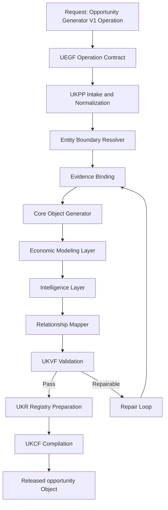
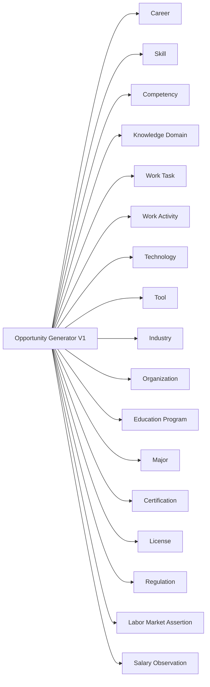
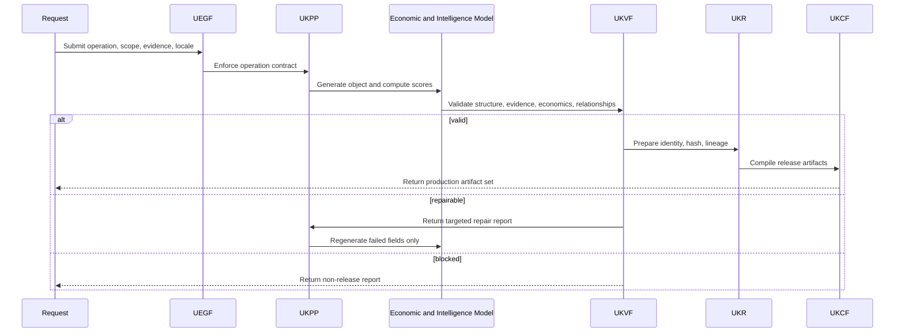
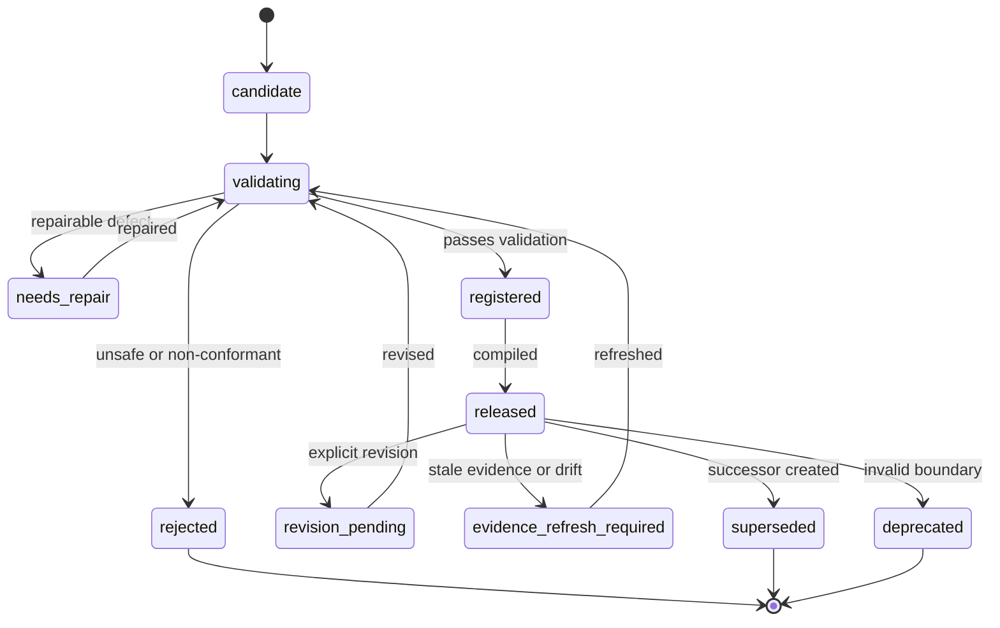
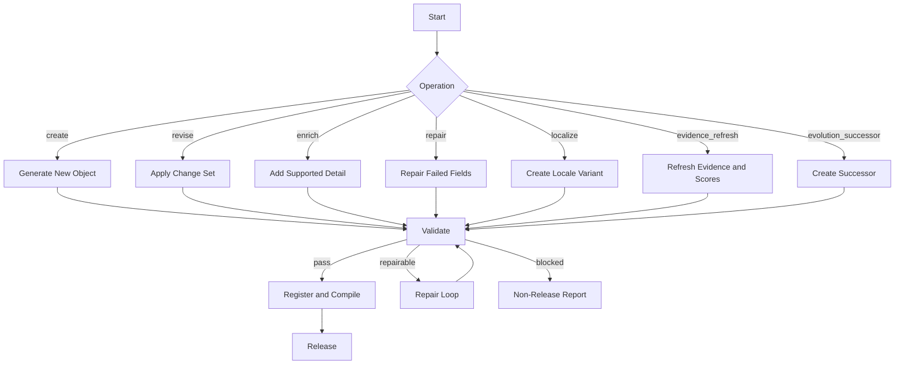

# Opportunity Generator V1

**File Path:** `assets/knowledge/generators/opportunity/Opportunity_Generator_V1.md`
**Generator ID:** `generator:opportunity:v1`
**Entity Type:** `opportunity`
**Status:** Production Ready
**Version:** 1.0.0
**Release Date:** 2026-06-28
**Owner:** KarirGPS Principal Knowledge Intelligence Architecture Team

---

## 1. Document Control

| Field | Value |
| --- | --- |
| Document name | Opportunity Generator V1 |
| Canonical file | `assets/knowledge/generators/opportunity/Opportunity_Generator_V1.md` |
| Generator class | Entity Generator |
| Target entity | `opportunity` |
| Economic intelligence role | Actionable job, freelance, gig, contract, startup, and market-opening intelligence |
| Upstream dependencies | AI Constitution, Career Knowledge Ontology, KOS, UEGF, UKPP, UKVF, UKR, UKL, UKQF, UKEF, UKCF, Generator Development Standard V1 |
| Reference generators | Career, Skill, Competency, Knowledge Domain, Work Task, Work Activity, Technology, Tool, Industry, Organization, Education Program, Major, Certification, License, Learning Resource, Regulation |
| Release state | Production-ready implementation specification |
| Compatibility level | V1 registry, V1 ontology, V1 production pipeline |
| Change policy | Revisions must preserve locked architecture inheritance and pass conformance tests |

## 2. Purpose and Scope

### 2.1 Purpose

The Opportunity Generator V1 creates, revises, enriches, repairs, localizes, refreshes evidence for, and creates evolution successors for `opportunity` objects. An opportunity is a time-bound actionable market opening for employment, freelance work, contract delivery, gig participation, startup formation, internship, apprenticeship, grant, competition, fellowship, partnership, marketplace work, or career advancement.

### 2.2 In Scope

- Opportunity taxonomy covering job, freelance, startup, gig, contract, internship, apprenticeship, grant, competition, fellowship, marketplace, platform, business, and partnership opportunities.
- Opportunity lifecycle from detected to active, ranked, matched, applied, converted, expired, withdrawn, superseded, or rejected.
- Matching engine logic, career-fit scoring, skill-gap-based detection, ranking, conversion probability, and market timing.
- Industry opportunity clustering and AI-generated opportunity prediction.
- Evidence-bound validation of source, timing, eligibility, compensation, location, and risk.
- Relationship mapping to all relevant Career Knowledge Ontology entities plus Labor Market Assertion and Salary Observation.

### 2.3 Out of Scope

- Guaranteeing selection, hiring, funding, income, or business success.
- Applying to jobs or contacting organizations as part of this generator.
- Creating organization profiles, salary benchmarks, or labor demand assertions.
- Inferring protected attributes or making discriminatory eligibility decisions.
- Presenting unsafe, fraudulent, or exploitative opportunities as valid.

## 3. Philosophy

- **Actionability first.** An opportunity needs a clear action path, timing, and outcome.
- **Fit is multidimensional.** Ranking combines career, skill, competency, credential, location, compensation, and timing.
- **Gaps can be useful.** Non-blocking gaps create learning actions rather than automatic rejection.
- **Ranking is explainable.** Scores must show drivers and penalties.
- **Market timing matters.** Freshness, deadline, demand, and competition influence priority.
- **Prediction is bounded.** AI-generated predictions require evidence, horizon, and confidence.
- **Safety blocks bad opportunities.** Fraud, exploitation, misleading claims, and unlawful criteria are blocked.

## 4. Authority, Inheritance, and Locked-Architecture Constraint

This generator is an implementation artifact only. It does not redesign, fork, supersede, duplicate, or reinterpret any KarirGPS foundation, universal framework, ontology, or engineering standard.

| Authority | Inheritance Applied |
| --- | --- |
| AI Constitution | Truthfulness, safety, fairness, privacy, transparency, non-deceptive reasoning, and human-benefit constraints are mandatory in every operation. |
| Career Knowledge Ontology | Entity class boundaries, relationship predicates, cardinality, disjointness, and graph reasoning compatibility are preserved. |
| Knowledge Object Specification (KOS) | Canonical envelope, identity, evidence, language, validation, registry, lifecycle, lineage, and compilation fields are required. |
| UEGF | Operation contract, normalized input handling, output guarantees, and repair behavior are inherited without modification. |
| UKPP | Intake, normalization, generation, validation, repair, registration, compilation, release, and monitoring are implemented as inherited stages. |
| UKVF | Structural, semantic, ontology, evidence, safety, economic, localization, registry, query, evolution, and compilation validation are enforced. |
| UKR | Identity, semantic hashing, deduplication, versioning, lineage, merge rules, and registry states are enforced. |
| UKL | Canonical language, localized variants, locale terminology, currency handling, and translation fidelity are enforced. |
| UKQF | Query facets, graph traversal, filterability, ranking compatibility, and explainable retrieval are supported. |
| UKEF | Drift detection, evidence aging, revision, deprecation, and successor creation are supported. |
| UKCF | Markdown, JSON, graph triples, embeddings, API payloads, registry manifest, and audit reports compile without semantic loss. |
| Generator Development Standard V1 | Mandatory sections, diagrams, schemas, prompts, examples, tests, certification checks, and readiness checks are included. |

### 4.1 Binding Implementation Rule

If a request conflicts with an upstream authority, the upstream authority wins. The generator must stop the non-conformant transformation, emit a structured repair report, and avoid releasing a registry-ready object until validation passes.

### 4.2 Mandatory Section Conformance Map

| Required Section | Location |
| --- | --- |
| Purpose | Section 2 |
| Scope | Section 2 |
| Philosophy | Section 3 |
| Architecture | Sections 5 and 22 |
| Lifecycle | Section 15 |
| Inputs / Outputs | Section 11 |
| Generation Pipeline | Section 12 |
| Economic Modeling Layer | Section 13 |
| Intelligence Layer | Section 14 |
| Prompt Templates | Section 24 |
| Validation Rules | Section 16 |
| Failure Modes | Section 17 |
| Retry Strategy | Section 17 |
| Registry Integration | Section 18 |
| Evolution Model | Section 19 |
| Relationship Mapping | Section 8 |
| Example Objects | Section 25 |
| Diagrams: Mermaid + Flow + Sequence + State | Section 22 |
| Schemas | Section 23 |
| Conformance Tests | Section 27 |
| Engineering Certification Checklist | Section 28 |
| Production Readiness Checklist | Section 29 |
| Release Contract | Section 30 |

## 5. Architecture

### 5.1 Architectural Role

```yaml
layer: economic_intelligence_action
entity: opportunity
upstream_inputs:
  - career objects
  - skill and competency objects
  - work task and work activity objects
  - industry and organization objects
  - technology and tool objects
  - education, major, certification, license, and regulation objects
  - labor market assertions
  - salary observations
  - opportunity source evidence
downstream_consumers:
  - opportunity search
  - career matching
  - skill gap planning
  - application planning
  - learning recommendations
  - conversion analytics
```

### 5.2 Core Responsibilities

| Responsibility | Implementation |
| --- | --- |
| Classification | Classify type, outcome, action model, and lifecycle state. |
| Validation | Verify source, timing, eligibility, compensation, location, and risk. |
| Matching | Compute career, skill, competency, credential, location, compensation, and timing fit. |
| Gap detection | Identify missing skills, competencies, credentials, licenses, and experience. |
| Ranking | Rank using fit, timing, conversion probability, evidence quality, and risk. |
| Clustering | Cluster by industry, career path, skills, technology, organization type, and outcome. |
| Prediction | Identify emerging opportunity clusters with horizon and confidence. |

## 6. Entity Definition: Opportunity

An `opportunity` is a time-bound actionable market opening connected to work, income, learning, venture creation, contract work, gig work, freelance work, or career advancement.

### 6.1 Canonical Definition

```yaml
object_type: opportunity
canonical_definition: >
  A time-bound, actionable, evidence-bound market opening that a person, team, or organization can pursue for employment, freelance work, contract work, gig work, startup creation, learning advancement, credential access, funding, competition, partnership, or career progression.
boundary_rule: >
  An opportunity must represent an actionable opening with lifecycle, eligibility, timing, source, and outcome context, not a general labor trend, salary benchmark, career definition, organization profile, or skill object.
```

### 6.2 Boundary Tests

| Test | Required Answer |
| --- | --- |
| Actionability | What action can be taken? |
| Type | Job, freelance, startup, gig, contract, internship, grant, competition, or other taxonomy? |
| Source | Where does opportunity evidence come from? |
| Timing | What active window or deadline applies? |
| Eligibility | What skills, credentials, experience, location, or legal conditions apply? |
| Outcome | What can be gained? |
| Fit | Which graph entities determine match quality? |
| Risk | Are there scam, legal, safety, or exploitative red flags? |

### 6.3 Non-Examples

| Invalid Candidate | Reason | Correct Entity |
| --- | --- | --- |
| Data Analyst career | Career path. | Career |
| High demand for cloud engineers | Market assertion. | Labor Market Assertion |
| Median salary for UX Designer | Compensation benchmark. | Salary Observation |
| Google | Organization. | Organization |
| AWS certification | Credential object. | Certification |
| Python | Skill or technology. | Skill or Technology |

## 7. Entity Taxonomy

### 7.1 Opportunity Type Taxonomy

| Taxonomy Path | Definition | Required Fields |
| --- | --- | --- |
| `opportunity.job.full_time` | Full-time employment. | employer/source, role, location, requirements |
| `opportunity.job.part_time` | Part-time employment. | schedule, role, compensation basis |
| `opportunity.contract.fixed_term` | Fixed-term work contract. | term, deliverables, renewal context |
| `opportunity.freelance.project` | Independent project work. | client, scope, deliverable, fee basis |
| `opportunity.gig.platform` | Platform-mediated short work. | platform, task type, payout model |
| `opportunity.startup.founder` | Venture creation path. | problem, market, team, funding context |
| `opportunity.startup.joiner` | Early-stage company role. | stage, equity, runway caveat |
| `opportunity.internship` | Temporary learning-work placement. | duration, mentor, eligibility |
| `opportunity.apprenticeship` | Structured work-based training. | competency progression |
| `opportunity.grant` | Funding opportunity. | sponsor, eligibility, deadline |
| `opportunity.competition` | Contest or award path. | rules, prize, deadline |
| `opportunity.fellowship` | Selective development path. | cohort, duration, support |
| `opportunity.marketplace` | Marketplace demand opening. | platform, category, competition |
| `opportunity.partnership` | Collaboration opening. | partner type, value exchange |

### 7.2 Lifecycle Taxonomy

| State | Meaning |
| --- | --- |
| `detected` | Potential signal found. |
| `validated` | Source, timing, eligibility, and safety pass. |
| `active` | Can currently be pursued. |
| `ranked` | Fit and timing scores computed. |
| `matched` | Matched to career graph or fit context. |
| `applied` | External workflow records pursuit. |
| `converted` | Desired outcome recorded. |
| `expiring` | Deadline near. |
| `expired` | Cannot be pursued. |
| `withdrawn` | Source removed opportunity. |
| `superseded` | Replaced by successor. |
| `rejected` | Failed safety or validity checks. |

### 7.3 Outcome Taxonomy

| Outcome | Description |
| --- | --- |
| `employment` | Job, internship, apprenticeship, or contract employment. |
| `income` | Freelance, gig, project, commission, or contract revenue. |
| `learning` | Skill, credential, mentoring, or work-based learning. |
| `funding` | Grant, prize, investment, sponsorship, or stipend. |
| `venture_creation` | Startup, product, business, or partnership formation. |
| `network_access` | Community, fellowship, partnership, or professional access. |
| `portfolio_signal` | Project, competition, publication, or proof of work. |

## 8. Ontology Alignment and Relationship Mapping

### 8.1 Ontology Binding

```yaml
primary_class: career_ontology.Opportunity
parent_classes:
  - career_ontology.EconomicIntelligenceObject
  - career_ontology.ActionableObject
  - career_ontology.TimeScopedObject
disjoint_with:
  - career_ontology.LaborMarketAssertion
  - career_ontology.SalaryObservation
  - career_ontology.Career
  - career_ontology.Organization
  - career_ontology.Skill
```

### 8.2 Relationship Predicates

| Predicate | Source | Target | Cardinality | Description |
| --- | --- | --- | --- | --- |
| `targetsCareer` | Opportunity | Career | 0..n | Career alignment. |
| `requiresSkill` | Opportunity | Skill | 0..n | Required skill. |
| `requiresCompetency` | Opportunity | Competency | 0..n | Required competency. |
| `usesKnowledgeDomain` | Opportunity | Knowledge Domain | 0..n | Domain context. |
| `requiresWorkTask` | Opportunity | Work Task | 0..n | Expected task. |
| `requiresWorkActivity` | Opportunity | Work Activity | 0..n | Expected activity. |
| `belongsToIndustry` | Opportunity | Industry | 0..n | Industry cluster. |
| `offeredByOrganization` | Opportunity | Organization | 0..1 | Offering organization. |
| `usesTechnology` | Opportunity | Technology | 0..n | Technology stack. |
| `usesTool` | Opportunity | Tool | 0..n | Tool requirement. |
| `requiresCertification` | Opportunity | Certification | 0..n | Credential requirement. |
| `requiresLicense` | Opportunity | License | 0..n | License requirement. |
| `governedByRegulation` | Opportunity | Regulation | 0..n | Regulatory constraint. |
| `supportedByLaborMarketAssertion` | Opportunity | Labor Market Assertion | 0..n | Market timing. |
| `comparedWithSalaryObservation` | Opportunity | Salary Observation | 0..n | Pay benchmark. |

### 8.3 Relationship Integrity Rules

- Opportunity must have at least one outcome and one action path.
- Job opportunity requires organization or source context, even when employer is anonymized.
- Skill-gap opportunity requires required skills or competencies.
- Salary comparison requires comparable Salary Observation object.
- Market timing requires deadline, source freshness, or Labor Market Assertion evidence.
- Eligibility criteria must not include discriminatory or unlawful requirements.

## 9. Canonical Object Model

```yaml
opportunity_object:
  kos:
    object_type: opportunity
    schema_version: 1.0.0
    id: opportunity:{scope_hash}:v1
    canonical_label: string
    lifecycle_state: detected | validated | active | ranked | matched | applied | converted | expiring | expired | withdrawn | superseded | rejected
  opportunity:
    opportunity_type: string
    outcome_types: [employment | income | learning | funding | venture_creation | network_access | portfolio_signal]
    action_path: {action_label: string, action_reference: string, deadline: datetime, start_date: date, end_date: date}
    source: {source_id: string, source_type: string, source_name: string, source_date: date, retrieved_at: datetime, source_reliability: string}
    location: {country: string, subregion: string, locality: string, remote_scope: string}
    eligibility:
      experience_level: entry | junior | mid | senior | lead | manager | executive | founder | open
      required_skills: [id]
      preferred_skills: [id]
      required_competencies: [id]
      required_credentials: [id]
      required_licenses: [id]
      education_requirements: [id]
      legal_or_regulatory_conditions: [id]
    compensation:
      compensation_disclosed: boolean
      compensation_model: string
      currency: string
      min_amount: number
      expected_amount: number
      max_amount: number
      salary_observation_refs: [id]
    fit_model:
      career_fit_score: number
      skill_fit_score: number
      competency_fit_score: number
      credential_fit_score: number
      location_fit_score: number
      compensation_fit_score: number
      market_timing_score: number
      conversion_probability: number
      opportunity_rank_score: number
      gap_summary: string
    intelligence:
      market_timing_signals: [string]
      industry_cluster_refs: [id]
      labor_market_assertion_refs: [id]
      ai_generated_prediction: {predicted_growth: string, horizon_months: integer, confidence_band: string, explanation: string}
    risk:
      scam_risk: low | medium | high | blocked
      exploitation_risk: low | medium | high | blocked
      safety_notes: [string]
  evidence:
    evidence_records:
      - {source_id: string, source_type: string, source_title: string, source_date: date, retrieved_at: datetime, claim_supported: string, reliability: string, time_fit: string}
  relationships:
    careers: [id]
    skills: [id]
    competencies: [id]
    industries: [id]
    organizations: [id]
    technologies: [id]
    salary_observations: [id]
    labor_market_assertions: [id]
  validation: {status: string, checks: object}
  registry: {registry_state: string, semantic_hash: string, lineage: object}
```

## 10. Operation Support

| Operation | Purpose | Mandatory Behavior | Release State |
| --- | --- | --- | --- |
| `create` | Create a new object. | Resolve entity boundary, generate KOS envelope, bind evidence, compute supported scores, validate, prepare registry identity. | `candidate_validated` or `needs_repair` |
| `revise` | Modify an existing object. | Preserve identity lineage, apply explicit change set, update evidence and validation status. | `revision_validated` |
| `enrich` | Add supported detail. | Add relationships, evidence, model explanation, query facets, or localization without changing identity boundary. | `enriched_validated` |
| `repair` | Fix validation defects. | Use UKVF failure report, repair targeted fields only, remove unsupported claims, rerun validation. | `repaired_validated` or `repair_blocked` |
| `localize` | Create locale-aware variant. | Preserve canonical meaning while adapting language, region, currency, institutions, and examples. | `localized_validated` |
| `evidence_refresh` | Refresh factual and economic evidence. | Rebind claims, update freshness, recompute scores, mark drift or successor need. | `evidence_refreshed` |
| `evolution_successor` | Create successor after material change. | Preserve predecessor lineage, explain difference, revalidate relationships, update lifecycle. | `successor_validated` |

### 10.1 Operation Preconditions

| Operation | Preconditions |
| --- | --- |
| `create` | Entity type is correct, minimum evidence exists, scope is explicit, and duplicate object is not active. |
| `revise` | Existing registry identity and revision intent are supplied. |
| `enrich` | Object identity is stable and enrichment does not alter boundary. |
| `repair` | UKVF failure report identifies actionable defects. |
| `localize` | Target locale is valid and localization scope is declared. |
| `evidence_refresh` | Evidence records include source date, retrieval date, and claim mapping. |
| `evolution_successor` | Material change exceeds successor threshold or predecessor is deprecated. |

### 10.2 Operation Examples

| Scenario | Operation | Expected Result |
| --- | --- | --- |
| New remote data analyst contract | `create` | Active opportunity with source, requirements, fit, validation. |
| Deadline changed | `revise` | Action window and rank recalculated. |
| Add salary comparison | `enrich` | Salary Observation linked and compensation-fit computed. |
| Scam signal detected | `repair` | Risk flags updated or active release blocked. |
| Source withdrawn | `evidence_refresh` | Lifecycle changes to withdrawn. |
| Updated startup role replaces old one | `evolution_successor` | Successor preserves lineage. |

## 11. Inputs / Outputs

### 11.1 Inputs

| Input | Required | Description |
| --- | --- | --- |
| `operation` | Yes | Supported UEGF operation. |
| `canonical_label` | Yes | Opportunity label. |
| `opportunity_type` | Yes | Taxonomy path. |
| `outcome_types` | Yes | Employment, income, learning, funding, venture, network, portfolio. |
| `source` | Yes | Source metadata. |
| `action_path` | Yes | How to pursue. |
| `location` | Yes | Region and remote scope. |
| `eligibility` | Yes | Skills, credentials, experience, education, license, legal conditions. |
| `evidence_records` | Yes | Source and claim evidence. |
| `fit_context` | No | Career or user-independent fit profile. |
| `market_context` | No | Labor and salary references. |
| `locale` | No | Localization target. |

### 11.2 Outputs

| Output | Description |
| --- | --- |
| KOS opportunity | Canonical opportunity object. |
| Fit scores | Career, skill, competency, credential, location, compensation, timing, conversion, rank. |
| Skill gap report | Blocking and non-blocking gaps. |
| Market timing report | Demand, deadline, source freshness, industry timing. |
| Risk report | Scam, exploitation, safety flags. |
| Relationship map | Valid ontology references. |
| Validation report | UKVF status. |
| Compiled artifacts | Markdown, JSON, triples, embeddings, API payload, manifest, audit report. |

## 12. Generation Pipeline

| Stage | Name | Implementation Requirement | Exit Gate |
| --- | --- | --- | --- |
| 1 | Intake | Receive operation, label, scope, locale, region, time window, evidence, registry context, and relationship candidates. | Request is parseable and operation is supported. |
| 2 | Normalize | Normalize labels, aliases, taxonomy path, region, currency, time, evidence metadata, and ontology references. | Normalized input contract is complete. |
| 3 | Boundary Resolve | Confirm the candidate belongs to this entity type and not another generator. | Entity boundary passes. |
| 4 | Evidence Bind | Bind every factual, economic, and predictive claim to evidence records and source metadata. | Unsupported claims are removed or downgraded. |
| 5 | Core Generate | Build KOS envelope, definition, taxonomy, lifecycle state, relationships, and required fields. | Canonical object is structurally complete. |
| 6 | Economic Model | Compute bounded indices, scores, ranges, predictions, or benchmarks with feature metadata. | Numeric outputs are reproducible and bounded. |
| 7 | Intelligence Model | Produce explanation, trend, fit, timing, risk, AI-impact, clustering, or reasoning outputs. | Reasoning artifacts are auditable. |
| 8 | Relationship Map | Link to canonical Career Knowledge Ontology objects and unresolved candidates. | Relationship edges are valid. |
| 9 | Validate | Run UKVF plus entity-specific economic checks. | Release threshold is met. |
| 10 | Repair Loop | Repair actionable defects and rerun validation. | Repair passes or release is blocked. |
| 11 | Registry Prepare | Assign semantic hash, dedup keys, version, lifecycle, and lineage metadata. | UKR accepts draft. |
| 12 | Compile | Compile to Markdown, JSON, graph triples, embeddings, API payload, manifest, and audit report. | UKCF equivalence passes. |

### 12.1 Entity-Specific Pipeline Extensions

- Classify opportunity taxonomy and outcome type.
- Validate source, active window, deadline, eligibility, location, compensation disclosure, and risk.
- Map stated requirements to Career, Skill, Competency, Work Task, Work Activity, Technology, Tool, Certification, License, Education Program, Major, and Regulation objects.
- Attach Labor Market Assertion objects for market timing and Salary Observation objects for compensation comparability.
- Compute career-fit, skill-fit, competency-fit, credential-fit, location-fit, compensation-fit, market-timing, conversion probability, and rank score.
- Detect skill gaps and map them to learning, credential, or practice pathways when referenced objects exist.
- Cluster opportunities by industry, career path, skills, technology, organization type, outcome, and timing.

### 12.2 Pipeline Invariants

- No economic claim may bypass evidence binding.
- No score may be emitted without scale, direction, feature set, confidence, and model metadata.
- No prediction may be stated as certainty.
- No relationship edge may be created unless valid or marked as unresolved candidate.
- No localized object may change canonical meaning.

## 13. Economic Modeling Layer

### 13.1 Matching Engine

```yaml
matching_engine:
  outputs:
    - career_fit_score
    - skill_fit_score
    - competency_fit_score
    - credential_fit_score
    - location_fit_score
    - compensation_fit_score
    - market_timing_score
    - conversion_probability
    - opportunity_rank_score
  features:
    career_fit: [target_career_match, role_level_match, task_similarity, industry_alignment]
    skill_fit: [required_skill_coverage, preferred_skill_coverage, skill_importance_weight]
    competency_fit: [required_competency_coverage, proficiency_level_match]
    credential_fit: [certification_match, license_match, education_requirement_match]
    market_timing: [deadline_distance, demand_signal_strength, opportunity_freshness, competition_proxy]
```

### 13.2 Skill Gap Classification

| Gap Type | Meaning | Handling |
| --- | --- | --- |
| `blocking_gap` | Mandatory skill, license, or credential missing. | Lower fit or block. |
| `near_gap` | Learnable within short horizon. | Keep with learning action. |
| `differentiator_gap` | Preferred capability missing. | Penalize lightly. |
| `experience_gap` | Seniority or portfolio missing. | Lower conversion probability. |
| `regulatory_gap` | License or legal requirement missing. | Block when mandatory. |

### 13.3 Ranking Model

```yaml
opportunity_ranking:
  scale: 0_to_100
  weights:
    career_fit_score: 0.20
    skill_fit_score: 0.20
    competency_fit_score: 0.15
    credential_fit_score: 0.10
    market_timing_score: 0.15
    compensation_fit_score: 0.10
    conversion_probability_scaled: 0.10
  penalties:
    stale_source: up_to_30
    unresolved_required_license: up_to_100
    high_scam_risk: up_to_100
    severe_skill_gap: up_to_40
```

### 13.4 Conversion Probability

```yaml
conversion_probability_model:
  scale: 0_to_1
  features:
    - skill_fit_score
    - competency_fit_score
    - credential_fit_score
    - experience_level_match
    - market_timing_score
    - source_reliability
    - competition_proxy
    - deadline_distance
  constraints:
    - not_a_guarantee
    - no_protected_attributes
    - confidence_required
```

## 14. Intelligence Layer

### 14.1 AI-Generated Opportunity Prediction

```yaml
ai_generated_opportunity_prediction:
  prediction_type: emerging_opportunity_cluster | role_growth | gig_growth | startup_space | contract_demand | learning_pathway
  evidence_inputs:
    - labor_market_assertion_refs
    - industry_refs
    - technology_refs
    - salary_observation_refs
  horizon_months: integer
  confidence_band: high | medium | low | blocked
  explanation: string
  limitations: string
```

### 14.2 Opportunity Intelligence Patterns

| Pattern | Detection | Use |
| --- | --- | --- |
| Skill adjacency | Existing skill cluster close to required cluster. | Near-fit recommendation. |
| Emerging technology | Technology demand grows before mature roles. | Predict opportunity cluster. |
| Regulation-created | Compliance creates work. | Rank credential paths. |
| Salary-arbitrage | Pay benchmark exceeds local baseline. | Identify high-value opportunities. |
| Portfolio-building | Lower pay but strong proof-of-work value. | Entry or transition path. |
| Startup timing | Market pain and technology shift align. | Venture opportunity. |

### 14.3 Downstream Use

Opportunity objects support career recommendation, skill-gap planning, learning recommendations, salary comparison, labor-market dashboards, and external application workflows.

## 15. Lifecycle

### 15.1 Lifecycle States

| State | Meaning | Refresh |
| --- | --- | --- |
| `detected` | Potential signal found. | 1-14 days |
| `validated` | Source and safety checks passed. | 1-14 days |
| `active` | Currently pursuable. | 1-7 days |
| `ranked` | Fit and timing computed. | 1-7 days |
| `matched` | Matched to career graph or fit context. | 1-7 days |
| `applied` | External workflow recorded pursuit. | event-driven |
| `converted` | Desired outcome recorded. | audit |
| `expiring` | Deadline near. | daily |
| `expired` | Deadline passed. | audit |
| `withdrawn` | Source removed. | audit |
| `superseded` | Successor exists. | audit |
| `rejected` | Safety or validity failure. | audit |

### 15.2 Lifecycle Transition Rules

`detected` becomes `validated` when source, timing, eligibility, and safety pass. `validated` becomes `active` when currently pursuable. `active` becomes `ranked` after scoring. Deadline passing moves active objects to `expired`. Source removal moves active objects to `withdrawn`. Material updated listings create successors.

## 16. Validation Rules

Validation is inherited from UKVF and extended with entity-specific economic checks.

| Validation Class | Required Checks | Release Threshold |
| --- | --- | --- |
| Structural | Required fields, schema version, enumerations, data types, KOS envelope, operation metadata. | 100% pass. |
| Semantic | Entity boundary, statement coherence, scope clarity, no category drift. | Critical fields pass. |
| Ontological | Valid class binding, relationship predicates, cardinality, disjoint class checks, inverse edges. | 100% pass for release. |
| Evidence | Claim-source mapping, source reliability, source date, retrieval date, region fit, time fit, conflict handling. | All high-impact claims supported. |
| Economic | Score ranges, feature set, calibration metadata, uncertainty, no false precision. | All numeric outputs pass. |
| Intelligence | Explainability, forecast caveats, risk flags, AI-impact logic, downstream compatibility. | Pass or confidence downgrade. |
| Safety | No discriminatory inference, unlawful guidance, deceptive work claims, or private personal inference. | 100% pass. |
| Localization | Locale, currency, region, terminology, and translation fidelity. | 100% pass for localized release. |
| Registry | Identity, deduplication, semantic hash, version lineage, lifecycle state. | 100% pass. |
| Query | Required facets exposed for retrieval, filtering, graph traversal, and ranking. | 100% pass. |
| Evolution | Evidence aging, drift status, successor threshold, backward compatibility. | Pass or refresh required. |
| Compilation | Markdown, JSON, triples, embeddings, and API payload preserve semantic equivalence. | 100% pass. |

### 16.1 Entity-Specific Validation Rules

- `opportunity_type`, `outcome_types`, `source`, `action_path`, `location`, and `eligibility` are mandatory.
- Active opportunities require current source evidence and timing validity.
- `conversion_probability` must be between 0 and 1.
- Fit and rank scores must be between 0 and 100.
- Compensation comparison requires comparable Salary Observation object.
- Market timing requires deadline, source freshness, or Labor Market Assertion evidence.
- Mandatory license or legal requirements cannot be ignored.
- Blocked scam or exploitation risk prevents active release.
- Eligibility criteria must not include discriminatory or unlawful filters.

### 16.2 Confidence Band Policy

| Band | Meaning | Use |
| --- | --- | --- |
| `high` | Multiple reliable, recent, scope-matched sources with stable signals. | Can support ranking and graph reasoning. |
| `medium` | Adequate evidence with moderate granularity limits or aging. | Can support reasoning with caveats. |
| `low` | Sparse, indirect, or conflicting evidence. | Must not drive high-stakes recommendation alone. |
| `blocked` | Unsupported, unsafe, contradictory, or outside boundary. | Must not be released. |

## 17. Failure Modes and Retry Strategy

### 17.1 Failure Modes

| Failure Mode | Detection Signal | Handling |
| --- | --- | --- |
| Expired opportunity | Deadline passed or source closed. | Change lifecycle to expired. |
| Scam-like source | Unverifiable source, suspicious fees, or misleading compensation. | Mark high risk or block active release. |
| Missing action path | No way to pursue. | Block active lifecycle. |
| Required license unresolved | Legal license required but absent. | Mark regulatory gap and block if mandatory. |
| Ranking without fit context | Rank requested but inputs absent. | Generate unranked object or graph-only fit. |
| Entity boundary error | Candidate belongs to another ontology class. | Route to the correct generator and block this release. |
| Unsupported economic claim | Claim lacks evidence binding. | Remove, downgrade confidence, or request evidence. |
| Region or time mismatch | Evidence does not match declared scope. | Split object, normalize scope, or mark refresh required. |
| Unsafe inference | Output enables discrimination, deception, or unlawful treatment. | Block field and emit safety report. |
| Duplicate object | UKR detects same semantic identity and scope. | Merge or revise existing object. |
| Compilation drift | Output artifacts differ semantically. | Recompile from canonical JSON and block release until equivalent. |

### 17.2 Retry Strategy

| Retry | Trigger | Action | Limit |
| --- | --- | --- | --- |
| Normalize retry | Missing or ambiguous normalized input. | Normalize label, scope, region, time, currency, and operation metadata. | 2 |
| Evidence retry | Missing, stale, weak, or conflicting evidence. | Rebind to stronger evidence, downgrade, or remove claim. | 2 |
| Boundary retry | Entity class ambiguous. | Run boundary tests and route if needed. | 1 |
| Economic retry | Score out of bounds or feature metadata missing. | Recompute with validated features and uncertainty. | 2 |
| Relationship retry | Invalid or unresolved edge. | Resolve object, mark unresolved candidate, or remove edge. | 2 |
| Localization retry | Locale or currency mismatch. | Apply UKL rules and rerun validation. | 2 |
| Compilation retry | Artifact equivalence failure. | Recompile from canonical object. | 2 |

### 17.3 Non-Retriable Conditions

- Request modifies the locked architecture or introduces a new universal framework.
- Object requires discriminatory, deceptive, or unlawful employment logic.
- Required evidence is unavailable and the claim cannot be safely downgraded.
- The object is designed to mislead about work, compensation, labor demand, or opportunity.

## 18. Registry Integration

Registry integration follows UKR.

### 18.1 Identity Pattern

```yaml
identity:
  object_type: opportunity
  id_pattern: "opportunity:{normalized_scope_hash}:v{major}"
  canonical_slug: "{entity_slug}--{scope_slug}--{region_slug}--{time_window_slug}"
  semantic_hash_inputs:
    - object_type
    - canonical_label
    - taxonomy_path
    - region
    - time_window
    - evidence_claim_hash
    - relationship_scope_hash
```

### 18.2 Registry States

| State | Meaning | Allowed Transition |
| --- | --- | --- |
| `candidate` | Generated but not fully validated. | validated, needs_repair, rejected |
| `validated` | Passed validation gates. | registered, needs_repair |
| `registered` | Accepted by registry. | released, superseded, deprecated |
| `released` | Available to graph and query systems. | revision_pending, evidence_refresh_required, superseded |
| `revision_pending` | Explicit revision exists. | validated, needs_repair |
| `evidence_refresh_required` | Evidence age or drift requires refresh. | validated, superseded, deprecated |
| `superseded` | Successor exists. | audit only |
| `deprecated` | Object no longer valid. | audit only |

### 18.3 Deduplication Keys

- `object_type + opportunity_type + source_id + action_path + deadline + location + canonical_label`
- `organization_ref + role_label + location + employment_type + source_date` for job opportunities
- `platform + project_scope + compensation_model + deadline` for freelance and gig opportunities
- `funding_body + program_name + cycle + deadline` for grants and fellowships
- `industry_cluster + technology_refs + prediction_horizon` for predicted clusters

### 18.4 Merge Policy

- Merge only when identity, taxonomy, scope, region, time window, and evidence claim hash are semantically equivalent.
- Do not merge objects that differ by market segment, compensation basis, opportunity type, region, or forecast horizon.
- Preserve conflicting evidence as explicit evidence conflicts.
- Revalidate downstream relationship edges after every merge.

## 19. Evolution Model

Evolution follows UKEF.

| Trigger | Handling |
| --- | --- |
| Material market change | Create `evolution_successor`, preserve lineage, and mark predecessor superseded when appropriate. |
| Evidence source reversal | Refresh evidence, revise if conclusion remains stable, otherwise create successor. |
| Regional scope change | Create separate regional object or successor. |
| Upstream taxonomy change | Revalidate relationship edges and update taxonomy path. |
| AI transformation shift | Re-score economic and intelligence fields. |
| Regulation, license, or policy change | Link relevant Regulation or License object and refresh validity. |
| Model recalibration | Revise scoring metadata while preserving object meaning. |

### 19.1 Successor Rules

- Successor must explain material difference from predecessor.
- Historical observations and assertions remain auditable.
- Successor must rebind evidence and rerun validation.
- Downstream query facets and graph triples must be regenerated.

## 20. Language, Localization, and Query Support

### 20.1 Localization Rules

- Localization must preserve canonical meaning.
- Regional, currency, education, regulatory, and employment terminology must be locale-appropriate.
- Localized economic claims require locale-fit evidence.
- Currency conversion must preserve original values and conversion metadata.

### 20.2 Query Facets

| Facet | Purpose |
| --- | --- |
| `object_type` | Filter entity type. |
| `canonical_label` | Retrieve by label and aliases. |
| `taxonomy_path` | Retrieve by taxonomy. |
| `region` | Retrieve regional objects. |
| `time_window` | Retrieve historical, current, or forecast objects. |
| `career_refs` | Retrieve by career. |
| `skill_refs` | Retrieve by skill. |
| `competency_refs` | Retrieve by competency. |
| `industry_refs` | Retrieve by industry. |
| `organization_refs` | Retrieve by organization where applicable. |
| `technology_refs` | Retrieve by technology or AI transformation relationship. |
| `confidence_band` | Filter by evidence strength. |
| `lifecycle_state` | Filter current, stale, superseded, deprecated, or rejected states. |
| `evidence_age` | Find refresh candidates. |

## 21. Compilation Outputs

| Output | Requirement |
| --- | --- |
| Markdown | Human-readable object, evidence summary, scores, relationships, validation result. |
| JSON | Canonical machine-readable KOS object. |
| Graph triples | Ontology edges for reasoning. |
| Embedding document | Search-optimized document preserving economic context. |
| API payload | Versioned production response. |
| Registry manifest | Identity, version, hash, lifecycle, and evidence metadata. |
| Audit report | Validation, model features, confidence, lineage, and repair history. |

### 21.1 Equivalence Rule

Markdown, JSON, graph triples, embeddings, API payload, registry manifest, and audit report must preserve the same meaning. No compiled artifact may introduce claims or relationships absent from the canonical object.

## 22. Architecture and Diagrams

### 22.1 Architecture Overview



### 22.2 Relationship Diagram



### 22.3 Sequence Diagram



### 22.4 State Diagram



### 22.5 Flowchart



### 22.6 Economic Intelligence Data Path


## 23. Schemas

### 23.1 YAML Schema

```yaml
required_fields:
  - kos.object_type
  - kos.id
  - kos.canonical_label
  - opportunity.opportunity_type
  - opportunity.outcome_types
  - opportunity.action_path
  - opportunity.source
  - opportunity.location
  - opportunity.eligibility
  - opportunity.fit_model
  - opportunity.risk
  - evidence.evidence_records
  - validation.status
  - registry.registry_state
constraints:
  kos.object_type: opportunity
  fit_scores: [0, 100]
  conversion_probability: [0, 1]
  active_requires_current_source: true
  blocked_risk_prevents_active_release: true
  required_license_gap_blocks_when_mandatory: true
```

### 23.2 JSON Schema

```json
{
  "$schema": "https://json-schema.org/draft/2020-12/schema",
  "title": "OpportunityV1",
  "type": "object",
  "required": [
    "kos",
    "opportunity",
    "evidence",
    "relationships",
    "validation",
    "registry"
  ],
  "properties": {
    "kos": {
      "type": "object",
      "properties": {
        "object_type": {
          "const": "opportunity"
        },
        "schema_version": {
          "const": "1.0.0"
        },
        "lifecycle_state": {
          "enum": [
            "detected",
            "validated",
            "active",
            "ranked",
            "matched",
            "applied",
            "converted",
            "expiring",
            "expired",
            "withdrawn",
            "superseded",
            "rejected"
          ]
        }
      }
    },
    "opportunity": {
      "type": "object",
      "required": [
        "opportunity_type",
        "outcome_types",
        "action_path",
        "source",
        "location",
        "eligibility",
        "fit_model",
        "risk"
      ],
      "properties": {
        "fit_model": {
          "type": "object",
          "properties": {
            "career_fit_score": {
              "type": "number",
              "minimum": 0,
              "maximum": 100
            },
            "skill_fit_score": {
              "type": "number",
              "minimum": 0,
              "maximum": 100
            },
            "conversion_probability": {
              "type": "number",
              "minimum": 0,
              "maximum": 1
            },
            "opportunity_rank_score": {
              "type": "number",
              "minimum": 0,
              "maximum": 100
            }
          }
        },
        "risk": {
          "type": "object",
          "properties": {
            "scam_risk": {
              "enum": [
                "low",
                "medium",
                "high",
                "blocked"
              ]
            },
            "exploitation_risk": {
              "enum": [
                "low",
                "medium",
                "high",
                "blocked"
              ]
            }
          }
        }
      }
    }
  }
}
```

## 24. Prompt Templates

### 24.1 Create Template

```text
SYSTEM: You are Opportunity Generator V1 inside KarirGPS. The architecture is locked. Follow AI Constitution, Career Knowledge Ontology, KOS, UEGF, UKPP, UKVF, UKR, UKL, UKQF, UKEF, UKCF, and Generator Development Standard V1.

OPERATION: create
INPUTS:
- canonical_label: {canonical_label}
- aliases: {aliases}
- taxonomy_path: {taxonomy_path}
- scope: {scope}
- region: {region}
- time_window: {time_window}
- locale: {locale}
- evidence_records: {evidence_records}
- relationship_candidates: {relationship_candidates}
- opportunity_type: {{opportunity_type}}
- outcome_types: {{outcome_types}}
- source: {{source}}
- action_path: {{action_path}}
- fit_context: {{fit_context}}
- market_context: {{market_context}}

OUTPUT:
- KOS envelope
- taxonomy and lifecycle state
- economic modeling block
- intelligence block
- relationship map
- evidence map
- validation block
- registry preparation block
- compilation readiness block

CONSTRAINTS:
- Do not redesign architecture.
- Do not invent evidence.
- Do not produce unsupported economic claims.
- Do not state predictions as certainty.
- Do not create invalid ontology relationships.
```

### 24.2 Revise Template

```text
OPERATION: revise
OBJECT: {existing_object}
REVISION_INTENT: {revision_intent}
CHANGE_SET: {change_set}
EVIDENCE_DELTA: {evidence_delta}
REQUIRED BEHAVIOR: Preserve identity lineage, apply only the intended changes, update evidence, validation, registry metadata, and revision summary.
```

### 24.3 Enrich Template

```text
OPERATION: enrich
OBJECT: {existing_object}
ENRICHMENT_TARGETS: {relationships | evidence | model_explanation | query_facets | localization}
REQUIRED BEHAVIOR: Add only supported information and preserve canonical identity.
```

### 24.4 Repair Template

```text
OPERATION: repair
OBJECT: {invalid_object}
VALIDATION_FAILURES: {ukvf_failure_report}
REQUIRED BEHAVIOR: Repair failed fields only, remove unsupported claims, rerun validation, and preserve repair lineage.
```

### 24.5 Localize Template

```text
OPERATION: localize
OBJECT: {canonical_object}
TARGET_LOCALE: {target_locale}
LOCALIZATION_SCOPE: {language | region | currency | labor_market_terms | education_terms | regulation_terms}
REQUIRED BEHAVIOR: Preserve canonical meaning and attach locale-fit evidence when localized claims are added.
```

### 24.6 Evidence Refresh Template

```text
OPERATION: evidence_refresh
OBJECT: {existing_object}
REFRESH_REASON: {scheduled_refresh | drift_signal | source_expired | upstream_change | user_request}
NEW_EVIDENCE: {new_evidence_records}
REQUIRED BEHAVIOR: Rebind claims, recompute affected scores, update confidence, and determine whether successor is required.
```

### 24.7 Evolution Successor Template

```text
OPERATION: evolution_successor
PREDECESSOR_OBJECT: {existing_object}
MATERIAL_CHANGE: {change_description}
NEW_SCOPE_OR_STATE: {new_scope_or_state}
REQUIRED BEHAVIOR: Create successor with lineage, explain divergence, revalidate relationships, and update predecessor lifecycle when appropriate.
```

## 25. Example Objects

### 25.1 Valid Example

```yaml
kos:
  object_type: opportunity
  schema_version: 1.0.0
  id: opportunity:remote_data_analyst_contract_2026_06:v1
  canonical_label: Remote Data Analyst Contract Opportunity June 2026
  lifecycle_state: ranked
opportunity:
  opportunity_type: opportunity.contract.fixed_term
  outcome_types: [employment, income]
  action_path: {action_label: submit_application, action_reference: source:verified_contract_board:remote_data_analyst_2026_06, deadline: 2026-07-15T23:59:00+07:00, start_date: 2026-08-01, end_date: 2027-01-31}
  source: {source_id: source:verified_contract_board:remote_data_analyst_2026_06, source_type: platform, source_name: Verified Contract Board, source_date: 2026-06-20, retrieved_at: 2026-06-28T00:00:00+07:00, source_reliability: medium}
  location: {country: Indonesia, subregion: national, locality: remote, remote_scope: remote_national}
  eligibility:
    experience_level: mid
    required_skills: [skill:sql:v1, skill:data_visualization:v1]
    preferred_skills: [skill:python:v1]
    required_competencies: [competency:data_driven_decision_support:v1]
    required_credentials: []
    required_licenses: []
  compensation:
    compensation_disclosed: true
    compensation_model: contract
    currency: IDR
    min_amount: 12000000
    expected_amount: 15000000
    max_amount: 18000000
    salary_observation_refs: [salary_observation:data_analyst_jakarta_monthly_2026:v1]
  fit_model:
    career_fit_score: 84
    skill_fit_score: 78
    competency_fit_score: 80
    credential_fit_score: 100
    location_fit_score: 95
    compensation_fit_score: 76
    market_timing_score: 72
    conversion_probability: 0.38
    opportunity_rank_score: 81
    gap_summary: Python is preferred but not required.
  risk: {scam_risk: low, exploitation_risk: low, safety_notes: []}
evidence:
  evidence_records:
    - {source_id: source:verified_contract_board:remote_data_analyst_2026_06, source_type: platform, source_title: Remote data analyst contract listing, source_date: 2026-06-20, retrieved_at: 2026-06-28T00:00:00+07:00, claim_supported: status, requirements, deadline, compensation, location, reliability: medium, time_fit: current}
relationships:
  careers: [career:data_analyst:v1]
  skills: [skill:sql:v1, skill:data_visualization:v1, skill:python:v1]
  labor_market_assertions: [labor_market_assertion:data_analyst_indonesia_2026:v1]
  salary_observations: [salary_observation:data_analyst_jakarta_monthly_2026:v1]
validation: {status: validated}
registry: {registry_state: registered}
```

## 26. Validation and Failure Examples

### 26.1 Validation Example

| Field | Input | Result |
| --- | --- | --- |
| opportunity_type | `opportunity.contract.fixed_term` | Pass |
| source | current platform source | Pass |
| deadline | 2026-07-15 | Pass |
| fit scores | 0-100 | Pass |
| conversion_probability | 0.38 | Pass |
| risk | low | Pass |

### 26.2 Failure Example

```yaml
invalid_object:
  canonical_label: Guaranteed High-Paying Remote Job
  opportunity_type: opportunity.job.full_time
  source: {source_reliability: low}
  action_path: null
  compensation: {currency: unknown, min_amount: 0, max_amount: 999999999}
  risk: {scam_risk: high}
failure_report:
  structural: missing action path
  evidence: unverifiable source
  economic: misleading compensation
  safety: guarantee language and high scam risk
  action: reject active release
```

## 27. Conformance Tests

| Test ID | Test Case | Expected Result |
| --- | --- | --- |
| OPP-001 | Create opportunity without action path. | Fail validation. |
| OPP-002 | Active opportunity with expired deadline. | Change to expired or fail active release. |
| OPP-003 | Conversion probability 1.4. | Fail numeric validation. |
| OPP-004 | Required license missing. | Block if mandatory. |
| OPP-005 | High scam risk. | Reject or block active release. |
| OPP-006 | Salary comparison with incomparable pay period. | Fail comparability validation. |
| OPP-007 | Localize without changing eligibility meaning. | Pass. |
| OPP-008 | Evidence refresh finds source withdrawn. | Change lifecycle to withdrawn. |
| OPP-009 | AI prediction without evidence. | Fail or blocked. |
| OPP-010 | JSON and Markdown rank mismatch. | Fail compilation equivalence. |

## 28. Engineering Certification Checklist

| Check | Required Evidence | Status |
| --- | --- | --- |
| Architecture inheritance | Upstream authorities and binding rule are included. | Must pass |
| Non-redesign compliance | No universal framework changes. | Must pass |
| Entity boundary | Definition, tests, and non-examples are included. | Must pass |
| KOS compliance | Canonical object model and schemas are included. | Must pass |
| Operation support | create, revise, enrich, repair, localize, evidence_refresh, evolution_successor are defined. | Must pass |
| Pipeline integration | UKPP pipeline and extensions are defined. | Must pass |
| Validation integration | UKVF and entity rules are defined. | Must pass |
| Registry integration | Identity, states, deduplication, and merge rules are defined. | Must pass |
| Evolution compatibility | Drift and successor rules are defined. | Must pass |
| Query compatibility | UKQF facets are defined. | Must pass |
| Compilation compatibility | UKCF outputs and equivalence rule are defined. | Must pass |
| Diagrams | Architecture, relationship, sequence, state, flow, and data path diagrams are included. | Must pass |
| Economic intelligence | Economic modeling, confidence, and uncertainty are defined. | Must pass |
| Safety | Fair and non-deceptive employment logic is enforced. | Must pass |

## 29. Production Readiness Checklist

| Readiness Area | Acceptance Criteria | State |
| --- | --- | --- |
| Implementation completeness | All required sections are present and internally consistent. | Ready |
| Schema completeness | YAML and JSON schemas define required fields and constraints. | Ready |
| Prompt readiness | Operation prompts are bounded by architecture and evidence rules. | Ready |
| Validation readiness | Structural, semantic, evidence, economic, safety, registry, query, evolution, and compilation checks are defined. | Ready |
| Registry readiness | Identity, deduplication, versioning, lifecycle, and lineage rules are defined. | Ready |
| Economic model readiness | Scores, features, confidence, and drift rules are defined. | Ready |
| Intelligence readiness | Reasoning, pattern detection, ranking, and explainability are defined. | Ready |
| Localization readiness | Locale, region, currency, and terminology rules are defined. | Ready |
| Failure handling readiness | Failure modes and retry strategy are defined. | Ready |
| Audit readiness | Evidence, model features, validation, revision, and lineage are auditable. | Ready |
| Release readiness | Markdown, JSON, triples, embeddings, API payload, manifest, and audit report can compile. | Ready |

## 30. Release Contract

Opportunity Generator V1 is released as a V1 production-ready Entity Generator in Batch 5 of KarirGPS. It implements the economic and intelligence layer while preserving the locked architecture. Future changes must be revisions or successors under UKEF and must continue to inherit AI Constitution, Career Knowledge Ontology, KOS, UEGF, UKPP, UKVF, UKR, UKL, UKQF, UKEF, UKCF, and Generator Development Standard V1.
