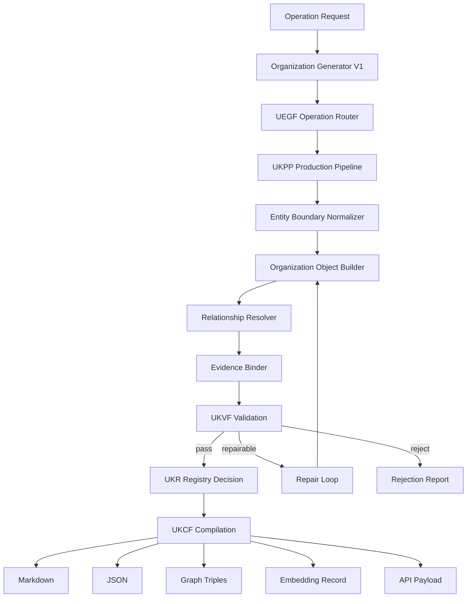
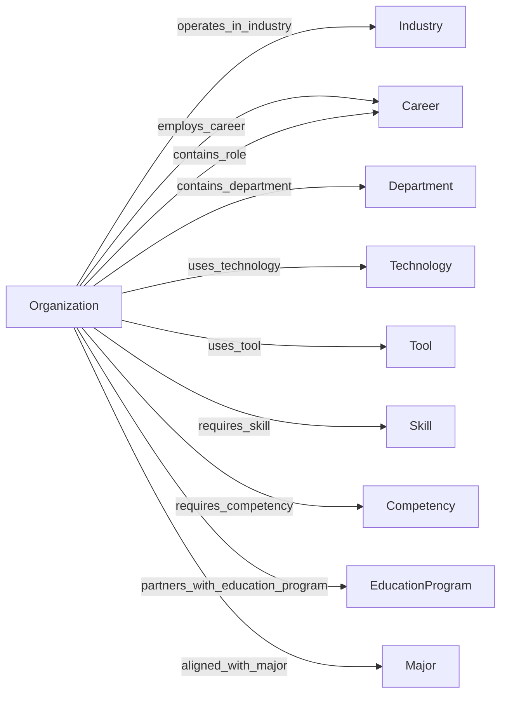
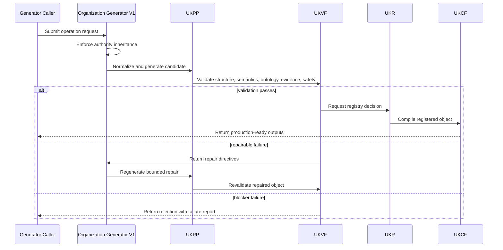
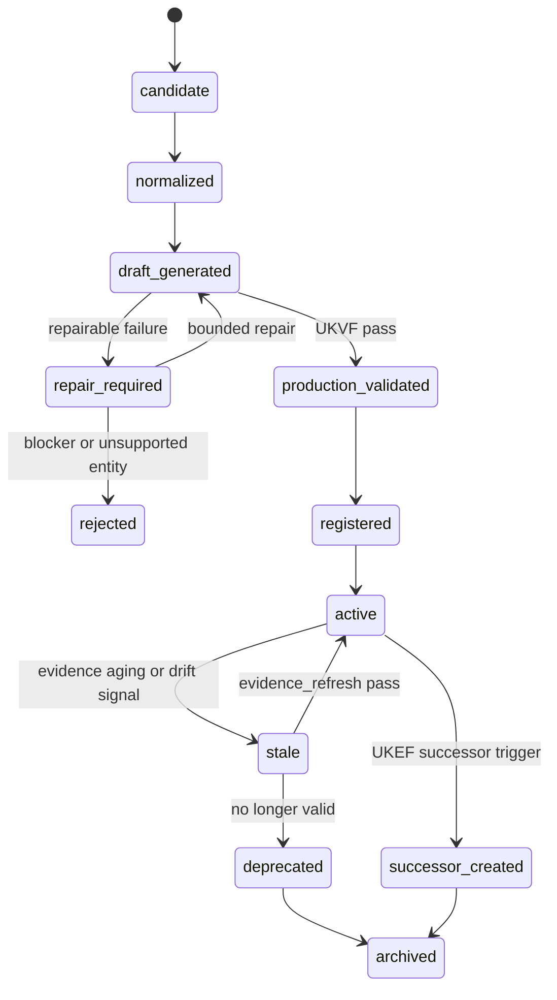
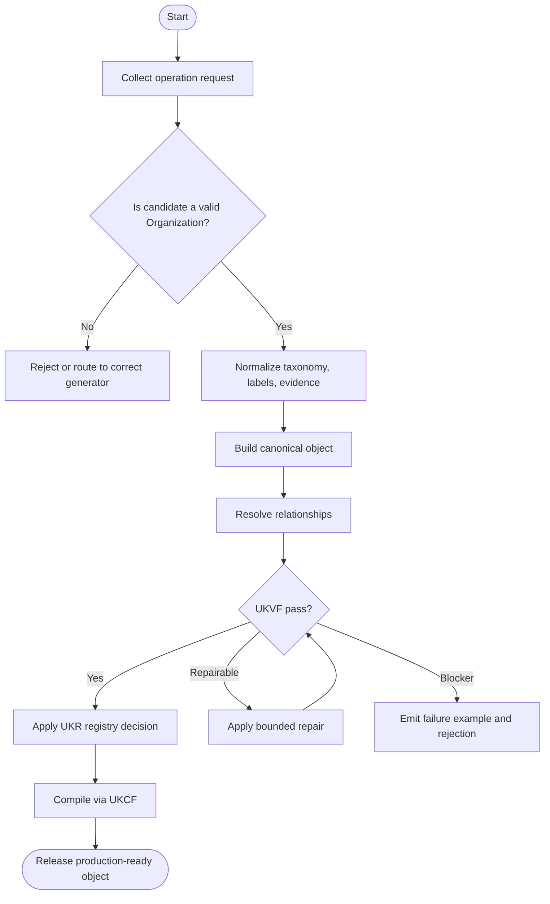
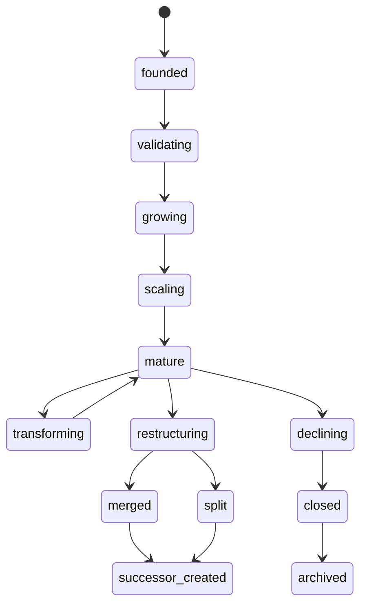

# Organization Generator V1

**File Path:** `assets/knowledge/generators/organization/Organization_Generator_V1.md`  
**Generator ID:** `generator:organization:v1`  
**Entity Type:** `organization`  
**Status:** Production Ready  
**Version:** 1.0.0  
**Release Date:** 2026-06-28  
**Owner:** KarirGPS Principal Knowledge Engineering Team

---

## 1. Document Control

| Field | Value |
| --- | --- |
| Document name | Organization Generator V1 |
| Canonical file | `assets/knowledge/generators/organization/Organization_Generator_V1.md` |
| Generator class | Entity Generator |
| Target entity | Organization |
| Upstream dependencies | AI Constitution, Career Knowledge Ontology, KOS, UEGF, UKPP, UKVF, UKR, UKL, UKQF, UKEF, UKCF, Generator Development Standard V1 |
| Reference style | Career Generator V1, Skill Generator V1, Competency Generator V1, Knowledge Domain Generator V1, Work Task Generator V1, Work Activity Generator V1, Technology Generator V1, Tool Generator V1 |
| Release state | Production-ready implementation specification |
| Change policy | Revisions must preserve architecture inheritance and pass conformance tests |

## 2. Purpose and Scope

The Organization Generator V1 creates, revises, repairs, localizes, enriches, refreshes evidence for, and creates evolution successors for `organization` knowledge objects. An organization is a legally, operationally, or institutionally bounded entity that coordinates people, roles, departments, resources, technologies, governance, culture, and operating models to deliver products, services, public functions, education, research, or social value.

### 2.1 In Scope

- Organization taxonomy, ownership models, legal forms, institutional boundaries, and organization archetypes.
- Organization lifecycle including founding, growth, scaling, maturity, restructuring, merger, acquisition, decline, closure, and successor states.
- Departments, roles, reporting structures, operating models, governance mechanisms, and decision rights.
- Organizational capabilities, culture, workforce model, technology adoption, and relationships with industries, careers, education, tools, and technologies.
- Localization of legal forms, ownership terms, public/private classifications, and institution-specific terminology.
- Operation support for create, revise, repair, localize, enrich, evidence_refresh, and evolution_successor.

### 2.2 Out of Scope

- Creating industry-level economic domains; use Industry Generator V1.
- Creating careers, skills, competencies, work tasks, work activities, technologies, tools, majors, or education programs except as relationships.
- Providing legal incorporation advice or compliance certification.
- Inventing private organizational data, internal structure, ownership, or culture claims without evidence.
- Generating personal data about employees or individuals.

## 3. Authority, Inheritance, and Non-Redesign Constraint

This generator is an implementation artifact only. It does not redesign, fork, supersede, duplicate, or reinterpret any KarirGPS foundation, ontology, standard, or universal framework. It inherits the following authoritative contracts exactly as upstream requirements.

| Authority | Inheritance Applied in This Generator |
| --- | --- |
| AI Constitution | Safety, truthfulness, privacy, non-deceptive generation, fairness, traceability, and human-benefit constraints are enforced for every operation. |
| Career Knowledge Ontology | All classes, relationship names, cardinalities, and semantic boundaries must remain aligned with the canonical career graph. |
| Knowledge Object Specification (KOS) | Every generated object must use the canonical KOS envelope, identity, evidence, language, validation, registry, lineage, and lifecycle fields. |
| Universal Entity Generator Framework (UEGF) | The universal operation model, normalization contract, generation guarantees, and repair behavior are inherited without modification. |
| Universal Knowledge Production Pipeline (UKPP) | Intake, normalization, generation, validation, repair, registration, compilation, and release stages are implemented as the production pipeline. |
| Universal Knowledge Validation Framework (UKVF) | Structural, semantic, ontological, evidence, safety, localization, registry, query, evolution, and compilation validation are required. |
| Universal Knowledge Registry Framework (UKR) | Object identity, versioning, deduplication, lineage, merge rules, and registry state transitions are enforced. |
| Universal Knowledge Language Framework (UKL) | Canonical language, localized variants, controlled terminology, and locale-specific examples are supported. |
| Universal Knowledge Query Framework (UKQF) | Generated objects must be queryable by identity, label, taxonomy, relationships, evidence, maturity, lifecycle state, and career-graph impact. |
| Universal Knowledge Evolution Framework (UKEF) | Revision, deprecation, evidence aging, drift detection, successor creation, and relation revalidation are supported. |
| Universal Knowledge Compilation Framework (UKCF) | Objects compile into registry-ready Markdown, JSON, graph triples, embeddings, and API payloads without semantic loss. |
| Generator Development Standard V1 | All mandatory sections, diagrams, schemas, prompt templates, validation examples, failure examples, tests, certification checks, and readiness checks are included. |

### 3.1 Binding Implementation Rule

If any instruction in this generator conflicts with an upstream authority, the upstream authority wins. The generator must stop, report the conflict, and produce a repair request rather than generating a non-conformant object.

## 4. Generator Development Standard V1 Mandatory Section Map

The following table maps this document to the mandatory sections required by Generator Development Standard V1. No mandatory section is intentionally omitted.

| GDS V1 Mandatory Section | Implemented Section in This Document |
| --- | --- |
| Document control | Section 1 |
| Purpose and scope | Section 2 |
| Authority and inheritance | Section 3 |
| Mandatory section conformance map | Section 4 |
| Entity definition | Section 5 |
| Ontology alignment | Section 6 |
| Canonical object model | Section 7 |
| Operation support | Section 8 |
| Production pipeline | Section 9 |
| Validation framework | Section 10 |
| Registry and identity rules | Section 11 |
| Language and localization rules | Section 12 |
| Query support | Section 13 |
| Evolution rules | Section 14 |
| Compilation outputs | Section 15 |
| Architecture diagrams | Section 16 |
| Mermaid diagrams | Section 16 |
| Sequence diagrams | Section 16 |
| State diagrams | Section 16 |
| Flowcharts | Section 16 |
| Schemas | Section 17 |
| Prompt templates | Section 18 |
| Validation examples | Section 19 |
| Failure examples | Section 20 |
| Conformance tests | Section 21 |
| Engineering certification checklist | Section 22 |
| Production readiness checklist | Section 23 |
| Release contract | Section 24 |


## 5. Entity Definition: Organization

An `organization` represents a bounded collective actor, such as a company, government agency, school, university, hospital, cooperative, nonprofit, startup, foundation, professional association, or platform operator. It can be modeled as a specific named organization or an organization archetype when the registry scope requires canonical organization types.

### 5.1 Canonical Definition

```yaml
object_type: organization
canonical_definition: >
  A legally, operationally, or institutionally bounded entity that coordinates people, roles, departments, governance, capabilities, culture, resources, technologies, and operating models to produce value or fulfill a mission.
boundary_rule: >
  An organization must have a bounded institutional identity or archetype; it must not be a whole industry, job role, team task, technology, tool, education program, or academic major.
```

### 5.2 Boundary Tests

| Test | A Valid Object Must Answer |
| --- | --- |
| Institutional boundary | What legal, operational, or institutional boundary defines it? |
| Ownership or authority | Who owns, sponsors, governs, charters, or authorizes it? |
| Operating model | How does it coordinate departments, roles, resources, and workflows? |
| Mission or value output | What products, services, public functions, learning, research, or social value does it deliver? |
| Department and role structure | Which departments and roles are typical or official? |
| Governance | What decision rights, accountability model, and control mechanisms exist? |
| Industry relationship | Which industry or sector context does it operate within? |

### 5.3 Non-Examples

| Invalid Candidate | Reason It Is Not This Entity | Correct Entity Direction |
| --- | --- | --- |
| Banking industry | Economic domain, not one organization. | Industry |
| Marketing manager | Career or role, not organization. | Career |
| Payroll processing | Work activity or task, not organization. | Work Activity or Work Task |
| Kubernetes | Technology/tool ecosystem, not organization. | Technology or Tool |
| Bachelor of Accounting | Education program, not organization. | Education Program |

### 5.4 Canonical Taxonomy Rules

Organization taxonomy must classify entities by organizational archetype, ownership model, legal form, sector alignment, operating model, scale band, governance model, and profit orientation. Legal form and ownership model must be distinct: a cooperative may be a legal form and member-owned ownership model; a state-owned enterprise may have a company legal form and public ownership.

### 5.5 Lifecycle, Maturity, and Change Semantics

Organization lifecycle must represent institutional change: founding, validation, growth, scale-up, maturity, transformation, restructuring, merger, acquisition, divestiture, closure, or successor. Culture and capabilities may change through revision, but legal or institutional identity shifts can require successor handling.

### 5.6 Entity-Specific Required Coverage

The generator must emit the following semantic coverage for every production object unless the evidence model explicitly proves a field is not applicable.

| Coverage Area | Required Generator Behavior | Quality Gate |
| --- | --- | --- |
| Organization taxonomy | Emit organization type, ownership model, legal form, scale, sector, and operating archetype. | Taxonomy distinguishes legal form from ownership and industry. |
| Departments and roles | Map typical or official departments, roles, reporting patterns, and collaboration surfaces. | Role mappings do not create personal employee records. |
| Operating model | Describe value delivery, coordination model, process model, and technology enablement. | Operating model is specific enough for career-graph traversal. |
| Governance | Represent governance bodies, decision rights, accountability, risk, and control mechanisms. | Governance claims are evidence-bound for named organizations. |
| Capabilities and culture | Describe capabilities and culture as organizational patterns, not personal traits. | Culture terms are descriptive, non-discriminatory, and evidence-aware. |
| Relationships | Connect to industry, careers, technologies, education programs, work activities, and tools. | Relationships are validated and cardinality-compliant. |


## 6. Ontology Alignment

Organization objects are bound to the Career Knowledge Ontology as career-graph context entities. They must connect to adjacent entities using explicit, validated, and queryable relationships.

### 6.1 Required Ontology Class

```yaml
ontology_binding:
  primary_class: career_ontology.Organization
  parent_classes:
    - career_ontology.InstitutionalActor
    - career_ontology.CareerGraphContext
    - career_ontology.OperatingSystem
  disjoint_with:
    - career_ontology.Industry
    - career_ontology.Career
    - career_ontology.Technology
    - career_ontology.Tool
    - career_ontology.Skill
    - career_ontology.Competency
    - career_ontology.EducationProgram
    - career_ontology.Major
    - career_ontology.WorkTask
    - career_ontology.WorkActivity
```

### 6.2 Allowed Relationships

| Relationship | Target Entity | Cardinality | Meaning |
| --- | --- | --- | --- |
| operates_in_industry | industry | 1..n | Industry or sector context in which the organization operates. |
| employs_career | career | 0..n | Careers commonly employed by or required in the organization. |
| contains_department | department | 0..n | Departments or functional units within the organization. |
| contains_role | role_or_career | 0..n | Roles, positions, or career archetypes in the organization. |
| uses_technology | technology | 0..n | Technologies adopted in operations. |
| uses_tool | tool | 0..n | Tools used by departments, teams, or roles. |
| requires_competency | competency | 0..n | Competencies required for organizational capability. |
| requires_skill | skill | 0..n | Skills required in roles or functions. |
| partners_with_education_program | education_program | 0..n | Education programs connected through hiring, internship, training, or research. |
| aligned_with_major | major | 0..n | Majors commonly feeding talent into the organization. |
| performs_work_activity | work_activity | 0..n | Activities performed within the organization. |
| executes_work_task | work_task | 0..n | Tasks performed within departments or roles. |

### 6.3 Relationship Integrity Rules

1. Organization must have at least one industry or sector relationship unless it is a cross-sector institution explicitly modeled as such.
2. Departments are components of the organization; they are not separate organizations unless legally or operationally independent.
3. Organization-to-career relationships describe workforce relevance, not employment promises or individual job openings.
4. Named-organization facts must be evidence-bound; archetype-level patterns may use expert-reviewed or taxonomy evidence.
5. Culture descriptions must avoid stereotyping, protected-class claims, or unverified internal assertions.

### 6.4 Cross-Generator Dependency Rules

| Referenced Generator | Dependency Rule | Failure Trigger |
| --- | --- | --- |
| Industry Generator V1 | Use for economic domain context in which the organization operates. | Candidate describes a market sector rather than an institutional actor. |
| Career Generator V1 | Use for roles and job families employed by the organization. | Candidate is an occupation or position family. |
| Work Activity and Work Task Generators | Use for activities and tasks performed by departments or roles. | Candidate is a process or task rather than an organization. |
| Technology and Tool Generators | Use for technologies and tools adopted by the organization. | Candidate is a platform, system, software, hardware, or physical tool. |
| Education Program and Major Generators | Use for hiring pipelines, partnerships, and education relationships. | Candidate describes a curriculum or academic field. |


## 7. Canonical Object Model

### 7.1 Required KOS Envelope

```yaml
kos:
  kos_version: "1.0"
  object_id: "organization:regional-hospital-system:v1"
  object_type: "organization"
  object_version: "1.0.0"
  lifecycle_state: active
  canonical_language: en
  created_by_generator: "generator:organization:v1"
  created_at: "2026-06-28"
  updated_at: "2026-06-28"
```

### 7.2 Required Organization Fields

| Field | Type | Required | Description |
| --- | --- | --- | --- |
| canonical_label | string | Yes | Stable organization or organization-archetype name. |
| aliases | string[] | Yes | Alternative names, abbreviations, local labels, and legal names where applicable. |
| definition | string | Yes | Boundary-aware definition of the organization. |
| organization_taxonomy | object | Yes | Organization type, sector, scale, ownership, legal form, and operating archetype. |
| ownership_models | object[] | Yes | Ownership or sponsorship patterns. |
| legal_forms | object[] | Yes | Legal or institutional forms and jurisdiction scope. |
| organization_lifecycle | object | Yes | Lifecycle stage, change signals, and successor triggers. |
| departments | object[] | Yes | Functional units, departments, divisions, or teams. |
| roles | object[] | Yes | Role families and career relationships. |
| operating_models | object[] | Yes | Delivery, coordination, process, and workforce operating models. |
| governance | object | Yes | Decision rights, accountability, compliance, risk, and control mechanisms. |
| organizational_capabilities | object[] | Yes | Capabilities supported by roles, skills, technologies, and activities. |
| organizational_culture | object | Yes | Culture descriptors, norms, collaboration patterns, and evidence level. |
| relationships | relation[] | Yes | Validated career-graph relationships. |

### 7.3 Embedded Model Requirements

The embedded organization model must include: `organization_taxonomy_model`, `ownership_model`, `legal_form_model`, `lifecycle_model`, `department_model`, `role_model`, `operating_model`, `governance_model`, `capability_model`, `culture_model`, and `relationship_model`. Named organizations require evidence for identity, legal form, ownership, governance, and major structural claims.

### 7.4 Evidence Model

Every object must include evidence records for claims that affect taxonomy, legal or accreditation status, labor demand, maturity, relationships, or successor decisions. Evidence is represented as structured records, not prose-only citations.

```yaml
evidence_record:
  evidence_id: "evidence:organization:source:v1"
  claim_supported: "Specific claim in the object"
  source_type: "official | standards_body | institutional | labor_market | academic | industry_report | registry | expert_review"
  source_title: "Source title as captured by evidence pipeline"
  source_date: "2026-06-28"
  retrieval_date: "2026-06-28"
  reliability_tier: "A | B | C"
  freshness_window_days: 365
  confidence: 0.0_to_1.0
  affected_fields:
    - "taxonomy"
    - "relationships"
```

### 7.5 Quality Metadata

```yaml
quality_metadata:
  generation_confidence: 0.0_to_1.0
  ontology_conformance: pass
  evidence_sufficiency: pass
  localization_status: canonical_only | localized | localization_pending
  validation_status: draft_validated | production_validated | repair_required
  registry_action: create | update | merge | split | deprecate | successor
```


## 8. Supported Operations

The generator supports exactly the seven required operations. Each operation must use the same inherited UEGF operation envelope and may not bypass UKPP, UKVF, UKR, UKL, UKQF, UKEF, or UKCF.

| Operation | Universal Meaning | Organization-Specific Contract |
| --- | --- | --- |
| create | Create a new canonical object from normalized source material and ontology constraints. | Create an organization object only after confirming institutional boundary, ownership or authority model, and industry context. |
| revise | Modify an existing object while preserving identity, lineage, registry history, and semantic integrity. | Update departments, roles, operating model, governance, lifecycle, capabilities, culture, or relationships while preserving identity. |
| repair | Correct invalid, incomplete, stale, contradictory, unsafe, or non-conformant object content. | Fix wrong entity boundary, unsupported legal-form claim, missing industry relation, invalid department-role structure, or unsafe culture claim. |
| localize | Create or update locale-specific labels, examples, regulatory references, terminology, and delivery context without changing canonical identity. | Adapt legal forms, ownership terms, public/private categories, institutional titles, and local organization terminology. |
| enrich | Add validated relationships, mappings, evidence, examples, maturity details, and query metadata to an existing object. | Add departments, roles, capability mappings, operating model details, governance, technology adoption, and education relationships. |
| evidence_refresh | Reassess sources, evidence timestamps, confidence, and affected fields while preserving auditable provenance. | Refresh identity, ownership, legal form, accreditation, governance, technology adoption, or public claims for named organizations. |
| evolution_successor | Create a successor object when the entity has materially changed, split, merged, deprecated, or evolved beyond revision scope. | Create successor for merger, split, acquisition, recharter, closure, legal identity change, or major institutional transformation. |

### 8.1 Operation Input Envelope

```yaml
operation_request:
  operation: create | revise | repair | localize | enrich | evidence_refresh | evolution_successor
  generator_id: "generator:organization:v1"
  target_object_type: "organization"
  locale: "en | id-ID | other_valid_locale"
  source_material:
    structured_records: []
    narrative_context: ""
    existing_object: null
    evidence_records: []
  constraints:
    preserve_identity: true
    preserve_architecture: true
    allow_successor_creation: true
    require_registry_validation: true
```

### 8.2 Operation Output Envelope

```yaml
operation_result:
  status: success | repaired | rejected | successor_required
  object_type: "organization"
  object_id: "organization:regional-hospital-system:v1"
  object_version: "1.0.0"
  registry_action: create | revise | repair | localize | enrich | refresh | successor
  validation_summary:
    structural: pass
    semantic: pass
    ontology: pass
    evidence: pass
    safety: pass
  compiled_outputs:
    markdown: true
    json: true
    graph_triples: true
    embedding_record: true
    api_payload: true
```


## 9. Universal Knowledge Production Pipeline Implementation

| Stage | Implementation | Exit Gate |
| --- | --- | --- |
| 1. Intake | Collect source material, target locale, operation type, existing object context, and authority constraints. | Reject unsafe or insufficient requests before generation. |
| 2. Normalization | Normalize labels, aliases, taxonomy terms, lifecycle vocabulary, and organization boundaries. | Produce canonical terms and candidate identity slug. |
| 3. Entity Boundary Check | Confirm that the candidate is a bounded institutional actor or valid organization archetype. | Reject candidates that belong to another generator. |
| 4. Draft Generation | Generate the organization object using the canonical object model and entity-specific coverage rules. | Populate all required fields with auditable rationale. |
| 5. Relationship Resolution | Resolve relationships against existing registry identities and mark unresolved targets for controlled registry handling. | No ambiguous relationship may be emitted as confirmed. |
| 6. Evidence Binding | Bind claims to evidence records and confidence scores. | Evidence-dependent fields include source and freshness metadata. |
| 7. Validation | Run UKVF structural, semantic, ontological, safety, evidence, localization, registry, query, evolution, and compilation checks. | Any failure routes to repair or rejection. |
| 8. Repair Loop | Apply bounded repair to missing fields, inconsistent relationships, invalid lifecycle states, weak evidence, or localization defects. | Repair attempts remain logged and may not invent evidence. |
| 9. Registry Decision | Apply UKR identity, deduplication, merge, split, version, and lifecycle rules. | Object receives a registry-safe action. |
| 10. Compilation | Compile through UKCF into Markdown, JSON, graph triples, embeddings, and API payload. | Outputs preserve semantic equivalence. |
| 11. Release | Release only after conformance tests and production readiness checks pass. | Object is production-ready or explicitly rejected. |

### 9.1 Pipeline Invariants

1. The generator must not create a new framework, schema family, ontology layer, or validation discipline.
2. The generator must not emit objects outside its target entity type.
3. Evidence-dependent claims must be traceable to evidence records or explicitly marked as low-confidence inference.
4. Repair must preserve identity unless UKR determines that a split, merge, or successor is required.
5. Compilation must not remove relationship semantics, confidence, evidence, localization, or lifecycle data.


## 10. Universal Knowledge Validation Framework Implementation

| Validation Layer | Required Check |
| --- | --- |
| Structural validation | All required KOS and entity fields exist, types are valid, cardinalities are respected, and schema compiles. |
| Semantic validation | Definition, taxonomy, lifecycle, maturity, relationships, and examples describe a true organization object. |
| Ontology validation | All relationship targets use allowed entity types and do not violate disjointness or cycle rules. |
| Evidence validation | Evidence is adequate, fresh enough, source-typed, confidence-scored, and bound to claims. |
| Safety validation | Content avoids discriminatory, deceptive, privacy-invasive, or harmful career guidance claims. |
| Localization validation | Localized terms preserve meaning, regulatory/accreditation terms are locale-aware, and canonical identity remains stable. |
| Registry validation | Object identity, version, slug, aliases, deduplication result, and lifecycle state comply with UKR. |
| Query validation | Object supports the required UKQF access patterns and filter dimensions. |
| Evolution validation | Deprecation, split, merge, replacement, and successor logic is consistent with UKEF. |
| Compilation validation | Markdown, JSON, graph triples, embedding metadata, and API payload are semantically equivalent. |

### 10.1 Entity-Specific Validation Rules

1. The object must not describe an industry, career, technology, tool, education program, major, activity, or task.
2. Organization taxonomy must separate organization type, ownership model, legal form, scale, and operating model.
3. Named-organization legal and ownership claims must be evidence-bound.
4. Department and role mappings must not expose or infer private employee data.
5. Governance must include decision-right or accountability semantics, not generic praise.
6. Culture descriptions must be non-discriminatory, evidence-aware, and organizational rather than personal.
7. At least one relationship to industry, sector, or institutional domain must exist.
8. Successor logic must activate for mergers, splits, closures, recharters, or legal identity changes.

### 10.2 Severity Model

| Severity | Meaning |
| --- | --- |
| Blocker | Object cannot be released. Examples: wrong entity type, missing KOS identity, unsafe claim, invalid relationship target, fabricated evidence. |
| Major | Object cannot be production-ready until repaired. Examples: weak taxonomy, missing lifecycle stage, insufficient mapping, unclear boundary. |
| Minor | Object may pass only if repair is applied before release. Examples: alias normalization issue, sparse examples, formatting inconsistency. |
| Advisory | Object can be released with improvement note. Examples: optional enrichment candidate, additional localization opportunity. |

### 10.3 Repair Routing Rules

| Failure Type | Route | Resolution |
| --- | --- | --- |
| Missing required field | repair | Populate from source material or reject when evidence is unavailable. |
| Wrong entity boundary | rejected | Route to the correct generator without creating an object here. |
| Insufficient evidence | repair or evidence_refresh | Attach stronger evidence or downgrade claim confidence. |
| Material historical change | evolution_successor | Create successor when revision would erase lineage. |
| Locale-specific mismatch | localize | Correct terminology while preserving canonical identity. |


## 11. Registry, Identity, and Versioning Rules

### 11.1 Object Identity

```yaml
identity_policy:
  object_id_pattern: "organization:<canonical-slug>:v<major>"
  canonical_slug_source: "normalized canonical label plus disambiguator when required"
  version_policy: "semantic versioning for object content; major version for successor-level change"
  merge_policy: "merge only when two records represent the same real-world or conceptual entity under the same ontology class"
  split_policy: "split when one record incorrectly contains multiple distinct organization objects"
```

### 11.2 Deduplication Keys

| Deduplication Key | Use | Collision Handling |
| --- | --- | --- |
| Canonical legal or institutional name | Primary identity matching for named organizations. | Keep separate when legal entities differ despite similar names. |
| Aliases and abbreviations | Detect duplicate common names and localized names. | Merge as aliases when same institution is confirmed. |
| Jurisdiction + legal form | Disambiguate same-label organizations across regions. | Add jurisdiction disambiguator. |
| Website or official registry identity | Support high-confidence dedupe for named organizations. | Human review if source conflict exists. |
| Organization archetype taxonomy | Dedupe archetype records such as hospital system or public university. | Merge only when taxonomy and operating model match. |

### 11.3 Version Triggers

| Version Level | Trigger |
| --- | --- |
| Patch | Typographic correction, alias cleanup, formatting correction, or non-semantic metadata update. |
| Minor | Added evidence, mappings, relationships, localization, or richer examples without changing entity identity. |
| Major | Meaning changes enough that downstream graph consumers need explicit migration. |
| Successor | Entity is replaced, deprecated, split, merged, renamed with identity shift, or transformed by external structural change. |

### 11.4 Registry States

```yaml
registry_states:
  - candidate
  - normalized
  - draft_generated
  - validation_failed
  - repair_required
  - production_validated
  - registered
  - active
  - stale
  - deprecated
  - successor_created
  - archived
```


## 12. Language and Localization Rules

The canonical language for registry identity is English unless the upstream registry defines another canonical language for a deployment. Localization adds language-specific labels, examples, regulations, delivery context, and market terminology without changing canonical identity.

### 12.1 Localization Requirements

| Component | Localization Rule |
| --- | --- |
| Canonical label | Translate or adapt only in localized label fields; never mutate canonical identity. |
| Aliases | Include local spellings, abbreviations, regulatory names, institutional terms, and common market terms. |
| Definitions | Preserve semantic meaning while adapting examples to local career and education context. |
| Regulation and accreditation terms | Use jurisdiction-specific terms and cite jurisdiction-specific evidence records. |
| Relationships | Do not create locale-only relationships unless the localized context is explicitly scoped. |
| Query metadata | Add localized search terms, synonyms, and disambiguators. |

### 12.2 Locale Pack Structure

```yaml
localization:
  canonical_language: en
  available_locales:
    - locale: id-ID
      localized_label: "Sistem Rumah Sakit Regional"
      localized_definition: "Localized definition preserving canonical meaning."
      localized_aliases: []
      jurisdiction_notes: []
      terminology_notes: []
      evidence_refs: []
```


## 13. Query Support

Generated objects must support direct lookup, semantic search, graph traversal, filtering, aggregation, and downstream recommendation queries under UKQF.

### 13.1 Required Query Dimensions

| Query Dimension | Use | Example Query |
| --- | --- | --- |
| Organization type | Find organizations by archetype, legal form, ownership, or sector. | Show nonprofit healthcare providers. |
| Department and role | Traverse organization to departments, roles, and careers. | Which roles exist in a regional hospital system? |
| Governance | Filter by governance or ownership model. | Organizations with cooperative ownership. |
| Capability | Find organizations by capabilities and required skills. | Organizations requiring cybersecurity operations capability. |
| Technology adoption | Find organizations using particular technology types. | Organizations using electronic health record systems. |
| Education relationship | Find hiring or partnership alignment. | Organizations aligned with nursing education programs. |

### 13.2 Query Metadata Contract

```yaml
query_metadata:
  primary_search_terms:
    - "regional hospital system"
  aliases:
    - "integrated healthcare provider"
  filters:
    - organization_type
    - ownership_model
    - legal_form
    - industry
    - scale_band
    - operating_model
    - governance_model
    - technology_adoption
    - capability_area
    - jurisdiction
  graph_traversal_entrypoints:
    - organization_to_industry
    - organization_to_career
    - organization_to_department
    - organization_to_role
    - organization_to_technology
    - organization_to_tool
    - organization_to_education_program
    - organization_to_major
  ranking_signals:
    evidence_confidence: high
    relationship_density: medium
    localization_match: supported
    lifecycle_state: active
```

### 13.3 Query Safety Rules

1. Do not rank careers, majors, organizations, industries, or education programs by protected attributes.
2. Do not infer personal suitability from sensitive personal characteristics.
3. Do not present low-confidence or stale evidence as current fact.
4. Do not hide uncertainty when regulation, accreditation, labor demand, or technology adoption data is incomplete.


## 14. Evolution and Successor Rules

The generator inherits UKEF and applies it to organization evolution without creating a new evolution framework.

### 14.1 Evolution Triggers

| Trigger | Generator Response | Successor Required When |
| --- | --- | --- |
| Merger or acquisition | Create successor or merge depending on legal identity and registry policy. | Predecessor identity no longer independently operates. |
| Organizational split | Split into multiple organization successors. | Distinct legal or operating entities emerge. |
| Recharter or legal-form change | Revise or create successor based on identity continuity. | Legal identity and governance materially change. |
| Closure or dissolution | Deprecate or archive after evidence confirmation. | Organization ceases operation as modeled. |
| Operating-model transformation | Revise and enrich capabilities, departments, roles, and technology relationships. | Transformation creates new organizational archetype identity. |

### 14.2 Successor Creation Contract

```yaml
evolution_successor:
  predecessor_object_id: "organization:regional-hospital-system:v1"
  successor_object_id: "organization:regional-hospital-system-successor:v2"
  successor_reason: "material identity change | deprecation | split | merge | replacement | regulatory transformation"
  migration_notes:
    downstream_relationships_revalidated: true
    deprecated_fields_mapped: true
    evidence_refreshed: true
    query_redirect_created: true
```

### 14.3 Deprecation Rules

1. Do not deprecate named organizations solely due to restructuring; evaluate revision, successor, split, or merge first.
2. Closure must be evidence-bound before deprecation.
3. Merged or acquired organizations require predecessor-successor lineage and query redirects.
4. Organization archetype deprecation requires evidence that the archetype is no longer meaningful in the ontology context.


## 15. Compilation Outputs

UKCF compilation must generate semantically equivalent outputs for registry use, API use, graph use, search use, and human review.

| Output | Purpose |
| --- | --- |
| Markdown | Human-readable specification, review artifact, and repository-native knowledge object. |
| JSON | API-ready structured object following the JSON Schema in Section 17. |
| Graph triples | Ontology graph representation for traversal and reasoning. |
| Embedding record | Search vector payload with canonical label, definition, aliases, relationships, and query metadata. |
| Registry payload | UKR-ready identity, lifecycle, lineage, evidence, validation, and versioning record. |
| Localization bundle | Locale-specific labels, definitions, aliases, examples, and jurisdiction notes. |

### 15.1 Graph Triple Pattern

```ttl
<organization:regional-hospital-system:v1> a career_ontology:Organization .
<organization:regional-hospital-system:v1> career_ontology:canonicalLabel "Regional Hospital System" .
<organization:regional-hospital-system:v1> career_ontology:lifecycleState "active" .
<organization:regional-hospital-system:v1> career_ontology:createdByGenerator "generator:organization:v1" .
```


## 16. Architecture and Mermaid Diagrams

### 16.1 Generator Architecture Diagram



### 16.2 Ontology Relationship Diagram



### 16.3 Operation Sequence Diagram



### 16.4 Lifecycle State Diagram



### 16.5 Flowchart



### 16.6 Entity-Specific Lifecycle Diagram




## 17. Schemas

### 17.1 JSON Schema

```json
{
  "$schema": "https://json-schema.org/draft/2020-12/schema",
  "$id": "karirgps://schemas/organization/v1",
  "title": "Organization Knowledge Object",
  "type": "object",
  "additionalProperties": false,
  "required": [
    "kos",
    "canonical_label",
    "aliases",
    "definition",
    "organization_taxonomy",
    "ownership_models",
    "legal_forms",
    "organization_lifecycle",
    "departments",
    "roles",
    "operating_models",
    "governance",
    "organizational_capabilities",
    "organizational_culture",
    "relationships",
    "evidence",
    "validation",
    "registry",
    "localization",
    "query_metadata",
    "evolution"
  ],
  "properties": {
    "kos": {
      "type": "object",
      "required": [
        "kos_version",
        "object_id",
        "object_type",
        "object_version",
        "lifecycle_state",
        "canonical_language",
        "created_by_generator",
        "created_at",
        "updated_at"
      ]
    },
    "canonical_label": {
      "type": "string",
      "minLength": 3
    },
    "aliases": {
      "type": "array",
      "items": {
        "type": "string"
      }
    },
    "definition": {
      "type": "string",
      "minLength": 40
    },
    "taxonomy": {
      "type": "object"
    },
    "relationships": {
      "type": "array",
      "items": {
        "type": "object"
      }
    },
    "evidence": {
      "type": "array",
      "items": {
        "type": "object"
      }
    },
    "validation": {
      "type": "object"
    },
    "registry": {
      "type": "object"
    },
    "localization": {
      "type": "object"
    },
    "query_metadata": {
      "type": "object"
    },
    "evolution": {
      "type": "object"
    },
    "organization_taxonomy": {
      "type": [
        "object",
        "array",
        "string",
        "number",
        "boolean"
      ]
    },
    "ownership_models": {
      "type": [
        "object",
        "array",
        "string",
        "number",
        "boolean"
      ]
    },
    "legal_forms": {
      "type": [
        "object",
        "array",
        "string",
        "number",
        "boolean"
      ]
    },
    "organization_lifecycle": {
      "type": [
        "object",
        "array",
        "string",
        "number",
        "boolean"
      ]
    },
    "departments": {
      "type": [
        "object",
        "array",
        "string",
        "number",
        "boolean"
      ]
    },
    "roles": {
      "type": [
        "object",
        "array",
        "string",
        "number",
        "boolean"
      ]
    },
    "operating_models": {
      "type": [
        "object",
        "array",
        "string",
        "number",
        "boolean"
      ]
    },
    "governance": {
      "type": [
        "object",
        "array",
        "string",
        "number",
        "boolean"
      ]
    },
    "organizational_capabilities": {
      "type": [
        "object",
        "array",
        "string",
        "number",
        "boolean"
      ]
    },
    "organizational_culture": {
      "type": [
        "object",
        "array",
        "string",
        "number",
        "boolean"
      ]
    }
  }
}
```

### 17.2 Canonical YAML Shape

```yaml
organization_object:
  kos:
    kos_version: "1.0"
    object_id: "organization:regional-hospital-system:v1"
    object_type: "organization"
    object_version: "1.0.0"
    lifecycle_state: active
    canonical_language: en
    created_by_generator: "generator:organization:v1"
    created_at: "2026-06-28"
    updated_at: "2026-06-28"
  canonical_label: "Regional Hospital System"
  aliases:
    - "Integrated Healthcare Provider"
  definition: "An organization type composed of legally recognized healthcare operating units, departments, roles, governance mechanisms, capabilities, culture, and relationships to industries, careers, technologies, and education pathways."
  organization_taxonomy:
    organization_type: "Healthcare Provider"
    ownership_model: "Public or private, jurisdiction-scoped"
    legal_form: "Institutional form, evidence-bound"
  ownership_models: []
  legal_forms: []
  organization_lifecycle:
    stage: mature
    rationale: "Evidence-bound lifecycle rationale."
  departments: []
  roles: []
  operating_models: []
  governance: {}
  organizational_capabilities: []
  organizational_culture: {}
  relationships: []
  evidence: []
  validation:
    structural: pass
    semantic: pass
    ontology: pass
    evidence: pass
    safety: pass
  registry:
    registry_state: active
    dedupe_status: unique
    version_policy: semantic
  localization:
    canonical_language: en
    available_locales: []
  query_metadata: {}
  evolution:
    successor_policy: UKEF
    predecessor_object_id: null
```

### 17.3 Relationship Record Schema

```yaml
relationship_record:
  relationship_type: "operates_in_industry"
  target_object_type: "industry"
  target_object_id: "registered_target_id"
  relationship_confidence: 0.0_to_1.0
  evidence_refs: []
  directionality: outbound | inbound | bidirectional
  lifecycle_state: active
```


## 18. Prompt Templates

Prompt templates define operational instructions for AI-native execution. Template variables are controlled input variables, not unfinished placeholders. Each variable must be resolved before production generation.

### 18.1 Template Selection Matrix

| Operation | Template Use |
| --- | --- |
| create | Use the `create` template when the caller requests create a new canonical object from normalized source material and ontology constraints. |
| revise | Use the `revise` template when the caller requests modify an existing object while preserving identity, lineage, registry history, and semantic integrity. |
| repair | Use the `repair` template when the caller requests correct invalid, incomplete, stale, contradictory, unsafe, or non-conformant object content. |
| localize | Use the `localize` template when the caller requests create or update locale-specific labels, examples, regulatory references, terminology, and delivery context without changing canonical identity. |
| enrich | Use the `enrich` template when the caller requests add validated relationships, mappings, evidence, examples, maturity details, and query metadata to an existing object. |
| evidence_refresh | Use the `evidence_refresh` template when the caller requests reassess sources, evidence timestamps, confidence, and affected fields while preserving auditable provenance. |
| evolution_successor | Use the `evolution_successor` template when the caller requests create a successor object when the entity has materially changed, split, merged, deprecated, or evolved beyond revision scope. |

### 18.2 Create Template

```text
SYSTEM: You are executing Organization Generator V1 under AI Constitution, Career Knowledge Ontology, KOS, UEGF, UKPP, UKVF, UKR, UKL, UKQF, UKEF, UKCF, and Generator Development Standard V1. Do not redesign architecture.

TASK: Create one production-ready organization object.

INPUTS:
- canonical_label: {canonical_label}
- source_material: {source_material}
- target_locale: {target_locale}
- evidence_records: {evidence_records}

REQUIRED OUTPUT:
- KOS envelope
- organization canonical object model
- taxonomy, lifecycle, maturity, relationships, evidence, validation, registry, localization, query metadata, evolution metadata
- rejection report when the candidate fails entity boundary tests

QUALITY RULES:
- Apply all Organization boundary tests.
- Emit only validated relationships.
- Do not invent evidence.
- Return repair directives for any non-blocker validation failure.
```

### 18.3 Revise Template

```text
Revise the existing organization object {object_id} using {revision_request}. Preserve identity unless UKR requires split, merge, or successor. Re-run UKVF and return a versioned change summary with affected fields, evidence updates, relationship impacts, and query metadata impacts.
```

### 18.4 Repair Template

```text
Repair the invalid organization object {object_id} using validation failures {failure_report}. Apply bounded repair only. Do not fabricate evidence or change canonical identity unless the registry decision authorizes it. Return repaired object plus before/after validation summary.
```

### 18.5 Localize Template

```text
Localize the organization object {object_id} into locale {target_locale}. Preserve canonical identity. Add localized label, aliases, definition, examples, jurisdiction or institutional notes when applicable, and localized query terms. Validate semantic equivalence and locale-specific evidence.
```

### 18.6 Enrich Template

```text
Enrich the organization object {object_id} with additional validated mappings, relationships, evidence, examples, taxonomy detail, and query metadata from {enrichment_sources}. Keep all additions traceable to evidence records and re-run UKVF.
```

### 18.7 Evidence Refresh Template

```text
Refresh evidence for organization object {object_id}. Reassess source reliability, retrieval dates, freshness windows, affected fields, confidence scores, and claims requiring downgrade. Return updated evidence records, field impact report, and validation summary.
```

### 18.8 Evolution Successor Template

```text
Evaluate whether organization object {object_id} requires an evolution successor based on {change_signal}. If successor is required, create successor object with predecessor link, migration notes, relationship revalidation, deprecation handling, and query redirect metadata. If not required, return revision or evidence_refresh recommendation.
```


## 19. Validation Examples

### 19.1 Passing Example

```yaml
operation: create
candidate_label: "Regional Hospital System"
expected_result: pass
why_it_passes:
  - Represents a bounded institutional archetype with departments, roles, governance, and operating model.
  - Can be linked to healthcare industry, clinical careers, technologies, and education programs.
  - Does not expose individual employee data.
minimum_required_relationships:
  - operates_in_industry -> industry:healthcare
  - contains_role -> career:registered_nurse
  - uses_technology -> technology:electronic_health_record_systems
validation_summary:
  structural: pass
  semantic: pass
  ontology: pass
  evidence: pass
  safety: pass
  registry: pass
  compilation: pass
```

### 19.2 Borderline Example Requiring Repair

```yaml
operation: create
candidate_label: "Marketing Department"
expected_result: repair_required
repair_reasons:
  - May be a department inside an organization rather than an organization.
  - Needs evidence of independent institutional boundary if modeled as an organization.
repair_actions:
  - Clarify whether it is an internal department or independent agency.
  - Route to organization component model or Organization Generator only if independent.
```

### 19.3 Localization Example

```yaml
operation: localize
source_object: "organization:regional-hospital-system:v1"
target_locale: id-ID
localized_label: "Sistem Rumah Sakit Regional"
validation_expectation:
  semantic_equivalence: pass
  canonical_identity_preserved: pass
  localized_query_terms_added: pass
```


## 20. Failure Examples

| Candidate | Failure Type | Why It Fails | Required Handling |
| --- | --- | --- | --- |
| Banking industry | Wrong entity boundary | An industry is not an organization. | Route to Industry Generator V1. |
| Data analyst | Wrong entity boundary | A career or role cannot be emitted as organization. | Route to Career Generator V1. |
| Improve customer service | Wrong entity boundary | This is an activity or goal, not an organization. | Route to Work Activity Generator V1 or reject. |
| A company with great culture | Insufficient identity and evidence | Generic praise lacks organizational boundary and culture evidence. | Reject until organization identity and evidence are provided. |

### 20.1 Blocker Failure Report Shape

```yaml
failure_report:
  status: rejected
  generator_id: "generator:organization:v1"
  candidate_label: "Banking industry"
  blocker_reasons:
    - "Wrong entity boundary or missing required evidence."
  correct_routing: "Use the referenced generator indicated by ontology boundary analysis."
  emitted_object: false
```


## 21. Conformance Tests

| Test ID | Test Name | Procedure | Required Result |
| --- | --- | --- | --- |
| CT-001 | Mandatory sections exist | Parse Markdown headings and verify Sections 1 through 24 are present. | pass |
| CT-002 | KOS envelope exists | Validate KOS fields, object type, generator ID, lifecycle state, language, and version. | pass |
| CT-003 | Entity boundary | Run candidate through Organization boundary tests. | pass |
| CT-004 | Operation support | Verify create, revise, repair, localize, enrich, evidence_refresh, and evolution_successor are implemented. | pass |
| CT-005 | Ontology relationships | Validate relationship names, target entity types, cardinality, and disjointness. | pass |
| CT-006 | Pipeline conformance | Ensure UKPP stages are executed and logged. | pass |
| CT-007 | Validation conformance | Ensure UKVF layers are executed and failures route correctly. | pass |
| CT-008 | Registry conformance | Ensure UKR identity, dedupe, versioning, lifecycle, and lineage rules are applied. | pass |
| CT-009 | Localization conformance | Ensure UKL localization preserves canonical identity and semantic equivalence. | pass |
| CT-010 | Query conformance | Ensure UKQF metadata supports required search and traversal dimensions. | pass |
| CT-011 | Evolution conformance | Ensure UKEF revision, deprecation, and successor decisions are valid. | pass |
| CT-012 | Compilation conformance | Ensure UKCF outputs are semantically equivalent. | pass |
| CT-013 | Safety conformance | Ensure AI Constitution safety checks pass. | pass |
| CT-014 | No architecture redesign | Scan output for new universal framework definitions or conflicting architecture claims. | pass |

### 21.1 Minimal Automated Test Manifest

```yaml
conformance_manifest:
  generator_id: "generator:organization:v1"
  test_suite: "Generator Development Standard V1 Entity Generator Conformance"
  required_pass_rate: 1.0
  blocker_policy: "zero_blockers_allowed"
  tests:
    - CT-001
    - CT-002
    - CT-003
    - CT-004
    - CT-005
    - CT-006
    - CT-007
    - CT-008
    - CT-009
    - CT-010
    - CT-011
    - CT-012
    - CT-013
    - CT-014
```


## 22. Engineering Certification Checklist

- [x] Authority inheritance from AI Constitution, Career Knowledge Ontology, KOS, UEGF, UKPP, UKVF, UKR, UKL, UKQF, UKEF, UKCF, and GDS V1 is explicit.
- [x] No architecture is redesigned, duplicated, forked, or extended into a new universal framework.
- [x] Organization boundary rules distinguish the entity from adjacent generators.
- [x] All seven operations are implemented with input and output contracts.
- [x] Production pipeline stages are defined with exit gates.
- [x] Validation layers and repair routes are defined.
- [x] Registry identity, deduplication, versioning, and lifecycle rules are defined.
- [x] Localization rules preserve canonical identity.
- [x] Query metadata supports graph traversal and semantic search.
- [x] Evolution and successor rules are defined.
- [x] Compilation outputs are defined and semantically equivalent.
- [x] Architecture, relationship, sequence, state, flowchart, and lifecycle Mermaid diagrams are included.
- [x] JSON Schema, YAML shape, and relationship schema are included.
- [x] Prompt templates for all operations are included.
- [x] Validation examples and failure examples are included.
- [x] Conformance tests are executable as review criteria.

## 23. Production Readiness Checklist

- [x] Repository path matches the canonical output path.
- [x] Document status is Production Ready and versioned as 1.0.0.
- [x] All mandatory GDS V1 sections are present.
- [x] Entity-specific requirements from the Batch 3 mission are covered.
- [x] No unresolved placeholders, TODO markers, or simplified sections are present.
- [x] All diagrams render as Mermaid code blocks.
- [x] Schemas are syntactically valid and aligned with KOS.
- [x] Prompt templates contain operation-specific controls.
- [x] Validation and failure examples cover pass, repair, and rejection paths.
- [x] Certification checklist has no open exception.
- [x] Document can be used immediately by implementation, QA, registry, and production teams.

## 24. Release Contract

This document is released as `Organization Generator V1` version 1.0.0. It is a production-ready implementation specification for the `organization` entity generator in KarirGPS. It inherits all required foundations, core frameworks, engineering standards, and reference-generator conventions without redesign or duplication.

```yaml
release_contract:
  generator_id: "generator:organization:v1"
  entity_type: "organization"
  version: "1.0.0"
  status: production_ready
  release_date: "2026-06-28"
  architecture_change: false
  universal_framework_change: false
  mandatory_sections_complete: true
  operations_supported:
    - create
    - revise
    - repair
    - localize
    - enrich
    - evidence_refresh
    - evolution_successor
  certification: passed
  production_readiness: passed
```
