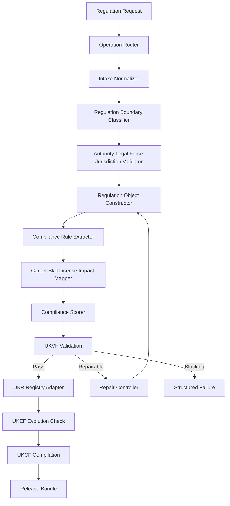
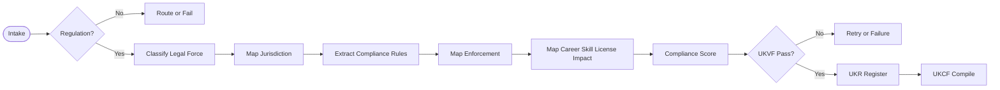
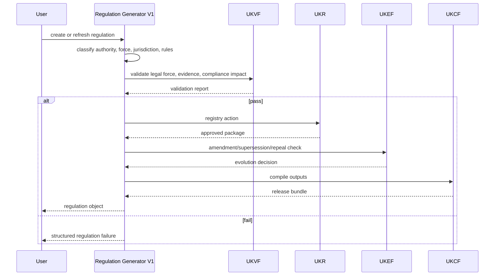
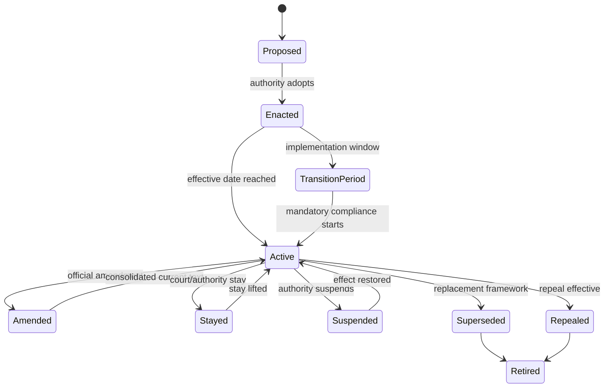

# Regulation Generator V1

    **File Path:** `assets/knowledge/generators/regulation/Regulation_Generator_V1.md`  
    **Generator ID:** `generator:regulation:v1`  
    **Entity Type:** `regulation`  
    **Status:** Production Ready  
    **Version:** 1.0.0  
    **Release Date:** 2026-06-28  
    **Owner:** KarirGPS Principal Knowledge Engineering Team

    ---

    ## 1. Document Control

    | Field | Value |
    |---|---|
    | Document name | Regulation Generator V1 |
    | Canonical file | `assets/knowledge/generators/regulation/Regulation_Generator_V1.md` |
    | Generator class | Entity Generator |
    | Target entity | Regulation |
    | Upstream dependencies | AI Constitution, Career Knowledge Ontology, KOS, UEGF, UKPP, UKVF, UKR, UKL, UKQF, UKEF, UKCF, Generator Development Standard V1 |
    | Reference generator lineage | Career, Skill, Competency, Knowledge Domain, Work Task, Work Activity, Technology, Tool, Industry, Organization, Education Program, Major Generators V1 |
    | Release state | Production-ready implementation specification |
    | Change policy | Revisions must preserve locked architecture inheritance and pass conformance tests. |


### 1.1 Generator Development Standard V1 Mandatory Section Map

| Required Element | Implemented Section |
|---|---|
| Purpose | Section 2 |
| Scope | Section 3 |
| Philosophy | Section 4 |
| Architecture | Section 6 |
| Lifecycle | Section 7 |
| Inputs/Outputs | Section 8 |
| Entity taxonomy and definition | Section 9 |
| Relationship mapping | Section 10 |
| Canonical object model | Section 11 |
| Generation Pipeline | Section 12 |
| Prompt Templates | Section 13 |
| Validation Rules | Section 14 |
| Failure Modes | Section 15 |
| Retry Strategy | Section 16 |
| Registry Integration | Section 17 |
| Language, query, and compilation | Section 18 |
| Evolution Model | Section 19 |
| Example Objects | Section 20 |
| Diagrams: Mermaid + Flow + Sequence + State | Section 21 |
| Conformance Tests | Section 22 |
| Production Readiness Checklist | Section 23 |
| Release Contract | Section 24 |


## 2. Purpose

The Regulation Generator V1 creates, revises, repairs, localizes, enriches, refreshes evidence for, and creates evolution successors for `regulation` knowledge objects. A regulation is an authoritative legal, statutory, administrative, technical, professional, industry, safety, compliance, or governance rule that establishes obligations, prohibitions, permissions, standards, procedures, rights, enforcement mechanisms, penalties, or compliance expectations within a defined jurisdiction or governed domain.

## 3. Scope

### 3.1 In Scope

- Statutes, regulations, decrees, ordinances, directives, administrative rules, professional codes, industry regulations, technical standards with regulatory effect, compliance frameworks, safety rules, data rules, labor rules, licensing rules, education accreditation rules, and official guidelines when they create compliance obligations or authoritative expectations.
- Regulatory taxonomy, legal framework, jurisdiction, authority, effective dates, obligations, prohibitions, compliance rules, enforcement, penalties, regulated entities, career/skill impact, evolution, compliance scoring, evidence, lifecycle, and graph relationships.

### 3.2 Out of Scope

- Individual licenses created under regulation; use License.
- Certifications recognized or required by regulation; use Certification.
- Learning resources about regulation; use Learning Resource.
- Legal advice. This generator models regulation objects and must state evidence and jurisdiction limits.

## 4. Philosophy

Regulation objects are high-stakes, time-sensitive, jurisdiction-bound knowledge objects. The generator prioritizes source-backed legal precision, effective-date awareness, scope boundaries, enforcement reality, and evolution tracking. It separates mandatory obligations from guidance, recommendations, voluntary standards, and best practices. It enables graph reasoning about careers, skills, licenses, certifications, learning resources, tasks, industries, technologies, tools, and organizational practices affected by rules.


## 5. Authority, Inheritance, and Non-Redesign Constraint

This generator is an implementation artifact. It does not redesign, fork, replace, duplicate, or reinterpret any KarirGPS foundation, ontology, core engine, standard, registry rule, validation rule, language rule, query rule, evolution rule, or compilation rule. It implements entity-specific behavior only inside the locked KarirGPS architecture.

| Authority | Binding Inheritance |
|---|---|
| AI Constitution | Enforces safety, truthfulness, privacy, non-deception, fairness, traceability, and human-benefit constraints. |
| Career Knowledge Ontology | Binds this entity to the canonical Career → Skill → Competency → Knowledge Domain → Work Task → Work Activity → Technology → Tool graph and to Batch 3/4 entities through explicitly allowed relationships. |
| KOS | Requires canonical identity, version, lifecycle, evidence, validation, registry, language, query, lineage, and compiled output fields. |
| UEGF | Supplies operation contracts for create, revise, repair, localize, enrich, evidence_refresh, and evolution_successor. |
| UKPP | Supplies deterministic intake, normalization, generation, validation, repair, registration, compilation, and release stages. |
| UKVF | Supplies structural, semantic, ontological, evidence, safety, language, registry, query, evolution, and compilation validation suites. |
| UKR | Supplies identity, deduplication, merge, versioning, lineage, registry transition, deprecation, and successor rules. |
| UKL | Supplies canonical language, localization, terminology control, and semantic equivalence rules. |
| UKQF | Supplies query facets, graph traversal, relationship indexing, and embedding-text requirements. |
| UKEF | Supplies drift detection, evidence aging, lifecycle transitions, successor creation, compatibility, and migration handling. |
| UKCF | Supplies lossless compilation to Markdown, JSON, graph triples, embedding text, API payload, and registry manifest. |
| Generator Development Standard V1 | Supplies mandatory sections, engineering acceptance gates, failure handling, diagrams, and release checks. |

### 5.1 Binding Conflict Rule

If any entity-specific rule conflicts with an upstream authority, the generator must stop, emit `authoritative_conflict`, identify the exact rule path, and return a structured repair report. The generator must not resolve conflicts by guessing or silently overriding the locked system.


## 6. Architecture

### 6.1 Runtime Components

| Component | Responsibility | Output |
|---|---|---|
| Operation Router | Routes UEGF operation and validates operation preconditions. | Operation context. |
| Intake Normalizer | Normalizes label, aliases, source facts, locale, evidence policy, jurisdiction terms, and relationship hints. | Normalized request. |
| Entity Boundary Classifier | Confirms the candidate belongs to this entity and not to a neighboring generator. | Boundary decision. |
| Evidence Planner | Classifies claims by source need, freshness, reliability, and unsupported-claim policy. | Evidence plan. |
| Object Constructor | Builds KOS envelope, entity fields, lifecycle, scores, risks, and query facets. | Candidate object. |
| Relationship Resolver | Normalizes relationship names, target types, cardinalities, inverse hints, and graph impact. | Relationship graph. |
| Validation Orchestrator | Runs UKVF and entity-specific validation. | Validation report. |
| Repair Controller | Applies deterministic repair for valid repair classes and enforces retry limits. | Repaired object or failure. |
| Registry Adapter | Applies UKR identity, deduplication, merge, versioning, lineage, and state transition. | Registry action. |
| Evolution Adapter | Applies UKEF drift, successor, deprecation, compatibility, and migration rules. | Evolution package. |
| Compilation Adapter | Applies UKCF to generate Markdown, JSON, graph triples, embedding text, API payload, and manifest. | Release bundle. |

### 6.2 Architecture Constraints

- The generator is stateless except for registry and validation context supplied by UKR/UKVF.
- The generator emits only a KOS-compliant object, compiled release bundle, registry action, or structured failure.
- It cannot introduce new universal frameworks, new ontology roots, hidden relation types, or non-KOS output formats.
- All object claims requiring evidence must be evidence-backed, evidence-limited, or removed.
- Localization and compilation must preserve canonical meaning.


## 7. Lifecycle

```yaml
regulation_lifecycle:
  lifecycle_state:
    - proposed
    - enacted
    - active
    - partially_active
    - amended
    - transition_period
    - stayed
    - suspended
    - repealed
    - superseded
    - deprecated
    - retired
  compliance_phase:
    - not_yet_effective
    - voluntary_preparation
    - transition
    - mandatory_compliance
    - enforcement_active
    - sunset_period
    - no_longer_enforced
  evidence_state:
    - official_source_verified
    - secondary_source_supported
    - update_required
    - stale
    - disputed
```

| Transition | Allowed When | Required Metadata |
|---|---|---|
| proposed → enacted | Authority adopts/publishes regulation. | adoption_date, authority, publication evidence. |
| enacted → active | Effective date reached and no stay/suspension applies. | effective_date, scope. |
| active → amended | Official amendment modifies text/obligations. | amendment_ref, affected_sections. |
| active → transition_period | Implementation period applies. | transition_start, transition_end. |
| transition_period → active | Mandatory compliance begins. | enforcement_start. |
| active → stayed/suspended | Court/authority pauses effect. | stay_basis, affected_scope. |
| stayed/suspended → active | Stay or suspension lifted. | reinstatement_basis. |
| active/amended → repealed | Authority repeals regulation. | repeal_basis, repeal_date. |
| active/amended → superseded | Replacement framework controls. | successor_id, migration_notes. |


## 8. Inputs/Outputs

### 8.1 Required Inputs

| Input | Type | Required | Rule |
|---|---|---:|---|
| `operation` | enum | Yes | `create`, `revise`, `repair`, `localize`, `enrich`, `evidence_refresh`, or `evolution_successor`. |
| `candidate_label` | string | Yes | Name or title to normalize into canonical label and slug. |
| `candidate_description` | string | Yes | Source description sufficient for boundary classification and required fields. |
| `canonical_language` | BCP-47 language tag | Yes | Default `en`; localized variants are handled by UKL. |
| `source_context` | object | Yes | User source facts, imported data, registry state, or controlled corpus references. |
| `evidence_policy` | object | Yes | Required source class, freshness threshold, reliability threshold, and unsupported-claim behavior. |
| `registry_mode` | enum | Yes | `draft`, `candidate`, `registered`, `revise_existing`, `merge_candidate`, or `deprecate_candidate`. |
| `validation_mode` | enum | Yes | `strict` for release; `exploratory` for non-release analysis. |
| `relationship_hints` | relation[] | No | Existing graph references to validate, normalize, or reject. |
| `locale_targets` | string[] | No | Locale variants to generate through UKL. |

### 8.2 Required Outputs

| Output | Type | Required | Rule |
|---|---|---:|---|
| `kos_object` | object | Yes | Canonical KOS-compliant entity object. |
| `validation_report` | object | Yes | UKVF result plus entity-specific checks. |
| `registry_action` | object | Yes | UKR action and lineage entry. |
| `relationship_delta` | object | Yes | Added, changed, removed, and rejected relationships. |
| `evidence_delta` | object | Yes | Evidence added, refreshed, downgraded, or rejected. |
| `compiled_outputs` | object | Yes | Markdown, JSON, graph triples, embedding text, API payload, registry manifest. |
| `audit_log` | object | Yes | Operation, generator version, source hash, validation summary, release decision. |

### 8.3 Structured Failure Output

```yaml
failure:
  code: string
  severity: blocking | major | minor | advisory
  operation: create | revise | repair | localize | enrich | evidence_refresh | evolution_successor
  entity_type: string
  field_path: string
  reason: string
  upstream_rule: string
  repair_action: string
  retry_allowed: boolean
  registry_safe: boolean
```


## 9. Entity Definition and Taxonomy

A `regulation` object is an authoritative rule framework with issuing/enforcing authority, legal/administrative/professional basis, jurisdiction/governed domain, effective dates, obligations/prohibitions/permissions/controls, enforcement, penalties, and impact mapping.

### 9.1 Regulatory Taxonomy

```yaml
regulatory_taxonomy:
  primary_type:
    - statute
    - regulation
    - administrative_rule
    - decree
    - ordinance
    - directive
    - professional_code
    - industry_regulation
    - technical_standard_with_regulatory_effect
    - accreditation_standard
    - safety_rule
    - data_protection_rule
    - labor_rule
    - licensing_rule
    - environmental_rule
    - financial_compliance_rule
    - healthcare_compliance_rule
    - education_compliance_rule
    - official_guideline
  legal_force:
    - binding_law
    - binding_regulation
    - delegated_rule
    - mandatory_standard
    - enforceable_code
    - licensing_condition
    - accreditation_condition
    - official_guidance
    - voluntary_standard
  regulatory_domain:
    - labor
    - healthcare
    - education
    - finance
    - data_privacy
    - cybersecurity
    - environment
    - occupational_safety
    - transportation
    - construction
    - energy
    - food_and_drug
    - public_administration
    - professional_practice
    - technology_governance
```

### 9.2 Legal Framework, Compliance, Jurisdiction, Enforcement

```yaml
legal_framework:
  authority_name: string
  authority_type: legislature | ministry_or_department | administrative_agency | professional_regulator | standards_body_with_legal_mandate | court_or_tribunal | local_government | international_or_regional_body
  legal_basis_type: constitution | statute | delegated_authority | treaty | administrative_mandate | professional_statute | licensing_framework | accreditation_framework
  citation: string
  official_publication_reference: string
  effective_date: date
  amendment_history: []

compliance_rules:
  regulated_entities: []
  obligations:
    - obligation_id: string
      description: string
      applies_to: []
      effective_date: date
      evidence_required: true
      compliance_frequency: one_time | recurring | event_based | continuous
      severity: low | medium | high | critical
  prohibitions: []
  permissions: []
  required_controls:
    - policy
    - training
    - reporting
    - audit
    - technical_control
    - supervision
    - documentation
    - licensing
    - certification

jurisdiction_rules:
  jurisdiction_type: international | regional_bloc | national | state_or_province | municipal | special_zone | sectoral | organization_internal_if_binding
  jurisdiction_name: string
  jurisdiction_code: string
  extraterritorial_effect: none | limited | explicit | uncertain
  conflict_rules: [preemption, minimum_standard, stricter_rule_applies, local_override, mutual_recognition, unknown]

enforcement_mechanisms:
  enforcement_bodies: []
  mechanisms: [inspection, audit, reporting_requirement, complaint_investigation, licensing_action, certification_requirement, administrative_penalty, civil_penalty, criminal_penalty, corrective_action_order, public_disclosure]
  penalties: [warning, fine, suspension, revocation, remediation_order, injunction, prosecution]
  enforcement_likelihood: low | medium | high | unknown
```

### 9.3 Impact and Compliance Scoring

```yaml
career_skill_impact:
  affected_careers:
    - career_ref: career:clinical_data_coordinator:v1
      impact_type: entry_requirement | practice_constraint | continuing_duty | protected_title | compliance_training
      impact_severity: low | medium | high | critical
  required_skills: []
  required_competencies: []
  affected_tasks: []

compliance_score:
  total: 0-100
  components:
    legal_force_clarity: 0-15
    jurisdiction_specificity: 0-10
    obligation_specificity: 0-15
    enforcement_mechanism_strength: 0-15
    penalty_severity: 0-10
    career_skill_impact_clarity: 0-10
    evidence_quality_and_currency: 0-15
    implementation_guidance_quality: 0-10
  bands:
    critical_compliance: 85-100
    high_compliance: 70-84
    moderate_compliance: 50-69
    low_compliance: 25-49
    informational: 0-24
```

## 10. Relationship Mapping and Ontology Alignment

| Relationship | Target Entity | Cardinality | Meaning |
|---|---|---:|---|
| `issued_by` | organization | 1..n | Authority issuing/maintaining regulation. |
| `enforced_by` | organization | 0..n | Authority enforcing regulation. |
| `governs_industry` | industry | 0..n | Regulated industry. |
| `affects_career` | career | 0..n | Career entry/practice/duty affected. |
| `requires_skill` | skill | 0..n | Skill required by compliance/practice. |
| `requires_competency` | competency | 0..n | Competency required by regulated work. |
| `requires_knowledge_domain` | knowledge_domain | 0..n | Domain knowledge required. |
| `governs_work_task` | work_task | 0..n | Task subject to rule/control. |
| `governs_work_activity` | work_activity | 0..n | Activity subject to rule/control. |
| `governs_technology` | technology | 0..n | Technology use governed/restricted. |
| `governs_tool` | tool | 0..n | Tool use governed/restricted. |
| `requires_license` | license | 0..n | License required by regulation. |
| `recognizes_certification` | certification | 0..n | Certification accepted/required. |
| `requires_learning_resource` | learning_resource | 0..n | Required compliance training/resource. |
| `affects_education_program` | education_program | 0..n | Program accreditation/curriculum affected. |
| `affects_major` | major | 0..n | Major/field requirement affected. |
| `amends_regulation` | regulation | 0..n | Amends another regulation. |
| `supersedes_regulation` | regulation | 0..n | Replaces prior regulation. |
| `superseded_by_regulation` | regulation | 0..n | Successor rule. |
| `conflicts_with_regulation` | regulation | 0..n | Conflict requiring rule resolution. |

Boundary rules: permission granted by a rule routes to License; credential recognized by a rule routes to Certification; content teaching a rule routes to Learning Resource; voluntary best practice without authority or compliance effect is not Regulation.

## 11. Canonical Object Model

```yaml
kos:
  kos_version: "1.0"
  object_id: "regulation:synthetic_health_data_practice_rule:v1"
  object_type: "regulation"
  object_version: "1.0.0"
  lifecycle_state: active
  canonical_language: en
  created_by_generator: "generator:regulation:v1"
  created_at: "2026-06-28T00:00:00+07:00"
  updated_at: "2026-06-28T00:00:00+07:00"
```

| Field | Type | Required | Description |
|---|---|---:|---|
| `canonical_label` | string | Yes | Official or normalized regulation title. |
| `aliases` | string[] | Yes | Short titles, local names, acronyms, citations. |
| `definition` | string | Yes | Rule and governed domain. |
| `regulatory_taxonomy` | object | Yes | Primary type, legal force, domain. |
| `legal_framework` | object | Yes | Authority, basis, citation, publication, dates. |
| `jurisdiction_rules` | object | Yes | Jurisdiction, extraterritorial effect, conflict rules. |
| `compliance_rules` | object | Yes | Obligations, prohibitions, permissions, controls. |
| `regulated_entities` | object[] | Yes | Persons, roles, organizations, industries, systems. |
| `career_skill_impact` | object | Yes | Career, skill, task, competency, domain impact. |
| `license_certification_impact` | object | Yes | Required/recognized licenses/certifications. |
| `enforcement_mechanisms` | object | Yes | Enforcement bodies, mechanisms, penalties. |
| `effective_dates` | object | Yes | Adoption, publication, effective, transition, repeal/sunset. |
| `evolution_history` | object[] | Yes | Amendments, supersession, repeal. |
| `compliance_score` | object | Yes | Component score and total. |
| `implementation_guidance` | object | Yes | Controls, documentation, training, audit, reporting. |
| `relationships` | object | Yes | Ontology relationships. |
| `risks_and_limitations` | object[] | Yes | Uncertainty, conflicts, pending amendment, staleness. |
| `evidence` | object[] | Yes | Evidence ledger. |
| `validation` | object | Yes | UKVF result. |
| `registry` | object | Yes | UKR action and lineage. |
| `query_facets` | object | Yes | UKQF indexing metadata. |


## 12. Generation Pipeline

| Stage | Name | Inputs | Processing | Outputs | Blocking Gate |
|---:|---|---|---|---|---|
| 1 | Intake | Operation context, source context | Parse operation, normalize label, extract aliases and claims. | Normalized request. | Missing operation, label, description, or evidence policy. |
| 2 | Boundary Classification | Normalized request | Check entity identity against all neighboring generators. | Boundary decision. | Candidate belongs elsewhere or mixes entities. |
| 3 | Ontology Binding | Boundary decision, hints | Bind allowed classes, relationships, and inverse hints. | Binding map. | Unknown class or illegal relationship. |
| 4 | Evidence Planning | Claims, evidence policy | Determine evidence need, freshness, source reliability, unsupported-claim treatment. | Evidence plan. | High-impact claim has no allowed evidence route. |
| 5 | Object Construction | Binding map, source facts | Generate KOS envelope, entity fields, lifecycle, scores, risks, and query facets. | Draft KOS object. | Required fields missing. |
| 6 | Relationship Resolution | Draft object, registry refs | Resolve target IDs, cardinality, direction, and graph consistency. | Relationship graph. | Unsupported, circular, or contradictory relation. |
| 7 | Scoring and Risk | Draft object, evidence ledger | Compute score components and risk flags. | Scored candidate. | Score not reproducible. |
| 8 | Validation | Scored candidate | Run UKVF and entity-specific validators. | Validation report. | Any blocking finding. |
| 9 | Repair Loop | Validation report | Apply deterministic repair and rerun validation. | Repaired object or failure. | More than two repair cycles or non-repairable defect. |
| 10 | Registry Decision | Validated object, UKR lookup | Create, revise, merge, reject, deprecate, or successor-link. | Registry action. | Identity collision or unsafe merge. |
| 11 | Compilation | Registry-ready object | Compile through UKCF. | Release bundle. | Markdown/JSON/triples/API mismatch. |
| 12 | Release | Release bundle, audit log | Emit artifacts and registry action. | Production release artifact. | Missing artifact or incomplete audit. |

### 12.1 Supported Operations

| Operation | Identity Rule | Output Rule |
|---|---|---|
| `create` | Allocate new canonical ID unless UKR resolves equivalent object. | New registry-ready object. |
| `revise` | Preserve identity; increment semantic version; append lineage. | Revision diff and updated object. |
| `repair` | Preserve identity unless misclassified. | Repair log and repaired object. |
| `localize` | Preserve canonical ID and meaning. | Locale variant and query aliases. |
| `enrich` | Preserve identity; append provenance. | Enrichment delta and updated object. |
| `evidence_refresh` | Preserve identity; update evidence ledger. | Evidence delta and drift report. |
| `evolution_successor` | Create successor ID; link predecessor. | Successor object and migration notes. |


## 13. Prompt Templates

### 13.1 Create Prompt

```text
System: You are Regulation Generator V1 operating under the locked KarirGPS architecture. Do not redesign frameworks. Produce only a KOS-compliant regulation object or a structured failure.
Developer: Confirm entity boundary, required fields, lifecycle, evidence, relationships, validation, registry action, and compiled outputs.
User: operation=create; candidate_label={candidate_label}; candidate_description={candidate_description}; canonical_language={canonical_language}; evidence_policy={evidence_policy}; registry_mode={registry_mode}; relationship_hints={relationship_hints}.
Output: kos_object, validation_report, registry_action, relationship_delta, evidence_delta, compiled_outputs, audit_log.
```

### 13.2 Revise Prompt

```text
System: Preserve object identity unless UKR/UKEF requires successor or reclassification.
Developer: Apply the requested source-supported changes, compute field/relationship/evidence deltas, rerun strict validation, and append lineage.
User: operation=revise; existing_object={existing_object}; change_request={change_request}; source_context={source_context}.
Output: revision_diff, updated_kos_object, validation_report, registry_action.
```

### 13.3 Repair Prompt

```text
System: Repair only defects supported by source context, ontology, or schema. Do not invent evidence or authority facts.
Developer: Fix blocking and major validation findings within retry limits; return repair_required when unresolved.
User: operation=repair; invalid_object={object}; validation_findings={validation_findings}; evidence_policy={evidence_policy}.
Output: repair_log, repaired_object, unresolved_findings, validation_report.
```

### 13.4 Localize Prompt

```text
System: Preserve canonical meaning while creating locale-specific labels, definitions, examples, and query aliases.
Developer: Apply UKL terminology control and semantic-equivalence validation.
User: operation=localize; object_id={object_id}; target_locales={locale_targets}; localization_context={localization_context}.
Output: localized_variants, UKL_validation_report, query_alias_delta.
```

### 13.5 Enrich Prompt

```text
System: Enrich only when evidence, ontology, and registry policy allow it.
Developer: Add relationships, scoring detail, risk flags, examples, or operational detail; validate no contradiction.
User: operation=enrich; object_id={object_id}; enrichment_request={enrichment_request}; source_context={source_context}.
Output: enriched_object, enrichment_delta, validation_report.
```

### 13.6 Evidence Refresh Prompt

```text
System: Reassess evidence freshness, source reliability, source relevance, lifecycle drift, and score changes.
Developer: Remove, downgrade, or repair claims that no longer satisfy evidence policy.
User: operation=evidence_refresh; object_id={object_id}; evidence_policy={evidence_policy}; refresh_date=2026-06-28.
Output: evidence_delta, score_delta, drift_report, updated_object.
```

### 13.7 Evolution Successor Prompt

```text
System: Create a successor only when material change requires a new identity under UKEF.
Developer: Compare predecessor and successor candidate, decide revise versus successor, link migration notes.
User: operation=evolution_successor; predecessor={object_id}; successor_context={successor_context}.
Output: successor_object, predecessor_transition, migration_notes, validation_report.
```


## 14. Validation Rules

### 14.1 Universal UKVF Layers

| Layer | Checks | Blocking Conditions | Repair Path |
|---|---|---|---|
| Structural | Required fields, types, enums, cardinality, KOS envelope. | Missing required field, invalid object type, malformed schema. | Rebuild schema fragment or fail. |
| Semantic | Definition clarity, entity boundary, non-circular meaning, unsupported claims. | Entity cannot be distinguished from neighboring generator. | Rewrite, reclassify, or fail. |
| Ontological | Allowed relationship names, target types, cardinality, graph direction. | Illegal relation, invalid target, contradictory dependency. | Remove, remap, or fail. |
| Evidence | Source reliability, relevance, freshness, traceability, claim coverage. | Fabricated evidence or high-impact unsupported claim. | Refresh, downgrade, remove, or fail. |
| Safety | Privacy, non-deception, harmful automation, legal/credential misinformation. | Unsafe or deceptive object claim. | Constrain or fail. |
| Language | Canonical language, localization equivalence, controlled terminology. | Translation changes credential/legal/compliance meaning. | Regenerate locale variant. |
| Registry | ID uniqueness, duplicate detection, version lineage, merge safety. | Identity collision or unsafe merge. | Use UKR resolution or fail. |
| Query | Facet completeness, alias quality, graph indexability, embedding fidelity. | Object cannot be retrieved or traversed correctly. | Rebuild facets. |
| Evolution | Valid lifecycle transitions, successor basis, compatibility notes. | Invalid transition or successor without material change. | Correct UKEF metadata. |
| Compilation | Markdown/JSON/triples/API equivalence. | Lost relationship, missing field, checksum mismatch. | Recompile from canonical object. |

### 14.2 Validation Result Format

```yaml
validation:
  framework: UKVF
  validation_mode: strict
  result: pass | fail | pass_with_warnings
  blocking_count: 0
  major_count: 0
  minor_count: 0
  advisory_count: 0
  checks:
    structural: pass | fail
    semantic: pass | fail
    ontological: pass | fail
    evidence: pass | fail | limited
    safety: pass | fail
    language: pass | fail
    registry: pass | fail
    query: pass | fail
    evolution: pass | fail
    compilation: pass | fail
  entity_specific_checks: []
  repair_attempts: 0
  release_allowed: true
```


### 14.3 Regulation-Specific Rules

| Rule ID | Rule | Severity |
|---|---|---|
| REG-V-01 | Issuing authority and legal/authoritative basis are required. | Blocking |
| REG-V-02 | Jurisdiction or governed domain must be explicit. | Blocking |
| REG-V-03 | Legal force must distinguish binding law, delegated rule, enforceable code, guidance, and voluntary standard. | Blocking |
| REG-V-04 | Effective date, transition state, or evidence-limited unknown state must be present. | Blocking |
| REG-V-05 | At least one obligation, prohibition, permission, control, or compliance effect must be modeled. | Blocking |
| REG-V-06 | Compliance score total must equal component sum and remain 0–100. | Blocking |
| REG-V-07 | License requirement claims must link to license objects or unresolved dependency. | Major |
| REG-V-08 | Certification recognition claims must link to certification objects or disclose unmodeled dependency. | Major |
| REG-V-09 | Career/skill impact must not exceed jurisdiction and regulated entity scope. | Blocking |
| REG-V-10 | Repealed, stayed, suspended, or superseded regulations cannot be treated as active without phase metadata. | Blocking |


## 15. Failure Modes

| Failure Code | Severity | Meaning | Required Response |
|---|---|---|---|
| `entity_boundary_error` | Blocking | Candidate belongs to another generator or mixes entity types. | Stop, identify correct generator, do not release object. |
| `missing_required_field` | Blocking | Required KOS/entity field is absent. | Repair when source-supported; otherwise return repair request. |
| `invalid_relationship` | Blocking | Relation name, target type, cardinality, or direction violates ontology. | Remove or remap only when unambiguous. |
| `unsupported_claim` | Blocking for high-impact facts | Claim lacks acceptable evidence. | Remove, downgrade, refresh evidence, or fail. |
| `identity_collision` | Blocking | Proposed ID conflicts with UKR. | Invoke UKR duplicate/merge resolution. |
| `lifecycle_transition_error` | Major or blocking | Proposed lifecycle transition violates UKEF. | Correct transition or fail. |
| `localization_drift` | Major | Locale variant changes canonical meaning. | Regenerate locale variant. |
| `compilation_mismatch` | Blocking | Compiled outputs lose canonical semantics. | Recompile from canonical object. |
| `safety_policy_violation` | Blocking | Output enables deception, privacy breach, harm, or legal/credential misinformation. | Stop and emit safety failure. |
| `authoritative_conflict` | Blocking | Entity behavior conflicts with locked architecture. | Stop and report conflict. |

## 16. Retry Strategy

| Failure Class | Retry Allowed | Maximum Attempts | Strategy |
|---|---:|---:|---|
| Missing optional enrichment | Yes | 1 | Generate conservative enrichment only if ontology/evidence permit. |
| Missing required field with source support | Yes | 2 | Fill from source context or deterministic schema inference. |
| Invalid enum or malformed schema | Yes | 2 | Normalize enum and rebuild schema fragment. |
| Unsupported relation | Yes | 1 | Remove or remap when semantic equivalence is clear. |
| Ambiguous entity boundary | Yes | 1 | Reclassify against neighboring generators; fail if unresolved. |
| Weak or stale evidence | Yes | 1 | Downgrade, refresh, or remove affected claim. |
| Identity collision | Yes | 1 | Use UKR deduplication/merge decision. |
| Legal/compliance contradiction | No | 0 | Stop; do not repair by guessing. |
| Safety violation | No | 0 | Stop; emit AI Constitution failure. |
| Upstream conflict | No | 0 | Stop; emit authoritative conflict. |

Retry exits when blocking failures reach zero, the same blocking defect appears twice, a no-retry defect appears, or repair would require missing facts. A third unresolved blocking defect emits `repair_required`.

## 17. Registry Integration

### 17.1 Identity and Versioning

| Rule | Requirement |
|---|---|
| Canonical ID | `object_type:normalized_slug:vMajor` unless UKR assigns a canonical ID. |
| Slug source | Canonical label, disambiguated by authority, jurisdiction, level, domain, or scope. |
| Version | Semantic version in `object_version`; major version only when compatibility breaks. |
| Lineage | Every operation appends operation, timestamp, generator ID, source hash, evidence delta, relationship delta, and reason. |
| Duplicate detection | Compare canonical label, aliases, authority/source, jurisdiction/scope, taxonomy, relationships, and evidence signature. |
| Merge policy | Merge only when semantic equivalence is proven and no legal, credential, learning, or compliance scope is lost. |

### 17.2 Registry Action Payload

```yaml
registry_action:
  action: create | revise | repair | merge | reject | deprecate | successor
  target_object_id: string
  prior_object_id: string | null
  successor_object_id: string | null
  identity_confidence: 0.0
  version_increment: major | minor | patch | none
  deduplication_basis: []
  lineage_entry:
    timestamp: datetime
    generator_id: string
    operation: string
    reason: string
    evidence_delta_summary: string
    relationship_delta_summary: string
```

## 18. Language, Query, and Compilation Integration

### 18.1 UKL Rules

- Canonical language is preserved in `canonical_language`.
- Localized variants must preserve canonical meaning and relationship semantics.
- Locale aliases must not override canonical labels.
- Legal, credential, curriculum, and compliance terms must use precise local equivalents when available.
- Localized examples must carry locale metadata and cannot change object identity.

### 18.2 UKQF Facets

```yaml
query_facets:
  object_type: string
  canonical_label: string
  aliases: []
  taxonomy: []
  lifecycle_state: string
  jurisdiction_scope: []
  industry_alignment: []
  related_careers: []
  related_skills: []
  related_competencies: []
  related_knowledge_domains: []
  related_work_tasks: []
  related_work_activities: []
  related_technologies: []
  related_tools: []
  related_certifications: []
  related_licenses: []
  related_learning_resources: []
  related_regulations: []
  authority_or_source: []
  compliance_relevance: []
  score_bands: []
  evidence_confidence: string
```

### 18.3 UKCF Outputs

| Output | Requirement |
|---|---|
| Markdown | Human-readable object card and specification summary. |
| JSON | Canonical machine object with stable field order. |
| Graph triples | Subject-predicate-object triples for all relationships. |
| Embedding text | Controlled summary optimized for semantic retrieval. |
| API payload | Registry-safe payload with validation and registry metadata. |
| Registry manifest | Object ID, version, checksum, dependencies, lifecycle, release status. |


## 19. Evolution Model

| Drift Signal | Impact | Action |
|---|---|---|
| Amendment published | Obligations/definitions may change | Revise or create amendment relation. |
| Repeal or supersession | Active compliance state changes | Deprecate/supersede and link successor. |
| Effective date reached | Compliance phase changes | Update lifecycle and query facets. |
| Transition period ends | Enforcement risk increases | Update compliance phase and score. |
| Court stay/suspension | Legal force changes | Mark stayed/suspended with scope. |
| New guidance/enforcement pattern | Implementation impact | Enrich implementation guidance. |
| Jurisdiction conflict appears | Applicability uncertainty | Add conflict relation and limitation. |
| Career/task impact changes | Recommendation impact | Update skills, tasks, licenses, resources. |

Successor is required when the framework is replaced, citation/operative rule is superseded, jurisdiction changes materially, legal force changes, or obligations break compatibility with prior compliance mappings.

## 20. Example Objects

This synthetic object is for engineering conformance tests only.

```yaml
kos:
  kos_version: "1.0"
  object_id: "regulation:synthetic_health_data_practice_rule:v1"
  object_type: "regulation"
  object_version: "1.0.0"
  lifecycle_state: active
  canonical_language: en
  created_by_generator: "generator:regulation:v1"
  created_at: "2026-06-28T00:00:00+07:00"
  updated_at: "2026-06-28T00:00:00+07:00"
canonical_label: "Synthetic Health Data Practice Rule"
aliases: ["SHDPR"]
definition: "A synthetic regulatory object used to test clinical data handling obligations, license dependency, certification recognition, and compliance controls."
regulatory_taxonomy:
  primary_type: data_protection_rule
  legal_force: binding_regulation
  regulatory_domain: healthcare
legal_framework:
  authority_name: "KarirGPS Synthetic Health Data Authority"
  authority_type: administrative_agency
  legal_basis_type: delegated_authority
  citation: "Synthetic Rule 2026-01"
  official_publication_reference: "synthetic_conformance_record"
  effective_date: "2026-01-01"
jurisdiction_rules:
  jurisdiction_type: special_zone
  jurisdiction_name: "Synthetic Health Data Zone"
  extraterritorial_effect: none
  conflict_rules: [stricter_rule_applies]
compliance_rules:
  regulated_entities: ["clinical_data_handlers"]
  obligations:
    - obligation_id: "SHDPR-O1"
      description: "Classify synthetic clinical data before external transfer."
      applies_to: ["clinical_data_handlers"]
      effective_date: "2026-01-01"
      evidence_required: true
      compliance_frequency: event_based
      severity: high
  prohibitions:
    - description: "Do not transfer unclassified synthetic clinical data outside approved workflow."
      applies_to: ["clinical_data_handlers"]
      severity: high
  required_controls: [training, documentation, audit]
career_skill_impact:
  affected_careers:
    - career_ref: "career:clinical_data_coordinator:v1"
      impact_type: practice_constraint
      impact_severity: high
  required_skills:
    - skill_ref: "skill:clinical_data_classification:v1"
      requirement_type: mandatory
  affected_tasks:
    - work_task_ref: "work_task:classify_clinical_data_sensitivity:v1"
      required_control: documentation
license_certification_impact:
  requires_license: ["license:registered_clinical_data_practitioner_demo:v1"]
  recognizes_certification: ["certification:clinical_data_privacy_associate:v1"]
enforcement_mechanisms:
  enforcement_bodies: ["KarirGPS Synthetic Health Data Authority"]
  mechanisms: [audit, licensing_action]
  penalties: [suspension, remediation_order]
  enforcement_likelihood: medium
compliance_score:
  total: 82
  components:
    legal_force_clarity: 14
    jurisdiction_specificity: 9
    obligation_specificity: 14
    enforcement_mechanism_strength: 12
    penalty_severity: 8
    career_skill_impact_clarity: 9
    evidence_quality_and_currency: 8
    implementation_guidance_quality: 8
  band: high_compliance
relationships:
  requires_license: ["license:registered_clinical_data_practitioner_demo:v1"]
  recognizes_certification: ["certification:clinical_data_privacy_associate:v1"]
  requires_skill: ["skill:clinical_data_classification:v1"]
  governs_work_task: ["work_task:classify_clinical_data_sensitivity:v1"]
evidence:
  - evidence_id: "ev:regulation:shdpr:synthetic:001"
    source_type: synthetic_conformance_record
    claim: "Object exists for generator conformance testing."
    confidence: 1.0
validation: {framework: UKVF, result: pass, blocking_count: 0}
registry: {action: create, identity_status: new_unique}
query_facets:
  object_type: regulation
  jurisdiction_scope: [synthetic_jurisdiction]
  compliance_relevance: [high_compliance]
```

## 21. Diagrams

### 21.1 Mermaid Architecture Diagram



### 21.2 Flow Diagram



### 21.3 Sequence Diagram



### 21.4 State Diagram




## 22. Conformance Tests

| Test ID | Test Name | Procedure | Expected Result |
|---|---|---|---|
| CT-01 | KOS Envelope Completeness | Generate minimum valid object and inspect KOS envelope. | Correct object type, generator ID, version, lifecycle, language, and timestamps. |
| CT-02 | Entity Boundary Protection | Submit neighboring entity candidates from all finalized generators. | Incorrect candidates are rejected or routed; no mixed object released. |
| CT-03 | Required Field Enforcement | Remove each required field one at a time. | UKVF reports blocking `missing_required_field`. |
| CT-04 | Relationship Cardinality | Submit invalid targets and illegal relation names. | Invalid relations rejected with field path. |
| CT-05 | Evidence Integrity | Attach stale, fabricated, or irrelevant evidence. | Evidence validation blocks or downgrades claims. |
| CT-06 | Registry Deduplication | Submit duplicate by alias, spelling, authority, and scope variation. | UKR identifies duplicate, merge, or disambiguation action. |
| CT-07 | Localization Equivalence | Generate locale variant and compare meaning. | UKL passes; no identity change. |
| CT-08 | Query Coverage | Query by label, alias, taxonomy, relationship, jurisdiction, lifecycle, and score band. | UKQF retrieves object and valid graph path. |
| CT-09 | Evolution Successor | Trigger material-change scenario. | UKEF creates successor only when required and links predecessor. |
| CT-10 | Compilation Equivalence | Compile to Markdown, JSON, triples, embedding text, API payload. | All formats preserve canonical semantics. |
| CT-11 | Retry Limit | Inject repeated blocking defect. | Generator stops after allowed attempts and emits structured failure. |
| CT-12 | Release Gate | Run strict validation on release candidate. | Release allowed only with zero blocking findings. |

## 23. Production Readiness Checklist

| Item | Required Status |
|---|---|
| Purpose, scope, and philosophy are explicit. | Pass |
| Architecture integrates UEGF, UKPP, UKVF, UKR, UKL, UKQF, UKEF, and UKCF. | Pass |
| Entity taxonomy, lifecycle, inputs/outputs, pipeline, prompts, validation, failures, retry, registry, evolution, relationships, examples, and diagrams are present. | Pass |
| Entity-specific scoring and evidence rules are reproducible. | Pass |
| All relationships use ontology-consistent target entity types and cardinalities. | Pass |
| Example object is complete enough for implementation tests. | Pass |
| Mermaid architecture, flow, sequence, and state diagrams are present. | Pass |
| Conformance tests are executable as engineering acceptance criteria. | Pass |
| No unfinished markers, missing sections, or framework redesign instructions are present. | Pass |

## 24. Release Contract

This generator is production-ready when all conformance tests pass, the production readiness checklist is satisfied, and strict UKVF validation returns zero blocking findings. Release authorizes implementation of this entity generator only and does not authorize any modification of the locked KarirGPS architecture.
