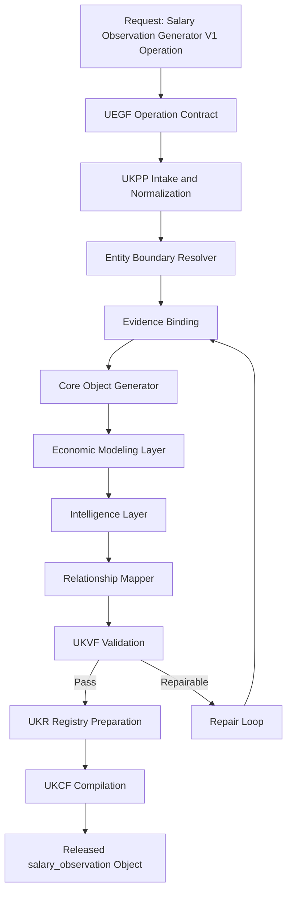
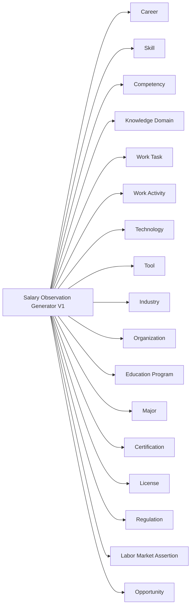
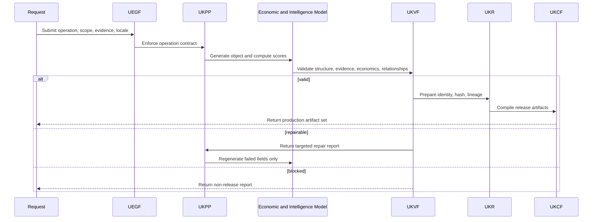
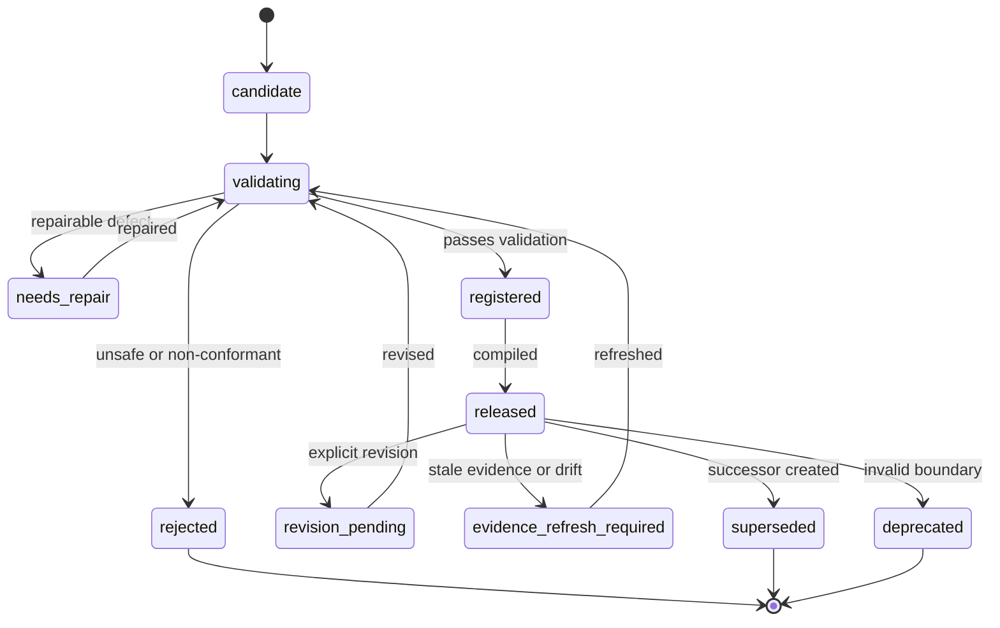
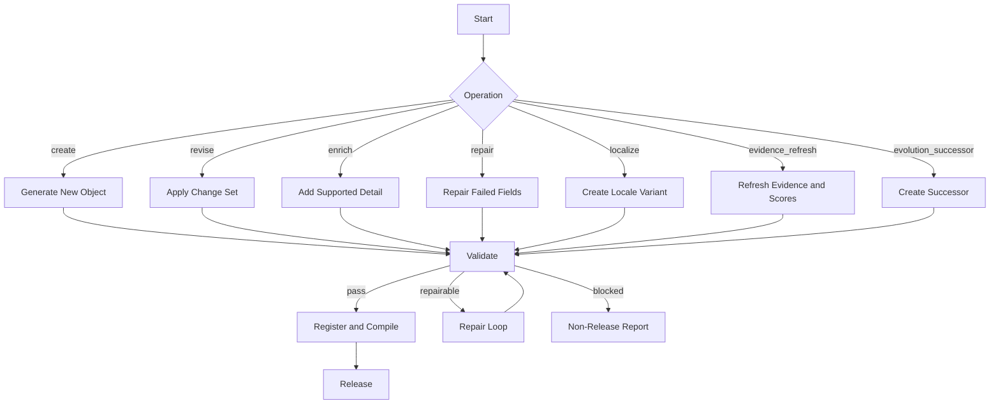
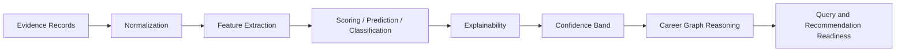

# Salary Observation Generator V1

**File Path:** `assets/knowledge/generators/salary_observation/Salary_Observation_Generator_V1.md`
**Generator ID:** `generator:salary_observation:v1`
**Entity Type:** `salary_observation`
**Status:** Production Ready
**Version:** 1.0.0
**Release Date:** 2026-06-28
**Owner:** KarirGPS Principal Knowledge Intelligence Architecture Team

---

## 1. Document Control

| Field | Value |
| --- | --- |
| Document name | Salary Observation Generator V1 |
| Canonical file | `assets/knowledge/generators/salary_observation/Salary_Observation_Generator_V1.md` |
| Generator class | Entity Generator |
| Target entity | `salary_observation` |
| Economic intelligence role | Compensation benchmark, salary evolution, and skill-premium intelligence |
| Upstream dependencies | AI Constitution, Career Knowledge Ontology, KOS, UEGF, UKPP, UKVF, UKR, UKL, UKQF, UKEF, UKCF, Generator Development Standard V1 |
| Reference generators | Career, Skill, Competency, Knowledge Domain, Work Task, Work Activity, Technology, Tool, Industry, Organization, Education Program, Major, Certification, License, Learning Resource, Regulation |
| Release state | Production-ready implementation specification |
| Compatibility level | V1 registry, V1 ontology, V1 production pipeline |
| Change policy | Revisions must preserve locked architecture inheritance and pass conformance tests |

## 2. Purpose and Scope

### 2.1 Purpose

The Salary Observation Generator V1 creates, revises, enriches, repairs, localizes, refreshes evidence for, and creates evolution successors for `salary_observation` objects. A salary observation is an evidence-bound compensation intelligence object describing pay levels, salary ranges, compensation model, region, industry, career, skill premium, experience scaling, inflation adjustment, AI-driven salary shift, and compensation prediction over a declared time window.

### 2.2 In Scope

- Salary taxonomy for base salary, hourly rate, project fee, contract rate, variable pay, commission, bonus, equity, benefits, allowances, and total compensation.
- Compensation models including fixed, variable, hybrid, equity-based, hourly, project-based, gig, public scale, and collective agreement.
- Regional salary variance, currency normalization, purchasing-power context, and remote compensation scope.
- Industry benchmarks, skill-based compensation mapping, experience-based scaling, inflation adjustment, salary evolution, and prediction.
- AI impact on salary shifts through skill scarcity, productivity, automation exposure, and role redesign.
- Relationship mapping to Career, Skill, Competency, Industry, Organization, Technology, Regulation, Labor Market Assertion, and Opportunity.

### 2.3 Out of Scope

- Creating job opportunities; use Opportunity Generator V1.
- Creating labor demand assertions; use Labor Market Assertion Generator V1.
- Payroll, tax, legal, or negotiation advice.
- Inferring protected attributes or sensitive personal details.
- Guaranteeing salary outcomes for any individual or employer.

## 3. Philosophy

- **Compensation is multi-component.** Base salary is not total compensation.
- **Region and time are mandatory.** Pay data without geography and period is not meaningful.
- **Nominal and real values differ.** Inflation adjustment must be explicit.
- **Skill premiums require evidence.** Premiums cannot be assumed.
- **AI shifts pay unevenly.** AI can increase premium for scarce augmented skills and compress automatable work.
- **Prediction is bounded.** Forecasts require horizon, confidence, and assumptions.
- **Fairness is mandatory.** Salary intelligence must not enable discriminatory compensation practices.

## 4. Authority, Inheritance, and Locked-Architecture Constraint

This generator is an implementation artifact only. It does not redesign, fork, supersede, duplicate, or reinterpret any KarirGPS foundation, universal framework, ontology, or engineering standard.

| Authority | Inheritance Applied |
| --- | --- |
| AI Constitution | Truthfulness, safety, fairness, privacy, transparency, non-deceptive reasoning, and human-benefit constraints are mandatory in every operation. |
| Career Knowledge Ontology | Entity class boundaries, relationship predicates, cardinality, disjointness, and graph reasoning compatibility are preserved. |
| Knowledge Object Specification (KOS) | Canonical envelope, identity, evidence, language, validation, registry, lifecycle, lineage, and compilation fields are required. |
| UEGF | Operation contract, normalized input handling, output guarantees, and repair behavior are inherited without modification. |
| UKPP | Intake, normalization, generation, validation, repair, registration, compilation, release, and monitoring are implemented as inherited stages. |
| UKVF | Structural, semantic, ontology, evidence, safety, economic, localization, registry, query, evolution, and compilation validation are enforced. |
| UKR | Identity, semantic hashing, deduplication, versioning, lineage, merge rules, and registry states are enforced. |
| UKL | Canonical language, localized variants, locale terminology, currency handling, and translation fidelity are enforced. |
| UKQF | Query facets, graph traversal, filterability, ranking compatibility, and explainable retrieval are supported. |
| UKEF | Drift detection, evidence aging, revision, deprecation, and successor creation are supported. |
| UKCF | Markdown, JSON, graph triples, embeddings, API payloads, registry manifest, and audit reports compile without semantic loss. |
| Generator Development Standard V1 | Mandatory sections, diagrams, schemas, prompts, examples, tests, certification checks, and readiness checks are included. |

### 4.1 Binding Implementation Rule

If a request conflicts with an upstream authority, the upstream authority wins. The generator must stop the non-conformant transformation, emit a structured repair report, and avoid releasing a registry-ready object until validation passes.

### 4.2 Mandatory Section Conformance Map

| Required Section | Location |
| --- | --- |
| Purpose | Section 2 |
| Scope | Section 2 |
| Philosophy | Section 3 |
| Architecture | Sections 5 and 22 |
| Lifecycle | Section 15 |
| Inputs / Outputs | Section 11 |
| Generation Pipeline | Section 12 |
| Economic Modeling Layer | Section 13 |
| Intelligence Layer | Section 14 |
| Prompt Templates | Section 24 |
| Validation Rules | Section 16 |
| Failure Modes | Section 17 |
| Retry Strategy | Section 17 |
| Registry Integration | Section 18 |
| Evolution Model | Section 19 |
| Relationship Mapping | Section 8 |
| Example Objects | Section 25 |
| Diagrams: Mermaid + Flow + Sequence + State | Section 22 |
| Schemas | Section 23 |
| Conformance Tests | Section 27 |
| Engineering Certification Checklist | Section 28 |
| Production Readiness Checklist | Section 29 |
| Release Contract | Section 30 |

## 5. Architecture

### 5.1 Architectural Role

```yaml
layer: economic_intelligence
entity: salary_observation
upstream_inputs:
  - career objects
  - skill and competency objects
  - industry and organization objects
  - labor market assertions
  - opportunity objects
  - regulation and license objects
  - evidence records
downstream_consumers:
  - career planning
  - opportunity ranking
  - skill premium analysis
  - education ROI reasoning
  - compensation dashboards
```

### 5.2 Core Responsibilities

| Responsibility | Implementation |
| --- | --- |
| Compensation normalization | Normalize pay basis, period, currency, region, and components. |
| Benchmark generation | Produce evidence-bound salary bands. |
| Skill premium mapping | Link skills and competencies to observed compensation differences. |
| Experience scaling | Model pay by seniority, years, responsibility, and level. |
| Inflation adjustment | Distinguish nominal and real compensation movement. |
| AI salary impact | Estimate compensation shifts from AI adoption and skill scarcity. |
| Prediction | Produce bounded compensation estimate with interval and confidence. |

## 6. Entity Definition: Salary Observation

A `salary_observation` is a structured, evidence-bound object describing compensation for a defined career, role, skill, industry, organization type, region, and time window.

### 6.1 Canonical Definition

```yaml
object_type: salary_observation
canonical_definition: >
  A time-scoped and region-aware evidence-bound compensation object describing salary level, salary range, compensation model, components, currency, experience scaling, skill premiums, industry benchmarks, inflation adjustment, AI-related compensation shifts, or predicted compensation band.
boundary_rule: >
  A salary observation must describe compensation evidence or modeled compensation for a defined market scope, not a job opportunity, payroll record, individual profile, labor demand assertion, or career definition.
```

### 6.2 Boundary Tests

| Test | Required Answer |
| --- | --- |
| Compensation basis | What pay component is measured? |
| Scope | Which career, skill, industry, organization type, or opportunity class is covered? |
| Region | Which geography and currency apply? |
| Time window | Which period is represented? |
| Pay period | Hourly, daily, monthly, annual, project, contract, or package? |
| Evidence | Which sources support the range? |
| Confidence | How reliable and representative is it? |
| Comparison policy | Nominal, inflation-adjusted, converted, or normalized? |

### 6.3 Non-Examples

| Invalid Candidate | Reason | Correct Entity |
| --- | --- | --- |
| Backend Developer job at Company X | Actionable opening. | Opportunity |
| High demand for cybersecurity roles | Labor demand assertion. | Labor Market Assertion |
| Python | Skill or technology. | Skill or Technology |
| Bank Indonesia | Organization. | Organization |
| Payroll tax regulation | Regulation. | Regulation |

## 7. Entity Taxonomy

### 7.1 Compensation Taxonomy

| Taxonomy Path | Definition | Required Fields |
| --- | --- | --- |
| `salary_observation.base_salary` | Fixed recurring cash salary. | range, period, currency, region |
| `salary_observation.hourly_rate` | Pay per hour. | hourly amount, expected hours |
| `salary_observation.project_fee` | Pay per project. | scope, deliverable, duration |
| `salary_observation.contract_rate` | Contract work compensation. | rate basis, term |
| `salary_observation.variable_pay` | Bonus, commission, incentive. | target and payout range |
| `salary_observation.equity_compensation` | Stock, options, or ownership-linked pay. | grant type, vesting caveat |
| `salary_observation.total_compensation` | Combined cash, variable, equity, benefits. | component breakdown |
| `salary_observation.skill_premium` | Difference associated with skill. | baseline and skill refs |
| `salary_observation.experience_scaling` | Change by level or experience. | level band and multiplier |
| `salary_observation.inflation_adjusted` | Real compensation adjustment. | index, base year |
| `salary_observation.ai_salary_shift` | AI-related compensation movement. | AI skill and exposure refs |
| `salary_observation.predicted_compensation` | Modeled estimate. | features, interval, confidence |

### 7.2 Compensation Model Taxonomy

| Model | Definition |
| --- | --- |
| `fixed` | Stable cash compensation. |
| `variable` | Performance-dependent compensation. |
| `hybrid` | Mix of fixed and variable. |
| `equity_based` | Compensation includes equity-like upside. |
| `hourly` | Pay based on hours. |
| `project_based` | Pay tied to deliverables. |
| `gig` | Short-term platform-mediated compensation. |
| `public_scale` | Pay governed by public or institutional scale. |
| `collective_agreement` | Pay governed by collective agreement. |

### 7.3 Lifecycle Taxonomy

| State | Meaning | Refresh |
| --- | --- | --- |
| `observed_current` | Current evidence supports observation. | 60-90 days |
| `benchmark_active` | Used as active benchmark. | 60-90 days |
| `prediction_active` | Forward-looking prediction exists. | 30-60 days |
| `volatile` | Pay changes quickly or evidence conflicts. | 14-30 days |
| `inflation_refresh_required` | Inflation data stale. | immediate |
| `stale` | Evidence expired. | immediate |
| `superseded` | Successor exists. | audit |
| `deprecated` | Boundary invalid. | audit |

## 8. Ontology Alignment and Relationship Mapping

### 8.1 Ontology Binding

```yaml
primary_class: career_ontology.SalaryObservation
parent_classes:
  - career_ontology.EconomicIntelligenceObject
  - career_ontology.CompensationObject
  - career_ontology.TimeScopedObject
disjoint_with:
  - career_ontology.Opportunity
  - career_ontology.LaborMarketAssertion
  - career_ontology.Career
  - career_ontology.Organization
```

### 8.2 Relationship Predicates

| Predicate | Source | Target | Cardinality | Description |
| --- | --- | --- | --- | --- |
| `observesCompensationForCareer` | Salary Observation | Career | 0..n | Career compensation scope. |
| `observesCompensationForSkill` | Salary Observation | Skill | 0..n | Skill premium scope. |
| `observesCompensationForCompetency` | Salary Observation | Competency | 0..n | Competency pay relationship. |
| `benchmarkedInIndustry` | Salary Observation | Industry | 0..n | Industry benchmark. |
| `benchmarkedForOrganizationType` | Salary Observation | Organization | 0..n | Employer type context. |
| `informedByLaborMarketAssertion` | Salary Observation | Labor Market Assertion | 0..n | Demand context. |
| `referencedByOpportunity` | Salary Observation | Opportunity | 0..n | Compensation comparability. |
| `influencedByTechnology` | Salary Observation | Technology | 0..n | AI or technology impact. |
| `affectedByRegulation` | Salary Observation | Regulation | 0..n | Pay scale or floor. |
| `requiresLicenseContext` | Salary Observation | License | 0..n | License affects pay eligibility. |

### 8.3 Relationship Integrity Rules

- Salary observation must reference at least one market scope: Career, Skill, Competency, Industry, Organization type, Opportunity type, or unresolved candidate.
- Skill premium observation must define baseline scope and Skill or Competency references.
- Regulated pay scale must reference Regulation, License, or public-scale evidence.
- AI salary shift must reference Technology, Tool, Work Task, or Labor Market Assertion evidence.
- Opportunity linkage must not turn the salary observation into a job posting.

## 9. Canonical Object Model

```yaml
salary_observation_object:
  kos:
    object_type: salary_observation
    schema_version: 1.0.0
    id: salary_observation:{scope_hash}:v1
    canonical_label: string
    lifecycle_state: observed_current | benchmark_active | prediction_active | volatile | inflation_refresh_required | stale | superseded | deprecated
  scope:
    compensation_taxonomy_path: string
    compensation_model: fixed | variable | hybrid | equity_based | hourly | project_based | gig | public_scale | collective_agreement
    region: {country: string, subregion: string, locality: string, remote_scope: string}
    currency: {code: string, original_currency: string, conversion_applied: boolean, conversion_date: date}
    time_window: {start_date: date, end_date: date, salary_period: string}
    market_scope: {career_refs: [id], skill_refs: [id], competency_refs: [id], industry_refs: [id], organization_refs: [id]}
  compensation:
    min_amount: number
    median_amount: number
    max_amount: number
    percentile_25: number
    percentile_75: number
    component_breakdown: {fixed_cash: number, variable_cash: number, equity_estimated: number, benefits_estimated: number, allowances_estimated: number}
    comparability_notes: string
  economic_model:
    nominal_value: number
    inflation_adjusted_value: number
    inflation_index_name: string
    base_year: integer
    regional_variance_index: number
    skill_premium_index: number
    experience_scaling_factor: number
    ai_salary_shift_score: number
    compensation_prediction: {predicted_min: number, predicted_median: number, predicted_max: number, horizon_months: integer, confidence_interval: string}
    model_metadata: {model_version: string, feature_set: [string], confidence_band: string}
  evidence:
    evidence_records:
      - {source_id: string, source_type: string, source_title: string, source_date: date, retrieved_at: datetime, claim_supported: string, reliability: string, region_fit: string, compensation_fit: string}
  relationships:
    careers: [id]
    skills: [id]
    competencies: [id]
    industries: [id]
    labor_market_assertions: [id]
    opportunities: [id]
  validation: {status: string, checks: object}
  registry: {registry_state: string, semantic_hash: string, lineage: object}
```

## 10. Operation Support

| Operation | Purpose | Mandatory Behavior | Release State |
| --- | --- | --- | --- |
| `create` | Create a new object. | Resolve entity boundary, generate KOS envelope, bind evidence, compute supported scores, validate, prepare registry identity. | `candidate_validated` or `needs_repair` |
| `revise` | Modify an existing object. | Preserve identity lineage, apply explicit change set, update evidence and validation status. | `revision_validated` |
| `enrich` | Add supported detail. | Add relationships, evidence, model explanation, query facets, or localization without changing identity boundary. | `enriched_validated` |
| `repair` | Fix validation defects. | Use UKVF failure report, repair targeted fields only, remove unsupported claims, rerun validation. | `repaired_validated` or `repair_blocked` |
| `localize` | Create locale-aware variant. | Preserve canonical meaning while adapting language, region, currency, institutions, and examples. | `localized_validated` |
| `evidence_refresh` | Refresh factual and economic evidence. | Rebind claims, update freshness, recompute scores, mark drift or successor need. | `evidence_refreshed` |
| `evolution_successor` | Create successor after material change. | Preserve predecessor lineage, explain difference, revalidate relationships, update lifecycle. | `successor_validated` |

### 10.1 Operation Preconditions

| Operation | Preconditions |
| --- | --- |
| `create` | Entity type is correct, minimum evidence exists, scope is explicit, and duplicate object is not active. |
| `revise` | Existing registry identity and revision intent are supplied. |
| `enrich` | Object identity is stable and enrichment does not alter boundary. |
| `repair` | UKVF failure report identifies actionable defects. |
| `localize` | Target locale is valid and localization scope is declared. |
| `evidence_refresh` | Evidence records include source date, retrieval date, and claim mapping. |
| `evolution_successor` | Material change exceeds successor threshold or predecessor is deprecated. |

### 10.2 Operation Examples

| Scenario | Operation | Expected Result |
| --- | --- | --- |
| New Data Analyst salary benchmark in Jakarta | `create` | Evidence-bound salary band with region, currency, period, confidence. |
| Inflation index updated | `evidence_refresh` | Real values recomputed. |
| Compensation model missing | `repair` | Infer only from evidence or block. |
| Indonesian benchmark localized to English UI | `localize` | IDR and original basis preserved. |
| AI skill premium emerges | `evolution_successor` | Successor captures pay shift. |

## 11. Inputs / Outputs

### 11.1 Inputs

| Input | Required | Description |
| --- | --- | --- |
| `operation` | Yes | Supported UEGF operation. |
| `canonical_label` | Yes | Compensation observation label. |
| `compensation_taxonomy_path` | Yes | Salary taxonomy. |
| `compensation_model` | Yes | Fixed, variable, hybrid, equity, hourly, project, gig, public, agreement. |
| `region` | Yes | Geographic scope. |
| `currency` | Yes | Currency and conversion metadata. |
| `time_window` | Yes | Period and pay period. |
| `market_scope` | Yes | Career, skill, industry, organization type, or opportunity scope. |
| `evidence_records` | Yes | Pay evidence. |
| `inflation_parameters` | No | Base year, index, method. |
| `prediction_preferences` | No | Horizon and feature set. |

### 11.2 Outputs

| Output | Description |
| --- | --- |
| KOS salary observation | Canonical compensation object. |
| Compensation band | Min, median, max, percentiles, components. |
| Normalization report | Currency, period, region, inflation. |
| Skill premium map | Skill and competency pay relationships. |
| Prediction block | Bounded compensation prediction. |
| Evidence map | Claim-to-source mapping. |
| Validation report | UKVF result. |
| Compiled artifacts | Markdown, JSON, triples, embeddings, API payload, manifest, audit report. |

## 12. Generation Pipeline

| Stage | Name | Implementation Requirement | Exit Gate |
| --- | --- | --- | --- |
| 1 | Intake | Receive operation, label, scope, locale, region, time window, evidence, registry context, and relationship candidates. | Request is parseable and operation is supported. |
| 2 | Normalize | Normalize labels, aliases, taxonomy path, region, currency, time, evidence metadata, and ontology references. | Normalized input contract is complete. |
| 3 | Boundary Resolve | Confirm the candidate belongs to this entity type and not another generator. | Entity boundary passes. |
| 4 | Evidence Bind | Bind every factual, economic, and predictive claim to evidence records and source metadata. | Unsupported claims are removed or downgraded. |
| 5 | Core Generate | Build KOS envelope, definition, taxonomy, lifecycle state, relationships, and required fields. | Canonical object is structurally complete. |
| 6 | Economic Model | Compute bounded indices, scores, ranges, predictions, or benchmarks with feature metadata. | Numeric outputs are reproducible and bounded. |
| 7 | Intelligence Model | Produce explanation, trend, fit, timing, risk, AI-impact, clustering, or reasoning outputs. | Reasoning artifacts are auditable. |
| 8 | Relationship Map | Link to canonical Career Knowledge Ontology objects and unresolved candidates. | Relationship edges are valid. |
| 9 | Validate | Run UKVF plus entity-specific economic checks. | Release threshold is met. |
| 10 | Repair Loop | Repair actionable defects and rerun validation. | Repair passes or release is blocked. |
| 11 | Registry Prepare | Assign semantic hash, dedup keys, version, lifecycle, and lineage metadata. | UKR accepts draft. |
| 12 | Compile | Compile to Markdown, JSON, graph triples, embeddings, API payload, manifest, and audit report. | UKCF equivalence passes. |

### 12.1 Entity-Specific Pipeline Extensions

- Normalize compensation basis, pay period, region, currency, and component type.
- Preserve original values and units before conversion.
- Apply inflation adjustment with declared index, base year, and method.
- Estimate skill premium only against comparable baseline bands.
- Estimate experience scaling by level, years, responsibility, and management scope.
- Detect AI salary shifts from AI skill demand, automation exposure, augmentation potential, and observed pay signals.
- Produce prediction interval with confidence and feature explanation.

### 12.2 Pipeline Invariants

- No economic claim may bypass evidence binding.
- No score may be emitted without scale, direction, feature set, confidence, and model metadata.
- No prediction may be stated as certainty.
- No relationship edge may be created unless valid or marked as unresolved candidate.
- No localized object may change canonical meaning.

## 13. Economic Modeling Layer

### 13.1 Compensation Normalization

```yaml
compensation_normalization:
  required:
    - currency_code
    - pay_period
    - gross_or_net_status
    - full_time_equivalent_assumption
    - compensation_component
  preserved_original_values:
    - original_amount
    - original_currency
    - original_period
  controls:
    - conversion_date
    - exchange_rate_source
    - inflation_index
    - base_year
```

### 13.2 Skill Premium Model

```yaml
skill_premium_model:
  output: skill_premium_index
  scale: -100_to_100
  features:
    - salary_difference_vs_baseline
    - skill_mention_salary_correlation
    - scarcity_signal
    - certification_requirement
    - seniority_interaction
    - ai_augmentation_signal
  controls:
    - baseline_role_comparability
    - region_match
    - experience_level_match
    - compensation_component_match
```

### 13.3 Experience Scaling

| Level | Modeling Consideration |
| --- | --- |
| Entry | Education, internship, portfolio, foundational skills. |
| Junior | Execution, supervision need, tool familiarity. |
| Mid | Independent delivery and stakeholder coordination. |
| Senior | Architecture, mentoring, risk ownership. |
| Lead | Team influence and technical direction. |
| Manager | People management, budget, governance. |
| Executive | Strategy and enterprise accountability. |

### 13.4 Inflation Adjustment

```yaml
inflation_adjustment:
  nominal_value: observed_amount
  real_value: amount_adjusted_to_base_year
  required_metadata: [inflation_index_name, base_year, adjustment_period, method]
  rule: nominal growth must not be described as real growth unless adjusted values increase
```

### 13.5 Compensation Prediction

```yaml
compensation_prediction_model:
  outputs: [predicted_min, predicted_median, predicted_max, confidence_interval]
  features:
    - current_salary_band
    - region
    - industry
    - experience_level
    - skill_premium_index
    - labor_demand_score
    - inflation_trend
    - ai_salary_shift_score
  constraints:
    - never guarantee actual salary
    - include horizon
    - preserve uncertainty
```

## 14. Intelligence Layer

### 14.1 Benchmark Interpretation

The intelligence layer determines whether compensation is below, near, or above benchmark; which skills appear associated with premiums; whether movement is nominal or real; whether AI increases or compresses pay; and whether region, industry, experience, or organization type explains variance.

### 14.2 Salary Evolution

| Movement | Meaning | Required Evidence |
| --- | --- | --- |
| `nominal_increase` | Nominal amount is higher. | Comparable observations. |
| `real_increase` | Inflation-adjusted amount is higher. | Inflation-adjusted comparison. |
| `compression` | Range narrows or premium declines. | Comparable ranges. |
| `premium_expansion` | Skill or level premium increases. | Baseline and premium observations. |
| `volatility` | Ranges fluctuate materially. | Multiple observations. |
| `structural_shift` | Compensation model changes. | Evidence of model change. |

### 14.3 Downstream Use

Salary observations support opportunity ranking, career planning, skill premium analysis, education ROI reasoning, labor demand interpretation, and AI pay-shift reasoning.

## 15. Lifecycle

### 15.1 Lifecycle States

| State | Meaning | Refresh |
| --- | --- | --- |
| `observed_current` | Current evidence supports observation. | 60-90 days |
| `benchmark_active` | Used as benchmark. | 60-90 days |
| `prediction_active` | Prediction block active. | 30-60 days |
| `volatile` | Evidence conflicts or changes rapidly. | 14-30 days |
| `inflation_refresh_required` | Inflation data needs refresh. | immediate |
| `stale` | Evidence expired. | immediate |
| `superseded` | Successor exists. | audit |
| `deprecated` | Invalid boundary. | audit |

### 15.2 Lifecycle Transition Rules

`observed_current` becomes `benchmark_active` when evidence is sufficient. `benchmark_active` becomes `prediction_active` when a valid forecast block is added. `benchmark_active` becomes `inflation_refresh_required` when inflation index updates. Material compensation shifts produce successors.

## 16. Validation Rules

Validation is inherited from UKVF and extended with entity-specific economic checks.

| Validation Class | Required Checks | Release Threshold |
| --- | --- | --- |
| Structural | Required fields, schema version, enumerations, data types, KOS envelope, operation metadata. | 100% pass. |
| Semantic | Entity boundary, statement coherence, scope clarity, no category drift. | Critical fields pass. |
| Ontological | Valid class binding, relationship predicates, cardinality, disjoint class checks, inverse edges. | 100% pass for release. |
| Evidence | Claim-source mapping, source reliability, source date, retrieval date, region fit, time fit, conflict handling. | All high-impact claims supported. |
| Economic | Score ranges, feature set, calibration metadata, uncertainty, no false precision. | All numeric outputs pass. |
| Intelligence | Explainability, forecast caveats, risk flags, AI-impact logic, downstream compatibility. | Pass or confidence downgrade. |
| Safety | No discriminatory inference, unlawful guidance, deceptive work claims, or private personal inference. | 100% pass. |
| Localization | Locale, currency, region, terminology, and translation fidelity. | 100% pass for localized release. |
| Registry | Identity, deduplication, semantic hash, version lineage, lifecycle state. | 100% pass. |
| Query | Required facets exposed for retrieval, filtering, graph traversal, and ranking. | 100% pass. |
| Evolution | Evidence aging, drift status, successor threshold, backward compatibility. | Pass or refresh required. |
| Compilation | Markdown, JSON, triples, embeddings, and API payload preserve semantic equivalence. | 100% pass. |

### 16.1 Entity-Specific Validation Rules

- `region`, `currency`, `time_window`, `salary_period`, and `compensation_model` are mandatory.
- `min_amount <= median_amount <= max_amount` when all three are present.
- Currency conversions require original value, conversion date, and conversion method.
- Inflation-adjusted values require index, base year, and method.
- Skill premium observations require baseline comparison scope.
- Experience scaling requires level or experience band.
- AI salary shift requires AI skill, technology, task, or labor-market evidence.
- Prediction requires horizon, interval, feature set, and confidence.

### 16.2 Confidence Band Policy

| Band | Meaning | Use |
| --- | --- | --- |
| `high` | Multiple reliable, recent, scope-matched sources with stable signals. | Can support ranking and graph reasoning. |
| `medium` | Adequate evidence with moderate granularity limits or aging. | Can support reasoning with caveats. |
| `low` | Sparse, indirect, or conflicting evidence. | Must not drive high-stakes recommendation alone. |
| `blocked` | Unsupported, unsafe, contradictory, or outside boundary. | Must not be released. |

## 17. Failure Modes and Retry Strategy

### 17.1 Failure Modes

| Failure Mode | Detection Signal | Handling |
| --- | --- | --- |
| Mixed pay periods | Monthly and annual values compared directly. | Preserve original values and convert with explicit assumptions. |
| Currency ambiguity | Amount lacks currency code. | Block until currency resolved. |
| Gross/net confusion | Evidence mixes gross and net pay. | Mark weak comparability or split observations. |
| Unsupported skill premium | Premium lacks baseline. | Remove premium or downgrade confidence. |
| Inflation misuse | Nominal increase called real increase. | Recalculate or rewrite. |
| Entity boundary error | Candidate belongs to another ontology class. | Route to the correct generator and block this release. |
| Unsupported economic claim | Claim lacks evidence binding. | Remove, downgrade confidence, or request evidence. |
| Region or time mismatch | Evidence does not match declared scope. | Split object, normalize scope, or mark refresh required. |
| Unsafe inference | Output enables discrimination, deception, or unlawful treatment. | Block field and emit safety report. |
| Duplicate object | UKR detects same semantic identity and scope. | Merge or revise existing object. |
| Compilation drift | Output artifacts differ semantically. | Recompile from canonical JSON and block release until equivalent. |

### 17.2 Retry Strategy

| Retry | Trigger | Action | Limit |
| --- | --- | --- | --- |
| Normalize retry | Missing or ambiguous normalized input. | Normalize label, scope, region, time, currency, and operation metadata. | 2 |
| Evidence retry | Missing, stale, weak, or conflicting evidence. | Rebind to stronger evidence, downgrade, or remove claim. | 2 |
| Boundary retry | Entity class ambiguous. | Run boundary tests and route if needed. | 1 |
| Economic retry | Score out of bounds or feature metadata missing. | Recompute with validated features and uncertainty. | 2 |
| Relationship retry | Invalid or unresolved edge. | Resolve object, mark unresolved candidate, or remove edge. | 2 |
| Localization retry | Locale or currency mismatch. | Apply UKL rules and rerun validation. | 2 |
| Compilation retry | Artifact equivalence failure. | Recompile from canonical object. | 2 |

### 17.3 Non-Retriable Conditions

- Request modifies the locked architecture or introduces a new universal framework.
- Object requires discriminatory, deceptive, or unlawful employment logic.
- Required evidence is unavailable and the claim cannot be safely downgraded.
- The object is designed to mislead about work, compensation, labor demand, or opportunity.

## 18. Registry Integration

Registry integration follows UKR.

### 18.1 Identity Pattern

```yaml
identity:
  object_type: salary_observation
  id_pattern: "salary_observation:{normalized_scope_hash}:v{major}"
  canonical_slug: "{entity_slug}--{scope_slug}--{region_slug}--{time_window_slug}"
  semantic_hash_inputs:
    - object_type
    - canonical_label
    - taxonomy_path
    - region
    - time_window
    - evidence_claim_hash
    - relationship_scope_hash
```

### 18.2 Registry States

| State | Meaning | Allowed Transition |
| --- | --- | --- |
| `candidate` | Generated but not fully validated. | validated, needs_repair, rejected |
| `validated` | Passed validation gates. | registered, needs_repair |
| `registered` | Accepted by registry. | released, superseded, deprecated |
| `released` | Available to graph and query systems. | revision_pending, evidence_refresh_required, superseded |
| `revision_pending` | Explicit revision exists. | validated, needs_repair |
| `evidence_refresh_required` | Evidence age or drift requires refresh. | validated, superseded, deprecated |
| `superseded` | Successor exists. | audit only |
| `deprecated` | Object no longer valid. | audit only |

### 18.3 Deduplication Keys

- `object_type + compensation_taxonomy_path + region + currency + salary_period + time_window + market_scope`
- `career_refs + skill_refs + industry_refs + experience_level + compensation_model`
- `original_currency + normalized_currency + conversion_date` when converted
- `inflation_index + base_year` for inflation-adjusted observations
- `model_version + prediction_horizon` for prediction objects

### 18.4 Merge Policy

- Merge only when identity, taxonomy, scope, region, time window, and evidence claim hash are semantically equivalent.
- Do not merge objects that differ by market segment, compensation basis, opportunity type, region, or forecast horizon.
- Preserve conflicting evidence as explicit evidence conflicts.
- Revalidate downstream relationship edges after every merge.

## 19. Evolution Model

Evolution follows UKEF.

| Trigger | Handling |
| --- | --- |
| Material market change | Create `evolution_successor`, preserve lineage, and mark predecessor superseded when appropriate. |
| Evidence source reversal | Refresh evidence, revise if conclusion remains stable, otherwise create successor. |
| Regional scope change | Create separate regional object or successor. |
| Upstream taxonomy change | Revalidate relationship edges and update taxonomy path. |
| AI transformation shift | Re-score economic and intelligence fields. |
| Regulation, license, or policy change | Link relevant Regulation or License object and refresh validity. |
| Model recalibration | Revise scoring metadata while preserving object meaning. |

### 19.1 Successor Rules

- Successor must explain material difference from predecessor.
- Historical observations and assertions remain auditable.
- Successor must rebind evidence and rerun validation.
- Downstream query facets and graph triples must be regenerated.

## 20. Language, Localization, and Query Support

### 20.1 Localization Rules

- Localization must preserve canonical meaning.
- Regional, currency, education, regulatory, and employment terminology must be locale-appropriate.
- Localized economic claims require locale-fit evidence.
- Currency conversion must preserve original values and conversion metadata.

### 20.2 Query Facets

| Facet | Purpose |
| --- | --- |
| `object_type` | Filter entity type. |
| `canonical_label` | Retrieve by label and aliases. |
| `taxonomy_path` | Retrieve by taxonomy. |
| `region` | Retrieve regional objects. |
| `time_window` | Retrieve historical, current, or forecast objects. |
| `career_refs` | Retrieve by career. |
| `skill_refs` | Retrieve by skill. |
| `competency_refs` | Retrieve by competency. |
| `industry_refs` | Retrieve by industry. |
| `organization_refs` | Retrieve by organization where applicable. |
| `technology_refs` | Retrieve by technology or AI transformation relationship. |
| `confidence_band` | Filter by evidence strength. |
| `lifecycle_state` | Filter current, stale, superseded, deprecated, or rejected states. |
| `evidence_age` | Find refresh candidates. |

## 21. Compilation Outputs

| Output | Requirement |
| --- | --- |
| Markdown | Human-readable object, evidence summary, scores, relationships, validation result. |
| JSON | Canonical machine-readable KOS object. |
| Graph triples | Ontology edges for reasoning. |
| Embedding document | Search-optimized document preserving economic context. |
| API payload | Versioned production response. |
| Registry manifest | Identity, version, hash, lifecycle, and evidence metadata. |
| Audit report | Validation, model features, confidence, lineage, and repair history. |

### 21.1 Equivalence Rule

Markdown, JSON, graph triples, embeddings, API payload, registry manifest, and audit report must preserve the same meaning. No compiled artifact may introduce claims or relationships absent from the canonical object.

## 22. Architecture and Diagrams

### 22.1 Architecture Overview



### 22.2 Relationship Diagram



### 22.3 Sequence Diagram



### 22.4 State Diagram



### 22.5 Flowchart



### 22.6 Economic Intelligence Data Path




## 23. Schemas

### 23.1 YAML Schema

```yaml
required_fields:
  - kos.object_type
  - kos.id
  - kos.canonical_label
  - scope.compensation_taxonomy_path
  - scope.compensation_model
  - scope.region
  - scope.currency
  - scope.time_window
  - compensation.min_amount
  - compensation.median_amount
  - compensation.max_amount
  - evidence.evidence_records
  - validation.status
  - registry.registry_state
constraints:
  kos.object_type: salary_observation
  amount_order: min_amount <= median_amount <= max_amount
  regional_variance_index: [-100, 100]
  skill_premium_index: [-100, 100]
  ai_salary_shift_score: [-100, 100]
  experience_scaling_factor: greater_than_or_equal_to_0
```

### 23.2 JSON Schema

```json
{
  "$schema": "https://json-schema.org/draft/2020-12/schema",
  "title": "SalaryObservationV1",
  "type": "object",
  "required": [
    "kos",
    "scope",
    "compensation",
    "economic_model",
    "evidence",
    "relationships",
    "validation",
    "registry"
  ],
  "properties": {
    "kos": {
      "type": "object",
      "properties": {
        "object_type": {
          "const": "salary_observation"
        },
        "schema_version": {
          "const": "1.0.0"
        },
        "lifecycle_state": {
          "enum": [
            "observed_current",
            "benchmark_active",
            "prediction_active",
            "volatile",
            "inflation_refresh_required",
            "stale",
            "superseded",
            "deprecated"
          ]
        }
      }
    },
    "compensation": {
      "type": "object",
      "required": [
        "min_amount",
        "median_amount",
        "max_amount"
      ],
      "properties": {
        "min_amount": {
          "type": "number",
          "minimum": 0
        },
        "median_amount": {
          "type": "number",
          "minimum": 0
        },
        "max_amount": {
          "type": "number",
          "minimum": 0
        }
      }
    },
    "economic_model": {
      "type": "object",
      "properties": {
        "regional_variance_index": {
          "type": "number",
          "minimum": -100,
          "maximum": 100
        },
        "skill_premium_index": {
          "type": "number",
          "minimum": -100,
          "maximum": 100
        },
        "ai_salary_shift_score": {
          "type": "number",
          "minimum": -100,
          "maximum": 100
        }
      }
    }
  }
}
```

## 24. Prompt Templates

### 24.1 Create Template

```text
SYSTEM: You are Salary Observation Generator V1 inside KarirGPS. The architecture is locked. Follow AI Constitution, Career Knowledge Ontology, KOS, UEGF, UKPP, UKVF, UKR, UKL, UKQF, UKEF, UKCF, and Generator Development Standard V1.

OPERATION: create
INPUTS:
- canonical_label: {canonical_label}
- aliases: {aliases}
- taxonomy_path: {taxonomy_path}
- scope: {scope}
- region: {region}
- time_window: {time_window}
- locale: {locale}
- evidence_records: {evidence_records}
- relationship_candidates: {relationship_candidates}
- compensation_taxonomy_path: {{compensation_taxonomy_path}}
- compensation_model: {{compensation_model}}
- currency: {{currency}}
- inflation_parameters: {{inflation_parameters}}
- prediction_preferences: {{prediction_preferences}}

OUTPUT:
- KOS envelope
- taxonomy and lifecycle state
- economic modeling block
- intelligence block
- relationship map
- evidence map
- validation block
- registry preparation block
- compilation readiness block

CONSTRAINTS:
- Do not redesign architecture.
- Do not invent evidence.
- Do not produce unsupported economic claims.
- Do not state predictions as certainty.
- Do not create invalid ontology relationships.
```

### 24.2 Revise Template

```text
OPERATION: revise
OBJECT: {existing_object}
REVISION_INTENT: {revision_intent}
CHANGE_SET: {change_set}
EVIDENCE_DELTA: {evidence_delta}
REQUIRED BEHAVIOR: Preserve identity lineage, apply only the intended changes, update evidence, validation, registry metadata, and revision summary.
```

### 24.3 Enrich Template

```text
OPERATION: enrich
OBJECT: {existing_object}
ENRICHMENT_TARGETS: {relationships | evidence | model_explanation | query_facets | localization}
REQUIRED BEHAVIOR: Add only supported information and preserve canonical identity.
```

### 24.4 Repair Template

```text
OPERATION: repair
OBJECT: {invalid_object}
VALIDATION_FAILURES: {ukvf_failure_report}
REQUIRED BEHAVIOR: Repair failed fields only, remove unsupported claims, rerun validation, and preserve repair lineage.
```

### 24.5 Localize Template

```text
OPERATION: localize
OBJECT: {canonical_object}
TARGET_LOCALE: {target_locale}
LOCALIZATION_SCOPE: {language | region | currency | labor_market_terms | education_terms | regulation_terms}
REQUIRED BEHAVIOR: Preserve canonical meaning and attach locale-fit evidence when localized claims are added.
```

### 24.6 Evidence Refresh Template

```text
OPERATION: evidence_refresh
OBJECT: {existing_object}
REFRESH_REASON: {scheduled_refresh | drift_signal | source_expired | upstream_change | user_request}
NEW_EVIDENCE: {new_evidence_records}
REQUIRED BEHAVIOR: Rebind claims, recompute affected scores, update confidence, and determine whether successor is required.
```

### 24.7 Evolution Successor Template

```text
OPERATION: evolution_successor
PREDECESSOR_OBJECT: {existing_object}
MATERIAL_CHANGE: {change_description}
NEW_SCOPE_OR_STATE: {new_scope_or_state}
REQUIRED BEHAVIOR: Create successor with lineage, explain divergence, revalidate relationships, and update predecessor lifecycle when appropriate.
```

## 25. Example Objects

### 25.1 Valid Example

```yaml
kos:
  object_type: salary_observation
  schema_version: 1.0.0
  id: salary_observation:data_analyst_jakarta_monthly_2026:v1
  canonical_label: Data Analyst Monthly Salary Benchmark in Jakarta 2026
  lifecycle_state: benchmark_active
scope:
  compensation_taxonomy_path: salary_observation.base_salary
  compensation_model: fixed
  region: {country: Indonesia, subregion: DKI Jakarta, locality: Jakarta, remote_scope: local}
  currency: {code: IDR, original_currency: IDR, conversion_applied: false, conversion_date: 2026-06-28}
  time_window: {start_date: 2026-01-01, end_date: 2026-12-31, salary_period: monthly}
  market_scope: {career_refs: [career:data_analyst:v1]}
compensation:
  min_amount: 7000000
  median_amount: 11000000
  max_amount: 17000000
  percentile_25: 8500000
  percentile_75: 14500000
  component_breakdown: {fixed_cash: 11000000, variable_cash: 0, equity_estimated: 0, benefits_estimated: 0, allowances_estimated: 0}
  comparability_notes: Monthly gross fixed salary benchmark; benefits excluded.
economic_model:
  nominal_value: 11000000
  inflation_adjusted_value: 11000000
  regional_variance_index: 18
  skill_premium_index: 12
  experience_scaling_factor: 1.0
  ai_salary_shift_score: 15
  model_metadata: {model_version: salary_observation_scoring_v1, feature_set: [salary_survey_band, salary_disclosure, regional_benchmark], confidence_band: medium}
evidence:
  evidence_records:
    - {source_id: evidence:salary_survey:jakarta:data_analyst:2026_q2, source_type: salary_survey, source_title: Jakarta data analyst salary benchmark, source_date: 2026-06-01, retrieved_at: 2026-06-28T00:00:00+07:00, claim_supported: Monthly salary range, reliability: medium, region_fit: exact, compensation_fit: comparable}
relationships:
  careers: [career:data_analyst:v1]
  skills: [skill:sql:v1, skill:data_visualization:v1]
  labor_market_assertions: [labor_market_assertion:data_analyst_indonesia_2026:v1]
validation: {status: validated}
registry: {registry_state: registered}
```

## 26. Validation and Failure Examples

### 26.1 Validation Example

| Field | Input | Result |
| --- | --- | --- |
| compensation_model | fixed | Pass |
| currency | IDR | Pass |
| salary_period | monthly | Pass |
| amount order | 7,000,000 <= 11,000,000 <= 17,000,000 | Pass |
| evidence | Jakarta salary survey | Pass with medium confidence |

### 26.2 Failure Example

```yaml
invalid_object:
  canonical_label: Global AI Engineer Salary
  currency: mixed
  salary_period: monthly_and_annual
  min_amount: 200000
  median_amount: 150000
  max_amount: 500000
  evidence_records: []
failure_report:
  structural: min exceeds median
  semantic: global mixed-currency scope not comparable
  evidence: no sources
  economic: mixed periods without normalization
  action: block release
```

## 27. Conformance Tests

| Test ID | Test Case | Expected Result |
| --- | --- | --- |
| SAL-001 | Create salary observation without currency. | Fail validation. |
| SAL-002 | Create salary observation without time window. | Fail validation. |
| SAL-003 | Min amount greater than median. | Fail numeric validation. |
| SAL-004 | Skill premium without baseline. | Fail or downgrade confidence. |
| SAL-005 | Currency conversion without date. | Fail validation. |
| SAL-006 | Nominal growth described as real growth. | Fail economic validation. |
| SAL-007 | Stale evidence refreshed with material change. | Create successor. |
| SAL-008 | Opportunity comparison with incomparable pay period. | Fail comparability validation. |
| SAL-009 | JSON and Markdown median salary mismatch. | Fail compilation equivalence. |
| SAL-010 | Localize while preserving original pay basis. | Pass. |

## 28. Engineering Certification Checklist

| Check | Required Evidence | Status |
| --- | --- | --- |
| Architecture inheritance | Upstream authorities and binding rule are included. | Must pass |
| Non-redesign compliance | No universal framework changes. | Must pass |
| Entity boundary | Definition, tests, and non-examples are included. | Must pass |
| KOS compliance | Canonical object model and schemas are included. | Must pass |
| Operation support | create, revise, enrich, repair, localize, evidence_refresh, evolution_successor are defined. | Must pass |
| Pipeline integration | UKPP pipeline and extensions are defined. | Must pass |
| Validation integration | UKVF and entity rules are defined. | Must pass |
| Registry integration | Identity, states, deduplication, and merge rules are defined. | Must pass |
| Evolution compatibility | Drift and successor rules are defined. | Must pass |
| Query compatibility | UKQF facets are defined. | Must pass |
| Compilation compatibility | UKCF outputs and equivalence rule are defined. | Must pass |
| Diagrams | Architecture, relationship, sequence, state, flow, and data path diagrams are included. | Must pass |
| Economic intelligence | Economic modeling, confidence, and uncertainty are defined. | Must pass |
| Safety | Fair and non-deceptive employment logic is enforced. | Must pass |

## 29. Production Readiness Checklist

| Readiness Area | Acceptance Criteria | State |
| --- | --- | --- |
| Implementation completeness | All required sections are present and internally consistent. | Ready |
| Schema completeness | YAML and JSON schemas define required fields and constraints. | Ready |
| Prompt readiness | Operation prompts are bounded by architecture and evidence rules. | Ready |
| Validation readiness | Structural, semantic, evidence, economic, safety, registry, query, evolution, and compilation checks are defined. | Ready |
| Registry readiness | Identity, deduplication, versioning, lifecycle, and lineage rules are defined. | Ready |
| Economic model readiness | Scores, features, confidence, and drift rules are defined. | Ready |
| Intelligence readiness | Reasoning, pattern detection, ranking, and explainability are defined. | Ready |
| Localization readiness | Locale, region, currency, and terminology rules are defined. | Ready |
| Failure handling readiness | Failure modes and retry strategy are defined. | Ready |
| Audit readiness | Evidence, model features, validation, revision, and lineage are auditable. | Ready |
| Release readiness | Markdown, JSON, triples, embeddings, API payload, manifest, and audit report can compile. | Ready |

## 30. Release Contract

Salary Observation Generator V1 is released as a V1 production-ready Entity Generator in Batch 5 of KarirGPS. It implements the economic and intelligence layer while preserving the locked architecture. Future changes must be revisions or successors under UKEF and must continue to inherit AI Constitution, Career Knowledge Ontology, KOS, UEGF, UKPP, UKVF, UKR, UKL, UKQF, UKEF, UKCF, and Generator Development Standard V1.
