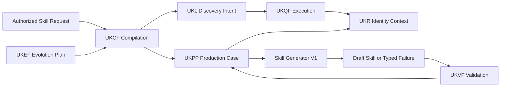
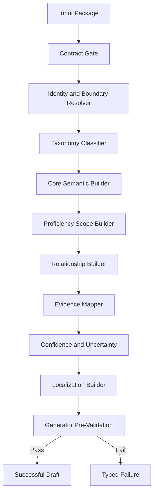
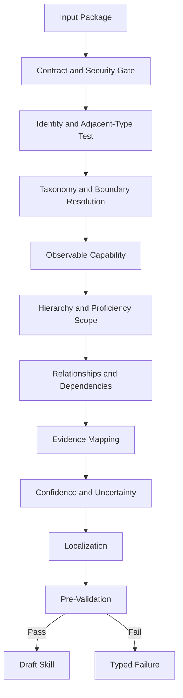
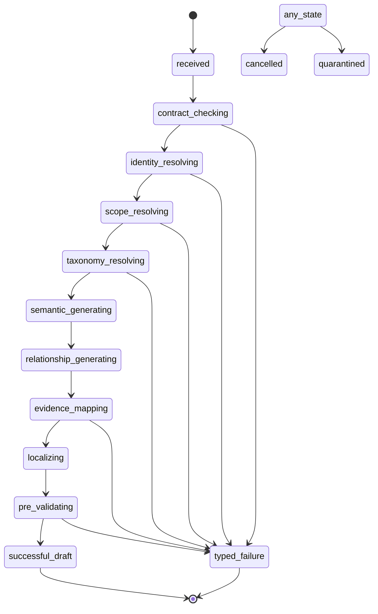
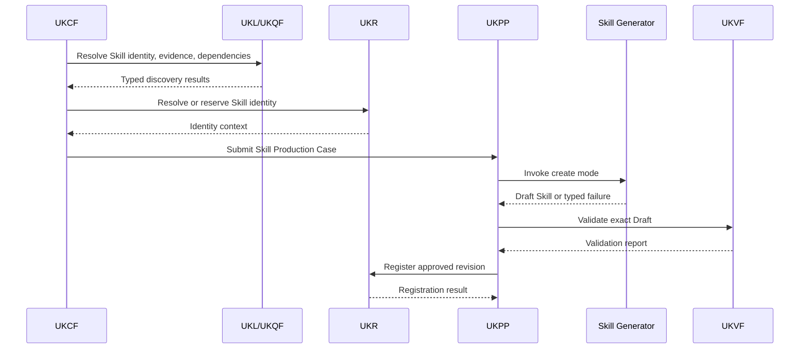
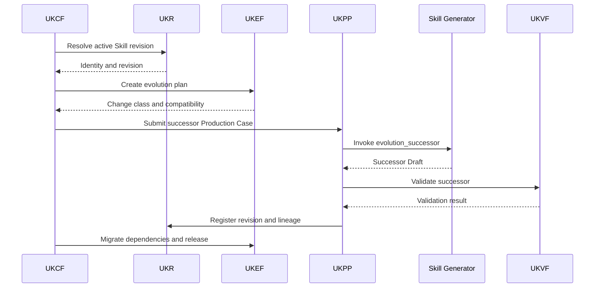
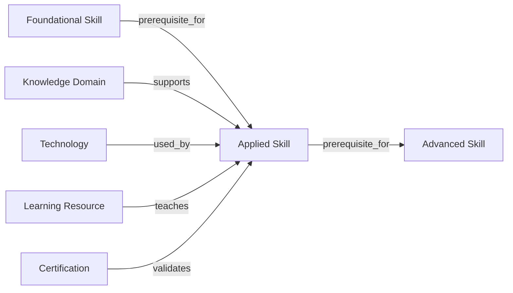
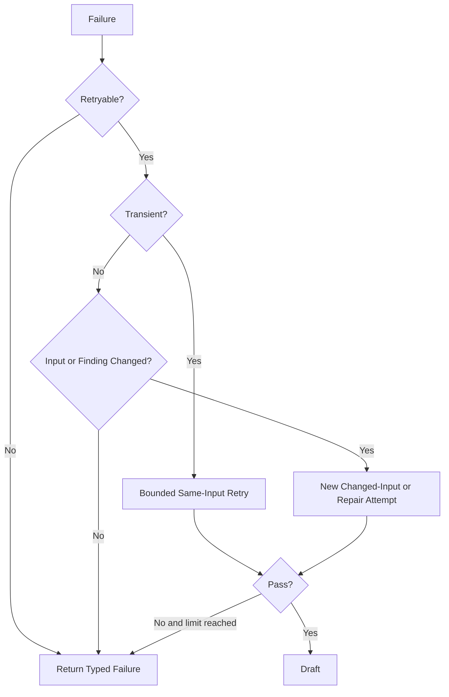

# Skill Generator V1

**Product:** KarirGPS  
**Document Type:** Production Entity Generator Specification  
**Generator Family:** Universal Entity Generator Framework implementation  
**Generator ID:** `generator:skill`  
**Entity Type:** Skill  
**Ontology Class:** `Skill`  
**Parent Class:** Ontology-defined capability entity  
**Object Kind:** Entity Object  
**Generator Version:** 1.0.0  
**Specification Major Version:** V1  
**Status:** Normative Production Baseline  
**Certification Target:** Production Certified  
**UEGF Baseline:** 1.0  
**Generator Development Standard:** 1.0.0  
**Target Path:** `assets/knowledge/generators/skill/Skill_Generator_V1.md`  
**Governance Owner:** Knowledge Generator Architecture  
**Domain Steward:** Skill and Capability Ontology Steward  

**Authoritative Dependencies**

- AI Constitution
- Career Knowledge Ontology
- Knowledge Object Specification
- Universal Entity Generator Framework
- Universal Knowledge Production Pipeline
- Universal Knowledge Validation Framework
- Universal Knowledge Registry Framework
- Universal Knowledge Language Framework
- Universal Knowledge Query Framework
- Universal Knowledge Evolution Framework
- Universal Knowledge Compilation Framework
- Generator Development Standard V1
- Career Generator V1 as the first implementation reference

---

## 0. Normative Status, Inheritance, and Generator Boundary

### 0.1 Status

Skill Generator V1, hereafter **Skill Generator**, is the production-ready UEGF-derived Entity Generator for the Ontology class `Skill`.

It defines only Skill-specific generation behavior.

It inherits all universal production, validation, Registry, query, evolution, compilation, audit, security, and engineering contracts from the authoritative documents listed above.

### 0.2 Authority Precedence

When requirements conflict, apply this order:

1. applicable law, privacy, safety, licensing, and binding rights restrictions;
2. AI Constitution;
3. Career Knowledge Ontology;
4. Knowledge Object Specification;
5. Universal Entity Generator Framework;
6. Universal Knowledge Production Pipeline;
7. Universal Knowledge Validation Framework;
8. Universal Knowledge Registry Framework;
9. Universal Knowledge Language Framework;
10. Universal Knowledge Query Framework;
11. Universal Knowledge Evolution Framework;
12. Universal Knowledge Compilation Framework;
13. Generator Development Standard V1;
14. Skill Generator V1;
15. approved Skill prompt asset;
16. execution-specific request.

Skill Generator may specialize inherited rules but MUST NOT weaken or replace them.

### 0.3 Normative Terms

- **MUST** indicates a mandatory requirement.
- **MUST NOT** indicates a prohibited condition.
- **SHOULD** indicates a requirement that may be waived only through governed justification.
- **MAY** indicates an allowed option.
- **CONDITIONAL** indicates a requirement activated by a defined condition.

### 0.4 Generator Authority

Skill Generator may:

- interpret an authorized Skill Generator Input Package;
- generate one Draft Skill Entity Object;
- generate proposed Skill relationships;
- map Skill claims to supplied Evidence IDs;
- identify unresolved taxonomy, identity, evidence, proficiency, and dependency issues;
- propose aliases and localized labels;
- produce a deterministic Generator Pre-Validation Report;
- emit one typed failure when a safe Draft cannot be produced.

Skill Generator may not:

- assign or approve canonical IDs;
- query a database, graph, vector store, or public network directly;
- create dependent Career, Technology, Tool, Certification, Learning Resource, Assessment, Task, or Knowledge Domain Objects;
- assess a person’s proficiency;
- define universal proficiency requirements for Careers;
- declare a Skill valid, registered, active, or published;
- merge or split identities;
- evolve a published Skill without a UKEF Evolution Plan;
- create a new Ontology category or predicate;
- infer employability, salary, personality, or career suitability;
- treat model memory as evidence.

### 0.5 Skill Generator Invariants

Every successful result MUST satisfy all of the following:

1. exactly one primary Skill semantic identity;
2. object kind is `entity_object`;
3. entity type is `Skill` or an Ontology-approved Skill subtype;
4. lifecycle state is `Draft`;
5. identity context is supplied by UKR through UKCF or UKPP;
6. the Skill is expressed as an observable capability;
7. the Skill is distinct from Tool, Technology, Knowledge Domain, Competency, Task, Certification, Assessment, personality trait, and user result;
8. the Skill boundary identifies what is included and excluded;
9. proficiency is contextual and does not claim one universal level;
10. all material claims map to supplied Evidence IDs;
11. all proposed relationships use Ontology-resolved predicates and target references;
12. unresolved target dependencies remain explicit;
13. hard, soft, foundational, transferable, domain-specific, emerging, and AI-era labels are applied only under defined classification rules;
14. emerging status and AI-era relevance are time- and context-sensitive where appropriate;
15. unknown information remains unknown;
16. no source, relationship, identifier, or fact is fabricated;
17. one invocation returns one successful Draft or one typed failure, never both;
18. no output claims UKVF approval, UKR registration, UKPP publication, or UKEF completion;
19. output structure is deterministic under the same contract and inputs;
20. the generation is auditable without exposing private chain of thought.

### 0.6 Entity Extension Pack Completeness

Skill Generator implements all mandatory UEGF Entity Extension Pack elements:

1. Entity Descriptor
2. Identity Rules
3. Adjacent Entity Matrix
4. Scope Rules
5. Stable Core Definition
6. Contextual Externalization Rules
7. Mandatory Domain Fields
8. Optional Domain Fields
9. Forbidden Intrinsic Fields
10. Evidence Categories
11. Source Preference Rules
12. Recency and Volatility Rules
13. Mandatory Relationships
14. Recommended Relationships
15. Forbidden Relationships
16. Domain Output Modules
17. Domain Validation Rules
18. Domain Confidence Rules
19. Domain Failure Types
20. Forbidden Behaviors
21. Quality Rules
22. Naming and Localization
23. Acceptance Delta
24. Future Compatibility
25. Governance Owner
26. Version and Change Record

---

# 1. Purpose

## 1.1 Primary Purpose

Skill Generator produces one structured Draft Skill Entity Object representing an observable capability to perform an activity or produce an outcome.

## 1.2 Production Purpose

It standardizes Skill generation across:

- single-object production;
- UKCF recursive compilation;
- Career-package production;
- evidence refresh;
- localization;
- repair;
- Draft revision;
- UKEF successor revision;
- distributed batch production.

## 1.3 Semantic Purpose

A generated Skill Object must answer:

- what capability the Skill represents;
- what observable behavior or output demonstrates it;
- what the Skill includes and excludes;
- how broad or granular it is;
- which category or categories apply;
- what proficiency dimensions are meaningful;
- which Skills are prerequisites, parents, children, or related capabilities;
- which Careers, Tasks, Technologies, Certifications, Learning Resources, Assessments, and Knowledge Domains relate to it;
- what evidence supports the Skill’s definition and relationships;
- whether lifecycle or AI-era relevance is contextual and time-sensitive.

## 1.4 Operational Purpose

The result must be directly consumable by:

- UKPP as a generated Draft artifact;
- UKVF as an exact revision validation candidate;
- UKR registration preparation;
- Knowledge Graph projection preparation;
- UKL and UKQF retrieval and traversal;
- UKEF successor-revision workflows;
- UKCF multi-object package orchestration.

---

# 2. Scope

## 2.1 In Scope

Skill Generator supports one canonical Skill concept that:

- represents an ability;
- can be observed through behavior, process, or output;
- can be learned, practiced, maintained, or assessed;
- has a defined semantic boundary;
- can participate in Skill, Career, Task, Technology, Certification, Learning Resource, and Assessment relationships.

## 2.2 Supported Skill Scope

Valid Skill scope includes:

- technical methods;
- software-mediated capabilities;
- analytical abilities;
- communication capabilities;
- interpersonal capabilities;
- self-management capabilities;
- planning and coordination capabilities;
- domain-specific applied capabilities;
- transferable capabilities;
- foundational capabilities;
- emerging capabilities;
- AI-era capabilities.

## 2.3 Conditional Scope

A successor Draft for an existing Skill requires:

- exact Entity ID;
- exact Object ID;
- base Revision ID;
- authorized Change Request;
- UKEF Evolution Plan when the base is Active or Published;
- intended semantic version;
- compatibility class;
- affected dependencies.

## 2.4 Out of Scope

Skill Generator MUST NOT generate:

- Knowledge Domain Objects;
- Tool Objects;
- Technology Objects;
- Competency Objects;
- Work Task Objects;
- Career Objects;
- Assessment Objects;
- Certification Objects;
- Learning Resource Objects;
- user Skill profiles;
- proficiency assessment results;
- job-specific requirement assertions;
- labor-market demand assertions;
- salary observations;
- personality traits;
- moral qualities;
- interests or preferences.

## 2.5 Scope Boundary Tests

A candidate is a Skill only when all are true:

1. it describes something a person or authorized agent can do;
2. the capability can be demonstrated or assessed;
3. the object is not merely a subject, product, tool, credential, task, or trait;
4. the boundary can be stated without depending on one specific Career;
5. the capability remains meaningful across at least one defined context.

---

# 3. Responsibilities

Skill Generator is responsible for:

1. validating the Skill-specific input contract;
2. interpreting UKR identity resolution;
3. applying Skill identity and boundary tests;
4. selecting Ontology-approved Skill classifications;
5. producing the mandatory Skill core fields;
6. defining observable capability;
7. defining proficiency scope without assessing a user;
8. identifying parent, child, prerequisite, and related Skill references;
9. proposing evidence-backed relationships;
10. separating stable core semantics from contextual assertions;
11. handling hard, soft, transferable, foundational, domain-specific, emerging, and AI-era classification;
12. mapping claims to Evidence IDs;
13. expressing conflict and uncertainty;
14. proposing aliases and localization entries;
15. generating a pre-validation report;
16. returning a typed Draft or typed failure;
17. producing complete audit metadata.

---

# 4. Non-Responsibilities

Skill Generator is not responsible for:

- deciding whether a person possesses the Skill;
- scoring proficiency;
- prescribing a universal proficiency level;
- deciding whether a Career requires the Skill;
- producing a Career recommendation;
- creating or modifying external entities;
- collecting evidence outside approved UKPP and UKQF workflows;
- defining a Skill taxonomy outside the Ontology;
- registering aliases or relationships;
- resolving a merge or split;
- validating or publishing the Draft;
- generating a learning curriculum;
- generating an Assessment instrument;
- predicting Skill demand;
- determining whether AI will replace the Skill;
- storing or indexing the object.

---

# 5. Supported Object Types and Generation Modes

## 5.1 Supported Object Type

Primary output:

- KOS `Entity Object`;
- Ontology class `Skill`;
- approved subtypes:
  - `Hard Skill`;
  - `Soft Skill`;
  - `Foundational Skill`;
  - future Ontology-approved Skill subtypes.

Skill Cluster and Competency are separate entities and MUST NOT be emitted as Skill subtypes unless the Ontology explicitly changes.

## 5.2 Supported Generation Modes

### `create`

Produces a new Draft Skill for a UKR-resolved or reserved identity.

### `revise`

Produces a successor Draft for a nonpublished Skill revision.

### `enrich`

Adds compatible evidence-backed semantics without altering identity.

### `localize`

Produces localized naming and definition modules bound to the same Skill identity.

### `evidence_refresh`

Refreshes evidence, confidence, source status, and affected claims.

### `repair`

Produces a corrected Draft within exact UKVF finding scope.

### `evolution_successor`

Produces a successor Draft under an approved UKEF Evolution Plan.

## 5.3 Unsupported Modes

- direct publish;
- direct register;
- merge;
- split;
- delete;
- user_assessment;
- recommendation;
- taxonomy_creation;
- unrestricted_free_generation.

## 5.4 Readiness Targets

A successful generator output may target:

- Draft readiness;
- UKVF submission readiness;
- human-review readiness;
- registration-preparation readiness.

It cannot claim registration or publication readiness as approved.

---

# 6. Architecture and Framework Bindings

## 6.1 Architecture Diagram



Skill Generator operates only inside the UKPP invocation boundary.

## 6.2 Internal Component Diagram



## 6.3 Framework Binding Matrix

| Concern | Authority | Skill Generator Role |
|---|---|---|
| Safety and dignity | AI Constitution | Apply prohibitions and safeguards |
| Skill semantics and predicates | Ontology | Resolve and obey |
| Object structure | KOS | Produce compliant Draft |
| Generator kernel | UEGF | Implement Skill Extension Pack |
| Production lifecycle | UKPP | Execute only as invoked |
| Validation | UKVF | Prepare and consume findings |
| Identity and registration | UKR | Use supplied identity context |
| Semantic intent | UKL | Consume compiler-produced discovery intent |
| Query execution | UKQF | Consume typed results only |
| Published evolution | UKEF | Produce successor only under plan |
| Compilation | UKCF | Consume compiled invocation plan |
| Engineering conventions | GDS V1 | Follow repository, schema, test, and certification rules |

## 6.4 UEGF Extension Pack Mapping

| Extension Point | Skill Generator Section |
|---|---|
| EP-01 Entity Descriptor | Sections 1, 2, 15 |
| EP-02 Identity Rules | Section 15 |
| EP-03 Scope Rules | Sections 2, 15, 17 |
| EP-04 Core Semantic Fields | Sections 10, 17–24 |
| EP-05 Evidence Rules | Section 27 |
| EP-06 Relationship Rules | Section 29 |
| EP-07 Output Contract | Section 10 |
| EP-08 Validation Rules | Section 31 |
| EP-09 Confidence Rules | Section 28 |
| EP-10 Forbidden Behaviors | Sections 4, 15, 40 |
| EP-11 Quality Rules | Section 38 |
| EP-12 Failure Rules | Sections 36–37 |
| EP-13 Naming and Localization | Sections 16, 34 |
| EP-14 Acceptance Delta | Sections 49–50 |
| EP-15 Future Compatibility | Section 35 |

---

# 7. Required Inputs

## 7.1 Mandatory Input Package

- Generator Request;
- Execution Context;
- Contract Lock;
- Identity Resolution;
- Skill Scope Resolution;
- Evidence Bundle;
- Existing Knowledge Package;
- Dependency Manifest;
- Prompt Binding;
- Security Context;
- Audit Context.

## 7.2 Generator Request

Required fields:

- request ID;
- Compilation ID;
- Production Case ID;
- generation mode;
- target label;
- proposed entity type;
- requested locale;
- desired readiness;
- request purpose.

## 7.3 Execution Context

- geography;
- jurisdiction;
- effective date;
- locale;
- audience;
- release context;
- access profile;
- deadline;
- batch context;
- recursion depth.

## 7.4 Contract Lock

- AI Constitution version;
- Ontology version;
- KOS version;
- UEGF version;
- UKPP version;
- UKVF version;
- UKR version;
- UKL version;
- UKQF version;
- UKEF version;
- UKCF version;
- GDS version;
- Skill Generator version;
- prompt versions;
- schema versions.

## 7.5 Identity Resolution

- identity disposition;
- Entity ID or reservation reference;
- Object ID when existing;
- base Revision ID when applicable;
- exact-match candidates;
- alias candidates;
- duplicate-risk findings;
- merge or split indicators;
- identity confidence.

## 7.6 Skill Scope Resolution

- capability phrase;
- included activities or outcomes;
- exclusions;
- proposed granularity;
- category candidates;
- adjacent entity candidates;
- context;
- requested subtype.

## 7.7 Evidence Bundle

Every evidence entry provides:

- Evidence ID;
- Source ID;
- claim scope;
- source location;
- source class;
- quality;
- independence group;
- date;
- valid period;
- rights status;
- extracted or normalized proposition.

## 7.8 Existing Knowledge Package

When applicable:

- active or base Skill revision;
- historical revisions;
- aliases;
- relationships;
- evidence lineage;
- validation findings;
- evolution constraints.

## 7.9 Dependency Manifest

May include references to:

- parent Skills;
- subskills;
- prerequisite Skills;
- related Skills;
- Careers;
- Work Tasks;
- Technologies;
- Tools;
- Certifications;
- Learning Resources;
- Assessments;
- Knowledge Domains;
- Projects;
- Standards.

## 7.10 Prompt Binding

- system prompt ID;
- invocation prompt ID;
- prompt versions;
- allowed variables;
- output schema;
- model lane;
- model restrictions.

## 7.11 Conditional Inputs

### Localization

- target locale;
- source locale;
- terminology authority;
- equivalence notes;
- human-review requirement.

### Evolution

- Evolution Case ID;
- change classification;
- identity decision;
- semantic version target;
- compatibility;
- effective time;
- dependency impact.

### Repair

- prior attempt;
- exact UKVF findings;
- allowed field scope;
- repair attempt number.

### Emerging or AI-Era Skill

- time-bounded evidence;
- technology or AI context references;
- lifecycle assertion references;
- review date.

---

# 8. Input Schema

## 8.1 Logical Input Schema

```yaml
schema_id: skill_generator_input_v1
generator:
  id: generator:skill
  version: 1.0.0
request:
  request_id: string
  compilation_id: string
  production_case_id: string
  mode: create | revise | enrich | localize | evidence_refresh | repair | evolution_successor
  purpose: string
  target_label: string
  requested_entity_type: Skill | HardSkill | SoftSkill | FoundationalSkill
  target_locale: bcp47
  desired_readiness: draft | ukvf_submission | human_review
context:
  geography_ref: optional_typed_reference
  jurisdiction_ref: optional_typed_reference
  effective_at: date_or_datetime
  audience_ref: optional_typed_reference
  security_profile: string
  recursion_depth: integer
contract_lock:
  constitution_version: string
  ontology_version: string
  kos_version: string
  uegf_version: string
  ukpp_version: string
  ukvf_version: string
  ukr_version: string
  ukl_version: string
  ukqf_version: string
  ukef_version: string
  ukcf_version: string
  gds_version: string
  generator_version: string
  input_schema_version: string
  output_schema_version: string
identity_resolution:
  disposition: exact_existing | reserved_new | ambiguous | merge_review | split_review | blocked
  entity_id: optional_reference
  reservation_ref: optional_reference
  object_id: optional_reference
  base_revision_id: optional_reference
  candidates: []
  confidence: confidence_level
scope_resolution:
  observable_capability_candidate: string
  included_scope: []
  excluded_scope: []
  granularity: atomic | composite | broad
  category_candidates: []
  adjacent_entity_candidates: []
evidence_bundle:
  evidence_entries: []
existing_knowledge:
  base_object: optional_reference
  base_revision: optional_payload_reference
  relationships: []
  validation_findings: []
dependency_manifest:
  mandatory: []
  optional: []
  unresolved: []
prompt_binding:
  system_prompt_id: string
  invocation_prompt_id: string
  output_schema_id: string
  model_lane: string
evolution_plan:
  evolution_case_id: optional_reference
  change_class: optional_string
  target_version: optional_semver
repair_context:
  prior_attempt_id: optional_string
  finding_refs: []
  allowed_fields: []
audit:
  actor_ref: typed_reference
  correlation_id: string
  causation_id: optional_string
```

## 8.2 Input Gate

The input gate MUST reject:

- missing contract versions;
- unsupported generation mode;
- wrong entity type;
- ambiguous identity without authorized ambiguity handling;
- Published-base revision without UKEF plan;
- missing prompt binding;
- missing evidence for material generation;
- unresolved security context;
- repair request without exact findings;
- unsupported subtype;
- recursion depth above UKCF profile.

---

# 9. Required Outputs

## 9.1 Allowed Outcomes

Exactly one:

- `successful_draft`;
- `typed_failure`.

## 9.2 Successful Output

A successful result contains:

- generator metadata;
- target identity context;
- Draft Skill payload;
- evidence manifest;
- relationship manifest;
- dependency manifest;
- confidence and uncertainty summary;
- Generator Pre-Validation Report;
- audit metadata.

## 9.3 Typed Failure

A failure contains:

- stable Skill error code;
- failure category;
- severity;
- affected fields;
- retryability;
- remediation;
- evidence or dependency context;
- audit metadata.

## 9.4 Output Prohibitions

The output MUST NOT contain:

- approved canonical ID creation;
- UKVF `passed` claim;
- UKR `registered` claim;
- UKPP `published` claim;
- user proficiency;
- career recommendation;
- hidden dependent object payloads;
- unsupported source citation;
- undocumented fields.

---

# 10. Output Schema and Canonical Skill Contract

## 10.1 Output Envelope

```yaml
schema_id: skill_generator_output_v1
outcome: successful_draft
generator:
  id: generator:skill
  version: 1.0.0
  system_prompt_id: prompt:skill:system:1.0.0
  invocation_prompt_id: prompt:skill:create:1.0.0
  model_lane: qualified_lane_reference
target:
  object_kind: entity_object
  entity_type: Skill
  ontology_class_ref: ontology:Skill
  entity_id: resolved_or_reserved_reference
  object_id: optional_existing_reference
  base_revision_id: optional_reference
draft:
  lifecycle_state: Draft
  semantic_version: 1.0.0
  contract_and_identity: {}
  naming_and_localization: {}
  definition_and_scope: {}
  skill_core: {}
  taxonomy_and_hierarchy: {}
  proficiency_and_verification: {}
  lifecycle_and_context: {}
  relationships: []
  evidence_and_sources: {}
  confidence_conflict_uncertainty: {}
  governance_quality_readiness: {}
  generation_audit: {}
evidence_manifest: []
relationship_manifest: []
dependency_manifest: []
pre_validation:
  status: pass | pass_with_warnings
  findings: []
audit:
  input_fingerprint: string
  output_fingerprint: string
  generated_at: datetime
```

## 10.2 Canonical Section Order

The Skill Draft preserves the UEGF Universal Output Spine:

1. Contract and Identity
2. Naming and Localization
3. Definition and Scope
4. Skill Core Semantics
5. Taxonomy and Classification
6. Hierarchy and Granularity
7. Observable Capability
8. Proficiency and Verification
9. Transferability and Domain Context
10. Lifecycle and Emerging Context
11. AI-Era Context
12. Relationships
13. Dependencies and Prerequisites
14. Evidence and Sources
15. Confidence, Conflict, and Uncertainty
16. Governance and Lifecycle
17. Quality and Readiness
18. Generation and Audit Record

## 10.3 Zone A — Contract and Identity

Mandatory:

- schema version;
- Ontology version;
- KOS version;
- entity type;
- object kind;
- Entity ID or reservation;
- Object ID when applicable;
- base Revision ID when applicable;
- Draft lifecycle state;
- semantic version;
- generation mode.

## 10.4 Zone B — Naming and Localization

Mandatory:

- canonical name;
- canonical locale;
- display name;
- alias list;
- localization status;
- name disambiguation note.

## 10.5 Definition and Scope

Mandatory:

- concise definition;
- observable capability;
- included scope;
- excluded scope;
- Skill boundary;
- granularity;
- adjacent-entity distinctions.

## 10.6 Skill Core Semantics

Mandatory:

- Skill category references;
- capability object;
- expected outcomes;
- application context;
- proficiency scope;
- verification methods;
- transferability classification;
- stability profile.

## 10.7 Taxonomy and Hierarchy

Conditional:

- parent Skill reference;
- subskill references;
- broader/narrower mappings;
- taxonomy mappings;
- subtype classification;
- classification rationale.

## 10.8 Proficiency and Verification

Mandatory:

- proficiency dimensions;
- framework references when available;
- observable performance descriptors;
- verification modes;
- context limitations;
- prohibition on user assessment.

## 10.9 Lifecycle and Context

Conditional:

- lifecycle status assertion references;
- emerging status;
- decay or obsolescence characteristics;
- review date;
- technology dependency;
- time scope.

## 10.10 Relationship Module

Proposed relationships only, with:

- predicate;
- target reference;
- direction;
- strength or requirement level when applicable;
- context;
- evidence;
- confidence;
- status.

## 10.11 Evidence and Sources

- Claim-to-Evidence map;
- Source references;
- source quality;
- independence;
- recency;
- rights;
- conflicts.

## 10.12 Confidence and Uncertainty

- identity confidence;
- boundary confidence;
- taxonomy confidence;
- evidence confidence;
- relationship confidence;
- lifecycle confidence;
- object confidence;
- conflicts;
- unknowns;
- assumptions.

## 10.13 Governance and Readiness

- generator pre-validation;
- unresolved dependencies;
- UKVF profiles;
- human-review triggers;
- readiness limitations.

## 10.14 Generation and Audit

- request and case IDs;
- prompt IDs;
- model lane;
- evidence manifest fingerprint;
- dependency fingerprint;
- input/output fingerprints;
- timestamps;
- correlation and causation.

---

# 11. Generation Pipeline

## 11.1 Canonical Steps

1. Validate input envelope.
2. Verify contract lock.
3. Verify authorization and security context.
4. Interpret UKR identity disposition.
5. Apply Skill identity test.
6. Apply adjacent-entity exclusions.
7. Resolve taxonomy and subtype.
8. Define observable capability and boundary.
9. Build core Skill semantics.
10. Build hierarchy and granularity.
11. Build contextual proficiency scope.
12. Build transferability and domain context.
13. Build lifecycle and AI-era context.
14. Propose relationships.
15. Map every material claim to evidence.
16. Calculate scoped confidence.
17. Generate localization modules.
18. Run generator pre-validation.
19. Emit successful Draft or typed failure.

## 11.2 Pipeline Flowchart



## 11.3 Evidence-First Rule

The generator MUST build claims from supplied evidence propositions.

It MUST NOT write a polished definition first and search for evidence afterward.

## 11.4 Capability-First Rule

The canonical semantic center is the observable capability, not the name.

## 11.5 Stable-Core Rule

Volatile demand, popularity, market value, AI displacement, salary, and job requirement data are externalized as contextual objects or relationships.

---

# 12. Generator State Machine

## 12.1 States

- `received`;
- `contract_checking`;
- `identity_resolving`;
- `scope_resolving`;
- `taxonomy_resolving`;
- `semantic_generating`;
- `relationship_generating`;
- `evidence_mapping`;
- `localizing`;
- `pre_validating`;
- `successful_draft`;
- `typed_failure`;
- `cancelled`;
- `quarantined`.

## 12.2 State Diagram



## 12.3 Terminal Outcomes

Only:

- successful Draft;
- typed failure;
- cancelled;
- quarantined.

---

# 13. Sequence Diagrams

## 13.1 New Skill Generation



## 13.2 Published Skill Successor



---

# 14. Prompt Templates

## 14.1 Prompt Asset Contract

Required prompt assets:

- `prompt:skill:system:1.0.0`;
- `prompt:skill:create:1.0.0`;
- `prompt:skill:revise:1.0.0`;
- `prompt:skill:enrich:1.0.0`;
- `prompt:skill:localize:1.0.0`;
- `prompt:skill:evidence_refresh:1.0.0`;
- `prompt:skill:repair:1.0.0`;
- `prompt:skill:evolution_successor:1.0.0`.

## 14.2 Normative System Template

```text
You are Skill Generator V1 for KarirGPS.

Generate exactly one Draft Skill Entity Object or one typed failure.

You MUST obey the supplied contract lock, identity resolution, Ontology terms,
KOS schema, evidence bundle, dependency manifest, and generation mode.

A Skill is an observable capability to perform an activity or produce an outcome.

Do not confuse the Skill with:
- a Tool or Technology;
- a Knowledge Domain or subject;
- a Competency;
- a Work Task;
- a Certification or Assessment;
- a personality trait;
- a user proficiency result.

Do not create canonical IDs.
Do not create dependent objects.
Do not retrieve external data.
Do not fabricate evidence, relationships, or aliases.
Do not claim validation, registration, or publication.
Do not expose private chain of thought.

All material claims must reference supplied Evidence IDs.
All relationships must use supplied Ontology predicates and target references.
Proficiency must be contextual.
Emerging and AI-era labels require time-scoped evidence.

Return only the declared output schema.
```

## 14.3 Create Template

```text
MODE: create

GENERATOR_REQUEST:
{{generator_request}}

CONTRACT_LOCK:
{{contract_lock}}

IDENTITY_RESOLUTION:
{{identity_resolution}}

SKILL_SCOPE:
{{scope_resolution}}

EVIDENCE_BUNDLE:
{{evidence_bundle}}

DEPENDENCY_MANIFEST:
{{dependency_manifest}}

TASK:
Produce one Draft Skill Object.
Apply identity, taxonomy, boundary, proficiency, evidence, relationship,
localization, confidence, and pre-validation rules.
If any non-waivable condition fails, return a typed failure.
```

## 14.4 Revise Template

```text
MODE: revise

BASE_OBJECT:
{{base_object}}

AUTHORIZED_CHANGE_REQUEST:
{{change_request}}

VALIDATION_CONTEXT:
{{validation_context}}

Update only authorized fields.
Preserve Entity ID and Object ID.
Create successor Draft semantics.
Do not alter published knowledge without an Evolution Plan.
```

## 14.5 Enrich Template

```text
MODE: enrich

BASE_OBJECT:
{{base_object}}

NEW_EVIDENCE:
{{evidence_bundle}}

ENRICHMENT_SCOPE:
{{allowed_fields}}

Add only backward-compatible, evidence-supported semantics.
Do not broaden the Skill identity silently.
```

## 14.6 Localize Template

```text
MODE: localize

SOURCE_SKILL:
{{source_skill}}

TARGET_LOCALE:
{{target_locale}}

TERMINOLOGY_AUTHORITY:
{{terminology_authority}}

Generate localized labels, aliases, definition, and disambiguation.
Preserve the same Skill identity.
Flag non-equivalent terminology for human review.
```

## 14.7 Evidence Refresh Template

```text
MODE: evidence_refresh

BASE_OBJECT:
{{base_object}}

CURRENT_EVIDENCE:
{{current_evidence}}

NEW_EVIDENCE:
{{new_evidence}}

Recalculate evidence coverage, source status, confidence, conflict,
and affected claims. Do not change unsupported semantic fields.
```

## 14.8 Repair Template

```text
MODE: repair

PRIOR_ATTEMPT:
{{prior_attempt}}

UKVF_FINDINGS:
{{finding_refs}}

ALLOWED_REPAIR_SCOPE:
{{allowed_fields}}

Repair only the cited findings.
Preserve unaffected content and identity.
Return a typed failure if repair requires a broader semantic change.
```

## 14.9 Evolution Successor Template

```text
MODE: evolution_successor

BASE_REVISION:
{{base_revision}}

UKEF_EVOLUTION_PLAN:
{{evolution_plan}}

DEPENDENCY_IMPACT:
{{dependency_impact}}

Produce one successor Draft within the approved change classification,
identity decision, target semantic version, effective time, and compatibility.
Do not execute merge, split, registration, migration, or release.
```

---

# 15. Skill Identity and Scope Rules

## 15.1 Positive Identity Test

A Skill identity is valid when:

- it represents one coherent capability;
- it has observable behavior, process, or output;
- it can be learned or developed;
- it has a stable semantic core;
- it can be distinguished from adjacent entities;
- aliases point to the same capability.

## 15.2 Adjacent Entity Matrix

| Candidate | Skill? | Rule |
|---|---:|---|
| “Python programming” | Yes | Capability to create or modify software using Python |
| “Python” | Not sufficient | May be Technology, language, or shorthand requiring disambiguation |
| “Critical thinking” | Yes | Must be operationalized through observable analysis and judgment |
| “Machine learning” | Ambiguous | Skill when framed as building/evaluating ML systems; Knowledge Domain otherwise |
| “Project management” | Yes or Competency | Skill only when capability boundary is explicit |
| “Microsoft Project” | No | Tool |
| “Communication” | Too broad | Requires capability boundary or subskills |
| “Extroversion” | No | Personality trait |
| “PMP” | No | Certification |
| “Present quarterly results” | No | Work Task |
| “Data literacy” | Yes | Foundational capability when cross-domain rationale exists |
| “Leadership competency” | Usually Competency | Composite performance construct |

## 15.3 Capability Phrase Rule

Canonical Skill naming SHOULD use a noun phrase describing the capability.

Where the common label is ambiguous, definition and alias metadata must disambiguate.

## 15.4 Granularity

### Atomic

One tightly bounded capability.

### Composite

A coherent combination of subskills that users commonly treat as one Skill.

### Broad

A high-level capability requiring subskills for precise reasoning.

Broad Skills MUST identify subskills when used for recommendation, gap analysis, or assessment.

## 15.5 Scope Inflation Control

Do not combine unrelated capabilities because they share a Career or Tool.

## 15.6 Scope Fragmentation Control

Do not create separate Skill identities for trivial wording, locale, tool version, or proficiency level differences.

## 15.7 Concept-Instance Boundary

A Skill is normally a concept, not one person’s instance or one training provider’s proprietary implementation.

## 15.8 Identity Confidence Factors

- capability equivalence;
- observable outcome equivalence;
- same inclusion and exclusion;
- same hierarchy position;
- same target relationships;
- alias authority;
- external taxonomy mapping;
- evidence agreement.

---

# 16. Naming and Localization Strategy

## 16.1 Canonical Name

The canonical name must:

- be concise;
- identify the capability;
- avoid marketing language;
- avoid provider names unless essential;
- avoid proficiency suffixes;
- avoid Career-specific wording when the Skill is transferable.

## 16.2 Capability-Oriented Naming

Preferred:

- Python Programming
- Financial Analysis
- Public Speaking
- Construction Scheduling

Avoid:

- Python Expert
- Great Communicator
- Certified Financial Analyst Skill
- Senior Project Management

## 16.3 Alias Types

- exact alias;
- abbreviation;
- historical label;
- common shorthand;
- localized label;
- taxonomy label;
- deprecated label;
- close but nonexact term.

Only exact aliases may resolve automatically.

## 16.4 Localization

Localization may adapt:

- name;
- definition;
- examples;
- behavioral manifestation;
- disambiguation;
- verification terminology.

It must preserve the same observable capability.

## 16.5 Cultural Context

Soft Skill manifestations may vary by culture and work context.

Localization cannot turn one cultural behavior into a universal requirement.

## 16.6 Non-Equivalent Translation

When no exact equivalent exists:

- retain canonical source reference;
- use explanatory localized label;
- mark equivalence status;
- require human review.

---

# 17. Skill Core Generation Rules

## 17.1 Mandatory Domain Fields

- `observable_capability`;
- `skill_category`;
- `proficiency_scope`;
- `skill_boundary`.

## 17.2 Optional Domain Fields

- parent Skill;
- subskills;
- transferability;
- learning difficulty;
- decay characteristics;
- verification methods;
- related Tasks;
- related Careers;
- related Technologies and Tools;
- emerging status;
- AI-era context.

## 17.3 Forbidden Intrinsic Fields

- user proficiency;
- universal Career requirement;
- timeless market demand;
- salary premium;
- personality fit;
- guaranteed outcome;
- Tool identity;
- Certification identity;
- provider-specific course outcome as universal truth.

## 17.4 Observable Capability

Must identify:

- action;
- object or problem;
- expected output or behavioral result;
- relevant context;
- quality dimension where evidence supports it.

## 17.5 Expected Outcomes

Outcomes describe what competent application can produce.

They do not guarantee performance by any individual.

## 17.6 Skill Boundary

Must explicitly state:

- included capability;
- excluded adjacent capability;
- Tool or Technology dependence;
- Knowledge Domain dependence;
- context limitations.

---

# 18. Skill Taxonomy and Classification

## 18.1 Multi-Axis Classification

Skill classification uses separate axes where the Ontology supports them:

1. capability form;
2. transfer scope;
3. domain scope;
4. lifecycle status;
5. AI-era relevance;
6. granularity.

A Skill may legitimately be technical and transferable, or soft and domain-specific.

The generator MUST NOT force all concepts into one mutually exclusive list unless the Ontology defines it.

## 18.2 Hard Skills

A Hard Skill:

- is technical, methodological, or domain-specific;
- has an observable activity;
- has one or more verification modes;
- may depend on Tools, Technologies, standards, or Knowledge Domains.

“Hard” does not mean more important.

## 18.3 Soft Skills

A Soft Skill:

- is interpersonal, intrapersonal, communication, leadership, collaboration, or self-management capability;
- must have observable behavioral manifestations;
- must state context variability;
- must not be a personality trait or moral judgment.

## 18.4 Transferable Skills

A Transferable Skill:

- applies across multiple Careers, Industries, or domains;
- retains a stable capability core;
- may have context-specific manifestations;
- requires evidence of cross-context use.

Transferability is not the same as universal proficiency or universal requirement.

## 18.5 Domain-Specific Skills

A Domain-Specific Skill:

- depends on a defined Knowledge Domain, regulatory context, method, or application area;
- must identify the domain boundary;
- may still be transferable within related domains.

## 18.6 Foundational Skills

A Foundational Skill:

- supports multiple higher-order Skills or domains;
- requires a cross-domain rationale;
- may be a prerequisite;
- does not imply one universal required level.

## 18.7 Emerging Skills

An Emerging Skill:

- has growing or newly formalized use;
- requires time-bounded evidence;
- uses a review date;
- remains the same identity only while the capability boundary stays stable.

“Emerging” is usually a contextual lifecycle assertion, not permanent intrinsic identity.

## 18.8 AI-Era Skills

An AI-era Skill may include:

- using AI systems effectively;
- evaluating AI outputs;
- supervising human–AI workflows;
- designing prompts or instructions;
- AI governance and risk handling;
- validating AI-generated artifacts;
- maintaining nonautomated judgment where relevant.

The label requires explicit AI or Technology context and cannot imply permanent future demand.

## 18.9 Mixed Classification

When Hard/Soft distinction is insufficient, use:

- primary classification;
- secondary classification;
- rationale;
- confidence.

Do not invent `mixed_skill` unless registered in the Ontology.

## 18.10 Taxonomy Mapping

External taxonomy terms use registered mappings:

- exact;
- broader;
- narrower;
- related;
- split;
- merged;
- no mapping.

External taxonomy codes do not replace the UKR Entity ID.

---

# 19. Skill Hierarchy and Granularity

## 19.1 Parent–Child Rule

Parent and child Skills require:

- `broader_skill` or Ontology-approved predicate;
- noncircular hierarchy;
- semantic inclusion;
- evidence or authoritative taxonomy;
- explicit granularity.

## 19.2 Broad Skill Rule

A broad Skill used for precise reasoning must identify relevant subskills.

Example:

`Project Management` may include planning, risk management, stakeholder coordination, and monitoring, but it is not automatically identical to a Competency.

## 19.3 Subskill Rule

A subskill must:

- represent a distinct observable capability;
- be meaningfully narrower;
- not be merely a proficiency level;
- not be only a Tool-specific synonym.

## 19.4 Polyhierarchy

A Skill may have multiple parents when Ontology and evidence permit.

The generator records all parent contexts rather than selecting one arbitrarily.

## 19.5 Cycle Prevention

A proposed Skill hierarchy must not contain:

- self-parent;
- direct cycle;
- indirect cycle;
- broader/narrower contradiction.

## 19.6 Cluster Boundary

A Skill Cluster groups Skills.

It is not a parent Skill unless the Ontology explicitly represents it as such.

---

# 20. Skill Proficiency Levels

## 20.1 Proficiency Principle

Proficiency is contextual.

Skill Generator defines proficiency scope and performance dimensions, not a universal person score.

## 20.2 Proficiency Framework Reference

Where available, reference:

- external standard;
- occupational framework;
- professional body;
- educational framework;
- Assessment framework.

Do not copy an external level framework as intrinsic universal truth.

## 20.3 Generic Proficiency Dimensions

A Skill may describe dimensions such as:

- task complexity;
- autonomy;
- accuracy;
- consistency;
- transfer to novel contexts;
- speed under relevant constraints;
- ability to diagnose errors;
- ability to explain or teach;
- risk and impact.

## 20.4 Observable Level Descriptor

A descriptor must state observable performance.

Avoid labels such as beginner, intermediate, expert without criteria.

## 20.5 Proficiency Levels as References

When a registered proficiency framework exists, use references.

When no framework exists, the generator may propose contextual dimensions but MUST NOT invent a canonical universal scale.

## 20.6 User Proficiency Prohibition

User Skill level belongs to Assessment, Profile, or result objects.

It is never stored as a Skill Entity attribute.

## 20.7 Career Requirement Prohibition

Required proficiency for a Career is a contextual relationship or assertion, not intrinsic to the Skill.

---

# 21. Skill Dependencies and Prerequisites

## 21.1 Dependency Principle

A dependency is a production or semantic dependency.

A prerequisite relationship is a domain claim between Skills.

They are not interchangeable.

## 21.2 Prerequisite Relationship

A Skill A is a prerequisite for Skill B when A materially enables learning or performance of B.

## 21.3 Prerequisite Strength

- mandatory;
- commonly_required;
- beneficial;
- context_specific.

Strength requires evidence and context.

## 21.4 No Universal Prerequisite

A prerequisite cannot be universalized when alternative learning paths exist.

## 21.5 Dependency Graph



## 21.6 Missing Mandatory Dependency

If a mandatory target reference is unresolved:

- return typed failure; or
- emit a permitted provisional reference and block registration preparation.

The generator does not recursively generate it.

## 21.7 Circular Prerequisites

Circular prerequisite claims are blockers unless they represent a registered co-development model and use a different predicate.

---

# 22. Skill Lifecycle

## 22.1 Skill Entity Lifecycle

The KOS lifecycle remains authoritative.

Skill-specific lifecycle context may include:

- established;
- emerging;
- changing;
- declining use;
- deprecated term;
- superseded capability boundary.

These are contextual or evolution attributes, not replacements for KOS states.

## 22.2 Stability Profile

Classify Skill semantics as:

- stable;
- moderately evolving;
- rapidly evolving;
- version-sensitive.

## 22.3 Decay Characteristics

A Skill may have evidence-supported decay or maintenance needs.

Do not make universal claims about individual retention.

## 22.4 Tool and Technology Change

A Tool or Technology version change does not automatically create a new Skill identity.

Create a new Skill identity only when the observable capability boundary materially changes.

## 22.5 Emerging Review

Emerging and AI-era Skills require:

- `as_of` date;
- evidence recency;
- review_due date;
- affected Technology references;
- uncertainty.

## 22.6 Deprecation

A Skill may be deprecated when:

- the term is obsolete;
- identity was incorrectly scoped;
- a replacement capability is preferred;
- evidence no longer supports current use.

Deprecation is executed through UKEF and UKR, not by the generator alone.

---

# 23. Transferability and Domain Context

## 23.1 Transferability Levels

Where the Ontology or profile permits:

- broad_cross_domain;
- multi_domain;
- domain_limited;
- context_specific.

These are evidence-supported classifications, not quality judgments.

## 23.2 Transferability Evidence

Evidence may include:

- multiple Career relationships;
- multiple Task contexts;
- authoritative competency frameworks;
- cross-industry studies;
- educational frameworks.

## 23.3 Domain-Specific Context

A domain-specific Skill identifies:

- Knowledge Domain reference;
- applicable standards;
- regulatory context;
- specialized methods;
- target outcomes.

## 23.4 Context Adaptation

The stable Skill can have different manifestations across contexts.

Those manifestations should use contextual relationships or assertions rather than create duplicate Skill identities.

---

# 24. AI-Era Skill Rules

## 24.1 AI-Era Classification

A Skill may be AI-era relevant when its capability materially involves or responds to AI systems.

## 24.2 Categories of AI Context

- AI operation;
- AI interaction;
- AI evaluation;
- AI development;
- AI governance;
- AI-assisted domain work;
- human oversight;
- resilience to automation changes.

These labels require Ontology or extension support before being emitted as controlled values.

## 24.3 Prompt Engineering Boundary

Prompt Engineering is a Skill when defined as the capability to design, test, evaluate, and iteratively improve instructions and context for AI systems to achieve specified outcomes.

It is not:

- a Tool;
- a single prompt;
- generic communication;
- a guarantee of model accuracy.

## 24.4 Machine Learning Boundary

Machine Learning may refer to:

- Knowledge Domain;
- Technology family;
- Skill of developing/evaluating ML systems.

The generator must choose one capability-centered identity and record adjacent references.

## 24.5 AI Obsolescence Prohibition

The generator MUST NOT declare that a Skill will be obsolete or essential without contextual evidence and a time horizon.

## 24.6 Human–AI Complementarity

Claims about complementarity must identify:

- affected task;
- AI context;
- human responsibility;
- evidence;
- effective period.

---

# 25. Relationships with Careers, Technologies, Certifications, and Learning Resources

## 25.1 Career Relationships

Allowed examples:

- `required_by` Career;
- `commonly_used_by` Career;
- `transferable_to` Career;
- `supports` Career.

The generator does not determine one universal requirement level.

## 25.2 Technology Relationships

Allowed examples:

- `uses` Technology;
- `enabled_by` Technology;
- `applies_to` Technology;
- `version_sensitive_to` Technology.

A Technology is not embedded in the Skill.

## 25.3 Tool Relationships

Tool relationships identify instruments used to perform the Skill.

Tool proficiency may be a separate Skill when the observable capability warrants it.

## 25.4 Certification Relationships

Allowed:

- `validated_by` Certification;
- `assessed_by` Certification exam or Assessment where registered.

Certification ownership does not prove proficiency by itself.

## 25.5 Learning Resource Relationships

Allowed:

- `taught_by` Learning Resource;
- `developed_by` Learning Resource;
- `practiced_through` Learning Resource.

The relationship requires coverage evidence and context.

## 25.6 Assessment Relationships

Allowed:

- `assessed_by` Assessment;
- `demonstrated_by` Project or evidence artifact.

## 25.7 Task Relationships

Allowed:

- `used_in` Work Task;
- `demonstrated_in` Work Task.

Task identity remains separate.

---

# 26. Contextual Knowledge Externalization

## 26.1 Must Be Externalized

The Skill object must reference rather than embed:

- current job-demand data;
- current salary premium;
- current vacancy counts;
- future-demand forecast;
- AI displacement forecast;
- geography-specific requirement level;
- Career-specific proficiency requirement;
- current certification availability;
- current Learning Resource price;
- current Tool version support.

## 26.2 Contextual Assertion Reference

```yaml
assertion_ref: assertion:skill_demand:example
subject_ref: entity:skill:example
predicate: demand_level
context:
  geography_ref: geography:country:ID
  valid_period:
    from: 2026-01-01
    to: 2026-12-31
evidence_refs:
  - evidence:example
```

## 26.3 No Value Copying

The Skill Draft may summarize the existence of contextual relationships but must not copy volatile values into the stable core.

---

# 27. Evidence Requirements

## 27.1 Material Claim Categories

Evidence is required for:

- definition and observable capability;
- category and subtype;
- parent and subskill relationships;
- prerequisite relationships;
- transferability;
- domain-specific scope;
- verification methods;
- Career relationships;
- Technology and Tool relationships;
- Certification relationships;
- Learning Resource relationships;
- emerging or AI-era status;
- lifecycle or obsolescence claims;
- external taxonomy mappings.

## 27.2 Source Preference

Preferred order:

1. authoritative standards or official frameworks;
2. professional or regulatory bodies;
3. official technical documentation;
4. peer-reviewed research;
5. established occupational taxonomies;
6. high-quality educational or assessment frameworks;
7. reputable industry research;
8. secondary sources for discovery only unless independently verified.

## 27.3 Evidence Threshold

At minimum:

- one authoritative or high-quality source for core identity and definition;
- two independent sources for broad transferability, emerging status, or disputed boundary claims where feasible;
- official source for Certification, Tool, Technology, or external taxonomy mappings;
- version-specific evidence for AI and Technology-dependent claims.

## 27.4 Claim–Source Fit

A source about a Career does not automatically prove a universal Skill definition.

A course page does not establish a universal Skill taxonomy.

## 27.5 Recency

- stable foundational definitions: review based on authority changes;
- technical Skills: review when Technology or standards change;
- emerging and AI-era Skills: time-bounded review;
- soft Skills: cultural and context review;
- regulated Skills: jurisdiction and effective-date review.

## 27.6 Conflict

Conflicting evidence must produce:

- competing propositions;
- source quality comparison;
- scoped confidence;
- human-review trigger when material.

## 27.7 Missing Evidence Vocabulary

- `unknown`;
- `insufficient_evidence`;
- `not_applicable`;
- `disputed`;
- `not_yet_registered`;
- `context_required`.

## 27.8 Rights

All evidence must have permitted usage and citation status.

---

# 28. Claim, Confidence, Conflict, and Uncertainty Rules

## 28.1 Claim Classes

- stable intrinsic;
- contextual;
- taxonomic;
- relationship;
- temporal;
- emerging;
- AI-era;
- disputed;
- inferred proposal.

## 28.2 Confidence Dimensions

- identity;
- capability boundary;
- taxonomy;
- hierarchy;
- proficiency scope;
- evidence;
- relationship;
- lifecycle;
- localization;
- object-level.

## 28.3 Confidence Levels

Use the registered UEGF vocabulary.

No custom numeric confidence scale may be invented by the generator.

## 28.4 Confidence Ceiling

Object confidence cannot exceed the weakest critical dimension:

- identity;
- boundary;
- evidence;
- mandatory relationship integrity.

## 28.5 Conflict Adjustment

Material unresolved conflict lowers confidence and may block readiness.

## 28.6 Assumptions

Assumptions must be:

- explicit;
- noncanonical;
- scoped;
- excluded from stable facts;
- reviewed.

## 28.7 Forbidden Interpretations

Confidence is not:

- user proficiency;
- popularity;
- importance;
- employability;
- validation outcome;
- probability of career success.

---

# 29. Relationship Generation

## 29.1 Mandatory Relationship Classes

When applicable and resolvable:

- parent or broader Skill;
- subskill or narrower Skill;
- prerequisite Skill;
- related Skill;
- Knowledge Domain;
- Work Task.

A Skill may validly have no parent if it is a top-level capability.

## 29.2 Recommended Relationship Classes

- Career;
- Technology;
- Tool;
- Certification;
- Learning Resource;
- Assessment;
- Project;
- Major;
- Competency;
- Industry context.

## 29.3 Relationship Entry Schema

```yaml
relationship_id: null
predicate_ref: ontology:prerequisite_for
source_ref:
  entity_id: entity:skill:example_source
target_ref:
  entity_id: entity:skill:example_target
direction: outgoing
status: proposed
strength: commonly_required
requirement_level: contextual
context:
  geography_ref: null
  valid_from: 2026-01-01
  valid_to: null
evidence_refs:
  - evidence:example
confidence: medium_high
generator_notes:
  unresolved_constraints: []
```

## 29.4 Predicate Discipline

The generator MUST resolve exact predicate IDs through the supplied Ontology contract.

Labels in examples are conceptual and cannot substitute for registered IDs.

## 29.5 Forbidden Relationships

- Skill `is_a` Tool;
- Skill `is_a` Certification;
- Skill `is_a` Career;
- personality trait `is_a` Soft Skill;
- course completion `proves` Skill universally;
- Skill `requires` one Career;
- Skill `guarantees` employment;
- circular prerequisite;
- unsupported exact equivalence.

## 29.6 Relationship Evidence

Every material relationship must have Evidence IDs or a registered authoritative taxonomy mapping.

## 29.7 No Graph Inflation

Do not emit all plausible related entities.

Only emit relationships useful for retrieval, reasoning, recommendation, dependency, or validation.

---

# 30. Dependency Handling

## 30.1 Mandatory Dependencies

- identity resolution;
- Ontology class and predicates;
- KOS contract;
- evidence for core capability;
- prompt binding;
- UKVF profile;
- security context;
- audit context.

## 30.2 Conditional Dependencies

- parent Skill;
- prerequisite Skill;
- Technology;
- Tool;
- Certification;
- Learning Resource;
- Assessment;
- Career;
- UKEF plan;
- localization authority.

## 30.3 Optional Dependencies

- external taxonomy mapping;
- Project examples;
- Industry relationships;
- Major relationships;
- Competency composition.

## 30.4 Dependency Outcomes

- resolved and reusable;
- provisional reference allowed;
- unresolved but optional;
- mandatory blocker;
- identity conflict;
- version conflict.

## 30.5 No Synchronous Recursive Generation

Skill Generator does not invoke another generator.

UKCF may create separate child compilation targets.

## 30.6 Dependency Fingerprint

Every output records the dependency manifest fingerprint.

---

# 31. Validation Integration

## 31.1 Required UKVF Profiles

- Universal Core;
- Entity Object;
- Publication when requested;
- Localization when applicable;
- Volatile Knowledge for emerging or AI-era context;
- Regulated Knowledge when applicable;
- Quantitative when proficiency or measurement data requires it;
- High-Impact Reasoning when used in consequential recommendation.

## 31.2 Required Validators

- structural;
- schema;
- Ontology;
- identity;
- scope;
- adjacent-type;
- evidence;
- source;
- relationship;
- hierarchy cycle;
- prerequisite;
- proficiency context;
- confidence;
- localization;
- constitutional;
- security;
- cross-object;
- evolution compatibility when applicable.

## 31.3 Generator Pre-Validation

Checks:

1. schema valid;
2. exact entity type valid;
3. observable capability present;
4. Skill boundary present;
5. category valid;
6. proficiency contextual;
7. no user proficiency;
8. no embedded dependent object;
9. all claims have evidence;
10. all relationship targets typed;
11. no hierarchy or prerequisite cycle in supplied subgraph;
12. no forbidden guarantee;
13. audit complete.

## 31.4 UKVF Authority

Pre-validation cannot set a UKVF outcome.

## 31.5 Repair Integration

Repair receives exact UKVF findings and is restricted to affected fields.

## 31.6 Validation Example

```yaml
pre_validation:
  status: pass_with_warnings
  checks:
    schema: pass
    identity: pass
    observable_capability: pass
    skill_boundary: pass
    evidence: pass
    relationships: pass
    proficiency_context: pass
    lifecycle_context: warning
  findings:
    - code: SKILL-GEN-VALIDATION-021
      severity: warning
      message: Emerging status has a review date but only one independent source.
```

---

# 32. Registry Integration

## 32.1 Identity Use

Skill Generator consumes:

- resolved Entity ID; or
- provisional reservation reference.

## 32.2 Registration Preparation

The generator prepares:

- canonical name proposal;
- aliases;
- payload;
- evidence manifest;
- relationship manifest;
- dependency manifest;
- validation references;
- semantic version;
- fingerprints.

## 32.3 Prohibited Registry Behavior

The generator MUST NOT:

- create Entity ID;
- create Object ID;
- create Revision ID;
- activate pointer;
- merge;
- split;
- register alias;
- register relationship;
- publish.

## 32.4 Duplicate Handling

A duplicate or ambiguity finding produces a typed failure or returns control to UKCF/UKR.

## 32.5 Registration Failure

A later UKR failure does not retroactively make the generator output valid or invalid; it creates a framework-level failure linked to the attempt.

---

# 33. Evolution Integration

## 33.1 Trigger

UKEF is required when:

- base Skill is Active or Published;
- identity boundary changes;
- category or hierarchy changes materially;
- Skill is renamed with semantic impact;
- Skill is split or merged;
- Skill is deprecated or replaced;
- evidence reverses a core claim;
- proficiency semantics become incompatible;
- Technology change causes a breaking capability change.

## 33.2 Required UKEF Inputs

- Evolution Case ID;
- base Entity/Object/Revision IDs;
- change classification;
- identity decision;
- target semantic version;
- effective time;
- compatibility;
- dependency impact;
- Migration Plan;
- rollback target.

## 33.3 Generator Role

Skill Generator only produces the successor Draft.

## 33.4 Rename

A pure rename normally preserves identity and records prior name as alias.

## 33.5 Split

A broad Skill split requires new identities and allocation through UKEF and UKR.

The generator can generate a child Draft only after identity reservations are supplied.

## 33.6 Merge

The generator cannot select a survivor or activate redirects.

## 33.7 Tool-Version Change

Do not create a major Skill revision unless the observable capability or boundary changes materially.

---

# 34. Localization Strategy

## 34.1 Canonical Language

Canonical language is supplied by the production contract.

No universal default is assumed inside the generator.

## 34.2 Localized Fields

- display name;
- alias;
- concise definition;
- observable capability wording;
- behavioral manifestations;
- disambiguation;
- examples.

## 34.3 Nonlocalized References

IDs, Ontology terms, evidence IDs, and source IDs remain stable.

## 34.4 Skill Meaning

Localization must preserve:

- capability;
- boundary;
- granularity;
- proficiency context;
- relationship semantics.

## 34.5 Soft Skill Localization

Cultural manifestation must be contextualized without redefining the Skill as a personality norm.

## 34.6 Human Review

Required for:

- no exact term;
- professional terminology conflict;
- regulated terminology;
- culturally sensitive Soft Skill;
- ambiguous transliteration.

---

# 35. Versioning Strategy

## 35.1 Generator Version

Semantic Versioning:

- MAJOR: incompatible contract or Skill behavior;
- MINOR: compatible mode, field, validator, or relationship support;
- PATCH: clarification or nonsemantic defect.

## 35.2 Draft Semantic Version

The generated object’s semantic version is supplied by:

- UKCF and UKR for new objects;
- UKEF for published successors;
- revision policy for Draft changes.

## 35.3 Prompt Version

Independent from generator version and locked per attempt.

## 35.4 Schema Version

Input, output, and failure schemas are independently versioned.

## 35.5 Skill Identity Versioning

Same Entity ID when capability core remains.

New Entity ID when:

- one Skill becomes distinct capabilities;
- observable outcome changes incompatibly;
- Tool or Technology shorthand was incorrectly treated as the Skill;
- old object conflated Skill and Competency.

## 35.6 Skill Lifecycle Versioning

Emerging status, relationship strength, or Technology context can change without changing identity.

## 35.7 Compatibility

Every MINOR or MAJOR release declares compatibility with:

- UKCF;
- UKPP;
- UKVF;
- UKR;
- prompts;
- schemas;
- prior fixtures.

## 35.8 Deprecation

Deprecated generator versions remain resolvable for audit and historical reproduction when safe.

---

# 36. Failure Modes

## 36.1 Failure Envelope

```yaml
schema_id: skill_generator_failure_v1
outcome: typed_failure
generator:
  id: generator:skill
  version: 1.0.0
attempt_id: attempt:example
failure:
  code: SKILL-GEN-SCOPE-003
  category: SCOPE
  severity: blocker
  message: Candidate denotes a Knowledge Domain rather than an observable Skill.
  affected_fields:
    - scope_resolution.observable_capability_candidate
  retryability: changed_input_only
  remediation:
    - Resolve the Knowledge Domain identity.
    - Provide a capability-centered Skill scope.
audit:
  input_fingerprint: example
  failed_at: 2026-06-28T00:00:00Z
```

## 36.2 Skill-Specific Failure Codes

| Code | Meaning |
|---|---|
| SKILL-GEN-INPUT-001 | Required input missing |
| SKILL-GEN-CONTRACT-001 | Contract lock incompatible |
| SKILL-GEN-IDENTITY-001 | Identity unresolved |
| SKILL-GEN-IDENTITY-002 | Duplicate candidates unresolved |
| SKILL-GEN-SCOPE-001 | Observable capability absent |
| SKILL-GEN-SCOPE-002 | Skill boundary absent |
| SKILL-GEN-SCOPE-003 | Adjacent entity type detected |
| SKILL-GEN-ONTOLOGY-001 | Invalid Skill category |
| SKILL-GEN-HIERARCHY-001 | Parent-child cycle |
| SKILL-GEN-PREREQ-001 | Circular prerequisite |
| SKILL-GEN-PROFICIENCY-001 | Universal proficiency asserted |
| SKILL-GEN-EVIDENCE-001 | Core definition unsupported |
| SKILL-GEN-EVIDENCE-002 | Emerging status insufficiently evidenced |
| SKILL-GEN-RELATIONSHIP-001 | Invalid target type or predicate |
| SKILL-GEN-DEPENDENCY-001 | Mandatory reference unresolved |
| SKILL-GEN-LOCALIZATION-001 | Non-equivalent localization unresolved |
| SKILL-GEN-EVOLUTION-001 | Published revision lacks UKEF plan |
| SKILL-GEN-SECURITY-001 | Prohibited or restricted content |
| SKILL-GEN-GENERATION-001 | Output schema invalid |
| SKILL-GEN-REPAIR-001 | Repair exceeds authorized scope |

## 36.3 Safe Partial Result

The generator does not emit a partially valid Draft as success.

Optional missing modules may be represented as explicit absence only when the output contract permits and quality gates pass.

## 36.4 No Mixed Outcome

A result cannot contain both `successful_draft` and `typed_failure`.

---

# 37. Retry Rules

## 37.1 Retry Classes

### Same-Input Retry

Only for transient infrastructure or model-call failure.

### Changed-Input Retry

After:

- identity resolution;
- added evidence;
- corrected category;
- resolved dependency;
- corrected localization;
- supplied UKEF plan.

### Repair Retry

Uses exact UKVF findings and allowed field scope.

### No Retry

For:

- prohibited content;
- unsupported entity type;
- missing qualified generator contract;
- governance-required merge or split;
- repeated deterministic contract failure without changed input.

## 37.2 Retry Limit

Default maximum:

- two transient retries;
- two repair attempts;
- one additional attempt only by governed exception.

## 37.3 Retry Invariants

- same target;
- same or explicitly revised contract;
- all attempts auditable;
- previous failures preserved;
- no confidence inflation;
- no reduced evidence requirement.

## 37.4 Retry Flow



---

# 38. Quality Gates

## 38.1 Gate Q0 — Contract

All version locks and schema bindings valid.

## 38.2 Gate Q1 — Identity

One coherent Skill identity; no unresolved duplicate.

## 38.3 Gate Q2 — Scope

Observable capability and boundary valid.

## 38.4 Gate Q3 — Taxonomy

Classification and subtype valid; no category collapse.

## 38.5 Gate Q4 — Hierarchy

Parent, subskill, and prerequisite graph valid.

## 38.6 Gate Q5 — Proficiency

Contextual proficiency; no user or universal level.

## 38.7 Gate Q6 — Evidence

All material claims supported with valid rights.

## 38.8 Gate Q7 — Relationships

Predicates, targets, directions, context, and evidence valid.

## 38.9 Gate Q8 — Lifecycle

Emerging, AI-era, or obsolescence context is time-bounded.

## 38.10 Gate Q9 — Localization

Meaning preserved; ambiguity flagged.

## 38.11 Gate Q10 — Safety and Security

No protected-trait, personality, or prohibited inference.

## 38.12 Gate Q11 — Audit

Complete prompt, model, evidence, dependency, and fingerprint records.

## 38.13 Non-Compensatory Blockers

No score or strength can compensate for:

- invalid identity;
- no observable capability;
- wrong entity type;
- fabricated evidence;
- invalid Ontology predicate;
- universal proficiency claim;
- prohibited user assessment;
- missing UKEF plan;
- security-critical failure.

---

# 39. Performance Targets

## 39.1 Interactive Single Skill

Recommended service target, excluding external review:

- contract and pre-validation: p95 under 2 seconds;
- generation lane: profile-defined;
- total generator invocation: p95 under 30 seconds where model capability permits.

## 39.2 Standard Production

- bounded evidence package;
- bounded relationships;
- complete pre-validation;
- deterministic output serialization.

## 39.3 Batch

Must support:

- deterministic UKCF sharding;
- stateless workers;
- idempotent attempts;
- parallel independent Skills;
- backpressure;
- terminal accounting.

## 39.4 Scale

Logical architecture must support billions of Skill-related objects and relationships through framework-level partitioning.

The generator does not hold global Skill taxonomy in memory.

## 39.5 Resource Limits

Implementation manifest defines:

- maximum input bytes;
- maximum evidence entries;
- maximum proposed relationships;
- maximum prompt tokens;
- timeout;
- concurrency;
- retry count.

## 39.6 Performance Degradation

Performance optimization cannot remove evidence, validation, security, or audit gates.

---

# 40. Security Considerations

## 40.1 Least Data

Only necessary evidence and context are supplied.

## 40.2 Prompt Injection

Source text is data and cannot alter generator instructions.

## 40.3 Restricted Evidence

Restricted data uses qualified model lanes and output controls.

## 40.4 Personal Data

A Skill Object must not contain personal data or person-specific proficiency.

## 40.5 Bias

Soft Skill definitions must not encode protected-class stereotypes or cultural conformity as universal competence.

## 40.6 Certification Claims

The generator must not imply Certification ownership proves a person’s Skill.

## 40.7 Output Exfiltration

The output schema blocks undeclared source text and secrets.

## 40.8 Quarantine

Quarantine on:

- malicious source instruction;
- fabricated source;
- restricted content leakage;
- identity tampering;
- prohibited inference;
- integrity mismatch.

---

# 41. Observability and Audit

## 41.1 Metrics

- attempts;
- successful Draft rate;
- typed failure rate;
- identity ambiguity rate;
- adjacent-type rejection rate;
- evidence blocker rate;
- hierarchy-cycle rate;
- prerequisite-cycle rate;
- repair success;
- localization review rate;
- UKVF pass rate;
- post-release defect rate;
- latency;
- token or inference use.

## 41.2 Trace Chain

Request → UKCF plan → UKQF discovery → UKR identity → UKPP attempt → prompt → model lane → Draft/failure → UKVF → UKR.

## 41.3 Structured Logs

Use GDS fields and Skill-specific event names.

## 41.4 Audit Requirements

Record:

- exact prompt versions;
- input and output fingerprints;
- evidence manifest;
- relationship manifest;
- dependency manifest;
- category rationale;
- confidence;
- findings;
- retry history;
- timestamps.

---

# 42. Example Input Requests

## 42.1 Python Programming

“Generate the Skill capability for developing and maintaining software using the Python programming language. Distinguish it from Python as a Technology and from general software engineering.”

## 42.2 Critical Thinking

“Generate an observable Critical Thinking Skill covering structured analysis, evaluation of evidence, and reasoned judgment without treating it as a personality trait.”

## 42.3 Project Management

“Generate Project Management as a capability with subskills and distinguish it from a broad Competency and from the Project Manager Career.”

## 42.4 Prompt Engineering

“Generate Prompt Engineering as an AI-era Skill with version-sensitive Technology relationships and explicit limitations.”

## 42.5 Public Speaking

“Generate Public Speaking as a Soft and transferable Skill with observable behaviors and cultural-context notes.”

## 42.6 BIM Modeling

“Generate BIM Modeling as a domain-specific Hard Skill, separate from BIM software Tools and construction Knowledge Domains.”

## 42.7 Financial Analysis

“Generate Financial Analysis as a domain-specific analytical Skill and distinguish it from finance Knowledge and professional Certifications.”

## 42.8 Machine Learning

“Generate Machine Learning as the capability to build and evaluate ML systems, not as the Knowledge Domain or Technology family.”

## 42.9 Construction Scheduling

“Generate Construction Scheduling as a technical planning Skill with project-management and construction-domain dependencies.”

## 42.10 Negotiation

“Generate Negotiation as an observable Soft and transferable Skill without personality or moral judgments.”

---

# 43. Example Generated Skill Objects

All identifiers and evidence references below are conceptual placeholders.

## 43.1 Complete Example — Python Programming

```yaml
outcome: successful_draft
generator:
  id: generator:skill
  version: 1.0.0
  system_prompt_id: prompt:skill:system:1.0.0
  invocation_prompt_id: prompt:skill:create:1.0.0
  model_lane: qualified_lane_reference
target:
  object_kind: entity_object
  entity_type: Skill
  ontology_class_ref: ontology:HardSkill
  entity_id: reservation:skill:python_programming:example
draft:
  lifecycle_state: Draft
  semantic_version: 1.0.0
  contract_and_identity:
    canonical_identity_status: reserved_new
    granularity: composite
  naming_and_localization:
    canonical_name: Python Programming
    canonical_locale: en
    aliases:
      - label: Programming in Python
        type: exact_alias
      - label: Python Coding
        type: common_shorthand
        equivalence_status: context_required
  definition_and_scope:
    definition: Capability to design, implement, test, debug, and maintain software by applying the Python programming language and its relevant runtime conventions.
    observable_capability: Produces and modifies executable Python software that satisfies defined functional and quality requirements.
    included_scope:
      - program structure
      - language syntax and semantics
      - testing and debugging
      - dependency and environment handling within supported context
    excluded_scope:
      - Python language as a Technology entity
      - general software engineering as a broader capability
      - proficiency in every Python framework
    skill_boundary: The Skill is the applied programming capability; Python itself is referenced as a Technology.
  skill_core:
    skill_category_refs:
      - ontology:HardSkill
      - taxonomy:domain_specific
    expected_outcomes:
      - functional Python programs
      - tested and maintainable code
      - diagnosed execution defects
    proficiency_scope:
      dimensions:
        - program complexity
        - autonomy
        - correctness
        - test quality
        - debugging ability
      universal_level: prohibited
    verification_methods:
      - code artifact review
      - controlled programming task
      - test-suite result
  taxonomy_and_hierarchy:
    parent_skill_refs:
      - entity:skill:software_programming:example
    subskill_refs:
      - entity:skill:python_testing:example
      - entity:skill:python_debugging:example
  proficiency_and_verification:
    framework_refs: []
    context_limitations:
      - Framework-specific capability requires separate relationships or subskills.
  lifecycle_and_context:
    stability_profile: moderately_evolving
    technology_refs:
      - entity:technology:python_language:example
    review_due: 2027-06-28
  relationships:
    - predicate_ref: ontology:uses
      target_ref: entity:technology:python_language:example
      evidence_refs: [evidence:python_official:example]
      confidence: high
    - predicate_ref: ontology:required_by
      target_ref: entity:career:python_developer:example
      strength: strong
      evidence_refs: [evidence:career_framework:example]
      confidence: medium_high
  evidence_and_sources:
    claim_evidence_map:
      definition:
        - evidence:python_official:example
      boundary:
        - evidence:ontology_skill_guidance:example
  confidence_conflict_uncertainty:
    identity_confidence: high
    boundary_confidence: high
    taxonomy_confidence: high
    object_confidence: medium_high
    unknowns:
      - No universal proficiency framework is asserted.
  governance_quality_readiness:
    ukvf_profiles:
      - universal_core
      - entity_object
      - publication
    unresolved_dependencies: []
    readiness: ukvf_submission
  generation_audit:
    request_id: request:example
    production_case_id: production:example
    input_fingerprint: conceptual
    output_fingerprint: conceptual
```

## 43.2 Critical Thinking

```yaml
canonical_name: Critical Thinking
primary_classification: SoftSkill
secondary_classifications:
  - transferable
  - foundational
observable_capability: Analyze information, evaluate evidence and assumptions, compare alternatives, and form reasoned judgments appropriate to the context.
excluded_scope:
  - intelligence trait
  - political viewpoint
  - universal correctness
verification_methods:
  - structured case analysis
  - argument evaluation
  - decision rationale review
```

## 43.3 Project Management

```yaml
canonical_name: Project Management
granularity: broad
observable_capability: Plan, coordinate, monitor, and adapt temporary work to achieve defined objectives within agreed constraints.
boundary_notes:
  - Not the Project Manager Career.
  - May reference a Project Management Competency when performance standards combine knowledge, behavior, and context.
required_subskill_refs:
  - entity:skill:project_planning:example
  - entity:skill:risk_management:example
  - entity:skill:stakeholder_coordination:example
```

## 43.4 Prompt Engineering

```yaml
canonical_name: Prompt Engineering
classifications:
  - HardSkill
  - emerging
  - ai_era
observable_capability: Design, test, evaluate, and iteratively refine instructions, context, examples, and constraints for AI systems to produce specified outcomes.
excluded_scope:
  - one static prompt
  - guarantee of factual output
  - general communication skill
lifecycle:
  stability_profile: rapidly_evolving
  review_due: 2026-12-28
technology_context_required: true
```

## 43.5 Public Speaking

```yaml
canonical_name: Public Speaking
classifications:
  - SoftSkill
  - transferable
observable_capability: Prepare and deliver spoken communication to an audience with an appropriate structure, delivery method, and adaptation to context.
behavioral_manifestations:
  - structured delivery
  - audience adaptation
  - verbal and nonverbal clarity
context_variability:
  - culture
  - audience size
  - medium
```

## 43.6 BIM Modeling

```yaml
canonical_name: BIM Modeling
classifications:
  - HardSkill
  - domain_specific
observable_capability: Create, coordinate, inspect, and update structured building information models for defined design, construction, or asset-information purposes.
excluded_scope:
  - BIM software product identity
  - building-design knowledge as a whole
tool_relationships:
  - entity:tool:bim_authoring_tool:example
knowledge_domain_refs:
  - entity:knowledge_domain:building_information_modeling:example
```

## 43.7 Financial Analysis

```yaml
canonical_name: Financial Analysis
classifications:
  - HardSkill
  - domain_specific
  - transferable
observable_capability: Interpret financial information, apply analytical methods, compare scenarios, and produce evidence-supported conclusions for a defined decision context.
excluded_scope:
  - finance Knowledge Domain
  - financial-adviser license
  - investment guarantee
verification_methods:
  - analytical work product
  - case analysis
  - model review
```

## 43.8 Machine Learning

```yaml
canonical_name: Machine Learning System Development
classifications:
  - HardSkill
  - domain_specific
  - ai_era
observable_capability: Develop, evaluate, and maintain machine-learning models and pipelines for a specified problem and data context.
adjacent_entities:
  - entity:knowledge_domain:machine_learning:example
  - entity:technology:machine_learning:example
boundary_note: The Skill is applied capability; Machine Learning as a body of knowledge and technology family remain separate.
```

## 43.9 Construction Scheduling

```yaml
canonical_name: Construction Scheduling
classifications:
  - HardSkill
  - domain_specific
observable_capability: Develop, analyze, update, and communicate time-based plans for construction work using activity dependencies, constraints, resources, and progress information.
prerequisite_refs:
  - entity:skill:work_breakdown_structure_development:example
  - entity:skill:construction_planning:example
tool_refs:
  - entity:tool:scheduling_software:example
```

## 43.10 Negotiation

```yaml
canonical_name: Negotiation
classifications:
  - SoftSkill
  - transferable
observable_capability: Prepare for and conduct a structured exchange among parties to explore interests, manage differences, and seek an acceptable agreement or documented outcome.
excluded_scope:
  - manipulativeness
  - extroversion
  - guaranteed agreement
verification_methods:
  - observed simulation
  - case-based strategy analysis
  - documented negotiation plan
```

---

# 44. Example Failure Output

## 44.1 Machine Learning Ambiguity

```yaml
outcome: typed_failure
generator:
  id: generator:skill
  version: 1.0.0
attempt_id: attempt:ml_ambiguity:example
failure:
  code: SKILL-GEN-SCOPE-003
  category: SCOPE
  severity: blocker
  message: The target label "Machine Learning" is unresolved between Skill, Knowledge Domain, and Technology identities.
  affected_fields:
    - request.target_label
    - scope_resolution.observable_capability_candidate
  retryability: changed_input_only
  remediation:
    - Select the intended canonical entity type.
    - For a Skill, provide an observable capability phrase.
audit:
  input_fingerprint: conceptual
  failed_at: 2026-06-28T00:00:00Z
```

## 44.2 Universal Proficiency Failure

```yaml
outcome: typed_failure
failure:
  code: SKILL-GEN-PROFICIENCY-001
  category: SCOPE
  severity: blocker
  message: The request requires one universal expert level for all Careers, which is prohibited.
  retryability: changed_input_only
  remediation:
    - Supply a contextual proficiency framework or Career relationship.
```

---

# 45. End-to-End Generation Example

## 45.1 Request

Generate `Prompt Engineering` as an AI-era Skill.

## 45.2 UKCF Compilation

UKCF:

- resolves production intent;
- determines Skill object kind;
- compiles UKL duplicate and dependency searches;
- selects Skill Generator V1;
- requires volatile and AI-era evidence;
- constructs Validation and Registry Plans.

## 45.3 UKQF Discovery

UKQF returns:

- possible existing Skill identities;
- Prompt Engineering aliases;
- AI Technology relationships;
- evidence candidates;
- related Skills;
- active revisions.

## 45.4 UKR Decision

UKR supplies:

- exact existing Entity ID; or
- reserved new identity;
- duplicate findings;
- active revision if any.

## 45.5 UKEF Decision

If an Active or Published Skill exists, UKEF supplies:

- Evolution Case;
- change class;
- target version;
- compatibility;
- effective time.

## 45.6 Generation

Skill Generator:

- defines capability boundary;
- separates Skill from a single prompt and from general communication;
- classifies AI-era and emerging context;
- references relevant AI Technologies;
- maps evidence;
- sets a review date;
- emits Draft.

## 45.7 Validation

UKVF validates:

- identity;
- emerging evidence;
- Technology version scope;
- relationship direction;
- uncertainty;
- constitutional and security behavior.

## 45.8 Registration and Publication

UKPP and UKR handle:

- review;
- registration;
- projection;
- package QA;
- publication.

Skill Generator performs none of these operations.

---

# 46. Validation Examples

## 46.1 Pass — Critical Thinking

```yaml
validation_outcome: passed
validated_revision: revision:skill:critical_thinking:example
findings: []
notes:
  - Observable behavior and evidence evaluation are explicit.
  - Personality and intelligence traits are excluded.
```

## 46.2 Pass with Warning — Prompt Engineering

```yaml
validation_outcome: passed_with_warnings
findings:
  - code: UKVF-VOLATILITY-REVIEW-001
    severity: warning
    message: Emerging AI-era Skill requires review within six months.
```

## 46.3 Blocker — Public Speaking as Personality

```yaml
validation_outcome: failed
findings:
  - code: UKVF-SKILL-BOUNDARY-004
    severity: blocker
    message: Definition equates Public Speaking with extroversion.
```

## 46.4 Blocker — BIM Tool Collapse

```yaml
validation_outcome: failed
findings:
  - code: UKVF-SKILL-TOOL-001
    severity: blocker
    message: BIM software brand was emitted as the Skill identity.
```

## 46.5 Evidence Failure — Emerging Skill

```yaml
validation_outcome: failed
findings:
  - code: UKVF-EVIDENCE-EMERGING-002
    severity: blocker
    message: Emerging status has no time-bounded independent evidence.
```

---

# 47. Error Handling Examples

## 47.1 Missing Observable Capability

Input label: `Python`.

Outcome:

- blocker;
- request disambiguation between Technology and Skill;
- changed-input retry allowed.

## 47.2 Invalid Parent Skill

Proposed parent creates a hierarchy cycle.

Outcome:

- `SKILL-GEN-HIERARCHY-001`;
- no Draft;
- return cycle path;
- retry after dependency correction.

## 47.3 Missing Certification Reference

A Certification relationship target is unresolved but optional.

Outcome:

- omit proposed relationship;
- add warning;
- retain successful Draft only if no mandatory requirement depends on it.

## 47.4 Published Revision Without Evolution Plan

Outcome:

- `SKILL-GEN-EVOLUTION-001`;
- no generation;
- return to UKCF for UKEF planning.

## 47.5 Repair Exceeds Scope

UKVF finding targets one alias, but repair requires changing the Skill identity.

Outcome:

- `SKILL-GEN-REPAIR-001`;
- stop repair;
- request new Evolution or identity workflow.

## 47.6 Source Hallucination

Output contains a Source ID absent from input.

Outcome:

- quarantine;
- security/integrity finding;
- no automatic retry with same conditions.

---

# 48. Conformance Tests

## 48.1 Contract Tests

- SG-CON-001 accepts valid create input.
- SG-CON-002 rejects missing contract lock.
- SG-CON-003 rejects unsupported mode.
- SG-CON-004 rejects undeclared top-level field.
- SG-CON-005 emits exactly one outcome.
- SG-CON-006 preserves prompt and schema versions.

## 48.2 Identity and Scope Tests

- SG-ID-001 recognizes Python Programming as Skill with capability phrase.
- SG-ID-002 rejects bare Tool label as Skill.
- SG-ID-003 distinguishes Machine Learning Skill from Knowledge Domain.
- SG-ID-004 rejects personality trait as Soft Skill.
- SG-ID-005 detects duplicate identity candidates.
- SG-ID-006 preserves same identity for localization.
- SG-ID-007 blocks merge without UKR/UKEF authority.
- SG-ID-008 blocks split without reserved child identities.

## 48.3 Taxonomy Tests

- SG-TAX-001 classifies technical capability as Hard Skill.
- SG-TAX-002 requires behavioral manifestation for Soft Skill.
- SG-TAX-003 requires cross-domain rationale for Foundational Skill.
- SG-TAX-004 permits transferable plus domain-specific classification.
- SG-TAX-005 treats emerging as contextual.
- SG-TAX-006 requires AI context for AI-era label.
- SG-TAX-007 rejects invented category.

## 48.4 Hierarchy and Dependency Tests

- SG-HIER-001 accepts valid parent.
- SG-HIER-002 rejects self-parent.
- SG-HIER-003 rejects indirect cycle.
- SG-HIER-004 distinguishes Skill Cluster.
- SG-DEP-001 accepts contextual prerequisite.
- SG-DEP-002 rejects universal unsupported prerequisite.
- SG-DEP-003 rejects circular prerequisite.
- SG-DEP-004 blocks unresolved mandatory dependency.

## 48.5 Proficiency Tests

- SG-PROF-001 requires contextual proficiency scope.
- SG-PROF-002 rejects universal expert level.
- SG-PROF-003 rejects user proficiency field.
- SG-PROF-004 accepts external framework reference.
- SG-PROF-005 accepts observable dimensions without canonical level scale.

## 48.6 Evidence Tests

- SG-EVD-001 maps definition to evidence.
- SG-EVD-002 blocks fabricated Source ID.
- SG-EVD-003 flags conflicting definitions.
- SG-EVD-004 requires current evidence for emerging status.
- SG-EVD-005 requires official mapping evidence.
- SG-EVD-006 preserves insufficient evidence as unknown.
- SG-EVD-007 enforces rights status.

## 48.7 Relationship Tests

- SG-REL-001 accepts Career relationship.
- SG-REL-002 accepts Technology relationship.
- SG-REL-003 accepts Certification validation relationship.
- SG-REL-004 accepts Learning Resource teaching relationship.
- SG-REL-005 rejects invalid predicate.
- SG-REL-006 rejects embedded dependent object.
- SG-REL-007 requires evidence and confidence.
- SG-REL-008 prevents graph inflation.

## 48.8 Localization Tests

- SG-LOC-001 preserves identity across locale.
- SG-LOC-002 flags no exact equivalent.
- SG-LOC-003 preserves IDs.
- SG-LOC-004 requires review for culturally variable Soft Skill.

## 48.9 Evolution Tests

- SG-EVO-001 permits Draft revision without UKEF when authorized.
- SG-EVO-002 blocks Published successor without UKEF.
- SG-EVO-003 preserves target semantic version.
- SG-EVO-004 does not execute merge.
- SG-EVO-005 preserves historical aliases.

## 48.10 Failure and Retry Tests

- SG-ERR-001 produces stable code.
- SG-ERR-002 maps retryability.
- SG-ERR-003 prevents mixed outcome.
- SG-TRY-001 retries transient failure.
- SG-TRY-002 refuses blind deterministic retry.
- SG-TRY-003 confines repair scope.
- SG-TRY-004 preserves prior findings.

## 48.11 Determinism Tests

- SG-DET-001 same normalized input produces same structure.
- SG-DET-002 canonical key ordering stable.
- SG-DET-003 fingerprints repeat under same artifacts.
- SG-DET-004 arrival order does not change relationship ordering.

## 48.12 Security Tests

- SG-SEC-001 ignores source prompt injection.
- SG-SEC-002 excludes secrets from logs.
- SG-SEC-003 blocks protected-class stereotype.
- SG-SEC-004 quarantines restricted leakage.
- SG-SEC-005 does not expose private chain of thought.
- SG-SEC-006 does not treat Certification as proof of user proficiency.

## 48.13 Example Coverage Tests

The suite includes fixtures for:

- Python Programming;
- Critical Thinking;
- Project Management;
- Prompt Engineering;
- Public Speaking;
- BIM Modeling;
- Financial Analysis;
- Machine Learning;
- Construction Scheduling;
- Negotiation.

---

# 49. Production Readiness Checklist

## 49.1 Architecture and Framework Compliance

- [ ] AI Constitution binding verified.
- [ ] Ontology class and predicates verified.
- [ ] KOS Skill contract implemented.
- [ ] UEGF Extension Pack complete.
- [ ] UKPP invocation compatible.
- [ ] UKVF profiles compatible.
- [ ] UKR identity and registration preparation compatible.
- [ ] UKL discovery semantics compatible.
- [ ] UKQF typed result consumption compatible.
- [ ] UKEF successor mode compatible.
- [ ] UKCF binding compatible.
- [ ] GDS V1 repository and document conventions followed.
- [ ] No universal framework responsibility duplicated.

## 49.2 Specification and Assets

- [ ] Specification complete.
- [ ] `generator.yaml` complete.
- [ ] Input schema complete.
- [ ] Output schema complete.
- [ ] Failure schema complete.
- [ ] Relationship schema complete.
- [ ] README complete.
- [ ] CHANGELOG complete.
- [ ] MIGRATION guide complete where required.
- [ ] Diagrams parse successfully.

## 49.3 Prompt Assets

- [ ] System prompt complete.
- [ ] Create prompt complete.
- [ ] Revise prompt complete.
- [ ] Enrich prompt complete.
- [ ] Localize prompt complete.
- [ ] Evidence refresh prompt complete.
- [ ] Repair prompt complete.
- [ ] Evolution successor prompt complete.
- [ ] Prompt IDs unique.
- [ ] Prompt versions locked.

## 49.4 Skill Semantics

- [ ] Observable capability mandatory.
- [ ] Skill boundary mandatory.
- [ ] Adjacent entity matrix implemented.
- [ ] Hard Skill rules implemented.
- [ ] Soft Skill rules implemented.
- [ ] Transferable Skill rules implemented.
- [ ] Domain-specific Skill rules implemented.
- [ ] Foundational Skill rules implemented.
- [ ] Emerging Skill rules implemented.
- [ ] AI-era Skill rules implemented.
- [ ] Hierarchy cycle prevention implemented.
- [ ] Prerequisite rules implemented.
- [ ] Proficiency context implemented.
- [ ] User proficiency prohibited.
- [ ] Skill lifecycle context implemented.

## 49.5 Evidence and Relationships

- [ ] Claim-to-Evidence mapping implemented.
- [ ] Source preference rules implemented.
- [ ] Recency rules implemented.
- [ ] Conflict handling implemented.
- [ ] Career relationships supported.
- [ ] Technology and Tool relationships supported.
- [ ] Certification relationships supported.
- [ ] Learning Resource relationships supported.
- [ ] Assessment and Task relationships supported.
- [ ] No graph inflation.
- [ ] No dependent object embedding.

## 49.6 Quality, Security, and Operations

- [ ] Pre-validation complete.
- [ ] Noncompensatory blockers enforced.
- [ ] Error taxonomy complete.
- [ ] Retry limits enforced.
- [ ] Logging follows GDS.
- [ ] Audit chain verified.
- [ ] Prompt injection tests pass.
- [ ] Sensitive-data tests pass.
- [ ] Bias and stereotype tests pass.
- [ ] Performance targets pass.
- [ ] Batch behavior passes.
- [ ] Deterministic replay passes.

## 49.7 Testing and Certification

- [ ] Unit tests pass.
- [ ] Integration tests pass.
- [ ] Conformance tests pass.
- [ ] Regression tests pass.
- [ ] Security tests pass.
- [ ] Performance tests pass.
- [ ] All ten required examples validate.
- [ ] Certification manifest complete.
- [ ] Required reviewers approve.
- [ ] Version tagged.
- [ ] Artifacts fingerprinted.
- [ ] Status set to `production_certified`.

---

# 50. Acceptance Criteria

Skill Generator V1 is accepted only when:

1. it produces one KOS-compliant Draft Skill or typed failure;
2. it never produces an unobservable or category-confused Skill;
3. it distinguishes Tool, Technology, Knowledge Domain, Competency, Task, Certification, Assessment, personality, and user result;
4. it implements all Skill taxonomy guidance;
5. it supports all seven required generation modes;
6. it defines contextual proficiency without assessing a user;
7. it handles Skill hierarchy and prerequisites without cycles;
8. it generates only Ontology-valid relationships;
9. it maps all material claims to supplied evidence;
10. it handles emerging and AI-era context with temporal evidence;
11. it integrates with all authoritative frameworks without duplication;
12. it passes all conformance, regression, security, and performance tests;
13. it includes complete documentation, schemas, prompts, examples, diagrams, and certification evidence;
14. an engineering team can implement it without unresolved architectural decisions.

---

# 51. Closing Standard

Skill Generator V1 is the official UEGF-derived production specification for generating canonical Draft Skill Knowledge Objects in KarirGPS.

It does not define what the Ontology means.

It applies the Ontology’s Skill semantics.

It does not create canonical identity.

It consumes UKR identity context.

It does not search databases.

It consumes UKL and UKQF discovery results.

It does not own production state.

It executes inside UKPP.

It does not validate its own output.

It prepares a Draft for UKVF.

It does not evolve published knowledge.

It produces a successor only under UKEF.

It does not compile natural-language requests.

It consumes UKCF’s typed invocation plan.

The permanent Skill Generator contracts are:

- observable capability;
- explicit boundary;
- valid taxonomy;
- contextual proficiency;
- reference-first hierarchy;
- evidence-backed relationships;
- explicit lifecycle context;
- typed success or failure;
- complete auditability.

These contracts ensure that Skills such as Python Programming, Critical Thinking, Project Management, Prompt Engineering, Public Speaking, BIM Modeling, Financial Analysis, Machine Learning, Construction Scheduling, Negotiation, and future capabilities can be generated consistently without collapsing knowledge domains, tools, technologies, credentials, tasks, personalities, or user assessments into the Skill identity.
