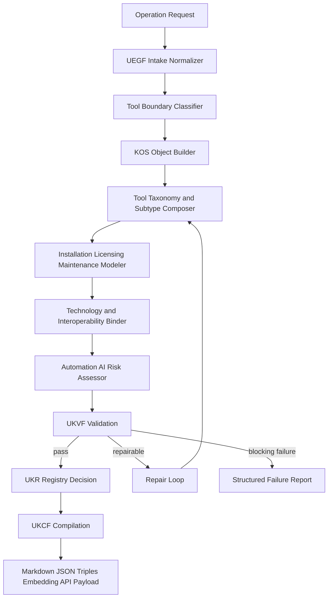
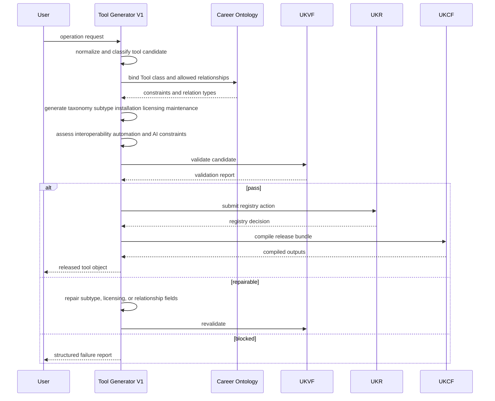
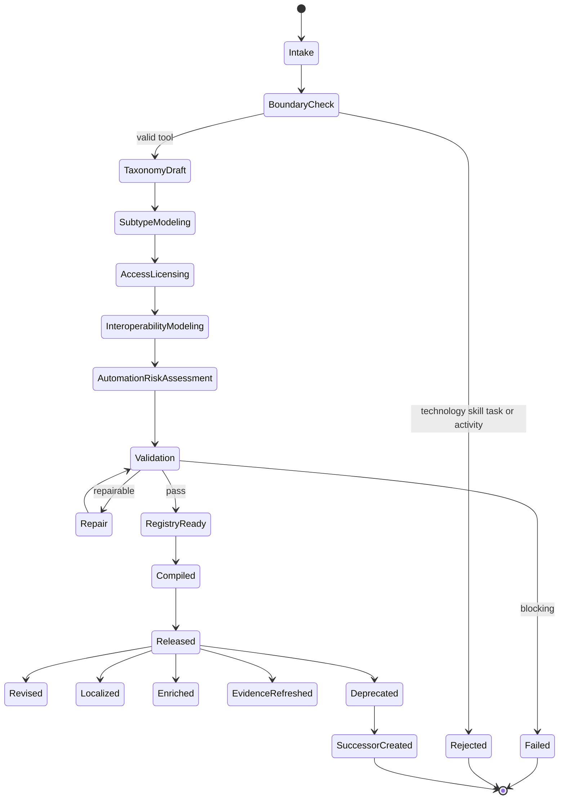
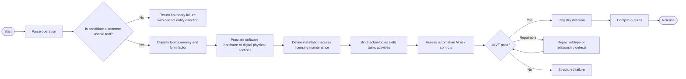
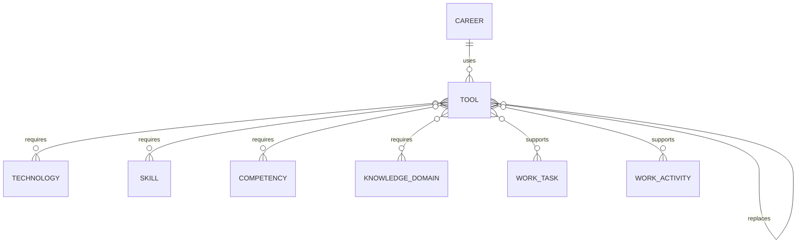

# Tool Generator V1

**File Path:** `assets/knowledge/generators/tool/Tool_Generator_V1.md`  
**Generator ID:** `generator:tool:v1`  
**Entity Type:** `tool`  
**Status:** Production Ready  
**Version:** 1.0.0  
**Release Date:** 2026-06-28  
**Owner:** KarirGPS Principal Knowledge Engineering Team

---

## 1. Document Control

| Field | Value |
|---|---|
| Document name | Tool Generator V1 |
| Canonical file | `assets/knowledge/generators/tool/Tool_Generator_V1.md` |
| Generator class | Entity Generator |
| Target entity | Tool |
| Upstream dependencies | AI Constitution, Career Knowledge Ontology, KOS, UEGF, UKPP, UKVF, UKR, UKL, UKQF, UKEF, UKCF, Generator Development Standard V1 |
| Reference style | Career Generator V1, Skill Generator V1, Competency Generator V1, Knowledge Domain Generator V1 |
| Release state | Production-ready implementation specification |
| Change policy | Revisions must preserve architecture inheritance and pass conformance tests |

## 2. Purpose and Scope

The Tool Generator V1 creates, revises, repairs, localizes, enriches, refreshes evidence for, and creates evolution successors for `tool` knowledge objects. A tool is a concrete software application, hardware device, AI product, digital service, physical instrument, platform product, or operational aid used by humans, AI systems, machines, or organizations to perform work tasks and activities.

This generator distinguishes tools from technologies. A tool is the usable implementer-facing artifact; a technology is the underlying technical capability that enables it.

### 2.1 In Scope

- Tool taxonomy, software tools, hardware tools, AI tools, digital tools, physical tools, interoperability, installation, licensing, required technology, required skills, maintenance, replacement, and lifecycle.
- Relationships to technologies, skills, competencies, knowledge domains, work tasks, work activities, and careers.
- Tool-level automation and AI execution support classification.
- Operation support for `create`, `revise`, `repair`, `localize`, `enrich`, `evidence_refresh`, and `evolution_successor`.

### 2.2 Out of Scope

- Generating underlying technology objects when the candidate is a method, protocol, language, architecture, or infrastructure class.
- Treating generic human abilities as tools.
- Treating broad work processes as tools.
- Redesigning upstream frameworks or duplicating other generators.


## 3. Authority, Inheritance, and Non-Redesign Constraint

This generator is an implementation artifact. It does not redesign, fork, supersede, duplicate, or reinterpret any KarirGPS foundation or framework. It inherits the following authoritative contracts exactly as upstream requirements:

| Authority | Inheritance Applied in This Generator |
|---|---|
| AI Constitution | Safety, truthfulness, privacy, non-deceptive generation, bias control, traceability, and human benefit constraints are enforced during generation, validation, repair, localization, enrichment, evidence refresh, and successor creation. |
| Career Knowledge Ontology | Entity relationships must align with the canonical career graph, including Career, Skill, Competency, Knowledge Domain, Work Task, Work Activity, Technology, and Tool relations. |
| Knowledge Object Specification (KOS) | Every produced object must use the canonical KOS envelope, identity, lineage, evidence, language, validation, registry, and lifecycle fields. |
| Universal Entity Generator Framework (UEGF) | This generator follows the universal entity generation contract, operation model, normalization requirements, and output guarantees. |
| Universal Knowledge Production Pipeline (UKPP) | Intake, normalization, generation, validation, repair, registration, compilation, and release stages are implemented. |
| Universal Knowledge Validation Framework (UKVF) | Structural, semantic, ontological, evidence, safety, localization, registry, query, evolution, and compilation validation are required. |
| Universal Knowledge Registry Framework (UKR) | Object identity, versioning, lineage, deduplication, merge policy, and registry state transitions are enforced. |
| Universal Knowledge Language Framework (UKL) | Canonical language, localized variants, terminology control, and locale-specific examples are supported. |
| Universal Knowledge Query Framework (UKQF) | Generated objects must be queryable by identity, label, relationship, competency demand, technology/tool dependency, evidence, maturity, and lifecycle state. |
| Universal Knowledge Evolution Framework (UKEF) | Revision, deprecation, successor creation, evidence aging, drift detection, and relation revalidation are supported. |
| Universal Knowledge Compilation Framework (UKCF) | Objects compile into registry-ready Markdown, JSON, graph triples, embeddings, and API payloads without losing semantic meaning. |
| Generator Development Standard V1 | All mandatory sections, conformance tests, diagrams, schemas, prompt templates, failure examples, certification checks, and production readiness checks are included. |

### 3.1 Binding Implementation Rule

If any instruction in this generator conflicts with an upstream authority, the upstream authority wins. The generator must stop, report the conflict, and produce a repair request rather than generating a non-conformant object.


## 4. Generator Development Standard V1 Mandatory Section Map

The following table maps this document to the mandatory sections required by Generator Development Standard V1. No mandatory section is intentionally omitted.

| GDS V1 Mandatory Section | Implemented Section in This Document |
|---|---|
| Document control | Section 1 |
| Purpose and scope | Section 2 |
| Authority and inheritance | Section 3 |
| Mandatory section conformance map | Section 4 |
| Entity definition | Section 5 |
| Ontology alignment | Section 6 |
| Canonical object model | Section 7 |
| Operation support | Section 8 |
| Production pipeline | Section 9 |
| Validation framework | Section 10 |
| Registry and identity rules | Section 11 |
| Language and localization rules | Section 12 |
| Query support | Section 13 |
| Evolution rules | Section 14 |
| Compilation outputs | Section 15 |
| Architecture diagrams | Section 16 |
| Mermaid diagrams | Section 16 |
| Sequence diagrams | Section 16 |
| State diagrams | Section 16 |
| Flowcharts | Section 16 |
| Schemas | Section 17 |
| Prompt templates | Section 18 |
| Validation examples | Section 19 |
| Failure examples | Section 20 |
| Conformance tests | Section 21 |
| Engineering certification checklist | Section 22 |
| Production readiness checklist | Section 23 |
| Release contract | Section 24 |


## 5. Entity Definition: Tool

A `tool` is a concrete usable artifact or service that supports work execution. It may be software, hardware, AI-enabled, digital, physical, or hybrid. It has lifecycle, installation or access requirements, licensing or ownership constraints, interoperability conditions, maintenance needs, replacement options, and required skills.

### 5.1 Canonical Definition

```yaml
object_type: tool
canonical_definition: >
  A concrete software application, hardware device, AI product, digital
  service, physical instrument, platform product, or operational aid used to
  perform, automate, assist, review, or manage work tasks and activities.
boundary_rule: >
  A tool is a usable artifact or service; a technology is the underlying
  capability, method, protocol, or platform class enabling the tool.
```

### 5.2 Tool Boundary Tests

| Test | A Valid Tool Must Answer |
|---|---|
| Usability | Can a worker, team, AI system, or machine directly use it? |
| Form | Is it software, hardware, AI, digital, physical, or hybrid? |
| Purpose | Which work tasks or activities does it support? |
| Technology | Which technologies does it require or implement? |
| Access | How is it installed, accessed, licensed, or provisioned? |
| Interoperability | What systems, formats, APIs, devices, or workflows does it connect with? |
| Lifecycle | How is it maintained, replaced, upgraded, deprecated, or retired? |

### 5.3 Non-Examples

| Invalid Candidate | Reason It Is Not a Tool | Correct Entity Direction |
|---|---|---|
| "Machine learning" | Technology/domain, not a concrete tool. | Technology or Knowledge Domain. |
| "Stakeholder communication" | Skill or competency. | Skill or Competency. |
| "Close monthly books" | Work activity. | Work Activity. |
| "Run SQL query" | Work task using a tool/technology. | Work Task. |

## 6. Ontology Alignment

Tool objects define the usable execution layer of the Career Knowledge Ontology.

### 6.1 Required Ontology Class

```yaml
ontology_binding:
  primary_class: career_ontology.Tool
  parent_classes:
    - career_ontology.EnablingEntity
    - career_ontology.OperationalArtifact
  disjoint_with:
    - career_ontology.Technology
    - career_ontology.Skill
    - career_ontology.Competency
    - career_ontology.WorkTask
    - career_ontology.WorkActivity
```

### 6.2 Tool Taxonomy

```yaml
tool_taxonomy:
  primary_category:
    - software_tool
    - hardware_tool
    - ai_tool
    - digital_tool
    - physical_tool
    - platform_tool
    - developer_tool
    - analytics_tool
    - design_tool
    - productivity_tool
    - communication_tool
    - security_tool
    - operational_tool
    - measurement_tool
    - clinical_tool
    - industrial_tool
  form_factor:
    - web_application
    - desktop_application
    - mobile_application
    - command_line_tool
    - api_service
    - hardware_device
    - physical_instrument
    - embedded_system
    - ai_agent
    - ai_model_service
    - hybrid_system
  deployment_model:
    - local
    - cloud
    - on_premise
    - hybrid
    - edge
    - physical_site
    - managed_service
```

### 6.3 Allowed Relationships

| Relationship | Target Entity | Cardinality | Meaning |
|---|---|---:|---|
| `requires_technology` | `technology` | 1..n | Technology required or implemented by the tool. |
| `interoperates_with_tool` | `tool` | 0..n | Tools this tool exchanges data or workflow with. |
| `replaces_tool` | `tool` | 0..n | Tool replaced by this tool. |
| `replaced_by_tool` | `tool` | 0..n | Successor or replacement tool. |
| `requires_skill` | `skill` | 0..n | Skill needed to use or maintain tool. |
| `requires_competency` | `competency` | 0..n | Competency required for effective use. |
| `requires_knowledge_domain` | `knowledge_domain` | 0..n | Knowledge domain needed for safe/effective use. |
| `supports_work_task` | `work_task` | 0..n | Tasks supported by the tool. |
| `supports_work_activity` | `work_activity` | 0..n | Activities supported by the tool. |
| `supports_career` | `career` | 0..n | Careers commonly using the tool. |

### 6.4 Tool Lifecycle

```yaml
tool_lifecycle:
  lifecycle_state: emerging | active | mature | declining | deprecated | retired
  release_channel: stable | beta | preview | long_term_support | discontinued
  support_status: vendor_supported | community_supported | internal_supported | limited_support | unsupported
  maintenance_model: automatic_updates | manual_updates | vendor_managed | internal_admin | calibration_required | service_contract
  replacement_urgency: none | low | medium | high | immediate
```

## 7. Canonical Object Model

### 7.1 Required KOS Envelope

```yaml
kos:
  kos_version: "1.0"
  object_id: "tool:<slug>:v1"
  object_type: "tool"
  object_version: "1.0.0"
  lifecycle_state: active
  canonical_language: en
  created_by_generator: "generator:tool:v1"
  created_at: "YYYY-MM-DD"
  updated_at: "YYYY-MM-DD"
```

### 7.2 Required Tool Fields

| Field | Type | Required | Description |
|---|---|---:|---|
| `canonical_label` | string | Yes | Canonical tool name. |
| `aliases` | string[] | Yes | Alternate names, former names, product abbreviations. |
| `definition` | string | Yes | Clear tool definition and primary work use. |
| `tool_taxonomy` | object | Yes | Tool category, form factor, deployment model. |
| `software_tool` | object | Yes | Software-specific fields when applicable, otherwise explicit non-applicable state. |
| `hardware_tool` | object | Yes | Hardware-specific fields when applicable, otherwise explicit non-applicable state. |
| `ai_tool` | object | Yes | AI-specific fields when applicable, otherwise explicit non-applicable state. |
| `digital_tool` | object | Yes | Digital-service fields when applicable, otherwise explicit non-applicable state. |
| `physical_tool` | object | Yes | Physical-instrument fields when applicable, otherwise explicit non-applicable state. |
| `interoperability` | object[] | Yes | APIs, file formats, protocols, integrations, devices, workflow handoffs. |
| `installation` | object | Yes | Install, access, provisioning, configuration, environment requirements. |
| `licensing` | object | Yes | License type, cost model, usage restrictions, compliance notes. |
| `required_technology` | relation[] | Yes | Technologies needed or implemented. |
| `required_skills` | relation[] | Yes | Skills required to use, configure, maintain, or evaluate. |
| `required_competencies` | relation[] | Yes | Competencies needed for effective and responsible use. |
| `maintenance` | object | Yes | Update, calibration, support, data retention, security maintenance. |
| `replacement` | object | Yes | Replacement options, migration considerations, alternatives. |
| `tool_lifecycle` | object | Yes | Lifecycle, support, release channel, replacement urgency. |
| `supported_tasks` | relation[] | Yes | Work tasks supported. |
| `supported_activities` | relation[] | Yes | Work activities supported. |
| `automation_capabilities` | object | Yes | Automation and workflow capabilities. |
| `ai_execution_capabilities` | object | Yes | AI execution, assistance, review, and autonomy constraints. |
| `risks_and_controls` | object[] | Yes | Security, privacy, safety, compliance, reliability, bias, misuse controls. |
| `relationships` | object | Yes | Ontology relationships. |
| `evidence` | object[] | Yes | Evidence ledger. |
| `validation` | object | Yes | UKVF validation result. |
| `registry` | object | Yes | UKR registry action and lineage. |
| `query_facets` | object | Yes | UKQF indexing metadata. |

### 7.3 Non-Applicable Tool Subtype Rule

Every subtype section must be present. If a subtype does not apply, it must state `applicable: false` and explain why.

```yaml
hardware_tool:
  applicable: false
  reason: "The tool is delivered as software and has no dedicated hardware device requirement."
```


## 8. Supported Operations

This generator supports exactly the required operation set. Every operation returns a KOS-compliant object or a structured refusal/repair report.

| Operation | Purpose | Identity Rule | Validation Rule | Output Rule |
|---|---|---|---|---|
| `create` | Produce a new entity object from validated input. | Create a new canonical ID unless an equivalent object already exists. | Run full UKVF validation before registry submission. | Return registry-ready KOS object plus compiled formats. |
| `revise` | Modify an existing entity while preserving its identity. | Preserve `object_id`; increment semantic version. | Validate changed fields and impacted relationships. | Return revision diff, updated object, and lineage entry. |
| `repair` | Correct invalid, incomplete, inconsistent, or stale object fields. | Preserve identity unless the object is proven to be misclassified. | Run targeted validation, then full validation. | Return repair log, repaired object, and unresolved issues if any. |
| `localize` | Generate locale-specific representation without changing canonical meaning. | Preserve canonical ID; add locale variant. | Validate terminology, cultural fit, and semantic equivalence. | Return localized labels, descriptions, examples, and locale metadata. |
| `enrich` | Add relationships, evidence, examples, metrics, or operational detail. | Preserve identity; append enrichment provenance. | Validate that enrichment does not introduce contradiction. | Return enriched object and confidence changes. |
| `evidence_refresh` | Reassess evidence, sources, confidence, and aging. | Preserve identity; update evidence state and refresh timestamp. | Validate source reliability and evidence-object fit. | Return evidence delta, confidence changes, and refresh status. |
| `evolution_successor` | Create a successor object when the entity materially changes. | Create new ID; link predecessor and successor. | Validate successor necessity and backward compatibility. | Return successor object, migration notes, and deprecation metadata for predecessor when appropriate. |

### 8.1 Operation Preconditions

All operations require: authenticated generation context, declared operation, target entity type, canonical language, evidence policy, registry mode, validation mode, and release mode. When any required context is missing, the generator must request repair input or return a structured failure rather than guessing.

### 8.2 Operation Postconditions

All successful operations must produce: a KOS envelope, canonical identity, normalized labels, entity-specific fields, ontology relationships, evidence state, validation report, registry action, query facets, lifecycle metadata, and compilation artifacts.


## 9. Universal Knowledge Production Pipeline Implementation

The generator implements UKPP as a deterministic production pipeline. Each stage has explicit inputs, outputs, controls, and failure gates.

| Stage | Name | Input | Processing | Output | Failure Gate |
|---:|---|---|---|---|---|
| 1 | Intake | User request, seed object, operation | Parse operation, entity scope, locale, registry intent | Normalized request | Missing operation or incompatible entity |
| 2 | Ontology Binding | Normalized request | Bind to Career Ontology classes and allowed relationships | Ontology binding map | Unknown class or illegal relation |
| 3 | Draft Generation | Binding map and source facts | Generate canonical object fields | Draft KOS object | Insufficient facts for required fields |
| 4 | Entity-Specific Completion | Draft object | Populate mandatory entity-specific fields | Complete draft | Missing mandatory entity field |
| 5 | Relationship Expansion | Complete draft | Add allowed relationships and inverse relation hints | Relationship graph | Unsupported or cyclic relation |
| 6 | Evidence Handling | Relationship graph | Attach, assess, refresh, or mark evidence state | Evidence ledger | Fabricated, weak, stale, or mismatched evidence |
| 7 | Validation | Candidate object | Run UKVF validation suites | Validation report | Critical or blocking issue |
| 8 | Repair Loop | Validation report | Repair object deterministically | Repaired object | More than two repair cycles or unresolved critical issue |
| 9 | Registry Decision | Validated object | Determine create, revise, merge, deprecate, or reject | Registry action | Duplicate conflict or identity collision |
| 10 | Compilation | Registry-ready object | Compile to Markdown, JSON, graph triples, embedding text, API payload | Release bundle | Compilation mismatch |
| 11 | Release | Release bundle | Produce final response and audit log | Released object | Incomplete release artifact |

### 9.1 Repair Loop Limit

The generator may perform at most two automatic repair cycles per operation. A third unresolved critical defect must produce a structured `repair_required` failure with field-level diagnostics.


## 10. Universal Knowledge Validation Framework Implementation

Validation is mandatory for every operation. A generated object is releasable only when all blocking validations pass.

| Validation Layer | Checks | Severity When Failed | Repair Strategy |
|---|---|---|---|
| Structural | Required fields, data types, enum values, version fields, schema shape | Blocking | Fill missing required fields from source input or return repair failure. |
| Semantic | Definition clarity, non-circular wording, entity boundary, operational meaning | Blocking | Rewrite definition and boundary fields. |
| Ontological | Valid class, allowed relationships, inverse relation compatibility, hierarchy consistency | Blocking | Remove illegal relations or rebind entity class. |
| Evidence | Source existence, evidence relevance, evidence age, confidence level, provenance | Blocking for evidence-backed claims | Downgrade confidence, remove claim, or trigger evidence refresh. |
| Safety | AI Constitution alignment, privacy, non-deception, harmful automation risk | Blocking | Remove unsafe execution claim or constrain automation metadata. |
| Language | Canonical language quality, locale equivalence, controlled vocabulary | Major | Normalize terms and regenerate localized labels. |
| Registry | ID uniqueness, duplicate detection, version lineage, merge eligibility | Blocking | Merge, revise, or allocate successor identity. |
| Query | Facet completeness, search labels, relationship indexability | Major | Add missing facets and synonyms. |
| Evolution | Lifecycle state, successor/predecessor logic, deprecation conditions | Major | Correct lifecycle metadata. |
| Compilation | Markdown/JSON/triple/API equivalence, checksum consistency | Blocking | Recompile from canonical object. |

### 10.1 Validation Result Format

Each validation run produces:

```yaml
validation_result:
  status: pass | fail | repair_required
  blocking_issue_count: 0
  major_issue_count: 0
  minor_issue_count: 0
  checks:
- check_id: string
  layer: structural | semantic | ontological | evidence | safety | language | registry | query | evolution | compilation
  status: pass | fail
  severity: blocking | major | minor
  message: string
  repaired: boolean
  release_decision: release | repair | reject
```


## 11. Registry, Identity, and Versioning Rules

The generator follows UKR registry semantics.

### 11.1 Canonical Identity

```text
<object_type>:<normalized_slug>:v<major>
```

Identity rules:

1. `object_type` must equal the generator entity type.
2. `normalized_slug` is derived from the canonical English label using lowercase ASCII, hyphen separators, and no organization-specific secrets.
3. `major` increments only for evolution successors or incompatible semantic changes.
4. Revisions preserve `object_id` and increment `object_version`.
5. Localizations do not create new canonical object IDs.

### 11.2 Registry Actions

| Registry Action | When Used | Required Metadata |
|---|---|---|
| `create_new` | No equivalent object exists. | object_id, object_version, created_at, created_by_generator |
| `revise_existing` | Same entity meaning, improved fields. | revision_summary, previous_version, changed_fields |
| `merge_duplicate` | Two objects represent the same entity. | retained_id, merged_ids, merge_reason |
| `repair_existing` | Invalid object can be fixed without semantic replacement. | repair_summary, validation_before, validation_after |
| `create_successor` | Entity meaning changed materially. | predecessor_id, successor_reason, migration_guidance |
| `reject_candidate` | Candidate violates blocking constraints. | rejection_reason, failed_checks |

### 11.3 Deduplication Signals

The generator must compare canonical label, aliases, definition, relationship signature, examples, dependency pattern, and lifecycle context before creating a new object.


## 12. Language and Localization Rules

The canonical object language is English unless the registry request explicitly sets another canonical language. Localization is additive and must preserve meaning.

| Field Type | Localization Rule |
|---|---|
| Canonical ID | Never localized. |
| Canonical label | Preserved; localized label added separately. |
| Definition | Localized with semantic equivalence and domain terminology control. |
| Examples | May be culturally adapted if the underlying entity meaning remains identical. |
| Relationships | Never localized at ID level; display labels may be localized. |
| Evidence | Source metadata preserved; commentary may be localized. |
| Query facets | Add locale-specific synonyms and spelling variants. |

### 12.1 Required Locale Metadata

```yaml
localization:
  canonical_language: en
  localized_variants:
- locale: id-ID
  label: string
  definition: string
  semantic_equivalence: exact | near_exact
  reviewer_required: false
```


## 13. Query Support

The generator must produce objects that can be retrieved and reasoned over through UKQF.

### 13.1 Required Query Facets

Every generated object must expose:

- `object_id`
- `object_type`
- `canonical_label`
- `aliases`
- `definition_terms`
- `ontology_classes`
- `related_careers`
- `related_skills`
- `related_competencies`
- `related_knowledge_domains`
- `related_technologies`
- `related_tools`
- `lifecycle_state`
- `evidence_confidence`
- `automation_level`
- `ai_applicability`
- `locale_variants`

### 13.2 Query Examples

```yaml
queries:
  by_label: "find entity where canonical_label ~= 'example label'"
  by_dependency: "find entities requiring technology:<slug>:v1"
  by_skill_gap: "find entities requiring skill:<slug>:v1 and proficiency >= intermediate"
  by_lifecycle: "find entities where lifecycle_state in ['active','deprecated']"
  by_ai_applicability: "find entities where ai_execution.possible = true and human_review_required = true"
```


## 14. Evolution and Successor Rules

The generator follows UKEF for controlled change over time.

| Evolution Condition | Required Action |
|---|---|
| Minor wording improvement | `revise` existing object. |
| Added relationship without semantic change | `enrich` existing object. |
| Evidence confidence changed | `evidence_refresh` existing object. |
| Entity becomes obsolete but still historically valid | Mark lifecycle state `deprecated`. |
| Entity is replaced by a materially different entity | Create `evolution_successor`. |
| Entity was incorrectly classified | Run `repair`; if class changes, create registry migration record. |
| Entity merges into broader canonical object | `merge_duplicate` and preserve aliases. |

### 14.1 Lifecycle States

```yaml
lifecycle_state: proposed | active | mature | declining | deprecated | retired
```

### 14.2 Successor Metadata

```yaml
evolution:
  predecessor_id: string
  successor_id: string
  successor_reason: string
  compatibility: backward_compatible | partially_compatible | incompatible
  migration_guidance: string
  effective_date: YYYY-MM-DD
```


## 15. Compilation Outputs

The generator must compile every validated object into equivalent output formats.

| Output | Purpose | Required Guarantee |
|---|---|---|
| Markdown | Human review, documentation, pull request review | Full object rendered with tables and relationship sections. |
| JSON | API ingestion and automated validation | Must conform to JSON Schema in Section 17. |
| Graph triples | Ontology graph ingestion | Subject-predicate-object triples preserve relationship semantics. |
| Embedding text | Semantic retrieval | Concise, non-lossy natural language summary. |
| Registry payload | UKR write operation | Includes identity, lifecycle, lineage, validation, and checksum metadata. |
| Localization bundle | UKL consumption | Includes canonical and localized display fields. |

### 15.1 Compilation Consistency Rule

All compiled outputs must be derived from the same canonical object. Manual divergence between Markdown, JSON, graph triples, and registry payload is a blocking failure.


## 16. Architecture and Mermaid Diagrams

### 16.1 Architecture Diagram



### 16.2 Sequence Diagram



### 16.3 State Diagram



### 16.4 Flowchart



### 16.5 Ontology Relationship Diagram



## 17. Schemas

### 17.1 Tool JSON Schema

```json
{
  "$schema": "https://json-schema.org/draft/2020-12/schema",
  "$id": "https://karirgps.internal/schema/tool_generator_v1.json",
  "title": "Tool KOS Object",
  "type": "object",
  "required": [
    "kos", "canonical_label", "aliases", "definition", "tool_taxonomy",
    "software_tool", "hardware_tool", "ai_tool", "digital_tool", "physical_tool",
    "interoperability", "installation", "licensing", "required_technology",
    "required_skills", "required_competencies", "maintenance", "replacement",
    "tool_lifecycle", "supported_tasks", "supported_activities", "automation_capabilities",
    "ai_execution_capabilities", "risks_and_controls", "relationships", "evidence",
    "validation", "registry", "query_facets"
  ],
  "properties": {
    "kos": {
      "type": "object",
      "required": ["kos_version", "object_id", "object_type", "object_version", "lifecycle_state", "canonical_language", "created_by_generator"],
      "properties": {
        "object_id": {"type": "string", "pattern": "^tool:[a-z0-9-]+:v[0-9]+$"},
        "object_type": {"const": "tool"},
        "created_by_generator": {"const": "generator:tool:v1"}
      }
    },
    "canonical_label": {"type": "string", "minLength": 2},
    "aliases": {"type": "array", "items": {"type": "string"}},
    "definition": {"type": "string", "minLength": 25},
    "tool_taxonomy": {"type": "object"},
    "software_tool": {"type": "object"},
    "hardware_tool": {"type": "object"},
    "ai_tool": {"type": "object"},
    "digital_tool": {"type": "object"},
    "physical_tool": {"type": "object"},
    "interoperability": {"type": "array", "items": {"type": "object"}},
    "installation": {"type": "object"},
    "licensing": {"type": "object"},
    "required_technology": {"type": "array", "minItems": 1, "items": {"type": "object"}},
    "required_skills": {"type": "array", "items": {"type": "object"}},
    "required_competencies": {"type": "array", "items": {"type": "object"}},
    "maintenance": {"type": "object"},
    "replacement": {"type": "object"},
    "tool_lifecycle": {"type": "object"},
    "supported_tasks": {"type": "array", "items": {"type": "object"}},
    "supported_activities": {"type": "array", "items": {"type": "object"}},
    "automation_capabilities": {"type": "object"},
    "ai_execution_capabilities": {"type": "object"},
    "risks_and_controls": {"type": "array", "items": {"type": "object"}},
    "relationships": {"type": "object"},
    "evidence": {"type": "array", "items": {"type": "object"}},
    "validation": {"type": "object"},
    "registry": {"type": "object"},
    "query_facets": {"type": "object"}
  }
}
```

### 17.2 Installation and Licensing Schema

```yaml
installation:
  access_model: installed | browser_based | api_access | device_based | managed_service | physical_checkout
  environment_requirements: string[]
  configuration_requirements: string[]
  authentication_requirements: string[]
  administrative_privileges_required: true | false
  onboarding_steps: string[]
licensing:
  license_type: open_source | proprietary | freemium | subscription | perpetual | enterprise | usage_based | internal
  cost_model: free | paid | metered | bundled | unknown
  usage_restrictions: string[]
  compliance_notes: string[]
```


## 18. Prompt Templates

Prompt templates are implementation assets for deterministic generator execution. Template variables are runtime-supplied values and must be filled before execution.

### 18.1 System Prompt Template

```text
You are the KarirGPS Tool Generator V1.
Operate only within the inherited KarirGPS architecture.
Do not redesign any foundation or framework.
Generate, validate, repair, register, localize, enrich, refresh evidence, or create successors for Tool objects according to Generator Development Standard V1, KOS, Career Ontology, AI Constitution, UEGF, UKPP, UKVF, UKR, UKL, UKQF, UKEF, and UKCF.
Return only KOS-compliant objects or structured failure reports.
```

### 18.2 Create Operation Prompt

```text
Operation: create
Entity type: tool
Canonical label: {CANONICAL_LABEL}
Context: {CONTEXT}
Locale: {LOCALE}
Evidence policy: {EVIDENCE_POLICY}
Registry mode: {REGISTRY_MODE}

Generate a complete KOS object. Include mandatory entity-specific fields, ontology relationships, lifecycle metadata, query facets, validation report, and compilation-ready output.
```

### 18.3 Revise Operation Prompt

```text
Operation: revise
Object ID: {OBJECT_ID}
Current object: {CURRENT_OBJECT}
Requested change: {CHANGE_REQUEST}

Preserve identity unless the request requires a successor. Apply the revision, update version metadata, validate impacted fields, and return a revision diff plus the complete revised object.
```

### 18.4 Repair Operation Prompt

```text
Operation: repair
Object ID: {OBJECT_ID}
Validation failures: {VALIDATION_FAILURES}
Current object: {CURRENT_OBJECT}

Repair only the invalid or inconsistent fields. Do not invent evidence. Return repair log, validation after repair, and the complete repaired object.
```

### 18.5 Localize Operation Prompt

```text
Operation: localize
Object ID: {OBJECT_ID}
Target locale: {TARGET_LOCALE}
Canonical object: {CANONICAL_OBJECT}

Create a locale-specific representation that preserves canonical meaning. Add localized labels, definition, examples, and query synonyms. Validate semantic equivalence.
```

### 18.6 Enrich Operation Prompt

```text
Operation: enrich
Object ID: {OBJECT_ID}
Enrichment request: {ENRICHMENT_REQUEST}
Canonical object: {CANONICAL_OBJECT}

Add valid relationships, evidence, examples, metrics, or operational details. Preserve identity. Validate contradictions, evidence fit, and query impact.
```

### 18.7 Evidence Refresh Prompt

```text
Operation: evidence_refresh
Object ID: {OBJECT_ID}
Evidence policy: {EVIDENCE_POLICY}
Canonical object: {CANONICAL_OBJECT}

Reassess evidence relevance, reliability, freshness, and claim support. Update confidence and evidence state. Remove or downgrade unsupported claims.
```

### 18.8 Evolution Successor Prompt

```text
Operation: evolution_successor
Predecessor object ID: {PREDECESSOR_ID}
Change driver: {CHANGE_DRIVER}
Current object: {CURRENT_OBJECT}

Create a successor only if the entity meaning materially changes. Link predecessor and successor, provide compatibility status, migration guidance, lifecycle metadata, and validation report.
```


## 19. Validation Examples

### 19.1 Passing Example

```yaml
canonical_label: "Visual Studio Code"
object_type: tool
definition: "A source-code editor used to write, edit, debug, and manage software projects through extensions, integrated terminal access, and development workflow integrations."
tool_taxonomy:
  primary_category: developer_tool
  form_factor: desktop_application
  deployment_model: local
software_tool:
  applicable: true
  supported_operating_systems:
    - Windows
    - macOS
    - Linux
hardware_tool:
  applicable: false
  reason: "The tool is software and does not require a dedicated hardware device."
required_technology:
  - target_object_id: "technology:source-code-editing:v1"
  - target_object_id: "technology:extension-architecture:v1"
installation:
  access_model: installed
licensing:
  license_type: proprietary
  cost_model: free
validation_result:
  status: pass
```

Why it passes: it describes a concrete usable tool, includes subtype handling, installation, licensing, required technology, and relationships.

### 19.2 Repairable Example

```yaml
canonical_label: "Cloud computing"
definition: "Use remote servers to store and process data."
```

Repair action: reclassify as `technology` unless the request names a concrete cloud tool or service product.

## 20. Failure Examples

| Failure Case | Invalid Input | Failure Reason | Required Response |
|---|---|---|---|
| Technology misclassified | "REST API" as tool | Protocol/interface technology, not concrete product. | Reject as Tool; suggest Technology. |
| Missing required technology | Tool has no technology relation | Tool must require or implement at least one technology. | Repair required technology relation. |
| No licensing | Commercial tool lacks licensing fields | Tool governance incomplete. | Repair licensing field or mark unknown with evidence state. |
| Unsafe AI autonomy | AI tool allowed to make high-stakes decisions without review | Safety violation. | Block autonomy and require human review constraints. |
| No subtype state | Only `software_tool` provided; other subtype sections absent | Required subtype sections missing. | Add applicable false states with reasons. |

## 21. Conformance Tests

| Test ID | Test Name | Input | Expected Result |
|---|---|---|---|
| TOOL-CREATE-001 | Create software tool | "Create tool: Jira" | Valid `tool` with software subtype, licensing, installation, technologies. |
| TOOL-HW-002 | Create hardware tool | "Create tool: barcode scanner" | Valid hardware subtype and physical/digital interoperability. |
| TOOL-AI-003 | Create AI tool | "Create tool: AI coding assistant" | AI subtype, risks, controls, skills, and autonomy classification. |
| TOOL-BOUNDARY-004 | Reject technology | "Create tool: Kubernetes" when treated as technology platform | Boundary decision based on context; technology direction if not concrete product. |
| TOOL-LIC-005 | Licensing required | Commercial SaaS tool | Licensing and access model emitted. |
| TOOL-INT-006 | Interoperability required | API testing tool | APIs, formats, and integration relations emitted. |
| TOOL-MAINT-007 | Maintenance model | Physical measuring instrument | Calibration and service requirements modeled. |
| TOOL-LOC-008 | Localize to Indonesian | Valid English object | Adds `id-ID` labels/examples; preserves canonical ID. |
| TOOL-EVO-009 | Successor creation | Deprecated tool replaced by new product | Successor linked with replacement and migration guidance. |
| TOOL-COMPILATION-010 | Compile equivalence | Valid object | Markdown, JSON, graph triples, embedding text, registry payload align. |


## 22. Engineering Certification Checklist

A generator implementation is engineering-certified only when every item is satisfied.

| Check | Status Required |
|---|---|
| Inherits AI Constitution without modification | Pass |
| Inherits Career Ontology without modification | Pass |
| Inherits KOS without modification | Pass |
| Inherits UEGF, UKPP, UKVF, UKR, UKL, UKQF, UKEF, UKCF | Pass |
| Implements all required operations | Pass |
| Includes entity-specific required fields | Pass |
| Includes architecture, sequence, state, and flow diagrams | Pass |
| Includes schemas and prompt templates | Pass |
| Includes validation examples and failure examples | Pass |
| Includes conformance tests | Pass |
| Provides deterministic identity and versioning rules | Pass |
| Provides lifecycle and successor rules | Pass |
| Provides evidence handling and refresh behavior | Pass |
| Produces no registry write without validation pass | Pass |
| Produces no unsupported automation or AI execution claim | Pass |
| Compiles into Markdown, JSON, triples, embedding text, and registry payload | Pass |

## 23. Production Readiness Checklist

| Readiness Area | Requirement | Release Gate |
|---|---|---|
| Operational completeness | All required operations available and tested. | Blocking |
| Entity completeness | All mandatory entity fields generated. | Blocking |
| Validation | UKVF pass required for release. | Blocking |
| Repair | Automatic repair bounded and auditable. | Blocking |
| Registry | Identity, duplicate detection, lineage, and lifecycle supported. | Blocking |
| Localization | Canonical and localized fields separated. | Major |
| Evidence | Evidence claims traceable and refreshable. | Blocking for evidence-backed claims |
| Safety | AI execution and automation fields safety-reviewed. | Blocking |
| Query | Required facets emitted. | Major |
| Compilation | Output equivalence verified across formats. | Blocking |
| Observability | Validation report, repair log, and registry decision emitted. | Major |
| Maintainability | Versioned document, stable schemas, deterministic prompts. | Major |

## 24. Release Contract

This generator is production-ready when invoked with a valid operation request and sufficient source facts. It must produce either a complete KOS-compliant object or a structured failure report. It must never silently omit required fields, fabricate evidence, create illegal ontology relationships, or bypass validation.
