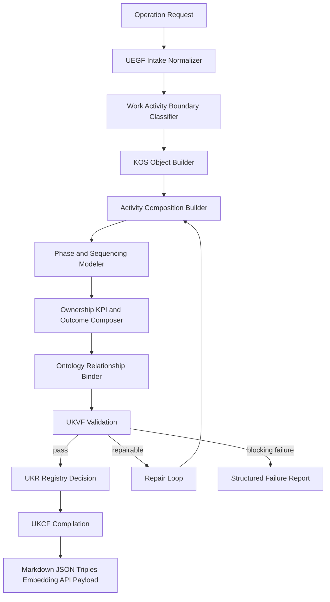
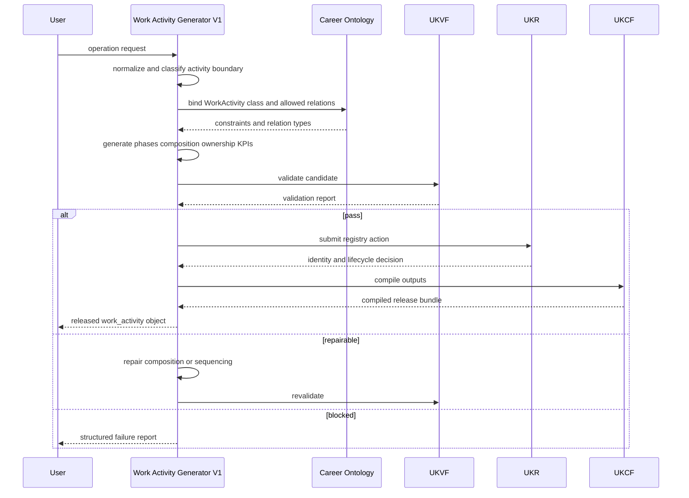
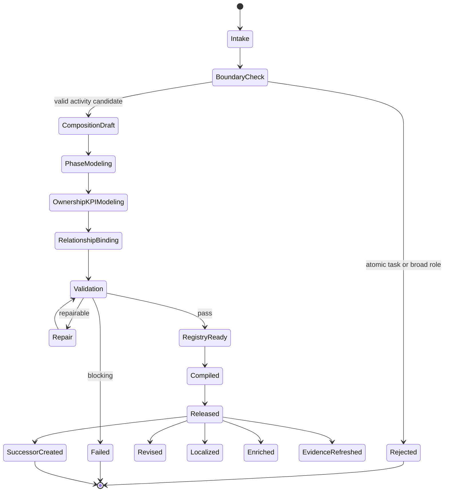
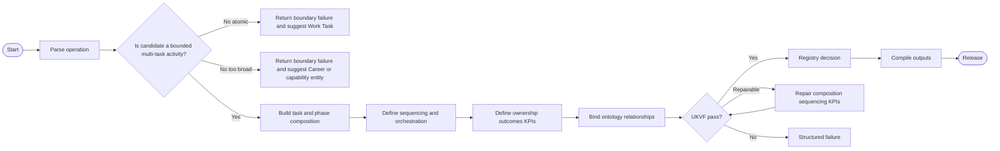
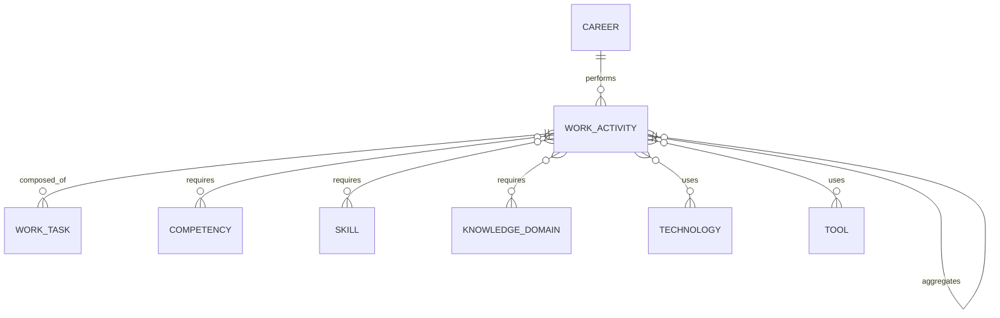

# Work Activity Generator V1

**File Path:** `assets/knowledge/generators/work_activity/Work_Activity_Generator_V1.md`  
**Generator ID:** `generator:work_activity:v1`  
**Entity Type:** `work_activity`  
**Status:** Production Ready  
**Version:** 1.0.0  
**Release Date:** 2026-06-28  
**Owner:** KarirGPS Principal Knowledge Engineering Team

---

## 1. Document Control

| Field | Value |
|---|---|
| Document name | Work Activity Generator V1 |
| Canonical file | `assets/knowledge/generators/work_activity/Work_Activity_Generator_V1.md` |
| Generator class | Entity Generator |
| Target entity | Work Activity |
| Upstream dependencies | AI Constitution, Career Knowledge Ontology, KOS, UEGF, UKPP, UKVF, UKR, UKL, UKQF, UKEF, UKCF, Generator Development Standard V1 |
| Reference style | Career Generator V1, Skill Generator V1, Competency Generator V1, Knowledge Domain Generator V1 |
| Release state | Production-ready implementation specification |
| Change policy | Revisions must preserve architecture inheritance and pass conformance tests |

## 2. Purpose and Scope

The Work Activity Generator V1 creates, revises, repairs, localizes, enriches, refreshes evidence for, and creates evolution successors for `work_activity` knowledge objects. A work activity is a bounded, orchestrated set of work tasks that collectively produce a business, professional, operational, learning, or service outcome. It represents work above the atomic task level and below broad role or career responsibility.

Work activities answer: what activity is performed, where its boundary starts and ends, which phases and tasks compose it, who owns it, how it is sequenced, how outcomes are measured, and how it relates to careers, competencies, skills, knowledge domains, technologies, tools, and other activities.

### 2.1 In Scope

- Activity boundary, lifecycle, composition, orchestration, phases, outcomes, ownership, KPIs, relationships, aggregation rules, and sequencing.
- Relationship with tasks, careers, skills, competencies, knowledge domains, technologies, and tools.
- Activity-level automation and AI support classification.
- Operation support for `create`, `revise`, `repair`, `localize`, `enrich`, `evidence_refresh`, and `evolution_successor`.

### 2.2 Out of Scope

- Treating a single atomic executable unit as an activity when it should be a Work Task.
- Treating an entire profession, job family, department, or business capability as a Work Activity.
- Redefining upstream framework concepts or replacing existing entity generators.


## 3. Authority, Inheritance, and Non-Redesign Constraint

This generator is an implementation artifact. It does not redesign, fork, supersede, duplicate, or reinterpret any KarirGPS foundation or framework. It inherits the following authoritative contracts exactly as upstream requirements:

| Authority | Inheritance Applied in This Generator |
|---|---|
| AI Constitution | Safety, truthfulness, privacy, non-deceptive generation, bias control, traceability, and human benefit constraints are enforced during generation, validation, repair, localization, enrichment, evidence refresh, and successor creation. |
| Career Knowledge Ontology | Entity relationships must align with the canonical career graph, including Career, Skill, Competency, Knowledge Domain, Work Task, Work Activity, Technology, and Tool relations. |
| Knowledge Object Specification (KOS) | Every produced object must use the canonical KOS envelope, identity, lineage, evidence, language, validation, registry, and lifecycle fields. |
| Universal Entity Generator Framework (UEGF) | This generator follows the universal entity generation contract, operation model, normalization requirements, and output guarantees. |
| Universal Knowledge Production Pipeline (UKPP) | Intake, normalization, generation, validation, repair, registration, compilation, and release stages are implemented. |
| Universal Knowledge Validation Framework (UKVF) | Structural, semantic, ontological, evidence, safety, localization, registry, query, evolution, and compilation validation are required. |
| Universal Knowledge Registry Framework (UKR) | Object identity, versioning, lineage, deduplication, merge policy, and registry state transitions are enforced. |
| Universal Knowledge Language Framework (UKL) | Canonical language, localized variants, terminology control, and locale-specific examples are supported. |
| Universal Knowledge Query Framework (UKQF) | Generated objects must be queryable by identity, label, relationship, competency demand, technology/tool dependency, evidence, maturity, and lifecycle state. |
| Universal Knowledge Evolution Framework (UKEF) | Revision, deprecation, successor creation, evidence aging, drift detection, and relation revalidation are supported. |
| Universal Knowledge Compilation Framework (UKCF) | Objects compile into registry-ready Markdown, JSON, graph triples, embeddings, and API payloads without losing semantic meaning. |
| Generator Development Standard V1 | All mandatory sections, conformance tests, diagrams, schemas, prompt templates, failure examples, certification checks, and production readiness checks are included. |

### 3.1 Binding Implementation Rule

If any instruction in this generator conflicts with an upstream authority, the upstream authority wins. The generator must stop, report the conflict, and produce a repair request rather than generating a non-conformant object.


## 4. Generator Development Standard V1 Mandatory Section Map

The following table maps this document to the mandatory sections required by Generator Development Standard V1. No mandatory section is intentionally omitted.

| GDS V1 Mandatory Section | Implemented Section in This Document |
|---|---|
| Document control | Section 1 |
| Purpose and scope | Section 2 |
| Authority and inheritance | Section 3 |
| Mandatory section conformance map | Section 4 |
| Entity definition | Section 5 |
| Ontology alignment | Section 6 |
| Canonical object model | Section 7 |
| Operation support | Section 8 |
| Production pipeline | Section 9 |
| Validation framework | Section 10 |
| Registry and identity rules | Section 11 |
| Language and localization rules | Section 12 |
| Query support | Section 13 |
| Evolution rules | Section 14 |
| Compilation outputs | Section 15 |
| Architecture diagrams | Section 16 |
| Mermaid diagrams | Section 16 |
| Sequence diagrams | Section 16 |
| State diagrams | Section 16 |
| Flowcharts | Section 16 |
| Schemas | Section 17 |
| Prompt templates | Section 18 |
| Validation examples | Section 19 |
| Failure examples | Section 20 |
| Conformance tests | Section 21 |
| Engineering certification checklist | Section 22 |
| Production readiness checklist | Section 23 |
| Release contract | Section 24 |


## 5. Entity Definition: Work Activity

A `work_activity` is a bounded composition of tasks, phases, ownership, resources, and outcomes. It can be planned, coordinated, monitored, optimized, and measured through KPIs. It may repeat as a recurring operational pattern or occur as a project/event activity.

### 5.1 Canonical Definition

```yaml
object_type: work_activity
canonical_definition: >
  A bounded and orchestrated composition of work tasks, phases, resources,
  roles, and controls that produces a defined activity outcome and can be
  measured through ownership, sequencing, lifecycle state, and KPIs.
boundary_rule: >
  A work activity must contain or coordinate multiple tasks or phases, have
  a clear start and end boundary, and produce an outcome broader than a
  single atomic task output.
```

### 5.2 Activity Boundary Tests

| Test | A Valid Work Activity Must Answer |
|---|---|
| Boundary | What starts and ends the activity? |
| Composition | Which tasks or phases are included? |
| Orchestration | How are tasks sequenced or coordinated? |
| Ownership | Who owns, performs, reviews, or approves the activity? |
| Outcome | What activity-level result is produced? |
| KPI | How is activity performance measured? |
| Relationship | Which upstream/downstream activities depend on it? |

### 5.3 Non-Examples

| Invalid Candidate | Reason It Is Not a Work Activity | Correct Entity Direction |
|---|---|---|
| "Approve expense report" | Atomic action with one output. | Work Task. |
| "Marketing" | Broad function or domain. | Career area, Knowledge Domain, or business function outside this generator. |
| "Python programming" | Capability or skill area. | Skill or Knowledge Domain. |
| "Software Engineer" | Career or role. | Career. |

## 6. Ontology Alignment

Work Activity objects define the orchestration layer of the Career Knowledge Ontology.

### 6.1 Required Ontology Class

```yaml
ontology_binding:
  primary_class: career_ontology.WorkActivity
  parent_classes:
    - career_ontology.WorkUnit
    - career_ontology.OperationalEntity
  disjoint_with:
    - career_ontology.WorkTask
    - career_ontology.Skill
    - career_ontology.Competency
    - career_ontology.Technology
    - career_ontology.Tool
```

### 6.2 Allowed Relationships

| Relationship | Target Entity | Cardinality | Meaning |
|---|---|---:|---|
| `composed_of_task` | `work_task` | 1..n | Tasks included in the activity. |
| `has_phase` | activity phase object | 1..n | Activity phases or stages. |
| `precedes_activity` | `work_activity` | 0..n | Downstream activity that follows. |
| `depends_on_activity` | `work_activity` | 0..n | Upstream activity required first. |
| `aggregates_activity` | `work_activity` | 0..n | Sub-activity included in this activity. |
| `part_of_activity` | `work_activity` | 0..1 | Parent activity when this is a sub-activity. |
| `requires_competency` | `competency` | 0..n | Competencies needed across the activity. |
| `requires_skill` | `skill` | 0..n | Skills needed across tasks/phases. |
| `requires_knowledge_domain` | `knowledge_domain` | 0..n | Knowledge domains required. |
| `uses_technology` | `technology` | 0..n | Technologies used in the activity. |
| `uses_tool` | `tool` | 0..n | Tools used in the activity. |
| `supports_career` | `career` | 0..n | Careers commonly performing the activity. |

### 6.3 Relationship Integrity Rules

1. A work activity must contain at least one work task or one valid sub-activity with tasks.
2. Activity sequencing must not create impossible cycles unless explicitly modeled as iterative lifecycle loops.
3. `activity_kpis` must measure activity outcomes, not only individual task outputs.
4. `activity_owner` is accountable; `performer_roles` execute; `reviewer_roles` evaluate.
5. Aggregation must preserve granularity: task -> activity -> career responsibility.

## 7. Canonical Object Model

### 7.1 Required KOS Envelope

```yaml
kos:
  kos_version: "1.0"
  object_id: "work_activity:<slug>:v1"
  object_type: "work_activity"
  object_version: "1.0.0"
  lifecycle_state: active
  canonical_language: en
  created_by_generator: "generator:work_activity:v1"
  created_at: "YYYY-MM-DD"
  updated_at: "YYYY-MM-DD"
```

### 7.2 Required Work Activity Fields

| Field | Type | Required | Description |
|---|---|---:|---|
| `canonical_label` | string | Yes | Activity name, usually noun phrase or gerund phrase. |
| `aliases` | string[] | Yes | Alternative labels. |
| `definition` | string | Yes | Clear activity definition and outcome. |
| `activity_boundary` | object | Yes | Start trigger, end trigger, included/excluded work. |
| `activity_lifecycle` | object | Yes | States and transitions from planning to closure or retirement. |
| `activity_composition` | object | Yes | Included tasks, phases, sub-activities, roles, and resources. |
| `activity_orchestration` | object | Yes | Coordination, handoffs, controls, routing, and exception paths. |
| `activity_phases` | object[] | Yes | Ordered or conditional activity phases. |
| `activity_outcomes` | object[] | Yes | Business, professional, learning, service, or operational outcomes. |
| `activity_ownership` | object | Yes | Owner, accountable role, performers, reviewers, approvers. |
| `activity_kpis` | object[] | Yes | Metrics, targets, measurement method, and review cadence. |
| `activity_relationships` | object | Yes | Upstream/downstream, aggregation, composition, and related entities. |
| `activity_aggregation_rules` | object | Yes | Rules for grouping tasks or sub-activities. |
| `activity_sequencing` | object | Yes | Ordered, parallel, conditional, iterative, or event-triggered sequence. |
| `required_competencies` | relation[] | Yes | Competency relations. |
| `required_skills` | relation[] | Yes | Skill relations. |
| `required_knowledge_domains` | relation[] | Yes | Knowledge domain relations. |
| `technologies` | relation[] | Yes | Technologies used. |
| `tools` | relation[] | Yes | Tools used. |
| `automation_potential` | object | Yes | Automation potential at activity and phase level. |
| `ai_execution_possibility` | object | Yes | AI role in orchestration, execution, review, or decision support. |
| `risks_and_failure_modes` | object[] | Yes | Activity-level failure modes. |
| `completion_criteria` | object[] | Yes | Activity-level done and acceptance criteria. |
| `relationships` | object | Yes | Ontology relationships. |
| `evidence` | object[] | Yes | Evidence ledger. |
| `validation` | object | Yes | UKVF validation result. |
| `registry` | object | Yes | UKR registry action and lineage. |
| `query_facets` | object | Yes | UKQF indexing metadata. |

### 7.3 Activity Sequencing Modes

```yaml
activity_sequencing:
  mode: linear | parallel | conditional | iterative | event_driven | hybrid
  sequencing_rules:
    - rule_id: string
      from_phase_or_task: string
      to_phase_or_task: string
      trigger: string
      condition: string
      handoff_output: string
```


## 8. Supported Operations

This generator supports exactly the required operation set. Every operation returns a KOS-compliant object or a structured refusal/repair report.

| Operation | Purpose | Identity Rule | Validation Rule | Output Rule |
|---|---|---|---|---|
| `create` | Produce a new entity object from validated input. | Create a new canonical ID unless an equivalent object already exists. | Run full UKVF validation before registry submission. | Return registry-ready KOS object plus compiled formats. |
| `revise` | Modify an existing entity while preserving its identity. | Preserve `object_id`; increment semantic version. | Validate changed fields and impacted relationships. | Return revision diff, updated object, and lineage entry. |
| `repair` | Correct invalid, incomplete, inconsistent, or stale object fields. | Preserve identity unless the object is proven to be misclassified. | Run targeted validation, then full validation. | Return repair log, repaired object, and unresolved issues if any. |
| `localize` | Generate locale-specific representation without changing canonical meaning. | Preserve canonical ID; add locale variant. | Validate terminology, cultural fit, and semantic equivalence. | Return localized labels, descriptions, examples, and locale metadata. |
| `enrich` | Add relationships, evidence, examples, metrics, or operational detail. | Preserve identity; append enrichment provenance. | Validate that enrichment does not introduce contradiction. | Return enriched object and confidence changes. |
| `evidence_refresh` | Reassess evidence, sources, confidence, and aging. | Preserve identity; update evidence state and refresh timestamp. | Validate source reliability and evidence-object fit. | Return evidence delta, confidence changes, and refresh status. |
| `evolution_successor` | Create a successor object when the entity materially changes. | Create new ID; link predecessor and successor. | Validate successor necessity and backward compatibility. | Return successor object, migration notes, and deprecation metadata for predecessor when appropriate. |

### 8.1 Operation Preconditions

All operations require: authenticated generation context, declared operation, target entity type, canonical language, evidence policy, registry mode, validation mode, and release mode. When any required context is missing, the generator must request repair input or return a structured failure rather than guessing.

### 8.2 Operation Postconditions

All successful operations must produce: a KOS envelope, canonical identity, normalized labels, entity-specific fields, ontology relationships, evidence state, validation report, registry action, query facets, lifecycle metadata, and compilation artifacts.


## 9. Universal Knowledge Production Pipeline Implementation

The generator implements UKPP as a deterministic production pipeline. Each stage has explicit inputs, outputs, controls, and failure gates.

| Stage | Name | Input | Processing | Output | Failure Gate |
|---:|---|---|---|---|---|
| 1 | Intake | User request, seed object, operation | Parse operation, entity scope, locale, registry intent | Normalized request | Missing operation or incompatible entity |
| 2 | Ontology Binding | Normalized request | Bind to Career Ontology classes and allowed relationships | Ontology binding map | Unknown class or illegal relation |
| 3 | Draft Generation | Binding map and source facts | Generate canonical object fields | Draft KOS object | Insufficient facts for required fields |
| 4 | Entity-Specific Completion | Draft object | Populate mandatory entity-specific fields | Complete draft | Missing mandatory entity field |
| 5 | Relationship Expansion | Complete draft | Add allowed relationships and inverse relation hints | Relationship graph | Unsupported or cyclic relation |
| 6 | Evidence Handling | Relationship graph | Attach, assess, refresh, or mark evidence state | Evidence ledger | Fabricated, weak, stale, or mismatched evidence |
| 7 | Validation | Candidate object | Run UKVF validation suites | Validation report | Critical or blocking issue |
| 8 | Repair Loop | Validation report | Repair object deterministically | Repaired object | More than two repair cycles or unresolved critical issue |
| 9 | Registry Decision | Validated object | Determine create, revise, merge, deprecate, or reject | Registry action | Duplicate conflict or identity collision |
| 10 | Compilation | Registry-ready object | Compile to Markdown, JSON, graph triples, embedding text, API payload | Release bundle | Compilation mismatch |
| 11 | Release | Release bundle | Produce final response and audit log | Released object | Incomplete release artifact |

### 9.1 Repair Loop Limit

The generator may perform at most two automatic repair cycles per operation. A third unresolved critical defect must produce a structured `repair_required` failure with field-level diagnostics.


## 10. Universal Knowledge Validation Framework Implementation

Validation is mandatory for every operation. A generated object is releasable only when all blocking validations pass.

| Validation Layer | Checks | Severity When Failed | Repair Strategy |
|---|---|---|---|
| Structural | Required fields, data types, enum values, version fields, schema shape | Blocking | Fill missing required fields from source input or return repair failure. |
| Semantic | Definition clarity, non-circular wording, entity boundary, operational meaning | Blocking | Rewrite definition and boundary fields. |
| Ontological | Valid class, allowed relationships, inverse relation compatibility, hierarchy consistency | Blocking | Remove illegal relations or rebind entity class. |
| Evidence | Source existence, evidence relevance, evidence age, confidence level, provenance | Blocking for evidence-backed claims | Downgrade confidence, remove claim, or trigger evidence refresh. |
| Safety | AI Constitution alignment, privacy, non-deception, harmful automation risk | Blocking | Remove unsafe execution claim or constrain automation metadata. |
| Language | Canonical language quality, locale equivalence, controlled vocabulary | Major | Normalize terms and regenerate localized labels. |
| Registry | ID uniqueness, duplicate detection, version lineage, merge eligibility | Blocking | Merge, revise, or allocate successor identity. |
| Query | Facet completeness, search labels, relationship indexability | Major | Add missing facets and synonyms. |
| Evolution | Lifecycle state, successor/predecessor logic, deprecation conditions | Major | Correct lifecycle metadata. |
| Compilation | Markdown/JSON/triple/API equivalence, checksum consistency | Blocking | Recompile from canonical object. |

### 10.1 Validation Result Format

Each validation run produces:

```yaml
validation_result:
  status: pass | fail | repair_required
  blocking_issue_count: 0
  major_issue_count: 0
  minor_issue_count: 0
  checks:
- check_id: string
  layer: structural | semantic | ontological | evidence | safety | language | registry | query | evolution | compilation
  status: pass | fail
  severity: blocking | major | minor
  message: string
  repaired: boolean
  release_decision: release | repair | reject
```


## 11. Registry, Identity, and Versioning Rules

The generator follows UKR registry semantics.

### 11.1 Canonical Identity

```text
<object_type>:<normalized_slug>:v<major>
```

Identity rules:

1. `object_type` must equal the generator entity type.
2. `normalized_slug` is derived from the canonical English label using lowercase ASCII, hyphen separators, and no organization-specific secrets.
3. `major` increments only for evolution successors or incompatible semantic changes.
4. Revisions preserve `object_id` and increment `object_version`.
5. Localizations do not create new canonical object IDs.

### 11.2 Registry Actions

| Registry Action | When Used | Required Metadata |
|---|---|---|
| `create_new` | No equivalent object exists. | object_id, object_version, created_at, created_by_generator |
| `revise_existing` | Same entity meaning, improved fields. | revision_summary, previous_version, changed_fields |
| `merge_duplicate` | Two objects represent the same entity. | retained_id, merged_ids, merge_reason |
| `repair_existing` | Invalid object can be fixed without semantic replacement. | repair_summary, validation_before, validation_after |
| `create_successor` | Entity meaning changed materially. | predecessor_id, successor_reason, migration_guidance |
| `reject_candidate` | Candidate violates blocking constraints. | rejection_reason, failed_checks |

### 11.3 Deduplication Signals

The generator must compare canonical label, aliases, definition, relationship signature, examples, dependency pattern, and lifecycle context before creating a new object.


## 12. Language and Localization Rules

The canonical object language is English unless the registry request explicitly sets another canonical language. Localization is additive and must preserve meaning.

| Field Type | Localization Rule |
|---|---|
| Canonical ID | Never localized. |
| Canonical label | Preserved; localized label added separately. |
| Definition | Localized with semantic equivalence and domain terminology control. |
| Examples | May be culturally adapted if the underlying entity meaning remains identical. |
| Relationships | Never localized at ID level; display labels may be localized. |
| Evidence | Source metadata preserved; commentary may be localized. |
| Query facets | Add locale-specific synonyms and spelling variants. |

### 12.1 Required Locale Metadata

```yaml
localization:
  canonical_language: en
  localized_variants:
- locale: id-ID
  label: string
  definition: string
  semantic_equivalence: exact | near_exact
  reviewer_required: false
```


## 13. Query Support

The generator must produce objects that can be retrieved and reasoned over through UKQF.

### 13.1 Required Query Facets

Every generated object must expose:

- `object_id`
- `object_type`
- `canonical_label`
- `aliases`
- `definition_terms`
- `ontology_classes`
- `related_careers`
- `related_skills`
- `related_competencies`
- `related_knowledge_domains`
- `related_technologies`
- `related_tools`
- `lifecycle_state`
- `evidence_confidence`
- `automation_level`
- `ai_applicability`
- `locale_variants`

### 13.2 Query Examples

```yaml
queries:
  by_label: "find entity where canonical_label ~= 'example label'"
  by_dependency: "find entities requiring technology:<slug>:v1"
  by_skill_gap: "find entities requiring skill:<slug>:v1 and proficiency >= intermediate"
  by_lifecycle: "find entities where lifecycle_state in ['active','deprecated']"
  by_ai_applicability: "find entities where ai_execution.possible = true and human_review_required = true"
```


## 14. Evolution and Successor Rules

The generator follows UKEF for controlled change over time.

| Evolution Condition | Required Action |
|---|---|
| Minor wording improvement | `revise` existing object. |
| Added relationship without semantic change | `enrich` existing object. |
| Evidence confidence changed | `evidence_refresh` existing object. |
| Entity becomes obsolete but still historically valid | Mark lifecycle state `deprecated`. |
| Entity is replaced by a materially different entity | Create `evolution_successor`. |
| Entity was incorrectly classified | Run `repair`; if class changes, create registry migration record. |
| Entity merges into broader canonical object | `merge_duplicate` and preserve aliases. |

### 14.1 Lifecycle States

```yaml
lifecycle_state: proposed | active | mature | declining | deprecated | retired
```

### 14.2 Successor Metadata

```yaml
evolution:
  predecessor_id: string
  successor_id: string
  successor_reason: string
  compatibility: backward_compatible | partially_compatible | incompatible
  migration_guidance: string
  effective_date: YYYY-MM-DD
```


## 15. Compilation Outputs

The generator must compile every validated object into equivalent output formats.

| Output | Purpose | Required Guarantee |
|---|---|---|
| Markdown | Human review, documentation, pull request review | Full object rendered with tables and relationship sections. |
| JSON | API ingestion and automated validation | Must conform to JSON Schema in Section 17. |
| Graph triples | Ontology graph ingestion | Subject-predicate-object triples preserve relationship semantics. |
| Embedding text | Semantic retrieval | Concise, non-lossy natural language summary. |
| Registry payload | UKR write operation | Includes identity, lifecycle, lineage, validation, and checksum metadata. |
| Localization bundle | UKL consumption | Includes canonical and localized display fields. |

### 15.1 Compilation Consistency Rule

All compiled outputs must be derived from the same canonical object. Manual divergence between Markdown, JSON, graph triples, and registry payload is a blocking failure.


## 16. Architecture and Mermaid Diagrams

### 16.1 Architecture Diagram



### 16.2 Sequence Diagram



### 16.3 State Diagram



### 16.4 Flowchart



### 16.5 Ontology Relationship Diagram



## 17. Schemas

### 17.1 Work Activity JSON Schema

```json
{
  "$schema": "https://json-schema.org/draft/2020-12/schema",
  "$id": "https://karirgps.internal/schema/work_activity_generator_v1.json",
  "title": "Work Activity KOS Object",
  "type": "object",
  "required": [
    "kos", "canonical_label", "aliases", "definition", "activity_boundary",
    "activity_lifecycle", "activity_composition", "activity_orchestration",
    "activity_phases", "activity_outcomes", "activity_ownership", "activity_kpis",
    "activity_relationships", "activity_aggregation_rules", "activity_sequencing",
    "required_competencies", "required_skills", "required_knowledge_domains",
    "technologies", "tools", "automation_potential", "ai_execution_possibility",
    "risks_and_failure_modes", "completion_criteria", "relationships", "evidence",
    "validation", "registry", "query_facets"
  ],
  "properties": {
    "kos": {
      "type": "object",
      "required": ["kos_version", "object_id", "object_type", "object_version", "lifecycle_state", "canonical_language", "created_by_generator"],
      "properties": {
        "object_id": {"type": "string", "pattern": "^work_activity:[a-z0-9-]+:v[0-9]+$"},
        "object_type": {"const": "work_activity"},
        "created_by_generator": {"const": "generator:work_activity:v1"}
      }
    },
    "canonical_label": {"type": "string", "minLength": 3},
    "aliases": {"type": "array", "items": {"type": "string"}},
    "definition": {"type": "string", "minLength": 25},
    "activity_boundary": {"type": "object"},
    "activity_lifecycle": {"type": "object"},
    "activity_composition": {"type": "object"},
    "activity_orchestration": {"type": "object"},
    "activity_phases": {"type": "array", "minItems": 1, "items": {"type": "object"}},
    "activity_outcomes": {"type": "array", "minItems": 1, "items": {"type": "object"}},
    "activity_ownership": {"type": "object"},
    "activity_kpis": {"type": "array", "items": {"type": "object"}},
    "activity_relationships": {"type": "object"},
    "activity_aggregation_rules": {"type": "object"},
    "activity_sequencing": {"type": "object"},
    "required_competencies": {"type": "array", "items": {"type": "object"}},
    "required_skills": {"type": "array", "items": {"type": "object"}},
    "required_knowledge_domains": {"type": "array", "items": {"type": "object"}},
    "technologies": {"type": "array", "items": {"type": "object"}},
    "tools": {"type": "array", "items": {"type": "object"}},
    "automation_potential": {"type": "object"},
    "ai_execution_possibility": {"type": "object"},
    "risks_and_failure_modes": {"type": "array", "items": {"type": "object"}},
    "completion_criteria": {"type": "array", "items": {"type": "object"}},
    "relationships": {"type": "object"},
    "evidence": {"type": "array", "items": {"type": "object"}},
    "validation": {"type": "object"},
    "registry": {"type": "object"},
    "query_facets": {"type": "object"}
  }
}
```

### 17.2 Activity Phase Schema

```yaml
activity_phase:
  phase_id: string
  label: string
  purpose: string
  entry_conditions: string[]
  exit_conditions: string[]
  tasks:
    - work_task_id: string
      sequence_position: integer
      required: true
  owner_role: string
  outputs: string[]
  controls: string[]
  kpis: string[]
```


## 18. Prompt Templates

Prompt templates are implementation assets for deterministic generator execution. Template variables are runtime-supplied values and must be filled before execution.

### 18.1 System Prompt Template

```text
You are the KarirGPS Work Activity Generator V1.
Operate only within the inherited KarirGPS architecture.
Do not redesign any foundation or framework.
Generate, validate, repair, register, localize, enrich, refresh evidence, or create successors for Work Activity objects according to Generator Development Standard V1, KOS, Career Ontology, AI Constitution, UEGF, UKPP, UKVF, UKR, UKL, UKQF, UKEF, and UKCF.
Return only KOS-compliant objects or structured failure reports.
```

### 18.2 Create Operation Prompt

```text
Operation: create
Entity type: work_activity
Canonical label: {CANONICAL_LABEL}
Context: {CONTEXT}
Locale: {LOCALE}
Evidence policy: {EVIDENCE_POLICY}
Registry mode: {REGISTRY_MODE}

Generate a complete KOS object. Include mandatory entity-specific fields, ontology relationships, lifecycle metadata, query facets, validation report, and compilation-ready output.
```

### 18.3 Revise Operation Prompt

```text
Operation: revise
Object ID: {OBJECT_ID}
Current object: {CURRENT_OBJECT}
Requested change: {CHANGE_REQUEST}

Preserve identity unless the request requires a successor. Apply the revision, update version metadata, validate impacted fields, and return a revision diff plus the complete revised object.
```

### 18.4 Repair Operation Prompt

```text
Operation: repair
Object ID: {OBJECT_ID}
Validation failures: {VALIDATION_FAILURES}
Current object: {CURRENT_OBJECT}

Repair only the invalid or inconsistent fields. Do not invent evidence. Return repair log, validation after repair, and the complete repaired object.
```

### 18.5 Localize Operation Prompt

```text
Operation: localize
Object ID: {OBJECT_ID}
Target locale: {TARGET_LOCALE}
Canonical object: {CANONICAL_OBJECT}

Create a locale-specific representation that preserves canonical meaning. Add localized labels, definition, examples, and query synonyms. Validate semantic equivalence.
```

### 18.6 Enrich Operation Prompt

```text
Operation: enrich
Object ID: {OBJECT_ID}
Enrichment request: {ENRICHMENT_REQUEST}
Canonical object: {CANONICAL_OBJECT}

Add valid relationships, evidence, examples, metrics, or operational details. Preserve identity. Validate contradictions, evidence fit, and query impact.
```

### 18.7 Evidence Refresh Prompt

```text
Operation: evidence_refresh
Object ID: {OBJECT_ID}
Evidence policy: {EVIDENCE_POLICY}
Canonical object: {CANONICAL_OBJECT}

Reassess evidence relevance, reliability, freshness, and claim support. Update confidence and evidence state. Remove or downgrade unsupported claims.
```

### 18.8 Evolution Successor Prompt

```text
Operation: evolution_successor
Predecessor object ID: {PREDECESSOR_ID}
Change driver: {CHANGE_DRIVER}
Current object: {CURRENT_OBJECT}

Create a successor only if the entity meaning materially changes. Link predecessor and successor, provide compatibility status, migration guidance, lifecycle metadata, and validation report.
```


## 19. Validation Examples

### 19.1 Passing Example

```yaml
canonical_label: "Monthly financial close"
object_type: work_activity
definition: "A recurring accounting activity that coordinates reconciliation, accrual review, journal posting, variance analysis, and reporting to close the financial period."
activity_boundary:
  start_trigger: "Accounting period ends."
  end_trigger: "Financial close package is approved and distributed."
  included_work:
    - account_reconciliation
    - journal_entry_review
    - variance_analysis
  excluded_work:
    - annual_external_audit
activity_phases:
  - label: "Reconcile accounts"
  - label: "Review and post adjustments"
  - label: "Prepare close report"
activity_kpis:
  - metric: "close_cycle_time"
    target: "within approved close calendar"
validation_result:
  status: pass
```

Why it passes: it has a bounded lifecycle, multiple tasks/phases, ownership potential, measurable KPIs, and activity-level outcomes.

### 19.2 Repairable Example

```yaml
canonical_label: "Send invoice"
definition: "Send an invoice to a customer."
```

Repair action: classify as Work Task unless the source expands it into a multi-task activity such as "Customer billing cycle management".

## 20. Failure Examples

| Failure Case | Invalid Input | Failure Reason | Required Response |
|---|---|---|---|
| Atomic task | "Approve leave request" | Single output; not activity-level. | Return boundary failure and suggest Work Task. |
| Broad function | "Human resources" | Department/function, not bounded activity. | Reject as Work Activity; suggest other entity direction. |
| No sequencing | Activity lists tasks but no order or orchestration | Cannot validate activity execution. | Repair sequencing. |
| No KPI | Activity has no measurable performance indicator | Fails activity KPI requirement. | Add KPIs or request repair input. |
| Invalid aggregation | Parent and child activities form a cycle | Ontology relationship violation. | Remove cycle and return repair log. |

## 21. Conformance Tests

| Test ID | Test Name | Input | Expected Result |
|---|---|---|---|
| WA-CREATE-001 | Create multi-task activity | "Create activity: employee onboarding" | Valid `work_activity` with boundary, phases, tasks, owner, KPIs. |
| WA-BOUNDARY-002 | Reject atomic task | "Create activity: reset password" | Boundary failure; suggest Work Task. |
| WA-COMP-003 | Require composition | Candidate has no tasks/phases | Blocking validation failure. |
| WA-SEQ-004 | Validate sequencing | Conditional approval workflow | Valid sequence with conditions and handoffs. |
| WA-KPI-005 | Validate KPIs | Service desk incident management | KPIs include resolution time, SLA compliance, reopen rate. |
| WA-REL-006 | Bind skills and tools | Analytics reporting activity | Skills, technologies, and tools relations emitted. |
| WA-LOC-007 | Localize to Indonesian | Valid English object | Adds `id-ID` fields; preserves canonical ID. |
| WA-EVO-008 | Successor for changed process | Manual onboarding replaced by AI-orchestrated workflow | New successor with migration guidance. |
| WA-REPAIR-009 | Repair missing owner | Activity has phases but no ownership | Add or request accountable owner. |
| WA-COMPILATION-010 | Compile equivalence | Valid object | Markdown, JSON, graph triples, embedding text, registry payload align. |


## 22. Engineering Certification Checklist

A generator implementation is engineering-certified only when every item is satisfied.

| Check | Status Required |
|---|---|
| Inherits AI Constitution without modification | Pass |
| Inherits Career Ontology without modification | Pass |
| Inherits KOS without modification | Pass |
| Inherits UEGF, UKPP, UKVF, UKR, UKL, UKQF, UKEF, UKCF | Pass |
| Implements all required operations | Pass |
| Includes entity-specific required fields | Pass |
| Includes architecture, sequence, state, and flow diagrams | Pass |
| Includes schemas and prompt templates | Pass |
| Includes validation examples and failure examples | Pass |
| Includes conformance tests | Pass |
| Provides deterministic identity and versioning rules | Pass |
| Provides lifecycle and successor rules | Pass |
| Provides evidence handling and refresh behavior | Pass |
| Produces no registry write without validation pass | Pass |
| Produces no unsupported automation or AI execution claim | Pass |
| Compiles into Markdown, JSON, triples, embedding text, and registry payload | Pass |

## 23. Production Readiness Checklist

| Readiness Area | Requirement | Release Gate |
|---|---|---|
| Operational completeness | All required operations available and tested. | Blocking |
| Entity completeness | All mandatory entity fields generated. | Blocking |
| Validation | UKVF pass required for release. | Blocking |
| Repair | Automatic repair bounded and auditable. | Blocking |
| Registry | Identity, duplicate detection, lineage, and lifecycle supported. | Blocking |
| Localization | Canonical and localized fields separated. | Major |
| Evidence | Evidence claims traceable and refreshable. | Blocking for evidence-backed claims |
| Safety | AI execution and automation fields safety-reviewed. | Blocking |
| Query | Required facets emitted. | Major |
| Compilation | Output equivalence verified across formats. | Blocking |
| Observability | Validation report, repair log, and registry decision emitted. | Major |
| Maintainability | Versioned document, stable schemas, deterministic prompts. | Major |

## 24. Release Contract

This generator is production-ready when invoked with a valid operation request and sufficient source facts. It must produce either a complete KOS-compliant object or a structured failure report. It must never silently omit required fields, fabricate evidence, create illegal ontology relationships, or bypass validation.
