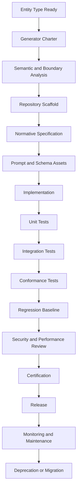
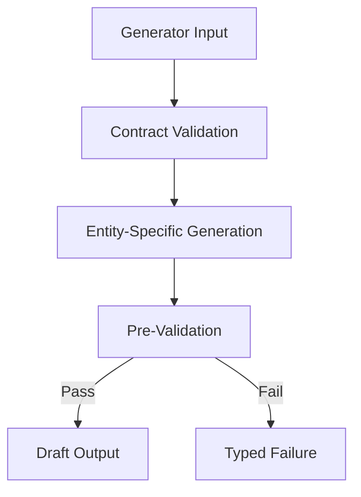
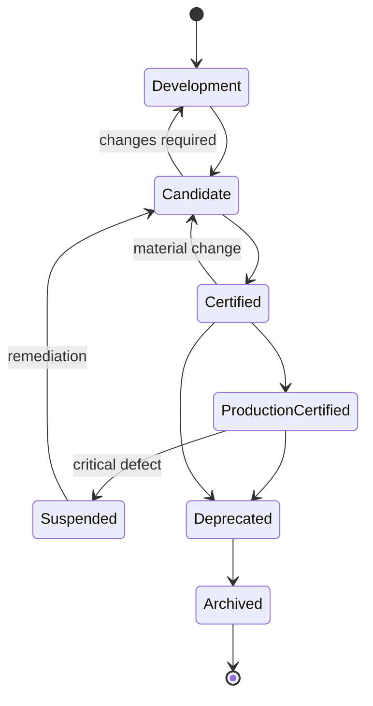
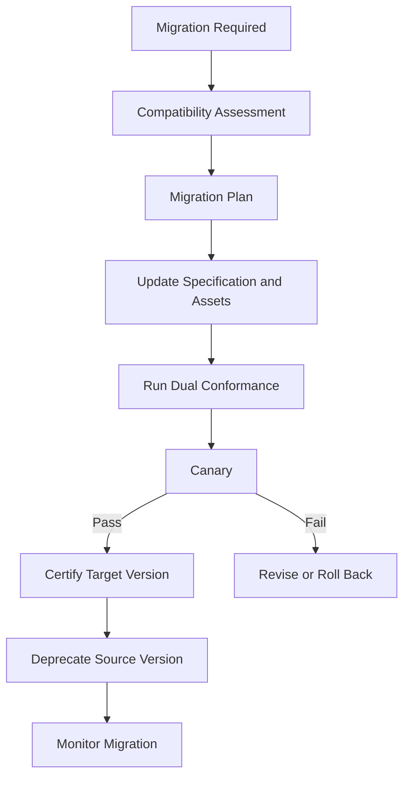

# Generator Development Standard V1

**Product:** KarirGPS  
**Document Type:** Internal Knowledge Engineering Implementation Standard  
**Version:** 1.0.0  
**Status:** Normative Engineering Baseline  
**Standard Owner:** Knowledge Engineering Standards Authority  
**Reference Implementation:** `assets/knowledge/generators/Career_Generator_V1.md`  
**Target Path:** `assets/knowledge/standards/Generator_Development_Standard_V1.md`

---

## 0. Normative Status, Authority, and Standard Boundary

### 0.1 Status

Generator Development Standard V1, hereafter **GDS V1**, is the single authoritative internal engineering standard for designing, documenting, implementing, testing, reviewing, certifying, releasing, maintaining, deprecating, and migrating every KarirGPS Entity Generator created after Career Generator V1.

GDS V1 is:

- an engineering standard;
- an implementation guide;
- a repository and documentation convention;
- a quality and certification contract;
- a human- and AI-readable development specification.

GDS V1 is not:

- a runtime framework;
- a new universal framework;
- part of the KarirGPS Knowledge Operating System execution path;
- a replacement for UEGF;
- a generator;
- a validation engine;
- a Registry;
- a production pipeline;
- a query language;
- an execution engine;
- an evolution framework;
- a compiler framework.

### 0.2 Authority Precedence

Every Entity Generator developed under this standard MUST comply with the following authority order:

1. applicable law, safety, privacy, licensing, and binding rights restrictions;
2. AI Constitution;
3. Career Knowledge Ontology;
4. Knowledge Object Specification;
5. Universal Entity Generator Framework;
6. Universal Knowledge Production Pipeline;
7. Universal Knowledge Validation Framework;
8. Universal Knowledge Registry Framework;
9. Universal Knowledge Language Framework;
10. Universal Knowledge Query Framework;
11. Universal Knowledge Evolution Framework;
12. Universal Knowledge Compilation Framework;
13. Generator Development Standard;
14. approved entity-specific generator specification;
15. approved entity-specific prompt assets;
16. implementation-specific code and deployment configuration.

A generator may specialize existing contracts but MUST NOT redefine, weaken, duplicate, or bypass them.

### 0.3 Normative Terms

- **MUST** and **MUST NOT** indicate mandatory or prohibited requirements.
- **SHOULD** and **SHOULD NOT** indicate recommended requirements that require documented justification when not followed.
- **MAY** indicates an allowed option.
- **CONDITIONAL** indicates a requirement activated by a defined condition.

### 0.4 Standard Invariants

Every generator developed under GDS V1 MUST preserve these invariants:

1. It generates exactly one registered entity type or one explicitly authorized subtype family.
2. It does not create universal framework behavior.
3. It does not own canonical identity.
4. It does not register or publish directly.
5. It does not validate outside UKVF.
6. It does not query backends directly.
7. It does not evolve published knowledge outside UKEF.
8. It does not compile requests outside UKCF.
9. It does not own production lifecycle state.
10. It does not silently create dependent entities.
11. It produces typed outputs, not unstructured prose-only responses.
12. It returns either one valid draft outcome or one typed failure outcome.
13. It preserves evidence, relationship, dependency, confidence, and audit contracts.
14. It is versioned independently from prompts, schemas, tests, and examples.
15. It is implementation-neutral at the specification layer.
16. It has deterministic static contracts even when probabilistic models are used.
17. It has a complete conformance test suite.
18. It cannot be Production Ready without certification evidence.
19. It uses the repository, naming, documentation, testing, and review conventions defined here.
20. It remains maintainable by both humans and AI systems.

### 0.5 Reference Implementation Rule

Career Generator V1 is the first conformant implementation reference.

Future generators SHOULD follow its depth and architectural discipline but MUST use GDS V1 as the normative development standard when a convention differs or becomes more explicit.

---

# 1. Purpose

## 1.1 Primary Purpose

GDS V1 ensures every future Entity Generator is built with the same architecture, repository layout, document structure, prompt discipline, schema conventions, validation integration, testing methodology, release process, and maintenance lifecycle.

## 1.2 Engineering Purpose

The standard eliminates generator-to-generator inconsistency in:

- file organization;
- naming;
- responsibility boundaries;
- input and output envelopes;
- prompt assets;
- error codes;
- retry behavior;
- evidence and relationship handling;
- validation profiles;
- documentation;
- tests;
- certification.

## 1.3 AI Development Purpose

The standard gives AI engineering agents enough explicit structure to:

- scaffold a new generator;
- identify missing files;
- generate specification sections in the correct order;
- create prompt assets;
- generate tests;
- run static checks;
- prepare certification evidence;
- maintain existing generators without architectural drift.

## 1.4 Organizational Purpose

GDS V1 is the common contract used by:

- Knowledge Architects;
- Ontology Engineers;
- Generator Engineers;
- Prompt Engineers;
- Validation Engineers;
- Registry Engineers;
- Production Engineers;
- QA Engineers;
- Security Reviewers;
- AI coding agents;
- Release Managers;
- Auditors.

---

# 2. Scope

## 2.1 In Scope

GDS V1 governs:

- generator repository structure;
- generator specification documents;
- prompt files and versions;
- input and output schema assets;
- relationship and evidence conventions;
- error, retry, logging, and audit contracts;
- diagrams and examples;
- source-code organization when executable implementations exist;
- unit, integration, conformance, and regression testing;
- CI/CD readiness;
- certification;
- maintenance;
- deprecation;
- migration.

## 2.2 Covered Generators

The standard applies to generators for:

- Career;
- Skill;
- Competency;
- Work Task;
- Work Activity;
- Work Environment;
- Industry;
- Technology;
- Tool;
- Organization;
- Company;
- University;
- Education Program;
- Major;
- Certification;
- License;
- Learning Resource;
- Regulation;
- AI Trend;
- Labor Market Assertion;
- Salary Observation;
- Opportunity;
- Assessment;
- every future registered entity type.

## 2.3 Conditional Scope

The standard also applies to subtype generators when:

- the subtype has specialized evidence or validation requirements;
- the subtype has a separate registered generator;
- the subtype has materially different prompts or output rules.

## 2.4 Out of Scope

GDS V1 does not govern:

- universal framework architecture;
- Ontology semantics;
- KOS core schema;
- UKPP runtime implementation;
- UKVF validator implementation;
- UKR storage implementation;
- UKL grammar;
- UKQF backend adapters;
- UKEF governance behavior;
- UKCF compiler behavior.

---

# 3. Design Philosophy

## 3.1 Uniformity Over Local Preference

A predictable generator ecosystem is more valuable than local stylistic preference.

## 3.2 Contracts Before Code

Engineers MUST define:

- semantic scope;
- boundaries;
- inputs;
- outputs;
- evidence;
- relationships;
- dependencies;
- validation;
- error behavior

before implementing prompts or code.

## 3.3 Specification Before Automation

The normative Markdown specification is approved before production automation is certified.

## 3.4 Entity Specificity Without Architectural Reinvention

Each generator specializes UEGF for one entity type.

It does not recreate universal orchestration, validation, Registry, query, evolution, or compilation responsibilities.

## 3.5 Typed Artifacts Over Informal Text

Inputs, outputs, failures, diagnostics, logs, prompts, and test fixtures use typed contracts.

## 3.6 Evidence Before Narrative

Prompt and generation design starts from evidence and claims rather than from polished prose.

## 3.7 Deterministic Interfaces, Probabilistic Internals

A generator may use probabilistic models internally, but:

- accepted input schema;
- output schema;
- error schema;
- prompt identifiers;
- validation gates;
- version contracts

remain deterministic.

## 3.8 Certification Before Production

A generator is not Production Ready because its sample output appears plausible.

It must pass the complete acceptance and certification process.

---

# 4. Engineering Principles

## 4.1 Single Entity Responsibility

Each generator MUST have one primary Ontology entity type.

## 4.2 Explicit Non-Responsibilities

Every specification MUST list prohibited responsibilities.

## 4.3 Stable Folder Contract

All generators MUST use the repository structure defined in Section 6.

## 4.4 Stable Document Contract

All generator specifications MUST use the section ordering defined in Sections 8–10.

## 4.5 Framework Binding

Every generator MUST declare explicit bindings to:

- AI Constitution;
- Ontology;
- KOS;
- UEGF;
- UKPP;
- UKVF;
- UKR;
- UKL;
- UKQF;
- UKEF;
- UKCF.

## 4.6 No Direct Backend Access

Generator implementations MUST NOT directly call storage engines, graph databases, vector stores, or search indexes for semantic discovery.

Discovery is compiled through UKL and UKQF.

## 4.7 No Direct Registry Mutation

All identity and registration operations are owned by UKR and orchestrated through UKPP or UKCF.

## 4.8 Explicit Failure

A generator MUST fail with a typed failure when it cannot produce a conformant draft.

## 4.9 No Silent Repair

A generator MAY execute an authorized repair attempt but MUST NOT conceal prior findings or change scope without authorization.

## 4.10 Code Convention Principles

Executable code SHOULD be:

- modular;
- stateless where practical;
- side-effect limited;
- dependency injected;
- typed;
- deterministic at boundaries;
- independently testable;
- observable;
- free from vendor lock-in at the domain layer.

## 4.11 AI-Friendly Source Design

Files SHOULD:

- use descriptive names;
- keep one major concept per file;
- avoid hidden conventions;
- include examples;
- use stable identifiers;
- avoid ambiguous abbreviations;
- include machine-checkable metadata.

## 4.12 Implementation Coding Convention

When executable code is provided, it MUST separate these logical modules:

1. contract loading;
2. input normalization;
3. entity-specific rule evaluation;
4. prompt rendering;
5. model or executor invocation;
6. output parsing;
7. generator pre-validation;
8. typed outcome construction;
9. telemetry and audit emission.

The implementation MUST NOT place all behavior in one prompt or one monolithic function.

## 4.13 Interface Convention

Public implementation interfaces SHOULD use technology-neutral operations equivalent to:

```text
validate_input(input_package) -> validation_result
render_prompt(validated_input, mode) -> prompt_invocation
execute(invocation, qualified_lane) -> raw_attempt
parse_attempt(raw_attempt) -> parsed_candidate
pre_validate(parsed_candidate) -> pre_validation_result
build_outcome(candidate_or_failure) -> generator_outcome
```

Framework adapters SHOULD be injected through interfaces rather than instantiated inside domain logic.

## 4.14 Configuration Convention

The following MUST be configuration or manifest values rather than hard-coded domain logic:

- generator and prompt versions;
- schema IDs;
- supported modes;
- qualified model lanes;
- timeouts;
- retry limits;
- evidence thresholds;
- UKVF profiles;
- feature flags;
- deprecation status.

## 4.15 Code Quality Rules

Executable implementations MUST:

- use explicit types at public boundaries;
- reject unknown enum values safely;
- avoid mutable global state;
- use deterministic serialization;
- isolate vendor SDKs in adapter modules;
- map vendor errors to generator error codes;
- include bounded timeouts;
- support cancellation where the runtime permits;
- avoid logging raw restricted inputs;
- keep entity-specific rules independently testable.

Generated code is subject to the same review and test requirements as human-written code.

---

# 5. Generator Development Lifecycle

## 5.1 Lifecycle Stages

1. Entity Type Readiness
2. Generator Charter
3. Semantic Analysis
4. Repository Scaffolding
5. Specification Drafting
6. Prompt Design
7. Schema and Fixture Design
8. Reference Implementation
9. Unit Testing
10. Integration Testing
11. Conformance Testing
12. Regression Baseline
13. Security Review
14. Performance Qualification
15. Documentation Review
16. Certification
17. Release
18. Monitoring
19. Maintenance
20. Deprecation or Migration

## 5.2 Lifecycle Diagram



## 5.3 Entry Criteria

Development MUST NOT begin until:

- entity type exists in the Ontology;
- KOS can represent the object;
- UEGF extension requirements are understood;
- required UKVF profiles exist or are planned;
- UKR can register the object type;
- UKCF can bind the generator after implementation.

## 5.4 Exit Criteria

A generator exits development only after:

- certification criteria pass;
- version is tagged;
- production artifacts are immutable;
- release notes exist;
- monitoring ownership is assigned.

---

# 6. Generator Folder Structure

## 6.1 Canonical Repository Layout

```text
assets/
└── knowledge/
    ├── generators/
    │   ├── career/
    │   │   ├── Career_Generator_V1.md
    │   │   ├── generator.yaml
    │   │   ├── schemas/
    │   │   │   ├── career_generator_input_v1.schema.json
    │   │   │   ├── career_generator_output_v1.schema.json
    │   │   │   ├── career_generator_failure_v1.schema.json
    │   │   │   └── career_relationship_entry_v1.schema.json
    │   │   ├── prompts/
    │   │   │   ├── system/
    │   │   │   │   └── career_system_v1.md
    │   │   │   ├── create/
    │   │   │   │   └── career_create_v1.md
    │   │   │   ├── revise/
    │   │   │   │   └── career_revise_v1.md
    │   │   │   ├── localize/
    │   │   │   │   └── career_localize_v1.md
    │   │   │   ├── repair/
    │   │   │   │   └── career_repair_v1.md
    │   │   │   └── evolution/
    │   │   │       └── career_evolution_successor_v1.md
    │   │   ├── examples/
    │   │   │   ├── inputs/
    │   │   │   ├── outputs/
    │   │   │   ├── failures/
    │   │   │   └── validation/
    │   │   ├── tests/
    │   │   │   ├── unit/
    │   │   │   ├── integration/
    │   │   │   ├── conformance/
    │   │   │   ├── regression/
    │   │   │   ├── security/
    │   │   │   └── performance/
    │   │   ├── fixtures/
    │   │   ├── certification/
    │   │   │   ├── certification_manifest.yaml
    │   │   │   ├── test_report.json
    │   │   │   ├── review_record.md
    │   │   │   └── release_evidence/
    │   │   ├── implementation/
    │   │   │   ├── README.md
    │   │   │   └── <technology-specific implementation files>
    │   │   ├── CHANGELOG.md
    │   │   ├── MIGRATION.md
    │   │   └── README.md
    │   ├── skill/
    │   ├── competency/
    │   ├── work_task/
    │   ├── work_activity/
    │   ├── work_environment/
    │   ├── industry/
    │   ├── technology/
    │   ├── tool/
    │   ├── organization/
    │   ├── education_program/
    │   ├── major/
    │   ├── certification/
    │   ├── license/
    │   ├── learning_resource/
    │   ├── regulation/
    │   ├── ai_trend/
    │   ├── labor_market_assertion/
    │   ├── salary_observation/
    │   └── opportunity/
    ├── standards/
    │   └── Generator_Development_Standard_V1.md
    ├── ontology/
    ├── specifications/
    ├── prompts/
    │   └── shared/
    ├── examples/
    │   └── shared/
    └── frameworks/
```

## 6.2 Root Specification Compatibility

Existing flat files such as:

`assets/knowledge/generators/Career_Generator_V1.md`

remain valid.

New development SHOULD use the entity directory structure. A compatibility link, index, or canonical file location MAY be maintained at the flat path when repository policy requires it.

## 6.3 Mandatory Directories

For every new generator:

- `schemas/`;
- `prompts/`;
- `examples/`;
- `tests/`;
- `fixtures/`;
- `certification/`.

`implementation/` is mandatory when executable code exists.

## 6.4 Prohibited Layout

Generator-specific prompts, schemas, and tests MUST NOT be placed in unrelated framework directories.

## 6.5 Shared Assets

Shared assets may exist only when:

- semantics are genuinely universal across generators;
- ownership is explicit;
- versioning is independent;
- generator specifications declare the dependency.

Shared assets MUST NOT become an undocumented universal framework.

---

# 7. File Naming Convention

## 7.1 Generator Specification

```text
<EntityName>_Generator_V<Major>.md
```

Examples:

- `Skill_Generator_V1.md`
- `Technology_Generator_V1.md`
- `Learning_Resource_Generator_V1.md`

## 7.2 Entity Directory

Use lowercase `snake_case`.

Examples:

- `learning_resource/`
- `work_environment/`
- `salary_observation/`

## 7.3 Prompt Files

```text
<entity>_<mode>_v<major>[.<minor>[.<patch>]].md
```

Examples:

- `skill_create_v1.md`
- `skill_create_v1.1.md`
- `skill_repair_v1.1.2.md`

## 7.4 Schema Files

```text
<entity>_generator_<contract>_v<major>.schema.json
```

## 7.5 Test Files

```text
test_<entity>_<behavior>_<case_id>.<extension>
```

Examples:

- `test_skill_identity_exact_001.yaml`
- `test_skill_missing_evidence_004.json`

## 7.6 Fixture Files

```text
fixture_<entity>_<scenario>_<version>.<extension>
```

## 7.7 Certification Files

Use stable names:

- `certification_manifest.yaml`;
- `test_report.json`;
- `review_record.md`;
- `security_review.md`;
- `performance_report.json`.

## 7.8 Case Rules

- Markdown specification names use PascalCase entity names and underscores.
- Directories and implementation assets use lowercase snake_case.
- JSON/YAML keys use lowercase snake_case.
- Error codes use uppercase kebab-separated segments.

---

# 8. Markdown Document Structure

## 8.1 Document Header

Every generator specification MUST begin with:

- title;
- product;
- document type;
- generator version;
- status;
- entity type;
- object kind;
- UEGF baseline;
- target path;
- owners;
- certification status.

## 8.2 Normative Section Zero

Every generator MUST include:

`## 0. Normative Status, Inheritance, and Generator Boundary`

It MUST define:

- status;
- authority precedence;
- normative terms;
- generator authority;
- invariants;
- entity boundary.

## 8.3 Heading Rules

- One H1 document title.
- H2 for numbered top-level sections.
- H3 for subsections.
- H4 only when required.
- No skipped heading levels.
- Numbered top-level sections remain stable within a major version.

## 8.4 Code Blocks

Every code block MUST declare a language when one exists:

- `yaml`;
- `json`;
- `mermaid`;
- `text`;
- `ukl`.

## 8.5 Tables

Tables SHOULD be used for:

- authority mappings;
- input fields;
- output fields;
- error codes;
- validation gates;
- test matrices;
- compatibility.

## 8.6 Checklist Syntax

Use:

```text
- [ ] Requirement
```

for engineering checklists.

Use Unicode boxes only in copied user-facing summaries, not normative files.

---

# 9. Section Ordering Standard

Every generator specification MUST use this canonical top-level order:

1. Purpose
2. Scope
3. Responsibilities
4. Non-Responsibilities
5. Supported Object Types and Generation Modes
6. Architecture and Framework Bindings
7. Required Inputs
8. Input Schema
9. Required Outputs
10. Output Schema and Canonical Entity Contract
11. Generation Pipeline
12. Generator State Machine
13. Sequence Diagrams
14. Prompt Templates
15. Entity Identity and Scope Rules
16. Naming and Localization Strategy
17. Entity Core Generation Rules
18. Entity-Specific Semantic Rules
19. Relationship Generation
20. Dependency Handling
21. Evidence Requirements
22. Claim, Confidence, Conflict, and Uncertainty
23. Validation Integration
24. Registry Integration
25. Evolution Integration
26. Localization Strategy
27. Versioning Strategy
28. Failure Modes
29. Retry Rules
30. Quality Gates
31. Performance Targets
32. Security Considerations
33. Observability and Audit
34. Example Input Requests
35. Example Generated Objects
36. Example Failure Outputs
37. End-to-End Generation Example
38. Validation Examples
39. Error Handling Examples
40. Conformance Tests
41. Production Readiness Checklist
42. Acceptance Criteria
43. Closing Standard

Additional sections MAY be inserted only after the closest related mandatory section.

Existing Career Generator V1 remains conformant even though its detailed numbering is more extensive.

---

# 10. Mandatory Sections

Every generator MUST include all of the following content, whether as top-level or clearly identified subsections:

- purpose;
- scope;
- responsibilities;
- non-responsibilities;
- supported object type;
- supported generation modes;
- framework binding matrix;
- input contract;
- output contract;
- pipeline;
- state machine;
- prompt templates;
- identity rules;
- entity boundary rules;
- naming;
- localization;
- evidence;
- relationships;
- dependencies;
- confidence;
- validation;
- Registry;
- evolution;
- versioning;
- failures;
- retries;
- quality gates;
- performance;
- security;
- audit;
- examples;
- tests;
- production checklist;
- acceptance criteria.

A generator specification is incomplete if any mandatory topic is absent, even when an implementation exists.

---

# 11. Optional Sections

Optional sections include:

- regulated-domain requirements;
- jurisdictional variants;
- quantitative methodology;
- statistical methodology;
- multimodal input handling;
- extraction profiles;
- import profiles;
- institutional contributor behavior;
- model-lane recommendations;
- specialized human review;
- deprecated legacy behavior;
- implementation notes.

Optional sections MUST NOT redefine universal framework behavior.

---

# 12. Prompt Design Standard

## 12.1 Prompt Layers

Each generator SHOULD use separate prompt assets for:

1. system contract;
2. generation mode;
3. entity-specific instructions;
4. repair;
5. localization;
6. evolution successor;
7. optional review assistance.

## 12.2 System Prompt Requirements

The system prompt MUST include:

- generator identity and version;
- entity type;
- object kind;
- authority boundaries;
- prohibited actions;
- exact output schema requirement;
- evidence discipline;
- relationship discipline;
- failure behavior;
- no-registration and no-publication rule;
- no hidden framework redefinition.

## 12.3 Invocation Prompt Requirements

Each invocation template MUST define:

- mode;
- expected input variables;
- required evidence package;
- target identity disposition;
- output outcome;
- unresolved input behavior;
- quality gate behavior.

## 12.4 Prompt Prohibitions

Prompts MUST NOT:

- ask a model to “use its own knowledge” as evidence;
- permit fabricated citations;
- permit undefined fields;
- permit direct identity creation;
- instruct direct publication;
- conceal uncertainty;
- merge dependent objects into the entity payload;
- request private chain of thought;
- contain secrets;
- include vendor-specific behavior in the normative contract.

## 12.5 Prompt Variable Convention

Variables use:

```text
{{lower_snake_case_variable}}
```

Examples:

- `{{generator_request}}`
- `{{identity_resolution}}`
- `{{evidence_bundle}}`
- `{{dependency_manifest}}`

## 12.6 Prompt Output Contract

Prompts MUST require one of:

- `successful_draft`;
- `typed_failure`.

Mixed free-text and structured output is prohibited unless the explanatory text is inside a declared schema field.

## 12.7 Prompt Self-Check

The model MAY be instructed to perform an internal contract check, but the authoritative validation remains external.

---

# 13. Prompt Versioning

## 13.1 Independent Version

Prompt versions are independent from generator versions.

## 13.2 Semantic Versioning

Prompt MAJOR changes include:

- output meaning change;
- required input change;
- field interpretation change;
- generation-mode behavior change.

Prompt MINOR changes include:

- compatible instruction strengthening;
- new optional examples;
- clearer constraints.

Prompt PATCH changes include:

- typo correction;
- nonsemantic wording;
- formatting.

## 13.3 Prompt Compatibility

The generator manifest MUST declare compatible prompt versions.

## 13.4 Prompt Lock

Each generation attempt records the exact prompt asset version and fingerprint.

## 13.5 Prompt Promotion

Prompt changes move through:

- draft;
- review;
- canary;
- approved;
- active;
- deprecated;
- archived.

---

# 14. Prompt Naming

## 14.1 Canonical Prompt IDs

```text
prompt:<entity>:<mode>:<semantic_version>
```

Example:

```text
prompt:skill:create:1.2.0
```

## 14.2 Prompt Modes

Standard modes:

- `system`;
- `create`;
- `revise`;
- `enrich`;
- `localize`;
- `evidence_refresh`;
- `repair`;
- `evolution_successor`.

Generators MUST NOT invent a new mode when an existing UEGF mode applies.

## 14.3 Human-Readable Title

Each prompt file begins with metadata identifying:

- Prompt ID;
- generator;
- mode;
- version;
- status;
- compatible generator versions;
- owner.

---

# 15. Prompt Folder Structure

```text
prompts/
├── system/
├── create/
├── revise/
├── enrich/
├── localize/
├── evidence_refresh/
├── repair/
└── evolution/
```

Only modes supported by the generator require files.

Prompt examples and tests MUST NOT be stored inside active prompt files.

Shared prompt fragments SHOULD be avoided unless duplication creates a material maintenance risk. When used, they must be versioned and declared in the generator manifest.

---

# 16. Output Schema Convention

## 16.1 Outcome Envelope

Every generator output MUST use a discriminated union:

```yaml
outcome: successful_draft | typed_failure
generator_id: string
generator_version: semver
attempt_id: string
compilation_id: string
production_case_id: string
```

## 16.2 Successful Draft Envelope

```yaml
outcome: successful_draft
generator:
  id: generator:skill
  version: 1.0.0
  prompt_id: prompt:skill:create:1.0.0
  model_lane: qualified_lane_reference
target:
  object_kind: entity_object
  entity_type: Skill
  entity_id: provisional_or_resolved_reference
  object_id: optional_existing_reference
  base_revision_id: optional_reference
draft:
  schema_version: skill_generator_output_v1
  semantic_version: 1.0.0
  payload: {}
evidence_manifest: []
relationship_manifest: []
dependency_manifest: []
confidence_summary: {}
pre_validation:
  status: pass | pass_with_warnings | fail
  findings: []
audit:
  input_fingerprint: string
  output_fingerprint: string
  generated_at: datetime
```

## 16.3 Typed Failure Envelope

```yaml
outcome: typed_failure
generator:
  id: generator:skill
  version: 1.0.0
attempt_id: string
failure:
  code: SKILL-GEN-IDENTITY-001
  category: identity
  severity: blocker
  message: string
  retryability: changed_input_only
  affected_fields: []
  remediation: []
audit:
  input_fingerprint: string
  failed_at: datetime
```

## 16.4 Schema Requirements

Schemas MUST:

- use JSON Schema or an approved technology-neutral logical schema representation;
- reject undeclared top-level fields;
- distinguish required, optional, conditional, unknown, and not-applicable values;
- preserve references as typed IDs;
- avoid embedding dependent canonical objects;
- include schema version.

## 16.5 Schema Ownership

The generator owns only its entity-specific output schema extension.

KOS owns universal object semantics.

---

# 17. Relationship Convention

## 17.1 Relationship Entry

```yaml
predicate: requires_skill
source_ref:
  entity_id: entity:career:example
target_ref:
  entity_id: entity:skill:example
direction: outgoing
status: proposed
strength: strong
requirement_level: commonly_required
context:
  geography_ref: geography:country:ID
  valid_from: 2026-01-01
evidence_refs:
  - evidence:example
confidence: medium_high
```

## 17.2 Predicate Rule

Only Ontology-registered predicates may be emitted.

## 17.3 Reference Rule

Relationships reference canonical or approved provisional IDs.

They MUST NOT embed full dependent object payloads.

## 17.4 Direction Rule

Direction MUST follow Ontology semantics.

## 17.5 Context Rule

Context-dependent relationships MUST include geography, time, jurisdiction, or other relevant dimensions.

## 17.6 Relationship Failure

Unresolved mandatory relationship targets produce:

- typed failure;
- provisional reference when permitted;
- dependency block.

## 17.7 No Graph Inflation

Generators emit only evidence-supported, semantically useful relationships.

---

# 18. Evidence Convention

## 18.1 Evidence Package

Every material claim must map to one or more evidence entries.

## 18.2 Evidence Entry

```yaml
evidence_ref: evidence:example
source_ref: source:example
claim_scope:
  - payload.definition
  - relationships[0]
source_location:
  locator: section_or_page
evidence_type: official | primary | secondary | dataset | standard
quality: high | medium_high | medium | low
independence_group: publisher_or_method_group
valid_time:
  from: 2025-01-01
  to: null
rights:
  usage_status: permitted
```

## 18.3 Evidence Minimums

Each generator specification MUST define:

- material claim categories;
- preferred source classes;
- minimum source count where applicable;
- independence expectations;
- recency policy;
- conflict handling;
- rights requirements.

## 18.4 Evidence Prohibitions

Generators MUST NOT:

- invent Source IDs;
- cite inaccessible or unseen content as verified;
- treat search snippets as complete evidence;
- copy source claims without scope;
- use generated text as primary evidence.

## 18.5 Missing Evidence

Use typed values:

- `unknown`;
- `insufficient_evidence`;
- `not_available`;
- `not_applicable`;
- `disputed`.

Do not fill gaps with plausible prose.

---

# 19. Validation Convention

## 19.1 Generator Pre-Validation

Generators MUST perform deterministic pre-validation for:

- input completeness;
- output schema;
- entity type;
- prohibited fields;
- reference shape;
- evidence references;
- confidence vocabulary;
- internal consistency;
- audit metadata.

## 19.2 UKVF Authority

Generator pre-validation is not UKVF validation.

The generator output remains a Draft until UKVF runs.

## 19.3 Validation Plan Declaration

Every generator specification MUST list:

- required UKVF profiles;
- required validator types;
- entity-specific blockers;
- warning rules;
- human-review triggers;
- repair eligibility.

## 19.4 Validation Finding Reference

Generator repair inputs consume structured finding references, not informal summaries alone.

## 19.5 Validation Example

```yaml
validation_plan:
  profiles:
    - universal_core
    - entity_object
    - publication
  required_validators:
    - structural
    - ontology
    - identity
    - evidence
    - source
    - relationship
    - semantic
    - constitutional
  non_waivable_blockers:
    - fabricated_source
    - invalid_entity_type
    - prohibited_personal_inference
```

---

# 20. Error Convention

## 20.1 Error Code Format

```text
<ENTITY>-GEN-<CATEGORY>-<NUMBER>
```

Examples:

- `SKILL-GEN-INPUT-001`
- `TECH-GEN-IDENTITY-004`
- `CERT-GEN-EVIDENCE-006`

## 20.2 Standard Categories

- INPUT
- CONTRACT
- IDENTITY
- SCOPE
- ONTOLOGY
- EVIDENCE
- SOURCE
- RELATIONSHIP
- DEPENDENCY
- LOCALIZATION
- SECURITY
- GENERATION
- VALIDATION
- EVOLUTION
- INTERNAL

## 20.3 Error Fields

Every error includes:

- code;
- category;
- severity;
- message;
- affected field or node;
- retryability;
- remediation;
- evidence or finding reference;
- attempt ID;
- correlation ID.

## 20.4 Severity

- information;
- warning;
- error;
- blocker;
- security_critical.

## 20.5 Error Stability

Published error codes MUST NOT be reused for different meanings.

---

# 21. Retry Convention

## 21.1 Retry Classes

- same-input transient retry;
- changed-input retry;
- repair retry;
- dependency-resolution retry;
- no retry.

## 21.2 Same-Input Retry

Allowed only for transient infrastructure or model-service failure.

## 21.3 Changed-Input Retry

Required after:

- added evidence;
- resolved identity;
- corrected dependency;
- changed scope;
- new validation finding context.

## 21.4 Repair Retry

Uses:

- prior output;
- exact UKVF findings;
- allowed repair scope;
- same target identity.

## 21.5 No-Retry Conditions

- constitutional prohibition;
- invalid entity type;
- unsupported generator mode;
- non-waivable security failure;
- missing qualified generator;
- unresolved identity conflict requiring governance.

## 21.6 Retry Limits

Each generator specification MUST define bounded retry limits.

## 21.7 Retry Audit

Every retry records changed conditions.

Blind repetition of deterministic failures is prohibited.

---

# 22. Logging Convention

## 22.1 Log Classes

- request admission;
- input validation;
- identity context;
- prompt selection;
- model invocation;
- pre-validation;
- failure;
- retry;
- output completion;
- security;
- performance.

## 22.2 Structured Log Fields

```yaml
timestamp: datetime
severity: info
generator_id: generator:skill
generator_version: 1.0.0
attempt_id: string
compilation_id: string
production_case_id: string
event: output_schema_validated
target_ref: entity_or_provisional_reference
duration_ms: 123
correlation_id: string
```

## 22.3 Prohibited Log Content

Logs MUST NOT contain:

- raw credentials;
- secrets;
- unnecessary personal data;
- full restricted evidence;
- private chain of thought;
- unrestricted source content;
- hidden model system prompts when policy prohibits exposure.

## 22.4 Log Stability

Event names and core fields are versioned.

---

# 23. Audit Convention

## 23.1 Audit Chain

Request → Input Package → Prompt Version → Model Lane → Draft or Failure → Pre-Validation → UKVF → UKR → UKPP Release.

## 23.2 Required Audit Metadata

- generator and prompt version;
- exact input fingerprint;
- evidence manifest;
- identity context;
- dependencies;
- model configuration reference;
- output fingerprint;
- failure or success;
- retries;
- timestamps;
- actor and service;
- framework correlation IDs.

## 23.3 Audit Immutability

Corrections create new audit records.

## 23.4 Explanation Boundary

Audit stores:

- rules;
- mappings;
- findings;
- decisions;
- evidence;
- outputs.

It does not store private chain of thought.

---

# 24. Diagram Convention

## 24.1 Required Diagrams

Each generator specification MUST include:

- architecture diagram;
- generation pipeline;
- generator state machine;
- new-object sequence diagram;
- published-object evolution sequence when evolution is supported;
- retry or failure flow;
- dependency or relationship diagram.

## 24.2 Diagram Purpose

Each diagram must represent a distinct architectural view.

Duplicate decorative diagrams are prohibited.

## 24.3 Diagram Titles

Provide a heading immediately before each diagram.

## 24.4 Diagram Consistency

Diagram labels MUST use the same framework, state, and artifact names used in the text.

## 24.5 Accessibility

Complex diagrams SHOULD be followed by a short textual interpretation.

---

# 25. Mermaid Diagram Standard

## 25.1 Supported Types

- `flowchart`;
- `stateDiagram-v2`;
- `sequenceDiagram`;
- `graph`;
- `timeline`.

## 25.2 Syntax Rules

- use stable short node IDs;
- quote labels containing punctuation;
- avoid vendor-specific extensions;
- keep node text concise;
- use direction consistently;
- avoid colors as semantic requirements;
- avoid styling that is required to understand meaning.

## 25.3 Example



## 25.4 State Diagram Rule

States in diagrams MUST match the textual state list exactly.

## 25.5 Sequence Diagram Rule

Framework ownership must be accurate.

A generator MUST NOT be shown directly publishing or registering itself.

---

# 26. YAML Example Standard

## 26.1 Purpose

YAML examples are human-readable contract examples.

## 26.2 Rules

- two-space indentation;
- lowercase snake_case keys;
- quoted strings only when needed;
- ISO 8601 dates;
- no tabs;
- no anchors or aliases in normative examples;
- explicit `null` when semantically relevant;
- typed ID references.

## 26.3 Completeness Labels

Examples MUST be labeled:

- minimal;
- complete;
- partial;
- invalid;
- failure.

## 26.4 Placeholder Rule

Use clearly nonproduction placeholders:

```yaml
entity_id: entity:skill:example
```

Do not use realistic-looking fabricated IDs without marking them conceptual.

---

# 27. JSON Example Standard

## 27.1 Purpose

JSON examples demonstrate machine interchange and schema validity.

## 27.2 Rules

- valid strict JSON;
- double quotes;
- no comments;
- no trailing commas;
- lowercase snake_case keys;
- deterministic key order in canonical fixtures;
- UTF-8;
- ISO 8601 dates.

## 27.3 Canonical Key Order

Recommended order:

1. outcome;
2. generator;
3. target;
4. draft or failure;
5. evidence;
6. relationships;
7. dependencies;
8. confidence;
9. validation;
10. audit.

## 27.4 Validation

All JSON examples in a released generator MUST validate against their declared schema.

---

# 28. Naming Rules

## 28.1 Entity Names

Use the exact Ontology class name in normative text.

## 28.2 Generator ID

```text
generator:<entity_snake_case>
```

## 28.3 Contract IDs

Examples:

- `schema:skill_generator_input:1`;
- `schema:skill_generator_output:1`;
- `profile:skill_generator_publication:1`.

## 28.4 Internal Code Names

Implementation classes and modules SHOULD mirror semantic names without inventing synonyms.

## 28.5 Abbreviations

Avoid abbreviations unless:

- globally recognized;
- defined at first use;
- unambiguous.

## 28.6 Boolean Names

Use affirmative names:

- `is_regulated`;
- `has_complete_evidence`.

Avoid double negatives.

---

# 29. Terminology Rules

## 29.1 Required Distinctions

Specifications MUST distinguish:

- entity versus object;
- Object ID versus Entity ID;
- object versus revision;
- generator versus model;
- prompt versus generator;
- validation versus pre-validation;
- registered versus published;
- relationship versus dependency;
- evidence versus source;
- claim versus narrative;
- confidence versus validation outcome;
- retry versus repair;
- revision versus evolution;
- alias versus synonym;
- localization versus translation.

## 29.2 Prohibited Ambiguous Terms

Avoid:

- “database ID” for canonical ID;
- “AI knowledge” for unvalidated model output;
- “approved” without naming the approving framework or role;
- “verified” without validation scope;
- “complete” without a checklist or profile;
- “automatic publish”;
- “self-healing” when human or framework controls are required.

## 29.3 Capitalization

Capitalize formal framework names, Ontology classes, KOS object kinds, and defined states consistently.

---

# 30. Versioning Rules

## 30.1 Versioned Assets

Version independently:

- generator specification;
- generator implementation;
- prompt assets;
- input schema;
- output schema;
- failure schema;
- relationship schema;
- tests;
- fixtures;
- certification;
- examples.

## 30.2 Version Declaration

Every released asset declares:

- semantic version;
- status;
- compatibility;
- owner;
- release date;
- superseded version.

## 30.3 Immutable Release

Released versioned assets are immutable.

Corrections create a new version.

## 30.4 Version Manifest

`generator.yaml` declares all active asset versions.

Example:

```yaml
generator_id: generator:skill
generator_version: 1.0.0
specification: Skill_Generator_V1.md
uegf_version: 1.0
ontology_version: 1.0
kos_version: 1.0
schemas:
  input: skill_generator_input_v1
  output: skill_generator_output_v1
  failure: skill_generator_failure_v1
prompts:
  system: prompt:skill:system:1.0.0
  create: prompt:skill:create:1.0.0
tests:
  conformance_suite: skill_generator_conformance_v1
status: active
```

---

# 31. Semantic Versioning

## 31.1 MAJOR

Increase MAJOR when:

- supported entity boundary changes incompatibly;
- required input contract changes incompatibly;
- output semantics change incompatibly;
- generation modes are removed;
- framework binding changes require consumer migration;
- error semantics change incompatibly.

## 31.2 MINOR

Increase MINOR when:

- backward-compatible optional fields are added;
- compatible generation mode is added;
- evidence or relationship rules are strengthened compatibly;
- new prompt templates are added;
- new diagnostics are added.

## 31.3 PATCH

Increase PATCH when:

- documentation is clarified;
- prompt wording changes without semantic behavior change;
- examples or tests are corrected;
- nonsemantic implementation defects are fixed.

## 31.4 Major File Name

The main normative file name includes the major version only:

`Skill_Generator_V1.md`

The full semantic version is declared inside the file and manifest.

---

# 32. Backward Compatibility Rules

## 32.1 Compatibility Targets

Assess compatibility for:

- UKCF bindings;
- UKPP invocation package;
- UKVF profiles;
- UKR registration preparation;
- prompt variables;
- schema consumers;
- test fixtures;
- package builders.

## 32.2 Backward-Compatible Changes

Normally include:

- optional output field;
- new warning code;
- additional evidence metadata;
- stricter internal pre-validation that does not reject previously valid conformant inputs without justification.

## 32.3 Breaking Changes

Include:

- required input addition without default;
- output field removal;
- changed field meaning;
- changed entity boundary;
- changed reference type;
- changed failure outcome behavior;
- changed generation-mode semantics.

## 32.4 Compatibility Matrix

Every MINOR or MAJOR release MUST include a matrix of supported prior contracts.

## 32.5 Adapter Rule

Compatibility adapters MAY exist outside the generator when authorized.

The generator MUST NOT silently reinterpret old input.

---

# 33. Documentation Rules

## 33.1 Documentation Set

Every generator repository MUST contain:

- normative specification;
- README;
- CHANGELOG;
- MIGRATION;
- prompt documentation;
- schemas;
- examples;
- test documentation;
- certification record.

## 33.2 README Content

- generator purpose;
- entity type;
- current version;
- supported modes;
- repository map;
- how to validate assets;
- certification status;
- owner.

## 33.3 CHANGELOG Format

Use sections:

- Added;
- Changed;
- Deprecated;
- Removed;
- Fixed;
- Security.

## 33.4 MIGRATION Content

For breaking changes:

- source version;
- target version;
- input changes;
- output changes;
- prompt changes;
- schema changes;
- error changes;
- test changes;
- rollout;
- rollback.

## 33.5 Documentation Accuracy

Documentation is tested as part of CI where practical:

- links;
- file paths;
- code blocks;
- JSON/YAML validity;
- schema references;
- Mermaid parsing.

---

# 34. Review Checklist

Before implementation review:

- [ ] Entity type exists in Ontology.
- [ ] KOS object representation is confirmed.
- [ ] Generator boundary is explicit.
- [ ] Responsibilities do not duplicate frameworks.
- [ ] Supported modes are declared.
- [ ] Required inputs are complete.
- [ ] Output envelope is typed.
- [ ] Evidence rules are entity-specific.
- [ ] Relationship predicates are valid.
- [ ] Dependencies are explicit.
- [ ] UKVF profiles are mapped.
- [ ] UKR operations are preparatory only.
- [ ] UKEF triggers are correct.
- [ ] UKL/UKQF discovery requirements are defined.
- [ ] UKCF binding requirements are defined.
- [ ] Prompt templates follow the standard.
- [ ] Failure and retry behavior is complete.
- [ ] Security and audit sections are complete.
- [ ] Diagrams match text.
- [ ] Examples are schema-valid.

---

# 35. Generator Acceptance Checklist

A generator may enter certification only when:

- [ ] Specification approved.
- [ ] Repository layout conformant.
- [ ] Manifest complete.
- [ ] Input schema complete.
- [ ] Output schema complete.
- [ ] Failure schema complete.
- [ ] Relationship schema complete where applicable.
- [ ] All supported prompt modes implemented.
- [ ] Prompt versions locked.
- [ ] Example inputs complete.
- [ ] Example outputs complete.
- [ ] Failure examples complete.
- [ ] Validation examples complete.
- [ ] Unit tests pass.
- [ ] Integration tests pass.
- [ ] Conformance tests pass.
- [ ] Regression tests pass.
- [ ] Security tests pass.
- [ ] Performance tests meet targets.
- [ ] Audit trace verified.
- [ ] No unresolved blocker remains.

---

# 36. Quality Checklist

- [ ] Output matches KOS.
- [ ] Entity type and scope are correct.
- [ ] No category mixing exists.
- [ ] Material claims have evidence.
- [ ] Sources are valid and rights-compatible.
- [ ] Confidence is scoped.
- [ ] Uncertainty is explicit.
- [ ] Relationships use Ontology predicates.
- [ ] Dependencies are reference-based.
- [ ] No dependent canonical object is embedded.
- [ ] No unsupported universal facts are generated.
- [ ] No current volatile value is embedded when it belongs in a Contextual Assertion.
- [ ] No prohibited promise or guarantee exists.
- [ ] Generator pre-validation is noncompensatory.
- [ ] UKVF remains authoritative.
- [ ] Audit metadata is complete.

---

# 37. Security Checklist

- [ ] Prompt injection boundaries defined.
- [ ] Source content treated as data.
- [ ] Least-privilege input package used.
- [ ] Secrets excluded.
- [ ] Personal data minimized.
- [ ] Restricted evidence lane defined.
- [ ] Output exfiltration controls defined.
- [ ] Error messages do not leak restricted content.
- [ ] Logs redact sensitive content.
- [ ] Model provider qualification declared.
- [ ] Artifact quarantine supported.
- [ ] Security-critical failures are non-retryable without remediation.
- [ ] License and rights constraints enforced.
- [ ] Human review required for high-risk entity types.

---

# 38. Performance Checklist

- [ ] Interactive and batch targets declared.
- [ ] Maximum input package size declared.
- [ ] Maximum evidence count declared or profile-bound.
- [ ] Maximum relationship count declared or profile-bound.
- [ ] Model timeout defined.
- [ ] Retry limit defined.
- [ ] Concurrency behavior defined.
- [ ] Batch sharding strategy compatible with UKCF.
- [ ] Caching does not cross security or version boundaries.
- [ ] Early blocker detection exists.
- [ ] Resource metrics are logged.
- [ ] Backpressure behavior is defined.
- [ ] Performance degradation does not remove quality gates.

---

# 39. Testing Strategy

## 39.1 Test Pyramid

1. static asset validation;
2. unit tests;
3. contract tests;
4. integration tests;
5. conformance tests;
6. regression tests;
7. security tests;
8. performance tests;
9. certification scenarios.

## 39.2 Test Artifact Contract

Every test includes:

- test ID;
- purpose;
- generator version;
- input fixture;
- expected outcome;
- expected diagnostics;
- expected evidence behavior;
- expected relationship behavior;
- deterministic assertions;
- tags.

## 39.3 Positive and Negative Coverage

Every generator MUST test:

- valid minimal input;
- valid complete input;
- ambiguous identity;
- wrong entity type;
- missing evidence;
- conflicting evidence;
- invalid relationship;
- missing dependency;
- localization;
- repair;
- published-object evolution;
- security violation;
- deterministic replay.

## 39.4 Golden Fixtures

Golden outputs are permitted only when:

- schemas are stable;
- non-deterministic narrative fields use semantic assertions rather than exact text;
- expected IDs are conceptual or controlled;
- updates require review.

---

# 40. Unit Test Standard

## 40.1 Unit Scope

Unit tests cover:

- input parser;
- contract gate;
- scope classifier;
- field builder;
- relationship builder;
- evidence mapper;
- confidence calculator;
- failure builder;
- prompt renderer;
- pre-validator;
- output serializer.

## 40.2 Isolation

Unit tests MUST NOT require live UKR, UKQF, UKVF, or model services.

Use typed fixtures and mocks.

## 40.3 Required Assertions

- correct function output;
- no undeclared fields;
- deterministic result;
- exact error code;
- reference preservation;
- no side effects.

## 40.4 Coverage

Coverage targets SHOULD be defined by implementation language, but critical contract and failure paths MUST have complete behavioral coverage.

---

# 41. Integration Test Standard

## 41.1 Integration Boundaries

Test integration with:

- UKCF invocation package;
- UKPP production case;
- UKQF discovery result;
- UKR identity context;
- UKVF validation result;
- UKEF successor plan;
- package manifest.

## 41.2 No Direct Infrastructure Dependency

Tests integrate through framework contracts, not vendor-specific internals.

## 41.3 Required Scenarios

- new identity;
- existing identity reuse;
- Draft revision;
- published-object successor;
- dependency reuse;
- mandatory dependency block;
- validation repair;
- Registry conflict;
- package completion.

## 41.4 Contract Stubs

Versioned contract stubs must reflect authoritative framework schemas.

---

# 42. Conformance Test Standard

## 42.1 Purpose

Conformance tests prove compliance with UEGF and all required framework bindings.

## 42.2 Mandatory Conformance Families

- authority boundary;
- object-kind correctness;
- entity identity;
- scope;
- input schema;
- output schema;
- evidence;
- source;
- relationship;
- dependency;
- confidence;
- validation;
- Registry preparation;
- evolution;
- localization;
- retry;
- failure;
- security;
- determinism;
- audit.

## 42.3 Conformance Result

- pass;
- pass_with_warnings;
- fail;
- blocked.

## 42.4 Non-Waivable Failures

- fabricated source;
- invalid entity type;
- direct Registry mutation;
- direct publication;
- bypassed UKVF;
- unsupported identity merge;
- prohibited sensitive inference;
- hidden framework redefinition.

## 42.5 Conformance Evidence

The certification directory stores:

- suite version;
- test results;
- failures;
- waivers when eligible;
- environment;
- artifact fingerprints.

---

# 43. Regression Test Standard

## 43.1 Regression Baseline

Every released generator version establishes a baseline for:

- schema behavior;
- prompt behavior;
- error codes;
- evidence mapping;
- relationship generation;
- confidence output;
- deterministic fields;
- framework integration.

## 43.2 Prompt Regression

Prompt changes require:

- representative valid cases;
- adversarial cases;
- failure cases;
- output schema validation;
- semantic-delta review.

## 43.3 Model Regression

Changing model lane requires:

- same conformance suite;
- quality comparison;
- hallucination comparison;
- latency and cost comparison;
- deterministic-field comparison.

## 43.4 Regression Failure

A regression blocks release unless:

- behavior is an approved breaking change;
- migration documentation exists;
- major version is incremented.

---

# 44. CI/CD Readiness

## 44.1 Required Pipeline Stages

1. repository structure validation;
2. naming validation;
3. Markdown lint;
4. link and path validation;
5. Mermaid syntax validation;
6. YAML validation;
7. JSON validation;
8. schema validation;
9. prompt metadata validation;
10. static security scan;
11. unit tests;
12. integration tests;
13. conformance tests;
14. regression tests;
15. performance checks;
16. certification manifest generation;
17. artifact fingerprinting;
18. release packaging.

## 44.2 Pull Request Gates

A pull request cannot merge when:

- required files are missing;
- schemas fail;
- prompt IDs collide;
- conformance fails;
- security critical issue exists;
- version is not updated correctly;
- changelog is missing;
- certification evidence is stale.

## 44.3 Release Tag

Recommended tag format:

```text
generator/<entity>/v<semantic_version>
```

Example:

```text
generator/skill/v1.0.0
```

## 44.4 Artifact Immutability

Released artifacts are checksummed and immutable.

## 44.5 CI/CD Gate Diagram

```mermaid
flowchart LR
    PR[Change Submitted] --> STRUCT[Structure and Naming]
    STRUCT --> DOC[Markdown, Links, Mermaid]
    DOC --> DATA[YAML, JSON, Schema]
    DATA --> SEC[Static Security]
    SEC --> UNIT[Unit Tests]
    UNIT --> INT[Integration Tests]
    INT --> CONF[Conformance Tests]
    CONF --> REG[Regression Tests]
    REG --> PERF[Performance Qualification]
    PERF --> CERT[Certification Manifest]
    CERT --> TAG[Immutable Release Tag]
```



A failure in any mandatory gate blocks release.

---

# 45. Generator Certification Criteria

## 45.1 Certification Levels

### Development

Specification or implementation is incomplete.

### Candidate

All assets exist; tests are still in progress.

### Certified

All mandatory tests and reviews pass.

### Production Certified

Certified plus performance, security, operational, monitoring, and release requirements pass.

### Suspended

Critical defect or framework incompatibility exists.

### Deprecated

Supported only for migration or historical reproduction.

## 45.2 Production Certification Requirements

- approved specification;
- framework conformance;
- complete schemas;
- complete prompts;
- test suite pass;
- security review pass;
- performance qualification;
- audit verification;
- owner assigned;
- incident process;
- release tag;
- immutable artifact fingerprints.

## 45.3 Certification Manifest

```yaml
generator_id: generator:skill
generator_version: 1.0.0
certification_status: production_certified
certified_at: 2026-06-28
framework_compatibility:
  uegf: pass
  ukpp: pass
  ukvf: pass
  ukr: pass
  ukl: pass
  ukqf: pass
  ukef: pass
  ukcf: pass
test_results:
  unit: pass
  integration: pass
  conformance: pass
  regression: pass
  security: pass
  performance: pass
artifact_fingerprints: {}
approvals: []
```

## 45.4 Certification Authority

Certification requires approval from:

- Generator Owner;
- Ontology or Domain Steward;
- Validation Owner;
- Security Reviewer;
- Production or Release Authority.

## 45.5 Certification State Diagram



Certification status applies to an exact generator version and asset fingerprint set.

---

# 46. Maintenance Rules

## 46.1 Ownership

Every generator has:

- primary owner;
- backup owner;
- domain steward;
- security contact;
- release contact.

## 46.2 Review Cadence

Review at least when:

- Ontology changes;
- KOS changes;
- UEGF changes;
- framework compatibility changes;
- evidence policy changes;
- model lane changes;
- significant defects occur;
- usage or failure patterns change.

## 46.3 Dependency Monitoring

Monitor:

- prompt status;
- schema status;
- validator status;
- Registry support;
- UKCF binding;
- model qualification;
- source-rights policy.

## 46.4 Maintenance Change

Every maintenance change updates:

- version;
- changelog;
- affected tests;
- certification evidence;
- compatibility declaration.

## 46.5 Emergency Fix

Emergency fixes may use an accelerated review but MUST preserve:

- versioning;
- tests;
- audit;
- rollback;
- retrospective review.

---

# 47. Deprecation Rules

## 47.1 Deprecation Triggers

- replacement generator certified;
- entity type removed or merged;
- unsupported framework version;
- critical unfixable defect;
- model or prompt no longer compliant;
- security risk;
- architecture migration.

## 47.2 Deprecation Notice

Must include:

- deprecated version;
- reason;
- replacement;
- last supported date;
- migration guide;
- known limitations;
- historical reproduction policy.

## 47.3 Behavior

Deprecated generators:

- cannot be selected for new production unless explicitly authorized;
- remain available for historical reproduction when safe;
- continue to resolve documentation and audit records;
- emit warnings.

## 47.4 Removal

Physical removal occurs only after:

- retention requirements pass;
- historical reproduction alternative exists;
- dependent systems migrate;
- audit records remain.

---

# 48. Migration Rules

## 48.1 Migration Types

- prompt migration;
- schema migration;
- generator major migration;
- implementation migration;
- model-lane migration;
- entity-boundary migration;
- framework compatibility migration.

## 48.2 Migration Package

Contains:

- source version;
- target version;
- compatibility matrix;
- asset mapping;
- prompt mapping;
- schema mapping;
- error mapping;
- test mapping;
- rollout;
- rollback;
- certification target.

## 48.3 Migration Workflow



## 48.4 No Silent Migration

A major generator version cannot silently replace another.

UKCF and UKPP bindings must be updated explicitly.

## 48.5 Historical Reproduction

Old generator and prompt versions remain resolvable where retention and security policy permit.

---

# 49. Future Compatibility

## 49.1 New Entity Types

A future entity type uses this standard without changing the standard’s core architecture.

## 49.2 New Model Types

Text, multimodal, symbolic, tool-using, or future AI models may implement generator execution when they preserve contracts.

## 49.3 New Languages and Runtimes

Implementation conventions remain technology-neutral.

Language-specific style guides may supplement but not contradict GDS V1.

## 49.4 New Schema Technologies

Alternative schema systems may be used when they preserve:

- type constraints;
- required fields;
- discriminated outcomes;
- versioning;
- validation;
- interoperability.

## 49.5 New Repository Platforms

The folder and asset semantics remain valid across source-control systems.

## 49.6 AI Maintenance

AI systems may scaffold, review, test, and maintain generators only when:

- changes are traceable;
- tests run;
- human authority requirements remain;
- certification is not self-granted.

---

# 50. Appendix

## 50.1 Recommended Generator Scaffold

```text
<entity>/
├── <Entity>_Generator_V1.md
├── generator.yaml
├── README.md
├── CHANGELOG.md
├── MIGRATION.md
├── schemas/
│   ├── <entity>_generator_input_v1.schema.json
│   ├── <entity>_generator_output_v1.schema.json
│   ├── <entity>_generator_failure_v1.schema.json
│   └── <entity>_relationship_entry_v1.schema.json
├── prompts/
│   ├── system/<entity>_system_v1.md
│   ├── create/<entity>_create_v1.md
│   ├── revise/<entity>_revise_v1.md
│   ├── repair/<entity>_repair_v1.md
│   └── evolution/<entity>_evolution_successor_v1.md
├── examples/
│   ├── inputs/
│   ├── outputs/
│   ├── failures/
│   └── validation/
├── fixtures/
├── tests/
│   ├── unit/
│   ├── integration/
│   ├── conformance/
│   ├── regression/
│   ├── security/
│   └── performance/
├── certification/
└── implementation/
```

## 50.2 Mandatory Production-Ready Checklist

A generator MUST NOT be marked Production Ready until every item is checked:

### Architecture and Framework Compliance

- [ ] Follows the AI Constitution.
- [ ] Uses registered Ontology types and predicates.
- [ ] Conforms to KOS.
- [ ] Follows UEGF.
- [ ] Compatible with UKPP.
- [ ] Compatible with UKVF.
- [ ] Compatible with UKR.
- [ ] Compatible with UKL.
- [ ] Compatible with UKQF.
- [ ] Compatible with UKEF.
- [ ] Compatible with UKCF.
- [ ] Does not duplicate universal framework responsibilities.
- [ ] Does not introduce a new universal framework.

### Repository and Documentation

- [ ] Repository layout conforms to GDS V1.
- [ ] File naming conforms.
- [ ] Generator manifest is complete.
- [ ] Normative specification is complete.
- [ ] README is complete.
- [ ] CHANGELOG is complete.
- [ ] MIGRATION documentation exists when required.
- [ ] Documentation links and paths validate.
- [ ] Diagrams are complete and valid.
- [ ] Examples are complete and schema-valid.

### Prompt and Schema Assets

- [ ] System prompt complete.
- [ ] Create prompt complete.
- [ ] All supported mode prompts complete.
- [ ] Prompt IDs are unique.
- [ ] Prompt versions are locked.
- [ ] Input schema complete.
- [ ] Output schema complete.
- [ ] Failure schema complete.
- [ ] Relationship schema complete where applicable.
- [ ] No undeclared output fields are permitted.

### Evidence, Relationships, and Dependencies

- [ ] Evidence requirements are entity-specific.
- [ ] Source preference rules are defined.
- [ ] Conflict behavior is defined.
- [ ] Relationships use Ontology predicates.
- [ ] Dependency behavior is defined.
- [ ] Missing dependency behavior is defined.
- [ ] No canonical dependent object is embedded.

### Validation and Quality

- [ ] Generator pre-validation implemented.
- [ ] UKVF profiles declared.
- [ ] Entity-specific blockers declared.
- [ ] Human-review triggers declared.
- [ ] Quality gates are noncompensatory.
- [ ] Conformance Tests Pass.
- [ ] Regression Tests Pass.
- [ ] Validation examples complete.

### Errors, Retry, and Recovery

- [ ] Error taxonomy complete.
- [ ] Error codes stable and unique.
- [ ] Retry classes defined.
- [ ] Retry limits defined.
- [ ] Repair scope defined.
- [ ] No-retry conditions defined.
- [ ] Failure examples complete.
- [ ] Rollback or compensation behavior documented where applicable.

### Security, Audit, and Operations

- [ ] Security Checklist Passes.
- [ ] Prompt injection protections exist.
- [ ] Sensitive data minimized.
- [ ] Restricted evidence handling defined.
- [ ] Logging convention implemented.
- [ ] Audit chain complete.
- [ ] Monitoring owner assigned.
- [ ] Performance Checklist Passes.
- [ ] Batch and parallel behavior tested.
- [ ] Incident process defined.

### Testing and Certification

- [ ] Unit Tests Pass.
- [ ] Integration Tests Pass.
- [ ] Conformance Tests Pass.
- [ ] Regression Tests Pass.
- [ ] Security Tests Pass.
- [ ] Performance Tests Pass.
- [ ] Deterministic replay passes.
- [ ] Certification manifest complete.
- [ ] Required reviews approved.
- [ ] Version Tagged.
- [ ] Release artifacts fingerprinted.
- [ ] Certification status is `production_certified`.

## 50.3 Generator Specification Header Template

```markdown
# <Entity> Generator V1

**Product:** KarirGPS
**Document Type:** Entity Generator Production Specification
**Generator Version:** 1.0.0
**Status:** Draft | Candidate | Certified | Production Certified | Deprecated
**Entity Type:** <OntologyClass>
**Object Kind:** Entity Object
**UEGF Baseline:** 1.0
**Target Path:** assets/knowledge/generators/<entity>/<Entity>_Generator_V1.md
**Owner:** <role>
```

## 50.4 Minimum Generator Manifest Template

```yaml
generator_id: generator:<entity>
generator_version: 1.0.0
status: candidate
entity_type: <OntologyClass>
object_kind: entity_object
specification: <Entity>_Generator_V1.md
framework_compatibility:
  uegf: 1.0
  ukpp: 1.0
  ukvf: 1.0
  ukr: 1.0
  ukl: 1.0
  ukqf: 1.0
  ukef: 1.0
  ukcf: 1.0
schemas: {}
prompts: {}
tests: {}
certification:
  status: development
```

## 50.5 Closing Standard

Generator Development Standard V1 is the authoritative engineering implementation guide for every future KarirGPS Entity Generator.

A generator is not conformant because it produces good prose.

It is conformant only when it:

- respects entity boundaries;
- uses the required architecture;
- follows the repository and document contracts;
- emits typed outputs;
- preserves evidence and relationships;
- integrates with all authoritative frameworks;
- passes all required tests;
- provides complete auditability;
- receives formal certification.

The permanent engineering contracts are:

- one entity responsibility;
- one repository layout;
- one document structure;
- one prompt discipline;
- one schema discipline;
- one error discipline;
- one test discipline;
- one certification process;
- one maintenance lifecycle.

These contracts allow humans and AI systems to build, review, certify, operate, and maintain a large family of Entity Generators without architectural drift, hidden conventions, inconsistent quality, or duplicated framework responsibilities.
